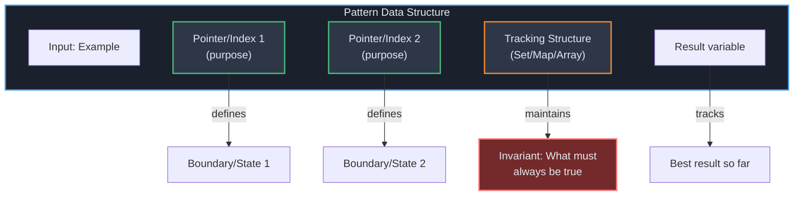
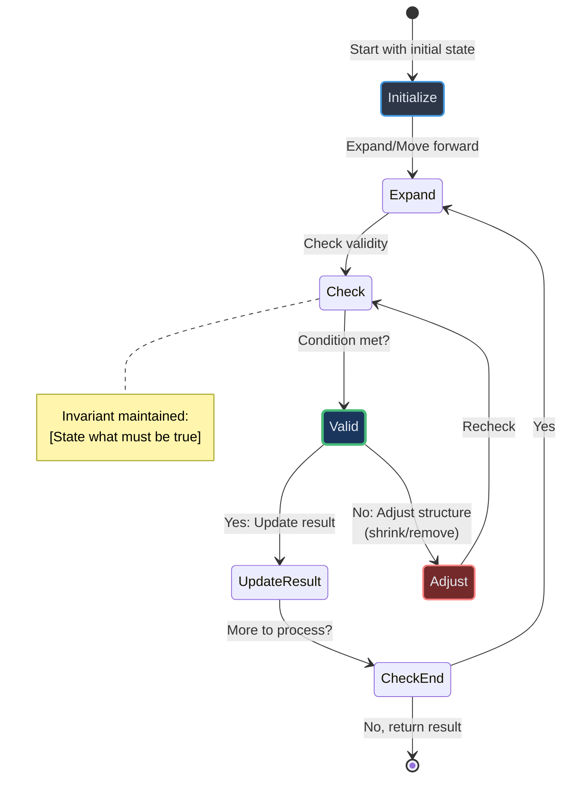
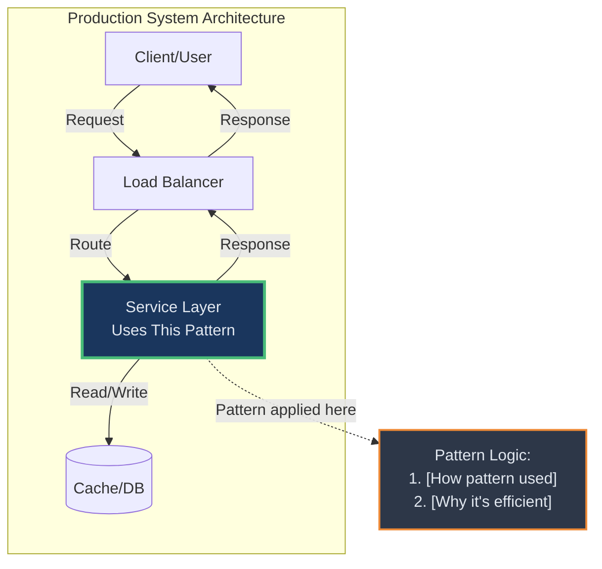
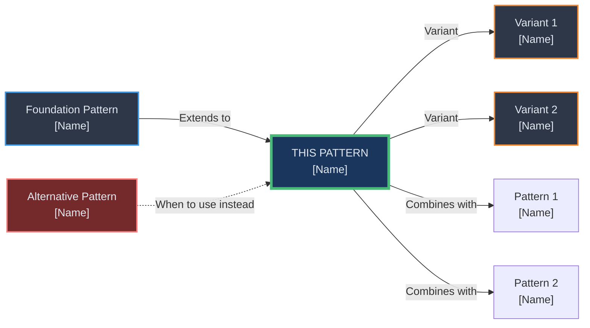

# Pattern Name - One-line Cognitive Trigger

**Category**: Linear Structures | Trees & Graphs | Selection & Search | Combinatorial | Advanced
**Difficulty**: ⭐⭐ Medium
**Recognition Time**: ~5 seconds (in interview)

> **Mental Anchor**: "One-sentence real-world analogy that makes this stick"

---

## Navigation

**[↑ Back to Index](./README.md)** | **[← Previous: Pattern Name](./XX-previous.md)** | **[→ Next: Pattern Name](./XX-next.md)**

**Related Patterns**: [Two Pointers](./02-two-pointers.md) · [Hash Map](./hash-map.md) · [Monotonic Stack](./monotonic-stack.md)

**Deeper Applications**: [Scheduling Problems](../../applications/scheduling/) · [Rate Limiting](../../applications/rate-limiting/)

---

## ⚡ Quick Self-Check (Read This First)

**Before diving deep, can you answer these?**

- [ ] **Recognition**: Can I identify this pattern from problem keywords in 5 seconds?
- [ ] **Structure**: Can I draw/describe what data structures I need without looking?
- [ ] **Behavior**: Can I explain how the pointers/indices move in plain language?
- [ ] **Invariants**: Can I state what must remain true throughout execution?
- [ ] **Complexity**: Do I know the time/space complexity and why?

**✅ All checked?** → Skip to [LeetCode Problems](#-leetcode-practice-problems)
**❌ Any unchecked?** → Read the sections below

---

## 🎤 Interview Communication Template

**If you recognize this pattern in an interview, say this:**

### Step 1: Recognition (5 seconds)
> "I see the keywords '[trigger phrase]' in the problem. This is a **[pattern name]** problem."

### Step 2: Clarify (30 seconds)
> "Just to confirm the requirements:
> - [Clarifying question 1]?
> - [Clarifying question 2]?
> - Input constraints: [size limits, edge cases]?"

### Step 3: Explain Approach (1 minute)
> "I'll use [pattern name] with this structure:
> - [Data structure 1] to track [what]
> - [Data structure 2] for [purpose]
> - The key insight is [main idea]
>
> Time complexity: O(?) because [reason]
> Space complexity: O(?) because [reason]"

### Step 4: Visualize (30 seconds)
Draw on whiteboard:
```
Example input: [1, 2, 3, 4, 5]
                ↑     ↑
                L     R    [Show structure state]
```

### Step 5: Code (3-4 minutes)
Write clean, well-commented code

### Step 6: Test (1-2 minutes)
> "Let me trace through the example:
> - Step 1: [state]
> - Step 2: [state]
> - Final result: [answer] ✓"

### Step 7: Follow-ups
**Common interviewer questions:**
- "What if input has [edge case]?" → [Your answer]
- "Can you optimize space?" → [Your approach]
- "How would this work with streaming data?" → [Adaptation]

---

## 🎯 Pattern Recognition Decision Tree

**Use this to identify when to apply this pattern vs. alternatives:**

```mermaid
flowchart TD
    Start{Problem Type?}

    Start -->|Involves subarray/substring| Contiguous{Must be contiguous?}
    Start -->|Involves pairs/triplets| Pairs[Two Pointers Pattern]
    Start -->|Involves optimization| Opt[DP or Greedy]

    Contiguous -->|Yes| Window{Fixed size or<br/>condition-based?}
    Contiguous -->|No| Subseq[DP - Subsequence]

    Window -->|Fixed size K| ThisPattern["✅ THIS PATTERN<br/>Fixed Window Variant"]
    Window -->|Condition-based| ThisPattern2["✅ THIS PATTERN<br/>Variable Window Variant"]
    Window -->|Static array,<br/>many queries| PrefixSum[Prefix Sum Pattern]

    ThisPattern -.->|Combines with| HashMap[Hash Map<br/>for tracking]
    ThisPattern2 -.->|Combines with| HashMap

    style Start fill:#2d3748,stroke:#4299e1,stroke-width:2px,color:#e2e8f0
    style ThisPattern fill:#1a365d,stroke:#48bb78,stroke-width:4px,color:#e2e8f0
    style ThisPattern2 fill:#1a365d,stroke:#48bb78,stroke-width:4px,color:#e2e8f0
    style Pairs fill:#742a2a,stroke:#fc8181,stroke-width:2px,color:#e2e8f0
    style Subseq fill:#742a2a,stroke:#fc8181,stroke-width:2px,color:#e2e8f0
    style PrefixSum fill:#742a2a,stroke:#fc8181,stroke-width:2px,color:#e2e8f0
```



### Recognition Trigger Table

| Problem Contains | Pattern Triggered | Confidence |
|------------------|-------------------|------------|
| "contiguous subarray" | ✅ THIS PATTERN | 95% |
| "substring" | ✅ THIS PATTERN | 95% |
| "window of size K" | ✅ THIS PATTERN (Fixed) | 99% |
| "at most K distinct" | ✅ THIS PATTERN (Variable) | 90% |
| "maximum/minimum length" + contiguous | ✅ THIS PATTERN (Variable) | 85% |
| "contains all characters" | ✅ THIS PATTERN (Variable) | 80% |

---

## 🧠 The Internal Monologue

**This is how you should think when you see this pattern:**

> "I see the keyword '[trigger phrase]' in the problem. That makes me think: this is asking for [what].
>
> Let me check: Do I need [data structure]? Yes, because [reason].
>
> How will this move? I'll need [pointer/index] that [movement pattern] while maintaining [invariant].
>
> The termination condition is [condition]. Then I return [what].
>
> Time complexity should be [O(?)] because [reason]. Space is [O(?)] because [reason].
>
> Okay, I can code this."

**That's the flow.** If you can't articulate this internal dialogue, you don't understand the pattern yet.

---

## 🔄 The 4-Stage Mental Pipeline

This is the **thinking framework** - how your brain processes pattern → code.

### Stage 1: Problem → Pattern (Recognition)

**Internal dialogue:**

> "I'm reading the problem... I see '[keyword phrase]'.
>
> Okay, '[keyword]' = [meaning]. '[another keyword]' = [constraint I need to maintain].
>
> This feels like [pattern name] - I need to [high-level approach]."

**Trigger mapping:**
- Keywords spotted: `keyword1`, `keyword2`, `keyword3`
- Pattern activated: **THIS PATTERN (variant)**

---

### Stage 2: Pattern → Structure (What Do I Need?)

**Internal dialogue:**

> "What data structures do I need?
>
> - [Structure 1] to track [what]
> - [Structure 2] for [purpose]
> - [Variable] to [track what]
>
> Do I need anything else? [Yes/No and why]."

**Structure visualization:**



---

### Stage 3: Structure → Behavior (How Does It Move?)

**Internal dialogue:**

> "How do these pointers/indices move?
>
> 1. [Initialization step]
> 2. [Main loop action - expand]
> 3. [Validity check]
> 4. [Shrink/adjust action if needed]
> 5. [Update result]
> 6. [Termination condition]
>
> What's the invariant? **[Invariant statement]**
>
> When does it terminate? [Termination condition]"

**Movement visualization:**



**Invariants:**
1. ✅ [Invariant 1 - what must always be true]
2. ✅ [Invariant 2]
3. ✅ [Invariant 3]

---

### Stage 4: Behavior → Code (Expression)

**Internal dialogue:**

> "Now I can code this. I'll write it verbosely first to prove I understand, then I can compress it for interviews."

**Verbose Form** (Proof of understanding):

```python
def pattern_solution_verbose(input_data):
    """
    [Problem description]

    My thought process:
    1. [Step 1 reasoning]
    2. [Step 2 reasoning]
    3. [Step 3 reasoning]

    Time: O(?) - [explanation]
    Space: O(?) - [explanation]
    """
    # Handle edge cases
    if not input_data:
        return [default_value]

    # Initialize structure (from Stage 2)
    pointer_1 = [initial_value]
    pointer_2 = [initial_value]
    tracking_structure = [initial_structure]
    result_variable = [initial_value]

    # Main loop (from Stage 3)
    while [condition]:
        current_element = input_data[pointer_2]

        # Check validity / Adjust if needed
        while [validity_check]:
            # Adjust structure
            [adjustment_logic]

        # Update tracking structure
        [update_logic]

        # Update result
        result_variable = [update_result_logic]

        # Move forward
        pointer_2 += 1

    return result_variable
```

**Terse Form** (Interview ready):

```python
def pattern_solution(input_data):
    """One-line description - O(?) time, O(?) space"""
    if not input_data:
        return [default]

    p1, p2 = 0, 0
    tracker = [structure]
    result = [initial]

    for p2 in range(len(input_data)):
        while [condition]:
            [adjust]

        [update_tracker]
        result = [update_result]

    return result
```

---

## 💭 Thought Narratives: Solving Problems As If First Time

**This is the MOST important section** - how you think through problems you've never seen.

### Problem 1: [Classic Problem Name]

**Reading the problem for the first time:**

> "Okay, I need [what the problem asks for]. Let me think...
>
> '[Keyword 1]' tells me [insight]. '[Keyword 2]' means [constraint].
>
> How would I solve this manually on paper?
> - [Manual approach step 1]
> - [Manual approach step 2]
> - [Aha moment - pattern recognition]
>
> This feels like [pattern name] because [reason]!
>
> What do I need?
> - [Structure 1] to [purpose]
> - [Structure 2] to [purpose]
> - [Variable] to [purpose]
>
> How do they move?
> - [Movement description]
> - [Invariant]
> - [Termination]
>
> Complexity?
> - [Time analysis]
> - [Space analysis]
>
> I can code this now."

**Coding thought process:**

```python
def solve_problem(input_data):
    # "Start with the structure I identified"
    [structure_initialization]

    # "[Explanation of main loop purpose]"
    for [loop_variable] in [range]:
        # "[Explanation of this step]"
        [step_logic]

        # "[Explanation of validity check]"
        while [condition]:
            [adjustment]

        # "[Explanation of update]"
        [update_result]

    return [result]
```

**Post-coding verification:**

> "Let me trace through example: [input]
> - Step 1: [state] ✓
> - Step 2: [state] ✓
> - Step 3: [state] ✓
> - Final result: [output] ✓
>
> Looks correct! Edge cases to consider:
> - [Edge case 1]: [how code handles it]
> - [Edge case 2]: [how code handles it]"

---

### Problem 2: [Another Classic Problem]

**Reading for the first time:**

> "[Initial thought process paragraph - stream of consciousness as you read the problem]
>
> [Aha moment - pattern recognition]
>
> [Mental simulation of approach]
>
> [Key insight that makes solution O(n) instead of O(n²)]
>
> [Structure planning]
>
> Let me code it."

**Coding thought process:**

```python
def solve_problem_2(input_data):
    # "[Thought commentary]"
    [code_with_inline_thought_comments]
```

**Aha moment:**

> "[The key insight that makes this problem click - what makes the pattern powerful here]"

---

### Problem 3: [Hard Variant Problem]

**Reading for the first time:**

> "[More complex thought process - breaking down a hard problem]
>
> [Initial confusion or complexity]
>
> [Breaking it down step by step]
>
> [Recognizing the pattern despite complexity]
>
> [Managing multiple tracking structures]
>
> This is complex, but it's still [pattern name]!"

**Coding thought process:**

```python
def solve_hard_problem(input_data):
    # "[Detailed thought commentary for complex solution]"
    [complex_code_with_explanations]
```

**Key insights:**

> "[What this hard problem teaches about the pattern]
> 1. [Insight 1]
> 2. [Insight 2]
> 3. [Why it's still O(n) despite complexity]"

---

## 🏗️ Production Implementation

### Core Implementation

**When you need this in production code:**

```python
"""
Production-grade [pattern name] implementation.

Use when:
- [Production use case 1]
- [Production use case 2]
- [Production use case 3]
"""

from typing import List, Optional, Callable, TypeVar, Generic
from collections import deque
from dataclasses import dataclass

T = TypeVar('T')


@dataclass
class PatternConfig:
    """Configuration for pattern behavior"""
    param1: Optional[int] = None
    param2: Optional[int] = None
    # Add relevant config parameters


class PatternSolver(Generic[T]):
    """
    Generic pattern implementation for production use.

    Supports:
    - [Feature 1]
    - [Feature 2]
    - [Feature 3]
    """

    def __init__(self, config: PatternConfig):
        self.config = config
        self.state = self._initialize_state()

    def _initialize_state(self):
        """Initialize pattern state"""
        # Implementation
        pass

    def solve(self, input_data: List[T]) -> T:
        """
        Main solving method.

        Args:
            input_data: Input to process

        Returns:
            Processed result

        Time: O(?)
        Space: O(?)
        """
        # Production implementation with:
        # - Error handling
        # - Edge cases
        # - Type hints
        # - Comprehensive docstrings
        pass


# Real-world application example
class RealWorldApplication:
    """
    [Specific production use case].

    Used in:
    - [Company/Product 1]
    - [Company/Product 2]
    """

    def __init__(self, config):
        self.solver = PatternSolver(config)

    def process(self, data):
        """Process data using pattern"""
        return self.solver.solve(data)


# Usage examples
if __name__ == "__main__":
    # Example 1: [Description]
    example_config = PatternConfig(param1=10)
    solver = PatternSolver(example_config)

    result = solver.solve([1, 2, 3, 4, 5])
    print(f"Result: {result}")

    # Example 2: Real-world usage
    app = RealWorldApplication(config=example_config)
    output = app.process(data=[...])
```

---

## 🌍 Real-World Applications

### Application 1: [Production System Name]

**Problem**: [Real-world problem description]

**How pattern applies:**



**Production code concept:**

```python
class ProductionSystem:
    """
    [System description]

    Pattern application:
    - [How pattern is used]
    - [Why it's the right choice]
    - [Performance characteristics]
    """

    def process(self, data):
        # Uses pattern internally
        pass
```

**Used by**: [Company 1], [Company 2], [Open Source Project]

**Metrics**:
- Throughput: [Performance metric]
- Latency: [Latency metric]
- Scale: [Scale metric]

---

### Application 2: [Another Real System]

[Similar structure to Application 1]

---

## 📊 Complexity Analysis

| Variant | Time | Space | Notes |
|---------|------|-------|-------|
| Basic | O(?) | O(?) | [Explanation] |
| Variant 1 | O(?) | O(?) | [When to use] |
| Variant 2 | O(?) | O(?) | [Trade-offs] |
| With [Additional Structure] | O(?) | O(?) | [Cost of enhancement] |

**Why is time complexity O(?)?**
- [Explanation of why each element processed X times]
- [Explanation of operation costs]

**Space complexity breakdown:**
- [Structure 1]: O(?) because [reason]
- [Structure 2]: O(?) because [reason]
- Total: O(?) in worst case

---

## ⚠️ Common Pitfalls & How to Avoid Them

### Pitfall 1: [Common Mistake]

**❌ Wrong thinking:**
> "[What someone might incorrectly think]"

**❌ Wrong code:**
```python
# BUG: [What's wrong]
[incorrect_code]
```

**Why it fails:** [Explanation]

**✅ Correct thinking:**
> "[How to think about it correctly]"

**✅ Correct code:**
```python
# Correct: [What's right]
[correct_code]
```

---

### Pitfall 2: [Another Common Mistake]

[Similar structure]

---

### Pitfall 3: [Edge Case Mistake]

[Similar structure]

---

## 🎯 LeetCode Practice Problems

**Study approach**: Start with Easy, master fundamentals, then progress to Medium/Hard.

### Easy - Build Foundation

| # | Problem | Key Concept | Thought Process Hint |
|---|---------|-------------|---------------------|
| XXX | [Problem Name](https://leetcode.com/problems/...) | [Concept] | "Think: [hint]" |

### Medium - Master Variants

| # | Problem | Key Concept | Thought Process Hint |
|---|---------|-------------|---------------------|
| XXX | [Problem Name](https://leetcode.com/problems/...) | [Concept] | "Key insight: [hint]" |

### Hard - Combine Techniques

| # | Problem | Key Concept | Thought Process Hint |
|---|---------|-------------|---------------------|
| XXX | [Problem Name](https://leetcode.com/problems/...) | [Concept] | "Trick: [hint]" |

---

## 🔗 Related Patterns



**When to use this pattern vs. alternatives:**

| Scenario | Use This Pattern | Use Alternative |
|----------|------------------|-----------------|
| [Condition 1] | ✅ [Reason] | ❌ [Why not alternative] |
| [Condition 2] | ❌ [Why not this] | ✅ Use [Alternative] because [reason] |

**Pattern Relationships:**
- **Foundation**: [Pattern name] - This pattern builds on [foundation]
- **Extensions**: [Pattern name] - Extended version for [use case]
- **Combines with**: [Pattern name] - Often used together for [purpose]

---

## 📚 References & Further Study

**Original Concept**:
- [Paper/Book] - [Author], [Year]
- [Concept origin story]

**Production Examples**:
- [System 1] ([Company]) - [How they use it]
- [System 2] ([Company]) - [How they use it]
- [Open Source Project] - [Implementation details]

**Deep Dives**:
- [Blog post/Article] - [Author]
- [Video tutorial] - [Creator]
- [LeetCode discussion] - [Link]

**Books**:
- *[Book Title]* - [Author], Chapter [X]

---

## 🧭 Navigation

**[↑ Back to Patterns Index](./README.md)**

**← Previous Pattern**: [XX-pattern-name.md](./XX-pattern-name.md)
**→ Next Pattern**: [XX-pattern-name.md](./XX-pattern-name.md)

**🔗 Related Patterns**:
- [Related Pattern 1](./XX-pattern.md) - [Relationship]
- [Related Pattern 2](./XX-pattern.md) - [Relationship]
- [Related Pattern 3](./XX-pattern.md) - [Relationship]

**↓ Deeper - Applications Using This Pattern**:
- [Application Category 1](../../applications/category1/) - [What it demonstrates]
- [Application Category 2](../../applications/category2/) - [What it demonstrates]

**↑ Higher - Conceptual Overview**:
- [Learning Methodology](../overview/learning-methodology.html) - How to study patterns
- [Algorithm Categories](../overview/algo-patterns.md) - Where this fits

**⚡ Quick Jump**:
- [Self-Check Questions](#-quick-self-check-read-this-first)
- [Interview Tips](#-interview-communication-template)
- [Pattern Recognition](#-pattern-recognition-decision-tree)
- [Thought Narratives](#-thought-narratives-solving-problems-as-if-first-time)
- [LeetCode Problems](#-leetcode-practice-problems)
- [Production Code](#-production-implementation)
