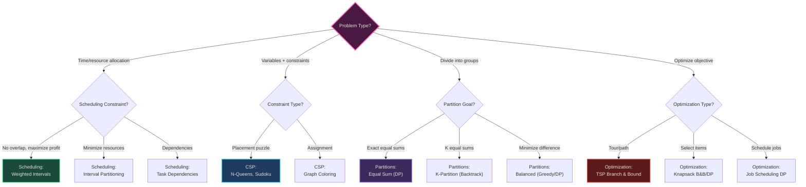
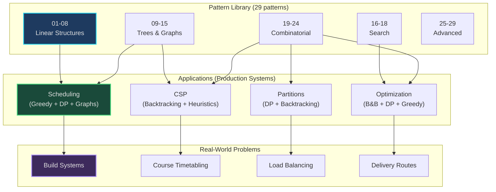

# Applications - Multi-Pattern Real-World Problems

*Where patterns combine to solve production systems*

---

## Philosophy

**Patterns** teach you **how to think**. **Applications** show you **how to build**.

- **[Patterns](../patterns/)** (01-29.md): Mental models, recognition triggers, 4-stage pipeline
- **Applications** (this directory): Production implementations combining multiple patterns

**The difference:**
- A pattern is a lens: *"When I see keywords X, I think structure Y, behavior Z"*
- An application is a system: *"Here's how 3 patterns combine to solve a real problem"*

---

## Application Domains

### 🗓️ [Scheduling](./scheduling/)

**Combines**: Greedy (21), DP (20), Merge Intervals (04), Topological Sort (12), Heaps (17)

**Problems Solved**:
- Weighted Interval Scheduling (DP + Binary Search)
- Interval Partitioning (Greedy + Min-Heap)
- Earliest Deadline First (Greedy Priority)
- Task Dependencies (Topological Sort + Critical Path)
- Meeting Rooms (Merge Intervals)

**Real-World Uses**:
- Project management (PERT/CPM)
- Build systems (Make, Bazel)
- Calendar conflict detection
- Resource allocation

**[→ Learn More](./scheduling/)**

---

### 🧩 [Constraint Satisfaction](./constraint-satisfaction/)

**Combines**: Backtracking (19), CSP (23), DFS (11), Greedy (21), Graph Coloring

**Problems Solved**:
- Arc Consistency (AC-3)
- N-Queens
- Sudoku Solver
- Graph Coloring
- Course Scheduling

**Real-World Uses**:
- Puzzle solving (Sudoku, crosswords)
- Course/exam timetabling
- Register allocation (compilers)
- Frequency assignment (wireless networks)

**[→ Learn More](./constraint-satisfaction/)**

---

### ⚖️ [Partitions](./partitions/)

**Combines**: DP (20), Backtracking (19), Greedy (21), Heaps (17)

**Problems Solved**:
- Subset Sum (DP foundation)
- Equal Sum Partition (DP, 2-way)
- K-Partition (Backtracking, K-way)
- Balanced Partition (Greedy or DP)

**Real-World Uses**:
- Load balancing (servers, workers)
- Fair division (inheritance, teams)
- Resource allocation (equal workload)

**[→ Learn More](./partitions/)**

---

### 🎯 [Optimization](./optimization/)

**Combines**: Branch & Bound (22), DP (20), Backtracking (19), Greedy bounds, Binary Search (16)

**Problems Solved**:
- Traveling Salesman (B&B + MST bounds)
- 0/1 Knapsack (B&B + Fractional bounds)
- Job Scheduling (DP + Binary Search)
- Combination Sum (Backtracking)

**Real-World Uses**:
- Delivery route optimization
- Portfolio selection
- Cargo/resource packing
- Freelancer project selection

**[→ Learn More](./optimization/)**

---

## Pattern to Application Mapping

| Pattern | Used In Applications |
|---------|----------------------|
| [04. Merge Intervals](../patterns/04-merge-intervals.md) | Scheduling (meeting rooms, conflict detection) |
| [11. DFS](../patterns/11-dfs.md) | CSP (backtracking search) |
| [12. Topological Sort](../patterns/12-topological-sort.md) | Scheduling (task dependencies), CSP (course scheduling) |
| [16. Binary Search](../patterns/16-binary-search.md) | Scheduling (compatible intervals), Optimization (job scheduling) |
| [17. Top K / Heap](../patterns/17-top-k-heap.md) | Scheduling (interval partitioning), Partitions (balanced greedy) |
| [19. Backtracking](../patterns/19-backtracking.md) | CSP (N-Queens, Sudoku), Partitions (K-partition), Optimization (combinations) |
| [20. Dynamic Programming](../patterns/20-dynamic-programming.md) | Scheduling (weighted intervals), Partitions (subset sum), Optimization (knapsack) |
| [21. Greedy](../patterns/21-greedy.md) | Scheduling (EDF, intervals), CSP (graph coloring), Partitions (balanced), Optimization (bounds) |
| [22. Branch & Bound](../patterns/22-branch-and-bound.md) | Optimization (TSP, Knapsack) |
| [23. Constraint Satisfaction](../patterns/23-constraint-satisfaction.md) | CSP (all algorithms) |

---

## Application Comparison

| Domain | Difficulty | Patterns Used | Complexity | Production Ready? |
|--------|------------|---------------|------------|-------------------|
| **Scheduling** | Medium | 4-5 patterns | O(n log n) typical | ✅ Yes |
| **CSP** | Medium-Hard | 3-4 patterns | O(d^n) exponential | ✅ Yes (with pruning) |
| **Partitions** | Hard | 3 patterns | O(n × sum) or O(K^n) | ⚠️ Small inputs only |
| **Optimization** | Hard | 4-5 patterns | O(2^n) or O(n!) | ⚠️ Small instances (< 20) |

---

## How to Use This Directory

### For Learning

1. **Start with Patterns**: Understand individual patterns first (01-29)
2. **Choose a Domain**: Pick an application domain that interests you
3. **Read the README**: Each application has comprehensive documentation
4. **Study the Code**: Production implementations with comments
5. **Run Examples**: Each file has usage examples at the bottom
6. **Practice LeetCode**: Related problems listed in each README

### For Building

1. **Identify Your Problem**: Which domain does your problem fit?
2. **Review Similar Algorithms**: Find closest match in applications/
3. **Adapt the Code**: Modify for your specific constraints
4. **Test Edge Cases**: Empty input, cycles, infeasible constraints
5. **Optimize**: Add heuristics, caching, or approximations

### For Interviews

1. **Recognize Multi-Pattern Problems**: "This needs scheduling + graph traversal"
2. **Communicate Patterns**: "I see this uses weighted intervals (DP) combined with..."
3. **Start Simple**: Implement simplest approach first, then optimize
4. **Discuss Trade-offs**: DP vs B&B, Exact vs Approximate

---

## Decision Tree: Which Application Domain?



---

## System Architecture: Pattern → Application Flow



**The Learning Flow:**
1. **Study Patterns**: Understand individual techniques
2. **Explore Applications**: See how patterns combine
3. **Build Systems**: Apply to real-world problems

---

## Code Structure

Each application directory contains:

```
application-name/
├── README.md                   # Comprehensive documentation
├── algorithm1.py               # Production implementation
├── algorithm2.py               # Alternative approach
└── ...
```

**All implementations include:**
- Mental model comments at the top
- Pattern recognition triggers
- Structure and behavior documentation
- Complexity analysis
- Mental trace examples with concrete numbers
- Real-world use cases
- Usage examples at the bottom

---

## Complexity Quick Reference

| Problem | Best Approach | Time | Space | Feasible Input Size |
|---------|---------------|------|-------|---------------------|
| Weighted Intervals | DP + Binary Search | O(n log n) | O(n) | n ≤ 10⁶ |
| Interval Partitioning | Greedy + Heap | O(n log n) | O(n) | n ≤ 10⁶ |
| Task Dependencies | Topological Sort | O(V + E) | O(V) | V ≤ 10⁵ |
| N-Queens | Backtracking | O(N!) | O(N) | N ≤ 15 |
| Sudoku | Backtracking + AC-3 | O(9^m) | O(1) | 9×9 only |
| Graph Coloring | Backtracking | O(k^V) | O(V) | V ≤ 50 |
| Subset Sum | DP | O(n × sum) | O(sum) | sum ≤ 10⁴ |
| K-Partition | Backtracking | O(K^n) | O(K) | n ≤ 20, K ≤ 10 |
| TSP B&B | Branch & Bound | O(n!) | O(n) | n ≤ 20 |
| Knapsack B&B | Branch & Bound | O(2^n) | O(n) | n ≤ 25 |

---

## Learning Path

### Beginner Path
1. Study patterns first: [Patterns README](../patterns/README.md)
2. Start with **Scheduling** (most practical, polynomial algorithms)
3. Practice LeetCode mediums from scheduling domain

### Intermediate Path
1. Move to **Partitions** (DP + backtracking combination)
2. Then **CSP** (backtracking with heuristics)
3. Practice LeetCode hards from these domains

### Advanced Path
1. Master **Optimization** (B&B techniques)
2. Implement custom bounding functions
3. Explore approximation algorithms for large instances

### Interview Prep
1. Focus on **Scheduling** and **Partitions**
2. Know when to use DP vs Backtracking vs Greedy
3. Practice explaining pattern combinations out loud

---

## Common Interview Questions

**From Scheduling:**
- "Schedule meetings in minimum rooms" → Interval Partitioning
- "Maximum profit with non-overlapping jobs" → Weighted Intervals
- "Build order with dependencies" → Task Dependencies

**From CSP:**
- "Solve Sudoku" → Backtracking + AC-3
- "Course schedule with conflicts" → Graph Coloring

**From Partitions:**
- "Can array split into equal sums?" → Equal Sum Partition
- "Divide into K equal groups" → K-Partition

**From Optimization:**
- "Shortest tour visiting all cities" → TSP (usually asked as DP on small graphs)
- "Knapsack with items" → 0/1 Knapsack DP or B&B

---

## File Statistics

| Application | Files | Total Lines | Patterns Used |
|-------------|-------|-------------|---------------|
| Scheduling | 5 algorithms | ~2,000 | 5 patterns |
| CSP | 5 algorithms | ~1,500 | 4 patterns |
| Partitions | 4 algorithms | ~1,200 | 4 patterns |
| Optimization | 4 algorithms | ~1,300 | 5 patterns |
| **Total** | **18 algorithms** | **~6,000** | **29 patterns (combined)** |

---

## Navigation

**[↑ Back to Library 2025](../../README.md)** | **[← Patterns Index](../patterns/README.md)**

**Application Directories**:
- 🗓️ **[Scheduling](./scheduling/)** - Greedy, DP, Graphs (practical, fast algorithms)
- 🧩 **[Constraint Satisfaction](./constraint-satisfaction/)** - Backtracking, CSP, Heuristics
- ⚖️ **[Partitions](./partitions/)** - DP, Backtracking (NP-complete problems)
- 🎯 **[Optimization](./optimization/)** - Branch & Bound, DP (exact solutions for small inputs)

**Quick Links**: [01](../patterns/01-sliding-window.md) · [02](../patterns/02-two-pointers.md) · [04](../patterns/04-merge-intervals.md) · [12](../patterns/12-topological-sort.md) · [17](../patterns/17-top-k-heap.md) · [19](../patterns/19-backtracking.md) · [20](../patterns/20-dynamic-programming.md) · [21](../patterns/21-greedy.md) · [22](../patterns/22-branch-and-bound.md) · [23](../patterns/23-constraint-satisfaction.md) · [24](../patterns/24-partitions.md)

---

## Contributing

To add a new application:

1. Create directory under `applications/`
2. Add production implementations (with mental models)
3. Create comprehensive README (see existing for template)
4. Document which patterns are combined
5. Include real-world use cases and LeetCode problems
6. Update this main README with links

**Quality bar:**
- Mental model comments
- Production-ready code (not just LeetCode snippets)
- Complexity analysis
- Usage examples
- Pattern cross-references
