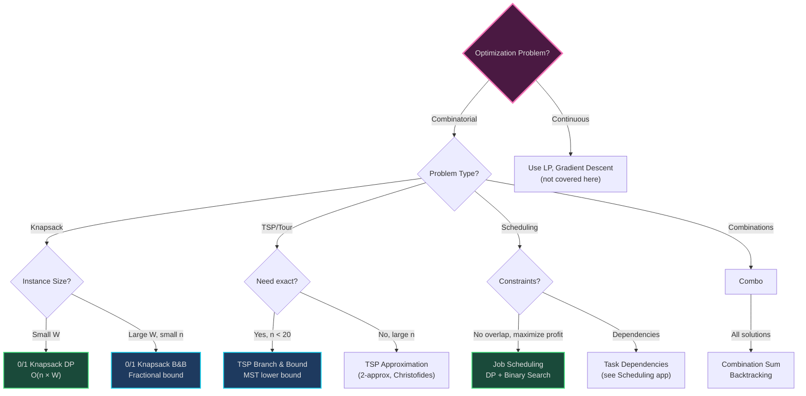
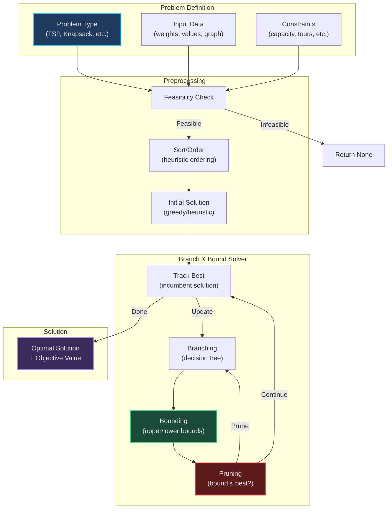

# Optimization Algorithms - Multi-Pattern Applications

*Branch & Bound, Knapsack variants, and combinatorial optimization*

---

## Overview

Optimization problems seek the best solution among many feasible solutions. These NP-hard problems require intelligent search strategies combining exhaustive exploration with pruning.

**Patterns Combined:**
- **[22. Branch & Bound](../../patterns/22-branch-and-bound.md)** - Optimization with bounds
- **[20. Dynamic Programming](../../patterns/20-dynamic-programming.md)** - Optimal substructure
- **[19. Backtracking](../../patterns/19-backtracking.md)** - Exhaustive search
- **[21. Greedy](../../patterns/21-greedy.md)** - Bounding functions
- **[16. Binary Search](../../patterns/16-binary-search.md)** - Weighted intervals

---

## Branch & Bound Framework

**Mental Model**: *"Exploring decision tree, pruning branches that can't beat current best"*

**Core Idea**:
1. **Branch**: Explore decision tree (include/exclude, assign/skip)
2. **Bound**: Calculate upper/lower bound for current branch
3. **Prune**: If bound worse than current best, abandon branch

**Generic Structure**:
```
best_solution = initial_solution
best_value = value(best_solution)

def branch_and_bound(partial_solution):
    If complete solution:
        Update best if better
        Return

    bound = compute_bound(partial_solution)
    If bound <= best_value:  # For maximization
        Return  # Prune branch

    For each decision:
        Make decision
        branch_and_bound(extended_solution)
        Unmake decision (backtrack)
```

**Key Components**:
- **Bounding function**: Must be optimistic (upper bound for max, lower for min)
- **Branching strategy**: Order of exploring decisions
- **Best-first search**: Explore most promising branches first (priority queue)

---

## Algorithms Implemented

### 1. Traveling Salesman Problem (TSP) - Branch & Bound (`tsp_branch_bound.py`)

**Problem**: Find shortest tour visiting all cities exactly once and returning to start.

**Pattern**: **Branch & Bound + MST Lower Bound**

**Mental Model**: *"Delivery route optimization - minimize total distance"*

**Structure:**
- Partial tour: visited cities so far
- Remaining cities: unvisited
- Bound: current path cost + MST of remaining cities

**Bounding Function**:
```
Lower Bound = current_path_cost + MST(remaining_cities) + min_edge_to_connect
```

**Why MST works**: MST is lower bound for TSP because TSP tour is a spanning tree + 1 edge.

**Behavior:**
```
def tsp_branch_bound(current_city, visited, cost):
    If all cities visited:
        Return cost + distance(current_city, start)

    bound = cost + mst_cost(remaining) + min_outgoing_edge(current_city)

    If bound >= best_cost:
        Return  # Prune

    For each unvisited neighbor:
        visited.add(neighbor)
        new_cost = tsp_branch_bound(neighbor, visited, cost + edge_cost)
        visited.remove(neighbor)

        best_cost = min(best_cost, new_cost)
```

**Complexity**: O(n!) worst case, but pruning drastically reduces search space

**Real-World Uses**:
- Delivery route optimization (UPS, Amazon)
- Circuit board drilling (minimize tool movement)
- DNA sequencing (shortest superstring)

**Related LeetCode**: Similar to [Shortest Path Visiting All Nodes (847)](https://leetcode.com/problems/shortest-path-visiting-all-nodes/)

**Code Highlights**:
```python
def tsp_branch_bound(graph, start=0):
    n = len(graph)
    visited = {start}
    best_cost = float('inf')

    def compute_bound(current, visited, current_cost):
        # MST of unvisited cities
        remaining = set(range(n)) - visited
        if not remaining:
            return current_cost + graph[current][start]

        mst_cost = minimum_spanning_tree(graph, remaining)
        min_edge = min(graph[current][city] for city in remaining)

        return current_cost + mst_cost + min_edge

    def branch_bound(current, visited, cost):
        nonlocal best_cost

        if len(visited) == n:
            total = cost + graph[current][start]
            best_cost = min(best_cost, total)
            return

        bound = compute_bound(current, visited, cost)
        if bound >= best_cost:
            return  # Prune

        for next_city in range(n):
            if next_city not in visited:
                visited.add(next_city)
                branch_bound(next_city, visited, cost + graph[current][next_city])
                visited.remove(next_city)

    branch_bound(start, visited, 0)
    return best_cost
```

---

### 2. 0/1 Knapsack - Branch & Bound (`knapsack_01_bnb.py`)

**Problem**: Select items to maximize value without exceeding weight capacity.

**Pattern**: **Branch & Bound + Greedy Fractional Bound**

**Mental Model**: *"Packing suitcase - maximize value of items within weight limit"*

**Structure:**
- Decision: include or exclude each item
- Bound: current value + fractional knapsack on remaining items

**Bounding Function**:
```
Upper Bound = current_value + greedy_fractional(remaining_items, remaining_capacity)

Greedy fractional: Sort by value/weight ratio, take items (or fractions) greedily
```

**Why fractional bound works**:
- Fractional knapsack is upper bound for 0/1 knapsack
- Solvable greedily in O(n log n)
- Optimistic: allows taking fractions (not allowed in 0/1)

**Behavior:**
```
def knapsack_bnb(items, capacity):
    Sort items by value/weight ratio (descending)

    def bound(current_value, current_weight, index):
        If current_weight >= capacity:
            Return 0

        bound_value = current_value
        remaining_capacity = capacity - current_weight

        For each remaining item (sorted by ratio):
            If item.weight <= remaining_capacity:
                bound_value += item.value
                remaining_capacity -= item.weight
            Else:
                # Take fraction
                bound_value += (remaining_capacity / item.weight) * item.value
                Break

        Return bound_value

    def branch_bound(index, current_value, current_weight):
        If index == len(items):
            Return current_value

        # Include item
        if current_weight + items[index].weight <= capacity:
            include_bound = bound(current_value + items[index].value,
                                  current_weight + items[index].weight,
                                  index + 1)

            if include_bound > best_value:
                include_value = branch_bound(index + 1,
                                            current_value + items[index].value,
                                            current_weight + items[index].weight)

        # Exclude item
        exclude_bound = bound(current_value, current_weight, index + 1)
        if exclude_bound > best_value:
            exclude_value = branch_bound(index + 1, current_value, current_weight)

        Return max(include_value, exclude_value)
```

**Complexity**: O(2^n) worst case, but pruning reduces to practical time for n ≤ 25

**Real-World Uses**:
- Resource allocation (budget constraints)
- Portfolio optimization (investment limits)
- Cargo loading (ship/truck capacity)

**Related LeetCode**: [Knapsack problems (various)](https://leetcode.com/tag/knapsack/)

**DP vs Branch & Bound**:
- **DP**: Better for small capacity (O(n × W))
- **B&B**: Better for large capacity but small n (pruning helps)
- **Hybrid**: Use DP for small instances, B&B for large W

---

### 3. Maximum Profit Job Scheduling (`max_profit_job_schedule.py`)

**Problem**: Schedule non-overlapping jobs to maximize profit (weighted interval scheduling).

**Pattern**: **DP + Binary Search** (see also [Scheduling](../scheduling/))

**Mental Model**: *"Freelancer choosing projects - maximize revenue"*

**Structure:**
- Sort jobs by end time
- DP[i] = max profit using jobs 0..i
- Binary search to find compatible past jobs

**Behavior:**
```
Sort jobs by end time

def find_compatible(i):
    Binary search for latest job ending before jobs[i].start

For i in 0..n-1:
    option_skip = dp[i - 1]
    compatible = find_compatible(i)
    option_take = jobs[i].profit + dp[compatible]

    dp[i] = max(option_skip, option_take)
```

**Complexity**: O(n log n) time, O(n) space

**Real-World Uses**:
- Consultant/freelancer scheduling
- Event booking with variable pricing
- Resource rental optimization

**Related LeetCode**: [1235. Maximum Profit in Job Scheduling](https://leetcode.com/problems/maximum-profit-in-job-scheduling/)

**Code Highlights**:
```python
def job_scheduling(startTime, endTime, profit):
    jobs = sorted(zip(startTime, endTime, profit), key=lambda x: x[1])
    n = len(jobs)

    dp = [0] * n
    dp[0] = jobs[0][2]

    def find_latest_compatible(i):
        # Binary search for latest job ending before jobs[i].start
        start_i = jobs[i][0]
        left, right = 0, i - 1
        result = -1

        while left <= right:
            mid = (left + right) // 2
            if jobs[mid][1] <= start_i:
                result = mid
                left = mid + 1
            else:
                right = mid - 1

        return result

    for i in range(1, n):
        option_skip = dp[i - 1]
        compatible_idx = find_latest_compatible(i)
        option_take = jobs[i][2] + (dp[compatible_idx] if compatible_idx != -1 else 0)

        dp[i] = max(option_skip, option_take)

    return dp[-1]
```

---

### 4. Combination Sum (`combo-sum.py`)

**Problem**: Find all combinations that sum to target (elements can repeat).

**Pattern**: **Backtracking + Pruning**

**Mental Model**: *"Making change - how many ways to make exact amount?"*

**Structure:**
- Candidates: available numbers
- Current combination
- Remaining target

**Behavior:**
```
def combination_sum(candidates, target, start=0, current=[]):
    If target == 0:
        solutions.append(current.copy())
        Return

    If target < 0:
        Return  # Prune

    For i in start..len(candidates):
        current.append(candidates[i])
        # Allow reuse: start from i (not i+1)
        combination_sum(candidates, target - candidates[i], i, current)
        current.pop()  # Backtrack
```

**Complexity**: O(2^(target/min)) in worst case

**Real-World Uses**:
- Coin change problems
- Resource allocation combinations
- Recipe/ingredient combinations

**Related LeetCode**:
- [39. Combination Sum](https://leetcode.com/problems/combination-sum/)
- [40. Combination Sum II](https://leetcode.com/problems/combination-sum-ii/)

---

## Algorithm Comparison Matrix

| Algorithm | Pattern | Time (Worst) | Time (Practical) | Space | Optimal? | Use When |
|-----------|---------|--------------|------------------|-------|----------|----------|
| **TSP B&B** | B&B + MST | O(n!) | O(2^n) with pruning | O(n) | ✅ Yes | Small n (< 20), need exact |
| **Knapsack B&B** | B&B + Fractional | O(2^n) | O(n × W) DP better | O(n) | ✅ Yes | Large W, small n |
| **Job Scheduling** | DP + Binary Search | O(n log n) | O(n log n) | O(n) | ✅ Yes | Non-overlapping intervals |
| **Combo Sum** | Backtracking | O(2^target) | With pruning | O(target) | ✅ Yes (all solutions) | Find all combinations |

---

## Branch & Bound vs Alternatives

| Technique | When to Use | Advantages | Disadvantages |
|-----------|-------------|------------|---------------|
| **Branch & Bound** | NP-hard optimization, need exact solution | ✅ Optimal<br/>✅ Pruning reduces search | ❌ Exponential worst case<br/>❌ Complex implementation |
| **Dynamic Programming** | Optimal substructure + overlapping subproblems | ✅ Polynomial for some problems<br/>✅ Simpler | ❌ Only works if DP state fits memory<br/>❌ Pseudo-polynomial for some |
| **Greedy** | Locally optimal → globally optimal | ✅ Fast (polynomial)<br/>✅ Simple | ❌ Not always optimal<br/>❌ Hard to prove correctness |
| **Approximation** | Large instances, near-optimal acceptable | ✅ Polynomial time<br/>✅ Provable approximation ratio | ❌ Not exact<br/>❌ May not be close enough |

---

## Decision Tree: Which Optimization Algorithm?



---

## System Architecture: Optimization Solver



---

## Usage Examples

### TSP Branch & Bound

```python
from tsp_branch_bound import tsp_branch_bound

# Distance matrix
graph = [
    [0, 10, 15, 20],
    [10, 0, 35, 25],
    [15, 35, 0, 30],
    [20, 25, 30, 0]
]

min_cost, tour = tsp_branch_bound(graph)
print(f"Minimum tour cost: {min_cost}")
print(f"Tour: {tour}")
# Output: Minimum tour cost: 80
# Tour: [0, 1, 3, 2, 0]
```

### 0/1 Knapsack Branch & Bound

```python
from knapsack_01_bnb import knapsack_branch_bound

items = [
    {'weight': 2, 'value': 12},
    {'weight': 1, 'value': 10},
    {'weight': 3, 'value': 20},
    {'weight': 2, 'value': 15}
]
capacity = 5

max_value, selected = knapsack_branch_bound(items, capacity)
print(f"Max value: {max_value}")
print(f"Selected items: {selected}")
# Output: Max value: 37 (items 0, 1, 2)
```

### Job Scheduling

```python
from max_profit_job_schedule import job_scheduling

startTime = [1, 2, 3, 3]
endTime = [3, 4, 5, 6]
profit = [50, 10, 40, 70]

max_profit = job_scheduling(startTime, endTime, profit)
print(f"Maximum profit: {max_profit}")
# Output: 120 (jobs 0 and 3)
```

---

## Learning Path

1. **Foundation**: Study [22. Branch & Bound](../../patterns/22-branch-and-bound.md)
2. **DP baseline**: Understand DP solutions first (Knapsack DP, Floyd-Warshall for TSP)
3. **Bounding functions**: Learn greedy fractional knapsack, MST
4. **Start simple**: 0/1 Knapsack B&B (clear bounding function)
5. **Complex**: TSP B&B (more intricate bounds)
6. **Compare**: When is B&B better than DP or greedy?

**LeetCode Practice**:
- [1235. Maximum Profit in Job Scheduling](https://leetcode.com/problems/maximum-profit-in-job-scheduling/)
- [39. Combination Sum](https://leetcode.com/problems/combination-sum/)
- [Knapsack problems](https://leetcode.com/tag/knapsack/)

---

## Advanced Topics

**Best-First Branch & Bound**:
- Use priority queue instead of DFS
- Explore most promising branches first (by bound value)
- Often finds optimal faster

**Parallel Branch & Bound**:
- Distribute branches across workers
- Shared best solution (requires synchronization)
- Speedup depends on problem structure

**Hybrid Approaches**:
- Use DP for small subproblems
- B&B for large instances
- Greedy to generate initial bounds

---

## Navigation

**[↑ Back to Applications](../README.md)** | **[← Patterns Index](../../patterns/README.md)**

**Related Patterns**: [16](../../patterns/16-binary-search.md) · [19](../../patterns/19-backtracking.md) · [20](../../patterns/20-dynamic-programming.md) · [21](../../patterns/21-greedy.md) · [22](../../patterns/22-branch-and-bound.md)

**Related Applications**: [Scheduling](../scheduling/) · [Partitions](../partitions/)
