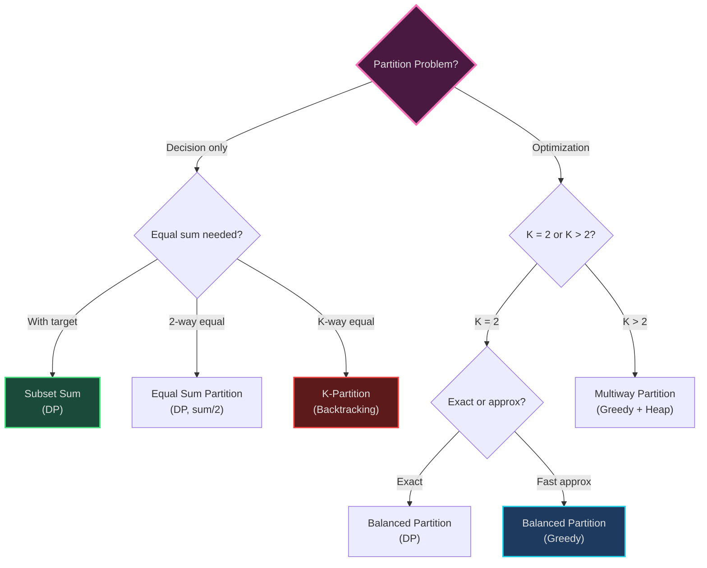
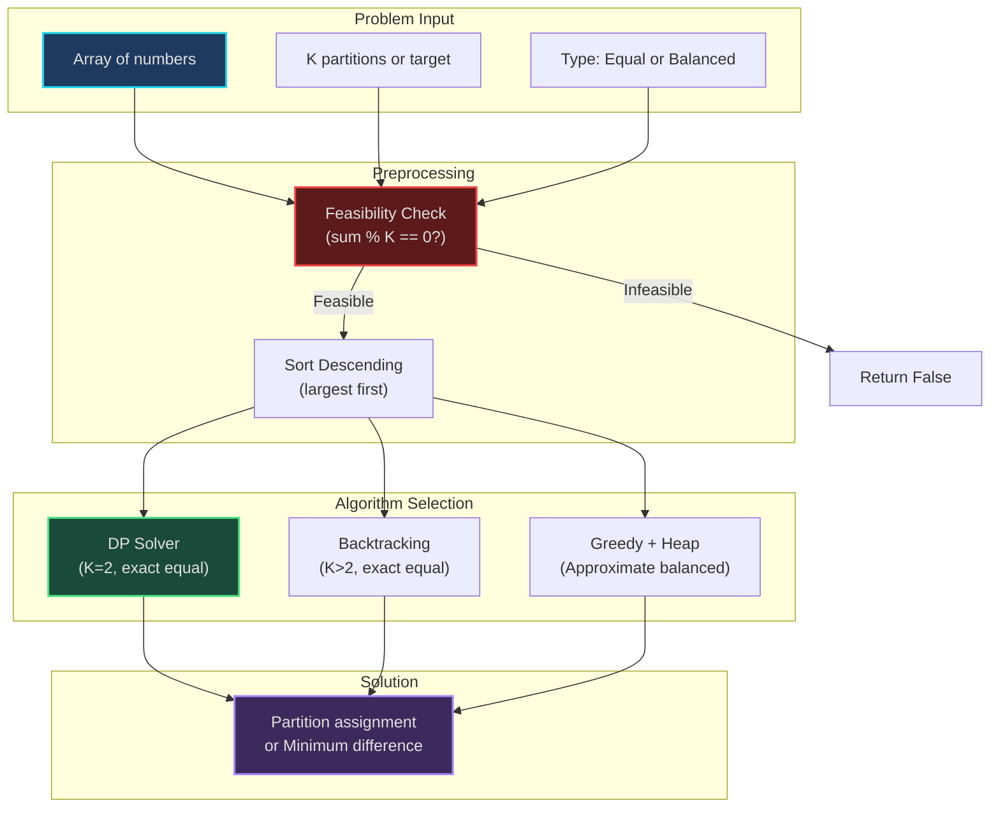

# Partition Problems - Multi-Pattern Applications

*Dividing sets into balanced or equal-sum subsets using DP, Backtracking, and Greedy approaches*

---

## Overview

Partition problems involve dividing a set of elements into subsets that satisfy certain criteria (equal sum, balanced load, etc.). These are NP-complete problems in general, but specific cases have efficient solutions.

**Patterns Combined:**
- **[20. Dynamic Programming](../../patterns/20-dynamic-programming.md)** - Subset sum (equal partition)
- **[19. Backtracking](../../patterns/19-backtracking.md)** - K-way partitioning
- **[21. Greedy](../../patterns/21-greedy.md)** - Balanced partitioning
- **[17. Top K / Heap](../../patterns/17-top-k-heap.md)** - Greedy partition balancing
- **[24. Partitions](../../patterns/24-partitions.md)** - Pattern overview

---

## Problem Hierarchy

```
Partition Problems
├── Subset Sum (Decision)
│   └── Equal Sum Partition (2-way, exact)
│       └── K-Partition (K-way, exact)
└── Balanced Partition (2-way, minimize difference)
    └── Multiway Number Partitioning (K-way, minimize max)
```

---

## Algorithms Implemented

### 1. Subset Sum (`subset_sum.py`)

**Problem**: Given set and target sum, can we select a subset that sums to target?

**Pattern**: **Dynamic Programming (0/1 Knapsack variant)**

**Mental Model**: *"Can I make exact change with some of these coins?"*

**Structure:**
- DP table: `dp[sum]` = can we make this sum?
- Transition: `dp[sum] = dp[sum] OR dp[sum - num]` for each num
- Iterate sums backwards to avoid reusing elements

**Behavior:**
```
dp[0] = True  # Empty subset sums to 0

For each number in array:
    For sum from target down to number:
        If dp[sum - number]:
            dp[sum] = True

Return dp[target]
```

**Complexity**: O(n × target) time, O(target) space

**Real-World Uses**:
- Financial: Can we pay exact amount with available bills?
- Resource allocation: Can we allocate exactly X GB with these files?
- Scheduling: Can tasks fit exactly in time window?

**Related LeetCode**:
- [416. Partition Equal Subset Sum](https://leetcode.com/problems/partition-equal-subset-sum/)
- [698. Partition to K Equal Sum Subsets](https://leetcode.com/problems/partition-to-k-equal-sum-subsets/)

**Key Insight**: Subset sum is weakly NP-complete (pseudo-polynomial solution via DP).

**Code Highlights**:
```python
def subset_sum_dp(nums, target):
    dp = [False] * (target + 1)
    dp[0] = True

    for num in nums:
        # Iterate backwards to avoid reusing same element
        for sum_val in range(target, num - 1, -1):
            if dp[sum_val - num]:
                dp[sum_val] = True

    return dp[target]
```

**Backtracking Alternative** (when you need actual subset):
```python
def subset_sum_backtracking(nums, target, index=0, current_sum=0):
    if current_sum == target:
        return True
    if index == len(nums) or current_sum > target:
        return False

    # Include nums[index]
    if subset_sum_backtracking(nums, target, index + 1, current_sum + nums[index]):
        return True

    # Exclude nums[index]
    return subset_sum_backtracking(nums, target, index + 1, current_sum)
```

---

### 2. Equal Sum Partition (`equal_sum_partition.py`)

**Problem**: Can we partition array into 2 subsets with equal sum?

**Pattern**: **Subset Sum (DP)**

**Mental Model**: *"Splitting inheritance fairly - can two heirs get exactly equal amounts?"*

**Structure:**
- Reduce to subset sum: target = sum(array) / 2
- If sum is odd, impossible
- Find if subset with sum = target exists

**Behavior:**
```
total = sum(array)

If total is odd:
    Return False  # Can't split odd number equally

target = total / 2
Return subset_sum(array, target)
```

**Complexity**: O(n × sum) time, O(sum) space

**Real-World Uses**:
- Fair division of resources
- Load balancing (split workload equally)
- Team selection (equal skill levels)

**Related LeetCode**: [416. Partition Equal Subset Sum](https://leetcode.com/problems/partition-equal-subset-sum/)

**Mental Trace**:
```
array = [1, 5, 11, 5]
sum = 22, target = 11

DP:
  dp[0] = True
  Add 1: dp[1] = True
  Add 5: dp[5], dp[6] = True
  Add 11: dp[11], dp[12], dp[16] = True ✓
  Add 5: (already have dp[11])

Result: True (subsets: {1,5,5} and {11})
```

---

### 3. K-Partition (`k_partition.py`)

**Problem**: Partition array into K subsets with equal sum.

**Pattern**: **Backtracking with Pruning**

**Mental Model**: *"Dividing tasks among K workers so each has equal workload"*

**Structure:**
- K buckets (subset sums)
- Target sum per bucket = sum(array) / K
- Backtracking: try assigning each element to each bucket

**Behavior:**
```
If sum(array) % K != 0:
    Return False  # Can't divide evenly

target = sum(array) / K
buckets = [0] * K

def backtrack(index):
    If index == len(array):
        Return all(bucket == target for bucket in buckets)

    For bucket in buckets:
        If buckets[bucket] + array[index] <= target:
            buckets[bucket] += array[index]
            If backtrack(index + 1):
                Return True
            buckets[bucket] -= array[index]  # Backtrack

    Return False
```

**Complexity**: O(K^n) worst case (exponential)

**Optimizations**:
1. **Sort descending**: Place largest elements first (fail faster)
2. **Skip duplicate buckets**: If buckets[i] == buckets[j], skip j
3. **Early termination**: If bucket sum exceeds target, skip

**Real-World Uses**:
- Task assignment (equal workload per worker)
- Server load balancing (equal requests per server)
- Team formation (equal skill per team)

**Related LeetCode**: [698. Partition to K Equal Sum Subsets](https://leetcode.com/problems/partition-to-k-equal-sum-subsets/)

**Code Highlights**:
```python
def can_partition_k_subsets(nums, k):
    total = sum(nums)
    if total % k != 0:
        return False

    target = total // k
    nums.sort(reverse=True)  # Optimization: largest first

    if nums[0] > target:
        return False

    buckets = [0] * k

    def backtrack(index):
        if index == len(nums):
            return all(bucket == target for bucket in buckets)

        for i in range(k):
            # Optimization: skip duplicate buckets
            if i > 0 and buckets[i] == buckets[i - 1]:
                continue

            if buckets[i] + nums[index] <= target:
                buckets[i] += nums[index]
                if backtrack(index + 1):
                    return True
                buckets[i] -= nums[index]

        return False

    return backtrack(0)
```

---

### 4. Balanced Partition (`balanced_partition.py`)

**Problem**: Partition into 2 subsets minimizing difference between sums.

**Pattern**: **Greedy + Heap** OR **DP**

**Mental Model**: *"Load balancing - minimize difference between two servers' workloads"*

**Greedy Approach (Approximate)**:
```
Sort array descending
heap = [(0, 0), (0, 1)]  # (sum, partition_id)

For each number:
    Pop smallest partition
    Add number to partition
    Push updated sum back to heap

Difference = |heap[0][0] - heap[1][0]|
```

**Complexity**: O(n log n) time, O(1) space

**DP Approach (Exact)**:
```
Find all possible subset sums (DP)
Choose sum closest to total/2
Difference = |sum - (total - sum)|
```

**Complexity**: O(n × sum) time, O(sum) space

**Real-World Uses**:
- Load balancing (minimize imbalance)
- Fair division (minimize unfairness)
- Workload distribution

**Related LeetCode**:
- [1049. Last Stone Weight II](https://leetcode.com/problems/last-stone-weight-ii/)
- [2035. Partition Array Into Two Arrays to Minimize Sum Difference](https://leetcode.com/problems/partition-array-into-two-arrays-to-minimize-sum-difference/)

**Code Highlights**:
```python
# Greedy approach
def balanced_partition_greedy(nums):
    nums.sort(reverse=True)
    heap = [(0, 0), (0, 1)]  # (sum, partition_id)

    for num in nums:
        current_sum, partition_id = heapq.heappop(heap)
        heapq.heappush(heap, (current_sum + num, partition_id))

    sum1, _ = heapq.heappop(heap)
    sum2, _ = heapq.heappop(heap)

    return abs(sum1 - sum2)

# DP approach (exact)
def balanced_partition_dp(nums):
    total = sum(nums)
    target = total // 2

    # Find all reachable sums up to target
    dp = [False] * (target + 1)
    dp[0] = True

    for num in nums:
        for s in range(target, num - 1, -1):
            if dp[s - num]:
                dp[s] = True

    # Find largest reachable sum <= target
    for s in range(target, -1, -1):
        if dp[s]:
            return total - 2 * s  # Difference

    return total
```

---

## Problem Comparison Matrix

| Problem | Approach | Exact? | Complexity | Use When |
|---------|----------|--------|------------|----------|
| **Subset Sum** | DP | ✅ Yes | O(n × target) | Decision problem (yes/no) |
| **Equal Sum Partition** | DP (subset sum) | ✅ Yes | O(n × sum) | 2-way, must be exactly equal |
| **K-Partition** | Backtracking | ✅ Yes | O(K^n) | K-way, must be exactly equal |
| **Balanced Partition (Greedy)** | Greedy + Heap | ❌ Approx | O(n log n) | Fast approximation, minimize difference |
| **Balanced Partition (DP)** | DP | ✅ Yes | O(n × sum) | 2-way, minimize difference (exact) |

---

## Decision Tree: Which Algorithm to Use?



---

## Complexity Analysis

**Why NP-Complete?**

Partition problems are NP-complete because:
1. **Decision version**: Can we partition into K equal-sum subsets?
2. **Reduction**: Subset Sum reduces to Partition (set target = sum/2)
3. **No polynomial solution known** for arbitrary K

**Pseudo-Polynomial DP**:
- Subset sum has O(n × target) solution
- "Pseudo-polynomial" because complexity depends on target value, not input size
- For small targets, DP is practical

**Backtracking Optimizations**:
- **Sorting**: Place large elements first (fail faster)
- **Pruning**: Skip buckets exceeding target
- **Symmetry breaking**: Skip duplicate bucket states
- **Typical speedup**: 10-100x on real inputs

---

## System Architecture: Partition Solver



---

## Usage Examples

### Subset Sum

```python
from subset_sum import subset_sum_dp

nums = [3, 34, 4, 12, 5, 2]
target = 9

result = subset_sum_dp(nums, target)
print(f"Can make {target}: {result}")  # True (4 + 5 = 9)
```

### Equal Sum Partition

```python
from equal_sum_partition import can_partition

nums = [1, 5, 11, 5]
result = can_partition(nums)
print(f"Can partition equally: {result}")  # True ({1,5,5} and {11})
```

### K-Partition

```python
from k_partition import can_partition_k_subsets

nums = [4, 3, 2, 3, 5, 2, 1]
k = 4
result = can_partition_k_subsets(nums, k)
print(f"Can partition into {k} equal subsets: {result}")
# True (target=5 each: {5}, {4,1}, {3,2}, {3,2})
```

### Balanced Partition

```python
from balanced_partition import balanced_partition_greedy, balanced_partition_dp

nums = [1, 2, 3, 4, 5]

# Greedy (fast approximation)
diff_greedy = balanced_partition_greedy(nums)
print(f"Greedy difference: {diff_greedy}")  # Typically good

# DP (exact minimum)
diff_exact = balanced_partition_dp(nums)
print(f"Exact minimum difference: {diff_exact}")  # 1 ({5,3,2} vs {4,1})
```

---

## Learning Path

1. **Foundation**: Study [20. Dynamic Programming](../../patterns/20-dynamic-programming.md)
2. **Start simple**: Subset Sum (DP)
3. **Special case**: Equal Sum Partition (subset sum with target = sum/2)
4. **Generalize**: K-Partition (backtracking)
5. **Approximate**: Balanced Partition (greedy)
6. **Compare**: DP vs Backtracking vs Greedy trade-offs

**LeetCode Practice**:
- [416. Partition Equal Subset Sum](https://leetcode.com/problems/partition-equal-subset-sum/)
- [698. Partition to K Equal Sum Subsets](https://leetcode.com/problems/partition-to-k-equal-sum-subsets/)
- [1049. Last Stone Weight II](https://leetcode.com/problems/last-stone-weight-ii/)

---

## Navigation

**[↑ Back to Applications](../README.md)** | **[← Patterns Index](../../patterns/README.md)**

**Related Patterns**: [17](../../patterns/17-top-k-heap.md) · [19](../../patterns/19-backtracking.md) · [20](../../patterns/20-dynamic-programming.md) · [21](../../patterns/21-greedy.md) · [24](../../patterns/24-partitions.md)

**Related Applications**: [Optimization](../optimization/) · [Scheduling](../scheduling/)
