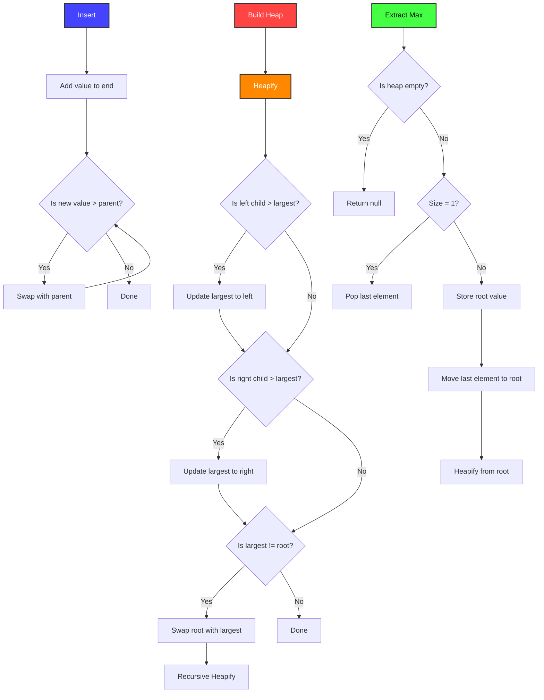

# Max Heap
Here's a simple example of a max-heap in Python.
Converting to a min-heap is as simple as negating the values.



```python
# Define functions for heap operations
def heapify(arr, n, i):
    largest = i  # Initialize largest as root
    left = 2 * i + 1  # Left child
    right = 2 * i + 2  # Right child

    # Check if left child exists and is larger than root
    if left < n and arr[left] > arr[largest]:
        largest = left

    # Check if right child exists and is larger than root
    if right < n and arr[right] > arr[largest]:
        largest = right

    # Change root if needed
    if largest != i:
        arr[i], arr[largest] = arr[largest], arr[i]  # Swap
        heapify(arr, n, largest)

def build_heap(arr):
    n = len(arr)

    # Build a max-heap by calling heapify on non-leaf nodes
    for i in range(n // 2 - 1, -1, -1):
        heapify(arr, n, i)

def insert(arr, value):
    arr.append(value)
    n = len(arr)
    i = n - 1

    # Maintain the max-heap property by "bubbling up" the new element
    while i > 0 and arr[i] > arr[(i - 1) // 2]:
        arr[i], arr[(i - 1) // 2] = arr[(i - 1) // 2], arr[i]
        i = (i - 1) // 2

def extract_max(arr):
    n = len(arr)
    if n == 0:
        return None
    if n == 1:
        return arr.pop()

    # Replace the root with the last element and heapify down
    max_val = arr[0]
    arr[0] = arr.pop()
    heapify(arr, len(arr), 0)
    return max_val

# Example usage:
arr = [4, 10, 3, 5, 1]
build_heap(arr)
print("Max Heap:", arr)  # Output: Max Heap: [10, 5, 3, 4, 1]

insert(arr, 15)
print("Max Heap after Insert:", arr)  # Output: Max Heap after Insert: [15, 10, 3, 4, 1, 5]

max_val = extract_max(arr)
print("Extracted Max Value:", max_val)  # Output: Extracted Max Value: 15
print("Max Heap after Extraction:", arr)  # Output: Max Heap after Extraction: [10, 5, 3, 4, 1]
```

In this example, we have defined functions for heap operations like `heapify`, `build_heap`, `insert`, and `extract_max`. This code demonstrates building a max-heap, inserting elements, and extracting the maximum element from the heap.

If you don't want to boilerplate a heap you can use the built-in python library function `heapq`:

```python
import heapq

# Create an empty list to represent a max-heap
max_heap = []

# Insert elements into the max-heap (negate the values)
heapq.heappush(max_heap, -4)
heapq.heappush(max_heap, -10)
heapq.heappush(max_heap, -3)
heapq.heappush(max_heap, -5)
heapq.heappush(max_heap, -1)

# Extract the maximum element from the max-heap (negate it to get the original value)
max_element = -heapq.heappop(max_heap)

print("Max Element:", max_element)  # Output: Max Element: 10
```
This code snippet demonstrates how to use the `heapq` library to create a max-heap and extract the maximum element from it. Note that we negate the values before inserting them into the heap and negate the maximum element after extracting it to get the original value.

