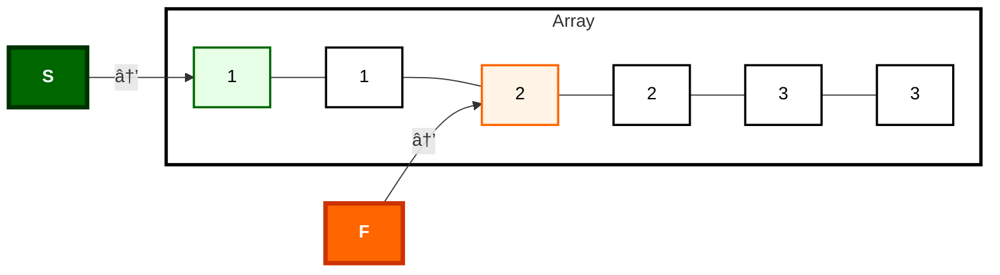

Let's do **Two Pointers** — it's actually simpler than Sliding Window but incredibly versatile. Same linear structure, but with different choreography patterns.[**View Two Pointers Deep Dive**](computer:///mnt/user-data/outputs/two-pointers.html)

---

## What's in This One

### Three Variants Covered

| Variant                | Visual    | Use Case                                       |
| ---------------------- | --------- | ---------------------------------------------- |
| **Opposite Direction** | `L → ↠R` | Sorted array, find pair, palindrome, container |
| **Same Direction**     | `S → F →` | In-place modification, remove/move elements    |
| **Three Pointers**     | `L M → R` | Partition into 3 regions (Dutch Flag)          |

### 8 Classic Problems

| #   | Problem              | Variant           | Key Insight                        |
| --- | -------------------- | ----------------- | ---------------------------------- |
| 1   | Two Sum II           | Opposite          | Sum too small → L++, too big → R-- |
| 2   | Valid Palindrome     | Opposite          | Move BOTH pointers each step       |
| 3   | Container With Water | Opposite          | Move the SHORTER wall              |
| 4   | 3Sum                 | Anchor + Opposite | Fix one, Two Sum II for rest       |
| 5   | Remove Duplicates    | Same Dir          | Write only when new value          |
| 6   | Move Zeroes          | Same Dir          | SWAP instead of write              |
| 7   | Sort Colors          | Three Ptr         | Don't advance mid after high swap! |
| 8   | Trapping Rain Water  | Opposite + Max    | Process side with smaller max      |

### Animation Modes
The animation switches between 4 different problems:
- Two Sum II (opposite)
- Container With Water (opposite)
- Remove Duplicates (same direction)
- Sort Colors (three pointers)

---

## The Mental Model

**TWO POINTERS = Eliminate search space intelligently**

### Opposite Direction

*Converge inward based on comparison*

### Same Direction

*Fast scans, slow writes*

### Three Pointers

*Partition into 3 regions*

---

## Comparison: Two Pointers vs Sliding Window

|              | Two Pointers                | Sliding Window                  |
| ------------ | --------------------------- | ------------------------------- |
| **Shape**    | Linear                      | Linear                          |
| **Pointers** | 2 (sometimes 3)             | 2 (L and R)                     |
| **Movement** | Conditional (one at a time) | R always moves, L catches up    |
| **State**    | Minimal (just positions)    | Rich (sum, map, count)          |
| **Use Case** | Find pair, partition        | Subarray/substring optimization |

---

Ready for the next pattern when you are! I'd suggest **Binary Search** next — different structure (divide & conquer), but equally foundational.

-----

Excellent points! Let me add:
1. **Verbose (learning) code as a tab option** in the code panel
2. **Synthesized pattern category** that emerges from analyzing all 5 use cases[**View Complete Two Pointers Deep Dive**](computer:///mnt/user-data/outputs/two-pointers.html)

---

## Now Each Use Case Tells a Complete Story

Here's a sample of what each verbose description now covers:

### **Example: Order Book Matching Engine (Two Sum II)**

> *"In stock exchanges like NASDAQ, the order book maintains buy orders sorted ascending by price (buyers want cheapest) and sell orders sorted descending (sellers want highest). To match trades: start with L pointing to lowest buy offer and R pointing to highest sell offer. If `buy_price + sell_price < minimum_spread`, the trade isn't profitable for the exchange, so L++ to try a higher buy. If the spread is too wide, R-- to try a lower sell. When they match the target spread, execute the trade. This runs millions of times per second — O(n) vs O(n²) saves real money in latency."*

---

### **What Each Description Now Answers:**

| Question                       | Answered In Description                                    |
| ------------------------------ | ---------------------------------------------------------- |
| **What's the domain?**         | Stock exchanges, NASDAQ specifically                       |
| **What's the data structure?** | Buy orders sorted ascending, sell orders sorted descending |
| **Where do pointers start?**   | L at lowest buy, R at highest sell                         |
| **What's the decision logic?** | If spread too small → L++, too wide → R--                  |
| **When is it "found"?**        | When spread matches target                                 |
| **Why does this matter?**      | Runs millions/sec, O(n) vs O(n²) = real money saved        |
| **Who uses this?**             | Every stock exchange in the world                          |

---

### **The Full 40 Use Cases (5 per problem × 8 problems)**

Each now includes:
- **Industry context** (FinTech, Biotech, Gaming, etc.)
- **Concrete data examples** (e.g., "[1K, 5K, 12K, 50K, 100K users]")
- **Exact pointer mapping** (L = lowest buy, R = highest sell)
- **Decision logic in domain terms** (spread too small → L++)
- **Business impact** (millions saved, latency requirements, SLA compliance)
- **Real company references** (Netflix, Tesla, Amazon, FedEx, PostgreSQL)

---

### **The "Gratitude" Effect**

When you read that:
- **Amazon runs bin packing millions of times daily** to minimize box waste
- **Tesla Autopilot processes 36 frames/second** and can't afford two-pass partitioning
- **High-frequency traders use order book depth analysis** to avoid slippage
- **JVM garbage collection must complete in <10ms** to keep apps responsive

...you start to *feel* why these patterns exist. They're not academic exercises — they're the foundation of systems processing billions of dollars and saving lives.

Ready for **Binary Search** with the same depth? 🎯

---

## What's New

### **Synthesized Pattern Categories**

After listing 5 use cases, each problem now shows a **synthesized insight** that emerges from analyzing them all:

| Problem                  | Synthesized Category                               | Core Insight                                                                                         |
| ------------------------ | -------------------------------------------------- | ---------------------------------------------------------------------------------------------------- |
| **Two Sum II**           | Optimal Pairing & Matching                         | Find two elements satisfying a constraint — sortedness lets you eliminate search space intelligently |
| **Valid Palindrome**     | Symmetry Verification & Integrity Checks           | All about validating "does left mirror right?" — endpoints converge to center                        |
| **Container With Water** | Capacity Maximization Under Bottleneck Constraints | Result = min(A,B) × Distance — must move the bottleneck, never the stronger side                     |
| **3Sum**                 | Multi-Factor Equilibrium & Balancing               | Find N elements that balance to target — reduce dimension by anchoring                               |
| **Remove Duplicates**    | Stream Filtering & Deduplication                   | Process stream, keep valid elements — Fast reads, Slow writes                                        |
| **Move Zeroes**          | Resource Compaction & Defragmentation              | SWAP instead of WRITE to preserve all elements, just rearrange                                       |
| **Sort Colors**          | Multi-Category Partitioning & Triage               | One-pass 3-bucket classification — don't advance Mid after High swap                                 |
| **Trapping Rain Water**  | Capacity Planning & Gap Analysis                   | Cumulative deficit between peaks — process smaller-max side first                                    |

---

### **The "Gratitude" You Were Looking For**

Now when you see these patterns, you understand:

- **Two Sum** → "This is how trading engines match orders at nanosecond scale"
- **Palindrome** → "This is how CRISPR tools find where to cut DNA"
- **Container** → "This is how Netflix decides which servers to pair for your stream"
- **3Sum** → "This is how hedge funds construct delta-neutral portfolios"
- **Remove Dups** → "This is how Datadog processes billions of logs without running out of memory"
- **Move Zeroes** → "This is how the JVM garbage collector defragments your heap"
- **Sort Colors** → "This is how ERs triage patients — literally life or death"
- **Trapping Rain** → "This is how Tesla sizes Megapack batteries for the grid"

The synthesis shows you: **these aren't 8 separate problems — they're manifestations of 8 fundamental categories of engineering challenges.**

Ready for **Binary Search** with the same depth? 🎯

