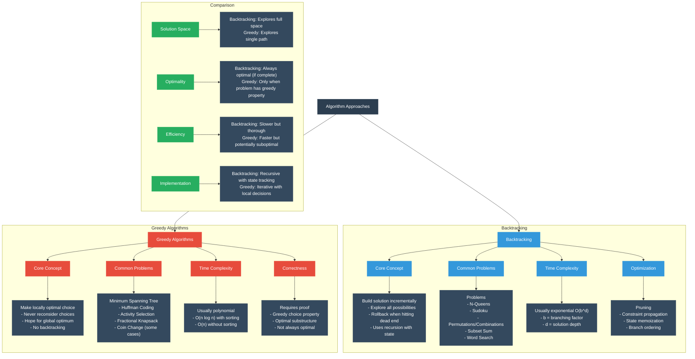

# Backtracking vs. Greedy Algorithms



## Data Flow & Transformation Concepts

### Common Terminology

- **State Space**: The set of all possible states in a problem
- **Solution Space**: Valid solutions within the state space
- **Decision Point**: Point where algorithm must choose between options
- **Constraints**: Rules that limit valid solutions
- **Optimization Criteria**: Measurement of solution quality
- **Pruning**: Eliminating branches of exploration that cannot lead to valid solutions

## Mental Model Breakdown

### Backtracking Algorithms

#### Core Concept
Backtracking explores potential solutions by incrementally building candidates and abandoning them ("backtracking") as soon as they cannot lead to a valid solution.

#### Data Flow Pattern
1. **Choice**: Make a decision (add element to current solution)
2. **Constraint Check**: Verify if current partial solution is valid
3. **Recursion**: If valid, explore further with the new state
4. **Backtrack**: If invalid or fully explored, undo the choice and try alternatives

#### Common Problems & Implementations

**N-Queens Problem**:

```python
def solve_n_queens(n):
    def is_valid(board, row, col):
        # Check column
        for irow in range(row):
            if board[irow] == col:
                return False
            
        # Check diagonals
        for irow in range(row):
            if abs(board[irow] - col) == abs(irow - row):
                return False
        
        return True
    
    def backtrack(row, current_board):
        if row == n:
            solutions.append(current_board[:])
            return
        
        for col in range(n):
            if is_valid(current_board, row, col):
                current_board[row] = col
                backtrack(row + 1, current_board)
                # Backtrack by continuing loop (implicitly undoing the choice)
    
    solutions = []
    backtrack(0, [-1] * n)
    return solutions
```

**Subset Sum Problem**:
```python
def subset_sum(nums, target):
    def backtrack(start, current_sum, current_subset):
        if current_sum == target:
            solutions.append(current_subset[:])
            return
        
        if current_sum > target or start >= len(nums):
            return
        
        # Include current number
        current_subset.append(nums[start])
        backtrack(start + 1, current_sum + nums[start], current_subset)
        
        # Exclude current number (backtrack)
        current_subset.pop()
        backtrack(start + 1, current_sum, current_subset)
    
    solutions = []
    backtrack(0, 0, [])
    return solutions
```

### Greedy Algorithms

#### Core Concept
Greedy algorithms make the locally optimal choice at each step with the hope that these local choices will lead to a globally optimal solution.

#### Data Flow Pattern
1. **Sort/Order**: Arrange choices by some criteria (often)
2. **Selection**: Iteratively select the best available option
3. **Update**: Update problem state based on selection
4. **Repeat**: Continue until solution is complete

#### Common Problems & Implementations

**Activity Selection Problem**:
```python
def activity_selection(start_times, end_times):
    # Create activities and sort by end time
    activities = sorted(zip(start_times, end_times), key=lambda x: x[1])
    
    selected = [activities[0]]  # Select first activity
    last_end_time = activities[0][1]
    
    # Greedily select activities
    for activity in activities[1:]:
        start, end = activity
        if start >= last_end_time:  # If compatible with last selected
            selected.append(activity)
            last_end_time = end
    
    return selected
```

**Fractional Knapsack Problem**:
```python
def fractional_knapsack(values, weights, capacity):
    # Calculate value-to-weight ratios
    items = [(values[i]/weights[i], values[i], weights[i]) 
             for i in range(len(values))]
    
    # Sort by value-to-weight ratio (descending)
    items.sort(reverse=True)
    
    total_value = 0
    remaining_capacity = capacity
    
    for ratio, value, weight in items:
        if remaining_capacity >= weight:
            # Take the whole item
            total_value += value
            remaining_capacity -= weight
        else:
            # Take a fraction of the item
            total_value += ratio * remaining_capacity
            break  # Knapsack is full
    
    return total_value
```

## Key Differences and Trade-offs

### 1. Exploration Strategy
- **Backtracking**: Explores multiple paths in the solution space, with the ability to abandon unsuccessful paths.
- **Greedy**: Explores a single path, making irrevocable decisions at each step.

### 2. Optimality
- **Backtracking**: Guarantees optimal solutions (if allowed to run to completion) by exploring all possibilities.
- **Greedy**: Only optimal when the problem has the "greedy choice property" and "optimal substructure".

### 3. Time Complexity
- **Backtracking**: Usually exponential, O(b^d) where b is branching factor and d is solution depth.
- **Greedy**: Usually polynomial, often O(n log n) if sorting is involved.

### 4. Problem Types
- **Backtracking**: Excels at combinatorial problems, puzzles, and constraint satisfaction problems.
- **Greedy**: Excels at optimization problems where local optimality leads to global optimality.

## Recognizing Which to Use

### When to Use Backtracking
- Need to find all possible solutions
- Problem requires examining combinations or permutations
- Problem has many constraints that eliminate large portions of the search space
- No obvious greedy strategy exists
- Examples: Sudoku, Word Search, Combination Sum, Permutations

### When to Use Greedy
- Can prove that local optimal choices lead to global optimum
- Problem has optimal substructure (optimal solution contains optimal sub-solutions)
- Example problems: Minimum Spanning Tree, Huffman Coding, Interval Scheduling

## Optimizing Each Approach

### Backtracking Optimizations
1. **Pruning**: Early elimination of invalid paths
2. **State Memoization**: Storing results of previously explored states (combines with Dynamic Programming)
3. **Constraint Propagation**: Reducing future search space based on current choices
4. **Variable/Value Ordering**: Prioritizing choices that are most likely to succeed

### Greedy Algorithm Verification
1. **Greedy Choice Property**: Prove that a locally optimal choice is part of some globally optimal solution
2. **Optimal Substructure**: Prove that an optimal solution to the problem contains optimal solutions to subproblems
3. **Exchange Argument**: Prove that any non-greedy solution can be improved by making it more "greedy"

Would you like me to focus on specific aspects of these algorithms in more detail? For example:
1. More in-depth examples of backtracking problems and optimizations
2. Proofs of correctness for greedy algorithms
3. Hybrid approaches that combine backtracking with other techniques
4. Real-world applications of these algorithms