# 🔄 Permutations | Generating all well-formed brackets (LeetCode #22)

```mermaid
graph TD
    A["Root (Empty)"] --> B["("]
    
    B --> C["(("]
    B --> D["()"]
    
    C --> E["(()"]
    
    D --> F["()("]
    
    E --> G["(()) ✓"]
    
    F --> H["()() ✓"]
    
    style A fill:#000,color:#FFF,stroke:#FFF
    style B fill:#2D882D,color:#FFF,stroke:#FFF
    style C fill:#226666,color:#FFF,stroke:#FFF
    style D fill:#226666,color:#FFF,stroke:#FFF
    style E fill:#882D60,color:#FFF,stroke:#FFF
    style F fill:#882D60,color:#FFF,stroke:#FFF
    style G fill:#AA6C39,color:#FFF,stroke:#FFF
    style H fill:#AA6C39,color:#FFF,stroke:#FFF
```



**Recurrence Relation:**
$$T(n, open, close) = \begin{cases} 
T(n, open+1, close) + T(n, open, close+1) & \text{if } open < n \text{ and } close < open \\
T(n, open, close+1) & \text{if } open = n \text{ and } close < open \\
T(n, open+1, close) & \text{if } open < n \text{ and } close = open \\
1 & \text{if } open = n \text{ and } close = n \\
0 & \text{otherwise (invalid state)}
\end{cases}$$

```python
def generateParenthesis(n: int) -> list[str]:
    result = []
    
    def backtrack(slate: list[str], open_count: int, close_count: int):
        # Base case: matches leaf nodes (G, H)
        if open_count == n and close_count == n:
            result.append(''.join(slate))
            return
            
        # Branch 1: add opening bracket (B, C, E, G)
        if open_count < n:
            slate.append('(')
            backtrack(slate, open_count + 1, close_count)
            slate.pop()
            
        # Branch 2: add closing bracket (D, F, H)
        if close_count < open_count:
            slate.append(')')
            backtrack(slate, open_count, close_count + 1)
            slate.pop()
    
    backtrack([], 0, 0)
    return result
```

### Understanding Catalan Numbers and Time Complexity

Let's break this down step by step, starting from the very basics:

#### 1. What are Catalan Numbers? 🔢

Catalan numbers count certain types of valid arrangements. For well-formed brackets, they count how many ways we can arrange n pairs of parentheses that are valid.

**Example with n = 2:**
```
Valid arrangements:
()()
(())
Invalid arrangements:
)()(
))((
```

#### 2. How do we count them? 🧮

Let's think about building a valid string of parentheses:

1. **First Position Rule:**
   - Must start with '(' (can't start with ')')
   - This is our first rule

2. **Balance Rule:**
   - At any point, we must have at least as many '(' as ')'
   - This is our second rule

3. **Counting Process:**
   For n = 2:
   ```
   Start: (
   Can add: ( or )
   If we add (: (( 
   If we add ): ()
   ```

#### 3. The Math Behind It 📐

The nth Catalan number is given by:
$$C_n = \frac{1}{n+1}\binom{2n}{n}$$

Let's break this down:

1. **What's $\binom{2n}{n}$?**
   - This is a binomial coefficient
   - It counts how many ways we can choose n items from 2n items
   - For n = 2, it's $\binom{4}{2} = 6$

2. **Why divide by (n+1)?**
   - This removes invalid arrangements
   - For n = 2, we divide by 3 to get 2 valid arrangements

#### 4. The Asymptotic Growth 🌱

As n gets bigger, Catalan numbers grow like this:
$$C_n \approx \frac{4^n}{n\sqrt{n}}$$

Let's understand each part:

1. **The 4^n part:**
   - This comes from the fact that we have 2 choices at each step
   - We need to make 2n choices total
   - So $2^{2n} = 4^n$

2. **The n√n part:**
   - This comes from the division by (n+1)
   - And some other mathematical magic with square roots
   - It's like a "correction factor" to get the exact count

#### 5. Why is this better than 2^(2n)? 🤔

Let's compare:
- Naive bound: $2^{2n}$ (trying all possible arrangements)
- Catalan bound: $\frac{4^n}{n\sqrt{n}}$

For n = 10:
- $2^{20} = 1,048,576$ (naive)
- $\frac{4^{10}}{10\sqrt{10}} \approx 16,796$ (Catalan)

Let's break down how we evaluate $\frac{4^{10}}{10\sqrt{10}}$:

1. **First, let's understand $\sqrt{10}$:**
   - $\sqrt{10}$ is approximately 3.162
   - This means 3.162 × 3.162 ≈ 10
   - Think of it as "what number times itself equals 10?"

2. **Now let's evaluate step by step:**
   ```
   Step 1: Calculate 4^10
   4^10 = 4 × 4 × 4 × 4 × 4 × 4 × 4 × 4 × 4 × 4
       = 1,048,576

   Step 2: Calculate 10√10
   10√10 = 10 × 3.162
         = 31.62

   Step 3: Divide
   1,048,576 ÷ 31.62 ≈ 16,796
   ```

3. **Why does the square root make it smaller?**
   - The square root of a number is always less than the number itself
   - For example:
     - √4 = 2 (smaller than 4)
     - √9 = 3 (smaller than 9)
     - √10 ≈ 3.162 (smaller than 10)
   - So when we multiply by √n, we're making the denominator smaller than if we just used n
   - A smaller denominator means a larger result

4. **Visual representation:**
   ```
   For n = 10:
   
   Without square root:
   4^10 ÷ 10 = 1,048,576 ÷ 10 = 104,857.6
   
   With square root:
   4^10 ÷ (10√10) = 1,048,576 ÷ 31.62 ≈ 16,796
   
   The square root makes the denominator about 3.162 times bigger,
   which makes the final result about 3.162 times smaller!
   ```

5. **Intuition about square roots:**
   - Square roots "undo" squaring
   - If you square a number, you multiply it by itself
   - If you take the square root, you find what number was squared
   - Examples:
     ```
     2 × 2 = 4, so √4 = 2
     3 × 3 = 9, so √9 = 3
     3.162 × 3.162 ≈ 10, so √10 ≈ 3.162
     ```

The Catalan bound is much smaller because:
1. It only counts valid arrangements
2. It uses our rules about parentheses
3. The denominator (n√n) makes it grow more slowly
   - The √n part makes the denominator bigger
   - A bigger denominator means a smaller result
   - This is why it's more efficient than the naive approach!

#### 6. Time Complexity Explained ⏱️

For our algorithm:
```python
def backtrack(slate: list[str], open_count: int, close_count: int):
    # We make at most 2 choices at each step
    # We need to make 2n choices total
    # But we only explore valid paths
    # So we get Catalan number complexity
```

The time complexity is:
$$\text{Time Complexity} = O\left(\frac{4^n}{n\sqrt{n}}\right)$$

This means:
1. Our algorithm grows like Catalan numbers
2. It's much better than trying all possible arrangements
3. The $\frac{1}{n\sqrt{n}}$ factor makes it more efficient

#### 7. Space Complexity Explained 💾

$$\text{Space Complexity} = O(n) \text{ for recursion stack}$$

Why?
- We only store one path at a time
- The path can be at most 2n characters long
- We use backtracking to reuse space

#### 8. Visual Understanding 🎨

```
n = 2 example:
Total possible arrangements: 16 (2^4)
Valid arrangements: 2 (Catalan number)
Invalid arrangements: 14 (pruned by our rules)

Tree structure:
    (
   /  \
  (    )
 /      \
(        )
```

The tree shows:
1. We start with '('
2. We can add '(' or ')' (if valid)
3. We only explore valid paths
4. We get Catalan number of leaves

This is why our algorithm is efficient - it only explores valid paths!

### The Power of Rules in Bounding Solution Space

Let's look at how we used rules to dramatically reduce our solution space:

#### 1. The Rules We Asserted 🔍

1. **First Position Rule:**
   ```
   Must start with '('
   ```
   - This immediately cuts our possibilities in half!
   - We don't even consider strings starting with ')'
   - This is an implicit bound on our search space

2. **Balance Rule:**
   ```
   At any point: count('(') ≥ count(')')
   ```
   - This is even more powerful
   - It prunes invalid paths early
   - Creates a natural boundary in our search space

#### 2. How Rules Create Implicit Bounds 📊

Let's see how these rules affect our search space:

```
Without Rules (Naive):
- Total possible strings of length 2n: 2^(2n)
- For n = 2: 2^4 = 16 possibilities
  ()()  (())  )()(  ))((  ...etc

With Rules:
1. First Position Rule:
   - Eliminates all strings starting with ')'
   - Cuts space in half immediately
   - Remaining: 8 possibilities

2. Balance Rule:
   - Only keeps strings where '(' count ≥ ')' count
   - Further reduces to valid arrangements only
   - Final: 2 possibilities (() and ()())
```

#### 3. The Mathematical Impact 📈

These rules transform our complexity from:
```
Naive: O(2^(2n))  →  With Rules: O(4^n/(n√n))
```

Why this is powerful:
1. **Exponential Reduction:**
   - Without rules: 2^(2n) grows very fast
   - With rules: 4^n/(n√n) grows much slower
   - The rules create an implicit "filter" on our search space

2. **Early Pruning:**
   ```
   Example path:
   Start: (
   Add (: ((  ✓ (valid)
   Add ): ()  ✓ (valid)
   Add ): ))( ✗ (invalid - balance rule)
   ```
   - We never explore the invalid branch
   - The rules tell us it's impossible to be valid

3. **Natural Boundaries:**
   ```
   For n = 2:
   Valid region: count('(') ≥ count(')')
   
   Visual representation:
   count(')')
     ^
     |    ✗ ✗ ✗ ✗
     |    ✓ ✗ ✗ ✗
     |    ✓ ✓ ✗ ✗
     |    ✓ ✓ ✓ ✓
     +----------------> count('(')
   ```
   - Rules create a "valid region" in our search space
   - We only explore within these boundaries

#### 4. General Pattern for Other Problems 🔄

This approach of using rules to create implicit bounds is a powerful pattern:

1. **Identify Natural Rules:**
   - What must be true about valid solutions?
   - What can never be true?
   - What relationships must hold?

2. **Use Rules as Filters:**
   - Rules become early termination conditions
   - They create implicit bounds on search space
   - They guide our exploration

3. **Translate to Code:**
   ```python
   def backtrack(...):
       # Rule 1: Must start with '('
       if not slate and char == ')':
           return
           
       # Rule 2: Balance rule
       if close_count > open_count:
           return
           
       # Only explore within these bounds
       ...
   ```

4. **Analyze Impact:**
   - How much does each rule reduce the search space?
   - What's the mathematical impact on complexity?
   - How does it compare to naive approach?

This pattern of using rules to create implicit bounds is why backtracking is so powerful - it turns what seems like an exponential problem into something much more manageable!
