# Dynamic Programming


I'll visualize how this compact Fibonacci DAG grows over time, showing the progression step by step.

```mermaid
flowchart TD
    subgraph "Stage 1: Base Cases"
        F1_1["F(1)"]
        F0_1["F(0)"]
    end
    
    subgraph "Stage 2: Adding F(2)"
        F2_2["F(2)"] --> F1_2["F(1)"]
        F2_2 --> F0_2["F(0)"]
    end
    
    subgraph "Stage 3: Adding F(3)"
        F3_3["F(3)"] --> F2_3["F(2)"]
        F3_3 --> F1_3["F(1)"]
        F2_3 --> F1_3
        F2_3 --> F0_3["F(0)"]
    end
    
    subgraph "Stage 4: Adding F(4)"
        F4_4["F(4)"] --> F3_4["F(3)"]
        F4_4 --> F2_4["F(2)"]
        F3_4 --> F2_4
        F3_4 --> F1_4["F(1)"]
        F2_4 --> F1_4
        F2_4 --> F0_4["F(0)"]
    end
    
    subgraph "Stage 5: Complete DAG with F(5)"
        F5_5["F(5)"] --> F4_5["F(4)"]
        F5_5 --> F3_5["F(3)"]
        F4_5 --> F3_5
        F4_5 --> F2_5["F(2)"]
        F3_5 --> F2_5
        F3_5 --> F1_5["F(1)"]
        F2_5 --> F1_5
        F2_5 --> F0_5["F(0)"]
    end
    
    classDef baseCase fill:#0A0,color:white,stroke:#fff,stroke-width:2px
    classDef computed fill:#36C,color:white,stroke:#fff,stroke-width:2px
    classDef current fill:#D05,color:white,stroke:#fff,stroke-width:2px
    
    class F0_1,F0_2,F0_3,F0_4,F0_5,F1_1,F1_2,F1_3,F1_4,F1_5 baseCase
    class F2_2,F2_3,F2_4,F2_5,F3_3,F3_4,F3_5,F4_4,F4_5 computed
    class F5_5 current
```



Let me explain how this compact Fibonacci DAG grows over time:

## Stage 1: Base Cases
We start with just the base cases F(0) and F(1), which are the foundation of the Fibonacci sequence. These require no computation and have predefined values (0 and 1).

## Stage 2: Adding F(2)
- We compute F(2) = F(1) + F(0)
- F(2) depends directly on both base cases
- The DAG is still very simple with just two edges

## Stage 3: Adding F(3)
- We compute F(3) = F(2) + F(1)
- F(3) depends on F(2) (which we've already computed) and directly on the base case F(1)
- F(2) maintains its dependencies on F(1) and F(0)
- We now have our first shared node (F(1)) with multiple incoming edges

## Stage 4: Adding F(4)
- We compute F(4) = F(3) + F(2)
- F(4) depends on F(3) and F(2), both of which we've already computed
- The graph maintains all previous dependencies
- We now have multiple shared nodes (F(2) and F(1))

## Stage 5: Complete DAG with F(5)
- We compute F(5) = F(4) + F(3)
- This creates the final structure matching the image you shared
- Every node except F(5) has multiple incoming edges, showing the extensive subproblem overlap
- This compact representation clearly illustrates why dynamic programming is efficient for Fibonacci

The key insight is that as we build the DAG:
1. New Fibonacci numbers depend only on the two previous numbers
2. Each subproblem (Fibonacci number) is computed exactly once
3. The number of shared dependencies increases as we go higher in the sequence
4. This sharing of computed results is what makes dynamic programming efficient

This step-by-step growth visualization demonstrates why the time complexity is O(n) rather than the exponential O(2ⁿ) of a naive recursive approach.


You're right! That's an excellent visualization of the Fibonacci sequence as a DAG. Let me create a similar diagram and explain how this representation helps us better understand dynamic programming.

## A More Compact DAG Mental Model for DP

This compact representation is actually a more accurate and useful way to visualize the Fibonacci sequence as a DAG. Let me explain why this provides a better mental model for dynamic programming:

### Data Flow Insights

1. **Shared Subproblems**: Unlike the tree-like visualization I showed earlier, this DAG clearly shows that each Fibonacci number is computed exactly once. For example, F(3) has multiple incoming edges, indicating it's used in multiple calculations.

2. **True Dependency Structure**: This structure better represents the actual computation needed - we don't need to recalculate F(3) multiple times; we calculate it once and reuse its value.

3. **Memoization Intuition**: The DAG makes it obvious why memoization works - storing F(3) once and reusing it avoids redundant calculations.

### Key Terminology in This Context

- **Overlapping Subproblems**: In this representation, we can easily see how subproblems overlap through the multiple incoming edges to nodes like F(3) and F(2).
- **Subproblem Reuse**: The essence of dynamic programming is calculating each subproblem only once and reusing its result, exactly as this DAG shows.
- **Topological Ordering**: Bottom-up DP follows a topological sort of this DAG (F(0), F(1), F(2), ...).


Let me update our Coin Change DAG to match this more compact style:


## Implementing DP with the Compact DAG Mental Model

The compact DAG representation provides a clearer foundation for implementing efficient DP solutions. Let's update our implementations to reflect this mental model:

```python
class FibonacciDAG:
    """
    Class that implements Fibonacci calculation using the compact DAG approach.
    """
    def __init__(self):
        # Initialize memoization cache
        self.memo = {0: 0, 1: 1}  # Base cases
    
    def calculate(self, n):
        """
        Calculate the nth Fibonacci number using memoization.
        This directly follows the compact DAG structure, ensuring each
        subproblem is calculated exactly once.
        """
        # If already computed, return the cached result
        if n in self.memo:
            return self.memo[n]
        
        # Calculate F(n) using its dependencies F(n-1) and F(n-2)
        self.memo[n] = self.calculate(n-1) + self.calculate(n-2)
        return self.memo[n]

# Example usage
if __name__ == "__main__":
    fib = FibonacciDAG()
    fib.calculate(5)
```


## Applying the Compact DAG Model to DP Problems

The compact DAG representation you shared is incredibly valuable for understanding dynamic programming. Here's why this mental model is so powerful:

### Benefits of the Compact DAG Approach

1. **Efficiency Visualization**: The DAG clearly shows which subproblems need to be calculated only once, making it obvious why memoization or tabulation works.

2. **State Transition Mapping**: Each edge represents a state transition rule in your DP problem. For Fibonacci, it's the recurrence relation F(n) = F(n-1) + F(n-2).

3. **Algorithm Design Insight**: Once you understand the DAG, implementing top-down (memoization) or bottom-up (tabulation) DP becomes straightforward:
   - Top-down follows the DAG from the root (original problem)
   - Bottom-up builds the DAG from leaves (base cases) to root

### Practical Applications

This mental model applies to many classic DP problems:

1. **Sequence Problems**: Like Fibonacci, Longest Increasing Subsequence
2. **Grid Problems**: Path finding, where each cell depends on neighboring cells
3. **String Problems**: Edit Distance, where each state depends on previous characters
4. **Optimization Problems**: Knapsack, Coin Change, where choices branch the DAG

The TypeScript `DPDAGSolver` class I provided demonstrates how to generalize this approach:

1. Define your problem state
2. Identify base cases
3. Define dependency relationships (how to move from one state to its subproblems)
4. Define how to combine subproblem results

With this framework, you can model and solve a wide range of DP problems by thinking about their DAG structure.

### Takeaway for DP Problem Solving

When you encounter a new DP problem:

1. Draw the DAG for a small example (like the Fibonacci DAG you showed)
2. Identify overlapping subproblems (nodes with multiple incoming edges)
3. Define state transitions (edges between nodes)
4. Implement using the DAG model with either top-down or bottom-up approach

This approach provides a consistent mental model that helps understand and solve even complex DP problems in a systematic way.

# Dynamic Programming Mental Model

## Interview Framework for DP Problems

### 1. State Definition 🔍
```python
# Ask yourself: "What information do I need to uniquely identify a subproblem?"
# Examples:
state = {
    "index": 0,          # Current position in array/string
    "remaining": 0,      # Remaining capacity/amount
    "prev_state": None,  # Previous state (if needed)
    "constraints": []    # Any constraints that affect the state
}
```

### 2. Base Cases 🎯
```python
# Ask yourself: "What are the smallest/simplest cases I can solve directly?"
def solve_base_case(state):
    if state["index"] >= len(nums):  # Out of bounds
        return 0
    if state["remaining"] == 0:      # No more capacity
        return 1
    if state["constraints"]:         # Constraint violation
        return float('inf')
```

### 3. State Transitions 🔄
```python
# Ask yourself: "How do I get from current state to next state?"
def get_next_states(state):
    # Common patterns:
    # 1. Take/Don't Take
    take = solve(state["index"] + 1, state["remaining"] - value)
    not_take = solve(state["index"] + 1, state["remaining"])
    
    # 2. Multiple Choices
    choices = [solve(next_state) for next_state in get_choices(state)]
    
    # 3. Previous State Dependencies
    prev_state = solve(state["index"] - 1, state["remaining"])
```

### 4. Memoization Key 🔑
```python
# Ask yourself: "What uniquely identifies this subproblem?"
def get_memo_key(state):
    # Common patterns:
    # 1. Single value
    return state["index"]
    
    # 2. Tuple of values
    return (state["index"], state["remaining"])
    
    # 3. String representation
    return f"{state['index']},{state['remaining']}"
```

### 5. Combine Results 🎨
```python
# Ask yourself: "How do I combine results from subproblems?"
def combine_results(results):
    # Common patterns:
    # 1. Maximum/Minimum
    return max(results)
    
    # 2. Sum
    return sum(results)
    
    # 3. Count
    return len([r for r in results if r])
```

## Common DP Patterns

### 1. Linear DP (1D)
```python
# State: Current index
# Transition: Previous state(s)
def linear_dp(nums):
    dp = [0] * len(nums)
    for i in range(1, len(nums)):
        dp[i] = max(dp[i-1], dp[i-2] + nums[i])
```

### 2. Grid DP (2D)
```python
# State: Current cell (i,j)
# Transition: Adjacent cells
def grid_dp(grid):
    dp = [[0] * len(grid[0]) for _ in range(len(grid))]
    for i in range(1, len(grid)):
        for j in range(1, len(grid[0])):
            dp[i][j] = min(dp[i-1][j], dp[i][j-1]) + grid[i][j]
```

### 3. Knapsack Style
```python
# State: (index, remaining_capacity)
# Transition: Take/Don't take
def knapsack_dp(weights, values, capacity):
    dp = {}
    def solve(i, rem):
        if (i, rem) in dp:
            return dp[(i, rem)]
        if i >= len(weights) or rem <= 0:
            return 0
        take = solve(i+1, rem-weights[i]) + values[i]
        not_take = solve(i+1, rem)
        dp[(i, rem)] = max(take, not_take)
        return dp[(i, rem)]
```

## Interview Checklist ✅

1. **Understand the Problem**
   - What's the goal?
   - What are the constraints?
   - Can I break it into subproblems?

2. **Define State**
   - What information do I need?
   - How to uniquely identify a subproblem?
   - What's the smallest unit of work?

3. **Find Base Cases**
   - What are the simplest cases?
   - What are the edge cases?
   - What invalid states exist?

4. **State Transitions**
   - How do states connect?
   - What choices do I have?
   - What dependencies exist?

5. **Memoization**
   - What's the memo key?
   - Where to store results?
   - How to avoid recomputation?

6. **Combine Results**
   - How to merge subproblem results?
   - What's the final answer?
   - How to handle edge cases?

## Common Pitfalls ⚠️

1. **Wrong State Definition**
   - Missing important information
   - Including unnecessary information
   - Not considering all constraints

2. **Incorrect Base Cases**
   - Missing edge cases
   - Wrong return values
   - Not handling invalid states

3. **Wrong State Transitions**
   - Missing dependencies
   - Incorrect order of computation
   - Not considering all choices

4. **Memoization Issues**
   - Wrong memo key
   - Not storing all needed information
   - Memory inefficiency

5. **Result Combination**
   - Wrong aggregation function
   - Missing edge cases
   - Not handling all possibilities