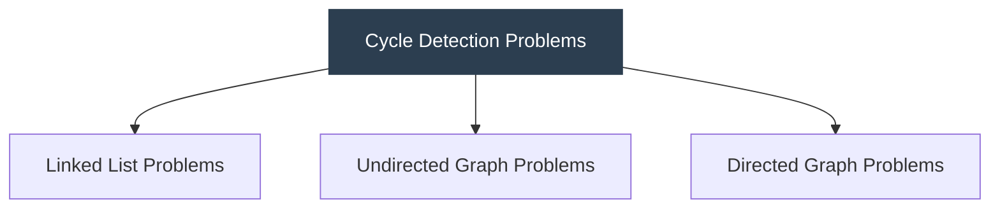
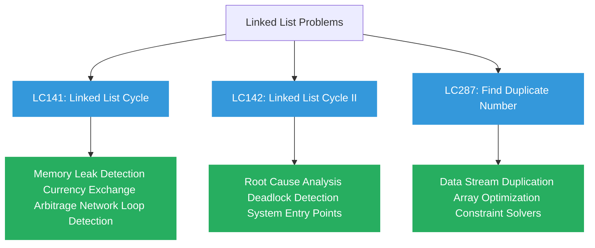
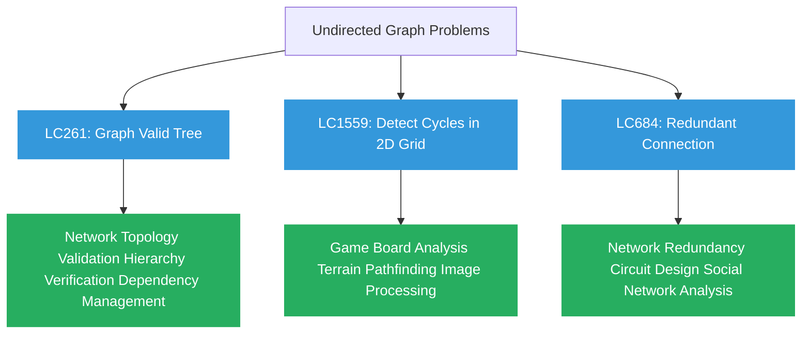
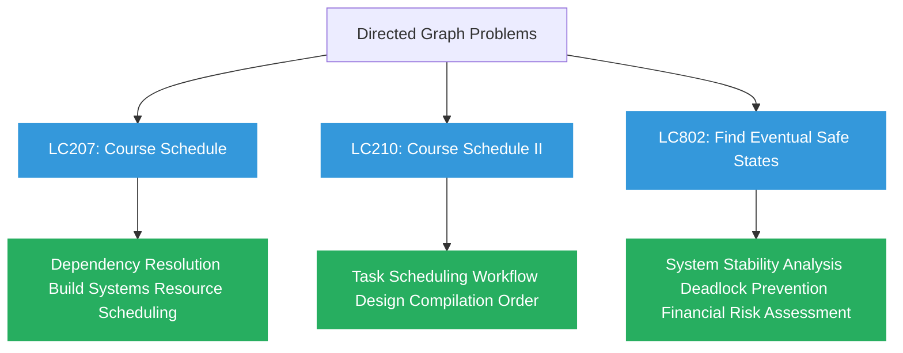
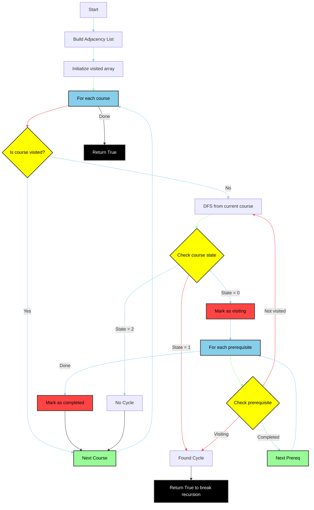

# Cycle Detection: LeetCode Problems and Real-World Applications

## Linked List Cycle Detection Problems









### 1. LeetCode 141: Linked List Cycle
**Problem**: Determine if a linked list has a cycle.

**Real-World Applications**:
- **Memory Leak Detection**: Detecting reference cycles in garbage collection
- **Currency Exchange Arbitrage**: Finding profitable loops in exchange rates
- **Network Routing Loop Detection**: Identifying routing loops in network packets

### 2. LeetCode 142: Linked List Cycle II
**Problem**: Find the node where the cycle begins in a linked list.

**Real-World Applications**:
- **Root Cause Analysis**: Finding the origin of a circular reference
- **Deadlock Detection**: Identifying the resource that initiated a deadlock
- **Entry Point Analysis**: Finding the injection point in a compromised system

### 3. LeetCode 287: Find the Duplicate Number
**Problem**: Find duplicate in an array using cycle detection (array treated as implicit linked list).

**Real-World Applications**:
- **Data Integrity Verification**: Finding duplicates in data streams
- **Process Optimization**: Identifying redundant steps in a workflow
- **Constraint Solvers**: Finding contradictions in logical systems

## Undirected Graph Cycle Detection Problems

### 1. LeetCode 261: Graph Valid Tree
**Problem**: Determine if an undirected graph is a valid tree (connected and acyclic).

**Real-World Applications**:
- **Network Topology Validation**: Ensuring a spanning tree exists in network design
- **Organizational Hierarchy Verification**: Validating reporting structures
- **Dependency Management**: Ensuring a system's components form a valid hierarchy

### 2. LeetCode 1559: Detect Cycles in a 2D Grid
**Problem**: Find if there's a cycle of the same character in a grid.

**Real-World Applications**:
- **Game Board Analysis**: Detecting winning patterns in board games
- **Terrain Pathfinding**: Finding loops in map navigation
- **Image Processing**: Detecting enclosed regions in segmentation

### 3. LeetCode 684: Redundant Connection
**Problem**: Find the edge that can be removed to make the graph acyclic.

**Real-World Applications**:
- **Network Redundancy Planning**: Identifying backup connections
- **Circuit Design Optimization**: Finding redundant connections in circuits
- **Social Network Analysis**: Identifying redundant connections in community structures

## Directed Graph Cycle Detection Problems

### 1. LeetCode 207: Course Schedule
**Problem**: Determine if it's possible to finish all courses given prerequisites (detect if a directed graph has cycles).

**Real-World Applications**:
- **Build System Dependency Resolution**: Checking if build dependencies can be resolved
- **Package Management**: Validating if dependencies can be installed without conflicts
- **Resource Scheduling**: Ensuring tasks can be completed without circular dependencies

### 2. LeetCode 210: Course Schedule II
**Problem**: Return the order to take courses (topological sort).

**Real-World Applications**:
- **Task Scheduling**: Determining optimal execution order in pipelines
- **Workflow Design**: Creating efficient process sequences in business
- **Compilation Order**: Determining the sequence to compile interdependent code files

### 3. LeetCode 802: Find Eventual Safe States
**Problem**: Find all nodes that eventually lead to terminal nodes (no cycles).

**Real-World Applications**:
- **System Stability Analysis**: Identifying components that won't cause infinite loops
- **Deadlock Prevention**: Finding processes that will always complete
- **Financial Risk Assessment**: Identifying investment paths that avoid circular risks

## Code Implementation for a Key Problem

Let me show you one of the most versatile problems that demonstrates cycle detection with real-world implications:

## Course Scheduling Algorithm (LC207)



The algorithm uses a three-state DFS approach:
1. State 0: Unvisited
2. State 1: Currently visiting (in current DFS path) - indicates a cycle if found
3. State 2: Completed (no cycles found)

Key points:
- Finding a cycle (state = 1) leads to returning `False` from `canFinish`
- No cycles found leads to returning `True` from `canFinish`
- The recursive `has_cycle` function returns `True` when it finds a cycle, which causes `canFinish` to return `False`

```python
class Solution:
    def canFinish(self, numCourses: int, prerequisites: list[list[int]]) -> bool:
        """
        This problem is equivalent to detecting a cycle in a directed graph.
        If the graph has a cycle, it's impossible to finish all courses.
        
        Real-world mapping: Dependency resolution in build systems, 
        package managers, and project planning.
        """
        # Build adjacency list
        graph = [[] for _ in range(numCourses)]
        for course, prereq in prerequisites:
            graph[course].append(prereq)
        
        # 0: unvisited, 1: visiting (in current path), 2: visited (completed)
        visited = [0] * numCourses
        
        def has_cycle(course):
            # If we're visiting this node in the current path, we found a cycle
            if visited[course] == 1:
                return True
            # If we've already processed this node and found no cycles, skip
            if visited[course] == 2:
                return False
            
            # Mark as currently visiting
            visited[course] = 1
            
            # Check all prerequisites
            for prereq in graph[course]:
                if has_cycle(prereq):
                    return True
            
            # Mark as completed
            visited[course] = 2
            return False
        
        # Check each course
        for course in range(numCourses):
            if visited[course] == 0:
                if has_cycle(course):
                    return False
        
        return True

    def findOrder(self, numCourses: int, prerequisites: list[list[int]]) -> list[int]:
        """
        LeetCode 210: Course Schedule II
        Not only detect if possible, but also return the order to take courses.
        
        Real-world mapping: Determining build order in CI/CD pipelines,
        generating executable schedules for processes with dependencies.
        """
        # Build adjacency list (course -> list of prerequisites)
        graph = [[] for _ in range(numCourses)]
        for course, prereq in prerequisites:
            graph[course].append(prereq)
        
        # 0: unvisited, 1: visiting, 2: visited
        visited = [0] * numCourses
        # Store the course order
        order = []
        
        def has_cycle(course):
            if visited[course] == 1:
                return True
            if visited[course] == 2:
                return False
            
            visited[course] = 1
            
            for prereq in graph[course]:
                if has_cycle(prereq):
                    return True
            
            visited[course] = 2
            # Add to order after processing all prerequisites
            order.append(course)
            return False
        
        # Check each course
        for course in range(numCourses):
            if visited[course] == 0:
                if has_cycle(course):
                    return []  # Empty array indicates impossible
        
        return order  # Will be in reverse topological order
```

## Deep Dive: Real-World Applications of Cycle Detection

### 1. Dependency Resolution in Software Development

**Problem Context**: Modern software systems have complex dependency graphs. When installing packages or building applications, we need to ensure that dependencies can be resolved without circularity.

**Implementation Details**:
- Package managers like npm, pip, and cargo use topological sorting to determine installation order
- Continuous Integration systems check build dependencies before starting jobs
- Compilers determine module compilation order based on import relationships

**How It Works**: The "Course Schedule" problem (LC207/LC210) precisely models this scenario, where:
- Courses = Software modules/packages
- Prerequisites = Dependencies
- Finding a valid order = Determining build/installation sequence

### 2. Deadlock Detection in Operating Systems

**Problem Context**: In concurrent computing, deadlocks occur when processes hold resources while waiting for others, creating a circular wait condition.

**Implementation Details**:
- Operating systems construct a resource allocation graph
- Processes are nodes, resources are edges
- A cycle indicates a potential deadlock situation

**How It Works**: This maps to directed graph cycle detection (similar to LC207), where:
- Process A waits for Resource 1 held by Process B
- Process B waits for Resource 2 held by Process A
- This forms a cycle, indicating deadlock

### 3. Financial Arbitrage Detection

**Problem Context**: In currency or commodity trading, arbitrage opportunities exist when there's a cycle of exchanges that results in profit.

**Implementation Details**:
- Currencies/assets are nodes
- Exchange rates are directed edges with weights
- A cycle with product > 1.0 indicates an arbitrage opportunity

**How It Works**: This is a weighted variant of cycle detection, where:
- Example: USD → EUR → GBP → USD
- If the product of exchange rates in this cycle exceeds 1.0, there's an arbitrage opportunity
- Algorithms need to detect these cycles quickly before market conditions change

### 4. Network Routing Loop Prevention

**Problem Context**: In computer networks, routing loops cause packets to circulate indefinitely, wasting bandwidth and causing congestion.

**Implementation Details**:
- Routers implement loop detection mechanisms like TTL (Time-To-Live)
- Routing protocols like BGP use path vectors to prevent loops
- Spanning Tree Protocol (STP) prevents loops in switched networks

**How It Works**: This combines both directed and undirected graph cycle detection:
- In link-state routing: Dijkstra's algorithm ensures loop-free paths
- In distance-vector routing: Path vectors track the route to prevent loops
- In layer-2 networks: STP disables redundant connections to create a logical tree

### 5. Circular Reference Detection in Memory Management

**Problem Context**: Garbage collectors need to identify objects that reference each other but aren't accessible from the program roots.

**Implementation Details**:
- Reference counting GC can't handle circular references without cycle detection
- Tracing GC (like mark-and-sweep) identifies unreachable object cycles
- Modern GC implementations use graph algorithms to find these cycles

**How It Works**: This maps directly to linked list cycle detection (LC141/LC142), where:
- Objects are nodes
- References are directed edges
- Finding unreachable cycles helps reclaim memory

## Implementing Real-World Cycle Detection

When implementing cycle detection for real-world applications, consider these practical tips:

1. **Performance Considerations**:
   - For large graphs, use iterative implementations to avoid stack overflow
   - In distributed systems, consider partition-based approaches
   - Use lazy evaluation when possible to handle large datasets

2. **Robustness Requirements**:
   - Add timeout mechanisms for unbounded graphs
   - Implement incremental detection for evolving graphs
   - Consider approximation algorithms for very large graphs

3. **Integration Patterns**:
   - Use event-driven architectures to detect cycles as they form
   - Implement warning systems before critical cycles appear
   - Design self-healing systems that can resolve detected cycles

Would you like me to explore any of these real-world applications in more depth, or would you prefer to discuss another aspect of cycle detection?
