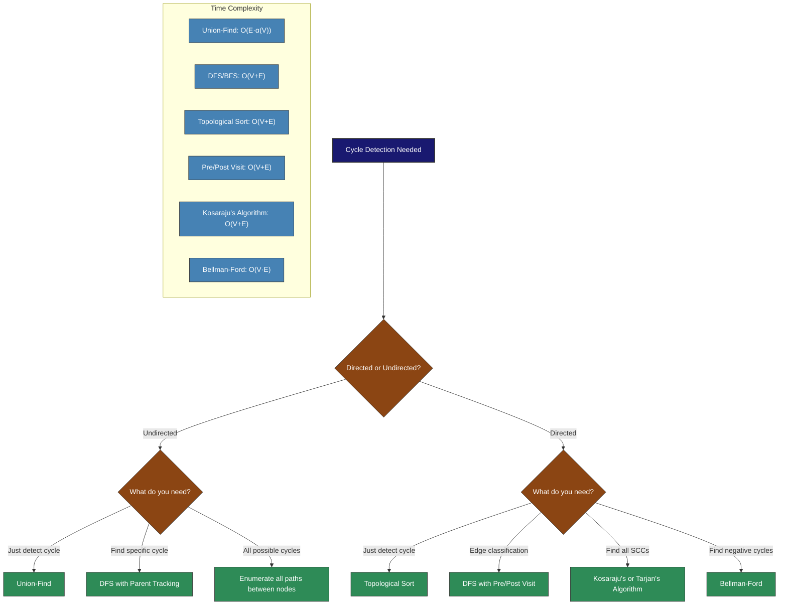
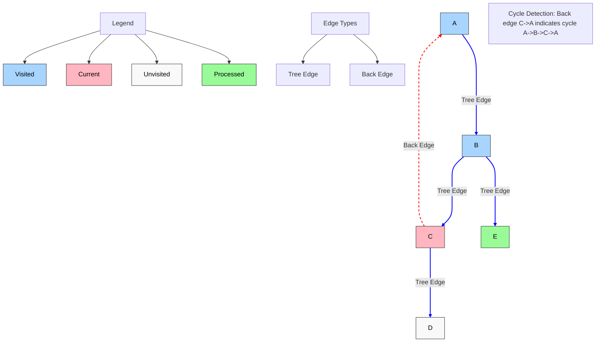
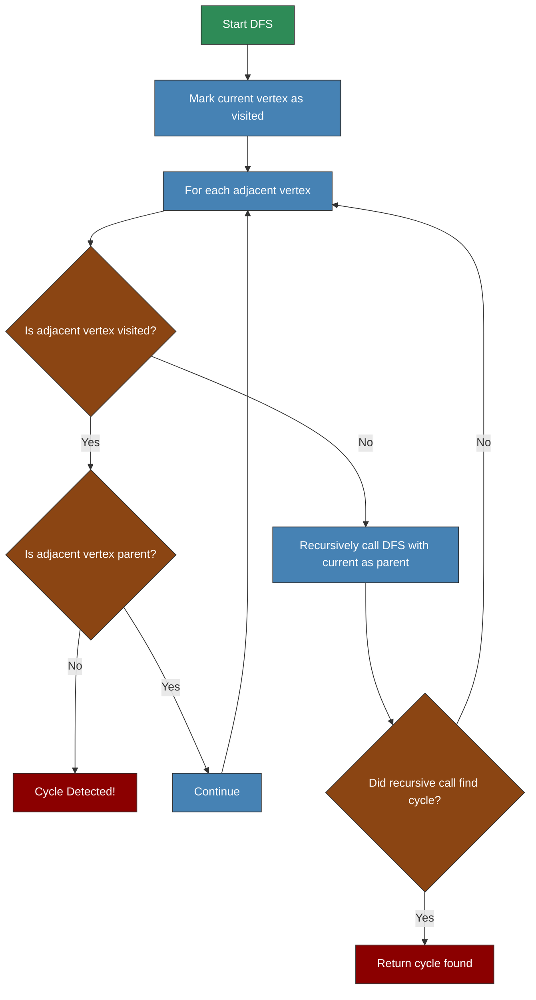
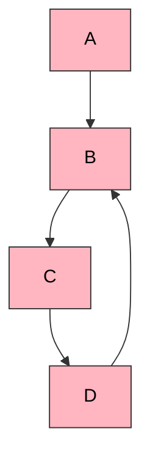
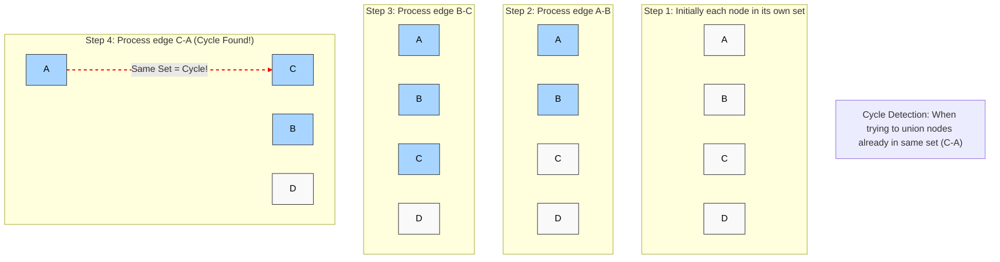
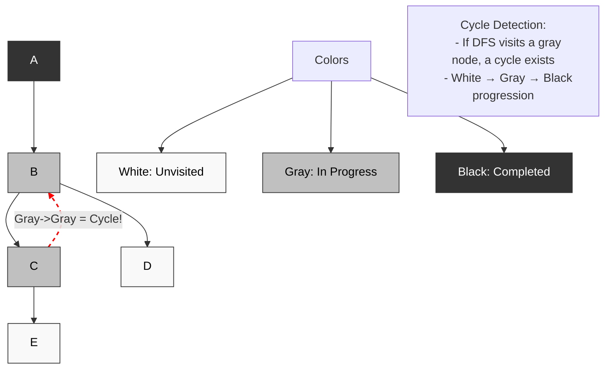
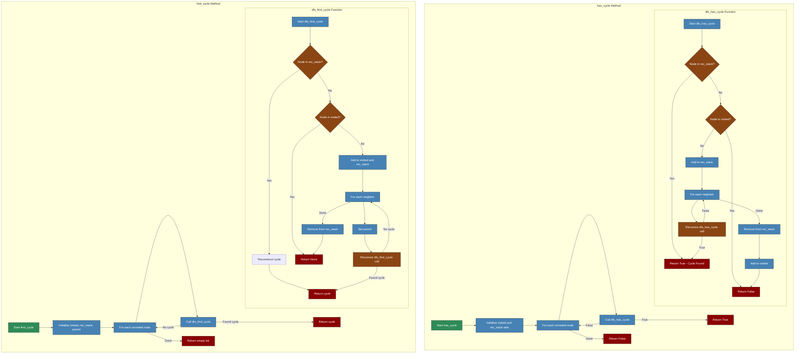
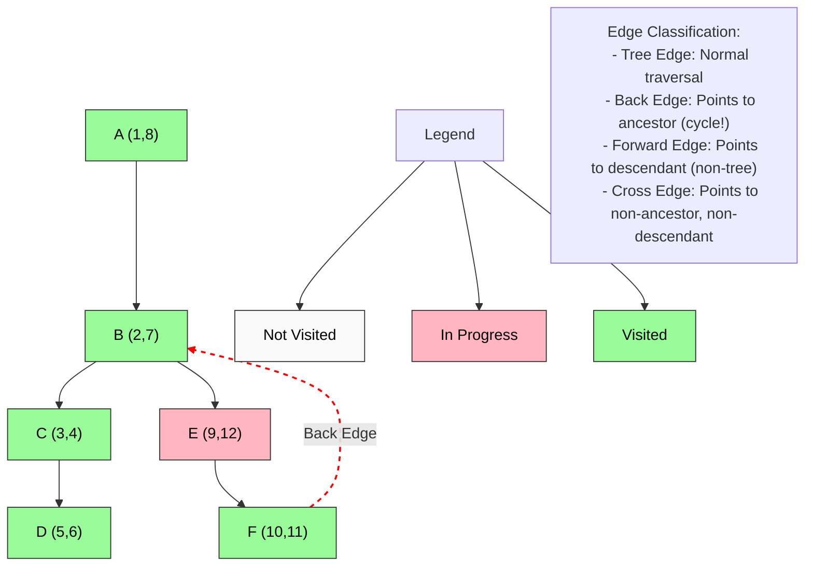
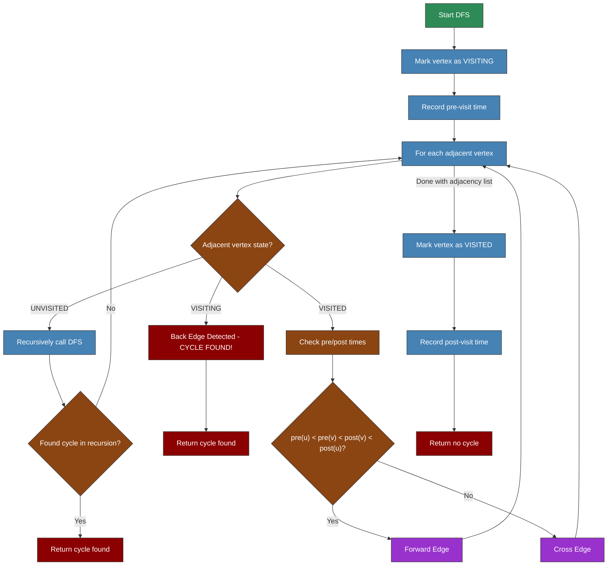
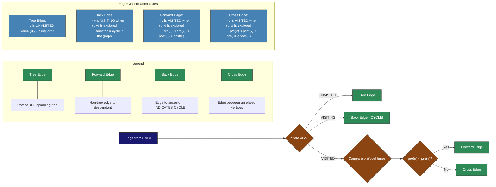

# Cycle Detection V2



---

# Undirected Graphs:

1. DFS w/Parent Tracking
2. Union-Find

## DFS w/Parent Tracking
The most common approach for undirected graphs is using DFS with parent tracking:




The back edge is the only edge that can form a cycle in an undirected graph. We detect it by checking if we've already visited a node before we've processed it.

```python
from collections import defaultdict

class Graph:
    def __init__(self):
        self.adj = defaultdict(list)
    
    def add_edge(self, u, v):
        self.adj[u].append(v)
    
    def has_cycle(self):
        visited = set()  # BLACK
        rec_stack = set()  # GRAY
        
        def dfs(node):
            if node in rec_stack:
                return True
            if node in visited:
                return False
                
            rec_stack.add(node)
            for neighbor in self.adj[node]:
                if dfs(neighbor):
                    return True
            rec_stack.remove(node)
            visited.add(node)
            return False
            
        return any(dfs(node) for node in self.adj if node not in visited)
    
    def find_cycle(self):
        visited = set()
        rec_stack = []
        parent = {}
        
        def dfs(node):
            if node in rec_stack:
                # Found cycle, reconstruct it
                cycle = []
                current = node
                while True:
                    cycle.append(current)
                    if current == node and len(cycle) > 1:
                        break
                    current = parent[current]
                return cycle[::-1]
                
            if node in visited:
                return None
                
            visited.add(node)
            rec_stack.append(node)
            
            for neighbor in self.adj[node]:
                parent[neighbor] = node
                cycle = dfs(neighbor)
                if cycle:
                    return cycle
                    
            rec_stack.pop()
            return None
            
        for node in self.adj:
            if node not in visited:
                cycle = dfs(node)
                if cycle:
                    return cycle
        return []

# Usage example
def detect_cycle_example():
    g = Graph()
    g.add_edge('A', 'B')
    g.add_edge('B', 'C')
    g.add_edge('C', 'D')
    g.add_edge('D', 'B')  # Creates cycle B -> C -> D -> B
    
    print(f"Graph has cycle: {g.has_cycle()}")
    if g.has_cycle():
        print(f"Cycle found: {' -> '.join(g.find_cycle())}")
```
Let me explain the meaning of `rec_stack` in the cycle detection algorithm:

`rec_stack` (recursion stack) is a crucial concept in cycle detection. It represents the current path of nodes being explored in the DFS traversal. Here's a detailed explanation:

1. **Purpose**:
   - Tracks which nodes are currently "in progress" in the DFS traversal
   - Helps identify back edges that form cycles
   - Acts as a marker for nodes that are part of the current recursion path

2. **State Representation**:
   - When a node is first visited, it's added to `rec_stack`
   - When all its neighbors are processed, it's removed from `rec_stack`
   - If we encounter a node that's already in `rec_stack`, we've found a cycle

3. **Visual Example**:


4. **How it works**:
   - Start at node A: `rec_stack = [A]`
   - Visit B: `rec_stack = [A, B]`
   - Visit C: `rec_stack = [A, B, C]`
   - Visit D: `rec_stack = [A, B, C, D]`
   - Try to visit B again: B is in `rec_stack` → cycle detected!

5. **In the Code**:
```python
def has_cycle(self):
    visited = set()  # BLACK - completely processed nodes
    rec_stack = set()  # GRAY - nodes in current DFS path
    
    def dfs(node):
        if node in rec_stack:  # Found a back edge!
            return True
        if node in visited:    # Already processed
            return False
            
        rec_stack.add(node)    # Mark as in current path
        for neighbor in self.adj[node]:
            if dfs(neighbor):
                return True
        rec_stack.remove(node) # Remove from current path
        visited.add(node)      # Mark as completely processed
        return False
```

6. **Key Points**:
   - `rec_stack` is different from `visited`
   - `visited` tracks all nodes we've seen
   - `rec_stack` only tracks nodes in the current DFS path
   - A node in `rec_stack` means we can reach it from the current node
   - Finding a node in `rec_stack` means we've found a cycle

This is why it's called the "recursion stack" - it represents the current call stack of the DFS traversal, showing which nodes are part of the current path being explored.

Would you like me to show more examples of how `rec_stack` changes during DFS traversal or explain how it relates to the edge classification (tree edges, back edges, etc.)?


## Union-Find

Another efficient approach for undirected graphs is using the Union-Find (Disjoint Set) algorithm:



```python
class UnionFind:
    def __init__(self, n):
        self.parent = list(range(n))
        self.rank = [0] * n
    
    def find(self, x):
        if self.parent[x] != x:
            self.parent[x] = self.find(self.parent[x])  # Path compression
        return self.parent[x]
    
    def union(self, x, y):
        root_x = self.find(x)
        root_y = self.find(y)
        
        if root_x == root_y:
            return False  # Already in same set, would create a cycle
        
        # Union by rank
        if self.rank[root_x] < self.rank[root_y]:
            self.parent[root_x] = root_y
        elif self.rank[root_x] > self.rank[root_y]:
            self.parent[root_y] = root_x
        else:
            self.parent[root_y] = root_x
            self.rank[root_x] += 1
        
        return True  # Union successful, no cycle created

def detect_cycle_union_find(n, edges):
    uf = UnionFind(n)
    
    for u, v in edges:
        # If union returns False, nodes are already connected
        # which means this edge would create a cycle
        if not uf.union(u, v):
            return True, (u, v)  # Cycle detected and edge causing it
    
    return False, None  # No cycle detected
```

---

# Directed Graphs:

1. DFS w/Color Coding
2. DFS with Pre/Post Visit Accounting
3. Topological Sort

## DFS w/Color Coding
For directed graphs, DFS with pre/post visit accounting is extremely powerful:


```typescript
// Color marking states for vertices
enum VertexState {
  WHITE = 'WHITE', // Unvisited
  GRAY = 'GRAY',   // Being visited (in the current recursion stack)
  BLACK = 'BLACK'  // Completely visited
}

class Graph<T> {
  private adjacencyList: Map<T, T[]> = new Map();
  
  constructor() {}
  
  addVertex(vertex: T): void {
    if (!this.adjacencyList.has(vertex)) {
      this.adjacencyList.set(vertex, []);
    }
  }
  
  addEdge(from: T, to: T): void {
    // Ensure vertices exist
    this.addVertex(from);
    this.addVertex(to);
    
    // Add edge
    this.adjacencyList.get(from)!.push(to);
  }
  
  /**
   * Detect cycle in directed graph using color marking DFS
   * @returns True if the graph contains a cycle, false otherwise
   */
  hasCycle(): boolean {
    const state = new Map<T, VertexState>();
    
    // Initialize all vertices as WHITE (unvisited)
    for (const vertex of this.adjacencyList.keys()) {
      state.set(vertex, VertexState.WHITE);
    }
    
    // Check for cycle starting from each unvisited vertex
    for (const vertex of this.adjacencyList.keys()) {
      if (state.get(vertex) === VertexState.WHITE) {
        if (this.dfsHasCycle(vertex, state)) {
          return true;
        }
      }
    }
    
    return false;
  }
  
  /**
   * Find and return a specific cycle in the graph
   * @returns Array of vertices forming a cycle, or empty array if no cycle exists
   */
  findCycle(): T[] {
    const state = new Map<T, VertexState>();
    const parent = new Map<T, T | null>();
    
    // Initialize all vertices
    for (const vertex of this.adjacencyList.keys()) {
      state.set(vertex, VertexState.WHITE);
      parent.set(vertex, null);
    }
    
    // Cycle detection result
    let cycleStart: T | null = null;
    let cycleEnd: T | null = null;
    
    // DFS function to detect cycle
    const dfs = (vertex: T): boolean => {
      state.set(vertex, VertexState.GRAY);
      
      for (const adjacent of this.adjacencyList.get(vertex)!) {
        if (state.get(adjacent) === VertexState.WHITE) {
          parent.set(adjacent, vertex);
          
          if (dfs(adjacent)) {
            return true;
          }
        } else if (state.get(adjacent) === VertexState.GRAY) {
          // Cycle detected
          cycleStart = adjacent;
          cycleEnd = vertex;
          return true;
        }
      }
      
      state.set(vertex, VertexState.BLACK);
      return false;
    };
    
    // Run DFS from each unvisited vertex
    for (const vertex of this.adjacencyList.keys()) {
      if (state.get(vertex) === VertexState.WHITE) {
        if (dfs(vertex)) {
          break;
        }
      }
    }
    
    // If no cycle found
    if (!cycleStart || !cycleEnd) {
      return [];
    }
    
    // Reconstruct the cycle
    const cycle: T[] = [cycleStart];
    let current = cycleEnd;
    
    while (current !== cycleStart) {
      cycle.unshift(current);
      current = parent.get(current)!;
    }
    
    return cycle;
  }
  
  /**
   * Helper method for cycle detection
   */
  private dfsHasCycle(vertex: T, state: Map<T, VertexState>): boolean {
    // Mark current vertex as being visited
    state.set(vertex, VertexState.GRAY);
    
    // Visit all adjacent vertices
    for (const adjacent of this.adjacencyList.get(vertex)!) {
      // If adjacent is unvisited
      if (state.get(adjacent) === VertexState.WHITE) {
        if (this.dfsHasCycle(adjacent, state)) {
          return true;
        }
      } 
      // If adjacent is being visited (in the current recursion stack)
      else if (state.get(adjacent) === VertexState.GRAY) {
        // Cycle detected
        return true;
      }
    }
    
    // Mark current vertex as completely visited
    state.set(vertex, VertexState.BLACK);
    return false;
  }
}

// Usage example
function detectCycleExample(): void {
  const graph = new Graph<string>();
  
  // Add edges
  graph.addEdge('A', 'B');
  graph.addEdge('B', 'C');
  graph.addEdge('C', 'D');
  graph.addEdge('D', 'B'); // Creates a cycle B -> C -> D -> B
  
  const hasCycle = graph.hasCycle();
  console.log(`Graph has cycle: ${hasCycle}`);
  
  if (hasCycle) {
    const cycle = graph.findCycle();
    console.log(`Cycle found: ${cycle.join(' -> ')}`);
  }
}
```

The following is a python implementation of the above typescript code:

```python
from collections import defaultdict

class Graph:
    def __init__(self):
        self.adj = defaultdict(list)
    
    def add_edge(self, u, v):
        self.adj[u].append(v)
    
    def has_cycle(self):
        visited = set()  # BLACK
        rec_stack = set()  # GRAY
        
        def dfs(node):
            if node in rec_stack:
                return True
            if node in visited:
                return False
                
            rec_stack.add(node)
            for neighbor in self.adj[node]:
                if dfs(neighbor):
                    return True
            rec_stack.remove(node)
            visited.add(node)
            return False
            
        return any(dfs(node) for node in self.adj if node not in visited)
    
    def find_cycle(self):
        visited = set()
        rec_stack = []
        parent = {}
        
        def dfs(node):
            if node in rec_stack:
                # Found cycle, reconstruct it
                cycle = []
                current = node
                while True:
                    cycle.append(current)
                    if current == node and len(cycle) > 1:
                        break
                    current = parent[current]
                return cycle[::-1]
                
            if node in visited:
                return None
                
            visited.add(node)
            rec_stack.append(node)
            
            for neighbor in self.adj[node]:
                parent[neighbor] = node
                cycle = dfs(neighbor)
                if cycle:
                    return cycle
                    
            rec_stack.pop()
            return None
            
        for node in self.adj:
            if node not in visited:
                cycle = dfs(node)
                if cycle:
                    return cycle
        return []

# Usage example
def detect_cycle_example():
    g = Graph()
    g.add_edge('A', 'B')
    g.add_edge('B', 'C')
    g.add_edge('C', 'D')
    g.add_edge('D', 'B')  # Creates cycle B -> C -> D -> B
    
    print(f"Graph has cycle: {g.has_cycle()}")
    if g.has_cycle():
        print(f"Cycle found: {' -> '.join(g.find_cycle())}")
```



Key Points:
1. **has_cycle Method**:
   - Uses two sets: `visited` (BLACK) and `rec_stack` (GRAY)
   - Returns True as soon as any cycle is found
   - Returns False only after checking all nodes

2. **find_cycle Method**:
   - Uses `visited` set, `rec_stack` list, and `parent` dictionary
   - Reconstructs cycle when found using parent pointers
   - Returns empty list if no cycle found

3. **Common Patterns**:
   - Both methods use DFS with state tracking
   - Both check for cycles by looking for nodes in the recursion stack
   - Both handle visited nodes to avoid redundant work

4. **State Transitions**:
   - Unvisited → In Recursion Stack → Visited
   - Cycle detection happens when we find a node in the recursion stack

Would you like me to add more details about any specific part of the flow or explain how the cycle reconstruction works in more detail?

## DFS with Pre/Post Visit Accounting
The most powerful approach for directed graphs as it provides both cycle detection and edge classification.





```typescript
interface Vertex {
  id: string | number;
  preVisit: number;  // Arrival time
  postVisit: number; // Departure time
  state: 'UNVISITED' | 'VISITING' | 'VISITED';
}

interface Edge {
  from: string | number;
  to: string | number;
  type?: 'TREE' | 'FORWARD' | 'BACK' | 'CROSS';
}

class DirectedGraph {
  private adjacencyList: Map<string | number, Array<string | number>> = new Map();
  private vertices: Map<string | number, Vertex> = new Map();
  private edges: Edge[] = [];
  private time: number = 0;
  private hasCycle: boolean = false;

  constructor() {}

  addVertex(id: string | number): void {
    if (!this.vertices.has(id)) {
      this.vertices.set(id, {
        id,
        preVisit: -1,
        postVisit: -1,
        state: 'UNVISITED'
      });
      this.adjacencyList.set(id, []);
    }
  }

  addEdge(from: string | number, to: string | number): void {
    // Ensure vertices exist
    this.addVertex(from);
    this.addVertex(to);
    
    // Add edge to adjacency list
    this.adjacencyList.get(from)!.push(to);
    
    // Add to edges list
    this.edges.push({ from, to });
  }

  detectCycles(): boolean {
    // Reset all vertices
    for (const [id, vertex] of this.vertices.entries()) {
      vertex.state = 'UNVISITED';
      vertex.preVisit = -1;
      vertex.postVisit = -1;
    }
    
    this.time = 0;
    this.hasCycle = false;
    
    // Start DFS from each unvisited vertex
    for (const [id, vertex] of this.vertices.entries()) {
      if (vertex.state === 'UNVISITED') {
        this.dfs(id);
        if (this.hasCycle) return true;
      }
    }
    
    return false;
  }

  private dfs(vertexId: string | number): void {
    const vertex = this.vertices.get(vertexId)!;
    
    // Mark as visiting and record pre-visit time
    vertex.state = 'VISITING';
    vertex.preVisit = ++this.time;
    
    // Visit all adjacent vertices
    for (const adjId of this.adjacencyList.get(vertexId)!) {
      const adjVertex = this.vertices.get(adjId)!;
      
      // Classify the edge and check for cycles
      if (adjVertex.state === 'UNVISITED') {
        // Tree edge - continue DFS
        this.classifyEdge(vertexId, adjId, 'TREE');
        this.dfs(adjId);
      } else if (adjVertex.state === 'VISITING') {
        // Back edge - cycle detected!
        this.classifyEdge(vertexId, adjId, 'BACK');
        this.hasCycle = true;
      } else {
        // Visited vertex - either forward or cross edge
        if (adjVertex.preVisit > vertex.preVisit) {
          this.classifyEdge(vertexId, adjId, 'FORWARD');
        } else {
          this.classifyEdge(vertexId, adjId, 'CROSS');
        }
      }
      
      if (this.hasCycle) return;
    }
    
    // Mark as visited and record post-visit time
    vertex.state = 'VISITED';
    vertex.postVisit = ++this.time;
  }

  private classifyEdge(from: string | number, to: string | number, type: Edge['type']): void {
    // Find and classify the edge
    for (const edge of this.edges) {
      if (edge.from === from && edge.to === to) {
        edge.type = type;
        break;
      }
    }
  }

  getEdgeClassification(): Edge[] {
    return this.edges;
  }

  printPrePostTimes(): void {
    for (const [id, vertex] of this.vertices.entries()) {
      console.log(`Vertex ${id}: pre=${vertex.preVisit}, post=${vertex.postVisit}`);
    }
  }
}

// Usage example
function exampleUsage(): void {
  const graph = new DirectedGraph();
  
  // Add edges from the example in Image 1
  graph.addEdge('A', 'B');
  graph.addEdge('A', 'C');
  graph.addEdge('B', 'E');
  graph.addEdge('C', 'D');
  graph.addEdge('E', 'F');
  graph.addEdge('E', 'H');
  graph.addEdge('F', 'G');
  graph.addEdge('A', 'F'); // Dashed edge
  graph.addEdge('D', 'H'); // Dashed edge
  graph.addEdge('E', 'G'); // Dashed edge
  
  const hasCycle = graph.detectCycles();
  console.log(`Graph has cycle: ${hasCycle}`);
  
  graph.printPrePostTimes();
  
  const edgeClassification = graph.getEdgeClassification();
  console.log("Edge Classifications:");
  for (const edge of edgeClassification) {
    console.log(`${edge.from} -> ${edge.to}: ${edge.type}`);
  }
}
```



## Topological Sort (Kahn's Algorithm)
If a topological sort is possible, the graph has no cycles.
```python
from collections import defaultdict, deque

def kahn_topological_sort(graph, n):
    """
    Kahn's algorithm for topological sorting
    Returns: (bool, list) - (is_dag, topological_order)
    If graph has a cycle, is_dag will be False
    """
    # Calculate in-degree for each vertex
    in_degree = [0] * n
    for u in range(n):
        for v in graph[u]:
            in_degree[v] += 1
    
    # Add vertices with 0 in-degree to queue
    queue = deque()
    for u in range(n):
        if in_degree[u] == 0:
            queue.append(u)
    
    # Process vertices in topological order
    topo_order = []
    while queue:
        u = queue.popleft()
        topo_order.append(u)
        
        for v in graph[u]:
            in_degree[v] -= 1
            if in_degree[v] == 0:
                queue.append(v)
    
    # If topo_order contains all vertices, graph is a DAG
    # Otherwise, graph has at least one cycle
    is_dag = len(topo_order) == n
    
    return is_dag, topo_order

def detect_cycle_topo_sort(n, edges):
    # Build adjacency list
    graph = defaultdict(list)
    for u, v in edges:
        graph[u].append(v)
    
    is_dag, _ = kahn_topological_sort(graph, n)
    return not is_dag
```

asdf