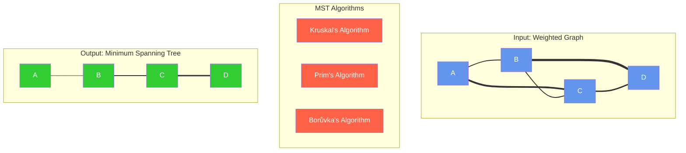
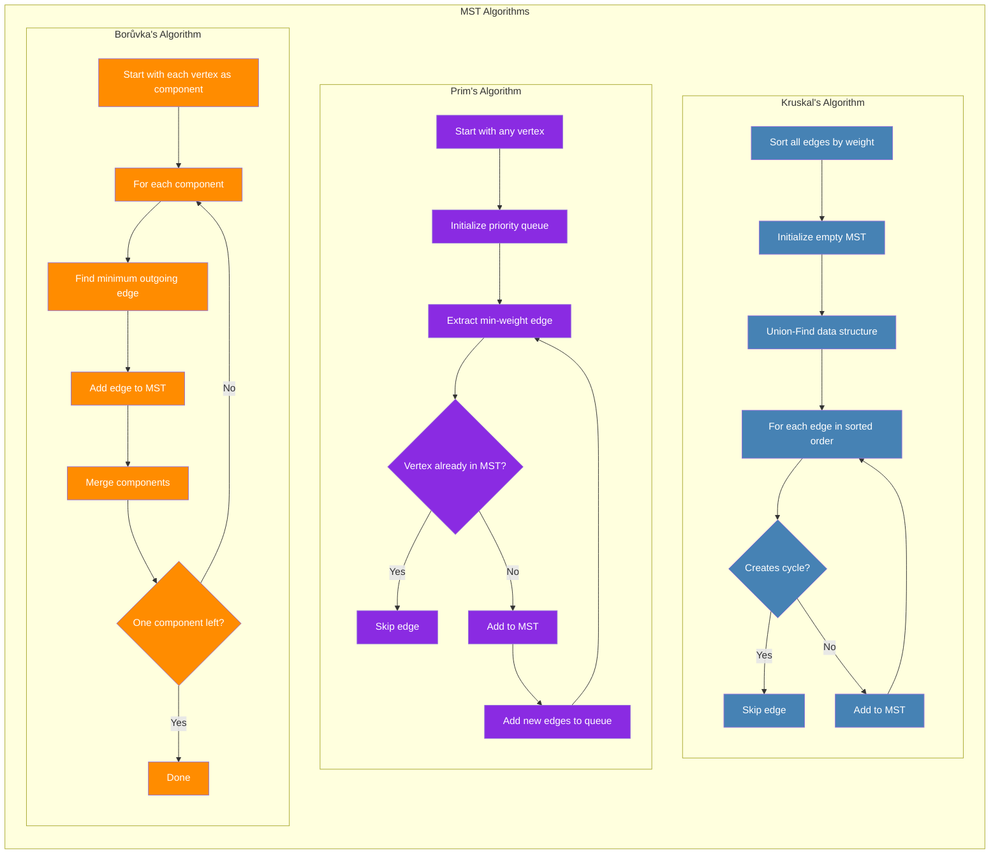
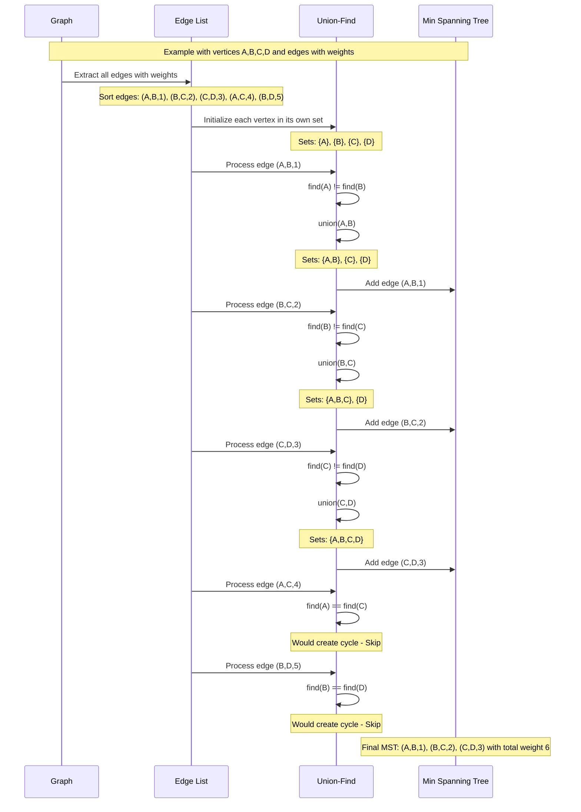

# Minimum Spanning Tree (Kruskal's Algorithm)

A minimum spanning tree (MST) is a subset of edges from a connected, undirected graph that connects all vertices together with the minimum possible total edge weight, without any cycles.

Let me create a mental model diagram to help visualize this concept:



Now, let's look at the different MST algorithms and understand how they work:



Now, let's examine the Union-Find data structure that's critical to understanding how Kruskal's algorithm avoids cycles:

```mermaid
flowchart TD
    subgraph "Union-Find Data Structure"
        direction TB
        
        subgraph "Initial State"
            A1((A))
            B1((B))
            C1((C))
            D1((D))
            
            style A1 fill:#1E90FF,color:white
            style B1 fill:#1E90FF,color:white
            style C1 fill:#1E90FF,color:white
            style D1 fill:#1E90FF,color:white
        end
        
        subgraph "Find Operation"
            F1[Find Root of Node]
            F2{Is Parent itself?}
            F3[Return Node]
            F4[Recursively Find Parent]
            F5[Path Compression]
            
            F1 --> F2
            F2 -->|Yes| F3
            F2 -->|No| F4
            F4 --> F5
            
            style F1 fill:#FF6347,color:white
            style F2 fill:#FF6347,color:white
            style F3 fill:#FF6347,color:white
            style F4 fill:#FF6347,color:white
            style F5 fill:#FF6347,color:white
        end
        
        subgraph "Union Operation"
            U1[Find Root of X]
            U2[Find Root of Y]
            U3{Same Root?}
            U4[No Action Needed]
            U5{Compare Ranks}
            U6[Attach Lower Rank to Higher]
            U7[Update Rank if Equal]
            
            U1 --> U2
            U2 --> U3
            U3 -->|Yes| U4
            U3 -->|No| U5
            U5 --> U6
            U6 --> U7
            
            style U1 fill:#32CD32,color:white
            style U2 fill:#32CD32,color:white
            style U3 fill:#32CD32,color:white
            style U4 fill:#32CD32,color:white
            style U5 fill:#32CD32,color:white
            style U6 fill:#32CD32,color:white
            style U7 fill:#32CD32,color:white
        end
        
        subgraph "After Operations"
            A2((A))
            B2((B))
            C2((C))
            D2((D))
            
            A2 --- B2
            B2 --- C2
            C2 --- D2
            
            style A2 fill:#9932CC,color:white
            style B2 fill:#9932CC,color:white
            style C2 fill:#9932CC,color:white
            style D2 fill:#9932CC,color:white
        end
    end
```



Now, let's create a data flow diagram for MST algorithms:

Let's also visualize a step-by-step execution of Kruskal's algorithm:



## Understanding Minimum Spanning Trees

Now that we have our mental models in place, let me explain the key concepts, algorithms, and use cases.

### Common Terminology and Definitions

1. **Minimum Spanning Tree (MST)**: A subset of edges from a connected, undirected graph that connects all vertices with the minimum possible total edge weight, without forming cycles.

2. **Union-Find (Disjoint-Set)**: A data structure that tracks a set of elements partitioned into disjoint subsets, with operations to find which subset an element belongs to and merge two subsets.

3. **Path Compression**: An optimization technique for the Union-Find data structure that flattens the structure of the tree when finding the root of an element.

4. **Union by Rank**: An optimization technique that attaches the shorter tree to the root of the taller tree during union operations.

5. **Greedy Algorithm**: An algorithmic paradigm that makes locally optimal choices at each stage with the hope of finding a global optimum.

### Why Kruskal's Algorithm Works

Let me explain why your Kruskal's algorithm implementation correctly finds the MST:

1. **Sorting Edges**: By sorting edges by weight, we consider the lightest edges first, which is the greedy approach that drives Kruskal's.

2. **Union-Find for Cycle Detection**: The Union-Find data structure efficiently determines if adding an edge would create a cycle by checking if both endpoints are already in the same component.

3. **Optimization Techniques**: 
   - Path compression in the `find` function flattens the tree and reduces future lookup times.
   - Union by rank ensures that the tree remains balanced, keeping operations efficient.

4. **Greedy Selection**: By always selecting the lightest edge that doesn't create a cycle, we build the MST one edge at a time, always making the locally optimal choice.

### Other MST Algorithms

1. **Prim's Algorithm**:
   - Starts with a single vertex and grows the MST one vertex at a time.
   - Uses a priority queue to select the minimum-weight edge that connects a vertex in the MST to a vertex outside the MST.
   - Time complexity: O(E log V) with a binary heap.
   - Better for dense graphs.

2. **Borůvka's Algorithm**:
   - Builds the MST in parallel from multiple components.
   - For each component, selects the minimum-weight edge connecting it to another component.
   - Time complexity: O(E log V).
   - Can be parallelized effectively.

### Real-World Use Cases for MSTs

1. **Network Design**:
   - Designing minimum-cost communication or electrical networks.
   - Installing fiber optic lines connecting cities with minimal total cable length.

2. **Clustering**:
   - In machine learning, finding clusters by running a MST algorithm and removing the heaviest edges.

3. **Circuit Design**:
   - Minimizing wire connections in electronic circuit design.

4. **Transportation Networks**:
   - Planning road or railway systems to connect multiple locations with minimal construction costs.

5. **Image Segmentation**:
   - Using MST-based algorithms for segmenting images in computer vision.

6. **Network Routing**:
   - Finding efficient routing paths in computer networks.

7. **Approximation Algorithms**:
   - Using MST as a basis for approximation algorithms for NP-hard problems like the Traveling Salesman Problem.

## Python Implementation of MST Algorithms

Let's implement the other main MST algorithm (Prim's) so you can compare:

```python
import heapq
from collections import defaultdict

# Kruskal's Algorithm (for reference)
def kruskal_algorithm(vertices, edges):
    # Union-Find data structure
    parent = {v: v for v in vertices}
    rank = {v: 0 for v in vertices}

    def find(x):
        if parent[x] != x:
            parent[x] = find(parent[x])  # Path compression
        return parent[x]

    def union(x, y):
        p1 = find(x)
        p2 = find(y)

        if p1 == p2:
            return

        # Union by rank
        if rank[p1] < rank[p2]:
            p1, p2 = p2, p1
        parent[p2] = p1
        if rank[p1] == rank[p2]:
            rank[p1] += 1

    # Sort edges by weight
    edges.sort(key=lambda x: x[2])

    mst = []
    for u, v, weight in edges:
        if find(u) != find(v):  # Check if adding this edge creates a cycle
            union(u, v)
            mst.append((u, v, weight))

    return mst

# Prim's Algorithm
def prim_algorithm(vertices, edges):
    # Convert edges to adjacency list
    adj_list = defaultdict(list)
    for u, v, weight in edges:
        adj_list[u].append((v, weight))
        adj_list[v].append((u, weight))  # Undirected graph
    
    # Start with an arbitrary vertex
    start_vertex = next(iter(vertices))
    
    # Track vertices in MST
    mst_vertices = {start_vertex}
    
    # Priority queue for edges
    edge_heap = []
    for neighbor, weight in adj_list[start_vertex]:
        heapq.heappush(edge_heap, (weight, start_vertex, neighbor))
    
    mst = []
    
    # Continue until all vertices are in MST
    while edge_heap and len(mst_vertices) < len(vertices):
        weight, u, v = heapq.heappop(edge_heap)
        
        # Check if adding this edge creates a cycle
        if v not in mst_vertices:
            mst_vertices.add(v)
            mst.append((u, v, weight))
            
            # Add edges from the newly added vertex
            for neighbor, edge_weight in adj_list[v]:
                if neighbor not in mst_vertices:
                    heapq.heappush(edge_heap, (edge_weight, v, neighbor))
    
    return mst

# Borůvka's Algorithm
def boruvka_algorithm(vertices, edges):
    # Convert edges to a format suitable for the algorithm
    graph = {}
    for u, v, weight in edges:
        if u not in graph:
            graph[u] = {}
        if v not in graph:
            graph[v] = {}
        graph[u][v] = weight
        graph[v][u] = weight  # Undirected graph
    
    # Union-Find data structure
    parent = {v: v for v in vertices}
    
    def find(x):
        if parent[x] != x:
            parent[x] = find(parent[x])
        return parent[x]
    
    def union(x, y):
        parent[find(x)] = find(y)
    
    mst = []
    
    # Continue until there's only one component
    while len(set(find(v) for v in vertices)) > 1:
        # Find minimum weight edge for each component
        min_edges = {}
        
        for u, v, weight in edges:
            root_u = find(u)
            root_v = find(v)
            
            if root_u != root_v:
                if root_u not in min_edges or min_edges[root_u][2] > weight:
                    min_edges[root_u] = (u, v, weight)
                if root_v not in min_edges or min_edges[root_v][2] > weight:
                    min_edges[root_v] = (u, v, weight)
        
        # Add the selected edges to MST
        for u, v, weight in min_edges.values():
            if find(u) != find(v):  # Check again as the forest might have been updated
                union(u, v)
                mst.append((u, v, weight))
    
    return mst

# Example usage:
if __name__ == "__main__":
    vertices = {"A", "B", "C", "D"}
    edges = [("A", "B", 1), ("A", "C", 4), ("B", "C", 2), ("B", "D", 5), ("C", "D", 3)]
    
    print("Kruskal's MST:", kruskal_algorithm(vertices, edges))
    print("Prim's MST:", prim_algorithm(vertices, edges))
    print("Borůvka's MST:", boruvka_algorithm(vertices, edges))
```


## Detailed Explanation of Union-Find in Kruskal's Algorithm

Let me dive deeper into why the Union-Find data structure is crucial for Kruskal's algorithm:

### Key Components and Functions:

1. **Data Structures**:
   - `parent`: A dictionary where each vertex points to its parent in the disjoint-set forest
   - `rank`: A dictionary tracking the "height" of each tree to optimize union operations

2. **Find Operation with Path Compression**:
   ```python
   def find(x):
       if parent[x] != x:
           parent[x] = find(parent[x])  # Path compression
       return parent[x]
   ```
   
   This recursively finds the root of a vertex's component. The path compression optimization updates each node to point directly to the root during the traversal, which flattens the tree and speeds up future operations.

3. **Union Operation with Union by Rank**:
   ```python
   def union(x, y):
       p1 = find(x)
       p2 = find(y)
       
       if p1 == p2:
           return
           
       # Union by rank
       if rank[p1] < rank[p2]:
           p1, p2 = p2, p1
       parent[p2] = p1
       if rank[p1] == rank[p2]:
           rank[p1] += 1
   ```
   
   This merges two components by attaching the root of one tree to the root of another. The union-by-rank optimization ensures that the smaller tree is attached to the larger one, maintaining a balanced structure.

4. **Cycle Detection**:
   ```python
   if find(u) != find(v):  # Check if adding this edge creates a cycle
       union(u, v)
       mst.append((u, v, weight))
   ```
   
   This is the key insight: If two vertices are already in the same component (have the same root), adding an edge between them would create a cycle, which is not allowed in a tree. If they're in different components, we can safely add the edge and merge the components.

### Time Complexity Analysis:

1. **Sorting Edges**: O(E log E), where E is the number of edges
2. **Union-Find Operations**: 
   - With path compression and union by rank: O(E log* V), where log* V is the inverse Ackermann function
   - For practical purposes, this is almost O(E), since log* V grows extremely slowly

3. **Overall Complexity**: O(E log E) dominated by the sorting step

## Summary

Minimum Spanning Trees provide an elegant solution to the problem of finding the most efficient way to connect all nodes in a graph. The key insights are:

1. **Greedy Approach**: Both Kruskal's and Prim's algorithms work by greedily selecting edges in order of increasing weight.

2. **Cycle Avoidance**: MST algorithms must ensure no cycles are created, which is efficiently handled by the Union-Find data structure in Kruskal's algorithm.

3. **Algorithm Choice**:
   - Kruskal's is generally better for sparse graphs
   - Prim's is typically better for dense graphs
   - Borůvka's offers opportunities for parallelization

4. **Real-world Applications**: MSTs have numerous practical applications in network design, clustering, image processing, and more.

The beauty of MST algorithms lies in their simplicity and efficiency, making them fundamental tools in graph theory and network optimization problems.

---

# Selected Deep-Dives

## Combining on Rank

1. **Purpose of Rank**:
   - Rank represents the approximate height of the tree
   - It's used to keep the tree balanced
   - The goal is to minimize the height of the tree for faster `find` operations

2. **Why We Don't Combine Ranks**:
   ```python
   # Current implementation
   if rank[p1] < rank[p2]:
       p1, p2 = p2, p1
   parent[p2] = p1
   if rank[p1] == rank[p2]:
       rank[p1] += 1
   ```

   - If we combined ranks (e.g., `rank[p1] += rank[p2]`), we would lose the height information
   - The rank would grow much faster than the actual tree height
   - This would make our height approximation inaccurate

3. **What Would Happen If We Combined Ranks**:
   ```python
   # Hypothetical (incorrect) implementation
   if rank[p1] < rank[p2]:
       p1, p2 = p2, p1
   parent[p2] = p1
   rank[p1] += rank[p2]  # This would be wrong!
   ```

   - The rank would grow exponentially
   - A tree of height 3 could have a rank of 15
   - This would defeat the purpose of using rank for balancing

4. **Correct Behavior**:
   - Rank only increases when two trees of equal rank are merged
   - This ensures rank closely approximates the actual tree height
   - The time complexity remains O(α(n)) where α is the inverse Ackermann function

Here's a visual example:

```
Before Union:
Tree 1 (rank 2)     Tree 2 (rank 2)
     A                 D
    / \               / \
   B   C             E   F

After Union (correct):
     A (rank 3)
    /|\
   B C D
     / \
    E   F

After Union (incorrect - if we combined ranks):
     A (rank 4)  # Rank would be sum of both trees
    /|\
   B C D
     / \
    E   F
```

The key insight is that rank is a proxy for tree height, not tree size. By only incrementing rank when merging trees of equal height, we maintain the logarithmic height guarantee that makes Union-Find operations efficient.

Would you like me to:
1. Show how this affects the time complexity?
2. Demonstrate with more complex tree structures?
3. Explain how this relates to path compression?
4. Show how to implement size tracking separately from rank?

---

# Questions


