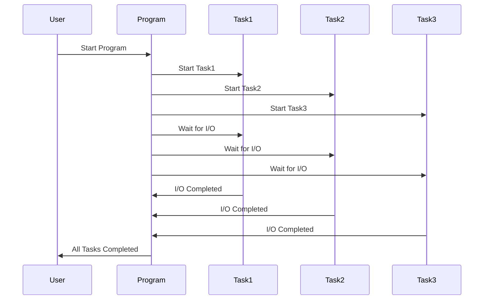
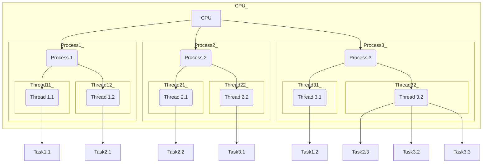
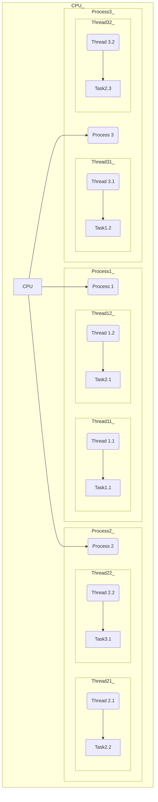
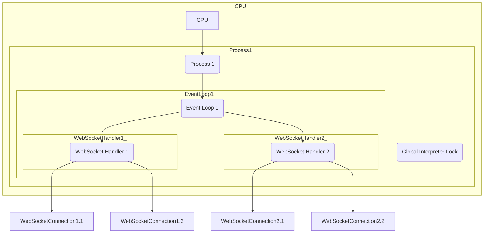
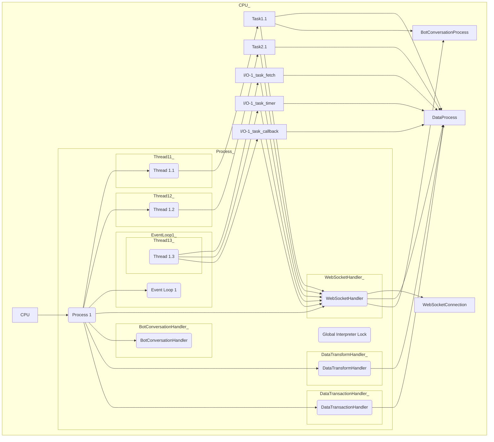

Certainly, let's number the steps and provide Python code for each step:

Step 1: Initialize the asyncio event loop.

```python
import asyncio

async def main():
    # Your code here
```

Step 2: Define the three I/O-bound tasks.

```python
async def task1():
    # I/O operation 1
    await asyncio.sleep(2)
    print("Task 1: I/O operation completed")

async def task2():
    # I/O operation 2
    await asyncio.sleep(3)
    print("Task 2: I/O operation completed")

async def task3():
    # I/O operation 3
    await asyncio.sleep(1)
    print("Task 3: I/O operation completed")
```

Step 3: Create a list of tasks to run concurrently.

```python
tasks = [task1(), task2(), task3()]
```

Step 4: Run the tasks concurrently and wait for their completion.

```python
await asyncio.gather(*tasks)
```

Step 5: Close the asyncio event loop.

```python
if __name__ == "__main__":
    asyncio.run(main())
```

Here's the complete Python code that corresponds to the numbered steps:

```python
import asyncio

async def main():
    async def task1():
        # I/O operation 1
        await asyncio.sleep(2)
        print("Task 1: I/O operation completed")

    async def task2():
        # I/O operation 2
        await asyncio.sleep(3)
        print("Task 2: I/O operation completed")

    async def task3():
        # I/O operation 3
        await asyncio.sleep(1)
        print("Task 3: I/O operation completed")

    tasks = [task1(), task2(), task3()]
    await asyncio.gather(*tasks)

if __name__ == "__main__":
    asyncio.run(main())
```

This code demonstrates the concurrent execution of three I/O-bound tasks using asyncio. The tasks simulate I/O operations with different sleep durations, and asyncio allows them to run concurrently and efficiently within a single event loop.

### Hierarchical Task Management: V1
The diagram below shows the hierarchical structure of the CPU in relation to the processes and threads it manages:



### Hierarchical Task Management: V2
This diagram tries to provide further intuition into how a Process is a container for Threads, and how Threads are containers for Tasks:


#### Event Loops:
In an asyncio-based Python program, the event loop is a central component that manages the execution and scheduling of asynchronous tasks (coroutines). It plays a crucial role in coordinating the execution of concurrent tasks. However, the event loop itself is not explicitly represented in your diagram.

To include the event loop in your diagram and illustrate its role, you can add a separate box or node labeled "Event Loop" and connect it to the CPU or the Process nodes, indicating that the event loop is responsible for managing the execution of tasks within those processes or threads. Here's an updated diagram with the "Event Loop" included:

In this updated diagram, the "Event Loop" node is connected to the CPU and each process, indicating that it manages the execution of tasks within those processes and threads. The event loop's role is to schedule and run the asynchronous tasks concurrently, coordinating their execution.

```mermaid
graph TD;
  subgraph CPU_
    CPU

    subgraph Process1_
        Process1(Process 1)

        subgraph Thread11_
            Thread11(Thread 1.1)
        end

        subgraph Thread12_
            Thread12(Thread 1.2)
        end

        subgraph EventLoop1_
            EventLoop1(Event Loop 1)
        end

    end

    subgraph Process2_
        Process2(Process 2)

        subgraph Thread21_
            Thread21(Thread 2.1)
        end

        subgraph Thread22_
            Thread22(Thread 2.2)
        end

        subgraph EventLoop2_
            EventLoop2(Event Loop 2)
        end
    end

    subgraph Process3_
        Process3(Process 3)

        subgraph Thread31_
            Thread31(Thread 3.1)
        end

        subgraph Thread32_
            Thread32(Thread 3.2)
        end

        subgraph EventLoop3_
            EventLoop3(Event Loop 3)
        end
    end

  end

  CPU --> Process1;
  CPU --> Process2;
  CPU --> Process3;

  Process1 --> Thread11;
  Process1 --> Thread12;
  Process1 --> EventLoop1;

  Process2 --> Thread21;
  Process2 --> Thread22;
  Process2 --> EventLoop2;

  Process3 --> Thread31;
  Process3 --> Thread32;
  Process3 --> EventLoop3;

  Thread11 --> Task1.1;
  Thread12 --> Task2.1;
  Thread21 --> Task2.2;
  Thread22 --> Task3.1;
  Thread31 --> Task1.2;
  Thread32 --> Task2.3;
  Thread32 --> Task3.2;
  Thread32 --> Task3.3;

  EventLoop1 --> I/O-1_task_fetch;
  EventLoop1 --> I/O-1_task_timer;
  EventLoop1 --> I/O-1_task_callback;

  EventLoop2 --> I/O-2_task_fetch;
  EventLoop2 --> I/O-2_task_timer;

  EventLoop3 --> I/O-3_task_fetch;
  EventLoop3 --> I/O-3_task2;
  EventLoop3 --> I/O-3_task3;
  EventLoop3 --> I/O-3_task4;

```



#### Event Loops V3: _Each Event Loop has a Thread_

```mermaid
graph TD;
  subgraph CPU_
    CPU

    subgraph Process1_
        Process1(Process 1)

        subgraph Thread11_
            Thread11(Thread 1.1)
        end

        subgraph Thread12_
            Thread12(Thread 1.2)
        end

        subgraph EventLoop1_
            EventLoop1(Event Loop 1)

            subgraph Thread13_
                Thread13(Thread 1.3)
            end

        end

    end

    subgraph Process2_
        Process2(Process 2)

        subgraph Thread21_
            Thread21(Thread 2.1)
        end

        subgraph Thread22_
            Thread22(Thread 2.2)
        end

        subgraph EventLoop2_
            EventLoop2(Event Loop 2)

            subgraph Thread23_
                Thread23(Thread 2.3)
            end

        end

    end

    subgraph Process3_
        Process3(Process 3)

        subgraph Thread31_
            Thread31(Thread 3.1)
        end

        subgraph Thread32_
            Thread32(Thread 3.2)
        end

        subgraph EventLoop3_
            EventLoop3(Event Loop 3)

            subgraph Thread33_
                Thread33(Thread 3.3)
            end

        end

    end

  end

  CPU --> Process1;
  CPU --> Process2;
  CPU --> Process3;

  Process1 --> Thread11;
  Process1 --> Thread12;
  Process1 --> EventLoop1;

  Process2 --> Thread21;
  Process2 --> Thread22;
  Process2 --> EventLoop2;

  Process3 --> Thread31;
  Process3 --> Thread32;
  Process3 --> EventLoop3;

  Thread11 --> Task1.1;
  Thread12 --> Task2.1;
  Thread21 --> Task2.2;
  Thread22 --> Task3.1;
  Thread31 --> Task1.2;
  Thread32 --> Task2.3;
  Thread32 --> Task3.2;
  Thread32 --> Task3.3;


  Thread13 --> I/O-1_task_fetch;
  Thread13 --> I/O-1_task_timer;
  Thread13 --> I/O-1_task_callback;


  Thread23 --> I/O-2_task_fetch;
  Thread23 --> I/O-2_task_timer;

  Thread33 --> I/O-3_task_fetch;
  Thread33 --> I/O-3_task2;
  Thread33 --> I/O-3_task3;
  Thread33 --> I/O-3_task4;

```


#### Event Loops V3: _Each Process has a GIL_

```mermaid
graph TD;
  subgraph CPU_
    CPU

    subgraph Process1_
        Process1(Process 1)
        GIL(Global Interpreter Lock)

        subgraph Thread11_
            Thread11(Thread 1.1)
        end

        subgraph Thread12_
            Thread12(Thread 1.2)
        end

        subgraph EventLoop1_
            EventLoop1(Event Loop 1)

            subgraph Thread13_
                Thread13(Thread 1.3)
            end

        end

    end

    subgraph Process2_
        Process2(Process 2)
        GIL(Global Interpreter Lock)

        subgraph Thread21_
            Thread21(Thread 2.1)
        end

        subgraph Thread22_
            Thread22(Thread 2.2)
        end

        subgraph EventLoop2_
            EventLoop2(Event Loop 2)

            subgraph Thread23_
                Thread23(Thread 2.3)
            end

        end

    end

    subgraph Process3_
        Process3(Process 3)
        GIL(Global Interpreter Lock)

        subgraph Thread31_
            Thread31(Thread 3.1)
        end

        subgraph Thread32_
            Thread32(Thread 3.2)
        end

        subgraph EventLoop3_
            EventLoop3(Event Loop 3)

            subgraph Thread33_
                Thread33(Thread 3.3)
            end

        end

    end

  end

  CPU --> Process1;
  CPU --> Process2;
  CPU --> Process3;

  Process1 --> Thread11;
  Process1 --> Thread12;
  Process1 --> EventLoop1;

  Process2 --> Thread21;
  Process2 --> Thread22;
  Process2 --> EventLoop2;

  Process3 --> Thread31;
  Process3 --> Thread32;
  Process3 --> EventLoop3;

  Thread11 --> Task1.1;
  Thread12 --> Task2.1;
  Thread21 --> Task2.2;
  Thread22 --> Task3.1;
  Thread31 --> Task1.2;
  Thread32 --> Task2.3;
  Thread32 --> Task3.2;
  Thread32 --> Task3.3;


  Thread13 --> I/O-1_task_fetch;
  Thread13 --> I/O-1_task_timer;
  Thread13 --> I/O-1_task_callback;


  Thread23 --> I/O-2_task_fetch;
  Thread23 --> I/O-2_task_timer;

  Thread33 --> I/O-3_task_fetch;
  Thread33 --> I/O-3_task2;
  Thread33 --> I/O-3_task3;
  Thread33 --> I/O-3_task4;

```


#### Tornado Backend:
In a Tornado-based WebSocket application, Tornado's event loop is typically single-threaded and can handle multiple WebSocket connections concurrently using non-blocking I/O. Tornado uses an event-driven architecture, allowing the event loop to efficiently manage multiple connections without the need for multiple threads or processes. Here's a simplified diagram to illustrate how a Tornado-based WebSocket backend could work with a single process and a single event loop:

In this diagram:

There is a single process (Process 1) running the Tornado application, and the Global Interpreter Lock (GIL) is present as it is inherent to CPython (the most common Python implementation).

Within the process, there is a single event loop (Event Loop 1) managed by Tornado.

WebSocket connections are handled by WebSocket handlers (WebSocket Handler 1 and WebSocket Handler 2) running within the event loop.

Each WebSocket handler can manage multiple WebSocket connections concurrently, and the event loop efficiently handles events for these connections.

WebSocket connections (WebSocketConnection1.1, WebSocketConnection1.2, WebSocketConnection2.1, WebSocketConnection2.2) represent individual WebSocket connections managed by the WebSocket handlers.

The event loop uses non-blocking I/O to manage WebSocket connections, allowing it to efficiently handle multiple connections without requiring multiple threads or processes.

This architecture allows a single-threaded event loop to handle many WebSocket connections concurrently, making Tornado suitable for high-performance WebSocket applications.

