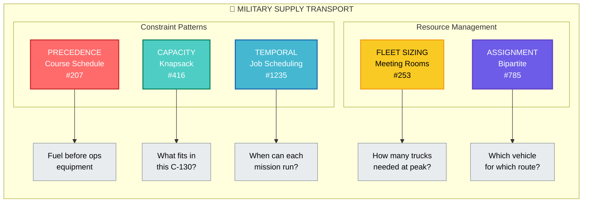

## 🎯 Primary Match: Job Scheduling (#1235)

| Military Logistics Concept           | LeetCode Mapping           |
| ------------------------------------ | -------------------------- |
| Transport missions                   | Jobs                       |
| Mission time windows                 | Start/end times            |
| Supply criticality (ammo > MREs)     | Profit weights             |
| One vehicle per mission at a time    | Non-overlapping constraint |
| Maximize critical supplies delivered | Maximize total profit      |

**The POA translates directly:**

| Military              | Freelancer Analogy |
| --------------------- | ------------------ |
| Transport vehicle     | Freelancer         |
| Mission requests      | Gig offers         |
| Mission window        | Project dates      |
| Supply priority score | Project payment    |
| Vehicle availability  | Calendar conflicts |

---

## 🔀 But Military Logistics Is a Composite Problem

Real military supply scheduling combines **multiple patterns**:



---

## 📊 Detailed Problem Decomposition

| Logistics Subproblem                           | LeetCode Pattern                  | Why                             |
| ---------------------------------------------- | --------------------------------- | ------------------------------- |
| **Mission prioritization with time windows**   | #1235 Job Scheduling              | Weighted intervals, non-overlap |
| **Dependency ordering** (fuel → ammo → troops) | #207 Course Schedule              | DAG, topological sort           |
| **Vehicle capacity loading**                   | #416 Partition / #322 Coin Change | Knapsack variants               |
| **Fleet size determination**                   | #253 Meeting Rooms II             | Peak concurrent demand          |
| **Route-vehicle assignment**                   | #785 Bipartite + Hungarian        | Matching problems               |
| **Multi-stop route optimization**              | TSP (not in LeetCode directly)    | Combinatorial optimization      |

---

## 🎖️ Military-Specific Extension of Job Scheduling

The base #1235 problem assumes:
- Single resource (one freelancer)
- No dependencies between jobs
- Jobs are indivisible

Military logistics adds:

```python
class MilitarySupplyScheduler:
    """
    Extended Job Scheduling for military logistics.
    
    Extensions beyond LeetCode #1235:
    1. Multiple vehicles (k resources, not 1)
    2. Precedence constraints (fuel before ammo)
    3. Capacity per vehicle (weight/volume limits)
    4. Geographic routing (depot → waypoints → destination)
    5. Uncertainty (mission windows may shift)
    """
    
    def __init__(self, missions, vehicles, precedence_graph):
        self.missions = missions  # [(start, end, priority, cargo)]
        self.vehicles = vehicles  # [(capacity, location, availability)]
        self.precedence = precedence_graph  # DAG of dependencies
        
    def solve(self):
        # Step 1: Topological sort for precedence (#207)
        order = self.get_valid_ordering()
        if order is None:
            return None  # Circular dependency = impossible
        
        # Step 2: For each vehicle, solve weighted job scheduling (#1235)
        # with the constraint that precedence is respected
        assignments = {}
        for vehicle in self.vehicles:
            eligible = self.get_eligible_missions(vehicle, order)
            schedule = self.weighted_interval_scheduling(eligible)
            assignments[vehicle.id] = schedule
        
        # Step 3: Check if all critical missions covered
        return self.validate_and_optimize(assignments)
```

---

## 🧠 The Core Insight

**Job Scheduling (#1235) is the backbone** because military logistics fundamentally asks:

> "Given limited transport assets with time constraints, which missions should we execute to maximize mission-critical supply delivery?"

This is exactly:
> "Given a freelancer's calendar, which gigs should they take to maximize income?"

The **weight** in job scheduling becomes **criticality score**:

| Supply Type    | Criticality (Weight) |
| -------------- | -------------------- |
| Ammunition     | 100                  |
| Medical        | 95                   |
| Fuel           | 90                   |
| Communications | 85                   |
| Rations (MREs) | 50                   |
| Mail           | 10                   |

The **binary search optimization** (finding last non-conflicting mission) is essential because military planners need **real-time replanning** as situations change.

---

## 🔧 If You Want to Practice the Full Stack

| Order | Problem                     | Military Mapping              |
| ----- | --------------------------- | ----------------------------- |
| 1     | #207 Course Schedule        | Validate dependency DAG       |
| 2     | #253 Meeting Rooms II       | Size the fleet                |
| 3     | #416 Partition Equal Subset | Balance loads across vehicles |
| 4     | #1235 Job Scheduling        | Optimize mission selection    |
| 5     | #785 Bipartite              | Assign vehicles to routes     |

---

Want me to build a **Military Supply Scheduler visualization** that shows how these patterns compose together with a realistic scenario (e.g., forward operating base resupply)?