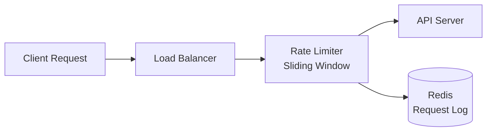
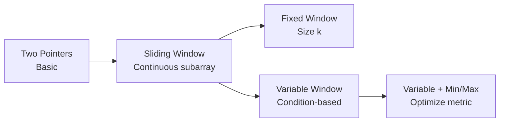
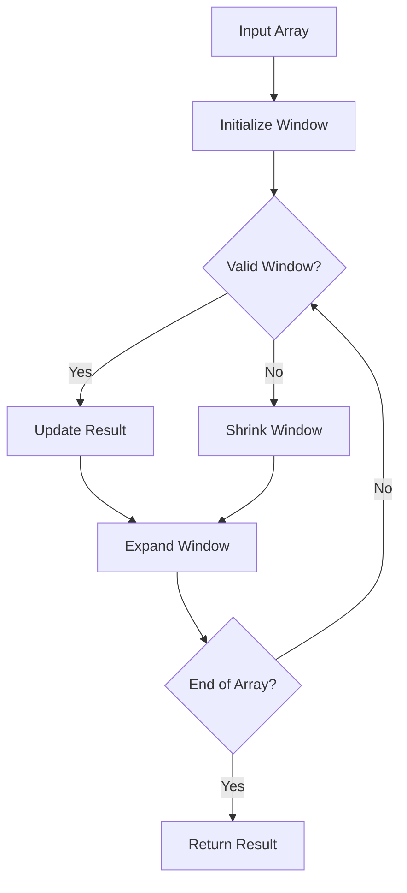
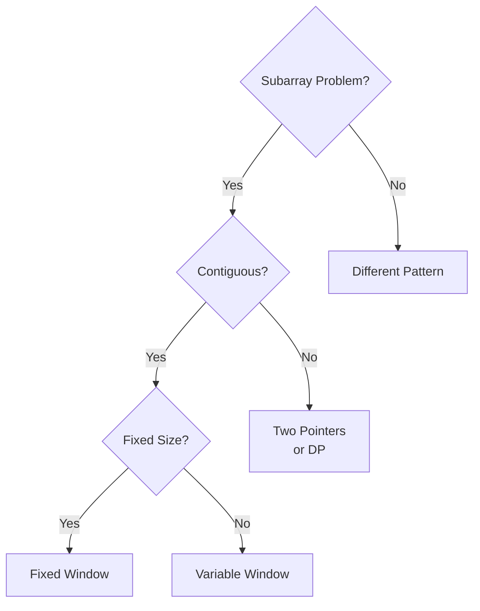

# Merge Strategy: CORE Patterns + Behavior Patterns = Unified Learning System

**Date**: December 31, 2025
**Goal**: Combine mental models (engineer-thoughts) with production implementations (behavior_patterns) into a single, comprehensive learning resource

---

## The Problem

**Current State** (Disconnected):
```
1. Read theory:     library_2025/CORE/engineer-thoughts/sliding-window-thoughts.md
2. Find code:       behavior_patterns/array_pointers/sliding_windows/
3. Context switch:  Jump between files, lose flow
```

**What We Want** (Unified):
```
1. Read everything: library_2025/patterns/sliding-window.md
   - Mental model (4-stage pipeline)
   - Production implementations (runnable code)
   - Real-world applications
   - LeetCode practice problems
   - All in ONE place
```

---

## The Vision: Unified Pattern Library

### New Structure

```
library_2025/
├── README.md                          # Updated guide
├── patterns/                          # THE learning system ⭐
│   ├── README.md                      # Master index with decision trees
│   │
│   ├── 01-sliding-window.md           # Complete pattern resource
│   │   ├── 4-Stage Mental Pipeline
│   │   ├── Core Implementation (Python)
│   │   ├── Variants (Fixed/Variable/Substring)
│   │   ├── Production Use Cases
│   │   ├── LeetCode Problems (table)
│   │   └── Related Patterns
│   │
│   ├── 02-two-pointers.md
│   ├── 03-fast-slow-pointers.md
│   ├── ... (28 total patterns)
│   └── 28-suffix-array.md
│
├── applications/                      # Complex multi-pattern projects
│   ├── scheduling/                    # Combines DP, Greedy, Graph
│   │   ├── weighted-intervals.py
│   │   ├── interval-partitioning.py
│   │   ├── earliest-deadline-first.py
│   │   └── task-dependencies.py
│   ├── constraint-satisfaction/       # Advanced CSP applications
│   │   ├── arc-consistency-ac3.py
│   │   ├── graph-coloring.py
│   │   └── sudoku-solver.py
│   └── optimization/                  # Branch & Bound applications
│       ├── tsp-branch-bound.py
│       └── knapsack-01-bnb.py
│
├── shapes/                            # Visual learning aids (keep)
├── overview/                          # High-level maps (keep)
│
└── [other categories remain]          # graph_algos, dp, trees, etc.
    ├── graph_algos/
    ├── dp/
    └── ...

DELETED/MERGED:
├── ❌ CORE/engineer-thoughts/        # Merged into patterns/
└── ❌ ../behavior_patterns/          # Merged into patterns/ + applications/
```

---

## Pattern File Structure

Each pattern file becomes a **comprehensive, self-contained learning resource**:

### Template: `patterns/XX-pattern-name.md`

```markdown
# Pattern Name - One-line description

**Category**: Linear Structures | Trees & Graphs | etc.
**Difficulty**: ⭐⭐ Medium
**When to use**: Trigger keywords that map problem → pattern

---

## Mental Model

> "Real-world analogy that makes pattern memorable"

**The insight in one sentence**: Core principle that makes pattern work

---

## The 4-Stage Pipeline

### 1. Problem → Pattern (Recognition)
What keywords/constraints trigger this pattern?
- Keyword 1 → This pattern
- Keyword 2 → This pattern
- ...

### 2. Pattern → Structure (What do I need?)
Data structures, pointers, state variables required.

```
[ASCII art or description of structure]
```

### 3. Structure → Behavior (How does it move?)
Movement rules, invariants, termination conditions.

**Invariants**:
- Invariant 1
- Invariant 2

**Movement**:
- Step 1
- Step 2

### 4. Behavior → Code (Expression)

**Verbose form** (Proof of understanding):
```python
def pattern_verbose(input):
    """
    Clear variable names, explicit steps
    """
    # Step-by-step implementation
    pass
```

**Terse form** (Interview ready):
```python
def pattern_terse(input):
    """Optimized for interviews"""
    # Concise implementation
    pass
```

---

## Production Implementation

### Core Implementation

**Time Complexity**: O(?)
**Space Complexity**: O(?)

```python
"""
Production-ready implementation with:
- Error handling
- Edge cases
- Type hints
- Comprehensive docstrings
"""

from typing import List, Optional

def pattern_implementation(arr: List[int], target: int) -> int:
    """
    [Detailed docstring]

    Args:
        arr: Input array
        target: Target value

    Returns:
        Result value

    Examples:
        >>> pattern_implementation([1,2,3], 5)
        2

    Time: O(n)
    Space: O(1)
    """
    # Implementation with detailed comments
    pass


class PatternSolver:
    """
    Object-oriented wrapper for complex scenarios
    """
    def __init__(self, config):
        self.config = config

    def solve(self):
        pass
```

### Variants

**Variant 1: [Description]**
```python
# Implementation
```

**Variant 2: [Description]**
```python
# Implementation
```

---

## Real-World Applications

### Application 1: [e.g., Rate Limiting]

**Problem**: Distributed system needs to rate limit API requests

**How pattern applies**:
- Sliding window tracks requests in time window
- Fixed window for simple rate limiting
- Variable window for adaptive throttling

**Production Code**:
```python
class RateLimiter:
    """
    Production rate limiter using sliding window
    """
    def __init__(self, max_requests: int, window_seconds: int):
        self.max_requests = max_requests
        self.window_seconds = window_seconds
        self.requests = deque()

    def allow_request(self, timestamp: float) -> bool:
        # Remove expired requests
        while self.requests and self.requests[0] <= timestamp - self.window_seconds:
            self.requests.popleft()

        if len(self.requests) < self.max_requests:
            self.requests.append(timestamp)
            return True
        return False
```

**System Architecture**:


**Used by**: Stripe API, GitHub API, Cloudflare

### Application 2: [Another real-world use]
[Similar structure]

---

## Complexity Analysis

| Operation | Time | Space | Notes |
|-----------|------|-------|-------|
| Best case | O(?) | O(?) | When... |
| Average case | O(?) | O(?) | Typical scenario |
| Worst case | O(?) | O(?) | When... |

---

## Common Pitfalls

### ❌ Mistake 1: [Description]
```python
# Bad implementation
```

**Why it fails**: Explanation

**Fix**:
```python
# Correct implementation
```

### ❌ Mistake 2: [Description]
[Similar structure]

---

## Self-Check Questions

Before moving to practice problems, can you answer these?

1. [ ] Can I describe the structure (what exists) without looking at code?
2. [ ] Can I describe the behavior (how it moves) in plain language?
3. [ ] Can I draw the pattern on a whiteboard?
4. [ ] Can I identify the invariants that must hold?
5. [ ] Can I explain when this pattern applies vs. alternatives?

**If any "no"**: Re-read the 4-Stage Pipeline section

---

## LeetCode Practice Problems

Start with Easy/Medium, progress to Hard once fundamentals are solid.

### Easy

| # | Problem | Topics | Notes |
|---|---------|--------|-------|
| 643 | [Maximum Average Subarray I](https://leetcode.com/problems/maximum-average-subarray-i/) | Fixed window | Start here |

### Medium

| # | Problem | Topics | Notes |
|---|---------|--------|-------|
| 3 | [Longest Substring Without Repeating Characters](https://leetcode.com/problems/longest-substring-without-repeating-characters/) | Variable window, hash map | Classic |
| 209 | [Minimum Size Subarray Sum](https://leetcode.com/problems/minimum-size-subarray-sum/) | Variable window, minimize | Important |

### Hard

| # | Problem | Topics | Notes |
|---|---------|--------|-------|
| 76 | [Minimum Window Substring](https://leetcode.com/problems/minimum-window-substring/) | Variable window, two hash maps | Interview favorite |

---

## Related Patterns

**Foundation**:
- [Two Pointers](./02-two-pointers.md) - Sliding window extends two pointers

**Combines With**:
- [Hash Map](./hash-map.md) - For character frequency tracking
- [Monotonic Stack](./monotonic-stack.md) - For next greater/smaller in window

**Alternative Approaches**:
- [Prefix Sum](./prefix-sum.md) - For static range queries (no window movement)

---

## Pattern Evolution



---

## Interview Tips

**Pattern Recognition Triggers**:
- "contiguous subarray/substring" → Sliding window
- "maximum/minimum length" → Variable window
- "size k" → Fixed window
- "at most/at least K distinct" → Variable window + hash map

**Communication Strategy**:
1. "This is a sliding window problem because..."
2. Draw window on array: `[1, 2, |3, 4, 5|, 6]`
3. Explain invariant: "Window maintains X property"
4. Walk through example before coding

**Common Follow-ups**:
- "What if array has negative numbers?" → [Explain impact]
- "Can you optimize space?" → [Explain tradeoffs]
- "What if input is stream?" → [Explain adaptation]

---

## Mermaid Diagrams

### Pattern Visualization



### Decision Tree



---

## References

**Original Research**:
- [Paper/blog post that introduced pattern]

**Production Examples**:
- Kafka consumer lag monitoring (sliding window)
- Network congestion control (TCP sliding window)
- CDN request analytics (time-series windowing)

**Further Reading**:
- [Link to in-depth article]
- [Link to video explanation]

---

**Next Pattern**: [03-fast-slow-pointers.md](./03-fast-slow-pointers.md)

**Previous Pattern**: [01-two-pointers.md](./01-two-pointers.md)
```

---

## Mapping: behavior_patterns → Unified Patterns

### Direct 1:1 Mappings (Merge into pattern file)

| behavior_patterns Location | → | Unified Pattern File |
|----------------------------|---|---------------------|
| `array_pointers/sliding_windows/` | → | `patterns/01-sliding-window.md` |
| `array_pointers/two_pointers/` | → | `patterns/02-two-pointers.md` |
| `array_pointers/ball-and-chain/` | → | `patterns/02-two-pointers.md` (variant) |
| `array_pointers/pivot/` | → | `patterns/02-two-pointers.md` (variant) |
| `grid_traversal/` | → | `patterns/XX-grid-traversal.md` (new pattern) |
| `divide-and-conquer/` | → | `patterns/XX-divide-conquer.md` (new pattern) |

### Complex Multi-Pattern Applications (Keep as applications/)

These combine multiple patterns and are too complex for single pattern file:

| behavior_patterns Location | → | New Location |
|----------------------------|---|-------------|
| `optimizations/scheduling/weighted_intervals.py` | → | `applications/scheduling/` |
| `optimizations/scheduling/interval_partitioning.py` | → | `applications/scheduling/` |
| `optimizations/scheduling/earliest_deadline_first.py` | → | `applications/scheduling/` |
| `optimizations/scheduling/task_dependencies.py` | → | `applications/scheduling/` |
| `optimizations/scheduling/meeting_rooms.py` | → | `applications/scheduling/` |
| `optimizations/constraints/csp-advanced/arc_consistency_ac3.py` | → | `applications/constraint-satisfaction/` |
| `optimizations/constraints/partitions/*` | → | `patterns/28-partitions.md` |
| `optimizations/graph-coloring/` | → | `applications/graph-problems/` |
| `optimizations/branch-and-bound/tsp_branch_bound.py` | → | `applications/optimization/` |
| `optimizations/branch-and-bound/knapsack_01_bnb.py` | → | `applications/optimization/` |
| `optimizations/knapsack/` | → | `patterns/XX-dynamic-programming.md` (examples) |

**Rationale**: Scheduling algorithms combine:
- Dynamic Programming (weighted intervals)
- Greedy (interval partitioning, EDF)
- Graph algorithms (task dependencies with topological sort)
- These are *applications* that demonstrate pattern composition, not core patterns themselves

---

## Migration Steps

### Phase 1: Rename & Restructure
**Time**: 30 minutes

```bash
cd /Users/tobiahrex/code/domains/me/algorist

# 1. Rename CORE/engineer-thoughts to patterns
mv library_2025/CORE/engineer-thoughts library_2025/patterns

# 2. Rename files (remove "-thoughts" suffix)
cd library_2025/patterns
for file in *-thoughts.md; do
    mv "$file" "${file/-thoughts/}"
done

# 3. Number files for easy navigation (optional but recommended)
mv sliding-window.md 01-sliding-window.md
mv two-pointers.md 02-two-pointers.md
mv fast-slow-pointers.md 03-fast-slow-pointers.md
# ... (continue for all 28 patterns)

# 4. Update README.md to reflect numbering

cd ../..
```

---

### Phase 2: Merge Implementations into Pattern Files
**Time**: 2-3 hours (can be done incrementally)

For each pattern with corresponding behavior_patterns code:

#### Example: Sliding Window

```bash
# 1. Open both files
code library_2025/patterns/01-sliding-window.md
code behavior_patterns/array_pointers/sliding_windows/fixed_window.py

# 2. In 01-sliding-window.md, add new section after "4-Stage Pipeline":

## Production Implementation

### Core Implementation

[Copy from fixed_window.py with proper markdown formatting]

### Variants

**Fixed Window**:
[Copy fixed_window.py]

**Variable Window**:
[Copy variable_window.py]

### Real-World Applications

**Rate Limiting**:
[Copy from real-world examples in behavior_patterns]
```

#### Repeat for each pattern:

1. `02-two-pointers.md` ← merge `array_pointers/two_pointers/`, `ball-and-chain/`, `pivot/`
2. `03-fast-slow-pointers.md` ← merge if any implementations exist
3. `04-merge-intervals.md` ← merge if any implementations exist
4. ... continue for all 28 patterns

---

### Phase 3: Create applications/ Directory
**Time**: 30 minutes

```bash
cd library_2025

# Create applications directory
mkdir -p applications/scheduling
mkdir -p applications/constraint-satisfaction
mkdir -p applications/optimization
mkdir -p applications/graph-problems

# Move complex multi-pattern implementations
cp ../behavior_patterns/optimizations/scheduling/*.py applications/scheduling/
cp ../behavior_patterns/optimizations/constraints/csp-advanced/*.py applications/constraint-satisfaction/
cp ../behavior_patterns/optimizations/graph-coloring/*.py applications/graph-problems/
cp ../behavior_patterns/optimizations/branch-and-bound/*.py applications/optimization/

# Create README.md in applications/
cat > applications/README.md << 'EOF'
# Applications - Multi-Pattern Projects

Complex problems that combine multiple algorithmic patterns.

## Scheduling Problems

Real-world scheduling combining DP, Greedy, and Graph algorithms:
- **Weighted Intervals**: DP with binary search
- **Interval Partitioning**: Greedy with min-heap
- **Earliest Deadline First**: Greedy scheduling
- **Task Dependencies**: Topological sort + critical path

See: [scheduling/](./scheduling/)

## Constraint Satisfaction

Advanced CSP techniques:
- **AC-3**: Arc consistency for constraint propagation
- **Graph Coloring**: Greedy and backtracking approaches
- **Sudoku Solver**: CSP application

See: [constraint-satisfaction/](./constraint-satisfaction/)

## Optimization

Branch & Bound for NP-hard problems:
- **TSP**: Traveling Salesman with MST bounds
- **0/1 Knapsack**: With fractional relaxation

See: [optimization/](./optimization/)

---

**Study Approach**: Master individual patterns first, then study these to see how patterns compose in real-world problems.
EOF
```

---

### Phase 4: Update Cross-References
**Time**: 1 hour

#### In each pattern file, add references to applications:

Example in `01-sliding-window.md`:

```markdown
## See Also in Applications

**Scheduling**: Sliding window concepts used in:
- `applications/scheduling/earliest_deadline_first.py` - Time window scheduling

**Production Systems**:
- Rate limiting (Redis sliding window)
- Monitoring (Prometheus time-series queries)
- Stream processing (Kafka consumer windowing)
```

#### In applications README files:

Example in `applications/scheduling/README.md`:

```markdown
# Scheduling Applications

## Weighted Intervals

**Patterns Used**:
- [Dynamic Programming](../../patterns/14-dynamic-programming.md)
- [Binary Search](../../patterns/08-binary-search.md)
- [Greedy](../../patterns/15-greedy.md) (for comparison)

**Problem**: Select non-overlapping intervals to maximize profit

**Implementation**: [weighted_intervals.py](./weighted_intervals.py)
```

---

### Phase 5: Delete Merged Content
**Time**: 15 minutes

```bash
cd /Users/tobiahrex/code/domains/me/algorist

# After verifying everything merged correctly:

# Delete behavior_patterns (now merged)
rm -rf behavior_patterns/

# Delete old CORE structure (now renamed to patterns)
# (Already renamed, so just verify)
ls -la library_2025/CORE  # Should be empty or just shapes/overview

# Update git
git add -A
git commit -m "MERGE: Unify CORE patterns + behavior_patterns into single learning system"
```

---

## Updated Learning Workflow

### Before (Disconnected)
```
1. Read:   library_2025/CORE/engineer-thoughts/sliding-window-thoughts.md
2. Search: "Where's the implementation?"
3. Find:   behavior_patterns/array_pointers/sliding_windows/
4. Switch: Back to markdown for theory
5. Lost:   Context and flow
```

### After (Unified)
```
1. Open: library_2025/patterns/01-sliding-window.md
2. Read: Mental model (4-stage pipeline)
3. Study: Production implementation (same file)
4. See: Real-world applications (same file)
5. Practice: LeetCode problems (same file)
6. Done: Everything in ONE place
```

---

## Benefits

### ✅ Single Source of Truth
- No more "where's the implementation?"
- No context switching between files
- Everything for a pattern in ONE place

### ✅ Self-Contained Learning
- Open one file, learn everything about pattern
- Can read offline, no jumping around
- Print-friendly (if needed)

### ✅ Easier Maintenance
- Update theory and code in same place
- No risk of desynchronization
- Clear ownership (one file per pattern)

### ✅ Better for Review
- Quick review: Scan one file
- Before interview: Read relevant pattern files
- No hunting for scattered resources

### ✅ Cleaner Repository
- Delete entire behavior_patterns/ directory
- Simpler structure
- Less cognitive overhead

---

## File Size Considerations

**Concern**: Pattern files might get large (5-10 KB → 50-100 KB with code)

**Why it's fine**:
1. **Modern editors handle it**: VSCode, Vim, etc. have no issues with 100KB files
2. **Markdown is text**: Compresses well, loads fast
3. **Better than jumping**: One 100KB file better than 10×10KB files across directories
4. **Collapsible sections**: Markdown viewers collapse sections
5. **Search works**: Cmd+F finds everything in one place

**If files get too large** (>500KB):
- Use file structure with `patterns/01-sliding-window/`
  - `README.md` - Theory and mental model
  - `implementation.py` - Code
  - `applications.md` - Real-world examples
- But start with single file - YAGNI (You Aren't Gonna Need It)

---

## Comparison: Before vs After

### Before: Split System

```
algorist/
├── library_2025/
│   └── CORE/
│       └── engineer-thoughts/        # Theory here
│           ├── sliding-window-thoughts.md
│           └── two-pointers-thoughts.md
│
└── behavior_patterns/                # Code here
    └── array_pointers/
        ├── sliding_windows/
        └── two_pointers/
```

**Issues**:
- Mental overhead: "Which system do I use?"
- Context switching: Jump between directories
- Duplication: README in both places
- Maintenance: Update two places

### After: Unified System

```
algorist/
└── library_2025/
    ├── patterns/                     # Everything here ⭐
    │   ├── README.md                 # Master index
    │   ├── 01-sliding-window.md      # Theory + Code + Practice
    │   ├── 02-two-pointers.md        # Theory + Code + Practice
    │   └── ... (28 patterns)
    │
    └── applications/                 # Complex multi-pattern projects
        ├── scheduling/
        ├── constraint-satisfaction/
        └── optimization/
```

**Benefits**:
- No mental overhead: One clear system
- No context switching: Everything in one file
- No duplication: Single source of truth
- Easy maintenance: Update one file

---

## Migration Checklist

### Phase 1: Rename & Restructure ✅
- [ ] Rename `CORE/engineer-thoughts/` → `patterns/`
- [ ] Remove `-thoughts` suffix from all files
- [ ] Number files (01-28) for easy navigation
- [ ] Update `patterns/README.md` with new numbering
- [ ] Test: All internal links still work

### Phase 2: Merge Implementations ✅
For each of 28 patterns:
- [ ] 01-sliding-window.md ← merge `array_pointers/sliding_windows/`
- [ ] 02-two-pointers.md ← merge `array_pointers/two_pointers/`, `ball-and-chain/`, `pivot/`
- [ ] 03-fast-slow-pointers.md ← check for implementations
- [ ] 04-merge-intervals.md ← check for implementations
- [ ] ... (continue for all 28)

### Phase 3: Create applications/ ✅
- [ ] Create directory structure
- [ ] Move scheduling implementations
- [ ] Move CSP implementations
- [ ] Move optimization implementations
- [ ] Create README files for each category
- [ ] Add cross-references to pattern files

### Phase 4: Update Documentation ✅
- [ ] Update main `README.md`
- [ ] Update `CLAUDE.md`
- [ ] Update `patterns/README.md` master index
- [ ] Add cross-references in pattern files
- [ ] Add cross-references in application files

### Phase 5: Delete Merged Content ✅
- [ ] Verify all content merged correctly
- [ ] Delete `behavior_patterns/` directory
- [ ] Clean up `CORE/` structure (if needed)
- [ ] Update `.gitignore` (if needed)
- [ ] Commit changes

### Phase 6: Test & Validate ✅
- [ ] Read through 3-5 pattern files - feel natural?
- [ ] Check all cross-references work
- [ ] Verify code examples are formatted correctly
- [ ] Test: Can I learn a new pattern from scratch using just one file?
- [ ] Celebrate: Repository is now clean and unified! 🎉

---

## Timeline

| Phase | Time | Can Do Later? |
|-------|------|---------------|
| Phase 1: Rename & Restructure | 30 min | No - Do first |
| Phase 2: Merge Implementations | 2-3 hours | **Yes** - Can merge 1-2 patterns per day |
| Phase 3: Create applications/ | 30 min | No - Do after Phase 2 |
| Phase 4: Update Documentation | 1 hour | Yes - Can refine later |
| Phase 5: Delete Merged Content | 15 min | No - Do after Phase 2 complete |
| Phase 6: Test & Validate | 30 min | No - Do at end |

**Total**: 4-5 hours (can spread over multiple days)

**Recommended**:
- Day 1: Phase 1 (30 min)
- Day 2-5: Phase 2 (merge 5-7 patterns per day)
- Day 6: Phases 3-6 (finish up)

---

## Example: Sliding Window Merge

**Before** (Split):

File 1: `library_2025/CORE/engineer-thoughts/sliding-window-thoughts.md` (15 KB)
- Mental model
- 4-stage pipeline
- LeetCode problems

File 2: `behavior_patterns/array_pointers/sliding_windows/fixed_window.py` (5 KB)
- Implementation

File 3: `behavior_patterns/array_pointers/sliding_windows/variable_window.py` (5 KB)
- Implementation

**After** (Unified):

File: `library_2025/patterns/01-sliding-window.md` (25 KB)
- Mental model
- 4-stage pipeline
- Core implementation (from fixed_window.py)
- Variants (from variable_window.py)
- Real-world applications
- LeetCode problems
- Cross-references

**Result**: 3 files → 1 file, everything in one place!

---

## Success Criteria

After merge, you should be able to:

1. ✅ **Learn a new pattern** by reading ONE file (no jumping)
2. ✅ **Review before interview** by scanning numbered pattern files
3. ✅ **Find production code** in the pattern file (no searching)
4. ✅ **See real-world applications** in context (no guessing)
5. ✅ **Navigate easily** with numbered files (01-28)

**The ultimate test**: Can you confidently say "Everything I need is in `library_2025/patterns/`"?

If yes → Success! 🎉

---

## Next Steps

1. **Read this document** - Make sure you agree with approach
2. **Start Phase 1** - Quick 30-minute restructure
3. **Merge incrementally** - 5-7 patterns per day
4. **Celebrate when done** - You'll have the cleanest, most unified learning system ever!

**Ready?** Let's do this! 🚀
