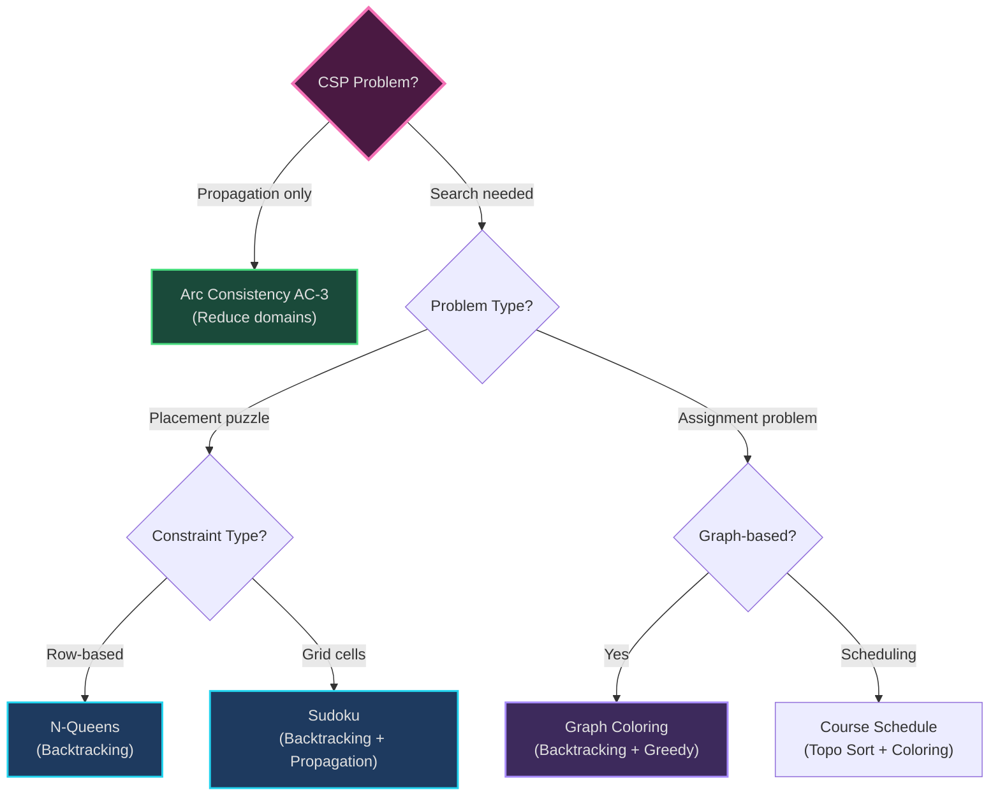
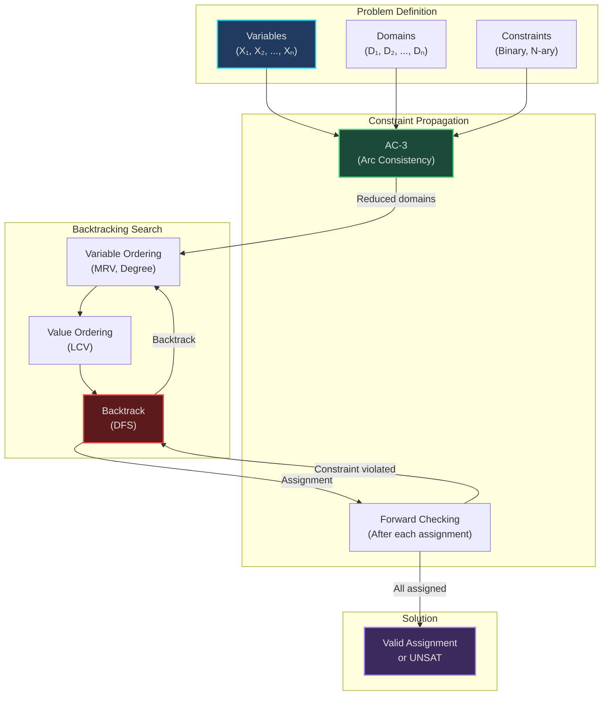

# Constraint Satisfaction Problems (CSP) - Multi-Pattern Applications

*Real-world CSP combining Backtracking, Constraint Propagation, Heuristics, and Graph Coloring*

---

## Overview

Constraint Satisfaction Problems involve finding assignments to variables that satisfy a set of constraints. CSP is a problem-solving paradigm used in AI, scheduling, configuration, and puzzle solving.

**Patterns Combined:**
- **[19. Backtracking](../../patterns/19-backtracking.md)** - Exhaustive search with pruning
- **[23. Constraint Satisfaction](../../patterns/23-constraint-satisfaction.md)** - CSP framework
- **[11. DFS](../../patterns/11-dfs.md)** - Search space exploration
- **[21. Greedy](../../patterns/21-greedy.md)** - Heuristic orderings (MRV, LCV)
- **[12. Topological Sort](../../patterns/12-topological-sort.md)** - Graph coloring (scheduling)

---

## CSP Framework

**Mental Model**: *"Assigning values to variables such that no rules are broken"*

**Components:**
1. **Variables**: X₁, X₂, ..., Xₙ (e.g., Sudoku cells, course time slots)
2. **Domains**: D₁, D₂, ..., Dₙ (possible values for each variable, e.g., {1-9})
3. **Constraints**: Rules that restrict variable assignments (e.g., row ≠ col ≠ box)

**Goal**: Find assignment {X₁=v₁, X₂=v₂, ..., Xₙ=vₙ} where vᵢ ∈ Dᵢ and all constraints satisfied.

---

## Algorithms Implemented

### 1. Arc Consistency (AC-3) (`arc_consistency_ac3.py`)

**Problem**: Reduce search space by eliminating inconsistent values before search.

**Pattern**: **Constraint Propagation + Queue Processing**

**Mental Model**: *"Sudoku pencil marks - cross out values that violate constraints"*

**Structure:**
- Queue of arcs (variable pairs with constraints)
- Domain tracking (current possible values per variable)
- Arc consistency: For variable X → Y, every value in D_X has compatible value in D_Y

**Behavior:**
```
Initialize queue with all arcs
While queue not empty:
  Arc (X, Y) = dequeue()
  If revise(X, Y):  # Remove inconsistent values from D_X
    If D_X is empty:
      Return INCONSISTENT
    Add all arcs (Z, X) to queue (propagate constraint)

Return CONSISTENT
```

**Complexity**: O(cd³) where c = constraints, d = domain size

**Real-World Uses**:
- Sudoku solvers (prune pencil marks)
- Resource allocation (eliminate impossible assignments)
- Configuration systems (product customization)

**Key Insight**: AC-3 doesn't solve CSP, but shrinks domains before backtracking search.

**Code Highlights**:
```python
def ac3(variables, domains, constraints):
    queue = deque([(Xi, Xj) for Xi in variables for Xj in constraints[Xi]])

    while queue:
        Xi, Xj = queue.popleft()

        if revise(domains, Xi, Xj, constraints):
            if not domains[Xi]:
                return False  # Domain empty = no solution

            # Propagate: add all arcs (Xk, Xi) except Xj
            for Xk in constraints[Xi]:
                if Xk != Xj:
                    queue.append((Xk, Xi))

    return True
```

---

### 2. N-Queens (`n-queens.py`)

**Problem**: Place N queens on N×N chessboard such that no two queens attack each other.

**Pattern**: **Backtracking + Constraint Checking**

**Mental Model**: *"Chess puzzle - place queens one row at a time, backtrack if attacked"*

**Structure:**
- Board: N×N grid
- Placement: One queen per row (implicit constraint)
- Constraints: No two queens in same column, diagonal

**Behavior:**
```
def solve(row):
    If row == N:
        Solution found, return board

    For col in 0..N-1:
        If safe(row, col):  # Check column, diagonals
            Place queen at (row, col)
            If solve(row + 1):
                Return solution
            Remove queen (backtrack)

    Return False
```

**Complexity**: O(N!) worst case, but pruning drastically reduces search space

**Real-World Uses**:
- Resource conflict avoidance
- Task scheduling (no conflicts)
- Circuit board layout (no interference)

**Related LeetCode**: [51. N-Queens](https://leetcode.com/problems/n-queens/)

**Optimization**: Use bit manipulation to track attacked columns/diagonals (faster checks)

---

### 3. Sudoku Solver (`sudoku.py`)

**Problem**: Fill 9×9 grid with digits 1-9 such that each row, column, and 3×3 box contains all digits.

**Pattern**: **Backtracking + Constraint Propagation**

**Mental Model**: *"Puzzle solving - try numbers, erase if violates rules, backtrack when stuck"*

**Structure:**
- Board: 9×9 grid
- Domains: {1-9} initially, pruned by constraints
- Constraints: Row uniqueness, column uniqueness, box uniqueness

**Behavior:**
```
Find empty cell
For each digit 1-9:
    If digit is valid (not in row/col/box):
        Place digit
        If solve() recursively:
            Return True
        Remove digit (backtrack)

Return False if no digit works
```

**Complexity**: O(9^m) where m = empty cells (but pruning helps)

**Real-World Uses**:
- Puzzle generation and solving
- Constraint-based configuration
- Scheduling with multiple constraints

**Related LeetCode**: [37. Sudoku Solver](https://leetcode.com/problems/sudoku-solver/)

**Enhancements**:
- **Naked singles**: If cell has only one possible value, fill it
- **Hidden singles**: If digit can only go in one place in row/col/box, fill it
- **AC-3**: Propagate constraints before search

---

### 4. Graph Coloring (`graph_coloring.py`)

**Problem**: Assign colors to graph vertices such that no adjacent vertices share the same color.

**Pattern**: **Backtracking + Greedy Heuristics**

**Mental Model**: *"Map coloring - adjacent countries must have different colors"*

**Structure:**
- Graph: Adjacency list
- Colors: k colors available
- Assignment: color[vertex]

**Behavior:**
```
def color(vertex):
    If all vertices colored:
        Return True

    For each color in 1..k:
        If safe(vertex, color):  # No neighbor has this color
            Assign color[vertex] = color
            If color(next_vertex):
                Return True
            Unassign (backtrack)

    Return False
```

**Complexity**: O(k^V) worst case

**Real-World Uses**:
- Course scheduling (conflicts = same time slot)
- Register allocation (compiler optimization)
- Frequency assignment (cellular networks)

**Greedy Heuristics**:
- **Degree ordering**: Color highest-degree vertices first
- **Smallest-first**: Color vertices with fewest available colors first

**Chromatic Number**: Minimum colors needed (NP-hard to compute)

**Code Highlights**:
```python
def is_safe(graph, colors, vertex, color):
    for neighbor in graph[vertex]:
        if colors[neighbor] == color:
            return False
    return True

def graph_coloring_backtracking(graph, k, vertex=0, colors=None):
    if vertex == len(graph):
        return True

    for color in range(1, k + 1):
        if is_safe(graph, colors, vertex, color):
            colors[vertex] = color
            if graph_coloring_backtracking(graph, k, vertex + 1, colors):
                return True
            colors[vertex] = 0  # Backtrack

    return False
```

---

### 5. Course Schedule (Graph Coloring Application) (`course_schedule.py`)

**Problem**: Schedule courses in minimum semesters with conflict constraints.

**Pattern**: **Graph Coloring + Topological Sort**

**Mental Model**: *"Academic planning - conflicting courses can't be same semester"*

**Structure:**
- Graph: Vertices = courses, edges = conflicts
- Colors = time slots (semesters)
- Dependencies = prerequisites (separate constraint)

**Behavior:**
```
1. Topological sort for prerequisite ordering
2. Graph coloring for conflict resolution
3. Chromatic number = minimum semesters needed
```

**Related LeetCode**:
- [207. Course Schedule](https://leetcode.com/problems/course-schedule/)
- [210. Course Schedule II](https://leetcode.com/problems/course-schedule-ii/)

**Extension**: If prerequisites exist, combine topological sort (order) + graph coloring (conflicts).

---

## CSP Problem Decision Tree



---

## CSP Techniques Comparison

| Technique | Purpose | Complexity | Completeness | Use When |
|-----------|---------|------------|--------------|----------|
| **Backtracking** | Find valid assignment | O(d^n) | ✅ Complete | Small domains, need exact solution |
| **AC-3** | Prune domains | O(cd³) | ❌ Not complete | Preprocessing, reduce search space |
| **Forward Checking** | Propagate immediately | O(d²) per var | ✅ Complete | After each assignment |
| **MRV Heuristic** | Variable ordering | O(n) per choice | ✅ Complete | Choose most constrained variable |
| **LCV Heuristic** | Value ordering | O(d²) | ✅ Complete | Try least constraining values first |
| **Greedy Coloring** | Fast approximate | O(V + E) | ❌ Not optimal | Need fast solution, k colors sufficient |

---

## Heuristics for CSP Search

### Variable Ordering Heuristics

**Minimum Remaining Values (MRV)**:
- *"Choose variable with fewest legal values"*
- Fail-first: Detect dead-ends early
- Reduces branching factor

**Degree Heuristic**:
- *"Choose variable with most constraints on remaining variables"*
- Tie-breaker for MRV

### Value Ordering Heuristics

**Least Constraining Value (LCV)**:
- *"Choose value that rules out fewest choices for neighbors"*
- Leave maximum flexibility for future assignments

**Example (Graph Coloring)**:
```python
# MRV: Choose vertex with fewest available colors
def select_vertex(graph, colors):
    uncolored = [v for v in range(len(graph)) if colors[v] == 0]
    return min(uncolored, key=lambda v: count_available_colors(graph, colors, v))

# LCV: Try colors that least constrain neighbors
def order_colors(graph, colors, vertex, k):
    color_constraints = []
    for color in range(1, k + 1):
        if is_safe(graph, colors, vertex, color):
            # Count neighbors this color would constrain
            constrained = count_constrained_neighbors(graph, colors, vertex, color)
            color_constraints.append((constrained, color))

    # Sort by least constraining first
    color_constraints.sort()
    return [color for _, color in color_constraints]
```

---

## System Architecture: CSP Solver



---

## Usage Examples

### Solving N-Queens

```python
from n_queens import solve_n_queens

n = 8
solutions = solve_n_queens(n)

print(f"{len(solutions)} solutions for {n}-Queens")
print("First solution:")
for row in solutions[0]:
    print(' '.join('Q' if col == 1 else '.' for col in row))

# Output:
# 92 solutions for 8-Queens
# First solution:
# Q . . . . . . .
# . . . . Q . . .
# . . . . . . . Q
# ...
```

### Solving Sudoku

```python
from sudoku import solve_sudoku

board = [
    [5,3,0, 0,7,0, 0,0,0],
    [6,0,0, 1,9,5, 0,0,0],
    ...
]

if solve_sudoku(board):
    print("Solution found:")
    for row in board:
        print(' '.join(str(x) if x != 0 else '.' for x in row))
else:
    print("No solution exists")
```

### Graph Coloring with Greedy

```python
from graph_coloring import greedy_coloring

graph = {
    0: [1, 2],
    1: [0, 2, 3],
    2: [0, 1, 3],
    3: [1, 2]
}

colors = greedy_coloring(graph)
print(f"Chromatic number: {max(colors.values())}")
print(f"Coloring: {colors}")

# Output: Chromatic number: 3
# Coloring: {0: 1, 1: 2, 2: 3, 3: 1}
```

---

## Learning Path

1. **Understand CSP framework**: Study [23. Constraint Satisfaction](../../patterns/23-constraint-satisfaction.md)
2. **Learn backtracking**: Study [19. Backtracking](../../patterns/19-backtracking.md)
3. **Start simple**: N-Queens (clear constraints)
4. **Add propagation**: AC-3 algorithm
5. **Complex constraints**: Sudoku (multiple constraint types)
6. **Graph problems**: Graph coloring, course scheduling
7. **Optimize**: Add MRV, LCV heuristics

**LeetCode Practice**:
- [51. N-Queens](https://leetcode.com/problems/n-queens/)
- [37. Sudoku Solver](https://leetcode.com/problems/sudoku-solver/)
- [207. Course Schedule](https://leetcode.com/problems/course-schedule/)

---

## Navigation

**[↑ Back to Applications](../README.md)** | **[← Patterns Index](../../patterns/README.md)**

**Related Patterns**: [11](../../patterns/11-dfs.md) · [12](../../patterns/12-topological-sort.md) · [19](../../patterns/19-backtracking.md) · [21](../../patterns/21-greedy.md) · [23](../../patterns/23-constraint-satisfaction.md)

**Related Applications**: [Scheduling](../scheduling/) · [Partitions](../partitions/)
