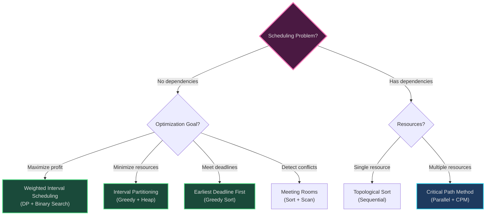
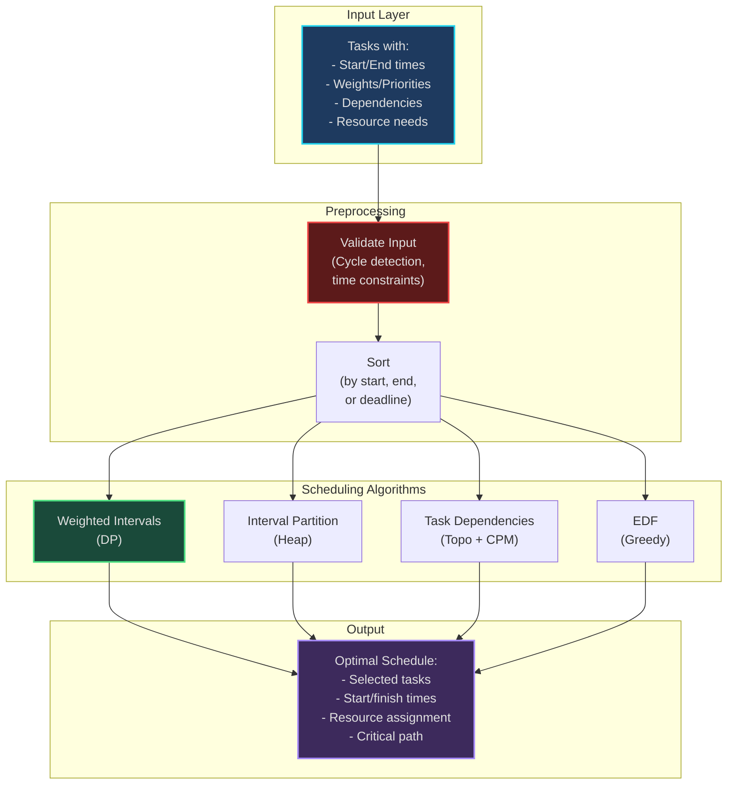

# Scheduling Algorithms - Multi-Pattern Applications

*Real-world scheduling problems combining Greedy, Dynamic Programming, Graph algorithms, and Heap patterns*

---

## Overview

Scheduling algorithms select and order tasks subject to constraints (time, resources, dependencies). This domain demonstrates how multiple algorithmic patterns combine to solve production problems.

**Patterns Combined:**
- **[04. Merge Intervals](../../patterns/04-merge-intervals.md)** - Overlapping time windows
- **[12. Topological Sort](../../patterns/12-topological-sort.md)** - Task dependencies (DAGs)
- **[17. Top K / Heap](../../patterns/17-top-k-heap.md)** - Resource allocation, earliest available
- **[20. Dynamic Programming](../../patterns/20-dynamic-programming.md)** - Optimal subset selection
- **[21. Greedy](../../patterns/21-greedy.md)** - Locally optimal choices (EDF, interval partitioning)

---

## Algorithms Implemented

### 1. Weighted Interval Scheduling (`weighted_intervals.py`)

**Problem**: Select non-overlapping intervals to maximize profit.

**Pattern**: **Dynamic Programming + Binary Search**

**Mental Model**: *"Freelance consultant choosing projects - can't work on overlapping projects, maximize revenue"*

**Structure:**
- Sort intervals by end time
- DP[i] = max profit using first i intervals
- Binary search to find compatible past intervals

**Behavior:**
```
For each interval i:
  Option 1: Skip it → dp[i] = dp[i-1]
  Option 2: Take it → dp[i] = weight[i] + dp[compatible[i]]
  dp[i] = max(option1, option2)
```

**Complexity**: O(n log n) time, O(n) space

**Real-World Uses**:
- Project/consultant scheduling with ROI
- Event booking systems with profit optimization
- Resource rental with variable pricing

**Related LeetCode**: [1235. Maximum Profit in Job Scheduling](https://leetcode.com/problems/maximum-profit-in-job-scheduling/)

**Code Highlights**:
```python
def weighted_interval_scheduling_dp(intervals):
    intervals = sorted(intervals, key=lambda x: x[1])  # Sort by end time

    def find_compatible(i):
        # Binary search for latest non-overlapping interval
        start_i = intervals[i][0]
        # ... binary search logic

    dp = [0] * n
    dp[0] = intervals[0][2]  # weight

    for i in range(1, n):
        option_skip = dp[i - 1]
        compatible_idx = find_compatible(i)
        option_take = intervals[i][2] + (dp[compatible_idx] if compatible_idx >= 0 else 0)
        dp[i] = max(option_skip, option_take)
```

---

### 2. Interval Partitioning (`interval_partitioning.py`)

**Problem**: Minimum number of resources (rooms, machines) needed to schedule all intervals.

**Pattern**: **Greedy + Min-Heap**

**Mental Model**: *"Conference room allocation - assign each meeting to earliest available room"*

**Structure:**
- Sort intervals by start time
- Min-heap of room finish times
- Greedy assignment: use room that finishes earliest

**Behavior:**
```
Sort intervals by start time
heap = []

For each interval:
  If heap.top() <= interval.start:
    Reuse room (pop and push new finish time)
  Else:
    Need new room (push finish time)

Return heap.size (number of rooms)
```

**Complexity**: O(n log n) time, O(n) space

**Real-World Uses**:
- Meeting room scheduling
- Server/worker allocation
- Classroom scheduling

**Related LeetCode**: [253. Meeting Rooms II](https://leetcode.com/problems/meeting-rooms-ii/)

**Key Insight**: Greedy works because sorting by start time + always using earliest room is optimal.

---

### 3. Earliest Deadline First (EDF) (`earliest_deadline_first.py`)

**Problem**: Schedule tasks with deadlines to maximize completed tasks or minimize lateness.

**Pattern**: **Greedy (Priority Queue)**

**Mental Model**: *"Triage in ER - always handle most urgent patient first"*

**Structure:**
- Sort tasks by deadline (earliest first)
- Current time tracker
- Count completed tasks

**Behavior:**
```
Sort tasks by deadline
current_time = 0

For each task (in deadline order):
  If current_time + task.duration <= task.deadline:
    Execute task
    current_time += task.duration
  Else:
    Skip task (can't meet deadline)
```

**Complexity**: O(n log n) time, O(1) space

**Real-World Uses**:
- Real-time operating systems (task scheduling)
- Manufacturing workflows with due dates
- Customer service ticket prioritization

**Related LeetCode**: [1353. Maximum Number of Events That Can Be Attended](https://leetcode.com/problems/maximum-number-of-events-that-can-be-attended/)

**Theorem**: EDF minimizes maximum lateness for single-machine scheduling.

---

### 4. Task Dependencies (Precedence Constraints) (`task_dependencies.py`)

**Problem**: Schedule tasks with prerequisite dependencies to minimize completion time.

**Pattern**: **Topological Sort + Critical Path Method (CPM)**

**Mental Model**: *"Software build system - can't link before compiling, must respect dependencies"*

**Structure:**
- DAG of task dependencies
- Topological sort for valid ordering
- Critical path = longest dependency chain
- Earliest start times via forward pass
- Latest start times via backward pass

**Behavior:**
```
1. Topological sort (Kahn's or DFS)
2. For parallel scheduling:
   - Compute earliest_start[task] = max(finish times of prerequisites)
   - Assign to earliest available resource (min-heap)
3. Critical path:
   - Forward pass: earliest start/finish
   - Backward pass: latest start/finish
   - Slack = 0 → critical task
```

**Complexity**: O(V + E) time, O(V) space

**Real-World Uses**:
- Project management (PERT/CPM charts)
- Build systems (Make, Bazel, Maven)
- Database query optimization
- Manufacturing assembly lines

**Related LeetCode**:
- [207. Course Schedule](https://leetcode.com/problems/course-schedule/)
- [210. Course Schedule II](https://leetcode.com/problems/course-schedule-ii/)

**Visualizes**:
- Gantt charts
- Critical path (tasks that delay project if delayed)
- Parallelization opportunities

---

### 5. Meeting Rooms (`meeting_rooms.py`)

**Problem**: Determine if person can attend all meetings (no overlaps).

**Pattern**: **Merge Intervals**

**Mental Model**: *"Calendar conflict detection - check for overlapping appointments"*

**Structure:**
- Sort meetings by start time
- Check consecutive meetings for overlap

**Behavior:**
```
Sort meetings by start time

For i in range(1, n):
  If meetings[i].start < meetings[i-1].end:
    Return False  # Overlap detected

Return True
```

**Complexity**: O(n log n) time, O(1) space

**Related LeetCode**: [252. Meeting Rooms](https://leetcode.com/problems/meeting-rooms/)

---

## Pattern Comparison Matrix

| Algorithm | Primary Pattern | Time | Space | Optimal? | Use When |
|-----------|-----------------|------|-------|----------|----------|
| Weighted Intervals | DP + Binary Search | O(n log n) | O(n) | ✅ Yes | Maximize profit, non-overlapping |
| Interval Partitioning | Greedy + Heap | O(n log n) | O(n) | ✅ Yes | Minimize resources, all must execute |
| EDF | Greedy (Sort) | O(n log n) | O(1) | ✅ Yes (min lateness) | Deadlines, maximize completed |
| Task Dependencies | Topological Sort + CPM | O(V + E) | O(V) | ✅ Yes (min time) | Prerequisites, parallel execution |
| Meeting Rooms | Sort + Scan | O(n log n) | O(1) | ✅ Yes | Simple overlap detection |

---

## Scheduling Problem Decision Tree



---

## System Architecture: Production Scheduling Service



---

## Usage Examples

### Running Weighted Interval Scheduling

```python
from weighted_intervals import weighted_interval_scheduling_dp

# Intervals: (start, end, weight)
intervals = [
    (1, 3, 5),   # Project A: hours 1-3, profit $5K
    (2, 5, 6),   # Project B: hours 2-5, profit $6K
    (4, 6, 5),   # Project C: hours 4-6, profit $5K
    (6, 7, 4),   # Project D: hours 6-7, profit $4K
    (5, 8, 11),  # Project E: hours 5-8, profit $11K
    (7, 9, 2),   # Project F: hours 7-9, profit $2K
]

max_profit, selected = weighted_interval_scheduling_dp(intervals)
print(f"Max profit: ${max_profit}K")
print(f"Selected: {selected}")
# Output: Max profit: $17K, Selected: [(2,5,6), (5,8,11)]
```

### Running Task Dependencies

```python
from task_dependencies import DependencyScheduler

# Build system example
modules = {
    'utils':    (2, []),                    # 2 min, no deps
    'config':   (1, []),                    # 1 min, no deps
    'database': (3, ['config', 'utils']),   # 3 min, needs config + utils
    'api':      (4, ['database']),          # 4 min, needs database
    'auth':     (2, ['database']),          # 2 min, needs database
    'frontend': (5, ['api', 'auth']),       # 5 min, needs api + auth
    'tests':    (2, ['frontend']),          # 2 min, needs frontend
}

tasks = list(modules.keys())
durations = {name: info[0] for name, info in modules.items()}
dependencies = {name: info[1] for name, info in modules.items()}

scheduler = DependencyScheduler(tasks, durations, dependencies)

# Parallel build (4 cores)
total_time, schedule, resources = scheduler.solve('parallel', num_resources=4)
scheduler.visualize_schedule(schedule, resources)

# Critical path
cp_length, cp_tasks = scheduler.solve('critical_path')
print(f"Critical path: {' → '.join(cp_tasks)}")
```

---

## Learning Path

1. **Start**: Study prerequisite patterns
   - [04. Merge Intervals](../../patterns/04-merge-intervals.md)
   - [17. Top K / Heap](../../patterns/17-top-k-heap.md)
   - [20. Dynamic Programming](../../patterns/20-dynamic-programming.md)
   - [21. Greedy](../../patterns/21-greedy.md)

2. **Understand**: Read algorithm files in order
   - Start with `meeting_rooms.py` (simplest)
   - Then `earliest_deadline_first.py` (greedy)
   - Then `interval_partitioning.py` (greedy + heap)
   - Then `weighted_intervals.py` (DP)
   - Finally `task_dependencies.py` (graph algorithms)

3. **Practice**: LeetCode problems
   - Meeting Rooms (252, 253)
   - Job Scheduling (1235)
   - Course Schedule (207, 210)
   - Maximum Events (1353)

4. **Build**: Implement your own scheduling system
   - Design API for scheduling service
   - Handle edge cases (cycles, empty input, all overlap)
   - Add visualization (Gantt charts)

---

## Navigation

**[↑ Back to Applications](../README.md)** | **[← Patterns Index](../../patterns/README.md)**

**Related Patterns**: [04](../../patterns/04-merge-intervals.md) · [12](../../patterns/12-topological-sort.md) · [17](../../patterns/17-top-k-heap.md) · [20](../../patterns/20-dynamic-programming.md) · [21](../../patterns/21-greedy.md)

**Related Applications**: [Optimization](../optimization/) · [Constraint Satisfaction](../constraint-satisfaction/)
