# Sliding Window - Senior Engineer Thoughts

*The 4-stage mental pipeline: Problem → Pattern → Structure → Behavior → Code*

---

## Stage 1: Problem → Pattern (Recognition)

> "When I see 'longest substring without repeating characters', my brain should immediately fire: **contiguous sequence** → **sliding window pattern**. That's the trigger. I'm not thinking about code yet—I'm just mapping problem language to pattern name."

> "Other triggers: 'maximum sum subarray of size K', 'minimum window substring', 'find all anagrams'. The keywords are: **contiguous**, **subarray/substring**, **of size K** (fixed), or **longest/shortest** (variable). These are my pattern recognition anchors."

---

## Stage 2: Pattern → Structure (What do I need?)

> "Okay, I've identified sliding window. Now what **structure** does this pattern require? Two pointers: `left` and `right`. A hash map to track character frequencies. Maybe a counter variable for the current window's validity state. This is the static blueprint—what exists before anything moves."

> "Let me be explicit about the structure inventory:"
> - **Two pointers**: `left = 0`, `right = 0` (both start at beginning)
> - **State tracker**: `char_count = {}` (hash map for frequencies)
> - **Result tracker**: `max_length = 0` (or whatever we're optimizing)
> - **Validity checker**: How do I know if current window is valid? (e.g., all frequencies ≤ 1)

---

## Stage 3: Structure → Behavior (How does it move?)

> "Now the animation: `right` pointer always extends forward—that's unconditional. `left` pointer shrinks the window when we hit an invalid state (duplicate character detected). The window is valid when all characters have frequency ≤ 1. When do we stop? When `right` hits the end. These are the movement rules—the dynamic part."

> "Let me trace the invariants:"
> - **Expand condition**: `right` moves forward every iteration (grow the window)
> - **Shrink condition**: `left` moves forward when window becomes invalid
> - **Validity check**: After adding `s[right]`, is `char_count[s[right]] > 1`? If yes, shrink from left until valid again
> - **Result update**: After every expansion (when window is valid), check if current window size > max_length
> - **Termination**: `right` reaches end of array/string

> "Can I draw this? On paper: array with two pointers, hash map state on the side, arrows showing movements. If I can't sketch it, I don't understand the behavior yet."

---

## Stage 4: Behavior → Code (Expression)

### Verbose Form (Proof of Understanding)

> "First, I write the explicit version. This is my proof I understand structure + behavior, not just syntax:"

```python
class SlidingWindow:
    def __init__(self, s: str):
        self.s = s
        self.left = 0
        self.right = 0
        self.char_count = {}
        self.max_length = 0

    def _is_valid_window(self) -> bool:
        """Check if current window has all unique characters."""
        return all(count <= 1 for count in self.char_count.values())

    def _expand(self):
        """Add right character to window."""
        char = self.s[self.right]
        self.char_count[char] = self.char_count.get(char, 0) + 1

    def _shrink(self):
        """Remove left character from window."""
        char = self.s[self.left]
        self.char_count[char] -= 1
        if self.char_count[char] == 0:
            del self.char_count[char]
        self.left += 1

    def _update_result(self):
        """Update max length if current window is larger."""
        current_length = self.right - self.left + 1
        self.max_length = max(self.max_length, current_length)

    def solve(self) -> int:
        """Main sliding window loop."""
        while self.right < len(self.s):
            self._expand()

            while not self._is_valid_window():
                self._shrink()

            self._update_result()
            self.right += 1

        return self.max_length
```

> "This verbose form forces me to name every operation. `_expand()`, `_shrink()`, `_is_valid_window()`, `_update_result()`. Each method maps directly to a behavior I identified in Stage 3."

### Terse Form (Interview Ready)

> "Now I can compress it. But I'm not memorizing—I'm translating the same mental model into fewer lines:"

```python
def lengthOfLongestSubstring(s: str) -> int:
    char_count = {}
    left = 0
    max_length = 0

    for right in range(len(s)):
        # Expand
        char_count[s[right]] = char_count.get(s[right], 0) + 1

        # Shrink while invalid
        while char_count[s[right]] > 1:
            char_count[s[left]] -= 1
            left += 1

        # Update result
        max_length = max(max_length, right - left + 1)

    return max_length
```

> "Same structure, same behavior, just inlined. The mental model is identical—I've just removed the class scaffolding. If I can't explain how this maps back to the verbose form, I'm just pattern matching, not understanding."

---

## Visual Model

```mermaid
flowchart TB
    subgraph Window["Sliding Window Mechanism"]
        direction TB
        A["Array: [a,b,c,a,b,d,e]"]
        B["Left=0, Right=0<br/>Window: [a]<br/>Valid ✓"]
        C["Left=0, Right=3<br/>Window: [a,b,c,a]<br/>Invalid ✗ (duplicate 'a')"]
        D["Left=1, Right=3<br/>Window: [b,c,a]<br/>Valid ✓ (shrunk from left)"]

        A --> B
        B -->|Expand right| C
        C -->|Shrink left| D
    end

    subgraph State["State Tracking"]
        direction LR
        E["HashMap:<br/>{a:2, b:1, c:1}"]
        F["Max Length: 3"]
    end

    Window --> State

    style A fill:#0d1117,stroke:#22d3ee,stroke-width:2px,color:#e0e0e0
    style B fill:#1a4a3a,stroke:#4ade80,stroke-width:2px,color:#e0e0e0
    style C fill:#5c1a1a,stroke:#ef4444,stroke-width:2px,color:#e0e0e0
    style D fill:#1a4a3a,stroke:#4ade80,stroke-width:2px,color:#e0e0e0
    style E fill:#1e3a5f,stroke:#60a5fa,stroke-width:2px,color:#e0e0e0
    style F fill:#3d2a5c,stroke:#a78bfa,stroke-width:2px,color:#e0e0e0
```



---

## Real World Use Cases

> "This isn't just LeetCode nonsense - I use sliding window patterns constantly in production systems."

### 1. Rate Limiting / API Throttling

**System Architecture:**
```mermaid
sequenceDiagram
    participant Client
    participant RateLimiter
    participant API
    participant RequestWindow

    Client->>RateLimiter: POST /api/endpoint
    RateLimiter->>RequestWindow: Check requests in last 60s
    RequestWindow-->>RateLimiter: Count = 95 (limit: 100)
    RateLimiter->>API: Allow request ✓
    API-->>Client: 200 OK

    Note over RequestWindow: Sliding window tracks<br/>timestamps of requests

    Client->>RateLimiter: POST /api/endpoint (request 101)
    RateLimiter->>RequestWindow: Check requests in last 60s
    RequestWindow-->>RateLimiter: Count = 101 (limit: 100)
    RateLimiter-->>Client: 429 Too Many Requests ✗

    style RateLimiter fill:#1e3a5f,stroke:#22d3ee,stroke-width:2px
    style RequestWindow fill:#3d2a5c,stroke:#a78bfa,stroke-width:2px
```

**Implementation concept:**
- **Structure**: Deque of timestamps, current time window
- **Behavior**: Add new request timestamp (expand right), remove timestamps older than 60s (shrink left)
- **Validity**: Window size ≤ rate limit
- **Real code location**: API gateway middleware, Redis sliding window counter

> "When I implemented rate limiting for our API, I didn't think 'sliding window algorithm' - but that's exactly what it is. Timestamps in a queue, removing old ones, counting what's in the current window. Same pattern as 'longest substring' - just applied to time-series data."

---

### 2. Monitoring & Metrics - Moving Averages

**System Architecture:**


**Use case:**
- **Problem**: Calculate rolling average response time over last 5 minutes
- **Structure**: Circular buffer of timestamps + values, sum tracker
- **Behavior**: Add new metrics (expand), drop metrics older than 5 min (shrink)
- **Tool**: Prometheus, StatsD, custom metrics aggregator

> "Our monitoring dashboard shows 'average response time in last 5 minutes'. That's a sliding window with a fixed time constraint. Every second, we add new data points and drop old ones. The 'window' slides through time."

---

### 3. Log Analysis - Finding Anomaly Patterns

**System Architecture:**


**Use case:**
- **Problem**: Detect sudden spike in 500 errors (> 10% of last 100 requests)
- **Structure**: Queue of HTTP status codes (last 100), error counter
- **Behavior**: Add new status (expand right), remove oldest status (shrink left)
- **Validity**: Error rate = errors in window / window size
- **Real implementation**: ELK stack, Splunk, Datadog anomaly detection

> "When our error rate monitoring alerts fire, it's using a sliding window over the log stream. 'Error rate in last N requests' is exactly the same as 'count valid characters in window' - just different domain."

---

### 4. Stream Processing - Deduplication

**System Architecture:**


**Use case:**
- **Problem**: User double-clicks button, sends duplicate events within 10s window
- **Structure**: Hash set of event IDs, timestamp queue
- **Behavior**: Add event ID (expand), remove IDs older than 10s (shrink)
- **Validity**: Event ID not in current window set
- **Real tools**: Kafka Streams deduplication, Flink state management

> "In our event pipeline, we prevent duplicate processing using a 10-second sliding window. Same pattern: track seen IDs in current window, drop old IDs as window slides. It's 'find duplicates in substring' applied to event streams."

---

### 5. Network Traffic Shaping

**System:**
- **Problem**: Ensure bandwidth usage doesn't exceed 100 MB/s in any rolling 5-second window
- **Structure**: Byte counters in 1-second buckets, 5-bucket sliding window
- **Behavior**: Add current second's bytes, remove bytes from 5 seconds ago
- **Tool**: Linux tc (traffic control), nginx rate limiting

> "Traffic shaping is sliding window at the network layer. Same algorithm, different metric (bytes instead of characters)."

---

### Why This Matters for Full-Stack Engineers

> "Every time I build a feature that involves 'in the last X timeframe' or 'within a window of Y', I'm applying sliding window thinking:"

- **Frontend**: Debouncing user input (sliding time window)
- **Backend**: Request rate limiting, circuit breakers
- **Databases**: Time-series queries with rolling aggregations
- **Monitoring**: Alerting on metrics in sliding time windows
- **Caching**: LRU cache with TTL (sliding window of valid entries)

> "The LeetCode problem is just the pure algorithmic form. But the pattern shows up everywhere in production systems. Once I recognized it, I started seeing it in every time-based constraint problem."

---

## Self-Check Questions

> "How do I know I actually understand sliding window?"

1. **Can I draw it?** Before coding, can I sketch the pointers, the window, the state?
2. **Can I write verbose first?** Can I create the explicit class version with named methods?
3. **Can I explain the invariants?** What's always true about the window at any point?
4. **Can I identify the pattern?** If I see a new problem, do I recognize the triggers (contiguous, subarray, longest/shortest)?
5. **Can I adapt it?** If the problem changes (e.g., "at most K distinct characters"), can I modify the validity check?

---

## Common Variations

> "Sliding window isn't just one algorithm—it's a family. The structure stays the same, but the validity check and result tracking change:"

- **Fixed size window**: `right - left + 1 == k` (no shrinking needed, just slide)
- **Variable size, maximize**: Shrink when invalid, track max size (longest substring)
- **Variable size, minimize**: Shrink when valid, track min size (minimum window substring)
- **Count-based validity**: "At most K distinct characters" (validity = `len(char_count) <= k`)
- **Sum-based validity**: "Subarray sum equals K" (validity = `current_sum == k`)

> "The 4-stage pipeline applies to all of them. Pattern recognition → Structure → Behavior → Code. The structure is always two pointers + state tracker. Only the behavior rules change."

---

## LeetCode Practice Problems

| # | Problem | Difficulty |
|---|---------|------------|
| 3 | [Longest Substring Without Repeating Characters](https://leetcode.com/problems/longest-substring-without-repeating-characters/) | Medium |
| 159 | [Longest Substring with At Most Two Distinct Characters](https://leetcode.com/problems/longest-substring-with-at-most-two-distinct-characters/) | Medium |
| 424 | [Longest Repeating Character Replacement](https://leetcode.com/problems/longest-repeating-character-replacement/) | Medium |
| 438 | [Find All Anagrams in a String](https://leetcode.com/problems/find-all-anagrams-in-a-string/) | Medium |
| 567 | [Permutation in String](https://leetcode.com/problems/permutation-in-string/) | Medium |
| 713 | [Subarray Product Less Than K](https://leetcode.com/problems/subarray-product-less-than-k/) | Medium |
| 904 | [Fruit Into Baskets](https://leetcode.com/problems/fruit-into-baskets/) | Medium |
| 1004 | [Max Consecutive Ones III](https://leetcode.com/problems/max-consecutive-ones-iii/) | Medium |
| 1234 | [Replace the Substring for Balanced String](https://leetcode.com/problems/replace-the-substring-for-balanced-string/) | Medium |
| 1438 | [Longest Continuous Subarray With Absolute Diff Less Than or Equal to Limit](https://leetcode.com/problems/longest-continuous-subarray-with-absolute-diff-less-than-or-equal-to-limit/) | Medium |
| 76 | [Minimum Window Substring](https://leetcode.com/problems/minimum-window-substring/) | Hard |
| 239 | [Sliding Window Maximum](https://leetcode.com/problems/sliding-window-maximum/) | Hard |
| 992 | [Subarrays with K Different Integers](https://leetcode.com/problems/subarrays-with-k-different-integers/) | Hard |
| 995 | [Minimum Number of K Consecutive Bit Flips](https://leetcode.com/problems/minimum-number-of-k-consecutive-bit-flips/) | Hard |
| 1610 | [Maximum Number of Visible Points](https://leetcode.com/problems/maximum-number-of-visible-points/) | Hard |
---
