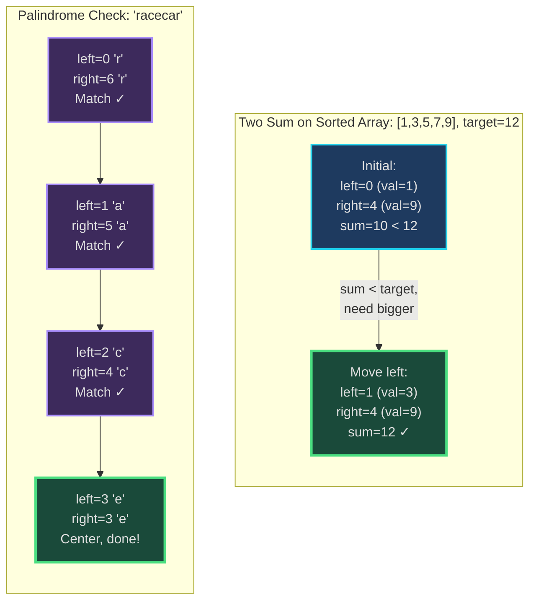
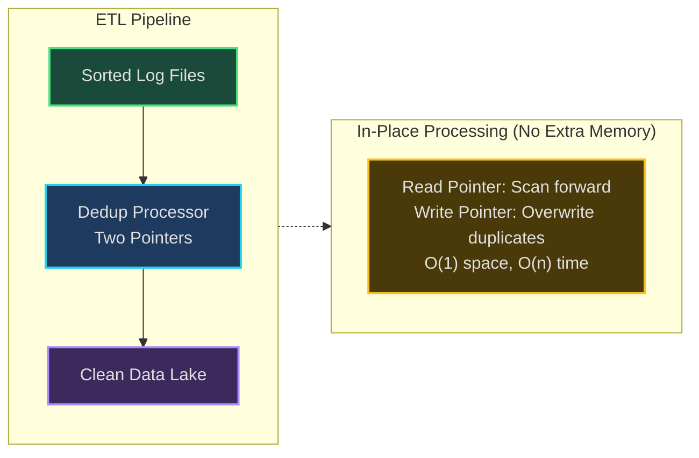
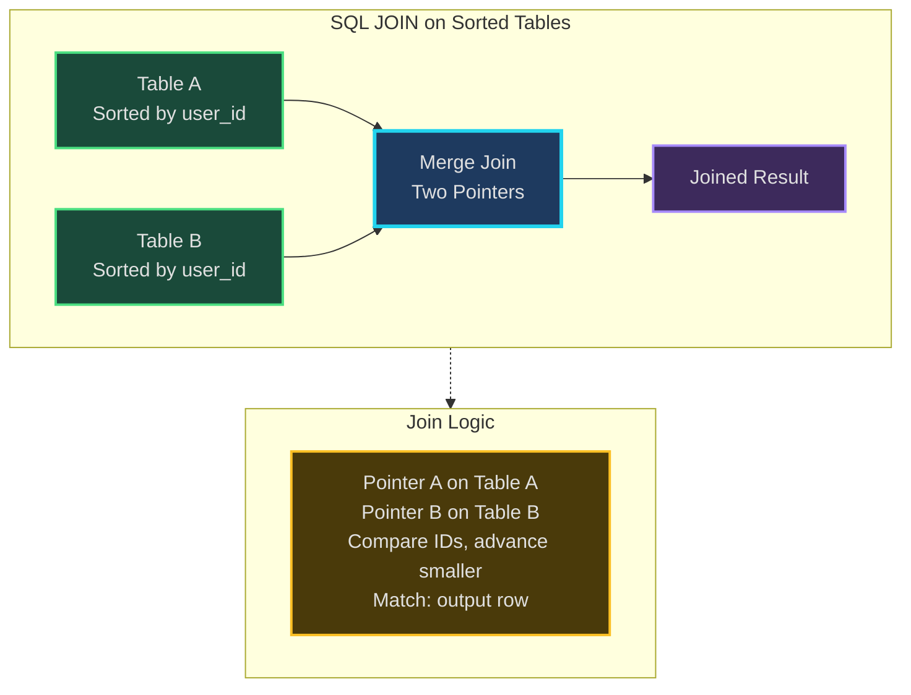
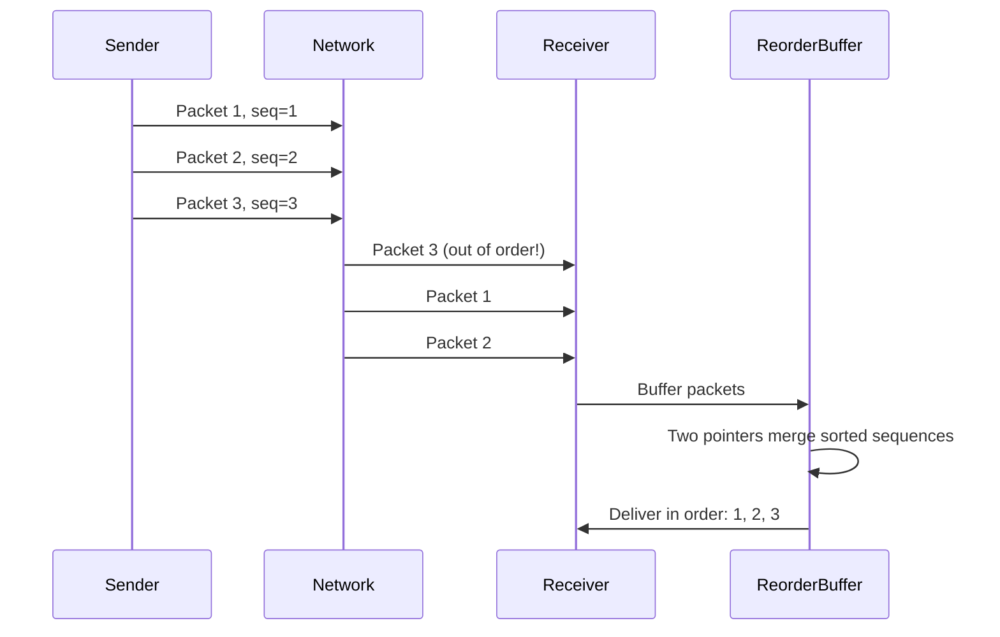
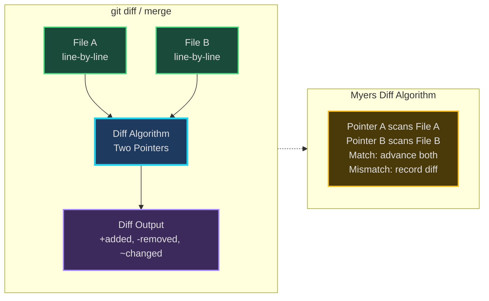
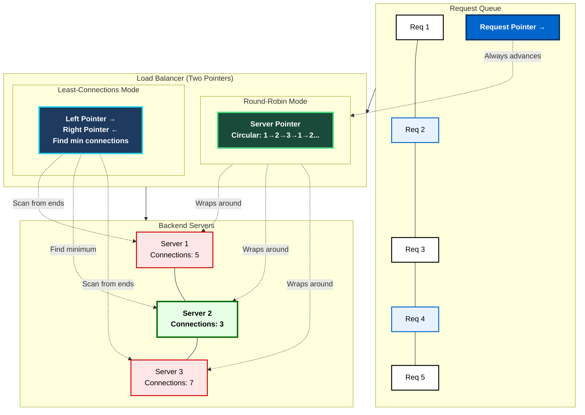

# Two Pointers - Senior Engineer Thoughts

*The 4-stage mental pipeline: Problem → Pattern → Structure → Behavior → Code*

---

## Stage 1: Problem → Pattern (Recognition)

> "Two pointers is my go-to when I see a **sorted array** and need to find a **pair/triplet** or do **in-place modification**. The key trigger: can I make progress from both ends simultaneously?"

**Recognition keywords:**
- "**Sorted array** + find pair/triplet summing to target"
- "Remove duplicates **in-place**" (O(1) space)
- "Reverse array/string"
- "Check if palindrome"
- "Partition array" (move all X to left, Y to right)
- "Merge two sorted arrays"

**Mental model:**
> "One pointer starts at the beginning, another at the end (or both at start for same-direction). They move toward each other based on some condition. The invariant: the solution isn't in the space we've already ruled out."

---

## Stage 2: Pattern → Structure (What do I need?)

> "Structure is minimal - just two index pointers:"

**Structure inventory:**
- **Two pointers**: `left = 0`, `right = len(arr) - 1` (opposite ends) OR `left = 0`, `right = 1` (same direction)
- **Target/condition**: What am I comparing against?
- **Result tracker**: Pairs found, new array length, etc.

> "The beauty: O(1) space. I'm not creating new arrays - just moving pointers through existing data."

---

## Stage 3: Structure → Behavior (How does it move?)

> "The behavior depends on the comparison result. If sorted array:"

**Opposite direction (classic two sum):**
```
if arr[left] + arr[right] == target:
    Found it!
elif arr[left] + arr[right] < target:
    left++  (need bigger sum)
else:
    right-- (need smaller sum)
```

**Same direction (remove duplicates):**
```
if arr[left] != arr[right]:
    Move element, advance both
else:
    Skip duplicate, advance right only
```

> "Invariant for two sum: Everything left of `left` is too small when paired with anything. Everything right of `right` is too large. The solution must be between them."

---

## Visual Model



---

## Stage 4: Behavior → Code (Expression)

### Verbose Form: Two Sum (Sorted Array)

```python
class TwoPointerTwoSum:
    def __init__(self, arr: List[int], target: int):
        self.arr = arr
        self.target = target
        self.left = 0
        self.right = len(arr) - 1

    def _current_sum(self) -> int:
        """Calculate sum of elements at both pointers."""
        return self.arr[self.left] + self.arr[self.right]

    def _move_left(self):
        """Advance left pointer (need larger sum)."""
        self.left += 1

    def _move_right(self):
        """Retreat right pointer (need smaller sum)."""
        self.right -= 1

    def _found_pair(self) -> bool:
        """Check if current pair sums to target."""
        return self._current_sum() == self.target

    def find_pair(self) -> Optional[Tuple[int, int]]:
        """Find pair summing to target."""
        while self.left < self.right:
            if self._found_pair():
                return (self.arr[self.left], self.arr[self.right])
            elif self._current_sum() < self.target:
                self._move_left()
            else:
                self._move_right()
        return None
```

### Terse Form

```python
def twoSum(arr: List[int], target: int) -> Optional[Tuple[int, int]]:
    left, right = 0, len(arr) - 1

    while left < right:
        current_sum = arr[left] + arr[right]
        if current_sum == target:
            return (arr[left], arr[right])
        elif current_sum < target:
            left += 1
        else:
            right -= 1
    return None
```

---

### Verbose Form: Remove Duplicates In-Place

```python
class RemoveDuplicates:
    def __init__(self, arr: List[int]):
        self.arr = arr
        self.write_pos = 1  # Where to write next unique element
        self.read_pos = 1   # Current element being examined

    def _is_duplicate(self) -> bool:
        """Check if current element equals previous."""
        return self.arr[self.read_pos] == self.arr[self.read_pos - 1]

    def _write_unique(self):
        """Write unique element to write position."""
        self.arr[self.write_pos] = self.arr[self.read_pos]
        self.write_pos += 1

    def remove_duplicates(self) -> int:
        """Remove duplicates in-place, return new length."""
        if len(self.arr) == 0:
            return 0

        while self.read_pos < len(self.arr):
            if not self._is_duplicate():
                self._write_unique()
            self.read_pos += 1

        return self.write_pos
```

### Terse Form

```python
def removeDuplicates(arr: List[int]) -> int:
    if not arr:
        return 0

    write = 1
    for read in range(1, len(arr)):
        if arr[read] != arr[read - 1]:
            arr[write] = arr[read]
            write += 1
    return write
```

---

## Real World Use Cases

> "Two pointers isn't just for coding interviews - it's fundamental to memory-efficient data processing."

### 1. **Data Pipeline Deduplication**

**System Architecture:**


**Use case:**
- **Problem**: 10GB log file with sorted timestamps, remove duplicate entries without loading entire file into memory
- **Structure**: Read pointer (scanning), write pointer (where to write next unique entry)
- **Behavior**: Read forward, only write when entry differs from previous
- **Real tool**: awk, sed with in-place file editing

> "When processing massive datasets, I can't afford to create a new array. Two pointers lets me deduplicate in-place - read pointer scans ahead, write pointer lags behind, only advancing when I find unique data. Same as LeetCode 'remove duplicates' but on 10GB files."

---

### 2. **Database Query Optimization - Merge Join**

**System Architecture:**


**Why two pointers?**
> "Database merge join: When joining two tables that are ALREADY SORTED on the join key, the database uses two pointers (one per table). Compare current rows, output if match, advance the pointer with smaller key. O(n + m) instead of O(n * m) nested loop join."

**Real-world usage:**
- **PostgreSQL/MySQL query planner**: Chooses merge join when tables have sorted indexes
- **MapReduce shuffle phase**: Merge sorted partitions from multiple mappers
- **Time-series database joins**: InfluxDB, TimescaleDB merge sorted time-series

> "When I see `EXPLAIN` output showing 'Merge Join', that's two pointers on sorted data. The database won't load both tables into memory - it streams through both with two cursors."

---

### 3. **Network Protocol Packet Reordering**

**System Architecture:**


**Use case:**
- **Problem**: TCP packets arrive out of order, need to reassemble in sequence number order
- **Structure**: Two pointers on receive buffer and sequence number tracker
- **Behavior**: Merge incoming packets into sorted order by sequence number
- **Real implementation**: TCP receive buffer, QUIC protocol

> "TCP reordering uses two pointers: one for expected next sequence number, one for scanning out-of-order buffer. Same as merging two sorted arrays."

---

### 4. **Git Merge / Diff Algorithm**

**System Architecture:**


**Why two pointers?**
> "Git diff uses a variation of two pointers (Myers algorithm): one pointer on old file, one on new file. Scan line-by-line, comparing. When lines match, advance both. When mismatch, record as addition/deletion. This is how GitHub shows those green/red diff highlights."

---

### 5. **Array Partitioning in QuickSort**

**System:**
- **Problem**: Partition array around pivot - all elements < pivot on left, >= pivot on right
- **Structure**: Left pointer (start), right pointer (end), pivot value
- **Behavior**: Left pointer finds element >= pivot, right pointer finds element < pivot, swap them
- **Real usage**: QuickSort partition step, Dutch National Flag problem (three-way partition)

> "Every time QuickSort partitions, it's using two pointers from opposite ends. Move left until finding element that belongs on right, move right until finding element that belongs on left, swap. Classic two-pointer pattern."

---

### 6. **Reverse Proxy Load Balancing**

**System Architecture:**


**System:**
- **Problem**: Distribute requests across N backend servers, ensure even load
- **Structure**: Pointer to current server index, pointer to request queue
- **Behavior**: Round-robin (advance server pointer), least-connections (scan from both ends)
- **Real tool**: Nginx upstream, HAProxy

> "Round-robin load balancing is a circular two-pointer: one pointer on request queue (always advancing), one on server list (wraps around). Least-connections uses two pointers from ends to quickly find least-loaded server."

---

### Why This Matters for Full-Stack Engineers

> "Two pointers is everywhere in memory-constrained or performance-critical code:"

- **Frontend**: In-place string manipulation (URL parsing, sanitization)
- **Backend**: Streaming data processing, in-place array transformations
- **Databases**: Merge joins, sorted index scans
- **DevOps**: Log file processing without loading into memory
- **Networking**: Packet reordering, buffer management

> "The key insight: when I can't afford O(n) extra space or need to process sorted data efficiently, two pointers is the pattern. It's not just an interview trick - it's fundamental to systems programming."

---

## Self-Check Questions

1. **Can I identify when to use opposite vs same direction pointers?** Opposite = sorted + target comparison. Same = in-place modification.
2. **Can I explain the invariant?** What's always true about the regions left of left pointer, between pointers, right of right pointer?
3. **Can I draw it?** Sketch the array, draw pointer movements, mark the regions.
4. **Can I adapt for different conditions?** Sum to target, product to target, count distinct, etc.
5. **Do I recognize it in production code?** Database joins, file processing, network buffers.

---

## Common Variations

> "Two pointers is a family of techniques:"

- **Opposite direction**: Two sum, container with most water, trapping rain water
- **Same direction (fast/slow)**: Remove duplicates, move zeros, partition array
- **Three pointers**: Three sum, Dutch National Flag (sort 0/1/2)
- **Sliding window**: Actually a special case of two pointers with expanding/shrinking window

> "The structure is always: two indices moving through an array. What changes is the movement rules and the invariant."

---

## LeetCode Practice Problems

| # | Problem | Difficulty |
|---|---------|------------|
| 11 | [Container With Most Water](https://leetcode.com/problems/container-with-most-water/) | Medium |
| 15 | [3Sum](https://leetcode.com/problems/3sum/) | Medium |
| 75 | [Sort Colors](https://leetcode.com/problems/sort-colors/) | Medium |
| 80 | [Remove Duplicates from Sorted Array II](https://leetcode.com/problems/remove-duplicates-from-sorted-array-ii/) | Medium |
| 167 | [Two Sum II - Input Array Is Sorted](https://leetcode.com/problems/two-sum-ii-input-array-is-sorted/) | Medium |
| 713 | [Subarray Product Less Than K](https://leetcode.com/problems/subarray-product-less-than-k/) | Medium |
| 845 | [Longest Mountain in Array](https://leetcode.com/problems/longest-mountain-in-array/) | Medium |
| 881 | [Boats to Save People](https://leetcode.com/problems/boats-to-save-people/) | Medium |
| 986 | [Interval List Intersections](https://leetcode.com/problems/interval-list-intersections/) | Medium |
| 1471 | [The k Strongest Values in an Array](https://leetcode.com/problems/the-k-strongest-values-in-an-array/) | Medium |
| 42 | [Trapping Rain Water](https://leetcode.com/problems/trapping-rain-water/) | Hard |
| 76 | [Minimum Window Substring](https://leetcode.com/problems/minimum-window-substring/) | Hard |
| 632 | [Smallest Range Covering Elements from K Lists](https://leetcode.com/problems/smallest-range-covering-elements-from-k-lists/) | Hard |
| 2009 | [Minimum Number of Operations to Make Array Continuous](https://leetcode.com/problems/minimum-number-of-operations-to-make-array-continuous/) | Hard |
| 2444 | [Count Subarrays With Fixed Bounds](https://leetcode.com/problems/count-subarrays-with-fixed-bounds/) | Hard |
---
