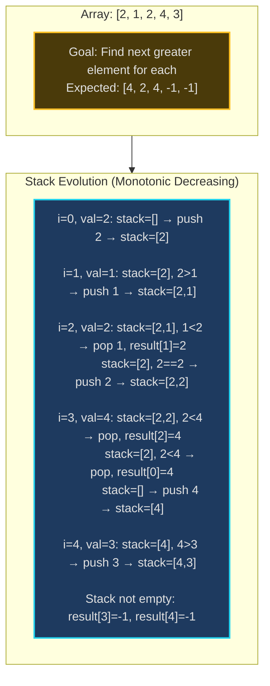
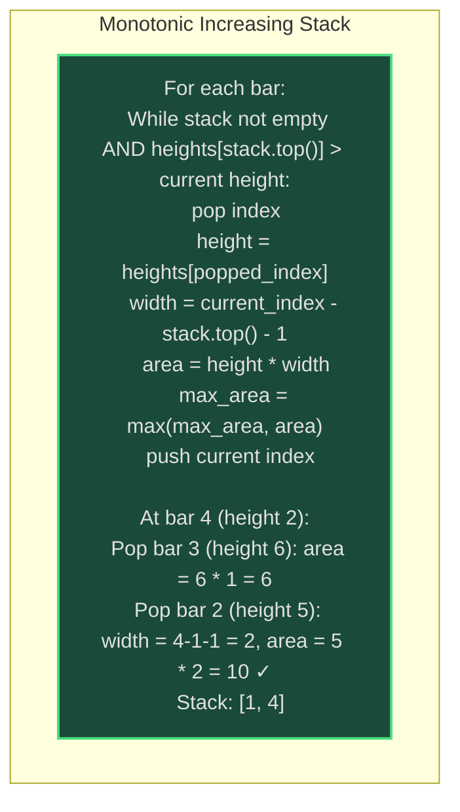
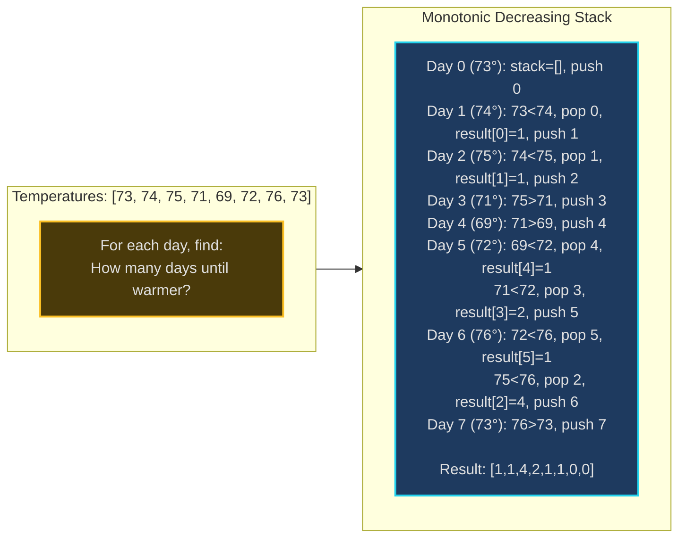
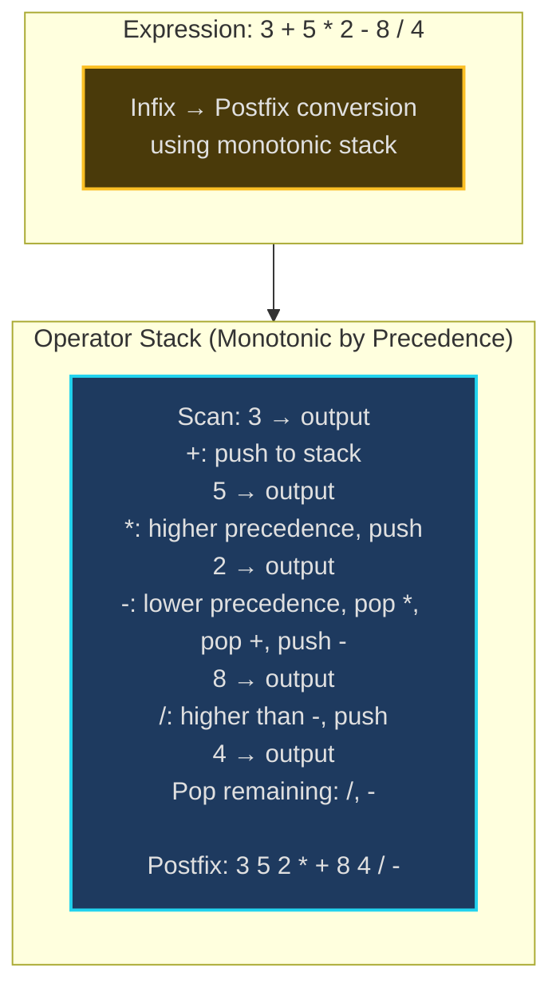

```mermaid
gantt
    title Trapping Rain Water: [0,1,0,2,1,0,1,3,2,1,2,1]
    dateFormat X
    axisFormat %s

    section Elevation
    Bar 0 (h=0) :a0, 0, 0
    Bar 1 (h=1) :a1, 1, 1
    Bar 2 (h=0) :a2, 2, 0
    Bar 3 (h=2) :a3, 3, 2
    Bar 4 (h=1) :a4, 4, 1
    Bar 5 (h=0) :a5, 5, 0
    Bar 6 (h=1) :a6, 6, 1
    Bar 7 (h=3) :a7, 7, 3
    Bar 8 (h=2) :a8, 8, 2
    Bar 9 (h=1) :a9, 9, 1
    Bar 10 (h=2) :a10, 10, 2
    Bar 11 (h=1) :a11, 11, 1

    section Water Trapped
    Water :b1, 2, 1
    Water :b2, 5, 2
```

# Monotonic Stack - Senior Engineer Thoughts

*The 4-stage mental pipeline: Problem → Pattern → Structure → Behavior → Code*

---

## Stage 1: Problem → Pattern (Recognition)

> "Monotonic Stack is my reach when I see **'next greater element'**, **'histogram'**, or **'range queries'** where I need to find nearest larger/smaller elements. The trigger: do I need to track elements in increasing or decreasing order?"

**Recognition keywords:**
- "**Next greater element**" / "next larger/smaller"
- "**Previous smaller/larger**"
- "**Largest rectangle** in histogram"
- "**Stock span** problem"
- "**Temperature range**" (warmer days ahead)
- "**Trapping rain water**"
- "Range queries with min/max constraints"

**Mental model:**
> "Monotonic stack maintains elements in strictly increasing or decreasing order. When new element violates the order, pop elements until order restored. Those popped elements have found their 'next greater' or 'next smaller' element. It's like a sieve—smaller elements get filtered out when larger arrives."

**Key insight:**
> "This is O(n) instead of O(n²) brute force. Each element is pushed once and popped at most once. The stack 'remembers' unresolved elements (those still waiting for their next greater/smaller)."

---

## Stage 2: Pattern → Structure (What do I need?)

**Structure inventory:**
- **Stack**: Holds elements in monotonic order (increasing or decreasing)
- **Monotonic increasing**: Stack bottom → top is increasing order
- **Monotonic decreasing**: Stack bottom → top is decreasing order
- **Result array**: Store the next greater/smaller for each element
- **Index or value**: Stack can store indices (to calculate distance) or values

> "The choice: monotonic increasing finds next **smaller** (pop when current is smaller). Monotonic decreasing finds next **greater** (pop when current is greater). Counterintuitive but crucial!"

---

## Stage 3: Structure → Behavior (How does it move?)

**Next Greater Element (monotonic decreasing stack):**
```
for each element:
    while stack not empty AND stack.top() < current:
        popped = stack.pop()
        # popped element's next greater = current
        result[popped] = current
    stack.push(current)

# Elements still in stack have no next greater
```

**Next Smaller Element (monotonic increasing stack):**
```
for each element:
    while stack not empty AND stack.top() > current:
        popped = stack.pop()
        # popped element's next smaller = current
        result[popped] = current
    stack.push(current)
```

**Key invariant:**
> "When we pop an element, we've found the answer for it (its next greater/smaller). The current element is that answer. Elements in stack are still 'waiting' for their answer."

---

## Visual Model

### Next Greater Element - Monotonic Decreasing Stack



### Largest Rectangle in Histogram

```mermaid
gantt
    title Histogram: [2,1,5,6,2,3]
    dateFormat X
    axisFormat %s

    section Heights
    Bar 0 (h=2) :a1, 0, 2
    Bar 1 (h=1) :a2, 1, 1
    Bar 2 (h=5) :a3, 2, 5
    Bar 3 (h=6) :a4, 3, 6
    Bar 4 (h=2) :a5, 4, 2
    Bar 5 (h=3) :a6, 5, 3

    section Max Rectangle
    Rectangle (h=5, w=2) :b1, 2, 2
```





---

## Stage 4: Behavior → Code (Expression)

### Verbose Form: Next Greater Element

```python
from typing import List

class NextGreaterFinder:
    def __init__(self, nums: List[int]):
        self.nums = nums
        self.stack: List[int] = []  # Stores indices
        self.result = [-1] * len(nums)

    def _is_current_greater_than_top(self, current_index: int) -> bool:
        """Check if current element is greater than stack top."""
        if not self.stack:
            return False
        top_index = self.stack[-1]
        return self.nums[current_index] > self.nums[top_index]

    def _pop_and_record_result(self, current_index: int):
        """Pop element and record current as its next greater."""
        popped_index = self.stack.pop()
        self.result[popped_index] = self.nums[current_index]

    def _push_to_stack(self, index: int):
        """Push current index to stack."""
        self.stack.append(index)

    def _process_remaining_stack(self):
        """Elements in stack have no next greater."""
        # Already initialized to -1, no action needed
        pass

    def find_next_greater(self) -> List[int]:
        """Find next greater element for each position."""
        for i in range(len(self.nums)):
            # Pop all smaller elements (they found their next greater)
            while self._is_current_greater_than_top(i):
                self._pop_and_record_result(i)

            # Push current index
            self._push_to_stack(i)

        self._process_remaining_stack()
        return self.result
```

### Terse Form: Next Greater Element

```python
def nextGreaterElement(nums: List[int]) -> List[int]:
    result = [-1] * len(nums)
    stack = []  # Monotonic decreasing (indices)

    for i in range(len(nums)):
        while stack and nums[stack[-1]] < nums[i]:
            popped = stack.pop()
            result[popped] = nums[i]
        stack.append(i)

    return result
```

### Terse Form: Next Greater Element (Circular Array)

```python
def nextGreaterElements(nums: List[int]) -> List[int]:
    n = len(nums)
    result = [-1] * n
    stack = []

    # Traverse twice to simulate circular
    for i in range(2 * n):
        idx = i % n
        while stack and nums[stack[-1]] < nums[idx]:
            result[stack.pop()] = nums[idx]
        if i < n:  # Only push first pass
            stack.append(idx)

    return result
```

### Verbose Form: Largest Rectangle in Histogram

```python
class HistogramRectangle:
    def __init__(self, heights: List[int]):
        self.heights = heights
        self.stack: List[int] = []
        self.max_area = 0

    def _get_width(self, popped_index: int, current_index: int) -> int:
        """Calculate width of rectangle."""
        if not self.stack:
            # Rectangle extends from beginning to current
            return current_index
        else:
            # Width between stack top and current (excluding both)
            return current_index - self.stack[-1] - 1

    def _calculate_area(self, height_index: int, width: int) -> int:
        """Calculate rectangle area."""
        height = self.heights[height_index]
        return height * width

    def _update_max_area(self, area: int):
        """Update maximum area found."""
        self.max_area = max(self.max_area, area)

    def _process_bar(self, current_index: int):
        """Process current bar, pop smaller bars."""
        current_height = self.heights[current_index] if current_index < len(self.heights) else 0

        while self.stack and self.heights[self.stack[-1]] > current_height:
            popped = self.stack.pop()
            width = self._get_width(popped, current_index)
            area = self._calculate_area(popped, width)
            self._update_max_area(area)

    def find_max_rectangle(self) -> int:
        """Find largest rectangle area in histogram."""
        # Process all bars
        for i in range(len(self.heights)):
            self._process_bar(i)
            self.stack.append(i)

        # Process remaining bars in stack (using 0 as sentinel)
        self._process_bar(len(self.heights))

        return self.max_area
```

### Terse Form: Largest Rectangle in Histogram

```python
def largestRectangleArea(heights: List[int]) -> int:
    stack = []
    max_area = 0

    for i in range(len(heights)):
        while stack and heights[stack[-1]] > heights[i]:
            h_idx = stack.pop()
            width = i if not stack else i - stack[-1] - 1
            max_area = max(max_area, heights[h_idx] * width)
        stack.append(i)

    # Process remaining
    while stack:
        h_idx = stack.pop()
        width = len(heights) if not stack else len(heights) - stack[-1] - 1
        max_area = max(max_area, heights[h_idx] * width)

    return max_area
```

### Terse Form: Daily Temperatures

```python
def dailyTemperatures(temperatures: List[int]) -> List[int]:
    """Return days until warmer temperature."""
    result = [0] * len(temperatures)
    stack = []  # Monotonic decreasing (indices)

    for i in range(len(temperatures)):
        while stack and temperatures[stack[-1]] < temperatures[i]:
            prev_day = stack.pop()
            result[prev_day] = i - prev_day  # Days to wait
        stack.append(i)

    return result
```

---

## Real World Use Cases

> "Monotonic stacks are everywhere you need to track 'nearest larger/smaller' efficiently—from stock analysis to UI rendering to compiler optimization."

### 1. **Stock Market - Stock Span Problem**

**System Architecture:**
```mermaid
sequenceDiagram
    participant Market
    participant SpanCalculator as Monotonic Stack
    participant Dashboard

    Market->>SpanCalculator: Day 0: price=100
    SpanCalculator-->>Dashboard: span=1 (just today)

    Market->>SpanCalculator: Day 1: price=80
    SpanCalculator-->>Dashboard: span=1 (today only)

    Market->>SpanCalculator: Day 2: price=60
    SpanCalculator-->>Dashboard: span=1

    Market->>SpanCalculator: Day 3: price=70
    Note over SpanCalculator: Pop 60 (smaller)<br/>span = 3-2 = 1+1 = 2
    SpanCalculator-->>Dashboard: span=2 (includes day 2)

    Market->>SpanCalculator: Day 4: price=85
    Note over SpanCalculator: Pop 70, pop 60<br/>span = 4-1 = 3
    SpanCalculator-->>Dashboard: span=3 (includes days 2,3,4)

    style SpanCalculator fill:#1e3a5f,stroke:#22d3ee,stroke-width:2px
```

**Why monotonic stack?**
> "Stock span: for each day, count consecutive days before it with price ≤ today. Brute force: O(n²). Monotonic decreasing stack: O(n). Bloomberg terminals, trading platforms use this for technical analysis. When current price > stack top, pop and accumulate span. Each price pushed/popped once."

**Real-world usage:**
- **Bloomberg Terminal**: Stock span indicators
- **Trading algorithms**: Momentum indicators
- **Financial analytics**: Price trend analysis

---

### 2. **Weather Forecasting - Daily Temperatures**

**System Architecture:**


**Why monotonic stack?**
> "Weather apps (Weather.com, AccuWeather) show 'days until warmer'. Monotonic stack solves in O(n): for each day, pop all cooler days (they found their warmer day = today). Distance = current index - popped index."

**Real-world usage:**
- **Weather apps**: Temperature trend forecasting
- **Climate analytics**: Heat wave detection
- **Agricultural systems**: Frost warning systems

---

### 3. **Image Processing - Skyline / Silhouette**

**System:**
- **Problem**: Given building heights, find skyline outline (largest rectangles visible)
- **Behavior**: Use monotonic stack to find largest rectangle each building participates in
- **Application**: Computer graphics, architectural visualization, game engines

> "Skyline problem: determine visible outline of buildings. Monotonic stack finds 'next shorter building' for each, defining the rectangle that building can form. Used in game engines (Unity, Unreal) for occlusion culling and rendering optimization."

**Real-world usage:**
- **Game engines**: Skybox rendering, occlusion
- **CAD software**: Building silhouette visualization
- **Google Earth**: 3D building rendering

---

### 4. **Compiler Optimization - Expression Evaluation**

**System Architecture:**


**Why monotonic stack?**
> "Compilers (GCC, Clang, LLVM) use monotonic stacks for expression parsing and evaluation. Shunting-yard algorithm converts infix to postfix using stack that maintains monotonic precedence. When lower precedence operator arrives, pop all higher precedence operators."

**Real-world usage:**
- **Compilers**: Expression parsing (GCC, LLVM)
- **Calculators**: Scientific calculator expression evaluation
- **Query engines**: SQL query parsing

---

### 5. **UI Rendering - Viewport Culling**

**System:**
- **Problem**: Given UI elements with z-index, determine which are visible (not obscured)
- **Behavior**: Monotonic stack of z-indices, pop elements that are completely obscured
- **Tool**: Browser rendering engines (Blink, Gecko, WebKit)

> "Browser rendering uses monotonic stacks for layer composition. When rendering DOM elements with z-index, maintain stack of visible layers. When new layer arrives, pop layers it completely obscures. Optimizes rendering by skipping hidden layers."

**Real-world usage:**
- **Chrome/Firefox**: Rendering engine layer composition
- **React**: Reconciliation optimization (experimental)
- **Game engines**: Z-buffer optimization

---

### 6. **Water Management - Trapping Rain Water**

**System Architecture:**


**Why monotonic stack?**
> "Civil engineering uses this for water retention calculations. Monotonic decreasing stack: when current height > stack top, we found a 'container' that can trap water between stack.top() and current. Width = distance, height = min(left wall, right wall) - bottom. Calculate trapped water volume."

**Real-world usage:**
- **Civil engineering**: Rain water management systems
- **Urban planning**: Flood risk assessment
- **Game development**: Water physics simulation

---

### Why This Matters for Full-Stack Engineers

> "Monotonic stacks are my O(n) solution for nearest larger/smaller problems:"

- **Frontend**: Viewport rendering optimization, z-index layer composition
- **Backend**: Stock span APIs, temperature forecasting, analytics dashboards
- **Algorithms**: Any "next greater/smaller" problem, histogram problems
- **Performance**: Replace O(n²) nested loops with O(n) stack operations
- **Compilers**: Expression parsing, optimization passes

> "The pattern: when I see 'next greater element' or 'largest rectangle', I reach for monotonic stack. Brute force is O(n²) comparing all pairs. Monotonic stack is O(n) because each element pushed/popped exactly once. That's the magic—linear time for what looks like quadratic problem."

---

## Self-Check Questions

1. **Can I explain increasing vs decreasing?** Increasing finds next **smaller**, decreasing finds next **greater**.
2. **Can I explain the complexity?** O(n) because each element pushed once, popped at most once.
3. **Can I identify when to pop?** When current element violates monotonic property.
4. **Can I solve histogram problem?** Monotonic increasing stack, pop when current < top, calculate width.
5. **Can I identify it in production?** Stock span, temperature forecasting, compiler expression parsing, rendering optimization.

---

## Common Monotonic Stack Patterns

- **Next greater element**: Monotonic decreasing stack
- **Next smaller element**: Monotonic increasing stack
- **Previous greater/smaller**: Process right to left
- **Largest rectangle in histogram**: Monotonic increasing, calculate area on pop
- **Trapping rain water**: Monotonic decreasing, calculate water volume on pop
- **Stock span**: Monotonic decreasing, track consecutive smaller elements

**The counterintuitive part:**
> "Monotonic **decreasing** stack finds next **greater** element (not smaller!). Why? Because when current > top, we pop—those popped elements found their next greater (current). Similarly, increasing stack finds next smaller. This confuses people at first."

**Stack stores indices, not values:**
> "Usually store indices in stack, not values. Why? To calculate distance/width (current_index - popped_index). For histogram, we need width to calculate area. For temperatures, we need days to wait."

---

## LeetCode Practice Problems

| # | Problem | Difficulty |
|---|---------|------------|
| 456 | [132 Pattern](https://leetcode.com/problems/132-pattern/) | Medium |
| 496 | [Next Greater Element I](https://leetcode.com/problems/next-greater-element-i/) | Medium |
| 503 | [Next Greater Element II](https://leetcode.com/problems/next-greater-element-ii/) | Medium |
| 739 | [Daily Temperatures](https://leetcode.com/problems/daily-temperatures/) | Medium |
| 901 | [Online Stock Span](https://leetcode.com/problems/online-stock-span/) | Medium |
| 962 | [Maximum Width Ramp](https://leetcode.com/problems/maximum-width-ramp/) | Medium |
| 1019 | [Next Greater Node In Linked List](https://leetcode.com/problems/next-greater-node-in-linked-list/) | Medium |
| 1475 | [Final Prices With a Special Discount in a Shop](https://leetcode.com/problems/final-prices-with-a-special-discount-in-a-shop/) | Medium |
| 1944 | [Number of Visible People in a Queue](https://leetcode.com/problems/number-of-visible-people-in-a-queue/) | Medium |
| 1966 | [Binary Searchable Numbers in an Unsorted Array](https://leetcode.com/problems/binary-searchable-numbers-in-an-unsorted-array/) | Medium |
| 42 | [Trapping Rain Water](https://leetcode.com/problems/trapping-rain-water/) | Hard |
| 84 | [Largest Rectangle in Histogram](https://leetcode.com/problems/largest-rectangle-in-histogram/) | Hard |
| 85 | [Maximal Rectangle](https://leetcode.com/problems/maximal-rectangle/) | Hard |
| 316 | [Remove Duplicate Letters](https://leetcode.com/problems/remove-duplicate-letters/) | Hard |
| 402 | [Remove K Digits](https://leetcode.com/problems/remove-k-digits/) | Hard |
| 2334 | [Subarray With Elements Greater Than Varying Threshold](https://leetcode.com/problems/subarray-with-elements-greater-than-varying-threshold/) | Hard |
---
