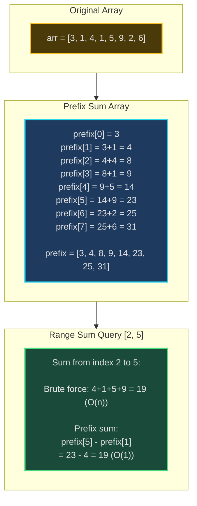
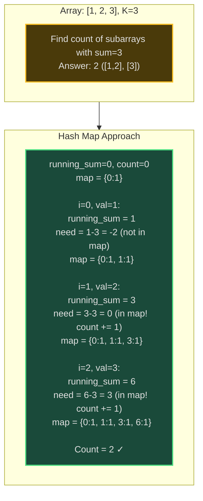
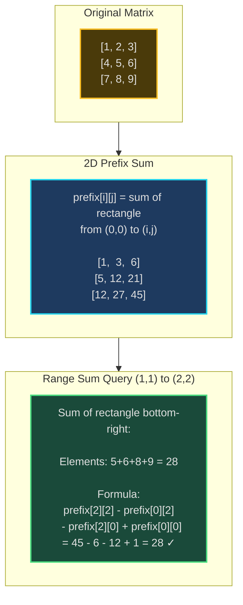
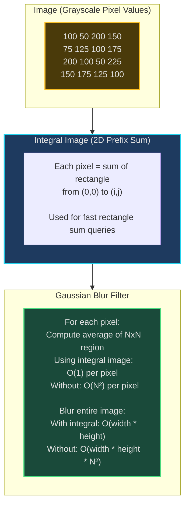
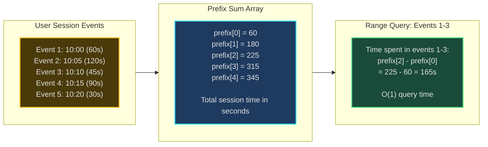

# Prefix Sum - Senior Engineer Thoughts

*The 4-stage mental pipeline: Problem → Pattern → Structure → Behavior → Code*

---

## Stage 1: Problem → Pattern (Recognition)

> "Prefix Sum is my reach when I see **'range sum queries'**, **'subarray sums'**, or **'cumulative totals'**. The trigger: am I repeatedly computing sums of ranges in an array?"

**Recognition keywords:**
- "**Range sum query**" - sum of elements from index i to j
- "**Subarray sum equals K**"
- "**Cumulative sum** / running total"
- "**Continuous subarray**"
- "**Multiple sum queries** on same array"
- "Find subarray with given sum"
- "2D matrix sum queries"

**Mental model:**
> "Prefix sum preprocesses array into cumulative sums. prefix[i] = sum of elements [0..i]. Any range sum [i..j] = prefix[j] - prefix[i-1]. It's like marking mile markers on a highway—distance between mile 5 and mile 10 = marker 10 - marker 5."

**Key insight:**
> "Without prefix sum: each range query is O(n). WITH prefix sum: O(n) preprocessing, then O(1) per query. If I have Q queries, that's O(Q*n) → O(n + Q). Massive win for multiple queries."

---

## Stage 2: Pattern → Structure (What do I need?)

**Structure inventory:**
- **Prefix sum array**: `prefix[i]` = sum from index 0 to i
- **Hash map**: For subarray sum problems (sum → count or sum → index)
- **2D prefix sum**: For matrix range queries
- **Original array**: Usually not modified

> "The tradeoff: spend O(n) and O(n) space upfront for O(1) queries. Worth it when queries >> preprocessing cost."

---

## Stage 3: Structure → Behavior (How does it move?)

**Building prefix sum:**
```
prefix[0] = arr[0]
for i from 1 to n-1:
    prefix[i] = prefix[i-1] + arr[i]
```

**Range sum query [L, R]:**
```
if L == 0:
    return prefix[R]
else:
    return prefix[R] - prefix[L-1]
```

**Subarray sum equals K (using hash map):**
```
running_sum = 0
count = 0
sum_map = {0: 1}  # sum → frequency

for each element:
    running_sum += element

    # Check if (running_sum - K) exists
    # If yes, there's a subarray ending here with sum K
    if (running_sum - K) in sum_map:
        count += sum_map[running_sum - K]

    sum_map[running_sum] = sum_map.get(running_sum, 0) + 1
```

**Key invariant:**
> "prefix[i] represents total sum from start to index i. To get sum from i to j, subtract 'everything before i' from 'everything up to j': prefix[j] - prefix[i-1]."

---

## Visual Model

### Prefix Sum Construction



### Subarray Sum Equals K



### 2D Prefix Sum (Matrix)



---

## Stage 4: Behavior → Code (Expression)

### Verbose Form: Range Sum Query

```python
from typing import List

class RangeSumQuery:
    def __init__(self, nums: List[int]):
        self.nums = nums
        self.prefix: List[int] = []
        self._build_prefix_sum()

    def _build_prefix_sum(self):
        """Build prefix sum array."""
        if not self.nums:
            return

        self.prefix = [0] * len(self.nums)
        self.prefix[0] = self.nums[0]

        for i in range(1, len(self.nums)):
            self.prefix[i] = self.prefix[i - 1] + self.nums[i]

    def _is_range_from_start(self, left: int) -> bool:
        """Check if range starts from index 0."""
        return left == 0

    def _get_sum_from_start(self, right: int) -> int:
        """Get sum from start to right."""
        return self.prefix[right]

    def _get_sum_before_range(self, left: int) -> int:
        """Get sum before the range starts."""
        return self.prefix[left - 1]

    def sum_range(self, left: int, right: int) -> int:
        """Return sum of elements from index left to right."""
        if self._is_range_from_start(left):
            return self._get_sum_from_start(right)
        else:
            return self._get_sum_from_start(right) - self._get_sum_before_range(left)
```

### Terse Form: Range Sum Query

```python
class NumArray:
    def __init__(self, nums: List[int]):
        self.prefix = [0] * (len(nums) + 1)
        for i in range(len(nums)):
            self.prefix[i + 1] = self.prefix[i] + nums[i]

    def sumRange(self, left: int, right: int) -> int:
        return self.prefix[right + 1] - self.prefix[left]
```

### Verbose Form: Subarray Sum Equals K

```python
from collections import defaultdict

class SubarraySumFinder:
    def __init__(self, nums: List[int], k: int):
        self.nums = nums
        self.k = k
        self.sum_freq: dict = defaultdict(int)
        self.running_sum = 0
        self.count = 0

    def _initialize_sum_map(self):
        """Initialize with sum 0 (empty subarray)."""
        self.sum_freq[0] = 1

    def _update_running_sum(self, num: int):
        """Add current number to running sum."""
        self.running_sum += num

    def _get_needed_prefix_sum(self) -> int:
        """Calculate what prefix sum we need to find."""
        return self.running_sum - self.k

    def _count_subarrays_ending_here(self):
        """Count subarrays ending at current position with sum k."""
        needed = self._get_needed_prefix_sum()
        if needed in self.sum_freq:
            self.count += self.sum_freq[needed]

    def _record_current_sum(self):
        """Record current running sum in frequency map."""
        self.sum_freq[self.running_sum] += 1

    def find_count(self) -> int:
        """Find count of subarrays with sum equal to k."""
        self._initialize_sum_map()

        for num in self.nums:
            self._update_running_sum(num)
            self._count_subarrays_ending_here()
            self._record_current_sum()

        return self.count
```

### Terse Form: Subarray Sum Equals K

```python
def subarraySum(nums: List[int], k: int) -> int:
    sum_freq = {0: 1}  # sum → count
    running_sum = 0
    count = 0

    for num in nums:
        running_sum += num

        # Check if there's a prefix we can remove to get sum k
        if running_sum - k in sum_freq:
            count += sum_freq[running_sum - k]

        sum_freq[running_sum] = sum_freq.get(running_sum, 0) + 1

    return count
```

### Terse Form: 2D Range Sum Query

```python
class NumMatrix:
    def __init__(self, matrix: List[List[int]]):
        if not matrix or not matrix[0]:
            return

        m, n = len(matrix), len(matrix[0])
        self.prefix = [[0] * (n + 1) for _ in range(m + 1)]

        # Build 2D prefix sum
        for i in range(1, m + 1):
            for j in range(1, n + 1):
                self.prefix[i][j] = (
                    matrix[i-1][j-1] +
                    self.prefix[i-1][j] +
                    self.prefix[i][j-1] -
                    self.prefix[i-1][j-1]
                )

    def sumRegion(self, r1: int, c1: int, r2: int, c2: int) -> int:
        # Adjust for 1-indexed prefix array
        r1, c1, r2, c2 = r1 + 1, c1 + 1, r2 + 1, c2 + 1

        return (
            self.prefix[r2][c2] -
            self.prefix[r1-1][c2] -
            self.prefix[r2][c1-1] +
            self.prefix[r1-1][c1-1]
        )
```

---

## Real World Use Cases

> "Prefix sums are everywhere you need fast range queries—from databases to analytics to computer graphics."

### 1. **Database Analytics - Time Series Aggregation**

**System Architecture:**
```mermaid
sequenceDiagram
    participant User
    participant API
    participant PrefixSum as Prefix Sum Cache
    participant DB as Time Series DB

    User->>API: GET /revenue?start=2024-01&end=2024-06
    API->>PrefixSum: Check if prefix sums exist
    alt Prefix Exists
        PrefixSum-->>API: prefix[Jun] - prefix[Dec]
        API-->>User: Revenue: $1.2M (O(1))
    else Need to Build
        API->>DB: Query daily revenue 2024
        DB-->>API: Daily values
        API->>PrefixSum: Build monthly prefix sums
        PrefixSum->>PrefixSum: prefix[Jan]=100K<br/>prefix[Feb]=250K<br/>...<br/>prefix[Jun]=1.5M
        PrefixSum-->>API: prefix[Jun] - prefix[Dec]
        API-->>User: Revenue: $1.2M
    end

    style PrefixSum fill:#1e3a5f,stroke:#22d3ee,stroke-width:2px
```

**Why prefix sum?**
> "Analytics dashboards (Google Analytics, Mixpanel, Amplitude) use prefix sums for time range queries. 'Revenue from Jan-Jun?' = prefix[June] - prefix[December]. Instead of summing millions of transactions each query, precompute monthly/daily prefix sums. O(1) queries on cached prefix sums."

**Real-world usage:**
- **Google Analytics**: Date range metrics
- **Grafana**: Time series dashboard queries
- **Data warehouses**: Snowflake, BigQuery aggregate caching

---

### 2. **Computer Graphics - Image Integral (Summed Area Table)**

**System Architecture:**


**Why prefix sum?**
> "Photoshop, OpenCV, video processing use integral images (2D prefix sums) for fast rectangle queries. Blur filter needs average of NxN box around each pixel. Without integral image: O(N²) per pixel. With integral image: compute 2D prefix sum once, then each box sum is O(1) using 4 lookups."

**Real-world usage:**
- **OpenCV**: Haar cascade face detection
- **Photoshop**: Blur and smoothing filters
- **Video processing**: Real-time filters (Snapchat, Instagram)
- **Machine learning**: Feature extraction in image recognition

---

### 3. **Financial Systems - Portfolio Cumulative Returns**

**System:**
- **Problem**: Calculate portfolio value at any date range efficiently
- **Structure**: prefix[date] = cumulative return up to that date
- **Query**: Return from date A to B = prefix[B] - prefix[A-1]
- **Tool**: Trading platforms, robo-advisors, financial dashboards

> "Robinhood, E*TRADE show portfolio performance over custom date ranges. Store daily cumulative returns as prefix sum. User queries 'YTD return' or 'Last 3 months': O(1) lookup in prefix array instead of recomputing from transaction history."

**Real-world usage:**
- **Robinhood/E*TRADE**: Portfolio performance charts
- **Betterment/Wealthfront**: Robo-advisor dashboards
- **Bloomberg Terminal**: Securities performance analysis

---

### 4. **Web Analytics - Session Duration Queries**

**System Architecture:**


**Why prefix sum?**
> "Session analytics (Hotjar, FullStory, LogRocket) track user engagement. 'How long did user spend in section X to Y?' Build prefix sum of event durations. Query any range in O(1). Especially important for real-time dashboards with thousands of concurrent sessions."

**Real-world usage:**
- **Hotjar**: Session replay analytics
- **FullStory**: User behavior analysis
- **LogRocket**: Frontend monitoring

---

### 5. **Genomics - DNA Sequence Analysis**

**System:**
- **Problem**: Count occurrences of specific nucleotides in DNA subsequences
- **Structure**: For each nucleotide (A,C,G,T), maintain prefix count array
- **Query**: "How many 'G's between position 1000 and 5000?" → O(1) using prefix
- **Tool**: Bioinformatics software, genome browsers

> "Bioinformatics tools (BLAST, UCSC Genome Browser) analyze DNA sequences (billions of base pairs). Query: 'GC content in region X-Y?' (percent of G and C). Maintain prefix counts for each nucleotide. Any range query is O(1)."

**Real-world usage:**
- **BLAST**: DNA sequence alignment
- **UCSC Genome Browser**: Genomic data visualization
- **Bioinformatics pipelines**: Sequence analysis

---

### 6. **CDN - Bandwidth Usage Monitoring**

**System Architecture:**
```mermaid
sequenceDiagram
    participant CDN as CDN Edge Server
    participant PrefixSum as Prefix Sum Aggregator
    participant Dashboard

    CDN->>PrefixSum: Hour 0: 100 GB
    PrefixSum->>PrefixSum: prefix[0] = 100

    CDN->>PrefixSum: Hour 1: 150 GB
    PrefixSum->>PrefixSum: prefix[1] = 250

    CDN->>PrefixSum: Hour 2: 200 GB
    PrefixSum->>PrefixSum: prefix[2] = 450

    Dashboard->>PrefixSum: Bandwidth from hour 0-2?
    PrefixSum-->>Dashboard: prefix[2] - prefix[-1] = 450 GB

    Dashboard->>PrefixSum: Bandwidth from hour 1-2?
    PrefixSum-->>Dashboard: prefix[2] - prefix[0] = 350 GB

    style PrefixSum fill:#1e3a5f,stroke:#22d3ee,stroke-width:2px
```

**Why prefix sum?**
> "Cloudflare, Akamai, AWS CloudFront track bandwidth usage per customer. 'Bandwidth used from hour X to Y?' = prefix[Y] - prefix[X-1]. Instead of summing millions of requests, maintain hourly prefix sums. Dashboards query in O(1)."

**Real-world usage:**
- **CloudFlare**: Bandwidth analytics
- **AWS CloudFront**: Usage reports
- **Fastly**: Traffic analytics

---

### Why This Matters for Full-Stack Engineers

> "Prefix sums are my O(1) query solution for range problems:"

- **Frontend**: Dashboard charts (cumulative metrics), progress bars, analytics visualizations
- **Backend**: Time series APIs, analytics endpoints, usage reporting
- **Databases**: Query optimization (materialized views are prefix sums), aggregate caching
- **Performance**: Replace O(n) per query with O(n) preprocessing + O(1) queries
- **Computer Graphics**: Image filters, feature detection, convolution optimization

> "The pattern: if I'm querying ranges repeatedly on static or slowly-changing data, I precompute prefix sums. Space-time tradeoff: O(n) extra space for O(1) queries instead of O(n) per query."

---

## Self-Check Questions

1. **Can I build prefix sum array?** prefix[i] = prefix[i-1] + arr[i].
2. **Can I query a range?** sum(L, R) = prefix[R] - prefix[L-1].
3. **Do I know the tradeoff?** O(n) space + O(n) build time for O(1) queries.
4. **Can I do subarray sum = K?** Use hash map: sum_freq[running_sum - k].
5. **Can I identify it in production?** Analytics dashboards, time series, image processing, financial systems.

---

## Common Prefix Sum Patterns

- **Range sum query (immutable)**: Build prefix sum, query in O(1)
- **Subarray sum equals K**: Hash map of running_sum → frequency
- **Continuous subarray sum**: running_sum % k, check if seen before
- **2D range sum query**: 2D prefix sum (integral image)
- **Product of array except self**: Prefix product + suffix product
- **Maximum subarray sum**: Kadane's algorithm (variant of prefix sum)

**Optimization: Difference array:**
> "Related technique: difference array. If you have many range *updates* but few queries, use difference array. It's the inverse—O(1) range updates, O(n) to reconstruct. Prefix sum is O(n) build, O(1) queries."

**2D Prefix Sum Formula:**
> "2D prefix sum at (i,j) = current cell + top rectangle + left rectangle - overlap (top-left). Query rectangle uses inclusion-exclusion: bottom-right - top - left + top-left."

---

## LeetCode Practice Problems

| # | Problem | Difficulty |
|---|---------|------------|
| 304 | [Range Sum Query 2D - Immutable](https://leetcode.com/problems/range-sum-query-2d-immutable/) | Medium |
| 363 | [Max Sum of Rectangle No Larger Than K](https://leetcode.com/problems/max-sum-of-rectangle-no-larger-than-k/) | Medium |
| 523 | [Continuous Subarray Sum](https://leetcode.com/problems/continuous-subarray-sum/) | Medium |
| 525 | [Contiguous Array](https://leetcode.com/problems/contiguous-array/) | Medium |
| 560 | [Subarray Sum Equals K](https://leetcode.com/problems/subarray-sum-equals-k/) | Medium |
| 974 | [Subarray Sums Divisible by K](https://leetcode.com/problems/subarray-sums-divisible-by-k/) | Medium |
| 1248 | [Count Number of Nice Subarrays](https://leetcode.com/problems/count-number-of-nice-subarrays/) | Medium |
| 1292 | [Maximum Side Length of a Square with Sum Less than or Equal to Threshold](https://leetcode.com/problems/maximum-side-length-of-a-square-with-sum-less-than-or-equal-to-threshold/) | Medium |
| 1314 | [Matrix Block Sum](https://leetcode.com/problems/matrix-block-sum/) | Medium |
| 1895 | [Largest Magic Square](https://leetcode.com/problems/largest-magic-square/) | Medium |
| 363 | [Max Sum of Rectangle No Larger Than K](https://leetcode.com/problems/max-sum-of-rectangle-no-larger-than-k/) | Hard |
| 862 | [Shortest Subarray with Sum at Least K](https://leetcode.com/problems/shortest-subarray-with-sum-at-least-k/) | Hard |
| 1074 | [Number of Submatrices That Sum to Target](https://leetcode.com/problems/number-of-submatrices-that-sum-to-target/) | Hard |
| 1269 | [Number of Ways to Stay in the Same Place After Some Steps](https://leetcode.com/problems/number-of-ways-to-stay-in-the-same-place-after-some-steps/) | Hard |
| 2338 | [Count the Number of Ideal Arrays](https://leetcode.com/problems/count-the-number-of-ideal-arrays/) | Hard |
---
