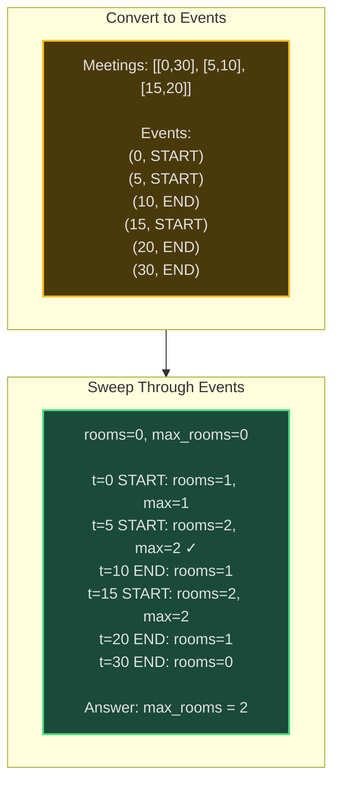
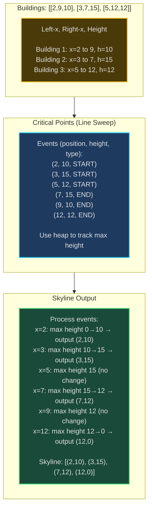
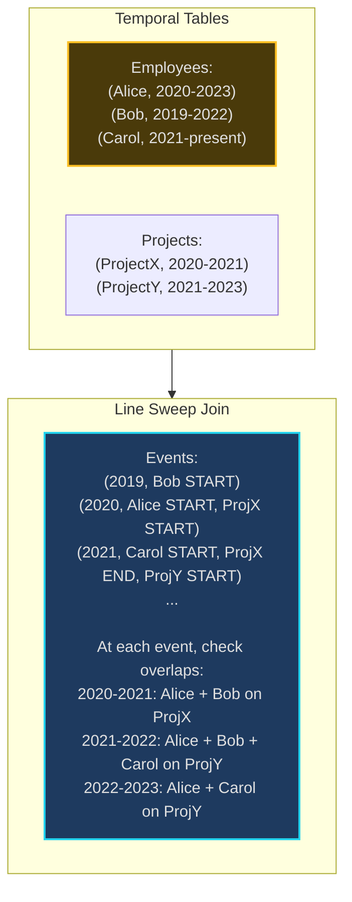
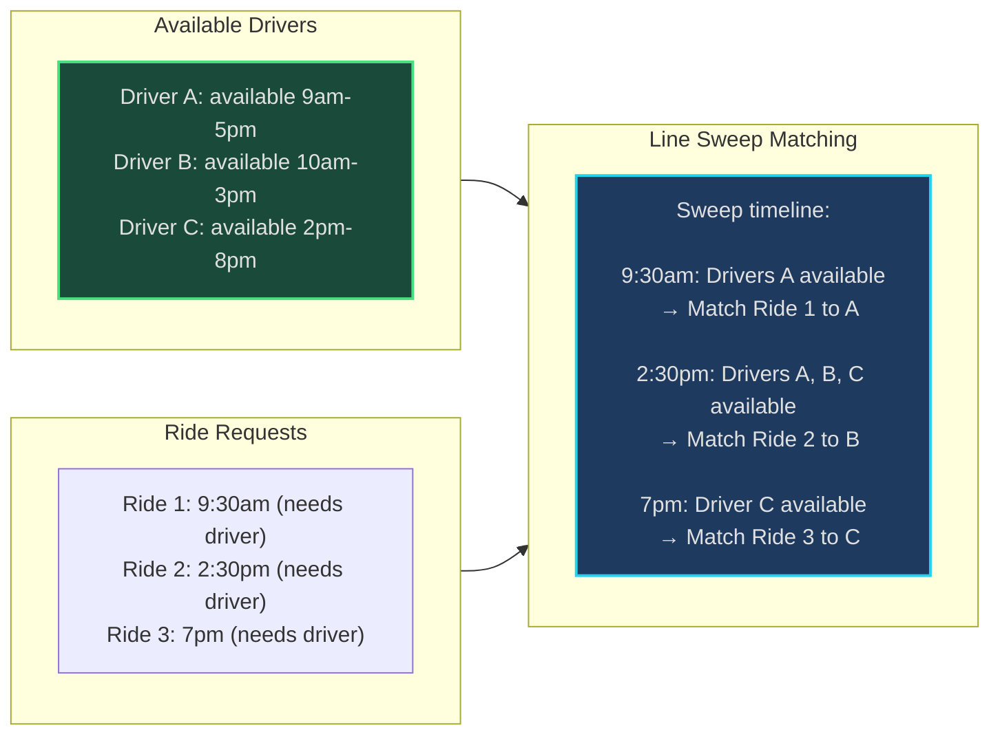

# Line Sweep (Sweep Line) - Senior Engineer Thoughts

*The 4-stage mental pipeline: Problem → Pattern → Structure → Behavior → Code*

---

## Stage 1: Problem → Pattern (Recognition)

> "Line Sweep is my reach when I see **'intervals on timeline'**, **'overlapping events'**, or **'geometric queries'**. The trigger: can I process events by sweeping a line across time/space?"

**Recognition keywords:**
- "**Overlapping intervals**" on timeline
- "**Meeting rooms** / concurrent events"
- "**Skyline problem**" / building silhouette
- "**Interval union** / merge
- "**Closest pair of points**"
- "**Events at time points**" (start/end)
- "Process events **in order**"

**Mental model:**
> "Imagine a vertical line sweeping left-to-right across a timeline (or plane). At each event point (interval start/end, point x-coordinate), update state and process queries. It's like scanning a barcode—process one position at a time, maintaining running state."

**Key insight:**
> "Line sweep converts 2D/interval problems into 1D sorted events. Instead of checking all pairs O(n²), sort events by position and process once O(n log n). Key: defining events correctly and maintaining state efficiently."

---

## Stage 2: Pattern → Structure (What do I need?)

**Structure inventory:**
- **Events list**: Start/end points with metadata (type, value)
- **Sorted events**: Process in left-to-right (time/space) order
- **State**: Track active intervals/points (often heap or count)
- **Sweep line position**: Current x-coordinate or time

> "The structure: convert intervals → events (start = +1, end = -1), sort events, maintain running count/heap of active elements. State updates at each event position."

---

## Stage 3: Structure → Behavior (How does it move?)

**Line sweep for overlapping intervals:**
```
1. Create events: for each interval [start, end]
   - Add event (start, +1) = interval begins
   - Add event (end, -1) = interval ends

2. Sort events by position

3. Sweep through events:
   - Track active_count (number of concurrent intervals)
   - At START event: active_count++
   - At END event: active_count--
   - Record max active_count (answer to "max overlapping")
```

**Line sweep for meeting rooms II:**
```
1. Separate start and end times
2. Sort both arrays
3. Two pointers: start_ptr, end_ptr
4. Sweep:
   - If start[start_ptr] < end[end_ptr]:
     Meeting starts → need room → rooms++
   - Else:
     Meeting ends → free room → rooms--
   - Track max rooms needed
```

**Key invariant:**
> "At any sweep line position x, our state (count/heap) accurately represents all active intervals at position x. As we process events left-to-right, state transitions correctly."

---

## Visual Model

### Line Sweep - Meeting Rooms II

```mermaid
gantt
    title Meeting Rooms: Line Sweep Process
    dateFormat X
    axisFormat %s

    section Meetings
    M1 (0-30)  :m1, 0, 30
    M2 (5-10)  :m2, 5, 10
    M3 (15-20) :m3, 15, 20

    section Sweep Line
    Time 0 (start M1, rooms=1) :s0, 0, 1
    Time 5 (start M2, rooms=2) :s1, 5, 1
    Time 10 (end M2, rooms=1) :s2, 10, 1
    Time 15 (start M3, rooms=2) :s3, 15, 1
    Time 20 (end M3, rooms=1) :s4, 20, 1
    Time 30 (end M1, rooms=0) :s5, 30, 1
```





### Skyline Problem



---

## Stage 4: Behavior → Code (Expression)

### Verbose Form: Meeting Rooms II (Min Rooms)

```python
from typing import List

class MeetingRoomAllocator:
    def __init__(self, intervals: List[List[int]]):
        self.intervals = intervals
        self.start_times: List[int] = []
        self.end_times: List[int] = []

    def _extract_times(self):
        """Separate start and end times."""
        self.start_times = [interval[0] for interval in self.intervals]
        self.end_times = [interval[1] for interval in self.intervals]

    def _sort_times(self):
        """Sort start and end times separately."""
        self.start_times.sort()
        self.end_times.sort()

    def _sweep_and_count_rooms(self) -> int:
        """Sweep through timeline, track rooms needed."""
        rooms = 0
        max_rooms = 0
        start_ptr = 0
        end_ptr = 0
        n = len(self.intervals)

        while start_ptr < n:
            # Meeting starts before earliest ending
            if self.start_times[start_ptr] < self.end_times[end_ptr]:
                rooms += 1
                max_rooms = max(max_rooms, rooms)
                start_ptr += 1
            else:
                # Meeting ends, free up room
                rooms -= 1
                end_ptr += 1

        return max_rooms

    def min_rooms_needed(self) -> int:
        """Find minimum meeting rooms using line sweep."""
        if not self.intervals:
            return 0

        self._extract_times()
        self._sort_times()
        return self._sweep_and_count_rooms()
```

### Terse Form: Meeting Rooms II

```python
def minMeetingRooms(intervals: List[List[int]]) -> int:
    """Line sweep: separate start/end times."""
    if not intervals:
        return 0

    starts = sorted([i[0] for i in intervals])
    ends = sorted([i[1] for i in intervals])

    rooms = 0
    max_rooms = 0
    end_ptr = 0

    for start in starts:
        if start < ends[end_ptr]:
            rooms += 1
        else:
            end_ptr += 1

        max_rooms = max(max_rooms, rooms)

    return max_rooms
```

### Verbose Form: Skyline Problem

```python
import heapq
from typing import List, Tuple

class SkylineGenerator:
    def __init__(self, buildings: List[List[int]]):
        self.buildings = buildings
        self.events: List[Tuple[int, int, str]] = []

    def _create_events(self):
        """Convert buildings to events."""
        for left, right, height in self.buildings:
            # Negative height for start (max heap simulation)
            self.events.append((left, -height, 'start'))
            self.events.append((right, height, 'end'))

    def _sort_events(self):
        """Sort by x-coordinate, then by type."""
        # Start events before end events at same x
        # Taller buildings before shorter at same x
        self.events.sort(key=lambda x: (x[0], x[2] == 'end', x[1]))

    def _process_events(self) -> List[List[int]]:
        """Sweep through events, track max height."""
        result = []
        heights = [0]  # Active heights (max heap using negative values)

        prev_max = 0

        for x, h, event_type in self.events:
            if event_type == 'start':
                heapq.heappush(heights, h)  # h is negative
            else:
                heights.remove(-h)
                heapq.heapify(heights)

            # Get current max height
            current_max = -heights[0]

            # If height changed, add to skyline
            if current_max != prev_max:
                result.append([x, current_max])
                prev_max = current_max

        return result

    def get_skyline(self) -> List[List[int]]:
        """Generate skyline using line sweep."""
        self._create_events()
        self._sort_events()
        return self._process_events()
```

### Terse Form: Skyline Problem

```python
import heapq

def getSkyline(buildings: List[List[int]]) -> List[List[int]]:
    """Line sweep with max heap."""
    events = []
    for l, r, h in buildings:
        events.append((l, -h, 0))  # Start: negative height
        events.append((r, h, 1))   # End: positive height

    events.sort()  # Sort by x, then by type

    result = []
    heights = [0]

    for x, h, event_type in events:
        if event_type == 0:  # Start
            heapq.heappush(heights, h)
        else:  # End
            heights.remove(-h)
            heapq.heapify(heights)

        max_h = -heights[0]
        if not result or result[-1][1] != max_h:
            result.append([x, max_h])

    return result
```

### Terse Form: Merge Intervals (Line Sweep Variant)

```python
def merge(intervals: List[List[int]]) -> List[List[int]]:
    """Merge overlapping intervals using line sweep."""
    if not intervals:
        return []

    # Sort intervals (sweep left to right)
    intervals.sort()

    merged = [intervals[0]]

    for current in intervals[1:]:
        last = merged[-1]

        if current[0] <= last[1]:
            # Overlap: extend last interval
            last[1] = max(last[1], current[1])
        else:
            # No overlap: add new interval
            merged.append(current)

    return merged
```

### Terse Form: Maximum Population Year

```python
def maximumPopulation(logs: List[List[int]]) -> int:
    """Find year with maximum alive population (line sweep)."""
    events = []

    for birth, death in logs:
        events.append((birth, 1))    # Person born
        events.append((death, -1))   # Person dies

    events.sort()

    max_pop = 0
    max_year = 0
    current_pop = 0

    for year, delta in events:
        current_pop += delta
        if current_pop > max_pop:
            max_pop = current_pop
            max_year = year

    return max_year
```

---

## Real World Use Cases

> "Line sweep is everywhere events happen over time or space—from calendar scheduling to rendering to computational geometry."

### 1. **Calendar Apps - Busy Time Aggregation**

**System Architecture:**
```mermaid
sequenceDiagram
    participant User
    participant Calendar
    participant LineSweep as Line Sweep Engine

    User->>Calendar: When am I free today?
    Calendar->>LineSweep: Events: [[9,10], [9:30,11], [14,15]]
    LineSweep->>LineSweep: Create events:<br/>(9, START), (9:30, START),<br/>(10, END), (11, END), (14, START), (15, END)
    LineSweep->>LineSweep: Sweep: track concurrent meetings<br/>9-10: 1 meeting<br/>9:30-10: 2 meetings<br/>10-11: 1 meeting<br/>11-14: 0 meetings (FREE!)<br/>14-15: 1 meeting
    LineSweep-->>Calendar: Free slots: [11:00-14:00]
    Calendar-->>User: You're free 11am-2pm

    style LineSweep fill:#1e3a5f,stroke:#22d3ee,stroke-width:2px
```

**Why line sweep?**
> "Google Calendar 'find a time' uses line sweep to merge busy times. Multiple calendars → many intervals. Line sweep merges overlapping events in O(n log n) to find free slots. Processes thousands of events instantly for team scheduling."

**Real-world usage:**
- **Google Calendar**: Meeting scheduling, free/busy aggregation
- **Outlook**: Room booking availability
- **Calendly**: Multi-person availability intersection

---

### 2. **Computer Graphics - Rendering Skylines**

**System:**
- **Problem**: Render city skyline from building rectangles (LeetCode 218)
- **Algorithm**: Line sweep with max heap
- **Events**: Building start/end points
- **Output**: Critical points where skyline height changes

> "Computer graphics renders skylines for games, simulations. Line sweep processes buildings left-to-right, tracking max height at each x-coordinate. Unity, Unreal use similar techniques for occlusion culling (what buildings are visible)."

**Real-world usage:**
- **Game engines**: Unity, Unreal skyline rendering
- **CAD software**: AutoCAD, SketchUp 2D projections
- **Mapping**: Google Earth, OpenStreetMap building outlines
- **Architecture**: Visualization software

---

### 3. **Database Query Optimization - Temporal Joins**

**System Architecture:**


**Why line sweep?**
> "Temporal databases (PostgreSQL period types, Oracle Temporal) use line sweep for interval joins. Find employees working on projects during overlapping time periods. Line sweep processes time events, joining intervals in O(n log n) instead of O(n²) nested loop."

**Real-world usage:**
- **PostgreSQL**: Temporal table joins (range types)
- **Oracle**: Temporal validity queries
- **Time-series databases**: InfluxDB, TimescaleDB interval queries
- **Data warehouses**: Slowly changing dimensions (SCD Type 2)

---

### 4. **Network Traffic Analysis - Bandwidth Usage**

**System:**
- **Problem**: Track concurrent network connections over time
- **Events**: Connection start/end with bandwidth
- **Line sweep**: Aggregate bandwidth at each time point
- **Output**: Peak bandwidth usage for capacity planning

> "Network monitoring tools (Datadog, New Relic) use line sweep for traffic analysis. Connection events (start/end) → line sweep → peak concurrent connections. Identifies network bottlenecks, helps capacity planning."

**Real-world usage:**
- **Datadog**: Network performance monitoring
- **Wireshark**: Connection tracking
- **AWS CloudWatch**: Network metrics aggregation
- **Load balancers**: Connection pool management

---

### 5. **Ride Sharing - Driver-Rider Matching**

**System Architecture:**


**Why line sweep?**
> "Uber, Lyft use line sweep for driver availability windows. Driver shifts = intervals, ride requests = point queries. Line sweep finds available drivers at each request time. Optimizes matching in real-time with thousands of drivers."

**Real-world usage:**
- **Uber/Lyft**: Driver-rider matching
- **DoorDash**: Dasher availability tracking
- **Instacart**: Shopper scheduling

---

### 6. **Resource Scheduling - Cloud VM Allocation**

**System:**
- **Problem**: Schedule VMs on physical hosts, minimize host count
- **Intervals**: VM runtime (start, end)
- **Line sweep**: Track concurrent VMs, allocate hosts
- **Goal**: Bin packing with temporal dimension

> "AWS, GCP use line sweep for VM scheduling. Each VM reservation = interval. Line sweep finds peak concurrent VMs → minimum hosts needed. Similar to meeting rooms problem but with thousands of VMs."

**Real-world usage:**
- **AWS EC2**: Instance scheduling
- **Kubernetes**: Pod scheduling over time
- **Cloud schedulers**: Google Cloud Scheduler
- **Data centers**: Physical server allocation

---

### Why This Matters for Full-Stack Engineers

> "Line sweep is my O(n log n) solution for interval/event problems:"

- **Frontend**: Timeline visualizations, calendar UIs, Gantt charts
- **Backend**: Scheduling APIs, resource allocation, time-based aggregations
- **Databases**: Temporal joins, time-series queries, interval overlaps
- **Systems**: Network monitoring, load tracking, capacity planning
- **Performance**: Reduce O(n²) all-pairs checks to O(n log n) sorted sweep

> "The pattern: whenever I have intervals or events on a timeline and need to find overlaps, peaks, or aggregations, I convert to events, sort by time/position, and sweep once. The sweep line maintains state as it moves."

---

## Self-Check Questions

1. **Can I convert intervals to events?** (start, +1) and (end, -1) for counting problems.
2. **Do I know when to sort?** Almost always sort events by position/time first.
3. **Can I maintain state?** Track count, max height (heap), or active intervals.
4. **Do I know the complexity?** O(n log n) for sorting + O(n) sweep = O(n log n).
5. **Can I identify it in production?** Calendar scheduling, skyline rendering, temporal joins, traffic analysis.

---

## Common Line Sweep Patterns

- **Meeting rooms II**: Separate starts/ends, two pointers, track concurrent
- **Merge intervals**: Sort, sweep maintaining last merged interval
- **Skyline problem**: Events with heights, max heap for current max
- **Maximum population**: Birth/death events, sweep tracking alive count
- **Interval union**: Merge overlapping intervals using sweep
- **Closest pair**: Sort points by x, sweep maintaining active set

**Event encoding:**
> "For counting problems: START = +1, END = -1. For skyline/max problems: use heap to track active values. For merging: track last interval end, extend if overlap."

**Edge cases:**
> "Events at same position: order matters! Starts before ends (to handle touching intervals correctly). Multiple starts at same x: process all before removing any."

---

## LeetCode Practice Problems

| # | Problem | Difficulty |
|---|---------|------------|
| 56 | [Merge Intervals](https://leetcode.com/problems/merge-intervals/) | Medium |
| 253 | [Meeting Rooms II](https://leetcode.com/problems/meeting-rooms-ii/) | Medium |
| 436 | [Find Right Interval](https://leetcode.com/problems/find-right-interval/) | Medium |
| 986 | [Interval List Intersections](https://leetcode.com/problems/interval-list-intersections/) | Medium |
| 1109 | [Corporate Flight Bookings](https://leetcode.com/problems/corporate-flight-bookings/) | Medium |
| 1288 | [Remove Covered Intervals](https://leetcode.com/problems/remove-covered-intervals/) | Medium |
| 1854 | [Maximum Population Year](https://leetcode.com/problems/maximum-population-year/) | Medium |
| 2406 | [Divide Intervals Into Minimum Number of Groups](https://leetcode.com/problems/divide-intervals-into-minimum-number-of-groups/) | Medium |
| 218 | [The Skyline Problem](https://leetcode.com/problems/the-skyline-problem/) | Hard |
| 352 | [Data Stream as Disjoint Intervals](https://leetcode.com/problems/data-stream-as-disjoint-intervals/) | Hard |
| 391 | [Perfect Rectangle](https://leetcode.com/problems/perfect-rectangle/) | Hard |
| 715 | [Range Module](https://leetcode.com/problems/range-module/) | Hard |
| 732 | [My Calendar III](https://leetcode.com/problems/my-calendar-iii/) | Hard |
| 850 | [Rectangle Area II](https://leetcode.com/problems/rectangle-area-ii/) | Hard |
---
