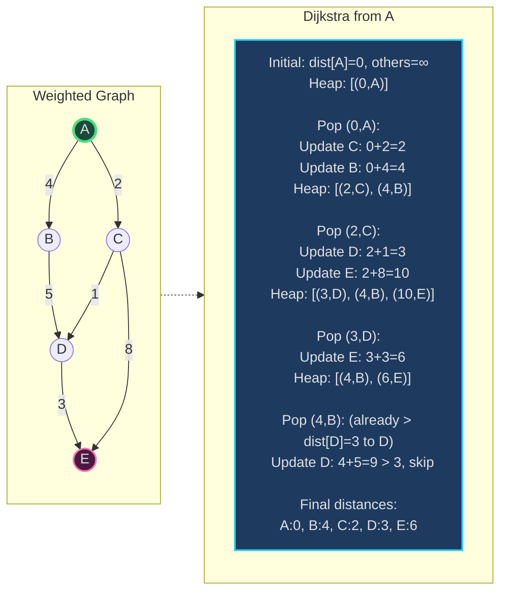
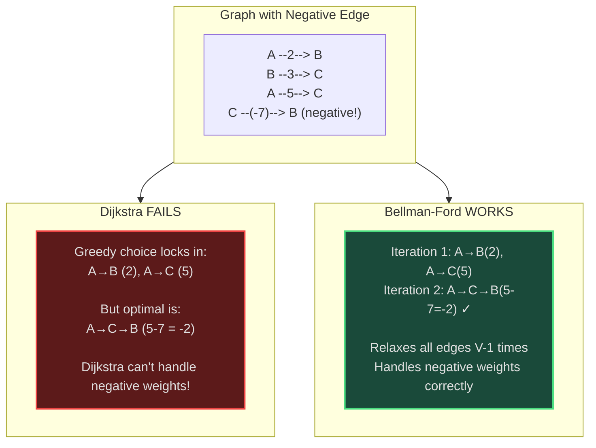
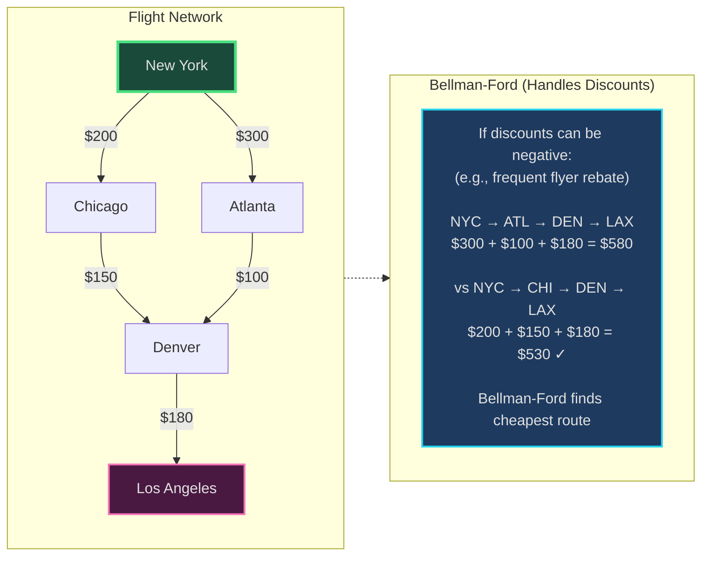
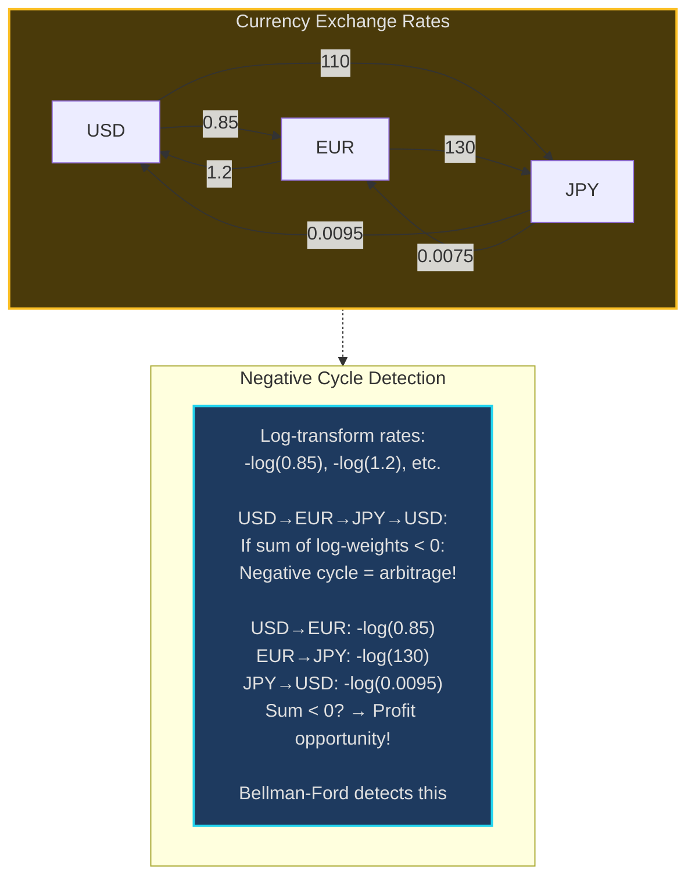

# Shortest Path Algorithms - Senior Engineer Thoughts

*The 4-stage mental pipeline: Problem → Pattern → Structure → Behavior → Code*

---

## Stage 1: Problem → Pattern (Recognition)

> "Shortest Path is my reach when I see **'weighted graph'** with **'minimum distance'** or **'cheapest path'**. The trigger: do I need to find optimal paths considering edge weights/costs?"

**Recognition keywords:**
- "**Shortest path**" in weighted graph
- "**Minimum cost** / distance / time"
- "**Navigation** / routing"
- "**Network delays**" / latency
- "**Cheapest** route / flight"
- "**Weighted edges**" (not just BFS)
- "**Negative weights**" (Bellman-Ford)
- "**All pairs** shortest paths" (Floyd-Warshall)

**Mental model:**
> "BFS finds shortest path in unweighted graphs. For weighted graphs, I need Dijkstra (non-negative weights), Bellman-Ford (allows negative), or Floyd-Warshall (all pairs). It's like GPS navigation—finding the fastest route considering traffic (edge weights)."

**Key insight:**
> "Algorithm choice depends on constraints: Dijkstra is greedy (O((V+E) log V) with heap), Bellman-Ford handles negative weights (O(VE)), Floyd-Warshall finds all pairs (O(V³)). Negative cycles make shortest path undefined."

---

## Stage 2: Pattern → Structure (What do I need?)

**Structure inventory:**

**Dijkstra:**
- **Min heap**: Priority queue of (distance, node)
- **Distance array**: Best distance to each node from source
- **Graph**: Adjacency list with weights

**Bellman-Ford:**
- **Distance array**: Best distance to each node
- **Edge list**: All edges with weights
- **Relaxation**: V-1 iterations updating distances

**Floyd-Warshall:**
- **DP table**: `dist[i][j]` = shortest path from i to j
- **Intermediate vertices**: Try routing through each vertex k

> "Dijkstra is BFS with priority queue (smallest distance first, not FIFO). Bellman-Ford relaxes all edges V-1 times. Floyd-Warshall uses DP: consider all intermediate vertices."

---

## Stage 3: Structure → Behavior (How does it move?)

**Dijkstra's Algorithm:**
```
1. Initialize distances: dist[source]=0, all others=∞
2. Min heap = [(0, source)]
3. While heap not empty:
   - Pop (d, u) with smallest distance
   - If d > dist[u]: skip (already processed better)
   - For each neighbor v with edge weight w:
     - If dist[u] + w < dist[v]:
       dist[v] = dist[u] + w
       Push (dist[v], v) to heap
```

**Bellman-Ford Algorithm:**
```
1. Initialize distances: dist[source]=0, all others=∞
2. Repeat V-1 times:
   - For each edge (u, v, weight):
     - If dist[u] + weight < dist[v]:
       dist[v] = dist[u] + weight
3. Check for negative cycles:
   - For each edge (u, v, weight):
     - If dist[u] + weight < dist[v]: negative cycle exists
```

**Floyd-Warshall Algorithm:**
```
1. Initialize: dist[i][j] = weight(i,j) or ∞
2. For each intermediate vertex k:
   For each source i:
     For each destination j:
       dist[i][j] = min(dist[i][j], dist[i][k] + dist[k][j])
```

**Key invariant:**
> "Dijkstra: After processing node u, dist[u] is optimal (greedy choice). Bellman-Ford: After k iterations, dist contains shortest paths using ≤k edges. Floyd-Warshall: After considering vertices 0..k, dist[i][j] is shortest path from i to j using only 0..k as intermediates."

---

## Visual Model

### Dijkstra's Algorithm



### Bellman-Ford vs Dijkstra



---

## Stage 4: Behavior → Code (Expression)

### Verbose Form: Dijkstra's Algorithm

```python
import heapq
from typing import Dict, List, Tuple
from collections import defaultdict

class DijkstraShortestPath:
    def __init__(self, n: int, edges: List[List[int]]):
        self.n = n
        self.graph: Dict[int, List[Tuple[int, int]]] = defaultdict(list)
        self.distances: List[float] = [float('inf')] * n
        self._build_graph(edges)

    def _build_graph(self, edges: List[List[int]]):
        """Build adjacency list with weights."""
        for u, v, weight in edges:
            self.graph[u].append((v, weight))

    def _initialize_source(self, source: int):
        """Set source distance to 0."""
        self.distances[source] = 0

    def _get_initial_heap(self, source: int) -> List[Tuple[float, int]]:
        """Create initial min heap with source."""
        return [(0, source)]

    def _is_better_path_already_found(self, distance: float, node: int) -> bool:
        """Check if we already found better path to this node."""
        return distance > self.distances[node]

    def _try_relax_edge(self, from_node: int, to_node: int, weight: int, heap: list):
        """Try to improve distance to neighbor."""
        new_dist = self.distances[from_node] + weight

        if new_dist < self.distances[to_node]:
            self.distances[to_node] = new_dist
            heapq.heappush(heap, (new_dist, to_node))

    def find_shortest_path(self, source: int) -> List[float]:
        """Find shortest paths from source to all nodes."""
        self._initialize_source(source)
        heap = self._get_initial_heap(source)

        while heap:
            dist, node = heapq.heappop(heap)

            if self._is_better_path_already_found(dist, node):
                continue

            # Relax all edges from current node
            for neighbor, weight in self.graph[node]:
                self._try_relax_edge(node, neighbor, weight, heap)

        return self.distances
```

### Terse Form: Dijkstra's Algorithm

```python
import heapq

def dijkstra(n: int, edges: List[List[int]], source: int) -> List[int]:
    """Dijkstra's shortest path."""
    graph = defaultdict(list)
    for u, v, w in edges:
        graph[u].append((v, w))

    dist = [float('inf')] * n
    dist[source] = 0
    heap = [(0, source)]

    while heap:
        d, u = heapq.heappop(heap)

        if d > dist[u]:
            continue

        for v, w in graph[u]:
            if dist[u] + w < dist[v]:
                dist[v] = dist[u] + w
                heapq.heappush(heap, (dist[v], v))

    return dist
```

### Verbose Form: Bellman-Ford Algorithm

```python
class BellmanFordShortestPath:
    def __init__(self, n: int, edges: List[List[int]]):
        self.n = n
        self.edges = edges
        self.distances: List[float] = [float('inf')] * n

    def _initialize_source(self, source: int):
        """Set source distance to 0."""
        self.distances[source] = 0

    def _relax_all_edges(self):
        """Attempt to improve all edge distances."""
        for u, v, weight in self.edges:
            if self.distances[u] != float('inf'):
                if self.distances[u] + weight < self.distances[v]:
                    self.distances[v] = self.distances[u] + weight

    def _run_relaxation_iterations(self):
        """Run V-1 relaxation iterations."""
        for _ in range(self.n - 1):
            self._relax_all_edges()

    def _has_negative_cycle(self) -> bool:
        """Check if graph contains negative weight cycle."""
        for u, v, weight in self.edges:
            if self.distances[u] != float('inf'):
                if self.distances[u] + weight < self.distances[v]:
                    return True
        return False

    def find_shortest_path(self, source: int) -> Tuple[List[float], bool]:
        """Find shortest paths, return (distances, has_negative_cycle)."""
        self._initialize_source(source)
        self._run_relaxation_iterations()

        has_cycle = self._has_negative_cycle()
        return self.distances, has_cycle
```

### Terse Form: Bellman-Ford Algorithm

```python
def bellmanFord(n: int, edges: List[List[int]], source: int) -> List[int]:
    """Bellman-Ford shortest path (handles negative weights)."""
    dist = [float('inf')] * n
    dist[source] = 0

    # Relax all edges V-1 times
    for _ in range(n - 1):
        for u, v, w in edges:
            if dist[u] != float('inf') and dist[u] + w < dist[v]:
                dist[v] = dist[u] + w

    # Check for negative cycles
    for u, v, w in edges:
        if dist[u] != float('inf') and dist[u] + w < dist[v]:
            return []  # Negative cycle detected

    return dist
```

### Terse Form: Floyd-Warshall (All Pairs)

```python
def floydWarshall(n: int, edges: List[List[int]]) -> List[List[int]]:
    """All pairs shortest paths."""
    # Initialize distance matrix
    dist = [[float('inf')] * n for _ in range(n)]

    # Distance from node to itself is 0
    for i in range(n):
        dist[i][i] = 0

    # Set edge weights
    for u, v, w in edges:
        dist[u][v] = w

    # Floyd-Warshall: try all intermediate vertices
    for k in range(n):
        for i in range(n):
            for j in range(n):
                dist[i][j] = min(dist[i][j], dist[i][k] + dist[k][j])

    return dist
```

---

## Real World Use Cases

> "Shortest path algorithms power navigation, network routing, and any system optimizing for minimum cost/time/distance."

### 1. **Google Maps - Route Navigation**

**System Architecture:**
```mermaid
sequenceDiagram
    participant User
    participant Maps as Google Maps
    participant Dijkstra as Shortest Path Engine
    participant Graph as Road Network Graph

    User->>Maps: Navigate from A to B
    Maps->>Graph: Get road network<br/>(nodes=intersections,<br/>edges=roads with weights=time)
    Graph-->>Dijkstra: Weighted graph
    Dijkstra->>Dijkstra: Run Dijkstra from A<br/>Edge weights = travel time<br/>(considering traffic)
    Dijkstra-->>Maps: Shortest path + ETA
    Maps-->>User: Route: A→C→D→B<br/>ETA: 25 minutes

    style Dijkstra fill:#1e3a5f,stroke:#22d3ee,stroke-width:2px
```

**Why Dijkstra?**
> "Google Maps uses Dijkstra (with optimizations like A* heuristic). Road network = graph, intersections = nodes, roads = weighted edges (weight = travel time considering traffic). Dijkstra finds fastest route. Edge weights updated in real-time based on traffic conditions."

**Real-world usage:**
- **Google Maps**: Route navigation
- **Waze**: Community-driven routing
- **Uber/Lyft**: Driver-rider matching, route optimization
- **Delivery services**: Route planning (DoorDash, Amazon)

---

### 2. **Network Routing - OSPF Protocol**

**System:**
- **Problem**: Routers need to find shortest path to forward packets
- **Algorithm**: Dijkstra's algorithm on network topology
- **Weights**: Link costs (bandwidth, latency, hop count)
- **Updates**: Routers exchange topology info, rebuild shortest path tree

> "OSPF (Open Shortest Path First) uses Dijkstra for network routing. Each router has graph of network topology. Edge weights = link costs. When topology changes (link fails), routers recompute paths using Dijkstra. Millions of packets routed per second using precomputed paths."

**Real-world usage:**
- **OSPF**: Interior gateway protocol (enterprise networks)
- **IS-IS**: ISP backbone routing
- **BGP** (path vector, not pure Dijkstra): Internet routing
- **SDN controllers**: OpenFlow path computation

---

### 3. **Flight Booking - Cheapest Route**

**System Architecture:**


**Why Bellman-Ford?**
> "Flight booking systems use shortest path for cheapest route. If credits/rebates exist (negative weights), need Bellman-Ford. Kayak, Skyscanner build flight network graph, run shortest path to find cheapest multi-leg journey."

**Real-world usage:**
- **Flight aggregators**: Kayak, Skyscanner, Google Flights
- **Train booking**: Amtrak, European rail networks
- **Multi-modal transport**: Rome2Rio (flights + trains + buses)

---

### 4. **Game Development - NPC Pathfinding**

**System:**
- **Problem**: NPC needs to find path from point A to B in game world
- **Algorithm**: A* (Dijkstra + heuristic) or Dijkstra
- **Weights**: Movement cost (terrain type, obstacles)
- **Optimizations**: NavMesh (precomputed walkable areas)

> "Game engines use A* (optimized Dijkstra) for NPC pathfinding. Game world = grid/graph, cells = nodes, movement = weighted edges (water = slow, road = fast). A* finds shortest path considering terrain. Unity NavMesh, Unreal Navigation System use this."

**Real-world usage:**
- **Unity**: NavMesh pathfinding
- **Unreal Engine**: Navigation system
- **RTS games**: Unit movement (StarCraft, Age of Empires)
- **Open world**: NPC navigation (GTA, Skyrim)

---

### 5. **Currency Exchange - Arbitrage Detection**

**System Architecture:**


**Why Bellman-Ford?**
> "Currency arbitrage detection uses Bellman-Ford. Convert rates to log-weights, negative cycle = arbitrage opportunity (e.g., USD→EUR→JPY→USD = profit). Trading algorithms detect this in milliseconds. Bellman-Ford's negative cycle detection is critical."

**Real-world usage:**
- **Trading algorithms**: Arbitrage detection (forex, crypto)
- **Crypto exchanges**: Multi-currency arbitrage
- **Financial analytics**: Bloomberg Terminal, Reuters

---

### 6. **Social Networks - Degrees of Separation**

**System:**
- **Problem**: Find shortest connection path between two users
- **Algorithm**: Floyd-Warshall (all pairs) or bidirectional BFS
- **Use case**: LinkedIn "How you're connected", Facebook friend suggestions
- **Optimization**: Precompute distances between influential users

> "LinkedIn uses shortest path for 'How you're connected to X'. Social graph = nodes (users), edges (connections), weights (strength of connection). Floyd-Warshall computes all-pairs distances offline for popular users, enabling instant queries."

**Real-world usage:**
- **LinkedIn**: Connection paths, "People you may know"
- **Facebook**: Friend suggestions, mutual friends
- **Twitter**: Follow recommendations
- **Academic networks**: Citation graphs, co-author distances

---

### Why This Matters for Full-Stack Engineers

> "Shortest path algorithms are my tool for optimization in weighted graphs:"

- **Backend**: Route planning APIs, network latency optimization, dependency resolution
- **Systems**: Network routing, load balancing, distributed tracing
- **Databases**: Query plan optimization (join order = shortest path problem)
- **Frontend**: Map visualizations, pathfinding in UI navigation
- **Machine Learning**: Graph neural networks, knowledge graph reasoning

> "The pattern: if I have weighted graph and need minimum cost path, I choose Dijkstra (non-negative weights, fastest), Bellman-Ford (handles negative, detects cycles), or Floyd-Warshall (all pairs, small graphs)."

---

## Self-Check Questions

1. **Can I choose the right algorithm?** Dijkstra (non-negative), Bellman-Ford (negative), Floyd-Warshall (all pairs).
2. **Can I explain Dijkstra greedy choice?** Always expand closest unvisited node.
3. **Do I know the complexity?** Dijkstra O((V+E) log V), Bellman-Ford O(VE), Floyd-Warshall O(V³).
4. **Can I detect negative cycles?** Bellman-Ford: if relaxation improves after V-1 iterations.
5. **Can I identify it in production?** Google Maps, network routing, flight booking, game pathfinding.

---

## Common Shortest Path Patterns

- **Single source, non-negative weights**: Dijkstra's algorithm
- **Single source, negative weights**: Bellman-Ford
- **All pairs shortest paths**: Floyd-Warshall
- **Unweighted graph**: BFS (special case, O(V+E))
- **With heuristic**: A* (Dijkstra + admissible heuristic)
- **Negative cycle detection**: Bellman-Ford (one more iteration after V-1)
- **Directed acyclic graph (DAG)**: Topological sort + relaxation (O(V+E))

**Algorithm comparison:**
```
Dijkstra:
  ✓ Fastest: O((V+E) log V)
  ✗ No negative weights
  ✓ Single source

Bellman-Ford:
  ✓ Handles negative weights
  ✓ Detects negative cycles
  ✗ Slower: O(VE)
  ✓ Single source

Floyd-Warshall:
  ✓ All pairs distances
  ✓ Simple implementation
  ✗ Slowest: O(V³)
  ✗ High space: O(V²)
```

---

## LeetCode Practice Problems

| # | Problem | Difficulty |
|---|---------|------------|
| 743 | [Network Delay Time](https://leetcode.com/problems/network-delay-time/) | Medium |
| 787 | [Cheapest Flights Within K Stops](https://leetcode.com/problems/cheapest-flights-within-k-stops/) | Medium |
| 1091 | [Shortest Path in Binary Matrix](https://leetcode.com/problems/shortest-path-in-binary-matrix/) | Medium |
| 1129 | [Shortest Path with Alternating Colors](https://leetcode.com/problems/shortest-path-with-alternating-colors/) | Medium |
| 1368 | [Minimum Cost to Make at Least One Valid Path in a Grid](https://leetcode.com/problems/minimum-cost-to-make-at-least-one-valid-path-in-a-grid/) | Medium |
| 1514 | [Path with Maximum Probability](https://leetcode.com/problems/path-with-maximum-probability/) | Medium |
| 1631 | [Path With Minimum Effort](https://leetcode.com/problems/path-with-minimum-effort/) | Medium |
| 2045 | [Second Minimum Time to Reach Destination](https://leetcode.com/problems/second-minimum-time-to-reach-destination/) | Medium |
| 2662 | [Minimum Cost of a Path With Special Roads](https://leetcode.com/problems/minimum-cost-of-a-path-with-special-roads/) | Medium |
| 778 | [Swim in Rising Water](https://leetcode.com/problems/swim-in-rising-water/) | Hard |
| 864 | [Shortest Path to Get All Keys](https://leetcode.com/problems/shortest-path-to-get-all-keys/) | Hard |
| 882 | [Reachable Nodes In Subdivided Graph](https://leetcode.com/problems/reachable-nodes-in-subdivided-graph/) | Hard |
| 1293 | [Shortest Path in a Grid with Obstacles Elimination](https://leetcode.com/problems/shortest-path-in-a-grid-with-obstacles-elimination/) | Hard |
| 1928 | [Minimum Cost to Reach Destination in Time](https://leetcode.com/problems/minimum-cost-to-reach-destination-in-time/) | Hard |
| 2203 | [Minimum Weighted Subgraph With the Required Paths](https://leetcode.com/problems/minimum-weighted-subgraph-with-the-required-paths/) | Hard |
---
