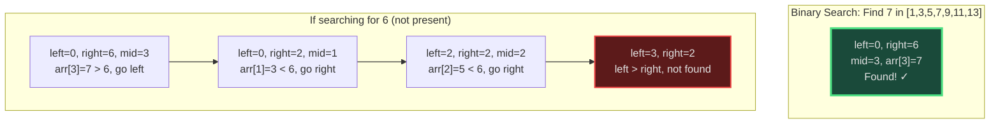
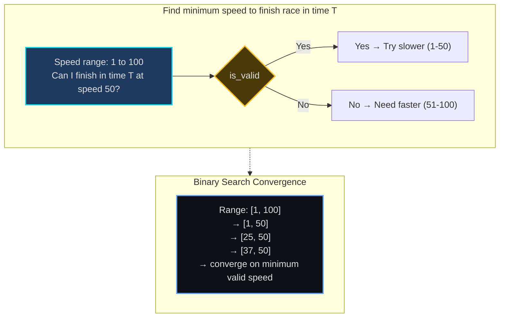
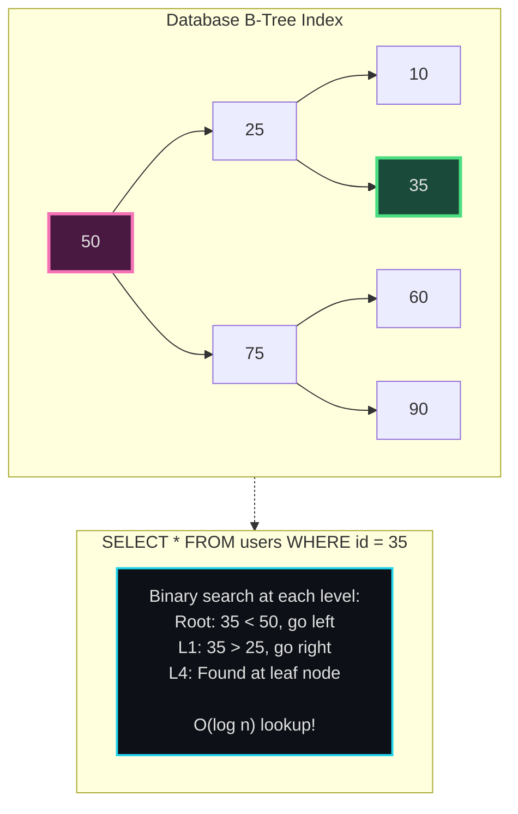
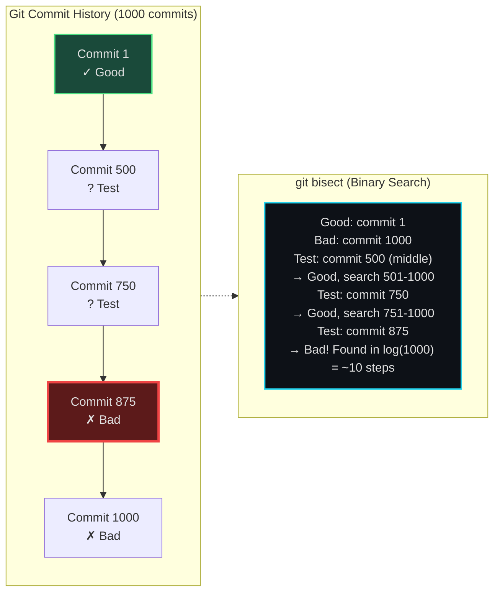
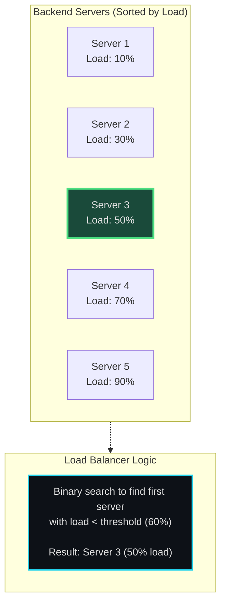
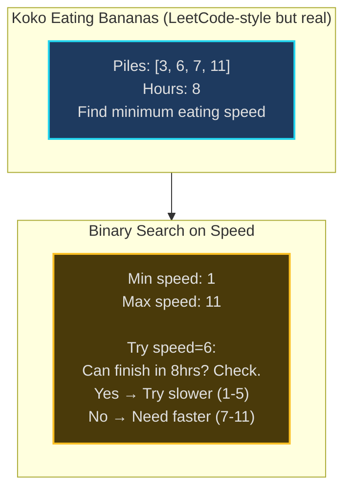

# Binary Search - Senior Engineer Thoughts

*The 4-stage mental pipeline: Problem → Pattern → Structure → Behavior → Code*

---

## Stage 1: Problem → Pattern (Recognition)

> "Binary Search is my reflex when I see **'sorted'** + **'find'** or when the search space has a **monotonic property** (if X doesn't work, everything smaller/larger also doesn't work). The trigger: can I eliminate half the search space with one comparison?"

**Recognition keywords:**
- "**Sorted array** + find element"
- "Find **first/last** occurrence"
- "Find **minimum/maximum** value that satisfies condition"
- "Search in **rotated sorted array**"
- "Find **peak element**"
- "Minimize/maximize something" where answer space is ordered

**Mental model:**
> "I'm not just searching sorted arrays - I'm searching ANY space where I can decide 'go left' or 'go right' based on a condition. The array doesn't even need to exist - I can binary search on the answer itself."

**Key insight:**
> "Binary search isn't about arrays - it's about search space reduction. If I can write `is_valid(mid)` that tells me which half to eliminate, I can binary search."

---

## Stage 2: Pattern → Structure (What do I need?)

**Structure inventory:**
- **Two pointers**: `left` and `right` defining the search space boundaries
- **Mid calculation**: `mid = left + (right - left) // 2` (avoid overflow)
- **Comparison function**: How do I know if mid is the answer, or if I should search left/right?
- **Result tracker**: Sometimes I need to track the best valid answer found so far

> "The structure is deceptively simple: two pointers and a midpoint. The complexity is in the decision logic and boundary conditions."

---

## Stage 3: Structure → Behavior (How does it move?)

**Classic binary search (find exact match):**
```
while left <= right:
    mid = left + (right - left) // 2
    if arr[mid] == target:
        return mid
    elif arr[mid] < target:
        left = mid + 1  (search right half)
    else:
        right = mid - 1  (search left half)
```

**Binary search on answer (find minimum valid):**
```
while left < right:
    mid = left + (right - left) // 2
    if is_valid(mid):
        right = mid  (mid works, try smaller)
    else:
        left = mid + 1  (mid doesn't work, need bigger)
```

**Key invariants:**
> "The answer (if it exists) is always between `left` and `right`. Each iteration, I eliminate half the search space. After log(n) iterations, left and right converge."

---

## Visual Model

### Classic Binary Search



### Binary Search on Answer Space



---

## Stage 4: Behavior → Code (Expression)

### Verbose Form: Classic Binary Search

```python
class BinarySearch:
    def __init__(self, arr: List[int]):
        self.arr = arr
        self.left = 0
        self.right = len(arr) - 1

    def _calculate_mid(self) -> int:
        """Calculate midpoint, avoiding integer overflow."""
        return self.left + (self.right - self.left) // 2

    def _compare_with_target(self, mid_val: int, target: int) -> str:
        """Determine which half of array to search."""
        if mid_val == target:
            return "found"
        elif mid_val < target:
            return "search_right"
        else:
            return "search_left"

    def _search_right_half(self, mid: int):
        """Eliminate left half of search space."""
        self.left = mid + 1

    def _search_left_half(self, mid: int):
        """Eliminate right half of search space."""
        self.right = mid - 1

    def search(self, target: int) -> int:
        """Find target in sorted array, return index or -1."""
        while self.left <= self.right:
            mid = self._calculate_mid()
            mid_val = self.arr[mid]

            comparison = self._compare_with_target(mid_val, target)

            if comparison == "found":
                return mid
            elif comparison == "search_right":
                self._search_right_half(mid)
            else:
                self._search_left_half(mid)

        return -1  # Not found
```

### Terse Form: Classic Search

```python
def binary_search(arr: List[int], target: int) -> int:
    left, right = 0, len(arr) - 1

    while left <= right:
        mid = left + (right - left) // 2

        if arr[mid] == target:
            return mid
        elif arr[mid] < target:
            left = mid + 1
        else:
            right = mid - 1

    return -1
```

### Verbose Form: Binary Search on Answer

```python
class BinarySearchOnAnswer:
    def __init__(self, min_val: int, max_val: int):
        self.left = min_val
        self.right = max_val
        self.result = -1

    def _is_valid_answer(self, candidate: int) -> bool:
        """Check if candidate value satisfies problem constraints.
        This is problem-specific logic.
        """
        # Example: Can I complete task with this value?
        return self._check_feasibility(candidate)

    def _check_feasibility(self, candidate: int) -> bool:
        """Problem-specific feasibility check."""
        raise NotImplementedError("Override with specific logic")

    def _update_result(self, candidate: int):
        """Track best valid answer found so far."""
        self.result = candidate

    def _search_for_smaller(self, mid: int):
        """Current value works, try to find smaller one."""
        self.right = mid - 1

    def _search_for_larger(self, mid: int):
        """Current value doesn't work, need larger."""
        self.left = mid + 1

    def find_minimum_valid(self) -> int:
        """Find minimum value that satisfies constraints."""
        while self.left <= self.right:
            mid = self.left + (self.right - self.left) // 2

            if self._is_valid_answer(mid):
                self._update_result(mid)
                self._search_for_smaller(mid)  # Try to minimize
            else:
                self._search_for_larger(mid)

        return self.result
```

### Terse Form: Binary Search on Answer

```python
def binary_search_answer(min_val: int, max_val: int, is_valid) -> int:
    """Find minimum value in [min_val, max_val] where is_valid returns True."""
    left, right = min_val, max_val
    result = -1

    while left <= right:
        mid = left + (right - left) // 2

        if is_valid(mid):
            result = mid
            right = mid - 1  # Try smaller
        else:
            left = mid + 1   # Need larger

    return result
```

---

## Real World Use Cases

> "Binary search is everywhere - databases, version control, load balancers, and anywhere I need O(log n) lookup."

### 1. **Database Index Lookups - B-Trees**

**System Architecture:**


**Why binary search?**
> "Every database query on an indexed column uses binary search. B-Tree indexes store sorted keys. When I run `WHERE user_id = 12345`, the database binary searches through the B-Tree: compare with root, go left/right, repeat. O(log n) instead of O(n) table scan. This is why indexes matter."

**Real-world usage:**
- **MySQL/PostgreSQL**: B-Tree and B+Tree index lookups
- **MongoDB**: Index scans on sorted fields
- **Redis sorted sets**: ZRANK command uses binary search
- **SQLite**: B-Tree for every table and index

---

### 2. **Git Bisect - Finding Bug-Introducing Commit**

**System Architecture:**


**Why binary search?**
> "When a bug appears in production but wasn't there 1000 commits ago, manually testing each commit is O(n). `git bisect` uses binary search: mark one commit 'good', one 'bad', git checks out the middle commit. I test it, mark good/bad, git repeats. Finds the bug-introducing commit in ~10 tests instead of 1000."

**Real-world usage:**
```bash
git bisect start
git bisect bad HEAD          # Current commit is bad
git bisect good v1.0.0       # v1.0.0 was good
# Git checks out middle commit
# Test it, then:
git bisect good   # or git bisect bad
# Repeat ~log(n) times
git bisect reset  # Done!
```

---

### 3. **Load Balancer - Finding Best Server**

**System Architecture:**


**Why binary search?**
> "Load balancers maintain servers sorted by current load. When routing a request, binary search finds the first server below capacity threshold in O(log n). Alternative: round-robin is O(1) but doesn't consider load. Binary search balances efficiency with load-awareness."

**Real-world usage:**
- **Nginx upstream**: Least-connections algorithm with binary search
- **AWS ALB**: Target selection algorithms
- **Kubernetes service**: Endpoint selection

---

### 4. **Rate Limiting - Token Bucket with Binary Search**

**System:**
- **Problem**: Given timestamp, find how many tokens available in last 60 seconds
- **Structure**: Sorted array of token timestamps
- **Behavior**: Binary search to find first token within 60-second window
- **Tool**: Redis sorted sets with ZRANGEBYSCORE (binary search under the hood)

> "Rate limiters store request timestamps in sorted order. To check 'how many requests in last 60s?', binary search for the timestamp 60 seconds ago, count elements from there to end. O(log n) instead of scanning all timestamps."

---

### 5. **Binary Search on Answer - Resource Allocation**

**System Architecture:**


**Real-world version:**
> "In cloud infrastructure: 'What's the minimum number of servers needed to handle peak traffic?' I don't search servers directly - I binary search on the ANSWER (number of servers). For each candidate count, simulate: can I handle traffic with N servers? If yes, try fewer. If no, need more. This is 'binary search on answer'."

**Real-world usage:**
- **Auto-scaling**: Minimum instances to meet SLA
- **Capacity planning**: Minimum bandwidth for target latency
- **Job scheduling**: Minimum time to complete all tasks
- **Resource allocation**: Minimum memory to avoid OOM

---

### 6. **Frontend - Virtual Scrolling**

**System:**
- **Problem**: Render list of 100,000 items, only show visible 20
- **Structure**: Item heights stored in prefix sum array (sorted)
- **Behavior**: User scrolls to pixel 50,000. Binary search prefix sum to find which item index corresponds to that scroll position
- **Tool**: react-window, react-virtualized

> "Virtual scrolling libraries use binary search: given scroll offset, binary search to find first visible item index. O(log n) instead of iterating through items."

---

### Why This Matters for Full-Stack Engineers

> "Binary search isn't just for sorted arrays - it's fundamental to efficient search:"

- **Frontend**: Virtual scrolling, autocomplete with large datasets
- **Backend**: Database queries (indexes), API pagination with efficient jumps
- **Databases**: Every indexed query is a binary search
- **DevOps**: Git bisect for debugging, log analysis with timestamps
- **Infrastructure**: Load balancing, resource allocation, capacity planning

> "The insight: any time I can eliminate half the search space with one check, I can binary search. The 'array' might be commit history, server capacity, or answer range - doesn't matter. If I can partition the space, I can binary search it."

---

## Self-Check Questions

1. **Can I implement binary search without bugs?** The boundary conditions (left <= right vs left < right, mid+1 vs mid) are tricky.
2. **Can I recognize binary search on answer?** Not searching an array, but searching the solution space itself.
3. **Can I avoid integer overflow?** Use `mid = left + (right - left) // 2`, not `(left + right) // 2`.
4. **Can I handle edge cases?** Empty array, single element, target not present, duplicates.
5. **Can I identify it in production?** Database indexes, git bisect, load balancers.

---

## Common Variations

- **Find exact match**: Classic binary search
- **Find first occurrence**: When arr[mid] == target, continue searching left
- **Find last occurrence**: When arr[mid] == target, continue searching right
- **Find insertion position**: Return `left` when element not found
- **Search rotated sorted array**: Modified comparison logic
- **Binary search on answer**: Search solution space, not array

> "Binary search mastery isn't about memorizing the code - it's about recognizing when the problem has a searchable monotonic space, and knowing how to handle boundaries correctly."

---

## LeetCode Practice Problems

| # | Problem | Difficulty |
|---|---------|------------|
| 33 | [Search in Rotated Sorted Array](https://leetcode.com/problems/search-in-rotated-sorted-array/) | Medium |
| 34 | [Find First and Last Position of Element in Sorted Array](https://leetcode.com/problems/find-first-and-last-position-of-element-in-sorted-array/) | Medium |
| 74 | [Search a 2D Matrix](https://leetcode.com/problems/search-a-2d-matrix/) | Medium |
| 153 | [Find Minimum in Rotated Sorted Array](https://leetcode.com/problems/find-minimum-in-rotated-sorted-array/) | Medium |
| 162 | [Find Peak Element](https://leetcode.com/problems/find-peak-element/) | Medium |
| 875 | [Koko Eating Bananas](https://leetcode.com/problems/koko-eating-bananas/) | Medium |
| 1011 | [Capacity To Ship Packages Within D Days](https://leetcode.com/problems/capacity-to-ship-packages-within-d-days/) | Medium |
| 1539 | [Kth Missing Positive Number](https://leetcode.com/problems/kth-missing-positive-number/) | Medium |
| 2187 | [Minimum Time to Complete Trips](https://leetcode.com/problems/minimum-time-to-complete-trips/) | Medium |
| 2226 | [Maximum Candies Allocated to K Children](https://leetcode.com/problems/maximum-candies-allocated-to-k-children/) | Medium |
| 4 | [Median of Two Sorted Arrays](https://leetcode.com/problems/median-of-two-sorted-arrays/) | Hard |
| 410 | [Split Array Largest Sum](https://leetcode.com/problems/split-array-largest-sum/) | Hard |
| 668 | [Kth Smallest Number in Multiplication Table](https://leetcode.com/problems/kth-smallest-number-in-multiplication-table/) | Hard |
| 719 | [Find K-th Smallest Pair Distance](https://leetcode.com/problems/find-k-th-smallest-pair-distance/) | Hard |
| 878 | [Nth Magical Number](https://leetcode.com/problems/nth-magical-number/) | Hard |
| 1231 | [Divide Chocolate](https://leetcode.com/problems/divide-chocolate/) | Hard |
| 2141 | [Maximum Running Time of N Computers](https://leetcode.com/problems/maximum-running-time-of-n-computers/) | Hard |
---
