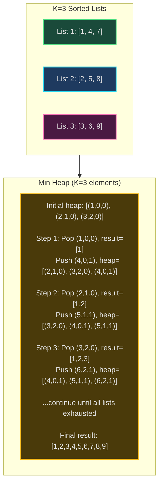
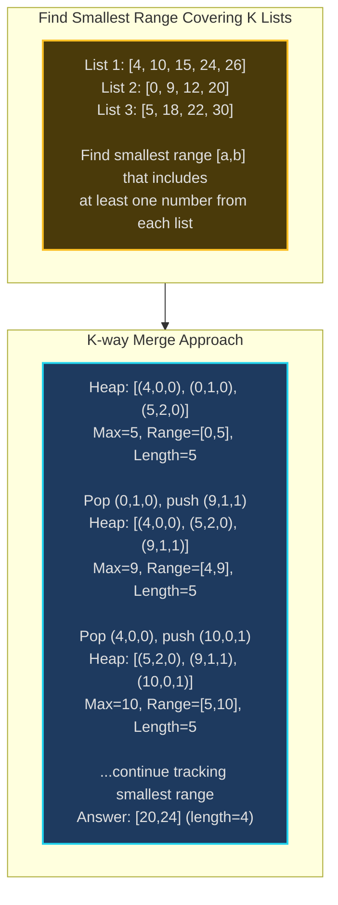
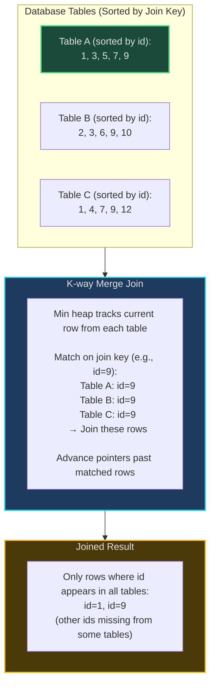
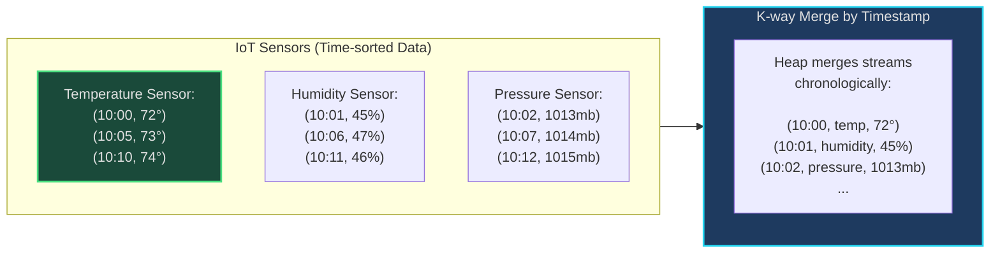
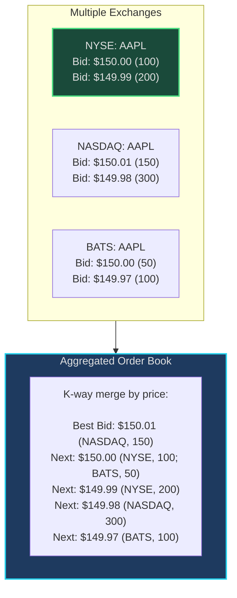

# K-way Merge - Senior Engineer Thoughts

*The 4-stage mental pipeline: Problem → Pattern → Structure → Behavior → Code*

---

## Stage 1: Problem → Pattern (Recognition)

> "K-way Merge is my reach when I see **'merge K sorted arrays/lists'**, **'K sorted streams'**, or **'smallest range from K lists'**. The trigger: do I have multiple sorted sequences that need to be combined or compared?"

**Recognition keywords:**
- "**Merge K sorted** arrays/lists/streams"
- "**K sorted** inputs"
- "Find **smallest range** covering K lists"
- "**K-th smallest** element across sorted lists"
- "Merge multiple sorted files"
- "Combine sorted streams"

**Mental model:**
> "K-way merge uses a min heap of size K. Each heap element represents the 'current' element from one of the K lists. Pop min from heap (smallest across all lists), add to result, push next element from that list. It's like merging K conveyor belts—always pick the smallest item currently visible."

**Key insight:**
> "Naive approach: repeatedly scan K lists for minimum = O(N*K) where N = total elements. Min heap approach: O(N log K). The heap size is K (not N), so log K is small even for large N."

---

## Stage 2: Pattern → Structure (What do I need?)

**Structure inventory:**
- **Min heap**: Size K, stores (value, list_index, element_index)
- **K pointers**: Track current position in each list
- **Result list**: Merged output
- **Comparison key**: For complex objects, define what "sorted" means

> "The heap holds exactly K elements—one representative from each list. As we pop one, we immediately push the next from that same list. Heap size stays constant at K."

---

## Stage 3: Structure → Behavior (How does it move?)

**K-way merge algorithm:**
```
1. Initialize min heap with first element from each list
   heap = [(list[i][0], i, 0) for i in range(K) if list[i] not empty]

2. While heap not empty:
   - Pop smallest element (value, list_idx, elem_idx)
   - Add value to result
   - If list[list_idx] has next element:
     - Push (list[list_idx][elem_idx + 1], list_idx, elem_idx + 1) to heap

3. Return result
```

**Smallest range from K lists:**
```
1. Min heap with (value, list_idx, elem_idx) from first element of each list
2. Track max_value in current heap
3. Current range = [heap.min(), max_value]
4. Pop min, push next from that list, update max_value
5. Track smallest range seen
6. Stop when any list exhausted (can't maintain all K lists)
```

**Key invariant:**
> "At each step, heap contains the K 'frontrunners'—one from each list. The minimum of these K elements is the global minimum among all unprocessed elements. That's why we can safely pop it."

---

## Visual Model

### K-way Merge Process



### Smallest Range Covering K Lists



---

## Stage 4: Behavior → Code (Expression)

### Verbose Form: Merge K Sorted Lists

```python
import heapq
from typing import List, Optional

class ListNode:
    def __init__(self, val=0, next=None):
        self.val = val
        self.next = next

    def __lt__(self, other):
        """Enable heap comparison."""
        return self.val < other.val

class KWayMerger:
    def __init__(self, lists: List[Optional[ListNode]]):
        self.lists = lists
        self.heap: List[ListNode] = []
        self.result_head = ListNode(0)  # Dummy head
        self.current = self.result_head

    def _initialize_heap(self):
        """Add first node from each non-empty list to heap."""
        for node in self.lists:
            if node:
                heapq.heappush(self.heap, node)

    def _is_heap_empty(self) -> bool:
        """Check if heap is empty."""
        return len(self.heap) == 0

    def _pop_smallest(self) -> ListNode:
        """Remove and return smallest node from heap."""
        return heapq.heappop(self.heap)

    def _add_to_result(self, node: ListNode):
        """Append node to result list."""
        self.current.next = node
        self.current = self.current.next

    def _push_next_from_list(self, node: ListNode):
        """Push next node from same list to heap."""
        if node.next:
            heapq.heappush(self.heap, node.next)

    def merge(self) -> Optional[ListNode]:
        """Merge K sorted linked lists."""
        self._initialize_heap()

        while not self._is_heap_empty():
            smallest = self._pop_smallest()
            self._add_to_result(smallest)
            self._push_next_from_list(smallest)

        return self.result_head.next
```

### Terse Form: Merge K Sorted Lists

```python
import heapq

def mergeKLists(lists: List[Optional[ListNode]]) -> Optional[ListNode]:
    # Min heap of (value, index, node) to handle duplicate values
    heap = []
    for i, node in enumerate(lists):
        if node:
            heapq.heappush(heap, (node.val, i, node))

    dummy = ListNode(0)
    current = dummy

    while heap:
        val, i, node = heapq.heappop(heap)
        current.next = node
        current = current.next

        if node.next:
            heapq.heappush(heap, (node.next.val, i, node.next))

    return dummy.next
```

### Terse Form: Merge K Sorted Arrays

```python
import heapq

def mergeKArrays(arrays: List[List[int]]) -> List[int]:
    # Heap: (value, array_index, element_index)
    heap = []
    for i, arr in enumerate(arrays):
        if arr:
            heapq.heappush(heap, (arr[0], i, 0))

    result = []

    while heap:
        val, arr_idx, elem_idx = heapq.heappop(heap)
        result.append(val)

        # Push next element from same array
        if elem_idx + 1 < len(arrays[arr_idx]):
            next_val = arrays[arr_idx][elem_idx + 1]
            heapq.heappush(heap, (next_val, arr_idx, elem_idx + 1))

    return result
```

### Verbose Form: Smallest Range Covering K Lists

```python
class SmallestRangeFinder:
    def __init__(self, nums: List[List[int]]):
        self.nums = nums
        self.heap: List[tuple] = []
        self.current_max = float('-inf')
        self.best_range = [float('-inf'), float('inf')]

    def _initialize_heap(self):
        """Add first element from each list and track max."""
        for i in range(len(self.nums)):
            if self.nums[i]:
                val = self.nums[i][0]
                heapq.heappush(self.heap, (val, i, 0))
                self.current_max = max(self.current_max, val)

    def _get_current_min(self) -> int:
        """Get minimum value in heap."""
        return self.heap[0][0]

    def _get_range_length(self, min_val: int, max_val: int) -> int:
        """Calculate range length."""
        return max_val - min_val

    def _update_best_range(self, min_val: int):
        """Update best range if current is smaller."""
        current_length = self._get_range_length(min_val, self.current_max)
        best_length = self._get_range_length(self.best_range[0], self.best_range[1])

        if current_length < best_length:
            self.best_range = [min_val, self.current_max]

    def _advance_list(self) -> bool:
        """Pop min, push next from that list. Return False if list exhausted."""
        val, list_idx, elem_idx = heapq.heappop(self.heap)

        # Check if this list has more elements
        if elem_idx + 1 < len(self.nums[list_idx]):
            next_val = self.nums[list_idx][elem_idx + 1]
            heapq.heappush(self.heap, (next_val, list_idx, elem_idx + 1))
            self.current_max = max(self.current_max, next_val)
            return True
        else:
            return False  # List exhausted, can't maintain K lists

    def find_smallest_range(self) -> List[int]:
        """Find smallest range covering at least one number from each list."""
        self._initialize_heap()

        while True:
            min_val = self._get_current_min()
            self._update_best_range(min_val)

            # Advance the list with minimum value
            if not self._advance_list():
                break  # Can't maintain all K lists

        return self.best_range
```

### Terse Form: Smallest Range Covering K Lists

```python
import heapq

def smallestRange(nums: List[List[int]]) -> List[int]:
    # Heap: (value, list_idx, elem_idx)
    heap = []
    current_max = float('-inf')

    # Initialize with first element from each list
    for i in range(len(nums)):
        heapq.heappush(heap, (nums[i][0], i, 0))
        current_max = max(current_max, nums[i][0])

    best_range = [float('-inf'), float('inf')]

    while heap:
        min_val, list_idx, elem_idx = heapq.heappop(heap)

        # Update best range
        if current_max - min_val < best_range[1] - best_range[0]:
            best_range = [min_val, current_max]

        # Try to advance this list
        if elem_idx + 1 < len(nums[list_idx]):
            next_val = nums[list_idx][elem_idx + 1]
            heapq.heappush(heap, (next_val, list_idx, elem_idx + 1))
            current_max = max(current_max, next_val)
        else:
            break  # Can't maintain all K lists

    return best_range
```

---

## Real World Use Cases

> "K-way merge is everywhere you combine multiple sorted data sources—from databases to log aggregation to external sorting."

### 1. **Database - Merge Join**

**System Architecture:**


**Why K-way merge?**
> "PostgreSQL, MySQL use merge join when joining multiple sorted tables. If indexes provide sorted access, K-way merge combines K tables in O(N log K). Heap tracks current row from each table, merges in sorted order, performs join when keys match."

**Real-world usage:**
- **PostgreSQL/MySQL**: Multi-way merge join optimization
- **Distributed databases**: Merge sorted partitions (Cassandra, HBase)
- **Data warehouses**: Star schema joins (Snowflake, Redshift)

---

### 2. **Log Aggregation - Distributed Logging**

**System Architecture:**
```mermaid
sequenceDiagram
    participant Server1 as Server 1 Logs
    participant Server2 as Server 2 Logs
    participant Server3 as Server 3 Logs
    participant Aggregator as K-way Merger
    participant Dashboard as Kibana Dashboard

    Server1->>Aggregator: [10:00:01] ERROR...
    Server2->>Aggregator: [10:00:00] INFO...
    Server3->>Aggregator: [10:00:02] WARN...

    Aggregator->>Aggregator: Min heap by timestamp<br/>Pop: 10:00:00 (Server 2)<br/>Pop: 10:00:01 (Server 1)<br/>Pop: 10:00:02 (Server 3)

    Aggregator->>Dashboard: Merged chronological logs

    style Aggregator fill:#1e3a5f,stroke:#22d3ee,stroke-width:2px
```

**Why K-way merge?**
> "Elasticsearch, Splunk, Datadog aggregate logs from K servers/containers. Each source produces time-sorted logs. K-way merge combines them into single chronological stream. Min heap of size K (one entry per server) merges millions of logs efficiently."

**Real-world usage:**
- **Elasticsearch/Kibana**: Multi-source log aggregation
- **Splunk**: Distributed log merging
- **Datadog/New Relic**: Multi-service observability
- **AWS CloudWatch Insights**: Cross-stream log queries

---

### 3. **External Sorting - Merge Phase**

**System:**
- **Problem**: Sort 100GB file with 4GB RAM
- **Phase 1**: Split into chunks, sort each chunk (25 chunks of 4GB)
- **Phase 2**: K-way merge of 25 sorted chunks
- **Tool**: Unix `sort`, database sort operations

> "When data doesn't fit in memory, external sort divides into chunks, sorts each chunk, writes to disk. Then K-way merges sorted chunks. If K=25 chunks, heap size=25 (tiny!), but merges 100GB efficiently. Linux `sort` command does this automatically for large files."

**Real-world usage:**
- **Unix sort**: Large file sorting
- **Database sort**: PostgreSQL, MySQL for ORDER BY on large tables
- **MapReduce**: Shuffle phase merges sorted partitions
- **Big data**: Spark, Hadoop distributed sorting

---

### 4. **Time Series - Multi-Sensor Data Fusion**

**System Architecture:**


**Why K-way merge?**
> "IoT platforms (AWS IoT, Azure IoT Hub) merge data from K sensors/devices. Each device sends time-sorted readings. K-way merge creates unified timeline for analysis. Critical for dashboards showing real-time multi-sensor correlations."

**Real-world usage:**
- **AWS IoT Core**: Multi-device data streams
- **Azure IoT Hub**: Telemetry aggregation
- **Industrial IoT**: SCADA systems, factory monitoring
- **Smart homes**: Multi-sensor event timelines

---

### 5. **Search Engines - Merge Inverted Indices**

**System:**
- **Problem**: Search distributed index (multiple shards)
- **Behavior**: Each shard returns sorted results (by relevance), K-way merge combines them
- **Tool**: Elasticsearch, Solr distributed search

> "Elasticsearch distributes index across shards. Query 'python tutorial' sent to all shards, each returns top N results (sorted by score). Coordinator node does K-way merge of K result sets to get global top N. Heap of size K merges distributed results efficiently."

**Real-world usage:**
- **Elasticsearch**: Distributed search result merging
- **Solr**: Multi-shard query aggregation
- **Google Search**: Merge results from distributed index
- **Database full-text search**: PostgreSQL pg_trgm across partitions

---

### 6. **Stock Market - Order Book Aggregation**

**System Architecture:**


**Why K-way merge?**
> "Trading platforms aggregate order books from multiple exchanges. Each exchange has sorted bids (descending price) and asks (ascending). K-way merge creates consolidated view of best prices across all venues. Bloomberg Terminal, trading algorithms use this for best execution."

**Real-world usage:**
- **Bloomberg Terminal**: Multi-exchange order book
- **Trading algorithms**: Smart order routing
- **Crypto exchanges**: Cross-exchange arbitrage bots
- **Market data vendors**: Consolidated tape

---

### Why This Matters for Full-Stack Engineers

> "K-way merge is my tool for combining multiple sorted sources:"

- **Backend**: Database joins, log aggregation, time series merging
- **Data pipelines**: ETL merge sorted partitions, external sorting
- **Distributed systems**: Merge results from multiple shards/nodes
- **Real-time**: Stream merging (Kafka topics, event sources)
- **Performance**: O(N log K) where K is small = nearly linear time

> "The pattern: whenever I have K sorted inputs and need one sorted output, K-way merge with min heap of size K. Complexity is O(N log K), not O(N*K). For K=10 sources, log K ≈ 3—almost as fast as merging 2 lists!"

---

## Self-Check Questions

1. **Can I explain the heap structure?** Min heap of size K, stores (value, source_index, element_index).
2. **Can I explain the complexity?** O(N log K) where N = total elements, K = number of lists.
3. **Can I handle empty lists?** Only push to heap if list non-empty, check bounds before pushing next.
4. **Can I solve smallest range?** Track max in current heap, pop min, update range, push next.
5. **Can I identify it in production?** Database merge join, log aggregation, external sort, multi-source streams.

---

## Common K-way Merge Patterns

- **Merge K sorted lists**: Basic K-way merge with min heap
- **Merge K sorted arrays**: Same algorithm, different data structure
- **Kth smallest in sorted matrix**: Treat each row as sorted list
- **Smallest range from K lists**: Track min (heap) and max (variable)
- **Find median in stream**: Two heaps (max heap for lower half, min heap for upper half)

**Why heap size is K, not N:**
> "This is the key insight—we never need all N elements in memory. At any moment, we only care about the K 'current' elements (one from each list). That's why it's O(log K) per operation, not O(log N)."

**Handling duplicates and stability:**
> "If values can be equal across lists and order matters, include source index in heap tuple: (value, list_index, elem_index). Python's heapq compares tuples left-to-right, so ties broken by list_index = stable merge."

---

## LeetCode Practice Problems

| # | Problem | Difficulty |
|---|---------|------------|
| 21 | [Merge Two Sorted Lists](https://leetcode.com/problems/merge-two-sorted-lists/) | Medium |
| 88 | [Merge Sorted Array](https://leetcode.com/problems/merge-sorted-array/) | Medium |
| 373 | [Find K Pairs with Smallest Sums](https://leetcode.com/problems/find-k-pairs-with-smallest-sums/) | Medium |
| 986 | [Interval List Intersections](https://leetcode.com/problems/interval-list-intersections/) | Medium |
| 2516 | [Take K of Each Character From Left and Right](https://leetcode.com/problems/take-k-of-each-character-from-left-and-right/) | Medium |
| 23 | [Merge k Sorted Lists](https://leetcode.com/problems/merge-k-sorted-lists/) | Hard |
| 378 | [Kth Smallest Element in a Sorted Matrix](https://leetcode.com/problems/kth-smallest-element-in-a-sorted-matrix/) | Hard |
| 632 | [Smallest Range Covering Elements from K Lists](https://leetcode.com/problems/smallest-range-covering-elements-from-k-lists/) | Hard |
| 719 | [Find K-th Smallest Pair Distance](https://leetcode.com/problems/find-k-th-smallest-pair-distance/) | Hard |
| 1508 | [Range Sum of Sorted Subarray Sums](https://leetcode.com/problems/range-sum-of-sorted-subarray-sums/) | Hard |
---
