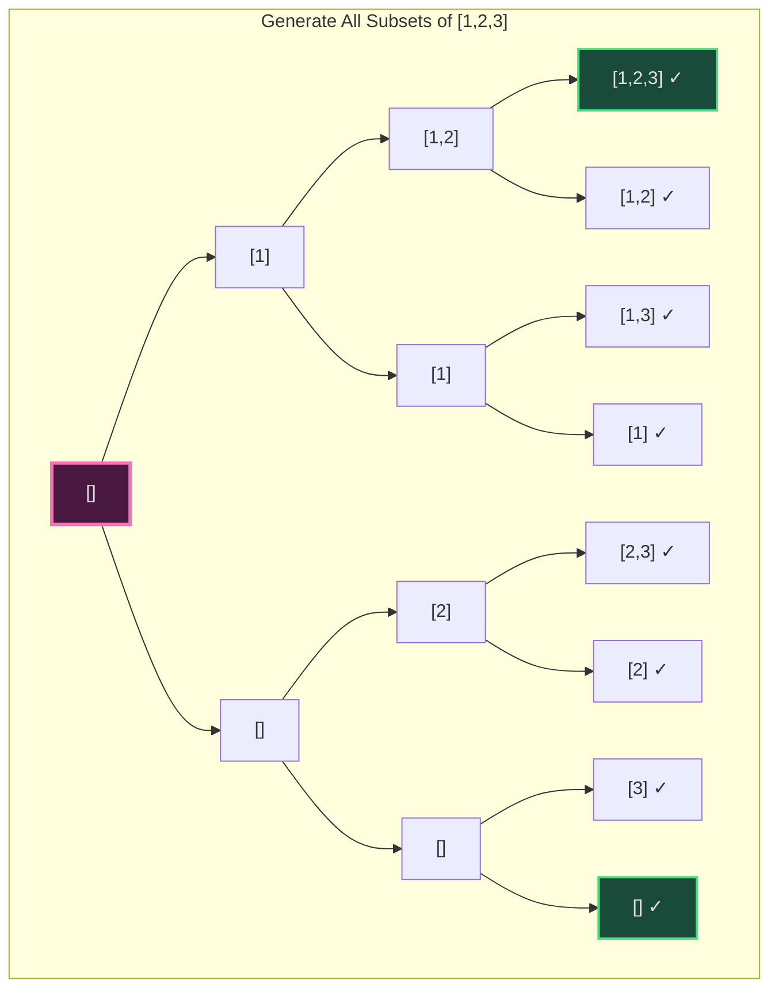
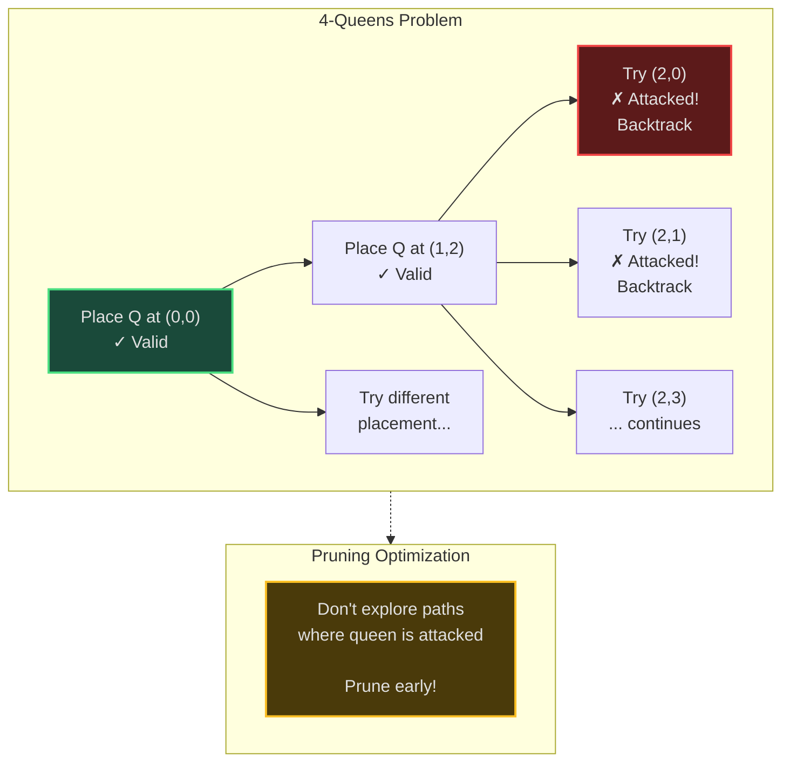
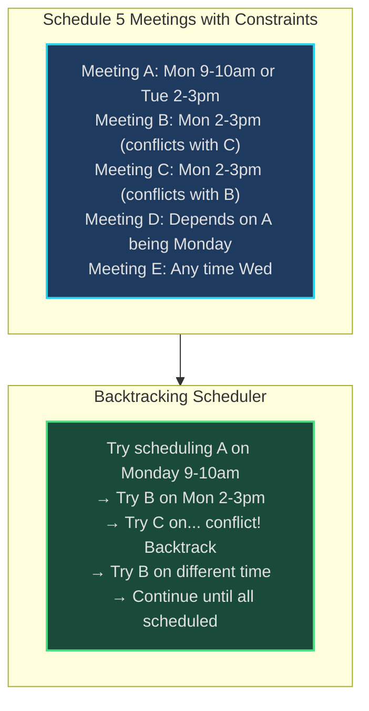
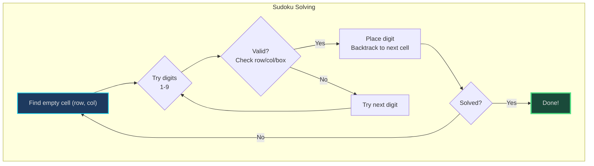
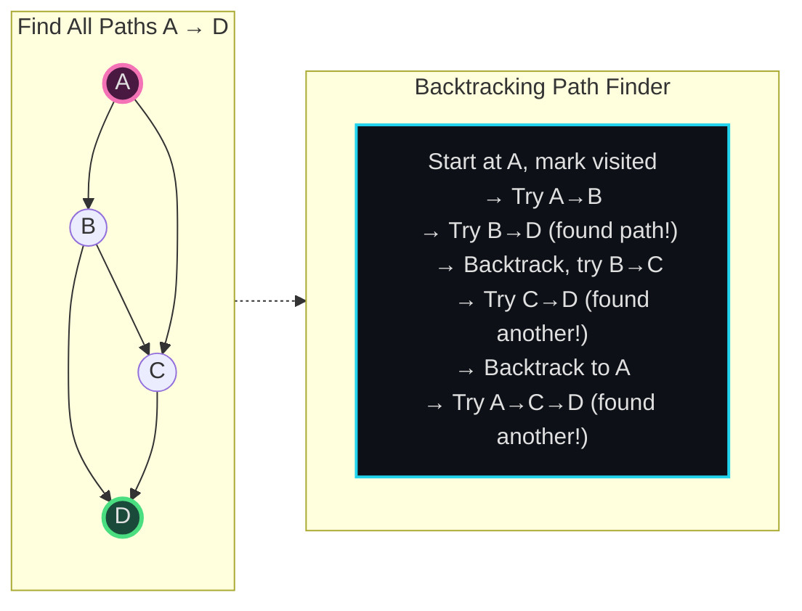
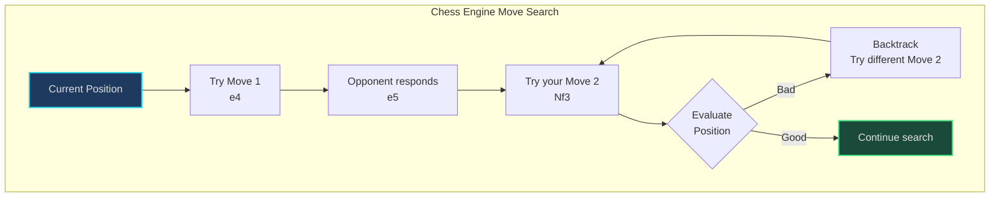

# Backtracking - Senior Engineer Thoughts

*The 4-stage mental pipeline: Problem → Pattern → Structure → Behavior → Code*

---

## Stage 1: Problem → Pattern (Recognition)

> "Backtracking is my reach when I need **'all combinations/permutations'**, **'find all solutions'**, or solving **constraint satisfaction problems**. The trigger: do I need to try different choices and undo them if they don't work?"

**Recognition keywords:**
- "**All combinations**" or "**all permutations**"
- "**Generate all** valid solutions"
- "**N-Queens**, Sudoku, maze solving"
- "Find **one/any** valid solution to constraints"
- "Explore all possibilities"
- "Can I place/choose X such that..."

**Mental model:**
> "Backtracking is DFS with decision-making and undo. At each step, try a choice. If it leads to solution, great. If it leads to dead-end, **undo** (backtrack) and try a different choice. It's exhaustive search with pruning."

**Key insight:**
> "Backtracking = DFS + choose/explore/unchoose pattern. The 'unchoose' (backtrack) is what distinguishes it from plain DFS."

---

## Stage 2: Pattern → Structure (What do I need?)

**Structure inventory:**
- **Current state**: What have I chosen so far? (partial solution)
- **Choices**: What options are available at this step?
- **Constraints**: What makes a choice valid/invalid?
- **Goal condition**: When have I found a complete solution?
- **Result collector**: List to store all valid solutions

> "The structure mirrors the decision tree: each node is a partial solution, edges are choices, leaves are complete solutions or dead-ends."

---

## Stage 3: Structure → Behavior (How does it move?)

**The backtracking template:**
```python
def backtrack(state):
    if is_goal(state):
        result.append(state.copy())  # Found solution
        return

    for choice in get_choices(state):
        if is_valid(choice, state):
            make_choice(choice, state)      # Choose
            backtrack(state)                 # Explore
            undo_choice(choice, state)       # Unchoose (backtrack)
```

**Three phases:**
1. **Choose**: Make a decision, update state
2. **Explore**: Recurse with new state
3. **Unchoose**: Undo the decision, restore previous state

**Key invariant:**
> "After backtracking returns, state is exactly as it was before the choice. This allows trying other choices from the same starting state."

---

## Visual Model

### Backtracking Decision Tree



### N-Queens Backtracking with Pruning



---

## Stage 4: Behavior → Code (Expression)

### Verbose Form: Generate All Subsets

```python
from typing import List

class SubsetGenerator:
    def __init__(self, nums: List[int]):
        self.nums = nums
        self.current_subset: List[int] = []
        self.all_subsets: List[List[int]] = []

    def _is_goal(self, index: int) -> bool:
        """Check if we've made decision for all elements."""
        return index == len(self.nums)

    def _record_solution(self):
        """Add current subset to results."""
        self.all_subsets.append(self.current_subset[:])  # Copy!

    def _include_element(self, element: int):
        """Choose: include current element."""
        self.current_subset.append(element)

    def _exclude_element(self):
        """Unchoose: remove last included element."""
        self.current_subset.pop()

    def _explore_with_element(self, index: int):
        """Explore branch where element is included."""
        self._include_element(self.nums[index])
        self.backtrack(index + 1)
        self._exclude_element()  # Backtrack

    def _explore_without_element(self, index: int):
        """Explore branch where element is excluded."""
        self.backtrack(index + 1)  # No need to undo, nothing was added

    def backtrack(self, index: int):
        """Generate all subsets using backtracking."""
        if self._is_goal(index):
            self._record_solution()
            return

        # Two choices: include or exclude current element
        self._explore_with_element(index)
        self._explore_without_element(index)

    def generate_all(self) -> List[List[int]]:
        """Entry point."""
        self.backtrack(0)
        return self.all_subsets
```

### Terse Form: Subsets

```python
def subsets(nums: List[int]) -> List[List[int]]:
    result = []

    def backtrack(index: int, current: List[int]):
        if index == len(nums):
            result.append(current[:])  # Copy current state
            return

        # Include nums[index]
        current.append(nums[index])
        backtrack(index + 1, current)
        current.pop()  # Unchoose

        # Exclude nums[index]
        backtrack(index + 1, current)

    backtrack(0, [])
    return result
```

### Verbose Form: N-Queens

```python
class NQueens:
    def __init__(self, n: int):
        self.n = n
        self.board: List[List[str]] = [['.' for _ in range(n)] for _ in range(n)]
        self.solutions: List[List[str]] = []
        self.col_occupied: Set[int] = set()
        self.diag1_occupied: Set[int] = set()  # row - col
        self.diag2_occupied: Set[int] = set()  # row + col

    def _is_goal(self, row: int) -> bool:
        """Check if all queens placed."""
        return row == self.n

    def _record_solution(self):
        """Save current board configuration."""
        self.solutions.append([''.join(row) for row in self.board])

    def _is_safe(self, row: int, col: int) -> bool:
        """Check if placing queen at (row, col) is valid."""
        return (col not in self.col_occupied and
                (row - col) not in self.diag1_occupied and
                (row + col) not in self.diag2_occupied)

    def _place_queen(self, row: int, col: int):
        """Choose: place queen."""
        self.board[row][col] = 'Q'
        self.col_occupied.add(col)
        self.diag1_occupied.add(row - col)
        self.diag2_occupied.add(row + col)

    def _remove_queen(self, row: int, col: int):
        """Unchoose: remove queen (backtrack)."""
        self.board[row][col] = '.'
        self.col_occupied.remove(col)
        self.diag1_occupied.remove(row - col)
        self.diag2_occupied.remove(row + col)

    def backtrack(self, row: int):
        """Place queens row by row."""
        if self._is_goal(row):
            self._record_solution()
            return

        for col in range(self.n):
            if self._is_safe(row, col):
                self._place_queen(row, col)      # Choose
                self.backtrack(row + 1)           # Explore
                self._remove_queen(row, col)      # Unchoose

    def solve(self) -> List[List[str]]:
        self.backtrack(0)
        return self.solutions
```

### Terse Form: N-Queens

```python
def solveNQueens(n: int) -> List[List[str]]:
    result = []
    board = [['.' for _ in range(n)] for _ in range(n)]
    cols = set()
    diag1 = set()
    diag2 = set()

    def backtrack(row: int):
        if row == n:
            result.append([''.join(row) for row in board])
            return

        for col in range(n):
            if col in cols or (row - col) in diag1 or (row + col) in diag2:
                continue  # Pruning: skip invalid placements

            # Choose
            board[row][col] = 'Q'
            cols.add(col)
            diag1.add(row - col)
            diag2.add(row + col)

            # Explore
            backtrack(row + 1)

            # Unchoose (backtrack)
            board[row][col] = '.'
            cols.remove(col)
            diag1.remove(row - col)
            diag2.remove(row + col)

    backtrack(0)
    return result
```

---

## Real World Use Cases

> "Backtracking isn't just puzzles - it's how schedulers, routers, and constraint solvers work."

### 1. **Constraint Satisfaction - Meeting Scheduler**

**System Architecture:**


**Why backtracking?**
> "Google Calendar's 'Find a time' feature: try to schedule meetings given constraints (availability, dependencies, room conflicts). Backtracking: assign time slot to meeting 1, try meeting 2, if conflict, backtrack and try different slot for meeting 1. This is literally N-Queens but for calendars."

**Real-world usage:**
- **Microsoft Outlook**: Meeting scheduler
- **Calendly**: Automated scheduling
- **Doodle polls**: Finding common availability
- **Resource booking systems**: Conference rooms, equipment

---

### 2. **Sudoku Solvers**

**System:**


**Why backtracking?**
> "Every Sudoku app uses backtracking: find empty cell, try digits 1-9, check constraints (row/column/box unique), recurse. If dead-end, backtrack to previous cell and try next digit. This is the standard constraint satisfaction algorithm."

**Real-world usage:**
- **Sudoku apps**: All solvers use backtracking + pruning
- **Crossword generators**: Word placement with constraints
- **Logic puzzle solvers**: KenKen, Kakuro

---

### 3. **Network Routing - Finding All Paths**

**System Architecture:**


**Why backtracking?**
> "Network path enumeration: find ALL possible paths between two routers (for redundancy, failover analysis). Backtracking: explore path, mark nodes visited, recurse. When reaching destination, record path. Backtrack (unmark nodes) to explore other paths. This is 'find all paths' with DFS + backtracking."

**Real-world usage:**
- **Network analysis**: Redundant path discovery
- **Routing protocols**: OSPF multi-path calculation
- **Load balancing**: Path diversity for fault tolerance

---

### 4. **Regex Matching - NFA Simulation**

**System:**
- **Problem**: Match pattern `"a*b"` against string `"aaab"`
- **Behavior**: At each step, try different branches (match `a` or skip via `*`), backtrack if mismatch
- **Real tool**: Regex engines (backtracking-based, not DFA)

> "Regex engines use backtracking: pattern `a.*b` on string `aaaabc` - try matching `a`, then `.*` tries to consume everything. Reach end, no `b`. Backtrack: `.*` gives back one char, check for `b`, repeat. This is why catastrophic backtracking exists - too much undoing!"

---

### 5. **Game AI - Chess Move Generation**

**System Architecture:**


**Why backtracking?**
> "Chess engines (Stockfish, AlphaZero training) use backtracking in minimax search: try a move, recurse opponent's responses, evaluate positions. If bad position, backtrack and try different move. This is backtracking with pruning (alpha-beta). The 'unchoose' step is undoing the move on the board."

**Real-world usage:**
- **Chess engines**: Minimax with alpha-beta pruning
- **Go engines**: Monte Carlo Tree Search (MCTS) with backpropagation
- **Game solvers**: Checkers, tic-tac-toe

---

### 6. **Code Generation - Syntax Exploration**

**System:**
- **Problem**: Generate all valid parentheses combinations `(n=3)`: `((()))`, `(()())`, etc.
- **Behavior**: Backtracking: add `(` if count < n, add `)` if valid, backtrack when invalid
- **Real usage**: Parser generators, code formatters

> "Code formatters (Prettier, Black) explore formatting options using backtracking: try line break here, check if it fits line length. If not, backtrack and try different break point. This finds optimal formatting within constraints."

---

### Why This Matters for Full-Stack Engineers

> "Backtracking is my tool for 'find all valid configurations' problems:"

- **Frontend**: Form validation with dependent fields, dynamic form generation
- **Backend**: Scheduling, resource allocation, configuration validation
- **DevOps**: Deployment sequence planning, dependency resolution
- **Testing**: Test case generation, combinatorial testing
- **Infrastructure**: Network path analysis, failover planning

> "The pattern: whenever I need to try different combinations subject to constraints, I reach for backtracking. It's exhaustive search made practical with pruning and undo."

---

## Self-Check Questions

1. **Can I identify choose/explore/unchoose?** These are the three phases of every backtracking step.
2. **Do I know when to backtrack?** When I hit a constraint violation or dead-end.
3. **Can I implement proper pruning?** Check constraints BEFORE recursing, not after.
4. **Can I handle state correctly?** Ensure state is restored after backtracking (unchoose).
5. **Can I identify backtracking in production?** Schedulers, routers, solvers, regex engines.

---

## Common Backtracking Patterns

- **Subsets/Combinations**: Include or exclude each element
- **Permutations**: Try each element in each position
- **N-Queens/Sudoku**: Try valid placements, backtrack on conflict
- **Path finding**: All paths from A to B (mark/unmark visited)
- **Partition problems**: Try assigning elements to groups

**Optimization: Pruning**
> "The key to efficient backtracking: prune early. Check constraints BEFORE making a choice, not after. If a choice violates constraints, don't explore that branch."

---

## LeetCode Practice Problems

| # | Problem | Difficulty |
|---|---------|------------|
| 17 | [Letter Combinations of a Phone Number](https://leetcode.com/problems/letter-combinations-of-a-phone-number/) | Medium |
| 22 | [Generate Parentheses](https://leetcode.com/problems/generate-parentheses/) | Medium |
| 39 | [Combination Sum](https://leetcode.com/problems/combination-sum/) | Medium |
| 40 | [Combination Sum II](https://leetcode.com/problems/combination-sum-ii/) | Medium |
| 46 | [Permutations](https://leetcode.com/problems/permutations/) | Medium |
| 47 | [Permutations II](https://leetcode.com/problems/permutations-ii/) | Medium |
| 77 | [Combinations](https://leetcode.com/problems/combinations/) | Medium |
| 78 | [Subsets](https://leetcode.com/problems/subsets/) | Medium |
| 79 | [Word Search](https://leetcode.com/problems/word-search/) | Medium |
| 90 | [Subsets II](https://leetcode.com/problems/subsets-ii/) | Medium |
| 131 | [Palindrome Partitioning](https://leetcode.com/problems/palindrome-partitioning/) | Medium |
| 37 | [Sudoku Solver](https://leetcode.com/problems/sudoku-solver/) | Hard |
| 51 | [N-Queens](https://leetcode.com/problems/n-queens/) | Hard |
| 52 | [N-Queens II](https://leetcode.com/problems/n-queens-ii/) | Hard |
| 212 | [Word Search II](https://leetcode.com/problems/word-search-ii/) | Hard |
| 301 | [Remove Invalid Parentheses](https://leetcode.com/problems/remove-invalid-parentheses/) | Hard |
| 980 | [Unique Paths III](https://leetcode.com/problems/unique-paths-iii/) | Hard |
---
