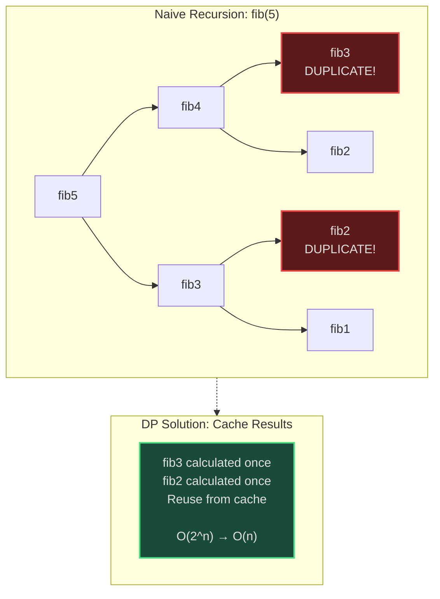
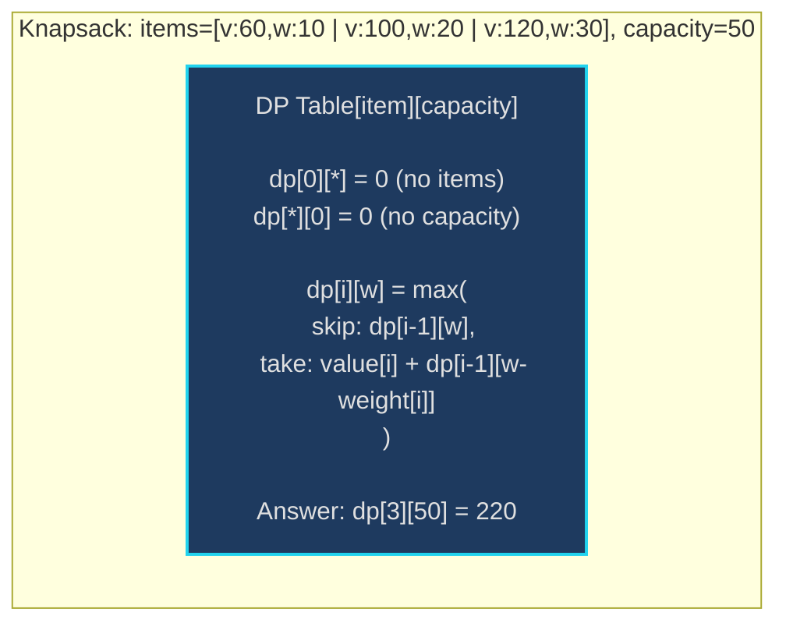
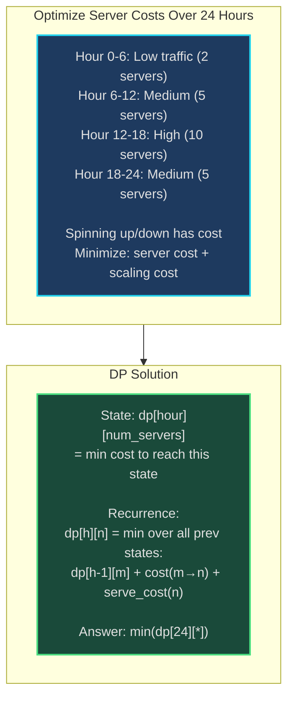
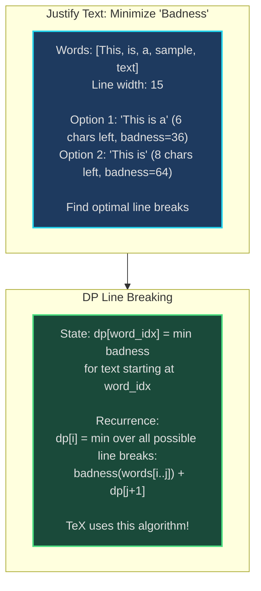
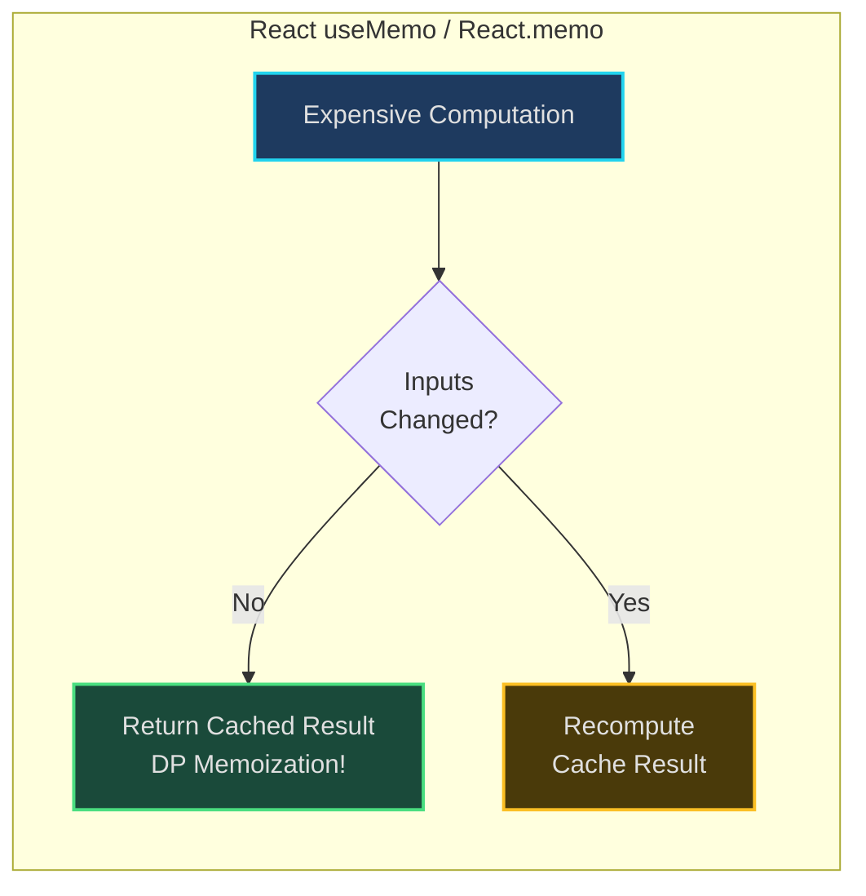

# Dynamic Programming - Senior Engineer Thoughts

*The 4-stage mental pipeline: Problem → Pattern → Structure → Behavior → Code*

---

## Stage 1: Problem → Pattern (Recognition)

> "DP is my reach when I see **'optimal'** (min/max), **'count ways'**, or **'decision at each step'** with **overlapping subproblems**. The trigger: am I solving the same subproblem multiple times?"

**Recognition keywords:**
- "**Optimal** solution" (minimum cost, maximum profit)
- "**Count number of ways**"
- "Make decisions at each step"
- "**Choose or skip**" pattern
- "Overlapping subproblems" (same calculation repeated)
- "Optimal substructure" (optimal solution built from optimal sub-solutions)

**Mental model:**
> "DP is memoized recursion or bottom-up table-filling. Instead of recalculating fib(5) every time, I store it once and reuse. The pattern: break problem into smaller subproblems, solve each once, combine results."

**DP vs other approaches:**
> "Greedy: local optimal choice. Backtracking: explore all possibilities. DP: explore all, but remember results to avoid redundant work."

---

## Stage 2: Pattern → Structure (What do I need?)

**Structure inventory:**
- **DP table/array**: 1D, 2D, or higher-dimensional array storing subproblem solutions
- **State variables**: What defines a unique subproblem? (index, remaining capacity, etc.)
- **Recurrence relation**: How do I build solution to problem from sub-solutions?
- **Base cases**: Smallest subproblems I can solve directly

> "The hardest part isn't coding - it's identifying the state and recurrence relation. Once I have those, the code writes itself."

**Two approaches:**
1. **Top-down (Memoization)**: Recursive with cache
2. **Bottom-up (Tabulation)**: Iterative table-filling

---

## Stage 3: Structure → Behavior (How does it move?)

**Step 1: Define state**
> "What variables uniquely identify a subproblem? For knapsack: `(current_item, remaining_capacity)`. For fibonacci: `(n)`. State = parameters that change."

**Step 2: Write recurrence relation**
> "How do I express solution to problem(state) in terms of smaller subproblems?"
```
fib(n) = fib(n-1) + fib(n-2)
knapsack(i, w) = max(skip item i, take item i)
               = max(knapsack(i-1, w), value[i] + knapsack(i-1, w-weight[i]))
```

**Step 3: Identify base cases**
> "What's the smallest problem I can solve without recursion?"
```
fib(0) = 0, fib(1) = 1
knapsack(0, w) = 0  (no items left)
knapsack(i, 0) = 0  (no capacity)
```

**Step 4: Decide memoization vs tabulation**
> "Top-down (memo) is intuitive, matches recursive thinking. Bottom-up (table) is often more space-efficient, no recursion overhead."

---

## Visual Model

### Fibonacci - Overlapping Subproblems



### 0/1 Knapsack - State Table



---

## Stage 4: Behavior → Code (Expression)

### Verbose Form: Fibonacci (Top-Down Memoization)

```python
from typing import Dict

class FibonacciDP:
    def __init__(self):
        self.memo: Dict[int, int] = {}

    def _is_base_case(self, n: int) -> bool:
        """Check if this is a base case."""
        return n <= 1

    def _get_base_case_value(self, n: int) -> int:
        """Return value for base case."""
        return n  # fib(0)=0, fib(1)=1

    def _is_memoized(self, n: int) -> bool:
        """Check if result already computed."""
        return n in self.memo

    def _get_memoized_value(self, n: int) -> int:
        """Retrieve memoized result."""
        return self.memo[n]

    def _memoize_result(self, n: int, result: int):
        """Store result for future use."""
        self.memo[n] = result

    def _compute_recurrence(self, n: int) -> int:
        """Apply recurrence relation."""
        return self.fib(n - 1) + self.fib(n - 2)

    def fib(self, n: int) -> int:
        """Compute nth Fibonacci number with memoization."""
        if self._is_base_case(n):
            return self._get_base_case_value(n)

        if self._is_memoized(n):
            return self._get_memoized_value(n)

        result = self._compute_recurrence(n)
        self._memoize_result(n, result)
        return result
```

### Terse Form: Fibonacci (Memoization)

```python
def fib_memo(n: int, memo: Dict[int, int] = None) -> int:
    if memo is None:
        memo = {}

    if n <= 1:
        return n

    if n in memo:
        return memo[n]

    memo[n] = fib_memo(n - 1, memo) + fib_memo(n - 2, memo)
    return memo[n]
```

### Terse Form: Fibonacci (Bottom-Up Tabulation)

```python
def fib_dp(n: int) -> int:
    if n <= 1:
        return n

    dp = [0] * (n + 1)
    dp[1] = 1

    for i in range(2, n + 1):
        dp[i] = dp[i - 1] + dp[i - 2]

    return dp[n]
```

### Verbose Form: 0/1 Knapsack (Bottom-Up)

```python
from typing import List

class Knapsack01:
    def __init__(self, values: List[int], weights: List[int], capacity: int):
        self.values = values
        self.weights = weights
        self.capacity = capacity
        self.n = len(values)
        self.dp: List[List[int]] = []

    def _initialize_dp_table(self):
        """Create DP table with base cases."""
        self.dp = [[0] * (self.capacity + 1) for _ in range(self.n + 1)]

    def _can_take_item(self, item_idx: int, current_capacity: int) -> bool:
        """Check if item fits in current capacity."""
        return self.weights[item_idx - 1] <= current_capacity

    def _value_if_skip(self, item_idx: int, current_capacity: int) -> int:
        """Value if we skip current item."""
        return self.dp[item_idx - 1][current_capacity]

    def _value_if_take(self, item_idx: int, current_capacity: int) -> int:
        """Value if we take current item."""
        item_value = self.values[item_idx - 1]
        item_weight = self.weights[item_idx - 1]
        remaining_capacity = current_capacity - item_weight
        return item_value + self.dp[item_idx - 1][remaining_capacity]

    def _choose_best_option(self, item_idx: int, current_capacity: int):
        """Decide whether to take or skip item."""
        if not self._can_take_item(item_idx, current_capacity):
            # Can't take, must skip
            self.dp[item_idx][current_capacity] = self._value_if_skip(item_idx, current_capacity)
        else:
            # Can take, choose max
            skip_value = self._value_if_skip(item_idx, current_capacity)
            take_value = self._value_if_take(item_idx, current_capacity)
            self.dp[item_idx][current_capacity] = max(skip_value, take_value)

    def solve(self) -> int:
        """Solve knapsack problem."""
        self._initialize_dp_table()

        for item_idx in range(1, self.n + 1):
            for capacity in range(1, self.capacity + 1):
                self._choose_best_option(item_idx, capacity)

        return self.dp[self.n][self.capacity]
```

### Terse Form: 0/1 Knapsack

```python
def knapsack(values: List[int], weights: List[int], capacity: int) -> int:
    n = len(values)
    dp = [[0] * (capacity + 1) for _ in range(n + 1)]

    for i in range(1, n + 1):
        for w in range(1, capacity + 1):
            if weights[i - 1] <= w:
                # Can take item: max(skip, take)
                dp[i][w] = max(
                    dp[i - 1][w],  # Skip
                    values[i - 1] + dp[i - 1][w - weights[i - 1]]  # Take
                )
            else:
                # Can't take, must skip
                dp[i][w] = dp[i - 1][w]

    return dp[n][capacity]
```

---

## Real World Use Cases

> "DP isn't just interview problems - it's how we optimize resource allocation, plan routes, and make decisions under constraints."

### 1. **Resource Allocation - Cloud Auto-Scaling**

**System Architecture:**


**Why DP?**
> "AWS auto-scaling optimization: given traffic forecast, minimize cost over 24 hours. At each hour, decide: keep current servers, scale up, or scale down. Overlapping subproblems (cost at hour 12 depends on hour 11 decision). DP finds optimal scaling schedule."

**Real-world usage:**
- **AWS Auto Scaling**: Predictive scaling with DP optimization
- **Google Cloud**: Committed use discount optimizer
- **Container orchestration**: Kubernetes pod scheduling optimization

---

### 2. **Route Optimization - Uber/Lyft Pricing**

**System:**
- **Problem**: Find cheapest route from A to B with constraints (toll roads, traffic, fuel cost)
- **State**: `dp[location][fuel_remaining][time]` = minimum cost
- **Recurrence**: Try all next locations, pick minimum cost path
- **Real usage**: Dijkstra is greedy, but with multi-dimensional costs (time vs money vs comfort), DP can optimize across all dimensions

> "Ride-sharing surge pricing uses DP: predict demand over next hours, allocate drivers optimally to minimize wait times while maximizing utilization. Multi-dimensional DP: balance driver earnings, rider wait time, platform revenue."

---

### 3. **Text Rendering - Line Breaking Algorithm**

**System Architecture:**


**Why DP?**
> "TeX (LaTeX typesetting) uses DP for line breaking: minimize total 'badness' (sum of squared whitespace) across all lines. Greedy (fit as many words as possible per line) gives ugly results. DP tries all break points, finds globally optimal layout."

**Real-world usage:**
- **TeX/LaTeX**: Knuth-Plass line breaking algorithm
- **Web browsers**: CSS text justification
- **Word processors**: Microsoft Word, Google Docs paragraph layout

---

### 4. **Database Query Optimization - Join Order**

**System:**
- **Problem**: Join 5 tables, find optimal order to minimize I/O
- **State**: `dp[subset_of_tables]` = minimum cost to join this subset
- **Recurrence**: Try all ways to split subset into two parts, join them
- **Real tool**: PostgreSQL/MySQL query optimizer

> "When I write `SELECT * FROM A JOIN B JOIN C JOIN D`, the database uses DP to find optimal join order. Joining A-B first vs C-D first can differ by 1000x in I/O. DP explores all orders efficiently (vs trying all N! permutations)."

---

### 5. **Video Encoding - Bitrate Allocation**

**System:**
- **Problem**: Encode video with variable bitrate, total size ≤ budget
- **State**: `dp[frame][bits_remaining]` = max quality for remaining frames
- **Recurrence**: Allocate bits to current frame, recurse on remaining
- **Tool**: x264/x265 video encoders

> "Video codecs use DP for rate control: allocate bits across frames to maximize overall quality within file size budget. Complex scenes get more bits, simple scenes fewer. DP ensures optimal allocation."

---

### 6. **Frontend - Memoization in React**

**System Architecture:**


**Why DP?**
> "React's `useMemo` is literally DP memoization: cache result of expensive computation, only recompute when dependencies change. Same as DP: avoid redundant recalculation."

```javascript
const expensiveValue = useMemo(() => {
  return computeExpensiveValue(a, b);  // Only recompute if a or b change
}, [a, b]);  // Dependencies
```

---

### Why This Matters for Full-Stack Engineers

> "DP thinking shows up whenever I'm making sequential decisions with constraints:"

- **Frontend**: Memoization (React, Vue), form validation caching
- **Backend**: Caching strategies, resource allocation, scheduling
- **Databases**: Query optimization, index selection
- **DevOps**: Cost optimization, capacity planning
- **Algorithms**: Any 'optimal' problem with overlapping subproblems

> "The insight: if I'm solving the same problem multiple times (e.g., fib(5) called repeatedly), I should cache it. That's DP. Whether it's server scaling costs or text rendering, the pattern is the same."

---

## Self-Check Questions

1. **Can I identify the state?** What variables define a unique subproblem?
2. **Can I write the recurrence relation?** How does solution to problem depend on sub-solutions?
3. **Can I identify base cases?** Smallest problems I can solve directly?
4. **Can I choose top-down vs bottom-up?** Memoization vs tabulation trade-offs?
5. **Can I optimize space complexity?** Sometimes I only need previous row of DP table.

---

## Common DP Patterns

**Linear DP (1D):**
- Fibonacci, climbing stairs, house robber
- State: `dp[i]` = answer for index i

**Knapsack variants (2D):**
- 0/1 knapsack, subset sum, partition equal subset
- State: `dp[i][capacity]`

**Grid DP:**
- Unique paths, minimum path sum
- State: `dp[row][col]`

**String DP:**
- Longest common subsequence, edit distance
- State: `dp[i][j]` = answer for s1[0..i] and s2[0..j]

**Decision tree DP:**
- Buy/sell stock with cooldown
- State: `dp[day][state]` where state = holding/not holding/cooldown

> "DP mastery: recognize overlapping subproblems, define state correctly, write recurrence relation. The code is mechanical once you have the relation."

---

## LeetCode Practice Problems

| # | Problem | Difficulty |
|---|---------|------------|
| 5 | [Longest Palindromic Substring](https://leetcode.com/problems/longest-palindromic-substring/) | Medium |
| 62 | [Unique Paths](https://leetcode.com/problems/unique-paths/) | Medium |
| 64 | [Minimum Path Sum](https://leetcode.com/problems/minimum-path-sum/) | Medium |
| 70 | [Climbing Stairs](https://leetcode.com/problems/climbing-stairs/) | Medium |
| 72 | [Edit Distance](https://leetcode.com/problems/edit-distance/) | Medium |
| 139 | [Word Break](https://leetcode.com/problems/word-break/) | Medium |
| 198 | [House Robber](https://leetcode.com/problems/house-robber/) | Medium |
| 213 | [House Robber II](https://leetcode.com/problems/house-robber-ii/) | Medium |
| 300 | [Longest Increasing Subsequence](https://leetcode.com/problems/longest-increasing-subsequence/) | Medium |
| 322 | [Coin Change](https://leetcode.com/problems/coin-change/) | Medium |
| 518 | [Coin Change II](https://leetcode.com/problems/coin-change-ii/) | Medium |
| 1143 | [Longest Common Subsequence](https://leetcode.com/problems/longest-common-subsequence/) | Medium |
| 10 | [Regular Expression Matching](https://leetcode.com/problems/regular-expression-matching/) | Hard |
| 32 | [Longest Valid Parentheses](https://leetcode.com/problems/longest-valid-parentheses/) | Hard |
| 44 | [Wildcard Matching](https://leetcode.com/problems/wildcard-matching/) | Hard |
| 115 | [Distinct Subsequences](https://leetcode.com/problems/distinct-subsequences/) | Hard |
| 123 | [Best Time to Buy and Sell Stock III](https://leetcode.com/problems/best-time-to-buy-and-sell-stock-iii/) | Hard |
| 188 | [Best Time to Buy and Sell Stock IV](https://leetcode.com/problems/best-time-to-buy-and-sell-stock-iv/) | Hard |
| 312 | [Burst Balloons](https://leetcode.com/problems/burst-balloons/) | Hard |
| 1235 | [Maximum Profit in Job Scheduling](https://leetcode.com/problems/maximum-profit-in-job-scheduling/) | Hard |
---
