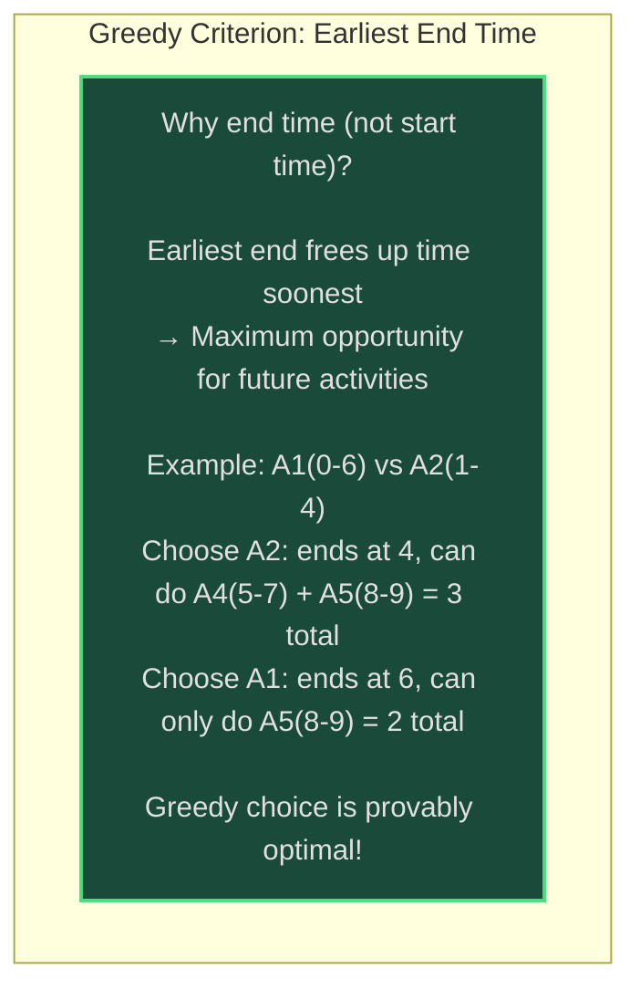
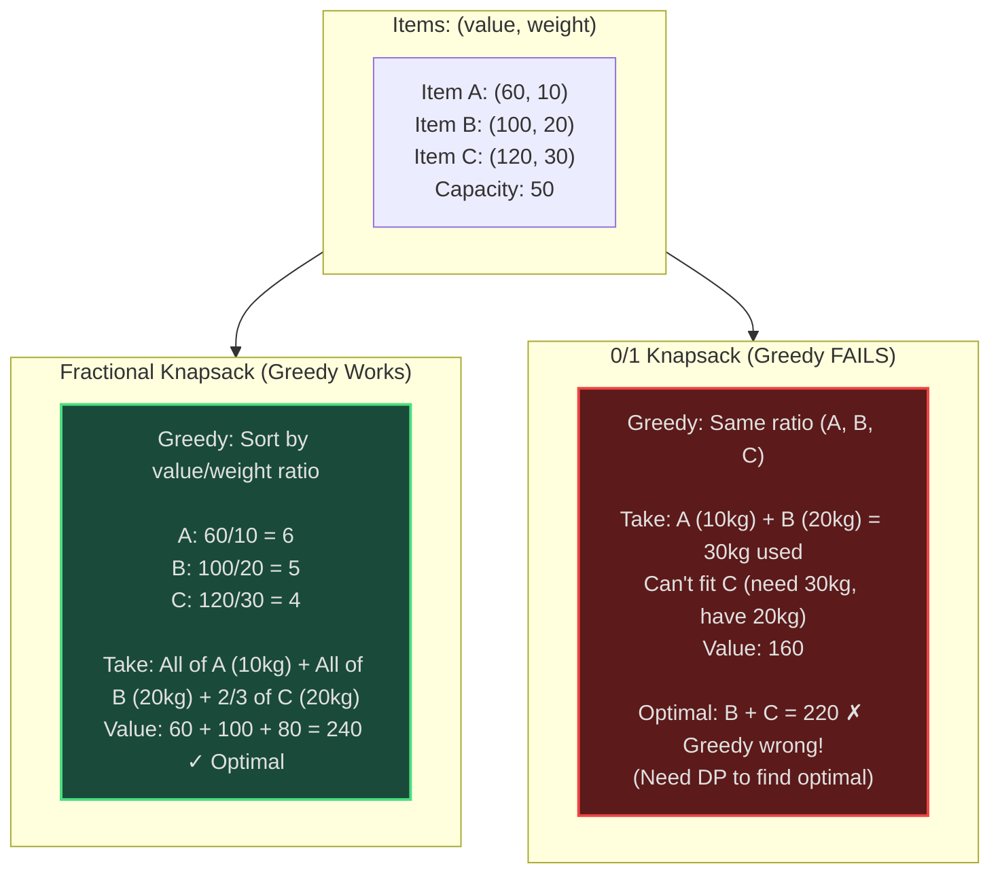
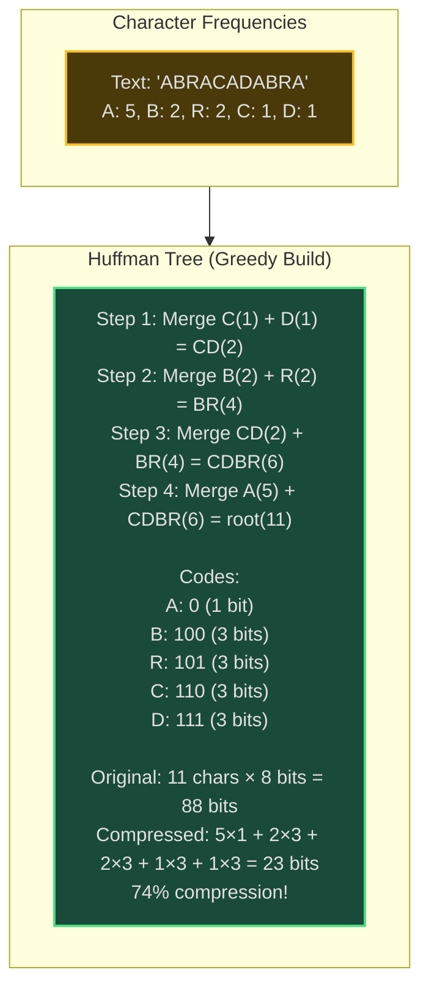
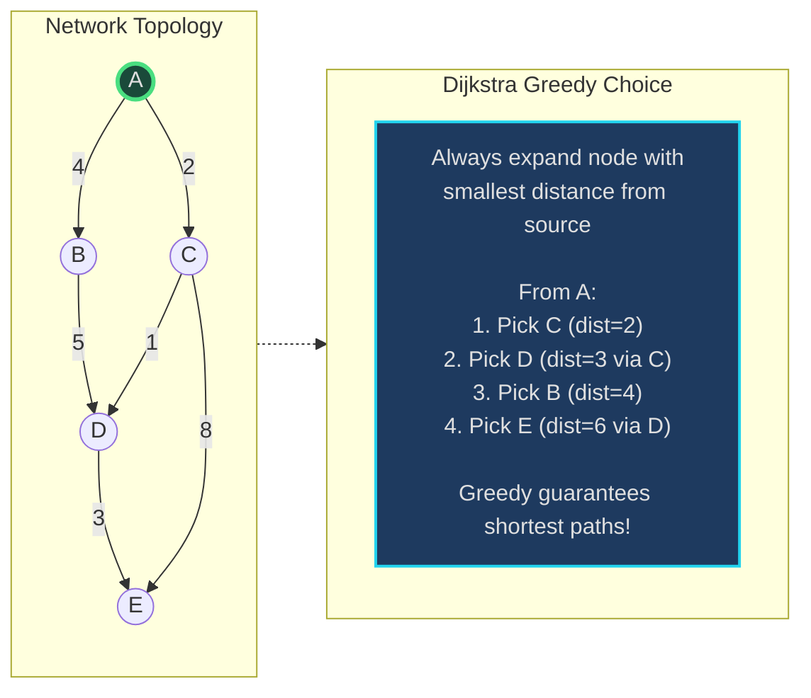

# Greedy Algorithms - Senior Engineer Thoughts

*The 4-stage mental pipeline: Problem → Pattern → Structure → Behavior → Code*

---

## Stage 1: Problem → Pattern (Recognition)

> "Greedy is my reach when I see **'optimal solution'** with **'local choices'**, and I suspect each locally optimal choice leads to global optimum. The trigger: can I make the best choice at each step without looking back?"

**Recognition keywords:**
- "**Maximize/minimize**" something
- "**Activity selection**" / scheduling
- "**Interval** problems where order matters"
- "**Fractional** knapsack (can take parts)"
- "**Huffman coding**" / compression
- "**Minimum spanning tree**"
- "Can always choose **locally optimal**"
- "**No need to reconsider** past choices"

**Mental model:**
> "Greedy makes the best local choice at each step, hoping it leads to global optimum. Unlike DP (which considers all possibilities), greedy commits to one choice and never backtracks. It's like taking the steepest uphill path at every intersection, hoping it leads to the summit."

**Key insight:**
> "Greedy works when problem has **greedy choice property** (local optimum leads to global) and **optimal substructure** (optimal solution contains optimal solutions to subproblems). The hard part: PROVING the greedy choice is safe."

---

## Stage 2: Pattern → Structure (What do I need?)

**Structure inventory:**
- **Sorting**: Often need to sort by some criterion first
- **Priority queue/heap**: For dynamic greedy choices
- **Greedy criterion**: The rule for "best" choice (earliest end time, highest value/weight ratio, etc.)
- **Proof of correctness**: Exchange argument or induction

> "The greedy criterion is everything. Wrong criterion = wrong answer. Activity selection: sort by **end time** (not start time, not duration). Fractional knapsack: **value/weight ratio** (not just value)."

---

## Stage 3: Structure → Behavior (How does it move?)

**Greedy algorithm pattern:**
```
1. Sort input by greedy criterion (if needed)
2. Initialize result/state
3. For each element in sorted order:
   - Check if adding element maintains feasibility
   - If yes: greedily add it to solution
   - If no: skip it
4. Return solution
```

**Greedy vs DP decision:**
```
Greedy works when:
  - Can prove greedy choice is optimal
  - Making choice reduces problem to smaller subproblem
  - No need to reconsider past choices

Use DP when:
  - Greedy choice might not be optimal
  - Need to consider multiple options
  - Optimal solution requires "looking ahead"
```

**Key invariant:**
> "After processing k elements, we have the optimal solution for those k elements. The greedy choice at step k+1 extends this optimally. This is maintained throughout the algorithm."

---

## Visual Model

### Activity Selection (Greedy Choice Property)

```mermaid
gantt
    title Activity Selection: Choose Maximum Non-Overlapping Activities
    dateFormat X
    axisFormat %s

    section Activities
    A1 (0-6)   :a1, 0, 6
    A2 (1-4)   :a2, 1, 4
    A3 (3-5)   :a3, 3, 5
    A4 (5-7)   :a4, 5, 7
    A5 (8-9)   :a5, 8, 9
    A6 (5-9)   :a6, 5, 9

    section Greedy Solution (Sort by End Time)
    Choose A2 (ends earliest) :b1, 1, 4
    Choose A4 (next earliest compatible) :b2, 5, 7
    Choose A5 (next earliest compatible) :b3, 8, 9
```





### Greedy vs DP: 0/1 Knapsack vs Fractional Knapsack



---

## Stage 4: Behavior → Code (Expression)

### Verbose Form: Activity Selection

```python
from typing import List, Tuple

class ActivitySelector:
    def __init__(self, activities: List[Tuple[int, int]]):
        """Activities as (start, end) tuples."""
        self.activities = activities
        self.selected: List[Tuple[int, int]] = []

    def _sort_by_end_time(self):
        """Sort activities by end time (greedy criterion)."""
        self.activities.sort(key=lambda x: x[1])

    def _is_compatible(self, activity: Tuple[int, int], last_end: int) -> bool:
        """Check if activity doesn't overlap with last selected."""
        start, end = activity
        return start >= last_end

    def _get_activity_end(self, activity: Tuple[int, int]) -> int:
        """Get end time of activity."""
        return activity[1]

    def _add_to_selected(self, activity: Tuple[int, int]):
        """Add activity to selected list."""
        self.selected.append(activity)

    def select_maximum_activities(self) -> List[Tuple[int, int]]:
        """Select maximum number of non-overlapping activities."""
        if not self.activities:
            return []

        self._sort_by_end_time()

        # Greedily select first activity (earliest end time)
        first = self.activities[0]
        self._add_to_selected(first)
        last_end = self._get_activity_end(first)

        # Greedily select subsequent compatible activities
        for activity in self.activities[1:]:
            if self._is_compatible(activity, last_end):
                self._add_to_selected(activity)
                last_end = self._get_activity_end(activity)

        return self.selected
```

### Terse Form: Activity Selection

```python
def maxActivities(activities: List[Tuple[int, int]]) -> List[Tuple[int, int]]:
    """Select maximum non-overlapping activities."""
    if not activities:
        return []

    # Sort by end time
    activities.sort(key=lambda x: x[1])

    selected = [activities[0]]
    last_end = activities[0][1]

    for start, end in activities[1:]:
        if start >= last_end:
            selected.append((start, end))
            last_end = end

    return selected
```

### Verbose Form: Fractional Knapsack

```python
class FractionalKnapsack:
    def __init__(self, values: List[int], weights: List[int], capacity: int):
        self.items = list(zip(values, weights))
        self.capacity = capacity
        self.total_value = 0.0

    def _calculate_value_per_weight(self, item: Tuple[int, int]) -> float:
        """Calculate value/weight ratio."""
        value, weight = item
        return value / weight if weight > 0 else 0

    def _sort_by_ratio(self):
        """Sort items by value/weight ratio (descending)."""
        self.items.sort(key=self._calculate_value_per_weight, reverse=True)

    def _get_fraction_to_take(self, weight: int, remaining: int) -> float:
        """Calculate fraction of item to take."""
        return min(1.0, remaining / weight)

    def solve(self) -> float:
        """Solve fractional knapsack greedily."""
        self._sort_by_ratio()
        remaining_capacity = self.capacity

        for value, weight in self.items:
            if remaining_capacity == 0:
                break

            fraction = self._get_fraction_to_take(weight, remaining_capacity)
            self.total_value += fraction * value
            remaining_capacity -= fraction * weight

        return self.total_value
```

### Terse Form: Fractional Knapsack

```python
def fractionalKnapsack(values: List[int], weights: List[int], capacity: int) -> float:
    """Greedy fractional knapsack."""
    # Sort by value/weight ratio
    items = sorted(zip(values, weights), key=lambda x: x[0]/x[1], reverse=True)

    total_value = 0.0
    remaining = capacity

    for value, weight in items:
        if remaining == 0:
            break
        take = min(1.0, remaining / weight)
        total_value += take * value
        remaining -= take * weight

    return total_value
```

### Terse Form: Jump Game (Can Reach End?)

```python
def canJump(nums: List[int]) -> bool:
    """Greedy: track maximum reachable index."""
    max_reach = 0

    for i in range(len(nums)):
        if i > max_reach:
            return False  # Can't reach this position

        max_reach = max(max_reach, i + nums[i])

        if max_reach >= len(nums) - 1:
            return True

    return True
```

### Terse Form: Jump Game II (Minimum Jumps)

```python
def jump(nums: List[int]) -> int:
    """Greedy: minimum jumps to reach end."""
    jumps = 0
    current_end = 0
    farthest = 0

    for i in range(len(nums) - 1):
        farthest = max(farthest, i + nums[i])

        if i == current_end:
            jumps += 1
            current_end = farthest

            if current_end >= len(nums) - 1:
                break

    return jumps
```

---

## Real World Use Cases

> "Greedy algorithms are everywhere in system optimization—from CPU scheduling to network routing to compression."

### 1. **CPU Scheduling - Shortest Job First (SJF)**

**System Architecture:**
```mermaid
sequenceDiagram
    participant Queue as Job Queue
    participant Scheduler as Greedy Scheduler
    participant CPU

    Queue->>Scheduler: Job A (5s), Job B (2s), Job C (8s), Job D (1s)
    Scheduler->>Scheduler: Greedy: Sort by execution time<br/>Order: D(1s) → B(2s) → A(5s) → C(8s)

    Scheduler->>CPU: Execute D (1s)
    Note over CPU: Avg wait = 0
    Scheduler->>CPU: Execute B (2s)
    Note over CPU: Avg wait = (0+1)/2 = 0.5s
    Scheduler->>CPU: Execute A (5s)
    Note over CPU: Avg wait = (0+1+3)/3 = 1.33s
    Scheduler->>CPU: Execute C (8s)
    Note over CPU: Avg wait = (0+1+3+8)/4 = 3s

    Note over Scheduler: Minimizes average waiting time!

    style Scheduler fill:#1e3a5f,stroke:#22d3ee,stroke-width:2px
```

**Why greedy?**
> "Operating systems use Shortest Job First (SJF) to minimize average waiting time. Greedy choice: always execute shortest remaining job. Provably optimal for minimizing average wait time. Linux CFS (Completely Fair Scheduler) uses similar greedy principles."

**Real-world usage:**
- **Linux CFS**: CPU time allocation
- **Cloud task schedulers**: AWS Batch, Google Cloud Tasks
- **Background job processors**: Sidekiq, Celery priority queues

---

### 2. **Huffman Coding - File Compression**

**System Architecture:**


**Why greedy?**
> "ZIP, GZIP, JPEG use Huffman coding for compression. Greedy: always merge two lowest-frequency nodes. Builds optimal prefix-free code. More frequent characters get shorter codes. Provably optimal for prefix-free encoding."

**Real-world usage:**
- **GZIP/DEFLATE**: File compression (PNG, ZIP)
- **JPEG**: Image compression
- **Video codecs**: H.264, VP9 entropy coding
- **Network protocols**: HTTP/2 HPACK header compression

---

### 3. **Task Scheduling - Meeting Rooms**

**System:**
- **Problem**: Maximum meetings in one room (activity selection variant)
- **Greedy choice**: Always pick meeting that ends earliest
- **Result**: Maximizes number of meetings attended
- **Tool**: Calendar apps, conference room booking systems

> "Google Calendar 'find a time' uses greedy activity selection. Given N meeting requests, select maximum non-overlapping set. Greedy: sort by end time, pick earliest ending meeting, repeat. O(n log n) for sorting, optimal solution."

**Real-world usage:**
- **Google Calendar**: Meeting scheduling optimization
- **Outlook**: Room booking
- **Calendly**: Availability optimization

---

### 4. **Network Routing - Dijkstra's Algorithm**

**System Architecture:**


**Why greedy?**
> "Dijkstra's algorithm is greedy: always expand closest unvisited node. Google Maps, network routers use this for shortest path. Greedy choice: node closest to source must be on shortest path (no shorter path exists). Optimal for non-negative weights."

**Real-world usage:**
- **Google Maps**: Route navigation
- **Network routers**: OSPF routing protocol
- **Game AI**: Pathfinding in games

---

### 5. **Load Balancing - Least Loaded Server**

**System Architecture:**
```mermaid
sequenceDiagram
    participant LB as Load Balancer
    participant S1 as Server 1 (2 req)
    participant S2 as Server 2 (5 req)
    participant S3 as Server 3 (1 req)

    LB->>LB: New request arrives
    LB->>LB: Greedy: Pick server with<br/>fewest active requests

    LB->>S3: Route to Server 3 (least loaded)
    S3-->>LB: Processing...

    LB->>LB: Next request
    LB->>S1: Route to Server 1 (now least loaded)

    style LB fill:#1e3a5f,stroke:#22d3ee,stroke-width:2px
```

**Why greedy?**
> "Nginx, HAProxy use greedy load balancing: send request to least loaded server. Greedy heuristic balances load well in practice. Not provably optimal (depends on request duration), but simple and effective."

**Real-world usage:**
- **Nginx**: Least connections load balancing
- **AWS ELB**: Target health-based routing
- **Kubernetes**: Pod scheduling (least loaded node)

---

### 6. **Data Compression - Greedy Text Encoding**

**System:**
- **Problem**: Encode text efficiently (SMS, network packets)
- **Greedy**: Assign shorter codes to frequent characters/words
- **Tool**: Text compression, protocol buffers, database encoding

> "Protocol Buffers, Thrift use greedy variable-length encoding. Frequent values (0, 1) use 1 byte, rare values use more. Greedy: most frequent gets shortest encoding. Minimizes average message size."

**Real-world usage:**
- **Protocol Buffers**: Google's data serialization
- **Thrift**: Facebook's RPC framework
- **Database indexes**: Prefix compression in B-Trees

---

### Why This Matters for Full-Stack Engineers

> "Greedy algorithms are my first try for optimization problems:"

- **Backend**: Task scheduling, caching eviction (LRU is greedy), API rate limiting
- **Databases**: Query optimization (greedy join ordering), index selection
- **Frontend**: Resource loading (critical CSS first = greedy priority)
- **Systems**: CPU scheduling, load balancing, network routing
- **Performance**: Often simpler and faster than DP, good enough in practice

> "The pattern: if problem asks for 'maximum' or 'minimum' and I can identify a greedy criterion that seems optimal, I try greedy first. If I can prove the greedy choice property (exchange argument), I'm done. If not, fall back to DP."

---

## Self-Check Questions

1. **Can I identify the greedy criterion?** What makes one choice "better" than another locally?
2. **Can I prove greedy is optimal?** Use exchange argument or induction.
3. **Do I know when greedy fails?** 0/1 knapsack, coin change (arbitrary denominations).
4. **Can I distinguish greedy vs DP?** Greedy = one path forward, DP = explore all paths.
5. **Can I identify it in production?** CPU scheduling, Huffman coding, activity selection, load balancing.

---

## Common Greedy Patterns

- **Activity selection**: Sort by end time, pick non-overlapping
- **Fractional knapsack**: Sort by value/weight ratio
- **Huffman coding**: Merge lowest frequencies
- **Jump game**: Track maximum reachable index
- **Gas station**: Track cumulative fuel balance
- **Minimum platforms**: Track concurrent intervals (sweep line)
- **Candy distribution**: Two passes, left-to-right and right-to-left

**Proving Greedy Works (Exchange Argument):**
> "Assume optimal solution O differs from greedy solution G. Exchange one choice in O to match G. Show resulting solution is still optimal (or better). Repeat until O = G. Therefore G is optimal."

**When Greedy Fails:**
> "0/1 knapsack: greedy by ratio fails (need DP). Coin change with {1,3,4} to make 6: greedy takes 4+1+1, optimal is 3+3 (need DP). Longest path in graph: greedy fails (NP-hard, no polynomial solution)."

---

## LeetCode Practice Problems

| # | Problem | Difficulty |
|---|---------|------------|
| 45 | [Jump Game II](https://leetcode.com/problems/jump-game-ii/) | Medium |
| 55 | [Jump Game](https://leetcode.com/problems/jump-game/) | Medium |
| 134 | [Gas Station](https://leetcode.com/problems/gas-station/) | Medium |
| 435 | [Non-overlapping Intervals](https://leetcode.com/problems/non-overlapping-intervals/) | Medium |
| 452 | [Minimum Number of Arrows to Burst Balloons](https://leetcode.com/problems/minimum-number-of-arrows-to-burst-balloons/) | Medium |
| 621 | [Task Scheduler](https://leetcode.com/problems/task-scheduler/) | Medium |
| 763 | [Partition Labels](https://leetcode.com/problems/partition-labels/) | Medium |
| 1029 | [Two City Scheduling](https://leetcode.com/problems/two-city-scheduling/) | Medium |
| 1094 | [Car Pooling](https://leetcode.com/problems/car-pooling/) | Medium |
| 1465 | [Maximum Area of a Piece of Cake After Horizontal and Vertical Cuts](https://leetcode.com/problems/maximum-area-of-a-piece-of-cake-after-horizontal-and-vertical-cuts/) | Medium |
| 135 | [Candy](https://leetcode.com/problems/candy/) | Hard |
| 330 | [Patching Array](https://leetcode.com/problems/patching-array/) | Hard |
| 502 | [IPO](https://leetcode.com/problems/ipo/) | Hard |
| 630 | [Course Schedule III](https://leetcode.com/problems/course-schedule-iii/) | Hard |
| 757 | [Set Intersection Size At Least Two](https://leetcode.com/problems/set-intersection-size-at-least-two/) | Hard |
| 1834 | [Single-Threaded CPU](https://leetcode.com/problems/single-threaded-cpu/) | Hard |
---
