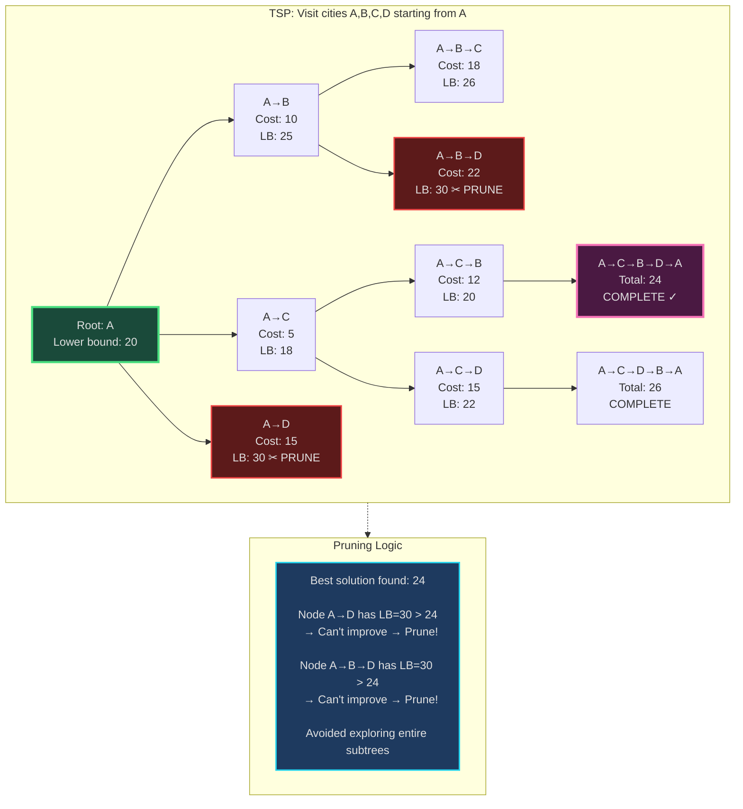
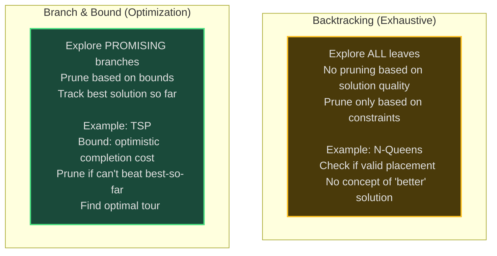
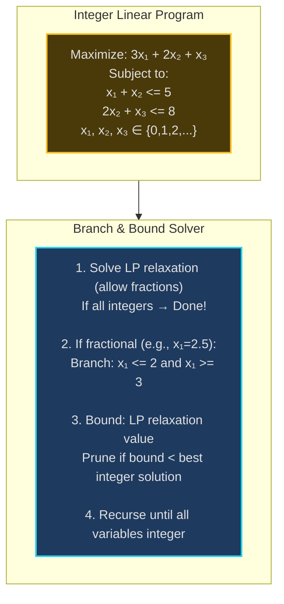

# Branch & Bound - Senior Engineer Thoughts

*The 4-stage mental pipeline: Problem → Pattern → Structure → Behavior → Code*

---

## Stage 1: Problem → Pattern (Recognition)

> "Branch & Bound is my reach when I see **'optimization problem'** with **'search tree'** where **pruning unpromising branches** can save work. The trigger: can I bound the solution quality and avoid exploring bad paths?"

**Recognition keywords:**
- "**Minimize/maximize**" over discrete choices
- "**Traveling Salesman Problem** (TSP)"
- "**0/1 Knapsack optimization**"
- "**Job scheduling**" with constraints
- "**Integer Linear Programming** (ILP)"
- "Prune **suboptimal branches**"
- "**Search space** too large for exhaustive search"

**Mental model:**
> "Branch & Bound is backtracking + pruning. Explore search tree (branch), but maintain bounds on best solution. If current path can't beat best-so-far (bound), prune entire subtree. It's like A* for optimization—use heuristics to avoid exploring guaranteed-worse solutions."

**Key insight:**
> "The bound is everything. Tight bounds → more pruning → faster solution. Loose bounds → little pruning → close to exhaustive search. For maximization: upper bound (optimistic estimate). For minimization: lower bound (optimistic estimate)."

---

## Stage 2: Pattern → Structure (What do I need?)

**Structure inventory:**
- **Search tree**: Node = partial solution, children = extending solution
- **Bound function**: Estimate best possible completion of partial solution
- **Best solution so-far**: Track incumbent (best complete solution found)
- **Priority queue**: Explore most promising nodes first (best-first search)
- **Pruning criterion**: If bound worse than incumbent, prune

> "Branch & Bound = DFS/BFS backtracking + intelligent pruning. The bound function is heuristic (admissible for correctness). Exploring best-first (using priority queue) finds good solutions early, enabling more pruning."

---

## Stage 3: Structure → Behavior (How does it move?)

**Branch & Bound algorithm (minimization):**
```
1. Initialize:
   - best_solution = None
   - best_cost = ∞
   - priority_queue = [root_node]

2. While queue not empty:
   - node = pop most promising node

   - Compute lower bound for node
   - If lower_bound >= best_cost:
     Prune this branch (can't improve)

   - If node is complete solution:
     If cost < best_cost:
       best_solution = node
       best_cost = cost

   - Else:
     Branch: generate children (extend partial solution)
     Add children to queue
```

**Bounding functions:**
```
For TSP (minimization):
  Lower bound = current path cost + MST of unvisited cities
  (Optimistic: assumes optimal completion)

For 0/1 Knapsack (maximization):
  Upper bound = fractional knapsack on remaining items
  (Optimistic: can take fractions, actually can't)
```

**Key invariant:**
> "At any point, best_cost represents the best complete solution found so far. Any partial solution with bound worse than best_cost is pruned. This guarantees optimal solution while avoiding exhaustive search."

---

## Visual Model

### Branch & Bound Search Tree (TSP Example)



### Branch & Bound vs Backtracking



---

## Stage 4: Behavior → Code (Expression)

### Verbose Form: 0/1 Knapsack (Branch & Bound)

```python
import heapq
from typing import List, Tuple

class KnapsackBranchBound:
    def __init__(self, values: List[int], weights: List[int], capacity: int):
        self.values = values
        self.weights = weights
        self.capacity = capacity
        self.n = len(values)
        self.best_value = 0
        self.best_items: List[int] = []

    def _fractional_knapsack_bound(self, level: int, current_weight: int, current_value: int) -> float:
        """Upper bound: add remaining items fractionally."""
        if current_weight >= self.capacity:
            return 0

        bound = current_value
        remaining_capacity = self.capacity - current_weight

        # Add items fractionally by value/weight ratio
        for i in range(level, self.n):
            if self.weights[i] <= remaining_capacity:
                # Take whole item
                bound += self.values[i]
                remaining_capacity -= self.weights[i]
            else:
                # Take fraction
                bound += self.values[i] * (remaining_capacity / self.weights[i])
                break

        return bound

    def _should_prune(self, bound: float) -> bool:
        """Check if node should be pruned."""
        return bound <= self.best_value

    def _update_best_solution(self, value: int, items: List[int]):
        """Update incumbent solution."""
        if value > self.best_value:
            self.best_value = value
            self.best_items = items.copy()

    def solve(self) -> Tuple[int, List[int]]:
        """Branch & Bound for 0/1 Knapsack."""
        # Priority queue: (negative bound, level, weight, value, items)
        # Negative bound for max heap behavior
        pq = [(-self._fractional_knapsack_bound(0, 0, 0), 0, 0, 0, [])]

        while pq:
            neg_bound, level, weight, value, items = heapq.heappop(pq)
            bound = -neg_bound

            if self._should_prune(bound):
                continue  # Prune this branch

            if level == self.n:
                # Complete solution
                self._update_best_solution(value, items)
                continue

            # Branch 1: Include current item
            new_weight = weight + self.weights[level]
            if new_weight <= self.capacity:
                new_value = value + self.values[level]
                new_items = items + [level]
                new_bound = self._fractional_knapsack_bound(level + 1, new_weight, new_value)

                if not self._should_prune(new_bound):
                    heapq.heappush(pq, (-new_bound, level + 1, new_weight, new_value, new_items))

            # Branch 2: Exclude current item
            exclude_bound = self._fractional_knapsack_bound(level + 1, weight, value)
            if not self._should_prune(exclude_bound):
                heapq.heappush(pq, (-exclude_bound, level + 1, weight, value, items))

        return self.best_value, self.best_items
```

### Terse Form: 0/1 Knapsack (Branch & Bound)

```python
import heapq

def knapsackBranchBound(values: List[int], weights: List[int], capacity: int) -> int:
    """Branch & Bound for 0/1 Knapsack."""
    n = len(values)
    best_value = 0

    def bound(level, weight, value):
        """Upper bound using fractional knapsack."""
        if weight >= capacity:
            return 0
        b = value
        rem = capacity - weight
        for i in range(level, n):
            if weights[i] <= rem:
                b += values[i]
                rem -= weights[i]
            else:
                b += values[i] * (rem / weights[i])
                break
        return b

    # Priority queue: (-bound, level, weight, value)
    pq = [(-bound(0, 0, 0), 0, 0, 0)]

    while pq:
        neg_b, lvl, w, v = heapq.heappop(pq)

        if -neg_b <= best_value:
            continue

        if lvl == n:
            best_value = max(best_value, v)
            continue

        # Include item
        if w + weights[lvl] <= capacity:
            new_v = v + values[lvl]
            new_w = w + weights[lvl]
            new_b = bound(lvl + 1, new_w, new_v)
            if new_b > best_value:
                heapq.heappush(pq, (-new_b, lvl + 1, new_w, new_v))

        # Exclude item
        exc_b = bound(lvl + 1, w, v)
        if exc_b > best_value:
            heapq.heappush(pq, (-exc_b, lvl + 1, w, v))

    return best_value
```

---

## Real World Use Cases

> "Branch & Bound powers optimization in logistics, scheduling, resource allocation—anywhere optimal discrete decisions matter."

### 1. **Logistics - Traveling Salesman (TSP)**

**Why Branch & Bound?**
> "FedEx, UPS use Branch & Bound for route optimization (TSP variant). Exact solution for small instances (< 100 cities). Branches = partial tours, bound = MST of unvisited cities + current path. Prunes tours that can't beat current best. For large instances, switches to heuristics (simulated annealing)."

**Real-world usage:**
- **Delivery routing**: UPS, FedEx, DHL
- **PCB drilling**: Minimize drill head movement
- **DNA sequencing**: Order fragment assembly
- **Robotics**: Path planning with obstacles

---

### 2. **Job Scheduling - Minimize Makespan**

**System:**
- **Problem**: Assign N jobs to M machines, minimize completion time
- **Branch**: Assign job to machine
- **Bound**: Lower bound = max(total_work / M, longest_job)
- **Prune**: If partial schedule already exceeds best makespan

> "Manufacturing plants (Toyota, Tesla) use Branch & Bound for job shop scheduling. Exact optimal schedule for critical bottleneck machines. Branches = job assignments, bound = optimistic completion time. Commercial solvers (CPLEX, Gurobi) use sophisticated B&B."

**Real-world usage:**
- **Manufacturing**: Job shop scheduling
- **Cloud computing**: Task assignment to VMs
- **Hospital**: Surgery scheduling
- **Airlines**: Crew scheduling

---

### 3. **Resource Allocation - Capital Budgeting**

**System:**
- **Problem**: Select projects to maximize ROI within budget
- **Branch**: Include/exclude project
- **Bound**: Fractional relaxation (take fractions of projects)
- **Application**: 0/1 Knapsack variant

> "Investment firms use Branch & Bound for portfolio optimization. Select assets to maximize return within risk budget. Branches = asset inclusion decisions, bound = fractional allocation (relaxation). Finds optimal asset mix."

**Real-world usage:**
- **Investment**: Portfolio optimization
- **R&D**: Project selection (pharmaceutical companies)
- **Marketing**: Campaign budget allocation
- **Government**: Infrastructure project selection

---

### 4. **Integer Linear Programming (ILP) Solvers**

**System Architecture:**


**Why Branch & Bound?**
> "CPLEX, Gurobi, SCIP solve ILPs using Branch & Bound. Relax integers to reals (LP), solve efficiently. If fractional, branch on fractional variable. Bound = LP relaxation (optimistic). Powers optimization in finance, logistics, telecom."

**Real-world usage:**
- **Commercial solvers**: CPLEX, Gurobi, SCIP, COIN-OR
- **Supply chain**: Optimization (IBM, SAP)
- **Telecommunications**: Network design (AT&T, Verizon)
- **Finance**: Risk management, portfolio optimization

---

### 5. **Cutting Stock Problem - Minimize Waste**

**System:**
- **Problem**: Cut stock material into pieces, minimize waste
- **Branch**: Cutting patterns
- **Bound**: Lower bound on number of stock pieces needed
- **Application**: Paper mills, steel manufacturing

> "Paper mills use Branch & Bound for cutting stock. Given orders for different widths, determine cutting patterns to minimize waste. Branches = cutting patterns, bound = theoretical minimum rolls. Saves millions in material waste."

**Real-world usage:**
- **Paper industry**: Roll cutting optimization
- **Steel manufacturing**: Sheet cutting
- **Textile**: Fabric cutting patterns
- **Lumber**: Board cutting

---

### 6. **VLSI Design - Chip Floorplanning**

**System:**
- **Problem**: Arrange circuit blocks on chip to minimize area/wirelength
- **Branch**: Block placements
- **Bound**: Lower bound on area (sum of block areas)
- **Optimization**: Minimize total area and wire length

> "Intel, AMD use Branch & Bound for chip floorplanning. Place functional blocks (CPU, cache, I/O) to minimize area and wire delay. Branches = placement configurations, bound = theoretical minimum area. Critical for chip performance."

**Real-world usage:**
- **Chip design**: Intel, AMD, NVIDIA floorplanning
- **EDA tools**: Cadence, Synopsys Place & Route
- **PCB design**: Component placement
- **Data center**: Server rack layout optimization

---

### Why This Matters for Full-Stack Engineers

> "Branch & Bound is my tool for exact optimization when heuristics aren't good enough:"

- **Backend**: Resource allocation APIs, scheduling services
- **Operations**: Cloud resource optimization (VM placement)
- **Algorithms**: When greedy fails, DP is too slow, need exact optimum
- **Performance**: Prune search space intelligently vs exhaustive search
- **Decision making**: Trade quality (tighter bounds) vs speed

> "The pattern: if I have discrete optimization problem (minimize/maximize over choices), I use Branch & Bound when: (1) Greedy doesn't give optimal, (2) DP state space too large, (3) Approximation unacceptable. Tight bounds = good performance."

---

## Self-Check Questions

1. **Can I explain branching?** Generate children by extending partial solution.
2. **Can I compute bounds?** Lower bound (minimization) or upper bound (maximization) on best completion.
3. **Do I know when to prune?** If bound worse than incumbent (best-so-far), prune.
4. **Can I distinguish B&B vs backtracking?** B&B optimizes + prunes by bounds, backtracking finds feasible + prunes by constraints.
5. **Can I identify it in production?** ILP solvers, TSP routing, job scheduling, resource allocation.

---

## Common Branch & Bound Patterns

- **0/1 Knapsack**: Branch include/exclude, bound with fractional knapsack
- **TSP**: Branch extend tour, bound with MST of unvisited + current path
- **Job scheduling**: Branch job assignments, bound with load balancing lower bound
- **Set cover**: Branch include/exclude set, bound with greedy cover
- **ILP**: Branch on fractional variables, bound with LP relaxation

**Key to performance:**
> "Tight bounds → more pruning → faster solution. Explore most promising nodes first (best-first search with priority queue) to find good solutions early, enabling more pruning later."

**Branch & Bound vs other techniques:**
```
vs Backtracking:
  B&B: Optimization (find best)
  Backtracking: Feasibility (find any valid)

vs Dynamic Programming:
  B&B: Explores search tree with pruning
  DP: Builds table of subproblem solutions

vs Greedy:
  B&B: Exact optimal (slower)
  Greedy: Approximate (faster, may not be optimal)

vs Heuristics (Simulated Annealing, Genetic Algorithms):
  B&B: Guarantees optimal if run to completion
  Heuristics: No guarantee, but can handle huge instances
```

---

## LeetCode Practice Problems

| # | Problem | Difficulty |
|---|---------|------------|
| 39 | [Combination Sum](https://leetcode.com/problems/combination-sum/) | Medium |
| 40 | [Combination Sum II](https://leetcode.com/problems/combination-sum-ii/) | Medium |
| 216 | [Combination Sum III](https://leetcode.com/problems/combination-sum-iii/) | Medium |
| 473 | [Matchsticks to Square](https://leetcode.com/problems/matchsticks-to-square/) | Medium |
| 698 | [Partition to K Equal Sum Subsets](https://leetcode.com/problems/partition-to-k-equal-sum-subsets/) | Medium |
| 37 | [Sudoku Solver](https://leetcode.com/problems/sudoku-solver/) | Hard |
| 51 | [N-Queens](https://leetcode.com/problems/n-queens/) | Hard |
| 52 | [N-Queens II](https://leetcode.com/problems/n-queens-ii/) | Hard |
| 1125 | [Smallest Sufficient Team](https://leetcode.com/problems/smallest-sufficient-team/) | Hard |
| 1434 | [Number of Ways to Wear Different Hats to Each Other](https://leetcode.com/problems/number-of-ways-to-wear-different-hats-to-each-other/) | Hard |
---
