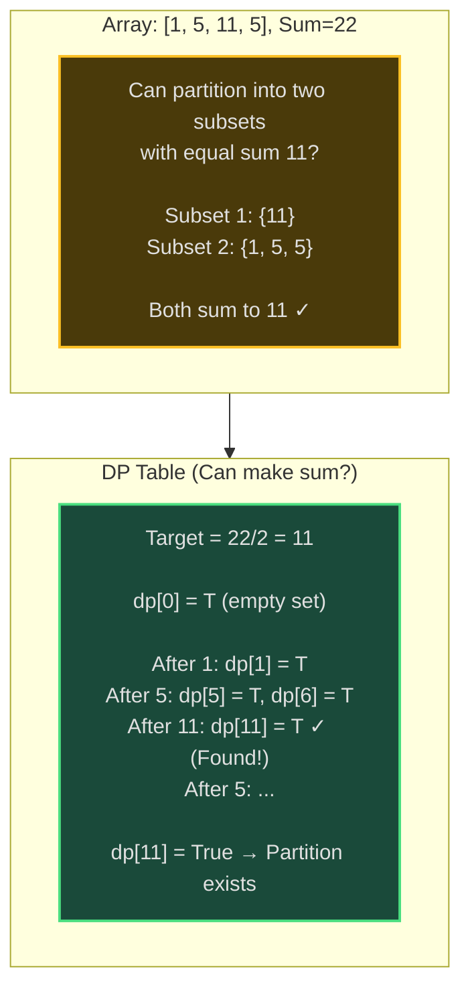
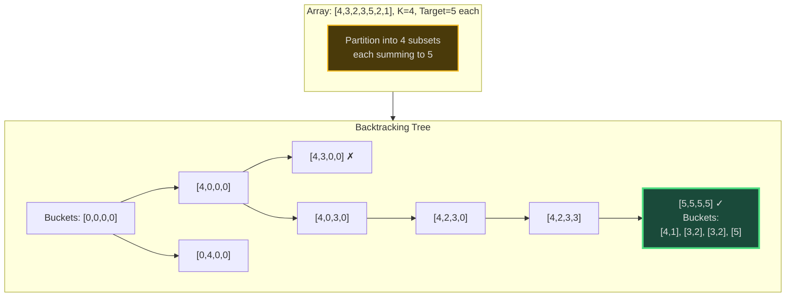
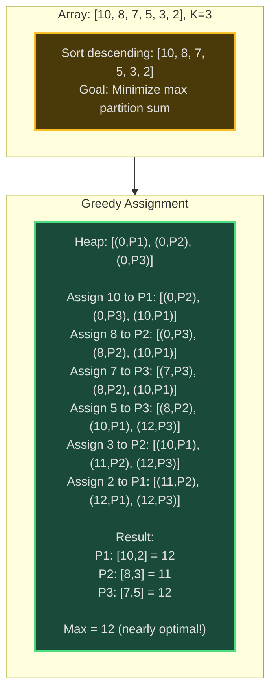
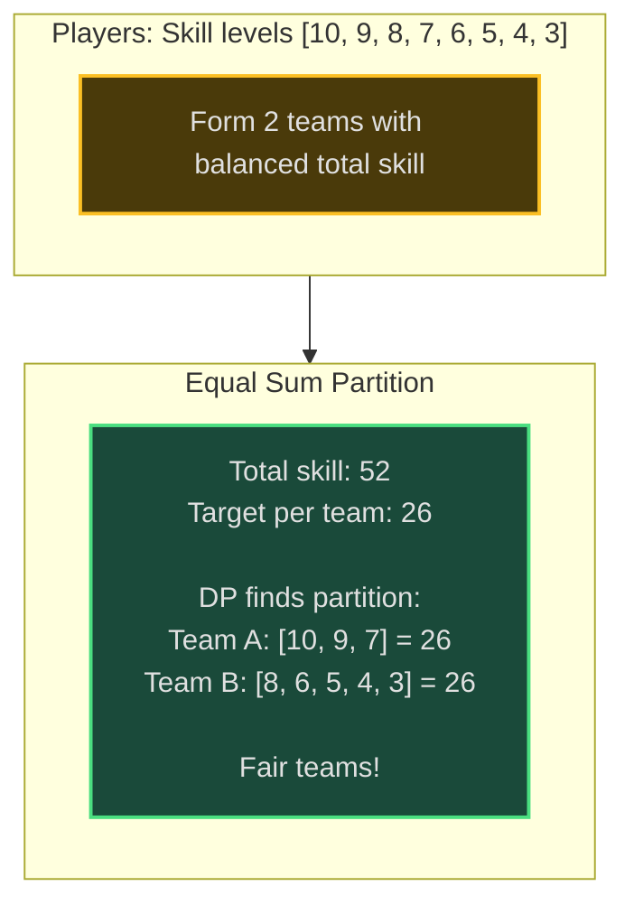
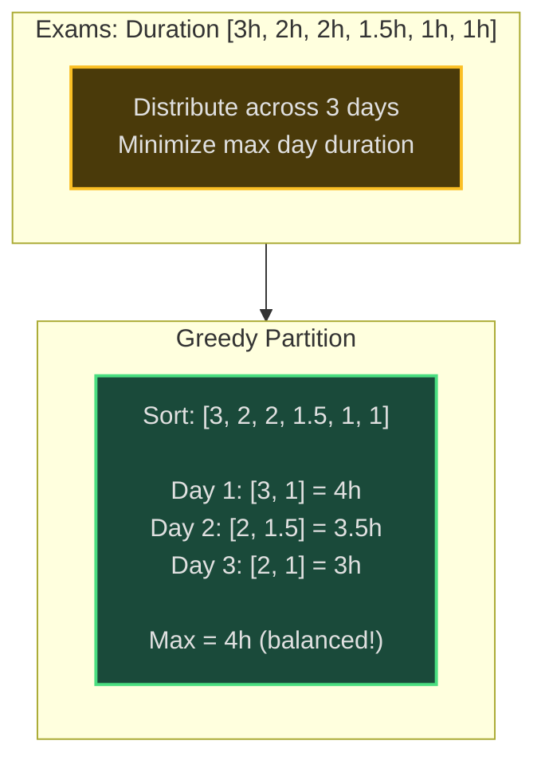

# Partition Problems - Senior Engineer Thoughts

*The 4-stage mental pipeline: Problem → Pattern → Structure → Behavior → Code*

---

## Stage 1: Problem → Pattern (Recognition)

> "Partition is my reach when I see **'split set into groups'** with **'equal sum'** or **'balanced criteria'**. The trigger: can I divide elements into K subsets satisfying some property?"

**Recognition keywords:**
- "**Partition** array into K subsets"
- "**Equal sum** partition"
- "**Split** into groups"
- "**Balanced** partitioning"
- "Subset **sum equals target**"
- "**K-partition** problem"
- "**Fair division**"
- "**Load balancing** across groups"

**Mental model:**
> "Partition = divide set into disjoint subsets satisfying constraints. Equal sum partition: can we split into 2 groups with same total? K-partition: split into K equal-sum groups. Often uses DP (subset sum), backtracking (try assignments), or greedy (sorted + balance). Like dividing inheritance fairly."

**Key insight:**
> "Partition is NP-complete in general (no polynomial solution). For specific cases: Equal sum partition = Subset Sum (DP). K equal partitions = backtracking with pruning. Balanced partition (minimize max) = greedy + sorting works well."

---

## Stage 2: Pattern → Structure (What do I need?)

**Structure inventory:**

**Equal Sum Partition (DP):**
- **DP table**: `dp[i][sum]` = can we make sum using first i elements?
- **Target sum**: total / 2 (if odd total, impossible)
- **Subset sum variant**: Find if subset with sum = target exists

**K-Partition (Backtracking):**
- **K buckets**: Track sum of each partition
- **Assignment**: Which partition does each element belong to?
- **Target sum per partition**: total / K
- **Pruning**: Skip if bucket sum exceeds target

**Balanced Partition (Greedy):**
- **Sort descending**: Assign largest elements first
- **Heap of partition sums**: Always add to smallest partition
- **Minimizes maximum partition sum**

> "Choice of approach depends on constraint: exact equal sums → DP/backtracking (NP-complete), approximate balance → greedy (polynomial, good approximation)."

---

## Stage 3: Structure → Behavior (How does it move?)

**Equal Sum Partition (DP):**
```
Target = sum(array) / 2
If sum is odd: return False

DP:
  dp[0] = True (can make sum 0 with empty set)
  for each number in array:
    for sum from target down to number:
      dp[sum] = dp[sum] OR dp[sum - number]

Return dp[target]
```

**K-Partition (Backtracking):**
```
Target per partition = sum(array) / K
buckets = [0] * K

def backtrack(index):
    if index == len(array):
        return all(bucket == target for bucket in buckets)

    for i in range(K):
        if buckets[i] + array[index] <= target:
            buckets[i] += array[index]
            if backtrack(index + 1):
                return True
            buckets[i] -= array[index]

    return False
```

**Balanced Partition (Greedy):**
```
Sort array descending
min_heap = [(0, 0), (0, 1), ..., (0, K-1)]  # (sum, partition_id)

for number in sorted_array:
    sum, partition = heappop(min_heap)
    assign number to partition
    heappush(min_heap, (sum + number, partition))

Result: minimize max partition sum
```

**Key invariant:**
> "Equal sum: dp[s] means 'can make sum s with some subset'. K-partition: at each step, buckets represent partial sums, all must equal target at end. Greedy: heap maintains min partition at top, balances load."

---

## Visual Model

### Equal Sum Partition (DP)



### K-Partition Backtracking



### Greedy Balanced Partition



---

## Stage 4: Behavior → Code (Expression)

### Verbose Form: Equal Sum Partition (DP)

```python
from typing import List

class EqualSumPartitioner:
    def __init__(self, nums: List[int]):
        self.nums = nums
        self.total = sum(nums)
        self.target = self.total // 2
        self.dp: List[bool] = []

    def _is_odd_sum(self) -> bool:
        """Check if total sum is odd."""
        return self.total % 2 != 0

    def _initialize_dp(self):
        """Initialize DP table."""
        self.dp = [False] * (self.target + 1)
        self.dp[0] = True  # Can make sum 0 with empty set

    def _update_dp_for_number(self, num: int):
        """Update DP table with current number."""
        # Traverse backward to avoid using same element twice
        for s in range(self.target, num - 1, -1):
            if self.dp[s - num]:
                self.dp[s] = True

    def can_partition(self) -> bool:
        """Check if array can be partitioned into two equal-sum subsets."""
        if self._is_odd_sum():
            return False

        self._initialize_dp()

        for num in self.nums:
            self._update_dp_for_number(num)

            # Early exit if target reached
            if self.dp[self.target]:
                return True

        return self.dp[self.target]
```

### Terse Form: Equal Sum Partition

```python
def canPartition(nums: List[int]) -> bool:
    """Equal sum partition using DP."""
    total = sum(nums)
    if total % 2:
        return False

    target = total // 2
    dp = [False] * (target + 1)
    dp[0] = True

    for num in nums:
        for s in range(target, num - 1, -1):
            dp[s] = dp[s] or dp[s - num]

    return dp[target]
```

### Verbose Form: K Equal Sum Partitions (Backtracking)

```python
class KPartitioner:
    def __init__(self, nums: List[int], k: int):
        self.nums = sorted(nums, reverse=True)  # Sort descending for pruning
        self.k = k
        self.total = sum(nums)
        self.target = self.total // k
        self.buckets = [0] * k

    def _is_partition_possible(self) -> bool:
        """Check basic feasibility."""
        if self.total % self.k != 0:
            return False
        if max(self.nums) > self.target:
            return False
        return True

    def _can_add_to_bucket(self, bucket_idx: int, num: int) -> bool:
        """Check if adding number to bucket doesn't exceed target."""
        return self.buckets[bucket_idx] + num <= self.target

    def _add_to_bucket(self, bucket_idx: int, num: int):
        """Add number to bucket."""
        self.buckets[bucket_idx] += num

    def _remove_from_bucket(self, bucket_idx: int, num: int):
        """Remove number from bucket (backtrack)."""
        self.buckets[bucket_idx] -= num

    def _is_complete_assignment(self, index: int) -> bool:
        """Check if all numbers assigned."""
        return index == len(self.nums)

    def _all_buckets_full(self) -> bool:
        """Check if all buckets reached target."""
        return all(bucket == self.target for bucket in self.buckets)

    def _backtrack(self, index: int) -> bool:
        """Try assigning numbers to buckets."""
        if self._is_complete_assignment(index):
            return self._all_buckets_full()

        num = self.nums[index]

        # Try assigning to each bucket
        for i in range(self.k):
            if self._can_add_to_bucket(i, num):
                self._add_to_bucket(i, num)

                if self._backtrack(index + 1):
                    return True

                self._remove_from_bucket(i, num)

                # Prune: if this bucket is empty, no point trying other empty buckets
                if self.buckets[i] == 0:
                    break

        return False

    def can_partition_k_subsets(self) -> bool:
        """Check if can partition into K equal-sum subsets."""
        if not self._is_partition_possible():
            return False

        return self._backtrack(0)
```

### Terse Form: K Equal Sum Partitions

```python
def canPartitionKSubsets(nums: List[int], k: int) -> bool:
    """K equal sum partitions using backtracking."""
    total = sum(nums)
    if total % k or max(nums) > total // k:
        return False

    target = total // k
    nums.sort(reverse=True)
    buckets = [0] * k

    def backtrack(index):
        if index == len(nums):
            return all(b == target for b in buckets)

        for i in range(k):
            if buckets[i] + nums[index] <= target:
                buckets[i] += nums[index]
                if backtrack(index + 1):
                    return True
                buckets[i] -= nums[index]
                if buckets[i] == 0:
                    break

        return False

    return backtrack(0)
```

### Terse Form: Balanced Partition (Greedy)

```python
import heapq

def minimizeMaxSum(nums: List[int], k: int) -> int:
    """Minimize maximum partition sum (greedy approximation)."""
    # Sort descending, assign to smallest partition
    nums.sort(reverse=True)

    # Min heap: (sum, partition_id)
    heap = [(0, i) for i in range(k)]

    for num in nums:
        current_sum, partition_id = heapq.heappop(heap)
        heapq.heappush(heap, (current_sum + num, partition_id))

    # Maximum sum among all partitions
    return max(s for s, _ in heap)
```

---

## Real World Use Cases

> "Partition problems appear in load balancing, resource allocation, scheduling—anywhere fair division or balanced distribution matters."

### 1. **Load Balancing - Distribute Jobs to Servers**

**System Architecture:**
```mermaid
sequenceDiagram
    participant Jobs as Job Queue
    participant LB as Load Balancer
    participant S1 as Server 1
    participant S2 as Server 2
    participant S3 as Server 3

    Jobs->>LB: Jobs: [10min, 8min, 7min, 5min, 3min, 2min]
    LB->>LB: Greedy partition:<br/>Sort: [10, 8, 7, 5, 3, 2]<br/>Assign to least loaded server

    LB->>S1: Job 10min (total: 10)
    LB->>S2: Job 8min (total: 8)
    LB->>S3: Job 7min (total: 7)
    LB->>S3: Job 5min (total: 12)
    LB->>S2: Job 3min (total: 11)
    LB->>S1: Job 2min (total: 12)

    Note over S1,S3: Balanced: [12, 11, 12]<br/>Max = 12 (nearly optimal)

    style LB fill:#1e3a5f,stroke:#22d3ee,stroke-width:2px
```

**Why partition?**
> "Load balancers (Nginx, HAProxy) use greedy balanced partition for distributing jobs. Sort jobs by size, assign to least loaded server (min heap). Minimizes maximum server load, balances completion time. Better than round-robin for heterogeneous job sizes."

**Real-world usage:**
- **Load balancers**: Nginx, HAProxy job distribution
- **Kubernetes**: Pod scheduling across nodes (resource balancing)
- **Hadoop/Spark**: Task assignment to workers
- **Cloud batch processing**: AWS Batch, Google Cloud Tasks

---

### 2. **Database Sharding - Partition Data Across Shards**

**System:**
- **Problem**: Distribute data across database shards, balance load
- **Partition strategy**: Equal sum (balanced data size), or hash partitioning
- **Goal**: Minimize max shard size, balance query load
- **Tools**: MongoDB, Cassandra, MySQL sharding

> "MongoDB uses partition strategies for sharding. Hash partitioning distributes data evenly. Range partitioning uses greedy balanced partition to minimize max shard size. Critical for horizontal scaling."

**Real-world usage:**
- **MongoDB**: Shard key-based partitioning
- **Cassandra**: Token ring partitioning
- **MySQL**: Horizontal partitioning (sharding)
- **Redis Cluster**: Hash slot partitioning

---

### 3. **Team Formation - Balanced Skill Distribution**

**System Architecture:**


**Why partition?**
> "Sports leagues, game matchmaking (League of Legends, Dota 2) use partition algorithms for balanced teams. Equal sum partition ensures fair skill distribution. Ranked matchmaking uses greedy partition to balance MMR (matchmaking rating) across teams."

**Real-world usage:**
- **Game matchmaking**: League of Legends, Dota 2, CS:GO
- **Sports leagues**: Team drafts, tournament seeding
- **Classroom**: Group project team formation
- **Corporate**: Task force / committee formation

---

### 4. **Inheritance Division - Fair Asset Split**

**System:**
- **Problem**: Divide estate assets among heirs fairly
- **Assets**: House ($500k), stocks ($300k), car ($50k), jewelry ($150k)
- **Heirs**: 2 children
- **Goal**: Equal value partition (if possible)

> "Estate lawyers use partition algorithms for inheritance division. Equal sum partition finds fair split. If impossible (odd total, indivisible assets), use greedy balanced partition to minimize difference. Legal software (Clio, MyCase) implements these algorithms."

**Real-world usage:**
- **Estate planning**: Asset division software
- **Divorce settlements**: Property division
- **Business partnerships**: Asset split on dissolution
- **Real estate**: Land subdivision

---

### 5. **Warehouse Management - Pallet Loading**

**System:**
- **Problem**: Load packages into K trucks, minimize max truck weight
- **Packages**: Different weights
- **Trucks**: Equal capacity
- **Goal**: Balanced load (minimize max), or equal sum if possible

> "Logistics companies (Amazon, FedEx) use balanced partition for truck loading. Greedy partition (sort packages descending, assign to least loaded truck) minimizes max truck weight. Optimizes fuel consumption, delivery time."

**Real-world usage:**
- **Amazon**: Warehouse packing, truck loading
- **FedEx/UPS**: Package distribution to delivery vans
- **Container shipping**: Balance cargo weight
- **Airlines**: Baggage and cargo distribution

---

### 6. **Exam Scheduling - Balanced Workload**

**System Architecture:**


**Why partition?**
> "Universities use balanced partition for exam scheduling. Distribute exams across days minimizing max day duration (student fatigue). Greedy partition balances workload, prevents all hard exams on one day."

**Real-world usage:**
- **Universities**: Exam scheduling (Unitime)
- **Corporate training**: Workshop session distribution
- **Conferences**: Talk scheduling across tracks
- **TV networks**: Show scheduling across nights

---

### Why This Matters for Full-Stack Engineers

> "Partition problems are my tool for fair division and balanced distribution:"

- **Backend**: Load balancing APIs, task distribution, resource allocation
- **Databases**: Sharding strategies, partition key selection
- **DevOps**: Container placement, batch job scheduling
- **Systems**: Distributed task assignment, parallel processing
- **Performance**: Balance workload across workers/threads

> "The pattern: if I need to split items into groups fairly or balanced, I choose: Equal sum (exact) → DP if feasible, Balanced (minimize max) → Greedy sorting + min heap, K equal sums → Backtracking with pruning."

---

## Self-Check Questions

1. **Can I identify equal sum partition?** Total sum must be even, find subset summing to total/2.
2. **Can I implement DP solution?** `dp[s] = can make sum s`, update backward to avoid reuse.
3. **Do I know K-partition complexity?** NP-complete, backtracking with pruning, sort descending for early termination.
4. **Can I do greedy balanced partition?** Sort descending, min heap of partition sums, assign to minimum.
5. **Can I identify it in production?** Load balancing, database sharding, team formation, truck loading.

---

## Common Partition Patterns

- **Equal sum partition (2-way)**: DP subset sum, target = total/2
- **K equal sum partitions**: Backtracking with pruning, check total % k == 0
- **Balanced partition (minimize max)**: Greedy sort + min heap
- **Subset sum equals K**: DP with target K (not necessarily total/2)
- **Multiway number partitioning**: NP-hard, use approximation algorithms
- **Fair division**: Allocate items to maximize fairness (Nash equilibrium)

**Algorithm comparison:**
```
Equal Sum (2-way):
  ✓ DP solution: O(n × sum)
  ✓ Exact if solution exists
  Use: When exact equal split needed

K Equal Sums:
  ✗ NP-complete
  ✓ Backtracking finds solution if exists
  ✓ Pruning: sort descending, skip empty buckets
  Use: When K partitions must be exactly equal

Balanced (minimize max):
  ✓ Greedy: O(n log n + n log k)
  ✗ Approximation (not always optimal)
  ✓ Fast, good results in practice
  Use: When approximate balance acceptable
```

**When partition is impossible:**
> "Equal sum: if total is odd, impossible. K equal sums: if total % k != 0 or max_element > total/k, impossible. For impossible cases, fall back to balanced partition (minimize difference)."

---

## LeetCode Practice Problems

| # | Problem | Difficulty |
|---|---------|------------|
| 131 | [Palindrome Partitioning](https://leetcode.com/problems/palindrome-partitioning/) | Medium |
| 416 | [Partition Equal Subset Sum](https://leetcode.com/problems/partition-equal-subset-sum/) | Medium |
| 698 | [Partition to K Equal Sum Subsets](https://leetcode.com/problems/partition-to-k-equal-sum-subsets/) | Medium |
| 1043 | [Partition Array for Maximum Sum](https://leetcode.com/problems/partition-array-for-maximum-sum/) | Medium |
| 1335 | [Minimum Difficulty of a Job Schedule](https://leetcode.com/problems/minimum-difficulty-of-a-job-schedule/) | Medium |
| 1994 | [The Number of Good Subsets](https://leetcode.com/problems/the-number-of-good-subsets/) | Medium |
| 2035 | [Partition Array Into Two Arrays to Minimize Sum Difference](https://leetcode.com/problems/partition-array-into-two-arrays-to-minimize-sum-difference/) | Medium |
| 132 | [Palindrome Partitioning II](https://leetcode.com/problems/palindrome-partitioning-ii/) | Hard |
| 410 | [Split Array Largest Sum](https://leetcode.com/problems/split-array-largest-sum/) | Hard |
| 1278 | [Palindrome Partitioning III](https://leetcode.com/problems/palindrome-partitioning-iii/) | Hard |
| 1745 | [Palindrome Partitioning IV](https://leetcode.com/problems/palindrome-partitioning-iv/) | Hard |
| 2003 | [Smallest Missing Genetic Value in Each Subtree](https://leetcode.com/problems/smallest-missing-genetic-value-in-each-subtree/) | Hard |
---
