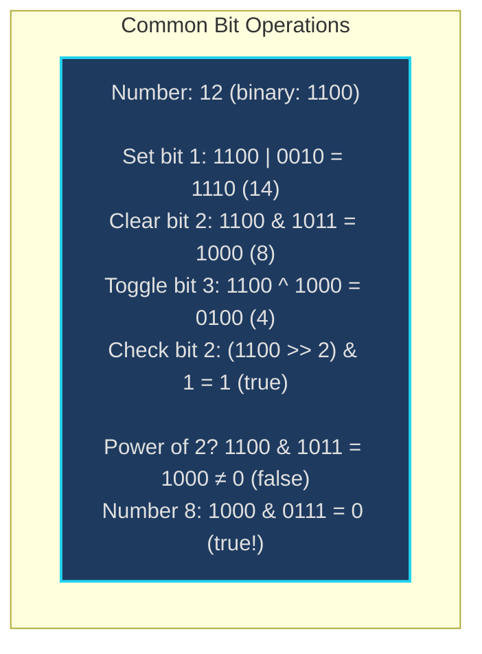
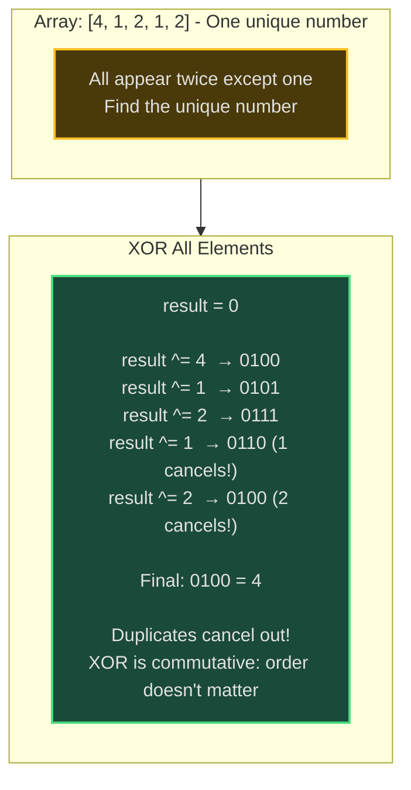
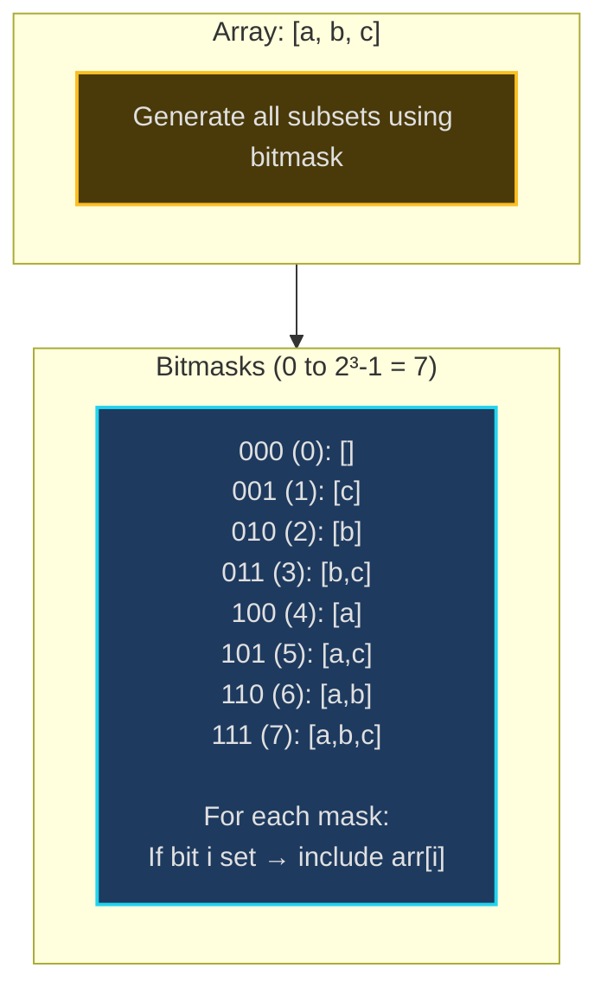
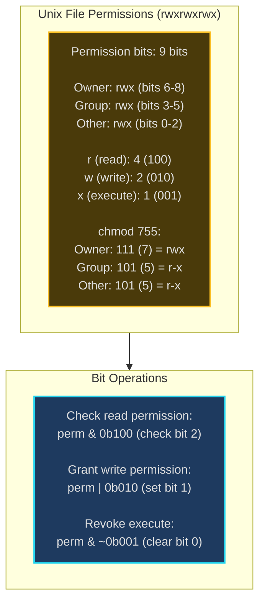
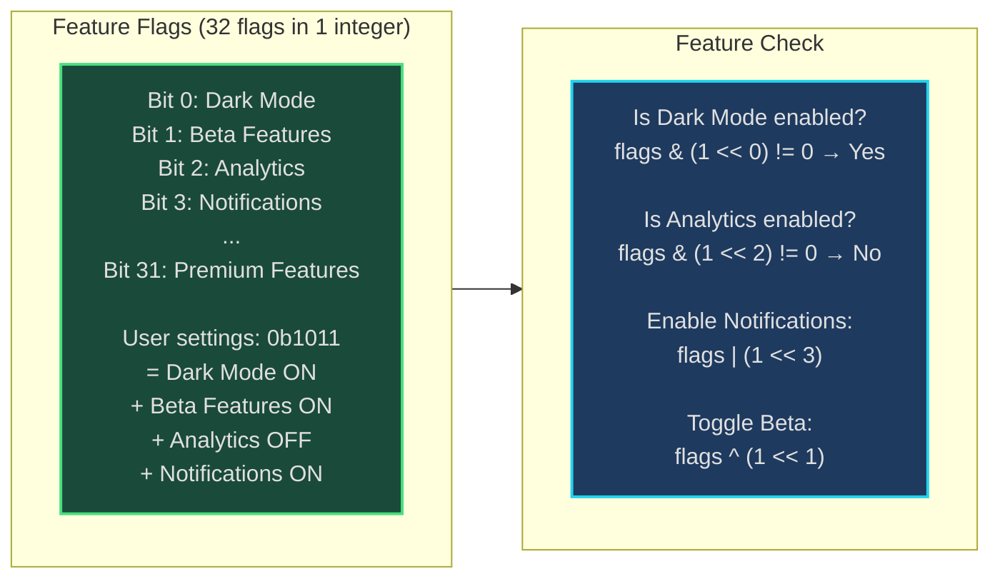
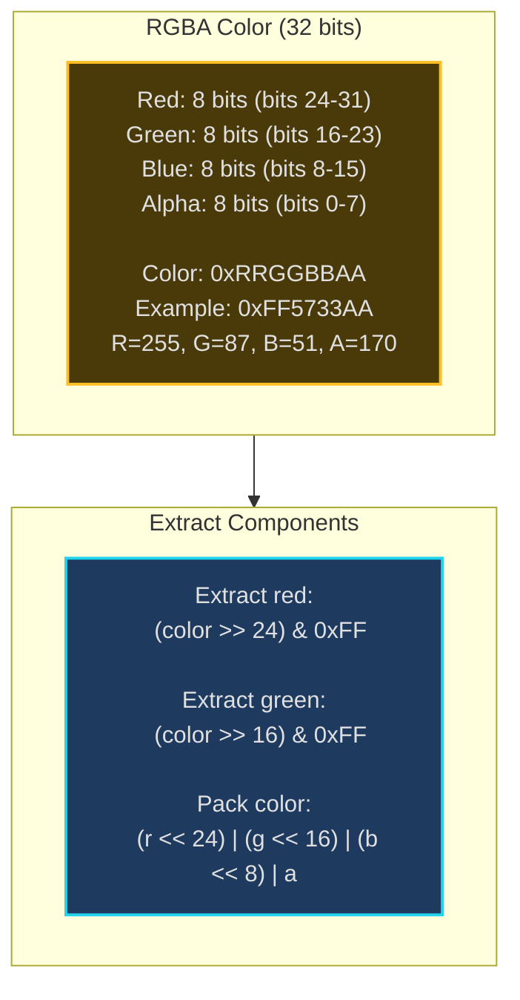
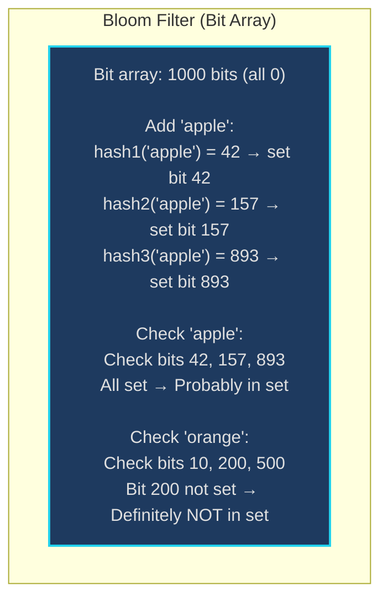

# Bit Manipulation - Senior Engineer Thoughts

*The 4-stage mental pipeline: Problem → Pattern → Structure → Behavior → Code*

---

## Stage 1: Problem → Pattern (Recognition)

> "Bit Manipulation is my reach when I see **'power of 2'**, **'single number'**, **'XOR'**, or **'flags/permissions'**. The trigger: can I solve this using bitwise operations instead of loops or extra data structures?"

**Recognition keywords:**
- "**Power of 2**" check or operations
- "**Single number**" / find unique element
- "**Missing number**" (XOR trick)
- "**Subsets**" / all combinations (bitmask)
- "**Flags**" / permissions / settings
- "Count **set bits**" / Hamming weight
- "**Swap** without temp variable"
- "**Binary representation**"

**Mental model:**
> "Every integer is a sequence of bits. Bitwise operations (AND, OR, XOR, shifts) manipulate bits directly—often O(1) instead of O(n). It's like working with switches: turn on, turn off, toggle, check status. Power of 2 = exactly one bit set. XOR = finds differences."

**Key insight:**
> "Bit manipulation trades readability for performance and space. XOR has special properties: x ^ x = 0, x ^ 0 = x (perfect for finding unique elements). Power of 2: n & (n-1) removes rightmost set bit."

---

## Stage 2: Pattern → Structure (What do I need?)

**Structure inventory:**
- **Bitwise operators**: `&` (AND), `|` (OR), `^` (XOR), `~` (NOT), `<<` (left shift), `>>` (right shift)
- **Bit masks**: Patterns like `1 << k` (set bit k), `~(1 << k)` (clear bit k)
- **Bit tricks**: `n & (n-1)` (clear rightmost bit), `n & -n` (isolate rightmost bit)
- **XOR properties**: Commutative, associative, self-inverse

> "Most bit tricks rely on a small set of patterns. Master these patterns, and bit manipulation becomes intuitive."

---

## Stage 3: Structure → Behavior (How does it move?)

**Common bit operations:**
```
Set bit k:        n | (1 << k)
Clear bit k:      n & ~(1 << k)
Toggle bit k:     n ^ (1 << k)
Check bit k:      (n >> k) & 1

Check power of 2: n > 0 && (n & (n-1)) == 0
Clear rightmost:  n & (n-1)
Isolate rightmost: n & -n

XOR all elements: result = 0
                  for each x: result ^= x
```

**Bitmask for subsets:**
```
For n elements, 2^n subsets:
for mask in range(1 << n):  # 2^n iterations
    subset = []
    for i in range(n):
        if mask & (1 << i):  # Check if bit i is set
            subset.append(arr[i])
```

**Key invariant:**
> "XOR: a ^ b ^ a = b (a cancels itself). This is why XOR finds single unique element among duplicates. Power of 2: exactly one bit set, so n & (n-1) clears it → result is 0."

---

## Visual Model

### Bit Operations Visualization



### XOR Properties - Finding Single Number



### Bitmask for Subsets



---

## Stage 4: Behavior → Code (Expression)

### Verbose Form: Bit Operations

```python
class BitManipulator:
    def __init__(self, n: int):
        self.n = n

    def set_bit(self, k: int) -> int:
        """Set bit at position k."""
        mask = 1 << k
        return self.n | mask

    def clear_bit(self, k: int) -> int:
        """Clear bit at position k."""
        mask = ~(1 << k)
        return self.n & mask

    def toggle_bit(self, k: int) -> int:
        """Toggle bit at position k."""
        mask = 1 << k
        return self.n ^ mask

    def check_bit(self, k: int) -> bool:
        """Check if bit at position k is set."""
        return ((self.n >> k) & 1) == 1

    def is_power_of_two(self) -> bool:
        """Check if number is power of 2."""
        return self.n > 0 and (self.n & (self.n - 1)) == 0

    def clear_rightmost_set_bit(self) -> int:
        """Clear the rightmost set bit."""
        return self.n & (self.n - 1)

    def isolate_rightmost_set_bit(self) -> int:
        """Get only the rightmost set bit."""
        return self.n & -self.n

    def count_set_bits(self) -> int:
        """Count number of 1s (Hamming weight)."""
        count = 0
        n = self.n
        while n:
            n &= n - 1  # Clear rightmost set bit
            count += 1
        return count
```

### Terse Form: Common Bit Operations

```python
def setBit(n: int, k: int) -> int:
    return n | (1 << k)

def clearBit(n: int, k: int) -> int:
    return n & ~(1 << k)

def toggleBit(n: int, k: int) -> int:
    return n ^ (1 << k)

def checkBit(n: int, k: int) -> bool:
    return (n >> k) & 1 == 1

def isPowerOfTwo(n: int) -> bool:
    return n > 0 and (n & (n - 1)) == 0

def countBits(n: int) -> int:
    """Brian Kernighan's algorithm."""
    count = 0
    while n:
        n &= n - 1
        count += 1
    return count
```

### Terse Form: Single Number (XOR Trick)

```python
def singleNumber(nums: List[int]) -> int:
    """All appear twice except one."""
    result = 0
    for num in nums:
        result ^= num
    return result
```

### Terse Form: Missing Number (XOR Variant)

```python
def missingNumber(nums: List[int]) -> int:
    """Find missing number in [0, n]."""
    n = len(nums)
    result = n  # Start with n

    for i in range(n):
        result ^= i ^ nums[i]  # XOR index and value

    return result  # Missing number remains
```

### Verbose Form: Subsets Using Bitmask

```python
class SubsetGenerator:
    def __init__(self, nums: List[int]):
        self.nums = nums
        self.n = len(nums)

    def _get_total_subsets(self) -> int:
        """Calculate 2^n total subsets."""
        return 1 << self.n

    def _is_bit_set(self, mask: int, bit_pos: int) -> bool:
        """Check if bit at position is set in mask."""
        return (mask & (1 << bit_pos)) != 0

    def _build_subset_from_mask(self, mask: int) -> List[int]:
        """Build subset based on bitmask."""
        subset = []
        for i in range(self.n):
            if self._is_bit_set(mask, i):
                subset.append(self.nums[i])
        return subset

    def generate_all_subsets(self) -> List[List[int]]:
        """Generate all 2^n subsets using bitmask."""
        total = self._get_total_subsets()
        result = []

        for mask in range(total):
            subset = self._build_subset_from_mask(mask)
            result.append(subset)

        return result
```

### Terse Form: Subsets Using Bitmask

```python
def subsets(nums: List[int]) -> List[List[int]]:
    """Generate all subsets using bitmask."""
    n = len(nums)
    result = []

    for mask in range(1 << n):  # 2^n iterations
        subset = [nums[i] for i in range(n) if mask & (1 << i)]
        result.append(subset)

    return result
```

### Terse Form: Reverse Bits

```python
def reverseBits(n: int) -> int:
    """Reverse bits of 32-bit integer."""
    result = 0
    for _ in range(32):
        result = (result << 1) | (n & 1)
        n >>= 1
    return result
```

### Terse Form: Hamming Distance

```python
def hammingDistance(x: int, y: int) -> int:
    """Count differing bits between x and y."""
    xor = x ^ y
    count = 0
    while xor:
        count += xor & 1
        xor >>= 1
    return count
```

---

## Real World Use Cases

> "Bit manipulation is everywhere systems need fast, space-efficient operations—from permissions to compression to hardware interfaces."

### 1. **Unix Permissions - File Access Control**

**System Architecture:**


**Why bit manipulation?**
> "Unix, Linux use bit manipulation for file permissions. Each permission is a bit (read=4, write=2, exec=1). Check permission: `perm & READ_BIT`. Grant: `perm | WRITE_BIT`. Revoke: `perm & ~EXEC_BIT`. Fast O(1) operations, minimal storage (9 bits)."

**Real-world usage:**
- **Linux kernel**: File system permissions (ext4, btrfs)
- **Database ACLs**: PostgreSQL, MySQL permissions
- **API authorization**: Role-based access control (RBAC)
- **Cloud IAM**: AWS IAM permission policies

---

### 2. **Feature Flags - Application Configuration**

**System Architecture:**


**Why bit manipulation?**
> "LaunchDarkly, Split.io, Firebase Remote Config use bit manipulation for feature flags. Store 32 features in one 32-bit integer. Check feature: O(1). Update: O(1). Database stores single integer instead of 32 booleans. Efficient for user preferences, A/B testing."

**Real-world usage:**
- **Feature flag services**: LaunchDarkly, Split.io, Unleash
- **Firebase**: Remote Config feature targeting
- **User preferences**: Reddit, Twitter settings (dark mode, notifications, etc.)
- **A/B testing**: Experiment assignments

---

### 3. **Network Protocols - TCP Flags**

**System:**
- **Problem**: TCP header has 9 control flags (SYN, ACK, FIN, RST, PSH, URG, ECE, CWR, NS)
- **Structure**: Each flag is 1 bit in TCP header
- **Operations**: Check flag: `header & SYN_FLAG`, Set flag: `header | ACK_FLAG`
- **Tool**: TCP/IP stack in OS kernel

> "TCP uses bit manipulation for control flags. SYN handshake: check `flags & SYN_FLAG`. ACK response: set `flags | ACK_FLAG`. Connection close: `flags | FIN_FLAG`. Kernel parses millions of packets/sec using bitwise ops—faster than booleans."

**Real-world usage:**
- **Linux kernel**: TCP/IP stack (netfilter, iptables)
- **Network drivers**: Packet parsing (DPDK, XDP)
- **Wireshark**: Protocol analysis and filtering
- **Firewalls**: Stateful packet inspection

---

### 4. **Graphics - Alpha Blending / Color Packing**

**System Architecture:**


**Why bit manipulation?**
> "OpenGL, DirectX, Canvas pack RGBA into 32-bit integer. Extract red: `(color >> 24) & 0xFF`. Pack color: `(r << 24) | (g << 16) | (b << 8) | a`. GPUs process millions of pixels using bit ops for color manipulation. Faster than struct with 4 bytes."

**Real-world usage:**
- **Game engines**: Unity, Unreal pixel manipulation
- **Image processing**: Photoshop, GIMP color operations
- **Web Canvas**: HTML5 Canvas pixel data
- **Video codecs**: YUV to RGB conversion

---

### 5. **Compression - Bit Packing**

**System:**
- **Problem**: Store data more efficiently using fewer bits
- **Example**: Chess board state (64 squares, 2 bits per square = 128 bits instead of 64 bytes)
- **Technique**: Pack multiple values into single integer using shifts and masks
- **Tool**: Game state serialization, network protocols, file formats

> "Chess engines pack board state using bit manipulation. Each piece type: 3 bits (8 types), color: 1 bit. 4 bits per square × 64 squares = 256 bits (32 bytes) instead of 64 bytes. Networking chess moves: send 32 bytes instead of 64."

**Real-world usage:**
- **Game engines**: State serialization (Chess, Go, Poker)
- **Protocol Buffers**: Variable-length integer encoding
- **Databases**: Bitmap indexes (PostgreSQL, Oracle)
- **Search engines**: Posting lists compression (Elasticsearch)

---

### 6. **Hash Tables - Bloom Filters**

**System Architecture:**


**Why bit manipulation?**
> "Redis, Cassandra use Bloom filters for membership testing. Bit array + multiple hash functions. Check if element exists: O(k) hash computations, all bit checks. Space-efficient: ~10 bits per element (vs hash table 100+ bits). False positives possible, no false negatives."

**Real-world usage:**
- **Redis**: Bloom filter data structure
- **Cassandra**: SSTable Bloom filters (skip disk reads)
- **Chrome**: Safe browsing (check malicious URLs)
- **Spam filters**: Email address blacklists

---

### Why This Matters for Full-Stack Engineers

> "Bit manipulation is my tool for ultra-efficient operations:"

- **Backend**: Permissions, feature flags, data packing, compression
- **Databases**: Bitmap indexes, Bloom filters, space optimization
- **Systems**: Network protocols, file systems, hardware interfaces
- **Performance**: O(1) operations, minimal memory, cache-friendly
- **Frontend**: Canvas graphics, color manipulation, state compression

> "The pattern: when I need to store/check multiple boolean flags, I use bitmask (32 flags in 1 integer). When I need to find unique element among duplicates, XOR trick. When I need power-of-2 check, `n & (n-1) == 0`."

---

## Self-Check Questions

1. **Can I explain XOR properties?** `a ^ a = 0`, `a ^ 0 = a`, commutative, associative.
2. **Can I check/set/clear bits?** `n | (1 << k)`, `n & ~(1 << k)`, `(n >> k) & 1`.
3. **Do I know power-of-2 trick?** `n > 0 && (n & (n-1)) == 0`.
4. **Can I count set bits?** Brian Kernighan: `while (n) { n &= n-1; count++; }`.
5. **Can I identify it in production?** Permissions, feature flags, compression, network protocols.

---

## Common Bit Manipulation Patterns

- **Single number**: XOR all elements (duplicates cancel)
- **Missing number**: XOR indices and values
- **Power of 2**: `n & (n-1) == 0`
- **Count set bits**: Brian Kernighan's algorithm
- **Subsets generation**: Iterate bitmasks 0 to 2^n-1
- **Swap without temp**: `a ^= b; b ^= a; a ^= b;`
- **Reverse bits**: Shift and build from right to left
- **Hamming distance**: XOR then count set bits

**Bit tricks cheat sheet:**
```
n & (n-1)      # Clear rightmost set bit
n & -n         # Isolate rightmost set bit
n | (n+1)      # Set rightmost 0 bit
n | (n-1)      # Turn off rightmost 1 bit
~n & (n+1)     # Isolate rightmost 0 bit
```

**When NOT to use bit manipulation:**
> "If code readability matters more than performance, avoid bit tricks. `perm & READ_BIT` is cryptic vs `user.canRead()`. Use bit manipulation for hot paths, performance-critical code, or when space is constrained. Document heavily!"

---

## LeetCode Practice Problems

| # | Problem | Difficulty |
|---|---------|------------|
| 136 | [Single Number](https://leetcode.com/problems/single-number/) | Medium |
| 137 | [Single Number II](https://leetcode.com/problems/single-number-ii/) | Medium |
| 190 | [Reverse Bits](https://leetcode.com/problems/reverse-bits/) | Medium |
| 191 | [Number of 1 Bits](https://leetcode.com/problems/number-of-1-bits/) | Medium |
| 201 | [Bitwise AND of Numbers Range](https://leetcode.com/problems/bitwise-and-of-numbers-range/) | Medium |
| 268 | [Missing Number](https://leetcode.com/problems/missing-number/) | Medium |
| 318 | [Maximum Product of Word Lengths](https://leetcode.com/problems/maximum-product-of-word-lengths/) | Medium |
| 338 | [Counting Bits](https://leetcode.com/problems/counting-bits/) | Medium |
| 421 | [Maximum XOR of Two Numbers in an Array](https://leetcode.com/problems/maximum-xor-of-two-numbers-in-an-array/) | Medium |
| 1318 | [Minimum Flips to Make a OR b Equal to c](https://leetcode.com/problems/minimum-flips-to-make-a-or-b-equal-to-c/) | Medium |
| 52 | [N-Queens II](https://leetcode.com/problems/n-queens-ii/) | Hard |
| 1178 | [Number of Valid Words for Each Puzzle](https://leetcode.com/problems/number-of-valid-words-for-each-puzzle/) | Hard |
| 1542 | [Find Longest Awesome Substring](https://leetcode.com/problems/find-longest-awesome-substring/) | Hard |
| 1611 | [Minimum One Bit Operations to Make Integers Zero](https://leetcode.com/problems/minimum-one-bit-operations-to-make-integers-zero/) | Hard |
| 1707 | [Maximum XOR With an Element From Array](https://leetcode.com/problems/maximum-xor-with-an-element-from-array/) | Hard |
---
