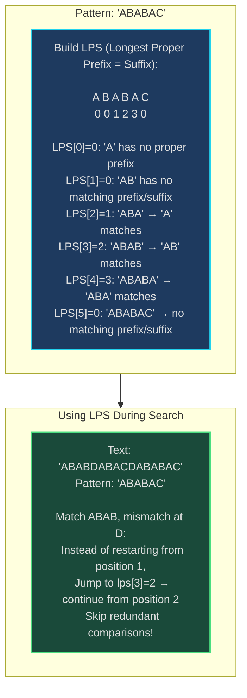
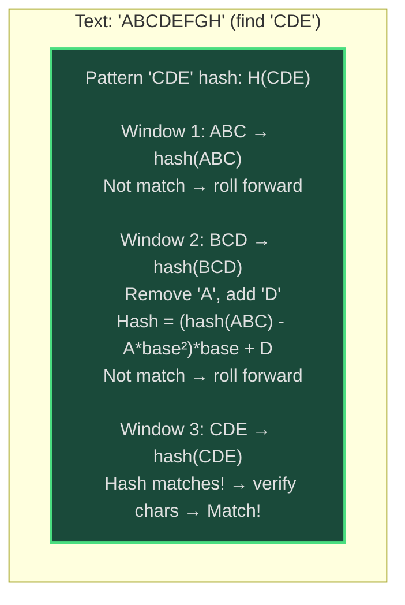
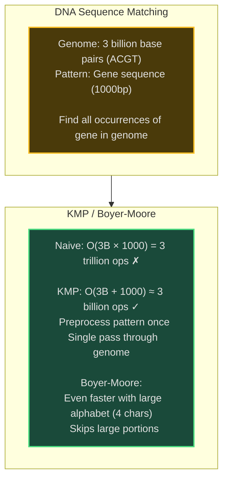
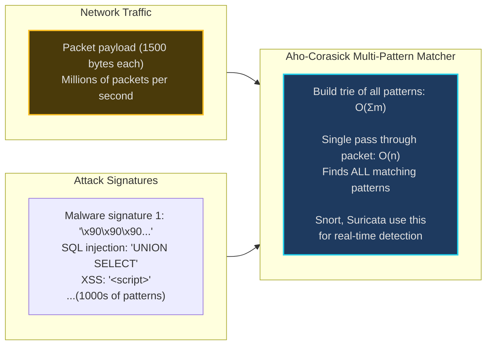

# String Matching - Senior Engineer Thoughts

*The 4-stage mental pipeline: Problem → Pattern → Structure → Behavior → Code*

---

## Stage 1: Problem → Pattern (Recognition)

> "String Matching is my reach when I see **'find pattern in text'**, **'substring search'**, or **'text processing'** at scale. The trigger: do I need to search for pattern(s) efficiently in large text?"

**Recognition keywords:**
- "**Find pattern** in text"
- "**Substring search**"
- "**Text editor** find/replace"
- "**DNA sequence** matching"
- "**Plagiarism detection**"
- "**Multiple pattern** matching"
- "Avoid **O(nm)** naive search"

**Mental model:**
> "Naive search: slide pattern across text, compare at each position O(nm). Optimized algorithms (KMP, Rabin-Karp, Boyer-Moore) do better by avoiding redundant comparisons or using hashing. KMP preprocesses pattern to skip comparisons. Rabin-Karp uses rolling hash. Boyer-Moore skips from right."

**Key insight:**
> "Pattern preprocessing is key. Spend O(m) upfront on pattern to make each search O(n) or better. KMP builds failure function, Rabin-Karp computes hash, Boyer-Moore builds skip tables. For multiple patterns, use Aho-Corasick trie."

---

## Stage 2: Pattern → Structure (What do I need?)

**Structure inventory:**

**KMP (Knuth-Morris-Pratt):**
- **Failure function (LPS array)**: Longest proper prefix which is also suffix
- **Pattern**: Preprocessed once
- **Two pointers**: Text index and pattern index

**Rabin-Karp:**
- **Rolling hash**: Hash of current window
- **Pattern hash**: Precomputed hash of pattern
- **Base and modulo**: For hash computation

**Boyer-Moore:**
- **Bad character table**: Skip distances based on mismatched character
- **Good suffix table**: Skip distances based on matched suffix
- **Right-to-left scan**: Check pattern from end

> "KMP never backtracks in text (good for streaming). Rabin-Karp handles multiple patterns well. Boyer-Moore is fastest in practice for long patterns (used in `grep`)."

---

## Stage 3: Structure → Behavior (How does it move?)

**KMP Algorithm:**
```
Preprocessing (build LPS array):
  lps[i] = length of longest proper prefix of pattern[0..i]
           that is also suffix

Search:
  i = text pointer, j = pattern pointer
  while i < len(text):
    if text[i] == pattern[j]:
      i++, j++
      if j == len(pattern): found match at i-j
    else:
      if j > 0: j = lps[j-1]  # Don't restart from 0
      else: i++
```

**Rabin-Karp (Rolling Hash):**
```
1. Compute hash of pattern
2. Compute hash of first window in text
3. Slide window:
   - If hash matches: verify character-by-character
   - Update hash: remove leftmost char, add new rightmost char
   Rolling hash: hash = (hash - text[i]*base^(m-1)) * base + text[i+m]
```

**Key invariant:**
> "KMP: j tracks how much of pattern we've matched. When mismatch, lps[j-1] tells us where to resume in pattern (skip redundant comparisons). Rabin-Karp: hash collision possible, must verify on match."

---

## Visual Model

### KMP Failure Function (LPS Array)



### Rabin-Karp Rolling Hash



---

## Stage 4: Behavior → Code (Expression)

### Verbose Form: KMP Algorithm

```python
from typing import List

class KMPMatcher:
    def __init__(self, pattern: str):
        self.pattern = pattern
        self.lps: List[int] = []
        self._build_lps()

    def _build_lps(self):
        """Build Longest Proper Prefix which is Suffix array."""
        m = len(self.pattern)
        self.lps = [0] * m
        length = 0  # Length of previous longest prefix suffix
        i = 1

        while i < m:
            if self.pattern[i] == self.pattern[length]:
                length += 1
                self.lps[i] = length
                i += 1
            else:
                if length != 0:
                    length = self.lps[length - 1]
                else:
                    self.lps[i] = 0
                    i += 1

    def _is_match(self, text: str, i: int, j: int) -> bool:
        """Check if characters match."""
        return text[i] == self.pattern[j]

    def _get_fallback_position(self, j: int) -> int:
        """Get where to resume in pattern after mismatch."""
        return self.lps[j - 1] if j > 0 else 0

    def search(self, text: str) -> List[int]:
        """Find all occurrences of pattern in text."""
        n = len(text)
        m = len(self.pattern)
        matches = []

        i = 0  # Text pointer
        j = 0  # Pattern pointer

        while i < n:
            if self._is_match(text, i, j):
                i += 1
                j += 1

                if j == m:
                    # Found complete match
                    matches.append(i - j)
                    j = self._get_fallback_position(j)
            else:
                if j > 0:
                    j = self._get_fallback_position(j)
                else:
                    i += 1

        return matches
```

### Terse Form: KMP Algorithm

```python
def kmpSearch(text: str, pattern: str) -> List[int]:
    """KMP string matching."""
    def buildLPS(pattern):
        m = len(pattern)
        lps = [0] * m
        length = 0
        i = 1

        while i < m:
            if pattern[i] == pattern[length]:
                length += 1
                lps[i] = length
                i += 1
            elif length > 0:
                length = lps[length - 1]
            else:
                lps[i] = 0
                i += 1
        return lps

    n, m = len(text), len(pattern)
    lps = buildLPS(pattern)
    matches = []
    i = j = 0

    while i < n:
        if text[i] == pattern[j]:
            i += 1
            j += 1
            if j == m:
                matches.append(i - m)
                j = lps[j - 1]
        elif j > 0:
            j = lps[j - 1]
        else:
            i += 1

    return matches
```

### Verbose Form: Rabin-Karp Algorithm

```python
class RabinKarpMatcher:
    def __init__(self, pattern: str):
        self.pattern = pattern
        self.m = len(pattern)
        self.base = 256  # Number of characters
        self.prime = 101  # Prime for modulo
        self.pattern_hash = self._compute_hash(pattern)

    def _compute_hash(self, s: str) -> int:
        """Compute hash of string."""
        h = 0
        for char in s:
            h = (h * self.base + ord(char)) % self.prime
        return h

    def _compute_initial_hash(self, text: str) -> int:
        """Compute hash of first window."""
        return self._compute_hash(text[:self.m])

    def _remove_leading_char(self, hash_val: int, char: str, h: int) -> int:
        """Remove leftmost character from hash."""
        return (hash_val - ord(char) * h) % self.prime

    def _add_trailing_char(self, hash_val: int, char: str) -> int:
        """Add rightmost character to hash."""
        return (hash_val * self.base + ord(char)) % self.prime

    def _verify_match(self, text: str, start: int) -> bool:
        """Verify actual characters match (handle hash collision)."""
        return text[start:start + self.m] == self.pattern

    def search(self, text: str) -> List[int]:
        """Find all occurrences using rolling hash."""
        n = len(text)
        matches = []

        if n < self.m:
            return matches

        # Precompute h = base^(m-1) % prime
        h = pow(self.base, self.m - 1, self.prime)

        text_hash = self._compute_initial_hash(text)

        for i in range(n - self.m + 1):
            # Check if hash matches
            if text_hash == self.pattern_hash:
                # Verify to handle collisions
                if self._verify_match(text, i):
                    matches.append(i)

            # Roll hash forward
            if i < n - self.m:
                text_hash = self._remove_leading_char(text_hash, text[i], h)
                text_hash = self._add_trailing_char(text_hash, text[i + self.m])

        return matches
```

### Terse Form: Rabin-Karp Algorithm

```python
def rabinKarp(text: str, pattern: str) -> List[int]:
    """Rabin-Karp with rolling hash."""
    n, m = len(text), len(pattern)
    base, prime = 256, 101
    matches = []

    if m > n:
        return matches

    # Compute hashes
    pattern_hash = 0
    text_hash = 0
    h = pow(base, m - 1, prime)

    for i in range(m):
        pattern_hash = (pattern_hash * base + ord(pattern[i])) % prime
        text_hash = (text_hash * base + ord(text[i])) % prime

    # Slide window
    for i in range(n - m + 1):
        if text_hash == pattern_hash:
            if text[i:i+m] == pattern:
                matches.append(i)

        if i < n - m:
            # Roll hash: remove left, add right
            text_hash = (text_hash - ord(text[i]) * h) * base + ord(text[i + m])
            text_hash %= prime

    return matches
```

### Terse Form: Naive String Matching (Baseline)

```python
def naiveSearch(text: str, pattern: str) -> List[int]:
    """Naive O(nm) string matching (for comparison)."""
    n, m = len(text), len(pattern)
    matches = []

    for i in range(n - m + 1):
        if text[i:i+m] == pattern:
            matches.append(i)

    return matches
```

---

## Real World Use Cases

> "String matching is fundamental to search engines, text editors, bioinformatics, and any text processing at scale."

### 1. **Text Editors - Find/Replace**

**System Architecture:**
```mermaid
sequenceDiagram
    participant User
    participant Editor as VS Code
    participant Matcher as String Matcher (KMP/Boyer-Moore)

    User->>Editor: Find "function"
    Editor->>Matcher: Search for "function" in 1M line file
    Matcher->>Matcher: Preprocess pattern: O(m)<br/>Search text: O(n)<br/>Total: O(n+m)
    Matcher-->>Editor: Found at lines: [15, 42, 103, ...]
    Editor-->>User: Highlight matches<br/>(~0.1s for 1M lines)

    Note over Matcher: Boyer-Moore skips characters<br/>Faster than naive O(nm)

    style Matcher fill:#1e3a5f,stroke:#22d3ee,stroke-width:2px
```

**Why optimized matching?**
> "VS Code, Sublime, IntelliJ use Boyer-Moore for find/replace. Naive O(nm) too slow for multi-MB files. Boyer-Moore preprocesses pattern, skips text portions, achieves sublinear time in practice. KMP for streaming (logfiles). Supports regex by building state machines."

**Real-world usage:**
- **Text editors**: VS Code, Sublime, Vim (/search command)
- **IDEs**: IntelliJ, Eclipse code search
- **Log viewers**: Splunk, Datadog log search
- **Terminals**: `grep`, `ag` (Silver Searcher)

---

### 2. **Plagiarism Detection - Document Similarity**

**System:**
- **Problem**: Find copied text segments across millions of documents
- **Algorithm**: Rabin-Karp for multiple patterns (all n-grams from suspect doc)
- **Optimization**: Hash all substrings, detect duplicate hashes
- **Tool**: Turnitin, Copyscape, GitHub Copilot code detection

> "Turnitin uses Rabin-Karp variant: compute hashes of all n-grams (e.g., 10-word sequences) from student paper, check against database of paper hashes. Hash collision = potential plagiarism, verify exact match. Processes millions of documents efficiently."

**Real-world usage:**
- **Academic**: Turnitin, iThenticate plagiarism detection
- **Web content**: Copyscape duplicate content finder
- **Code**: GitHub Copilot code duplication detection
- **Legal**: Contract clause similarity (LexisNexis)

---

### 3. **Bioinformatics - DNA Sequence Matching**

**System Architecture:**


**Why KMP/Boyer-Moore?**
> "BLAST (Basic Local Alignment Search Tool) uses optimized string matching for DNA/protein sequences. Genome = text (3B characters), gene = pattern (1K characters). KMP/Boyer-Moore reduce O(nm) to O(n+m). Critical for whole-genome analysis completing in hours instead of weeks."

**Real-world usage:**
- **BLAST**: NCBI gene sequence search
- **Genomics platforms**: Illumina, PacBio sequence alignment
- **Medical diagnostics**: Gene variant detection
- **Ancestry services**: 23andMe, AncestryDNA matching

---

### 4. **Web Search Engines - Inverted Index Lookup**

**System:**
- **Problem**: Find web pages containing search term
- **Structure**: Inverted index (word → list of docs)
- **String matching**: Within document for highlighting/ranking
- **Tool**: Elasticsearch, Solr, Google Search

> "Elasticsearch uses KMP for phrase queries ('exact phrase' search). After inverted index finds candidate docs, KMP verifies exact phrase match. For fuzzy search, uses edit distance + string matching to find similar terms."

**Real-world usage:**
- **Search engines**: Google, Bing page ranking
- **Elasticsearch**: Full-text search, phrase queries
- **Databases**: PostgreSQL full-text search (tsvector)
- **Code search**: GitHub code search, SourceGraph

---

### 5. **Intrusion Detection - Network Packet Analysis**

**System Architecture:**


**Why Aho-Corasick?**
> "Snort, Suricata IDS use Aho-Corasick for multi-pattern matching. Single packet checked against 10K+ attack signatures in one pass O(n + Σm). Builds trie of patterns (like Trie data structure), scans packet once. Naive would be O(n × k × m) for k patterns."

**Real-world usage:**
- **IDS/IPS**: Snort, Suricata, Zeek packet inspection
- **Antivirus**: Malware signature scanning
- **DLP**: Data loss prevention (scan for SSN, credit cards)
- **Firewalls**: Deep packet inspection

---

### 6. **Version Control - Diff Algorithms**

**System:**
- **Problem**: Find differences between two files (git diff)
- **Algorithm**: Longest Common Subsequence (LCS) using dynamic programming
- **Optimization**: Myers' diff algorithm (used by git) O(ND) where D = differences
- **String matching**: Find common lines efficiently

> "Git diff uses Myers' algorithm (optimized LCS). Treats each line as a character. String matching finds common lines between versions. KMP helps identify moved code blocks. Git blame uses similar techniques to track line history."

**Real-world usage:**
- **Git**: git diff, git blame
- **Code review**: GitHub, GitLab diff viewers
- **Merge tools**: Beyond Compare, KDiff3
- **Document editing**: Google Docs revision history

---

### Why This Matters for Full-Stack Engineers

> "String matching is my tool for efficient text search:"

- **Frontend**: Autocomplete, search-as-you-type, syntax highlighting
- **Backend**: Log parsing, text search APIs, data validation (regex)
- **Databases**: Full-text search, pattern matching in SQL (LIKE, regex)
- **Security**: Intrusion detection, malware scanning, DLP
- **Performance**: O(n+m) instead of O(nm) for large texts

> "The pattern: when I need to find pattern(s) in text repeatedly or at scale, I preprocess the pattern (KMP LPS, Rabin-Karp hash, Boyer-Moore tables) to avoid redundant work. For multiple patterns, Aho-Corasick trie."

---

## Self-Check Questions

1. **Can I explain KMP preprocessing?** Build LPS array (longest prefix = suffix) in O(m).
2. **Can I explain Rabin-Karp rolling hash?** Remove left char, add right char to hash in O(1).
3. **Do I know the complexity?** KMP O(n+m), Rabin-Karp O(nm) worst (O(n) avg), Boyer-Moore O(nm) worst (O(n/m) avg).
4. **Can I handle multiple patterns?** Aho-Corasick builds trie, finds all patterns in O(n + Σm + z) where z = matches.
5. **Can I identify it in production?** Text editors, search engines, DNA matching, IDS, plagiarism detection.

---

## Common String Matching Patterns

- **Single pattern, exact match**: KMP (streaming), Boyer-Moore (long patterns)
- **Single pattern, many searches**: Preprocess pattern once, search many texts
- **Multiple patterns**: Aho-Corasick trie, Rabin-Karp with multiple hashes
- **Approximate matching**: Edit distance, fuzzy search
- **Substring with wildcards**: Regular expressions (regex engines use NFAs/DFAs)
- **Longest repeated substring**: Suffix array/tree

**Algorithm comparison:**
```
Naive:
  ✗ O(nm) time
  ✓ Simple, no preprocessing
  Use: Very short texts only

KMP:
  ✓ O(n+m) guaranteed
  ✓ Never backtracks in text (good for streaming)
  ✓ Preprocessing O(m)
  Use: Streaming data, multiple searches of same pattern

Rabin-Karp:
  ✓ O(n+m) average
  ✓ Easily extends to multiple patterns
  ✗ O(nm) worst case (hash collisions)
  Use: Plagiarism detection, multi-pattern matching

Boyer-Moore:
  ✓ O(n/m) best case (skips characters)
  ✓ Fastest in practice for long patterns
  ✗ O(nm) worst case
  Use: Text editors (grep), DNA matching

Aho-Corasick:
  ✓ O(n + m + z) for multiple patterns
  ✓ Single pass finds all patterns
  ✗ High memory (trie)
  Use: IDS, antivirus, keyword filtering
```

---

## LeetCode Practice Problems

| # | Problem | Difficulty |
|---|---------|------------|
| 28 | [Find the Index of the First Occurrence in a String](https://leetcode.com/problems/find-the-index-of-the-first-occurrence-in-a-string/) | Medium |
| 187 | [Repeated DNA Sequences](https://leetcode.com/problems/repeated-dna-sequences/) | Medium |
| 459 | [Repeated Substring Pattern](https://leetcode.com/problems/repeated-substring-pattern/) | Medium |
| 686 | [Repeated String Match](https://leetcode.com/problems/repeated-string-match/) | Medium |
| 796 | [Rotate String](https://leetcode.com/problems/rotate-string/) | Medium |
| 1044 | [Longest Duplicate Substring](https://leetcode.com/problems/longest-duplicate-substring/) | Medium |
| 1392 | [Longest Happy Prefix](https://leetcode.com/problems/longest-happy-prefix/) | Medium |
| 2156 | [Find Substring With Given Hash Value](https://leetcode.com/problems/find-substring-with-given-hash-value/) | Medium |
| 214 | [Shortest Palindrome](https://leetcode.com/problems/shortest-palindrome/) | Hard |
| 336 | [Palindrome Pairs](https://leetcode.com/problems/palindrome-pairs/) | Hard |
| 1316 | [Distinct Echo Substrings](https://leetcode.com/problems/distinct-echo-substrings/) | Hard |
| 1554 | [Strings Differ by One Character](https://leetcode.com/problems/strings-differ-by-one-character/) | Hard |
| 2430 | [Maximum Deletions on a String](https://leetcode.com/problems/maximum-deletions-on-a-string/) | Hard |
---
