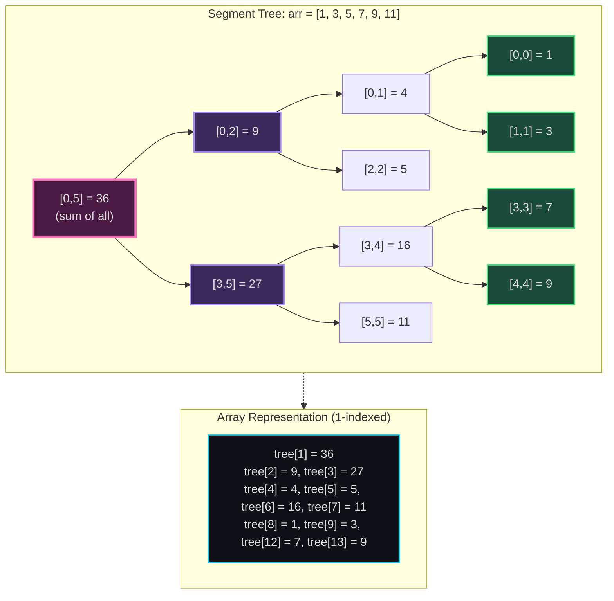
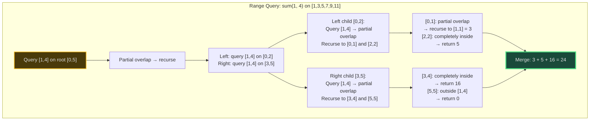
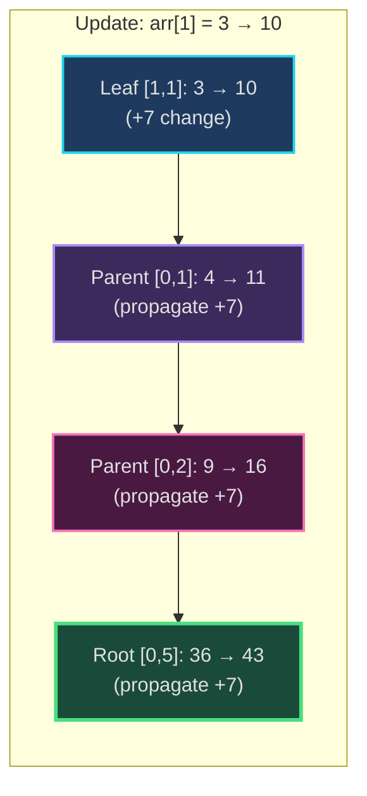
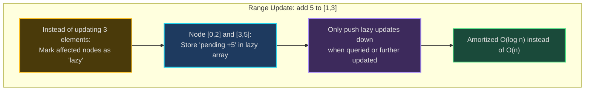
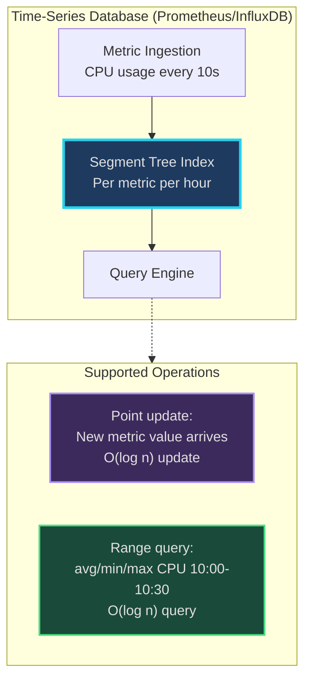
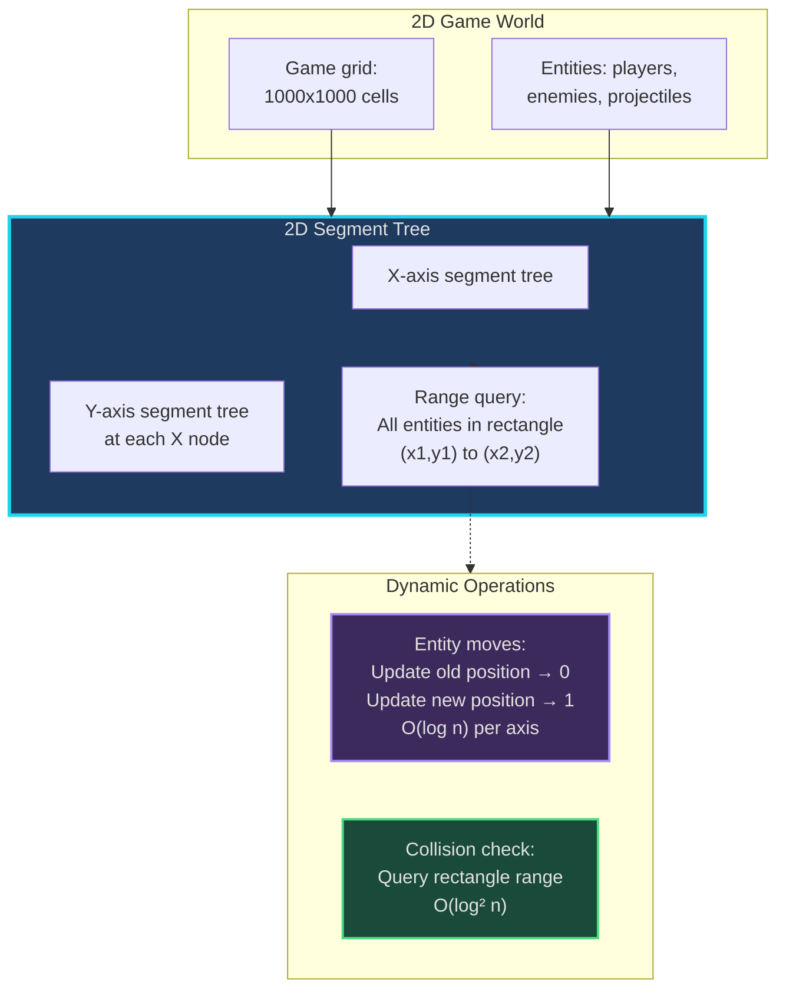
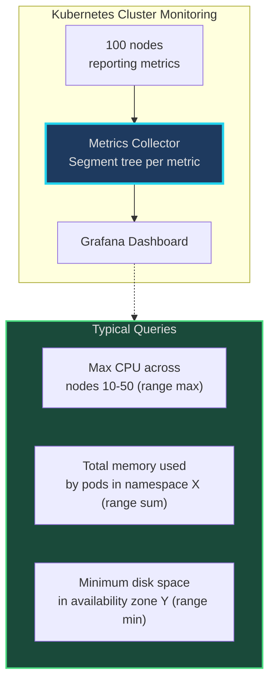

# Segment Tree - Senior Engineer Thoughts

*The 4-stage mental pipeline: Problem → Pattern → Structure → Behavior → Code*

---

## Stage 1: Problem → Pattern (Recognition)

> "When I see **'range queries with updates'**, my brain fires: Segment Tree. The key trigger: do I need BOTH fast range queries AND fast point/range updates? That's the pattern signature."

**Recognition keywords:**
- "**Range sum/min/max query**" with **updates**
- "**Modify array element**" + "**query range**"
- "**Multiple range queries and updates**"
- "**Dynamic array**" with aggregate operations
- "Point update" + "range query" (mutable arrays)
- "Range update" + "range query" (requires lazy propagation)

**Mental model comparison:**
> "I think of range query structures as a spectrum:"
> - **Prefix Sum**: Fast queries (O(1)), but NO updates (or O(n) rebuild)
> - **Fenwick Tree (BIT)**: Fast queries + updates (both O(log n)), but limited to prefix sums
> - **Segment Tree**: Fast queries + updates (both O(log n)), supports ANY associative operation (sum, min, max, GCD, etc.)

**Key insight:**
> "Segment Tree is my reach when prefix sum fails (need updates) or Fenwick tree fails (need non-prefix operations like range min/max). It's the most flexible range query structure, at the cost of more complex implementation and 4x space."

---

## Stage 2: Pattern → Structure (What do I need?)

**Structure inventory:**
- **Tree representation**: Array-based binary tree (index-based parent-child relationships)
- **Node structure**: Each node stores aggregate value for a range [L, R]
- **Array size**: `4 * n` (safe size to accommodate full binary tree)
- **Parent-child indexing**:
  - Left child of node `i`: `2*i`
  - Right child of node `i`: `2*i + 1`
  - Parent of node `i`: `i // 2`
- **Leaf nodes**: Represent individual array elements
- **Internal nodes**: Store aggregate of left child + right child

**Memory layout:**
> "I visualize it like a tournament bracket: leaves are individual elements, each internal node is the 'winner' (aggregate) of its children's competition. Root node = aggregate of entire array."

**Structure tradeoff:**
> "I'm trading space (4n instead of n) for speed. Building: O(n). Query: O(log n). Update: O(log n). Worth it when I have many queries + updates on dynamic data."

---

## Stage 3: Structure → Behavior (How does it move?)

**Building the tree (bottom-up):**
```
1. Store array elements in leaf nodes (starting at index n)
2. Build internal nodes bottom-up:
   tree[i] = merge(tree[2*i], tree[2*i + 1])
3. Root (index 1) contains aggregate of entire array
```

**Range query [L, R]:**
```
1. Start at root node spanning [0, n-1]
2. For current node spanning [nodeL, nodeR]:
   - If [nodeL, nodeR] completely inside [L, R]: return node value
   - If [nodeL, nodeR] completely outside [L, R]: return identity
   - Otherwise: split and recurse on left and right children
3. Merge results from children
```

**Point update (index i, new value):**
```
1. Update leaf node at position i
2. Propagate change upward to root:
   - Recompute parent = merge(left_child, right_child)
   - Continue until root
```

**Range update with lazy propagation:**
```
1. Instead of updating all elements in range immediately:
   - Mark nodes in range as "lazy" (pending update)
   - Store pending update value in lazy array
2. Push lazy updates down only when needed (during query or further updates)
3. This makes range updates O(log n) instead of O(n)
```

**Key invariant:**
> "At any point, tree[i] = merge(tree[2*i], tree[2*i+1]). This invariant is maintained during updates by propagating changes upward. The tree always represents the current state of the array."

---

## Visual Model

### Segment Tree Structure (Range Sum)



### Range Query Process



### Point Update Propagation



### Lazy Propagation Concept



---

## Stage 4: Behavior → Code (Expression)

### Verbose Form: Range Sum Segment Tree

```python
from typing import List, Callable

class SegmentTree:
    def __init__(self, arr: List[int], merge_fn: Callable = None):
        """Initialize segment tree from array."""
        self.n = len(arr)
        self.arr = arr
        self.tree = [0] * (4 * self.n)
        self.merge_fn = merge_fn or (lambda a, b: a + b)  # Default: sum
        self._build(0, 0, self.n - 1)

    def _build(self, node: int, start: int, end: int):
        """Build tree recursively from array."""
        if start == end:
            # Leaf node - store array element
            self.tree[node] = self.arr[start]
            return

        # Internal node - merge children
        mid = (start + end) // 2
        left_child = 2 * node + 1
        right_child = 2 * node + 2

        self._build(left_child, start, mid)
        self._build(right_child, mid + 1, end)

        # Merge results from children
        self.tree[node] = self.merge_fn(
            self.tree[left_child],
            self.tree[right_child]
        )

    def _query_helper(self, node: int, node_start: int, node_end: int,
                      query_start: int, query_end: int) -> int:
        """Recursive range query helper."""
        # No overlap - return identity element
        if query_end < node_start or query_start > node_end:
            return 0  # For sum; use float('inf') for min, -float('inf') for max

        # Complete overlap - return node value
        if query_start <= node_start and node_end <= query_end:
            return self.tree[node]

        # Partial overlap - split and recurse
        mid = (node_start + node_end) // 2
        left_child = 2 * node + 1
        right_child = 2 * node + 2

        left_result = self._query_helper(left_child, node_start, mid,
                                         query_start, query_end)
        right_result = self._query_helper(right_child, mid + 1, node_end,
                                          query_start, query_end)

        return self.merge_fn(left_result, right_result)

    def query(self, left: int, right: int) -> int:
        """Query range [left, right]."""
        return self._query_helper(0, 0, self.n - 1, left, right)

    def _update_helper(self, node: int, node_start: int, node_end: int,
                       index: int, value: int):
        """Recursive point update helper."""
        if node_start == node_end:
            # Reached leaf node - update value
            self.tree[node] = value
            self.arr[index] = value
            return

        # Recurse to appropriate child
        mid = (node_start + node_end) // 2
        left_child = 2 * node + 1
        right_child = 2 * node + 2

        if index <= mid:
            self._update_helper(left_child, node_start, mid, index, value)
        else:
            self._update_helper(right_child, mid + 1, node_end, index, value)

        # Propagate change upward
        self.tree[node] = self.merge_fn(
            self.tree[left_child],
            self.tree[right_child]
        )

    def update(self, index: int, value: int):
        """Update value at index."""
        self._update_helper(0, 0, self.n - 1, index, value)
```

### Terse Form: Range Sum Query

```python
class SegmentTree:
    def __init__(self, arr: List[int]):
        self.n = len(arr)
        self.tree = [0] * (4 * self.n)
        self._build(arr, 0, 0, self.n - 1)

    def _build(self, arr, node, start, end):
        if start == end:
            self.tree[node] = arr[start]
            return
        mid = (start + end) // 2
        self._build(arr, 2*node+1, start, mid)
        self._build(arr, 2*node+2, mid+1, end)
        self.tree[node] = self.tree[2*node+1] + self.tree[2*node+2]

    def query(self, left, right, node=0, start=0, end=None):
        if end is None:
            end = self.n - 1
        if right < start or left > end:
            return 0
        if left <= start and end <= right:
            return self.tree[node]
        mid = (start + end) // 2
        return (self.query(left, right, 2*node+1, start, mid) +
                self.query(left, right, 2*node+2, mid+1, end))

    def update(self, index, value, node=0, start=0, end=None):
        if end is None:
            end = self.n - 1
        if start == end:
            self.tree[node] = value
            return
        mid = (start + end) // 2
        if index <= mid:
            self.update(index, value, 2*node+1, start, mid)
        else:
            self.update(index, value, 2*node+2, mid+1, end)
        self.tree[node] = self.tree[2*node+1] + self.tree[2*node+2]
```

### Variant: Range Minimum Query

```python
class MinSegmentTree:
    def __init__(self, arr: List[int]):
        self.n = len(arr)
        self.tree = [float('inf')] * (4 * self.n)
        self._build(arr, 0, 0, self.n - 1)

    def _build(self, arr, node, start, end):
        if start == end:
            self.tree[node] = arr[start]
            return
        mid = (start + end) // 2
        self._build(arr, 2*node+1, start, mid)
        self._build(arr, 2*node+2, mid+1, end)
        self.tree[node] = min(self.tree[2*node+1], self.tree[2*node+2])

    def query(self, left, right, node=0, start=0, end=None):
        if end is None:
            end = self.n - 1
        if right < start or left > end:
            return float('inf')
        if left <= start and end <= right:
            return self.tree[node]
        mid = (start + end) // 2
        return min(
            self.query(left, right, 2*node+1, start, mid),
            self.query(left, right, 2*node+2, mid+1, end)
        )

    def update(self, index, value, node=0, start=0, end=None):
        if end is None:
            end = self.n - 1
        if start == end:
            self.tree[node] = value
            return
        mid = (start + end) // 2
        if index <= mid:
            self.update(index, value, 2*node+1, start, mid)
        else:
            self.update(index, value, 2*node+2, mid+1, end)
        self.tree[node] = min(self.tree[2*node+1], self.tree[2*node+2])
```

### Advanced: Lazy Propagation (Range Update + Range Query)

```python
class LazySegmentTree:
    def __init__(self, arr: List[int]):
        self.n = len(arr)
        self.tree = [0] * (4 * self.n)
        self.lazy = [0] * (4 * self.n)
        self._build(arr, 0, 0, self.n - 1)

    def _build(self, arr, node, start, end):
        if start == end:
            self.tree[node] = arr[start]
            return
        mid = (start + end) // 2
        self._build(arr, 2*node+1, start, mid)
        self._build(arr, 2*node+2, mid+1, end)
        self.tree[node] = self.tree[2*node+1] + self.tree[2*node+2]

    def _push_down(self, node, start, end):
        """Push lazy updates to children."""
        if self.lazy[node] != 0:
            # Apply pending update to current node
            self.tree[node] += (end - start + 1) * self.lazy[node]

            # Propagate to children if not leaf
            if start != end:
                self.lazy[2*node+1] += self.lazy[node]
                self.lazy[2*node+2] += self.lazy[node]

            self.lazy[node] = 0

    def range_update(self, left, right, delta, node=0, start=0, end=None):
        """Add delta to all elements in range [left, right]."""
        if end is None:
            end = self.n - 1

        self._push_down(node, start, end)

        if right < start or left > end:
            return
        if left <= start and end <= right:
            self.lazy[node] += delta
            self._push_down(node, start, end)
            return

        mid = (start + end) // 2
        self.range_update(left, right, delta, 2*node+1, start, mid)
        self.range_update(left, right, delta, 2*node+2, mid+1, end)

        self._push_down(2*node+1, start, mid)
        self._push_down(2*node+2, mid+1, end)
        self.tree[node] = self.tree[2*node+1] + self.tree[2*node+2]

    def query(self, left, right, node=0, start=0, end=None):
        if end is None:
            end = self.n - 1

        self._push_down(node, start, end)

        if right < start or left > end:
            return 0
        if left <= start and end <= right:
            return self.tree[node]

        mid = (start + end) // 2
        return (self.query(left, right, 2*node+1, start, mid) +
                self.query(left, right, 2*node+2, mid+1, end))
```

---

## Real World Use Cases

> "Segment trees aren't just competitive programming - they power time-series databases, monitoring systems, and financial analytics at scale."

### 1. Time-Series Database - Range Aggregation Queries

**System Architecture:**


**Why segment tree?**
> "Prometheus and InfluxDB handle millions of metric updates per second. When you query 'max CPU usage in last hour', they can't scan every data point. Segment trees enable O(log n) range max queries on dynamic data. Updates (new metrics) are also O(log n). Prefix sums can't handle updates. Segment trees win."

**Real-world usage:**
- **Prometheus**: Metric aggregation over time ranges
- **InfluxDB**: Time-series range queries
- **TimescaleDB**: PostgreSQL extension for time-series data
- **Grafana**: Dashboard queries (min/max/avg over time windows)

**Implementation detail:**
> "Each metric has a segment tree per time granularity (minute, hour, day). When new data arrives, update leaf node + propagate. Query requests translate to range queries on the tree. For billions of metrics, they shard segment trees across nodes."

---

### 2. Database Indexing - B-Tree Variant for Range Queries

**System Architecture:**
```mermaid
graph LR
    subgraph Database["Database Index (MySQL/PostgreSQL)"]
        Table[Table with<br/>timestamp column]
        Index[B-Tree Index<br/>(Segment tree concept)]
        RangeQuery["SELECT * FROM logs<br/>WHERE timestamp<br/>BETWEEN '10:00' AND '11:00'"]
    end

    subgraph SegTreeConcept["Segment Tree Analogy"]
        Root["Root: covers all timestamps"]
        Children["Internal nodes:<br/>partition time ranges"]
        Leaves["Leaf nodes:<br/>individual rows"]
    end

    Table --> Index
    Index --> RangeQuery
    Index -.-> SegTreeConcept

    style Index fill:#1e3a5f,stroke:#22d3ee,stroke-width:3px,color:#e0e0e0
    style Root fill:#4a1942,stroke:#f472b6,stroke-width:2px,color:#e0e0e0
    style Leaves fill:#1a4a3a,stroke:#4ade80,stroke-width:2px,color:#e0e0e0
```

**Why segment tree?**
> "B-Trees in databases are essentially segment trees. Each node stores a range of keys. Range queries traverse the tree, skipping subtrees outside the query range. Updates (inserts/deletes) propagate changes upward. It's the same pattern: hierarchical range partitioning for O(log n) queries + updates."

**Real-world usage:**
- **MySQL InnoDB**: B+Tree indexes (range queries on indexed columns)
- **PostgreSQL**: GiST indexes for spatial/range data
- **MongoDB**: Index intersection for multi-field range queries
- **Cassandra**: Time-series data with range scans

**Key insight:**
> "When I write `WHERE timestamp BETWEEN X AND Y`, the database doesn't scan every row. It uses a B-Tree (segment tree analogy) to find relevant ranges in O(log n) time. Same mental model as segment tree range queries."

---

### 3. Stock Market Analytics - Price Range Queries

**System Architecture:**
```mermaid
sequenceDiagram
    participant Trader
    participant TradingPlatform
    participant SegTree as Segment Tree<br/>(Tick Data)
    participant DB as Historical DB

    Trader->>TradingPlatform: Get min/max price in last 5 minutes
    TradingPlatform->>SegTree: Query range [now-5min, now]
    SegTree-->>TradingPlatform: Min: $150.20, Max: $152.80
    TradingPlatform-->>Trader: Display price range

    Note over SegTree: Each tick updates segment tree<br/>O(log n) update per trade

    Trader->>TradingPlatform: New trade at $151.50
    TradingPlatform->>SegTree: Update(current_time, $151.50)
    SegTree->>SegTree: Propagate update upward

    style SegTree fill:#1e3a5f,stroke:#22d3ee,stroke-width:3px
```

**Why segment tree?**
> "Bloomberg Terminal, Robinhood, Interactive Brokers show real-time price ranges (min/max in last X minutes). Stock ticks arrive constantly (updates). Traders query ranges frequently. Segment tree handles both: O(log n) updates when trades happen, O(log n) queries for price ranges. Can't use prefix sum (no updates). Segment tree is ideal."

**Real-world usage:**
- **Bloomberg Terminal**: Intraday price range analytics
- **Robinhood/E*TRADE**: Price charts with min/max overlays
- **High-frequency trading**: Microsecond range queries on tick data
- **Market surveillance**: Detecting price manipulation (abnormal ranges)

**Implementation:**
> "Maintain segment tree per security. Each trade updates the tree. Queries like 'max price in last hour' translate to range max queries. Lazy propagation used for batch updates (e.g., end-of-day adjustments)."

---

### 4. Game Development - Spatial Range Queries (Collision Detection)

**System Architecture:**


**Why segment tree?**
> "In games like RTS (Starcraft) or Battle Royale (Fortnite), you need to know 'what entities are in this area?' constantly. 2D segment tree answers: 'give me all objects in rectangle (x1,y1)-(x2,y2)' in O(log² n). Entities move (updates), so quadtree alone isn't enough. Segment tree handles dynamic queries."

**Real-world usage:**
- **Unity/Unreal Engine**: Spatial partitioning for collision detection
- **Minecraft**: Chunk loading and entity queries
- **Fortnite/Warzone**: Player proximity detection
- **MMORPGs**: Area-of-effect (AOE) spell targeting

**Alternative comparison:**
> "Quadtree is simpler for static scenes, but segment tree excels when entities constantly move (frequent updates). Hybrid approach: quadtree for broad phase, segment tree for precise range queries."

---

### 5. Resource Monitoring - CPU/Memory Usage Aggregation

**System Architecture:**


**Why segment tree?**
> "In Kubernetes, when you ask 'max CPU usage across nodes 50-100', you're doing a range max query. Nodes constantly update metrics (O(log n) updates). Dashboards poll queries every few seconds. Segment tree handles both efficiently. Better than scanning all nodes (O(n)) or maintaining materialized views (expensive to update)."

**Real-world usage:**
- **Datadog**: Infrastructure monitoring range queries
- **New Relic**: Application performance metrics
- **AWS CloudWatch**: Log aggregation and metrics
- **Kubernetes metrics-server**: Resource usage queries

**Implementation:**
> "Each metric type (CPU, memory, disk) has its own segment tree. Nodes push updates every N seconds. Dashboard queries translate to segment tree range queries. For distributed systems, trees are sharded by node ranges."

---

### Why This Matters for Full-Stack Engineers

> "Segment trees power the infrastructure I rely on daily:"

- **Frontend**: Real-time dashboards querying time-series data (Grafana, DataDog)
- **Backend**: Database range queries (B-Trees), API rate limiting with time windows
- **Databases**: Index structures for efficient range scans
- **Monitoring**: Metrics aggregation (min/max/sum over time ranges)
- **Gaming**: Collision detection, spatial queries
- **Finance**: Trading analytics, price range calculations

> "The pattern: 'I need both fast range queries AND fast updates on dynamic data' → Segment Tree. It's the generalization of prefix sum for mutable arrays, and the generalization of Fenwick tree for arbitrary associative operations."

---

## Self-Check Questions

1. **Can I build the tree?** Bottom-up from leaves, merge children using associative operation.
2. **Can I query a range?** Recursively split: complete overlap (return node), no overlap (return identity), partial (recurse + merge).
3. **Can I update efficiently?** Update leaf, propagate change upward to root, recompute affected nodes.
4. **Do I know when to use it?** Dynamic arrays + range queries on associative operations (sum, min, max, GCD).
5. **Can I implement lazy propagation?** Store pending updates in lazy array, push down only when needed.
6. **Can I compare with alternatives?** Prefix sum (no updates), Fenwick tree (prefix sums only), Segment tree (any operation + updates).

---

## Common Segment Tree Patterns

**Basic variants:**
- **Range sum query + point update**: Standard segment tree
- **Range min/max query + point update**: Use min/max as merge function
- **Range GCD query + point update**: Use gcd(a, b) as merge function
- **Count of elements in range**: Sum of 1s (binary array)

**Advanced variants:**
- **Range update + range query**: Lazy propagation required
- **2D segment tree**: Tree of trees (segment tree for X-axis, each node has Y-axis tree)
- **Persistent segment tree**: Keep historical versions of tree (immutable updates)
- **Dynamic segment tree**: Build tree nodes on-demand (sparse arrays)

**Optimization: 0-indexed vs 1-indexed:**
> "I often use 1-indexed arrays for segment trees to simplify parent-child calculations: left child = 2*i, right child = 2*i+1, parent = i//2. But 0-indexed works too with 2*i+1 and 2*i+2 for children."

**Merge function examples:**
```python
# Range sum
merge = lambda a, b: a + b

# Range min
merge = lambda a, b: min(a, b)

# Range max
merge = lambda a, b: max(a, b)

# Range GCD
from math import gcd
merge = lambda a, b: gcd(a, b)

# Range AND
merge = lambda a, b: a & b

# Range OR
merge = lambda a, b: a | b
```

---

## LeetCode Practice Problems

### Medium Problems

| # | Problem | Difficulty |
|---|---------|------------|
| 307 | [Range Sum Query - Mutable](https://leetcode.com/problems/range-sum-query-mutable/) | Medium |
| 308 | [Range Sum Query 2D - Mutable](https://leetcode.com/problems/range-sum-query-2d-mutable/) | Medium |
| 406 | [Queue Reconstruction by Height](https://leetcode.com/problems/queue-reconstruction-by-height/) | Medium |
| 673 | [Number of Longest Increasing Subsequence](https://leetcode.com/problems/number-of-longest-increasing-subsequence/) | Medium |
| 699 | [Falling Squares](https://leetcode.com/problems/falling-squares/) | Medium |
| 731 | [My Calendar II](https://leetcode.com/problems/my-calendar-ii/) | Medium |
| 1157 | [Online Majority Element In Subarray](https://leetcode.com/problems/online-majority-element-in-subarray/) | Medium |
| 1353 | [Maximum Number of Events That Can Be Attended](https://leetcode.com/problems/maximum-number-of-events-that-can-be-attended/) | Medium |
| 1395 | [Count Number of Teams](https://leetcode.com/problems/count-number-of-teams/) | Medium |
| 1409 | [Queries on a Permutation With Key](https://leetcode.com/problems/queries-on-a-permutation-with-key/) | Medium |
| 2179 | [Count Good Triplets in an Array](https://leetcode.com/problems/count-good-triplets-in-an-array/) | Medium |
| 2250 | [Count Number of Rectangles Containing Each Point](https://leetcode.com/problems/count-number-of-rectangles-containing-each-point/) | Medium |

### Hard Problems

| # | Problem | Difficulty |
|---|---------|------------|
| 315 | [Count of Smaller Numbers After Self](https://leetcode.com/problems/count-of-smaller-numbers-after-self/) | Hard |
| 327 | [Count of Range Sum](https://leetcode.com/problems/count-of-range-sum/) | Hard |
| 493 | [Reverse Pairs](https://leetcode.com/problems/reverse-pairs/) | Hard |
| 715 | [Range Module](https://leetcode.com/problems/range-module/) | Hard |
| 850 | [Rectangle Area II](https://leetcode.com/problems/rectangle-area-ii/) | Hard |
| 1505 | [Minimum Possible Integer After at Most K Adjacent Swaps On Digits](https://leetcode.com/problems/minimum-possible-integer-after-at-most-k-adjacent-swaps-on-digits/) | Hard |
| 1649 | [Create Sorted Array through Instructions](https://leetcode.com/problems/create-sorted-array-through-instructions/) | Hard |
| 1964 | [Find the Longest Valid Obstacle Course at Each Position](https://leetcode.com/problems/find-the-longest-valid-obstacle-course-at-each-position/) | Hard |
| 2213 | [Longest Substring of One Repeating Character](https://leetcode.com/problems/longest-substring-of-one-repeating-character/) | Hard |
| 2286 | [Booking Concert Tickets in Groups](https://leetcode.com/problems/booking-concert-tickets-in-groups/) | Hard |
| 2276 | [Count Integers in Intervals](https://leetcode.com/problems/count-integers-in-intervals/) | Hard |

---
