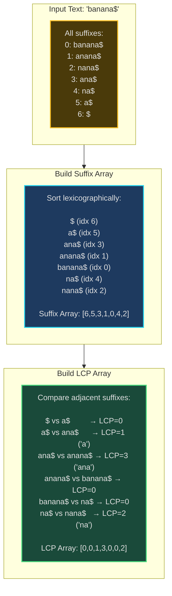
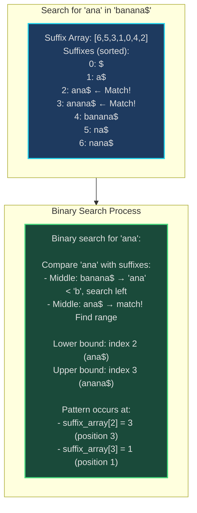
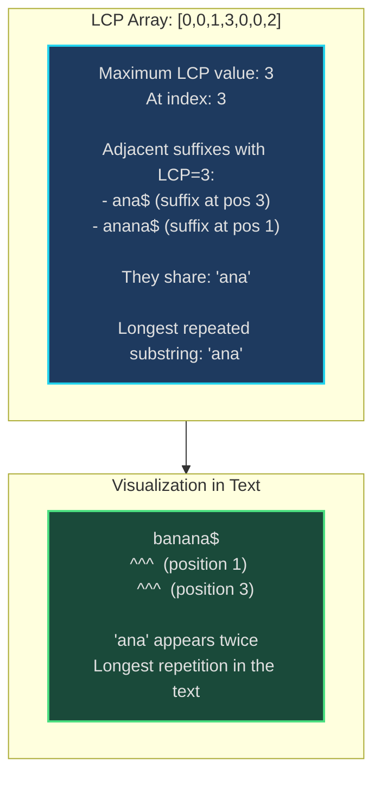
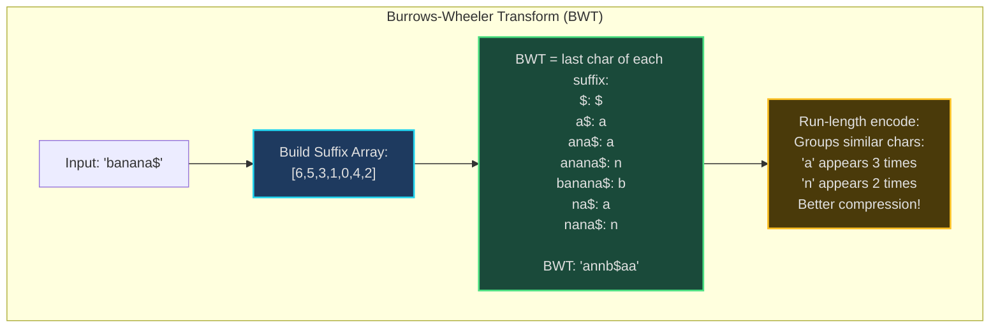
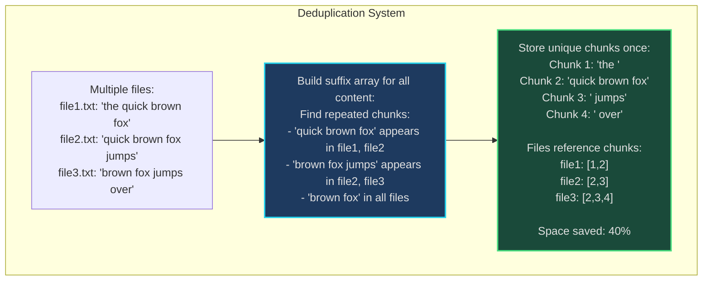
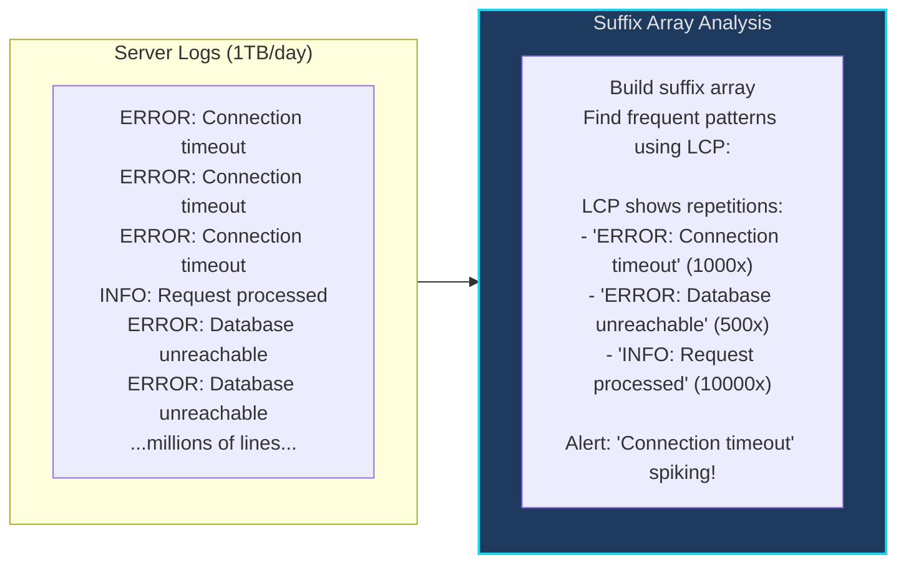

# Suffix Array - Senior Engineer Thoughts

*The 4-stage mental pipeline: Problem → Pattern → Structure → Behavior → Code*

---

## Stage 1: Problem → Pattern (Recognition)

> "Suffix Array is my reach when I see **'longest repeated substring'**, **'pattern matching at scale'**, or **'multiple string queries on same text'**. The trigger: do I need multiple pattern operations on a fixed text efficiently?"

**Recognition keywords:**
- "**Longest repeated substring**"
- "**Pattern matching** in large text"
- "**Multiple pattern searches** on same text"
- "**Burrows-Wheeler Transform** (compression)"
- "**Longest common substring** of multiple strings"
- "**Lexicographic ordering** of substrings"
- "**Genome analysis** (DNA sequence patterns)"
- "**Find all occurrences** efficiently"

**Mental model:**
> "Suffix array is a sorted array of all suffixes of a string. Instead of building a suffix tree (complex, high memory), build an array of suffix starting positions, sorted lexicographically. Pair it with LCP array (Longest Common Prefix) to answer powerful substring queries."

**Key insight:**
> "Suffix tree is powerful but complex (lots of pointers, memory overhead). Suffix array achieves same functionality with simpler structure: just an integer array. Combine with LCP array for O(n) space total. Trading structure complexity for algorithmic preprocessing."

**When to choose suffix array vs alternatives:**
```
Suffix Array:
  ✓ Multiple pattern searches on fixed text
  ✓ Longest repeated substring
  ✓ Lower memory than suffix tree
  ✓ Simpler to implement than suffix tree
  Use: Genome sequencing, text compression, plagiarism detection

Suffix Tree:
  ✓ Online construction (text arrives incrementally)
  ✓ Slightly faster queries (direct traversal)
  ✗ Complex implementation, high memory
  Use: When memory not constrained, need online updates

Trie:
  ✓ Multiple complete words, prefix matching
  ✗ Can't do substring matching efficiently
  Use: Autocomplete, dictionary lookups

KMP/Boyer-Moore:
  ✓ Single pattern search
  ✗ Preprocessing doesn't help multiple patterns
  Use: One-time pattern matching
```

---

## Stage 2: Pattern → Structure (What do I need?)

**Structure inventory:**

**Suffix Array:**
- **Array of integers**: Each element = starting index of a suffix
- **Sorted lexicographically**: All suffixes in alphabetical order
- **Size**: O(n) where n = text length
- **Construction**: O(n log² n) naive, O(n log n) Manber-Myers, O(n) SA-IS

**LCP Array (Longest Common Prefix):**
- **Companion structure**: lcp[i] = longest common prefix of suffix[i] and suffix[i-1]
- **Enables powerful queries**: Longest repeated substring, substring search
- **Construction**: O(n) using Kasai's algorithm
- **Space**: O(n)

**Total space: O(n) suffix array + O(n) LCP array = O(2n) = O(n)**

> "The suffix array IS a sorted index into the text. Each position tells you where a suffix starts. The LCP array tells you how much adjacent suffixes share. Together they encode all substring relationships."

**Example:**
```
Text: "banana$"
Suffixes:           Suffix Array:    LCP Array:
0: banana$          [6]              [0]
1: anana$           [5]              [0]
2: nana$            [3]              [0]
3: ana$             [1]              [1]
4: na$              [0]              [3]
5: a$               [4]              [0]
6: $                [2]              [2]

Sorted:
6: $                sa[0] = 6        lcp[0] = 0
5: a$               sa[1] = 5        lcp[1] = 0
3: ana$             sa[2] = 3        lcp[2] = 1  (shares 'a' with prev)
1: anana$           sa[3] = 1        lcp[3] = 3  (shares 'ana' with prev)
0: banana$          sa[4] = 0        lcp[4] = 0
4: na$              sa[5] = 4        lcp[5] = 0
2: nana$            sa[6] = 2        lcp[6] = 2  (shares 'na' with prev)
```

---

## Stage 3: Structure → Behavior (How does it move?)

**Construction Algorithm (Manber-Myers O(n log n)):**
```
Idea: Sort suffixes by first 1 char, then 2, then 4, ... (doubling)

1. Initial sort by first character
2. For k = 1, 2, 4, 8, ... until k >= n:
   - Each suffix represented by pair: (rank of first k chars, rank of next k chars)
   - Sort all suffixes by these pairs using counting/radix sort
   - Assign new ranks based on sorted order
3. After log(n) iterations, all suffixes fully sorted
```

**LCP Array Construction (Kasai's Algorithm O(n)):**
```
Key insight: LCP of suffix[i] and suffix[i+1] related to LCP of suffix[rank[i]-1]

Algorithm:
1. Compute inverse suffix array (rank of each suffix)
2. Iterate through text in original order
3. For each position, compute LCP with previous suffix in sorted order
4. Optimization: LCP decreases by at most 1 when moving to next position

h = 0
for i in 0..n-1:
  if rank[i] > 0:
    j = sa[rank[i] - 1]  # Previous suffix in sorted order
    while text[i+h] == text[j+h]:  # Extend common prefix
      h++
    lcp[rank[i]] = h
    h = max(0, h-1)  # Can decrease by at most 1
```

**Pattern Matching (Binary Search O(m log n)):**
```
To find pattern in text:
1. Binary search on suffix array for first occurrence
2. Binary search for last occurrence
3. All matches are in range [first, last]

Lower bound: Binary search for smallest suffix >= pattern
Upper bound: Binary search for largest suffix starting with pattern
```

**Longest Repeated Substring (O(n)):**
```
Scan LCP array for maximum value:
max_lcp = max(lcp[1..n])
position = suffix_array[argmax(lcp)]
repeated_substring = text[position : position + max_lcp]
```

**Key invariant:**
> "Suffix array maintains lexicographic ordering of all suffixes. LCP array encodes similarity between adjacent suffixes. High LCP = lots of repetition. Binary search works because array is sorted."

---

## Visual Model

### Suffix Array Construction - "banana$"



### Pattern Matching with Binary Search



### Longest Repeated Substring using LCP Array



---

## Stage 4: Behavior → Code (Expression)

### Verbose Form: Suffix Array with LCP

```python
from typing import List, Tuple

class SuffixArray:
    def __init__(self, text: str):
        self.text = text
        self.n = len(text)
        self.suffix_array: List[int] = []
        self.lcp_array: List[int] = []
        self.rank: List[int] = []  # Inverse suffix array
        self._build_suffix_array()
        self._build_lcp_array()

    def _build_suffix_array_naive(self):
        """Naive O(n² log n) construction (for small strings)."""
        # Create list of (suffix, starting_index) pairs
        suffixes = [(self.text[i:], i) for i in range(self.n)]
        # Sort by suffix string
        suffixes.sort()
        # Extract indices
        self.suffix_array = [idx for suffix, idx in suffixes]

    def _get_suffix_at(self, index: int) -> str:
        """Get suffix starting at given index."""
        return self.text[index:]

    def _compare_suffixes(self, i: int, j: int) -> int:
        """Compare two suffixes, return -1/0/1."""
        suffix_i = self._get_suffix_at(i)
        suffix_j = self._get_suffix_at(j)
        if suffix_i < suffix_j:
            return -1
        elif suffix_i > suffix_j:
            return 1
        return 0

    def _build_suffix_array(self):
        """Build suffix array using naive approach."""
        self._build_suffix_array_naive()
        self._build_rank_array()

    def _build_rank_array(self):
        """Build inverse suffix array (rank of each position)."""
        self.rank = [0] * self.n
        for i in range(self.n):
            self.rank[self.suffix_array[i]] = i

    def _build_lcp_array(self):
        """Build LCP array using Kasai's algorithm O(n)."""
        self.lcp_array = [0] * self.n
        h = 0  # Height of LCP

        for i in range(self.n):
            if self.rank[i] > 0:
                # Previous suffix in sorted order
                j = self.suffix_array[self.rank[i] - 1]

                # Extend common prefix
                while (i + h < self.n and
                       j + h < self.n and
                       self.text[i + h] == self.text[j + h]):
                    h += 1

                self.lcp_array[self.rank[i]] = h

                # LCP can decrease by at most 1
                h = max(0, h - 1)

    def _get_lcp(self, i: int, j: int) -> int:
        """Get LCP length between two suffixes."""
        count = 0
        while (i + count < self.n and
               j + count < self.n and
               self.text[i + count] == self.text[j + count]):
            count += 1
        return count

    def search_pattern(self, pattern: str) -> List[int]:
        """Find all occurrences of pattern using binary search O(m log n)."""
        m = len(pattern)
        positions = []

        # Binary search for first occurrence
        left, right = 0, self.n - 1
        first_occurrence = -1

        while left <= right:
            mid = (left + right) // 2
            suffix_start = self.suffix_array[mid]
            suffix = self.text[suffix_start:suffix_start + m]

            if suffix >= pattern:
                if suffix == pattern:
                    first_occurrence = mid
                right = mid - 1
            else:
                left = mid + 1

        if first_occurrence == -1:
            return []

        # Binary search for last occurrence
        left, right = 0, self.n - 1
        last_occurrence = -1

        while left <= right:
            mid = (left + right) // 2
            suffix_start = self.suffix_array[mid]
            suffix = self.text[suffix_start:suffix_start + m]

            if suffix <= pattern:
                if suffix == pattern:
                    last_occurrence = mid
                left = mid + 1
            else:
                right = mid - 1

        # Collect all positions in range
        for i in range(first_occurrence, last_occurrence + 1):
            positions.append(self.suffix_array[i])

        return sorted(positions)

    def longest_repeated_substring(self) -> Tuple[str, int]:
        """Find longest repeated substring using LCP array O(n)."""
        max_lcp = 0
        max_lcp_index = 0

        for i in range(1, self.n):
            if self.lcp_array[i] > max_lcp:
                max_lcp = self.lcp_array[i]
                max_lcp_index = i

        if max_lcp == 0:
            return "", 0

        start_pos = self.suffix_array[max_lcp_index]
        substring = self.text[start_pos:start_pos + max_lcp]
        return substring, max_lcp

    def count_distinct_substrings(self) -> int:
        """Count distinct substrings using suffix array O(n)."""
        # Total substrings = n*(n+1)/2
        # Subtract duplicates (sum of LCP values)
        total_substrings = self.n * (self.n + 1) // 2
        duplicate_substrings = sum(self.lcp_array)
        return total_substrings - duplicate_substrings

    def display(self):
        """Display suffix array and LCP array for debugging."""
        print(f"Text: {self.text}")
        print(f"\nSuffix Array | LCP | Suffix")
        print("-" * 50)
        for i in range(self.n):
            idx = self.suffix_array[i]
            suffix = self.text[idx:]
            lcp = self.lcp_array[i]
            print(f"{idx:12} | {lcp:3} | {suffix}")
```

### Terse Form: Suffix Array with LCP

```python
class SuffixArray:
    def __init__(self, text: str):
        self.text = text
        self.n = len(text)
        # Build suffix array (naive)
        self.sa = sorted(range(self.n), key=lambda i: text[i:])
        # Build rank (inverse suffix array)
        self.rank = [0] * self.n
        for i in range(self.n):
            self.rank[self.sa[i]] = i
        # Build LCP using Kasai
        self.lcp = [0] * self.n
        h = 0
        for i in range(self.n):
            if self.rank[i] > 0:
                j = self.sa[self.rank[i] - 1]
                while i + h < self.n and j + h < self.n and text[i + h] == text[j + h]:
                    h += 1
                self.lcp[self.rank[i]] = h
                h = max(0, h - 1)

    def search(self, pattern: str) -> List[int]:
        """Binary search for pattern."""
        m = len(pattern)
        # Find range of suffixes starting with pattern
        left = 0
        right = self.n
        # Lower bound
        while left < right:
            mid = (left + right) // 2
            if self.text[self.sa[mid]:self.sa[mid] + m] < pattern:
                left = mid + 1
            else:
                right = mid
        first = left

        # Upper bound
        right = self.n
        while left < right:
            mid = (left + right) // 2
            if self.text[self.sa[mid]:self.sa[mid] + m] <= pattern:
                left = mid + 1
            else:
                right = mid

        return sorted([self.sa[i] for i in range(first, left)])

    def longest_repeat(self) -> str:
        """Find longest repeated substring."""
        max_lcp = max(self.lcp)
        if max_lcp == 0:
            return ""
        idx = self.lcp.index(max_lcp)
        return self.text[self.sa[idx]:self.sa[idx] + max_lcp]

    def count_distinct(self) -> int:
        """Count distinct substrings."""
        return self.n * (self.n + 1) // 2 - sum(self.lcp)
```

### Optimized Form: Manber-Myers O(n log n) Construction

```python
def build_suffix_array_fast(text: str) -> List[int]:
    """Manber-Myers O(n log n) suffix array construction."""
    n = len(text)
    # Initial rank: character values
    rank = [ord(c) for c in text]
    tmp = [0] * n
    sa = list(range(n))

    k = 1
    while k < n:
        # Sort by (rank[i], rank[i+k]) pairs
        sa.sort(key=lambda i: (rank[i], rank[i + k] if i + k < n else -1))

        # Assign new ranks
        tmp[sa[0]] = 0
        for i in range(1, n):
            prev = sa[i - 1]
            curr = sa[i]
            # Same rank if both pairs equal
            if (rank[curr], rank[curr + k] if curr + k < n else -1) == \
               (rank[prev], rank[prev + k] if prev + k < n else -1):
                tmp[curr] = tmp[prev]
            else:
                tmp[curr] = tmp[prev] + 1

        rank = tmp[:]
        k *= 2

    return sa
```

---

## Real World Use Cases

> "Suffix arrays are the workhorse of bioinformatics, text compression, and large-scale pattern matching where you need to answer many queries on the same text."

### 1. **Genome Sequencing - DNA Pattern Matching**

**System Architecture:**
```mermaid
sequenceDiagram
    participant Researcher
    participant BLAST as BLAST/Bowtie
    participant SA as Suffix Array
    participant Genome as Reference Genome (3GB)

    Researcher->>BLAST: Search for gene sequence (1000bp)
    BLAST->>SA: Build suffix array (once): O(n)
    Note over SA: Preprocess: 3B bases<br/>SA + LCP: ~24GB memory<br/>Takes: ~5 minutes
    BLAST->>SA: Binary search for pattern: O(m log n)
    SA-->>BLAST: Found at positions: [1234567, 2345678, ...]
    Note over SA: Search 1000bp in 3B genome:<br/>~0.001s per query
    BLAST-->>Researcher: Gene found in chromosomes 3, 7, 12

    style SA fill:#1e3a5f,stroke:#22d3ee,stroke-width:2px
```

**Why suffix array?**
> "Bowtie, BWA (genome aligners) use suffix arrays / FM-index (suffix array variant) for DNA sequence alignment. Human genome = 3 billion base pairs. Many researchers search for different gene sequences. Build suffix array once (5 min), answer thousands of queries in milliseconds. Naive search would take hours per query."

**Real-world usage:**
- **Bowtie/BWA**: DNA sequence alignment tools
- **NCBI BLAST**: Gene sequence search database
- **Illumina/PacBio**: Sequencing platforms use for read mapping
- **Cancer genomics**: Find mutations by comparing tumor/normal genomes

---

### 2. **Text Compression - Burrows-Wheeler Transform**

**System Architecture:**


**Why suffix array?**
> "bzip2, the compression tool, uses Burrows-Wheeler Transform which requires suffix array. BWT groups similar characters together (makes text more compressible). Suffix array provides the sorted suffix order needed for BWT. Decompress by inverting the transform."

**Real-world usage:**
- **bzip2**: File compression utility (uses BWT)
- **Genomic data compression**: CRAM format (compressed BAM files)
- **Log file archival**: Compress repetitive log entries
- **Data warehouses**: Compress columnar data (similar values group)

---

### 3. **Plagiarism Detection - Document Similarity**

**System:**
- **Problem**: Find copied passages between student papers or web documents
- **Algorithm**: Build suffix array for each document, find longest common substrings
- **Scale**: Compare document against database of millions of papers
- **Tool**: Turnitin, Copyscape use suffix array variants

> "Turnitin builds suffix arrays for submitted papers. To detect plagiarism: find longest common substrings between paper A and paper B using their suffix arrays. LCP array quickly identifies repeated passages. Suffix array enables O(n+m) comparison instead of O(n*m) naive approach."

**Real-world usage:**
- **Turnitin**: Academic plagiarism detection
- **Copyscape**: Web content duplication checker
- **GitHub**: Code similarity detection (Copilot)
- **Legal**: Contract clause matching (find similar provisions)

---

### 4. **Data Deduplication - Storage Optimization**

**System Architecture:**


**Why suffix array?**
> "Deduplication systems (ZFS, Veeam backup) use suffix array to find repeated data blocks. LCP array reveals longest repeated sequences across files. Instead of storing duplicates, store reference to first occurrence. Critical for backup systems (many similar file versions)."

**Real-world usage:**
- **ZFS filesystem**: Deduplication feature
- **Veeam/Veritas**: Backup software deduplication
- **Docker**: Container layer deduplication
- **Git**: Object storage (though uses different technique)

---

### 5. **Code Search Engines - Finding Similar Code**

**System:**
- **Problem**: Find similar code snippets across millions of repositories
- **Algorithm**: Build suffix array for all code, find repeated patterns
- **Use case**: Detect code clones, find refactoring opportunities
- **Tool**: GitHub code search, SourceGraph

> "GitHub code search uses suffix array variants to find similar code across 200M+ repositories. Search for function signature: suffix array enables fast substring search. Find code clones: LCP array reveals repeated code blocks. Supports regex search by encoding patterns."

**Real-world usage:**
- **GitHub Search**: Code pattern matching across repos
- **SourceGraph**: Universal code search
- **SonarQube**: Code duplication detection
- **IntelliJ**: Find similar code fragments

---

### 6. **Log Analysis - Pattern Mining**

**System Architecture:**


**Why suffix array?**
> "Log analysis tools (Splunk, Datadog) use suffix array for pattern mining. In 1TB of logs, find most frequent error patterns. Build suffix array, scan LCP array for high values = repeated patterns. Identifies recurring errors without predefined patterns."

**Real-world usage:**
- **Splunk**: Log pattern detection and anomaly detection
- **Datadog**: Log clustering and pattern analysis
- **ELK Stack**: Elasticsearch pattern matching
- **Sumo Logic**: Log analytics and pattern discovery

---

### Why This Matters for Full-Stack Engineers

> "Suffix arrays are my tool for heavyweight text analysis on fixed corpora:"

- **Backend**: Document similarity APIs, code search, duplicate detection
- **Data Engineering**: Log pattern mining, data deduplication, compression
- **Bioinformatics**: Genome analysis, sequence alignment
- **Search**: Substring search with preprocessing, text analytics
- **Performance**: O(m log n) search after O(n log n) preprocessing beats O(nm) repeated searches

> "The pattern: when I have a large text that's queried many times for different patterns, I pay O(n log n) once to build suffix array, then answer each query in O(m log n). Amortized over thousands of queries, huge savings."

---

## Self-Check Questions

1. **Can I explain suffix array structure?** Array of suffix starting positions, sorted lexicographically.
2. **Can I explain LCP array?** Length of longest common prefix between adjacent suffixes in sorted order.
3. **Do I know the complexity?** Build: O(n log n) Manber-Myers or O(n) SA-IS. Search: O(m log n). LCP: O(n).
4. **Can I find longest repeated substring?** Max value in LCP array gives length, corresponding SA index gives position.
5. **Can I identify it in production?** Genome sequencing, text compression (bzip2), plagiarism detection, deduplication.

---

## Common Suffix Array Patterns

- **Pattern matching**: Binary search on suffix array O(m log n)
- **Longest repeated substring**: Max of LCP array O(n)
- **Count distinct substrings**: n*(n+1)/2 - sum(LCP) O(n)
- **Longest common substring of two strings**: Build suffix array of concatenation, use LCP
- **Burrows-Wheeler Transform**: Last character of each sorted suffix
- **K-mismatch pattern matching**: Use LCP array to skip redundant comparisons

**Construction algorithms:**
```
Naive:
  ✓ Simple to implement
  ✗ O(n² log n) time
  Use: Small strings (n < 1000)

Manber-Myers:
  ✓ O(n log n) time
  ✓ Easy to understand (prefix doubling)
  ✓ O(n) space
  Use: General purpose (n < 1M)

SA-IS (Induced Sorting):
  ✓ O(n) time guaranteed
  ✓ O(n) space
  ✗ Complex implementation
  Use: Very large texts (genome-scale)
```

**When NOT to use suffix array:**
> "If text changes frequently (online updates), suffix tree with online construction is better. If only one or few pattern searches, KMP/Boyer-Moore simpler. If patterns are complete words (not substrings), trie is better. Suffix array excels when: text is fixed, many different pattern queries needed."

---

## LeetCode Practice Problems

| # | Problem | Difficulty |
|---|---------|------------|
| 1044 | [Longest Duplicate Substring](https://leetcode.com/problems/longest-duplicate-substring/) | Medium |
| 718 | [Maximum Length of Repeated Subarray](https://leetcode.com/problems/maximum-length-of-repeated-subarray/) | Medium |
| 1062 | [Longest Repeating Substring](https://leetcode.com/problems/longest-repeating-substring/) | Medium |
| 1698 | [Number of Distinct Substrings in a String](https://leetcode.com/problems/number-of-distinct-substrings-in-a-string/) | Medium |
| 686 | [Repeated String Match](https://leetcode.com/problems/repeated-string-match/) | Medium |
| 796 | [Rotate String](https://leetcode.com/problems/rotate-string/) | Medium |
| 1316 | [Distinct Echo Substrings](https://leetcode.com/problems/distinct-echo-substrings/) | Medium |
| 2223 | [Sum of Scores of Built Strings](https://leetcode.com/problems/sum-of-scores-of-built-strings/) | Medium |
| 214 | [Shortest Palindrome](https://leetcode.com/problems/shortest-palindrome/) | Hard |
| 1923 | [Longest Common Subpath](https://leetcode.com/problems/longest-common-subpath/) | Hard |
| 1977 | [Number of Ways to Separate Numbers](https://leetcode.com/problems/number-of-ways-to-separate-numbers/) | Hard |
| 1948 | [Delete Duplicate Folders in System](https://leetcode.com/problems/delete-duplicate-folders-in-system/) | Hard |
| 1392 | [Longest Happy Prefix](https://leetcode.com/problems/longest-happy-prefix/) | Hard |
| 2430 | [Maximum Deletions on a String](https://leetcode.com/problems/maximum-deletions-on-a-string/) | Hard |
---
