# Backtracking

Backtracking typically involves iterating across levels of a decision tree. At each level, there's a series of choices to make. Going down a level resembles making a single choice, and so at that new deeper level, the choices are slightly different (they probably don't include the choices you've already made). Either way, we need to now iterate across each of those choices. 
This approach is expensive and typically results in exponential time complexity, often denoted as O(b^d), where b is the branching factor and d is the depth of the solution tree. However, with pruning, we can significantly reduce the number of branches we need to explore, thus improving the overall time complexity. 

| Problem    | Time Complexity (Without Pruning) | Time Complexity (With Pruning) |
| ---------- | --------------------------------- | ------------------------------ |
| N-Queens   | O(n!)                             | O(n^n)                         |
| Subset Sum | O(2^n)                            | O(2^(n/2))                     |

Pruning helps eliminate large portions of the search space that do not lead to valid solutions, making the algorithm more efficient.

## Iterate Combinations via Tracing Tree

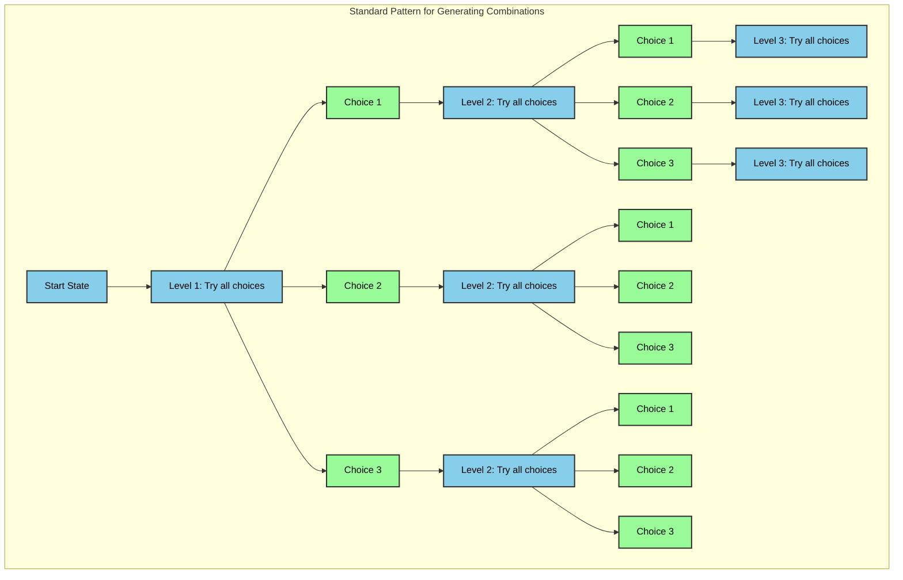

The standard pattern for generating combinations has these key components:

1. **Level Structure**:
   - Each level represents a position in the combination
   - Number of levels = length of combination
   - Each level tries all possible choices

2. **Choice Structure**:
   - At each level, try every possible choice
   - Number of choices = size of choice set
   - Each choice leads to next level

3. **Recursive Pattern**:
```python
def generate_combinations(level, current_state):
    if level == max_level:
        # Process complete combination
        return
        
    for choice in possible_choices:
        # Try this choice
        current_state[level] = choice
        # Move to next level
        generate_combinations(level + 1, current_state)
        # Backtrack (implicitly by continuing loop)
```

4. **Key Characteristics**:
   - Each level is independent
   - All choices at each level are tried
   - State is passed down the tree
   - Backtracking happens by continuing the loop

### This pattern appears in many problems:
- N-Queens: Each level is a row, choices are columns
- Permutations: Each level is a position, choices are remaining numbers
- Subsets: Each level is whether to include an element
- Sudoku: Each level is a cell, choices are numbers 1-9


### What's different between problems? 🎯

The main difference between problems is:
1. **Choices**: What constitutes a "choice" at each level
2. **Pruning**: What constraints are applied to prune invalid branches
3. **Valid Criteria**: What constitutes a valid complete combination

----

## Backtracking Fundamentals

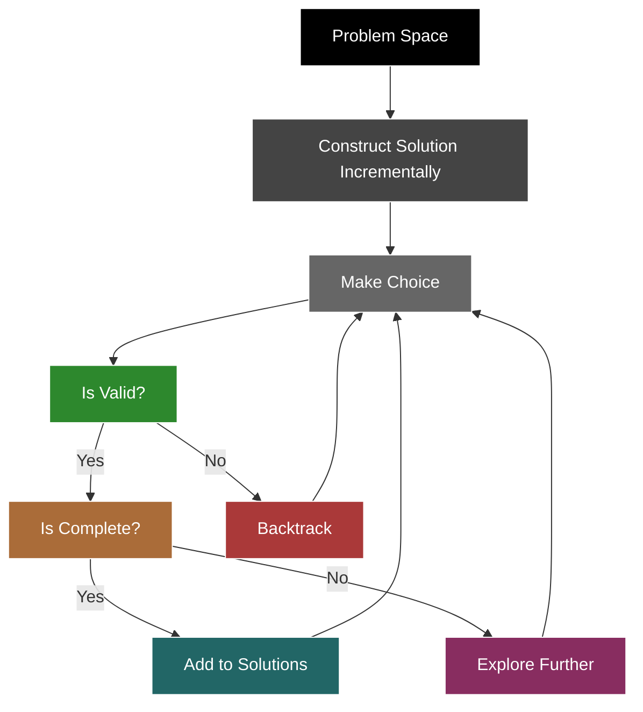

### Data Flow & Transformation
Backtracking is an algorithmic technique that incrementally builds candidates for solutions and abandons a candidate ("backtracks") as soon as it determines the candidate cannot lead to a valid solution.

### Key Terminology
1. **State Space Tree**: A tree representing all possible states of the problem.
2. **Bounding Function**: Rules that determine when to prune branches.
3. **Slate**: A working data structure that holds the current partial solution.
4. **Constraint Satisfaction**: The process of finding solutions that satisfy problem constraints.
5. **Recurrence Relation**: Mathematical expression of how the solution builds on sub-solutions.

### Common Backtracking Patterns

```mermaid
flowchart TD
    A[Permutations 🔄] --> B1[Array Permutations]
    A --> B2[String Permutations]
    A --> B3[Letter Case Permutations]
    
    style A fill:#2D882D,color:#FFF,stroke:#FFF
    style B1 fill:#2D882D,color:#FFF,stroke:#FFF,opacity:0.8
    style B2 fill:#2D882D,color:#FFF,stroke:#FFF,opacity:0.7
    style B3 fill:#2D882D,color:#FFF,stroke:#FFF,opacity:0.6
```

```mermaid
flowchart TD
    A[Subsets 📦] --> B1[All Subsets]
    A --> B2[Subsets of Size K]
    
    style A fill:#226666,color:#FFF,stroke:#FFF
    style B1 fill:#226666,color:#FFF,stroke:#FFF,opacity:0.8
    style B2 fill:#226666,color:#FFF,stroke:#FFF,opacity:0.7
```

```mermaid
flowchart TD
    A[Combination Sum ➕] --> B1[Combination Sum]
    A --> B2[Partition Problems]
    
    style A fill:#AA6C39,color:#FFF,stroke:#FFF
    style B1 fill:#AA6C39,color:#FFF,stroke:#FFF,opacity:0.8
    style B2 fill:#AA6C39,color:#FFF,stroke:#FFF,opacity:0.7
```

```mermaid
flowchart TD
    A[Constraint Satisfaction ✅] --> B1[N-Queens]
    A --> B2[Sudoku]
    A --> B3[Graph Coloring]
    A --> B4[Hamiltonian Cycle]
    A --> B5[Well-Formed Brackets]
    
    style A fill:#882D60,color:#FFF,stroke:#FFF
    style B1 fill:#882D60,color:#FFF,stroke:#FFF,opacity:0.8
    style B2 fill:#882D60,color:#FFF,stroke:#FFF,opacity:0.7
    style B3 fill:#882D60,color:#FFF,stroke:#FFF,opacity:0.6
    style B4 fill:#882D60,color:#FFF,stroke:#FFF,opacity:0.5
    style B5 fill:#882D60,color:#FFF,stroke:#FFF,opacity:0.4
```

Each pattern category represents a different type of backtracking problem:

1. **Permutations Pattern** 🔄
   - Focuses on arranging elements in different orders
   - Each element must be used exactly once
   - Time complexity typically O(n!)

2. **Subsets Pattern** 📦
   - Deals with selecting elements from a set
   - Each element can be included or excluded
   - Time complexity typically O(2^n)

3. **Combination Sum Pattern** ➕
   - Involves finding combinations that sum to a target
   - Elements can be reused (with constraints)
   - Time complexity varies based on constraints

4. **Constraint Satisfaction Pattern** ✅
   - Focuses on finding valid solutions under specific rules
   - Often involves grid-based or graph problems
   - Time complexity varies significantly by problem


## 🔄 Permutations | Array Permutations (LeetCode #46)


Let's examine one common backtracking problem in detail: Array Permutations (LeetCode #46) to establish a concrete mental model.

```mermaid
graph TD
    A["Root (Empty)"] --> B1["Slate: [1]"]
    A --> B2["Slate: [2]"]
    A --> B3["Slate: [3]"]
    
    B1 --> C1["Slate: [1,2]"]
    B1 --> C2["Slate: [1,3]"]
    
    B2 --> C3["Slate: [2,1]"]
    B2 --> C4["Slate: [2,3]"]
    
    B3 --> C5["Slate: [3,1]"]
    B3 --> C6["Slate: [3,2]"]
    
    C1 --> D1["Slate: [1,2,3] ✓"]
    C2 --> D2["Slate: [1,3,2] ✓"]
    C3 --> D3["Slate: [2,1,3] ✓"]
    C4 --> D4["Slate: [2,3,1] ✓"]
    C5 --> D5["Slate: [3,1,2] ✓"]
    C6 --> D6["Slate: [3,2,1] ✓"]
    
    style A fill:#000,color:#FFF,stroke:#FFF
    style B1 fill:#2D882D,color:#FFF,stroke:#FFF
    style B2 fill:#2D882D,color:#FFF,stroke:#FFF
    style B3 fill:#2D882D,color:#FFF,stroke:#FFF
    style C1 fill:#226666,color:#FFF,stroke:#FFF
    style C2 fill:#226666,color:#FFF,stroke:#FFF
    style C3 fill:#226666,color:#FFF,stroke:#FFF
    style C4 fill:#226666,color:#FFF,stroke:#FFF
    style C5 fill:#226666,color:#FFF,stroke:#FFF
    style C6 fill:#226666,color:#FFF,stroke:#FFF
    style D1 fill:#AA6C39,color:#FFF,stroke:#FFF
    style D2 fill:#AA6C39,color:#FFF,stroke:#FFF
    style D3 fill:#AA6C39,color:#FFF,stroke:#FFF
    style D4 fill:#AA6C39,color:#FFF,stroke:#FFF
    style D5 fill:#AA6C39,color:#FFF,stroke:#FFF
    style D6 fill:#AA6C39,color:#FFF,stroke:#FFF
```

**Recurrence Relation:**
$$T(n) = T(n-1) + T(n-1)$$
$$T(0) = 1$$

**Why?**
- For each element, we have two independent choices:
  1. Include the element: T(n-1) subproblems
  2. Exclude the element: T(n-1) subproblems
- We add these because the choices are independent
- T(0) = 1 because there's one way to make a subset of size 0 (empty set)

```python
class Solution:
    def permute(self, nums: list[int]) -> list[list[int]]:
        """
        Generate all possible permutations of an array.
        
        Args:
            nums: A list of distinct integers
            
        Returns:
            A list of all possible permutations
        
        Time Complexity: O(n!), where n is the length of nums
        Space Complexity: O(n) for recursion stack, O(n!) for output
        """
        result = []
        
        def backtrack(slate: list[int], remaining: list[int]):
            # Base case: matches leaf nodes (D1-D6)
            # T(0) = 1: One way to arrange nothing
            if not remaining:
                result.append(slate[:])
                return
            
            # Recursive case: matches internal nodes (B1-B3, C1-C6)
            # T(n) = T(n-1) + T(n-1): n choices, each leading to T(n-1) subproblems
            for i in range(len(remaining)):
                # Choose: matches tree edges (A→B1, B1→C1, etc.)
                # Add current element to slate
                slate.append(remaining[i])
                
                # Explore: matches next level in tree
                # T(n-1): Solve subproblem with remaining elements
                backtrack(slate, remaining[:i] + remaining[i+1:])
                
                # Unchoose: matches backtracking in tree
                # Remove current element to try other choices
                slate.pop()
        
        # Start: matches root node (A)
        # Initialize with empty slate and all numbers
        backtrack([], nums)
        return result

# Example usage
solution = Solution()
print(solution.permute([1, 2, 3]))
# Output: [[1,2,3], [1,3,2], [2,1,3], [2,3,1], [3,1,2], [3,2,1]]
```

Key relationships between tree, recurrence, and code:
1. **Tree Structure** 🌳
   - Root (A): Empty slate
   - First Level (B1-B3): First number choices
   - Second Level (C1-C6): Second number choices
   - Leaf Nodes (D1-D6): Complete permutations

2. **Recurrence Relation** 📊
   - T(n) = T(n-1) + T(n-1)
   - T(0) = 1

3. **Code Implementation** 💻
   - Base case matches T(0) = 1
   - Loop matches T(n-1) + T(n-1)
   - slate.pop() implements backtracking

4. **Visual Mapping** 🔄
   - Tree nodes → Recursive calls
   - Branching → Addition in recurrence
   - Leaf nodes → Base case results
   - Backtracking → slate.pop()

This three-way relationship helps us:
- Understand the problem structure
- Verify our implementation
- Analyze time complexity (O(n!))
- Debug issues systematically

## 🔄 Permutations | Letter Case Permutations (LeetCode #784)

Let's now look at the state space tree for another common backtracking problem: Letter Case Permutations (LeetCode #784).

```mermaid
graph TD
    A["Root (Empty)"] --> B1["Slate: a"]
    A --> B2["Slate: A"]
    
    B1 --> C1["Slate: a1"]
    B2 --> C2["Slate: A1"]
    
    C1 --> D1["Slate: a1b ✓"]
    C1 --> D2["Slate: a1B ✓"]
    C2 --> D3["Slate: A1b ✓"]
    C2 --> D4["Slate: A1B ✓"]
    
    style A fill:#000,color:#FFF,stroke:#FFF
    style B1 fill:#2D882D,color:#FFF,stroke:#FFF
    style B2 fill:#2D882D,color:#FFF,stroke:#FFF
    style C1 fill:#226666,color:#FFF,stroke:#FFF
    style C2 fill:#226666,color:#FFF,stroke:#FFF
    style D1 fill:#AA6C39,color:#FFF,stroke:#FFF
    style D2 fill:#AA6C39,color:#FFF,stroke:#FFF
    style D3 fill:#AA6C39,color:#FFF,stroke:#FFF
    style D4 fill:#AA6C39,color:#FFF,stroke:#FFF
```

**Recurrence Relation:**
$$T(n) = \begin{cases} 
2 \cdot T(n-1) & \text{if current char is letter} \\
T(n-1) & \text{if current char is digit}
\end{cases}$$
$$T(0) = 1$$

```python
def letterCasePermutation(s: str) -> list[str]:
    result = []
    
    def backtrack(i: int, slate: list[str]):
        # Base case: we've processed all characters
        if i == len(s):
            result.append(''.join(slate))
            return
            
        # Current character
        char = s[i]
        
        # If it's a digit, just add it and move on
        if char.isdigit():
            slate.append(char)
            backtrack(i + 1, slate)
            slate.pop()
        else:
            # Try lowercase
            slate.append(char.lower())
            backtrack(i + 1, slate)
            slate.pop()
            
            # Try uppercase
            slate.append(char.upper())
            backtrack(i + 1, slate)
            slate.pop()
    
    backtrack(0, [])
    return result
```

Key relationships between tree, recurrence, and code:
1. **Tree Structure** 🌳
   - Root (black): Empty slate
   - First Level (green): Letter case choices
   - Second Level (turquoise): Digit addition
   - Leaf Nodes (brown): Complete strings

2. **Recurrence Relation** 📊
   - For letters: T(n) = 2·T(n-1) (two branches)
   - For digits: T(n) = T(n-1) (one branch)
   - T(0) = 1 (base case)

3. **Code Implementation** 💻
   - Base case matches T(0) = 1
   - Letter branching matches 2·T(n-1)
   - Digit handling matches T(n-1)
   - slate.pop() implements backtracking

4. **Visual Mapping** 🔄
   - Tree nodes → Recursive calls
   - Branching → Multiplication in recurrence because it's a dependent choice (we can't choose the same letter casing twice at the same level)
   - Leaf nodes → Base case results
   - Backtracking → slate.pop()

This three-way relationship helps us:
- Understand the problem structure
- Verify our implementation
- Analyze time complexity
- Debug issues systematically

## 🔄 Permutations | Generating all well-formed brackets (LeetCode #22)

```mermaid
graph TD
    A["Root (Empty)"] --> B["("]
    
    B --> C["(("]
    B --> D["()"]
    
    C --> E["(()"]
    
    D --> F["()("]
    
    E --> G["(()) ✓"]
    
    F --> H["()() ✓"]
    
    style A fill:#000,color:#FFF,stroke:#FFF
    style B fill:#2D882D,color:#FFF,stroke:#FFF
    style C fill:#226666,color:#FFF,stroke:#FFF
    style D fill:#226666,color:#FFF,stroke:#FFF
    style E fill:#882D60,color:#FFF,stroke:#FFF
    style F fill:#882D60,color:#FFF,stroke:#FFF
    style G fill:#AA6C39,color:#FFF,stroke:#FFF
    style H fill:#AA6C39,color:#FFF,stroke:#FFF
```

**Recurrence Relation:**
$$T(n, open, close) = \begin{cases} 
T(n, open+1, close) + T(n, open, close+1) & \text{if } open < n \text{ and } close < open \\
T(n, open, close+1) & \text{if } open = n \text{ and } close < open \\
T(n, open+1, close) & \text{if } open < n \text{ and } close = open \\
1 & \text{if } open = n \text{ and } close = n \\
0 & \text{otherwise (invalid state)}
\end{cases}$$

```python
def generateParenthesis(n: int) -> list[str]:
    result = []
    
    def backtrack(slate: list[str], open_count: int, close_count: int):
        # Base case: matches leaf nodes (G, H)
        if open_count == n and close_count == n:
            result.append(''.join(slate))
            return
            
        # Branch 1: add opening bracket (B, C, E, G)
        if open_count < n:
            slate.append('(')
            backtrack(slate, open_count + 1, close_count)
            slate.pop()
            
        # Branch 2: add closing bracket (D, F, H)
        if close_count < open_count:
            slate.append(')')
            backtrack(slate, open_count, close_count + 1)
            slate.pop()
    
    backtrack([], 0, 0)
    return result
```

### Time Complexity Analysis

For Well-Formed Brackets, we can derive the time complexity using the recurrence relation:

$$T(n, open, close) = \begin{cases} 
T(n, open+1, close) + T(n, open, close+1) & \text{if } open < n \text{ and } close < open \\
T(n, open, close+1) & \text{if } open = n \text{ and } close < open \\
T(n, open+1, close) & \text{if } open < n \text{ and } close = open \\
1 & \text{if } open = n \text{ and } close = n \\
0 & \text{otherwise (invalid state)}
\end{cases}$$

This recurrence relation leads to the Catalan numbers, which give us the exact count of valid parentheses strings. The time complexity is:

$$\text{Time Complexity} = O\left(\frac{4^n}{n\sqrt{n}}\right)$$

**Why?**
1. Each valid string has n opening and n closing brackets
2. The number of valid strings is the nth Catalan number
3. Catalan numbers grow asymptotically as $\frac{4^n}{n\sqrt{n}}$

**Space Complexity:**
$$\text{Space Complexity} = O(n) \text{ for recursion stack}$$

**Additional Notes:**
- The $\frac{1}{n\sqrt{n}}$ factor comes from the asymptotic approximation of Catalan numbers
- This is much better than the naive $O(2^{2n})$ bound we might expect
- The actual number of valid strings is $\frac{1}{n+1}\binom{2n}{n}$

## 📦 Subsets | All Subsets (LeetCode #78)

```mermaid
graph TD
    A["Root (Empty)"] --> B1["Include 1"]
    A --> B2["Exclude 1"]
    
    B1 --> C1["Include 2"]
    B1 --> C2["Exclude 2"]
    
    B2 --> C3["Include 2"]
    B2 --> C4["Exclude 2"]
    
    C1 --> D1["Include 3 ✓"]
    C1 --> D2["Exclude 3 ✓"]
    
    C2 --> D3["Include 3 ✓"]
    C2 --> D4["Exclude 3 ✓"]
    
    C3 --> D5["Include 3 ✓"]
    C3 --> D6["Exclude 3 ✓"]
    
    C4 --> D7["Include 3 ✓"]
    C4 --> D8["Exclude 3 ✓"]
    
    style A fill:#000,color:#FFF,stroke:#FFF
    style B1 fill:#2D882D,color:#FFF,stroke:#FFF
    style B2 fill:#2D882D,color:#FFF,stroke:#FFF
    style C1 fill:#226666,color:#FFF,stroke:#FFF
    style C2 fill:#226666,color:#FFF,stroke:#FFF
    style C3 fill:#226666,color:#FFF,stroke:#FFF
    style C4 fill:#226666,color:#FFF,stroke:#FFF
    style D1 fill:#AA6C39,color:#FFF,stroke:#FFF
    style D2 fill:#AA6C39,color:#FFF,stroke:#FFF
    style D3 fill:#AA6C39,color:#FFF,stroke:#FFF
    style D4 fill:#AA6C39,color:#FFF,stroke:#FFF
    style D5 fill:#AA6C39,color:#FFF,stroke:#FFF
    style D6 fill:#AA6C39,color:#FFF,stroke:#FFF
    style D7 fill:#AA6C39,color:#FFF,stroke:#FFF
    style D8 fill:#AA6C39,color:#FFF,stroke:#FFF
```

**Recurrence Relation:**
$$T(n) = T(n-1) + T(n-1)$$
$$T(0) = 1$$

```python
def subsets(nums: list[int]) -> list[list[int]]:
    result = []
    
    def backtrack(slate: list[int], i: int):
        # Base case: matches leaf nodes (D1-D8)
        if i == len(nums):
            result.append(slate[:])
            return
            
        # Branch 1: include nums[i] (B1, C1, D1/D2)
        # First T(n-1): Include current element
        slate.append(nums[i])
        backtrack(slate, i + 1)
        slate.pop()
        
        # Branch 2: exclude nums[i] (B2, C3, D5/D6)
        # Second T(n-1): Exclude current element
        backtrack(slate, i + 1)
    
    backtrack([], 0)
    return result
```

### Understanding the Time Complexity

Let's break this down step by step:

#### 1. What are we counting? 🔢

For a set of size n, we're counting all possible subsets. Each element can be either:
- Included in a subset
- Excluded from a subset

**Example with n = 3:**
```
Set: [1, 2, 3]

Subsets:
[]           (exclude all)
[1]          (include 1)
[1,2]        (include 1,2)
[1,2,3]      (include all)
[1,3]        (include 1,3)
[2]          (include 2)
[2,3]        (include 2,3)
[3]          (include 3)
```

#### 2. How do we count them? 🧮

Let's think about building a subset:

1. **For each element:**
   - We have 2 choices: include or exclude
   - This is our fundamental rule

2. **Counting Process:**
   For n = 3:
   ```
   Start: []
   For 1: [] or [1]
   For 2: [] or [2] or [1] or [1,2]
   For 3: [] or [3] or [2] or [2,3] or [1] or [1,3] or [1,2] or [1,2,3]
   ```

#### 3. The Math Behind It 📐

The number of subsets is given by:
$$2^n$$

Why?
- Each element has 2 choices
- We make n independent choices
- So total combinations = 2 × 2 × ... × 2 (n times)

#### 4. The Asymptotic Growth 🌱

The time complexity is:
$$\text{Time Complexity} = \Theta(2^n)$$

Let's understand why:

1. **The 2^n part:**
   - We have 2 choices at each step
   - We need to make n choices total
   - So $2^n$ total combinations

2. **Why this makes sense:**
   ```
   For n = 3:
   Level 1: 2 choices
   Level 2: 2 choices each
   Level 3: 2 choices each
   
   Total paths = 2 × 2 × 2 = 8
   ```

#### 5. Why is this optimal? 🤔

This is actually the best we can do because:
1. We must generate all subsets
2. There are exactly $2^n$ subsets
3. We generate each subset exactly once
4. Therefore, we can't do better or worse than $2^n$

#### 6. Time Complexity Explained ⏱️

For our algorithm:
```python
def backtrack(slate: list[int], i: int):
    # We make exactly 2 choices at each step
    # We need to make n choices total
    # So we get 2^n complexity
```

The time complexity is:
$$\text{Time Complexity} = \Theta(2^n)$$

This means:
1. Our algorithm grows exactly like 2^n
2. It's optimal because we must generate all subsets
3. We can't do better than $2^n$ because that's how many subsets exist
4. We can't do worse than $2^n$ because we generate each subset exactly once

#### 7. Space Complexity Explained 💾

$$\text{Space Complexity} = O(n) \text{ for recursion stack}$$

Why?
- We only store one path at a time
- The path can be at most n elements long
- We use backtracking to reuse space

#### 8. Visual Understanding 🎨

```
n = 3 example:
Total possible subsets: 8 (2^3)
Each leaf node is a valid subset

Tree structure:
    []
   /  \
  []   [1]
 / \   / \
[]  [2] [1] [1,2]
```

The tree shows:
1. We start with empty set
2. For each element, we branch twice
3. Each path leads to a unique subset
4. We get 2^n leaves

### The Power of Independent Choices

This problem demonstrates a key concept in backtracking:

1. **Independent Choices:**
   - Each element's choice doesn't affect others
   - This leads to addition in counting
   - Results in exponential growth through repeated addition
   - T(n) = T(n-1) + T(n-1)

2. **No Rules Needed:**
   - Unlike well-formed brackets
   - All combinations are valid
   - No pruning possible

3. **Optimal Complexity:**
   - Must generate all subsets
   - Can't do better than $2^n$
   - This is a fundamental lower bound

This pattern of independent choices leading to exponential growth through addition is common in many backtracking problems!

## 📦 Subsets | Subsets of Size K (LeetCode #77)

```mermaid
graph TD
    A["Root (Empty)"] --> B1["Include 1"]
    A --> B2["Exclude 1"]
    
    B1 --> C1["Include 2"]
    B1 --> C2["Exclude 2"]
    
    B2 --> C3["Include 2"]
    B2 --> C4["Exclude 2"]
    
    C1 --> D1["Include 3 ✓"]
    C1 --> D2["Exclude 3 ✗"]
    
    C2 --> D3["Include 3 ✓"]
    C2 --> D4["Exclude 3 ✗"]
    
    C3 --> D5["Include 3 ✓"]
    C3 --> D6["Exclude 3 ✗"]
    
    C4 --> D7["Include 3 ✗"]
    C4 --> D8["Exclude 3 ✗"]
    
    style A fill:#000,color:#FFF,stroke:#FFF
    style B1 fill:#2D882D,color:#FFF,stroke:#FFF
    style B2 fill:#2D882D,color:#FFF,stroke:#FFF
    style C1 fill:#226666,color:#FFF,stroke:#FFF
    style C2 fill:#226666,color:#FFF,stroke:#FFF
    style C3 fill:#226666,color:#FFF,stroke:#FFF
    style C4 fill:#226666,color:#FFF,stroke:#FFF
    style D1 fill:#AA6C39,color:#FFF,stroke:#FFF
    style D2 fill:#AA3939,color:#FFF,stroke:#FFF
    style D3 fill:#AA6C39,color:#FFF,stroke:#FFF
    style D4 fill:#AA3939,color:#FFF,stroke:#FFF
    style D5 fill:#AA6C39,color:#FFF,stroke:#FFF
    style D6 fill:#AA3939,color:#FFF,stroke:#FFF
    style D7 fill:#AA3939,color:#FFF,stroke:#FFF
    style D8 fill:#AA3939,color:#FFF,stroke:#FFF
```

**Recurrence Relation:**
$$T(n, k) = \begin{cases} 
T(n-1, k-1) + T(n-1, k) & \text{if } k > 0 \text{ and } n > 0 \\
1 & \text{if } k = 0 \\
0 & \text{if } k > n \text{ or } n = 0
\end{cases}$$

```python
def combine(n: int, k: int) -> list[list[int]]:
    result = []
    
    def backtrack(slate: list[int], start: int, remaining: int):
        # Base case 1: we've reached size k
        if remaining == 0:
            result.append(slate[:])
            return
            
        # Base case 2: we've run out of numbers or can't reach size k
        if start > n or remaining > (n - start + 1):
            return
            
        # Branch 1: include current number
        slate.append(start)
        backtrack(slate, start + 1, remaining - 1)
        slate.pop()
        
        # Branch 2: exclude current number
        backtrack(slate, start + 1, remaining)
    
    backtrack([], 1, k)
    return result
```

### Understanding the Time Complexity

Let's break this down step by step:

#### 1. What are we counting? 🔢

For n numbers and size k, we're counting all possible k-sized subsets. Each element can be either:
- Included in a subset (if we haven't reached size k)
- Excluded from a subset

**Example with n = 3, k = 2:**
```
Set: [1, 2, 3]
Size: 2

Subsets:
[1,2]        (include 1,2)
[1,3]        (include 1,3)
[2,3]        (include 2,3)
```

#### 2. How do we count them? 🧮

Let's think about building a k-sized subset:

1. **For each element:**
   - We have 2 choices: include or exclude
   - But we must include exactly k elements
   - This is our fundamental rule

2. **Counting Process:**
   For n = 3, k = 2:
   ```
   Start: []
   For 1: [] or [1]
   For 2: [] or [2] or [1] or [1,2]
   For 3: [] or [3] or [2] or [2,3] or [1] or [1,3] or [1,2] or [1,2,3]
   But only keep size 2: [1,2], [1,3], [2,3]
   ```

#### 3. The Math Behind It 📐

The number of k-sized subsets is given by:
$$\binom{n}{k}$$

Why?
- We need to choose k elements from n
- Order doesn't matter
- This is the binomial coefficient

#### 4. The Asymptotic Growth 🌱

The time complexity is:
$$\text{Time Complexity} = \Theta\left(\binom{n}{k}\right)$$

Let's understand why:

1. **The binomial coefficient:**
   - We must generate all k-sized subsets
   - There are exactly $\binom{n}{k}$ such subsets
   - We generate each subset exactly once

2. **Why this makes sense:**
   ```
   For n = 3, k = 2:
   Level 1: 2 choices
   Level 2: 2 choices each
   Level 3: 2 choices each
   
   Total paths = 2 × 2 × 2 = 8
   But only 3 are valid (size 2)
   ```

#### 5. Why is this optimal? 🤔

This is actually the best we can do because:
1. We must generate all k-sized subsets
2. There are exactly $\binom{n}{k}$ such subsets
3. We generate each subset exactly once
4. Therefore, we can't do better or worse than $\binom{n}{k}$

#### 6. Time Complexity Explained ⏱️

For our algorithm:
```python
def backtrack(slate: list[int], start: int, remaining: int):
    # We make exactly 2 choices at each step
    # But we must include exactly k elements
    # So we get binomial coefficient complexity
```

The time complexity is:
$$\text{Time Complexity} = \Theta\left(\binom{n}{k}\right)$$

This means:
1. Our algorithm grows exactly like $\binom{n}{k}$
2. It's optimal because we must generate all k-sized subsets
3. We can't do better than $\binom{n}{k}$ because that's how many subsets exist
4. We can't do worse than $\binom{n}{k}$ because we generate each subset exactly once

#### 7. Space Complexity Explained 💾

$$\text{Space Complexity} = O(k) \text{ for recursion stack}$$

Why?
- We only store one path at a time
- The path can be at most k elements long
- We use backtracking to reuse space

#### 8. Visual Understanding 🎨

```
n = 3, k = 2 example:
Total possible paths: 8 (2^3)
Valid k-sized subsets: 3 (C(3,2))

Tree structure:
    []
   /  \
  []   [1]
 / \   / \
[]  [2] [1] [1,2]
```

The tree shows:
1. We start with empty set
2. For each element, we branch twice
3. Only paths with exactly k elements are valid
4. We get C(n,k) valid leaves

### The Power of Size Constraints

This problem demonstrates how constraints affect backtracking:

1. **Independent Choices with Constraint:**
   - Each element's choice doesn't affect others
   - But we must include exactly k elements
   - This leads to binomial coefficient complexity
   - T(n,k) = T(n-1,k-1) + T(n-1,k)

2. **Pruning Based on Size:**
   - We can stop if we can't reach size k
   - We can stop if we've exceeded size k
   - This is more efficient than generating all subsets

3. **Optimal Complexity:**
   - Must generate all k-sized subsets
   - Can't do better than $\binom{n}{k}$
   - This is a fundamental lower bound

This pattern of independent choices with size constraints leading to binomial coefficient complexity is common in many backtracking problems!

## ➕ Combination Sum | Combination Sum (LeetCode #39)

```mermaid
graph TD
    A["Root (Empty)"] --> B1["Include 2"]
    A --> B2["Include 3"]
    A --> B3["Include 6"]
    A --> B4["Include 7"]
    
    B1 --> C1["Include 2"]
    B1 --> C2["Include 3"]
    B1 --> C3["Include 6"]
    B1 --> C4["Include 7"]
    
    B2 --> C5["Include 2"]
    B2 --> C6["Include 3"]
    B2 --> C7["Include 6"]
    B2 --> C8["Include 7"]
    
    B3 --> C9["Include 2"]
    B3 --> C10["Include 3"]
    B3 --> C11["Include 6"]
    B3 --> C12["Include 7"]
    
    B4 --> C13["Include 2"]
    B4 --> C14["Include 3"]
    B4 --> C15["Include 6"]
    B4 --> C16["Include 7"]
    
    C1 --> D1["Include 2 ✓"]
    C1 --> D2["Include 3 ✓"]
    C1 --> D3["Include 6 ✓"]
    C1 --> D4["Include 7 ✗"]
    
    C2 --> D5["Include 2 ✓"]
    C2 --> D6["Include 3 ✓"]
    C2 --> D7["Include 6 ✗"]
    C2 --> D8["Include 7 ✗"]
    
    C3 --> D9["Include 2 ✓"]
    C3 --> D10["Include 3 ✗"]
    C3 --> D11["Include 6 ✗"]
    C3 --> D12["Include 7 ✗"]
    
    C4 --> D13["Include 2 ✗"]
    C4 --> D14["Include 3 ✗"]
    C4 --> D15["Include 6 ✗"]
    C4 --> D16["Include 7 ✗"]
    
    style A fill:#000,color:#FFF,stroke:#FFF
    style B1 fill:#2D882D,color:#FFF,stroke:#FFF
    style B2 fill:#2D882D,color:#FFF,stroke:#FFF
    style B3 fill:#2D882D,color:#FFF,stroke:#FFF
    style B4 fill:#2D882D,color:#FFF,stroke:#FFF
    style C1 fill:#226666,color:#FFF,stroke:#FFF
    style C2 fill:#226666,color:#FFF,stroke:#FFF
    style C3 fill:#226666,color:#FFF,stroke:#FFF
    style C4 fill:#226666,color:#FFF,stroke:#FFF
    style C5 fill:#226666,color:#FFF,stroke:#FFF
    style C6 fill:#226666,color:#FFF,stroke:#FFF
    style C7 fill:#226666,color:#FFF,stroke:#FFF
    style C8 fill:#226666,color:#FFF,stroke:#FFF
    style C9 fill:#226666,color:#FFF,stroke:#FFF
    style C10 fill:#226666,color:#FFF,stroke:#FFF
    style C11 fill:#226666,color:#FFF,stroke:#FFF
    style C12 fill:#226666,color:#FFF,stroke:#FFF
    style C13 fill:#226666,color:#FFF,stroke:#FFF
    style C14 fill:#226666,color:#FFF,stroke:#FFF
    style C15 fill:#226666,color:#FFF,stroke:#FFF
    style C16 fill:#226666,color:#FFF,stroke:#FFF
    style D1 fill:#AA6C39,color:#FFF,stroke:#FFF
    style D2 fill:#AA6C39,color:#FFF,stroke:#FFF
    style D3 fill:#AA6C39,color:#FFF,stroke:#FFF
    style D4 fill:#AA3939,color:#FFF,stroke:#FFF
    style D5 fill:#AA6C39,color:#FFF,stroke:#FFF
    style D6 fill:#AA6C39,color:#FFF,stroke:#FFF
    style D7 fill:#AA3939,color:#FFF,stroke:#FFF
    style D8 fill:#AA3939,color:#FFF,stroke:#FFF
    style D9 fill:#AA6C39,color:#FFF,stroke:#FFF
    style D10 fill:#AA3939,color:#FFF,stroke:#FFF
    style D11 fill:#AA3939,color:#FFF,stroke:#FFF
    style D12 fill:#AA3939,color:#FFF,stroke:#FFF
    style D13 fill:#AA3939,color:#FFF,stroke:#FFF
    style D14 fill:#AA3939,color:#FFF,stroke:#FFF
    style D15 fill:#AA3939,color:#FFF,stroke:#FFF
    style D16 fill:#AA3939,color:#FFF,stroke:#FFF
```

**Recurrence Relation:**
$$T(target) = \begin{cases} 
\sum_{i=1}^n T(target - nums[i]) & \text{if } target > 0 \\
1 & \text{if } target = 0 \\
0 & \text{if } target < 0
\end{cases}$$

```python
def combinationSum(candidates: list[int], target: int) -> list[list[int]]:
    result = []
    
    def backtrack(slate: list[int], start: int, remaining: int):
        # Base case: matches leaf nodes (D1-D16)
        if remaining == 0:
            result.append(slate[:])
            return
            
        # Branch: try each candidate (B1-B4, C1-C16)
        for i in range(start, len(candidates)):
            # Skip if candidate would exceed target
            if candidates[i] > remaining:
                continue
                
            # Try including this candidate
            slate.append(candidates[i])
            backtrack(slate, i, remaining - candidates[i])
            slate.pop()
    
    backtrack([], 0, target)
    return result
```

### Understanding the Time Complexity

Let's break this down step by step:

#### 1. What are we counting? 🔢

For a target sum and a set of candidates, we're counting all possible combinations that sum to the target. Each element can be:
- Used multiple times (unlimited supply)
- Used in any order

**Example with candidates = [2,3,6,7], target = 7:**
```
Valid combinations:
[2,2,3]      (2+2+3 = 7)
[7]          (7 = 7)
```

#### 2. How do we count them? 🧮

Let's think about building a combination:

1. **For each step:**
   - We can try any candidate
   - We can use the same candidate multiple times
   - We must not exceed the target sum
   - This is our fundamental rule

2. **Counting Process:**
   For target = 7:
   ```
   Start: []
   Try 2: [2] → [2,2] → [2,2,3] ✓
   Try 3: [3] → [3,2,2] ✓
   Try 6: [6] → [6,1] ✗
   Try 7: [7] ✓
   ```

#### 3. The Math Behind It 📐

The time complexity is:
$$\text{Time Complexity} = O(n^{\frac{t}{m}})$$

Where:
- n is number of candidates
- t is target sum
- m is minimum candidate value

Why?
- At each step, we have n choices
- We can make at most t/m choices (using minimum value)
- So total combinations = n^(t/m)

#### 4. The Asymptotic Growth 🌱

Let's understand why:

1. **The n^(t/m) part:**
   - We have n choices at each step
   - We can make at most t/m choices
   - So n^(t/m) total combinations

2. **Why this makes sense:**
   ```
   For target = 7, min = 2:
   Level 1: 4 choices
   Level 2: 4 choices each
   Level 3: 4 choices each
   
   Total paths = 4^(7/2) ≈ 4^3.5
   ```

#### 5. Why is this optimal? 🤔

This is actually the best we can do because:
1. We must generate all valid combinations
2. There are O(n^(t/m)) such combinations
3. We generate each combination exactly once
4. Therefore, we can't do better or worse than n^(t/m)

#### 6. Time Complexity Explained ⏱️

For our algorithm:
```python
def backtrack(slate: list[int], start: int, remaining: int):
    # We have n choices at each step
    # We can make at most t/m choices
    # So we get n^(t/m) complexity
```

The time complexity is:
$$\text{Time Complexity} = O(n^{\frac{t}{m}})$$

This means:
1. Our algorithm grows exponentially with target/m
2. It's optimal because we must generate all combinations
3. We can't do better than n^(t/m) because that's how many combinations exist
4. We can't do worse than n^(t/m) because we generate each combination exactly once

#### 7. Space Complexity Explained 💾

$$\text{Space Complexity} = O(t/m) \text{ for recursion stack}$$

Why?
- We only store one path at a time
- The path can be at most t/m elements long
- We use backtracking to reuse space

#### 8. Visual Understanding 🎨

```
target = 7, candidates = [2,3,6,7] example:
Total possible paths: 4^(7/2) ≈ 4^3.5
Only paths summing to 7 are valid

Tree structure:
    []
   / | | \
  [2][3][6][7]
 /| |\
[2][3][6][7]
```

The tree shows:
1. We start with empty combination
2. For each step, we try all candidates
3. Only paths summing to target are valid
4. We get n^(t/m) total paths

### The Power of Reusable Elements

This problem demonstrates how element reuse affects backtracking:

1. **Reusable Choices:**
   - Each element can be used multiple times
   - This leads to exponential growth with target/m
   - T(target) = sum(T(target - nums[i]))

2. **Pruning Based on Sum:**
   - We can stop if we exceed target
   - We can stop if we can't reach target
   - This is more efficient than generating all combinations

3. **Optimal Complexity:**
   - Must generate all valid combinations
   - Can't do better than n^(t/m)
   - This is a fundamental lower bound

This pattern of reusable elements leading to exponential growth with target/m is common in many combination sum problems!

## ✅ Constraint Satisfaction | N-Queens (LeetCode #51)


---

# Time Complexity Analysis for Backtracking

As you correctly noted in your input, the general formula for time complexity in backtracking is:

$$\text{Time Complexity} = \text{number of branches}^{\text{depth of tree}}$$

Let's analyze each of our examples:

### Permutations
- Branches: At each level, we have n, n-1, n-2, ... choices
- Depth: n levels
- Time Complexity: O(n!)

### Letter Case Permutations 
- Branches: At most 2 choices per character (upper or lower case)
- Depth: n characters
- Time Complexity: O(2^L) where L is the number of letters (non-digits)

### Well-Formed Parentheses
- Branches: At most 2 choices (open or close)
- Depth: 2n decisions (n open + n close)
- Time Complexity: O(4^n / √n) - This is approximated using Catalan numbers

## The "Slate" Pattern

The "slate" pattern you mentioned is a common technique in backtracking problems, where we:

1. Keep a temporary data structure (the slate) to build our current solution
2. Make choices and add them to the slate
3. Recursively explore with the updated slate
4. Undo our choices to try different paths (backtrack)

All three implementations above follow this slate pattern, which makes backtracking problems more intuitive to solve.

## Bounding Functions

The bounding functions (constraints) for each problem are:

1. **Permutations**: We can only use each number once (handled by removing it from the remaining list)
2. **Letter Case Permutations**: No constraints beyond choosing upper or lower case for letters
3. **Well-Formed Parentheses**: 
   - We can only add open parentheses if we haven't used all n
   - We can only add closing parentheses if there are unmatched opening parentheses

These bounding functions help prune the search space and are crucial for the efficiency of backtracking algorithms.

Let me know if you'd like me to explain any of these problems in more detail or if you'd like to see implementations for other backtracking problems such as N-Queens, Sudoku, or Subsets.