# Greedy Algorithms

Greedy algorithms make locally optimal choices at each step with the hope of finding a global optimum. Unlike backtracking, which explores multiple paths and can backtrack when needed, greedy algorithms commit to their choices and never look back. This approach is typically more efficient but doesn't guarantee the optimal solution for all problems.

| Problem             | Time Complexity | Optimal Solution?   |
| ------------------- | --------------- | ------------------- |
| Fractional Knapsack | O(n log n)      | Yes                 |
| Huffman Coding      | O(n log n)      | Yes                 |
| Activity Selection  | O(n log n)      | Yes                 |
| Coin Change         | O(n)            | No (for some cases) |

## Greedy Algorithm Pattern

```mermaid
flowchart TD
    %% Greedy Algorithm Pattern
    subgraph "Standard Pattern for Greedy Algorithms"
        Start["Start State"] --> Sort["Sort Input (if needed)"]
        Sort --> Init["Initialize Result"]
        Init --> Loop["Iterate Through Choices"]
        Loop --> Decision["Make Greedy Choice"]
        Decision --> Update["Update Result"]
        Update --> Check["More Choices?"]
        Check -->|Yes| Loop
        Check -->|No| Return["Return Result"]
        
        %% Style definitions
        classDef start fill:#87CEEB,stroke:#333,stroke-width:2px,color:#000
        classDef process fill:#98FB98,stroke:#333,stroke-width:2px,color:#000
        classDef decision fill:#FFB6C1,stroke:#333,stroke-width:2px,color:#000
        classDef terminal fill:#000000,stroke:#333,stroke-width:2px,color:#fff
        
        class Start,Sort,Init start
        class Loop,Decision,Update,Check process
        class Return terminal
    end
```



The standard pattern for greedy algorithms has these key components:

1. **Input Processing**:
   - Often requires sorting input based on a key metric
   - Example: Sort activities by finish time, items by value/weight ratio

2. **Greedy Choice**:
   - Make locally optimal choice at each step
   - Choice should be irrevocable
   - Should lead to optimal solution

3. **Standard Pattern**:
```python
def greedy_algorithm(input_data):
    # Sort input if needed
    sorted_data = sort_by_key_metric(input_data)
    
    # Initialize result
    result = []
    
    # Iterate through choices
    for item in sorted_data:
        # Make greedy choice
        if is_valid_choice(item):
            # Update result
            result.append(item)
    
    return result
```

4. **Key Characteristics**:
   - Makes irrevocable choices
   - No backtracking
   - Often requires sorting
   - Fast but may not be optimal

### This pattern appears in many problems:
- Fractional Knapsack: Choose items with highest value/weight ratio
- Huffman Coding: Merge smallest frequency nodes
- Activity Selection: Choose activities with earliest finish time
- Coin Change: Use largest possible coin first

### What's different between problems? 🎯

The main difference between problems is:
1. **Sorting Criteria**: What metric to sort by
2. **Greedy Choice**: What constitutes an optimal local choice
3. **Validation**: How to validate if a choice leads to optimal solution

### When to Use Greedy? 🤔

Greedy algorithms are best when:
1. Local optimal choice leads to global optimal solution
2. Problem has optimal substructure
3. Speed is more important than guaranteed optimality

#### Understanding Optimal Substructure 🔍

A problem has optimal substructure if an optimal solution to the problem contains optimal solutions to its subproblems. This means that if we make the best choice at each step, we'll get the best overall solution.

**Example: Activity Selection Problem**
```python
# Activities: [(start, finish), ...]
activities = [(1,4), (4,5), (2,6), (3,7)]

# Optimal substructure proof:
# 1. If we choose activity A with earliest finish time
# 2. Then the remaining problem (activities after A's finish time)
# 3. Must also be solved optimally
# 4. Because if it wasn't, we could replace that part with a better solution
# 5. And get a better overall solution, contradicting our assumption
```

**Example: Fractional Knapsack**
```python
# Items: [(value, weight), ...]
items = [(60,10), (100,20), (120,30)]
capacity = 50

# Optimal substructure:
# 1. If we choose item with highest value/weight ratio
# 2. Then the remaining capacity problem
# 3. Must be solved optimally with remaining items
# 4. Because if it wasn't, we could replace that part with better choices
# 5. And get more total value, contradicting our assumption
```

#### Defining Optimality 📊

To prove a greedy algorithm is optimal, we need to show:
1. **Greedy Choice Property**: Making the locally optimal choice leads to a globally optimal solution
2. **Optimal Substructure**: The remaining subproblem after making the greedy choice is also optimal

**Example: Huffman Coding**
```python
# Letters with frequencies: [(char, freq), ...]
freq = [('a',5), ('b',9), ('c',12), ('d',13), ('e',16), ('f',45)]

# Greedy Choice Property:
# 1. Choose two nodes with smallest frequencies
# 2. Create new node with sum of frequencies
# 3. This choice must be part of optimal solution
# 4. Because if it wasn't, we could swap with a better choice
# 5. And get a better overall tree (contradiction)

# Optimal Substructure:
# 1. After merging smallest nodes
# 2. The remaining problem (with new merged node)
# 3. Must also be solved optimally
# 4. Because if it wasn't, we could replace that part
# 5. And get a better overall tree (contradiction)
```

**Counter-Example: 0-1 Knapsack**
```python
# Items: [(value, weight), ...]
items = [(60,10), (100,20), (120,30)]
capacity = 50

# Why greedy fails:
# 1. Greedy choice: highest value/weight ratio
# 2. Choose (60,10) first
# 3. Remaining capacity: 40
# 4. Can't take both remaining items
# 5. But optimal solution might be different combination
# 6. No optimal substructure!
```

### Common Pitfalls ⚠️

1. **Assuming Optimality**:
   - Not all problems can be solved greedily
   - Need to prove greedy choice leads to optimal solution

2. **Wrong Sorting Criteria**:
   - Choosing wrong metric to sort by
   - Not considering all relevant factors

3. **Missing Edge Cases**:
   - Not handling special cases
   - Assuming input properties that might not hold
