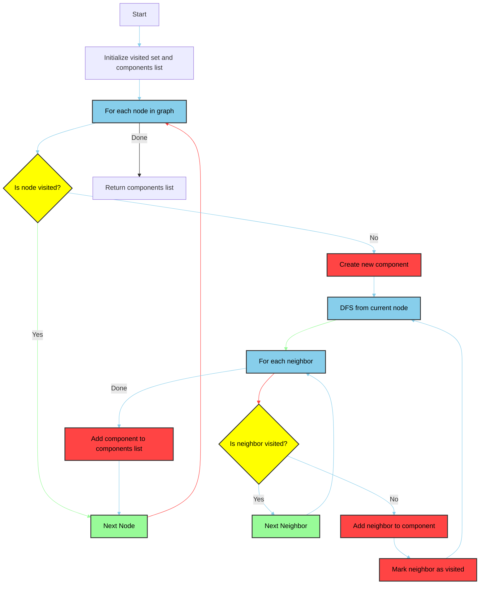

# Connected Components Detection

Finding all connected components in an undirected graph.



```python
# Depth: O(V) - We process each vertex once
# Breadth: O(E) - We process each edge once
# Final: O(V+E)

def find_connected_components(graph):
    visited = set()
    components = []
    
    def dfs(node, component):
        visited.add(node)
        component.append(node)
        for neighbor in graph[node]:
            if neighbor not in visited:
                dfs(neighbor, component)
    
    for node in graph:
        if node not in visited:
            component = []
            dfs(node, component)
            components.append(component)
    
    return components

# Example usage:
graph = {
    'A': ['B'],
    'B': ['A', 'C'],
    'C': ['B'],
    'D': ['E'],
    'E': ['D', 'F'],
    'F': ['E'],
    'G': []
}
print(find_connected_components(graph))  # Output: [['A', 'B', 'C'], ['D', 'E', 'F'], ['G']]
```