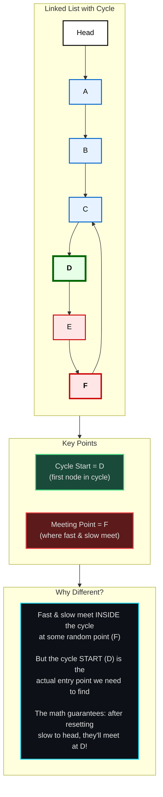
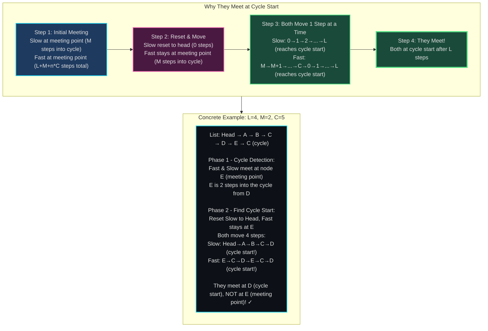
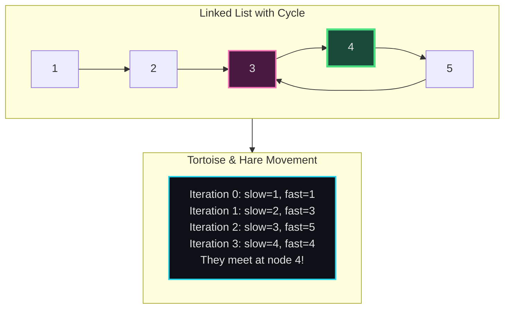
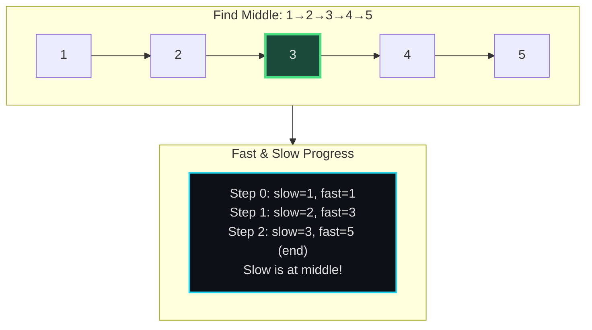
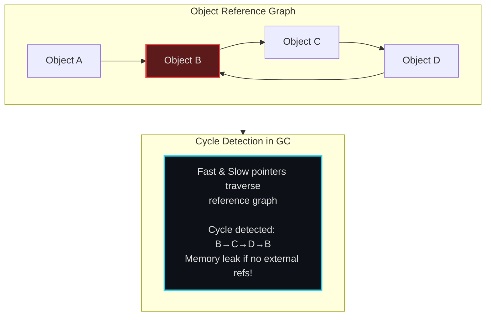
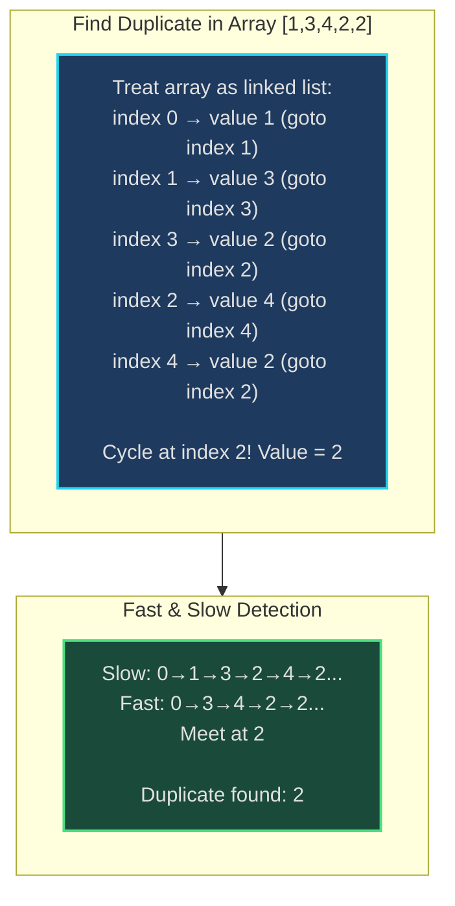
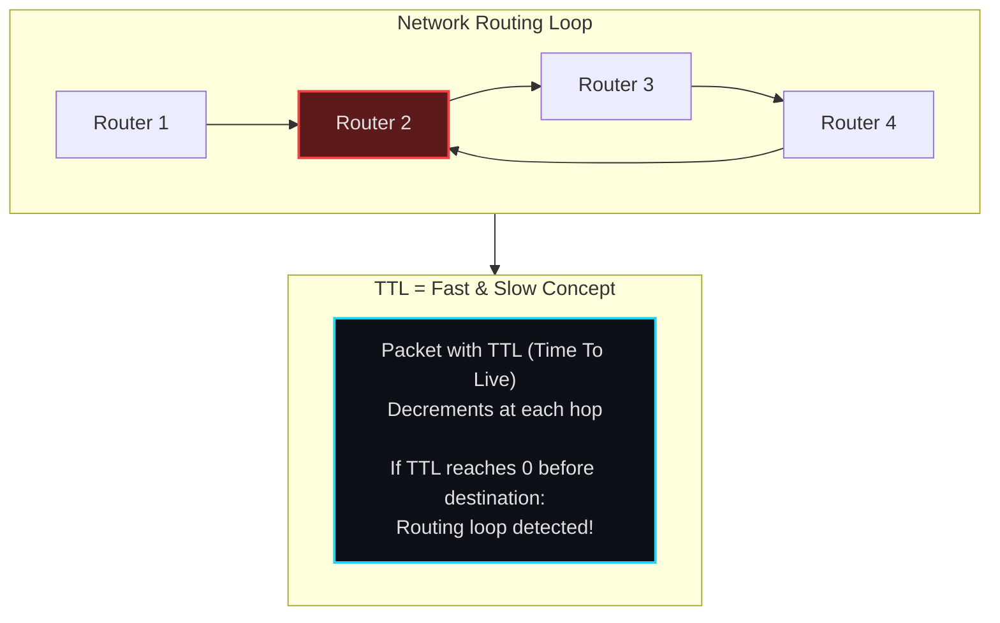
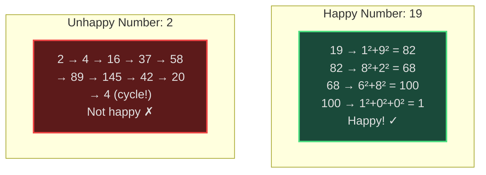

# Fast & Slow Pointers - Senior Engineer Thoughts

*The 4-stage mental pipeline: Problem → Pattern → Structure → Behavior → Code*

---

## Stage 1: Problem → Pattern (Recognition)

> "Fast & Slow pointers is my immediate reach when I see **'cycle detection'**, **'find middle'**, or **'linked list'** with positional requirements. The trigger: do I need two pointers moving at different speeds?"

**Recognition keywords:**
- "**Detect cycle**" in linked list
- "Find **middle** of linked list"
- "**Happy number**" problem
- "Find **duplicate**" in array (tortoise-hare)
- "Linked list has cycle? Where does it start?"
- "Find Nth node from end"

**Mental model:**
> "Slow pointer moves 1 step, fast pointer moves 2 steps. If there's a cycle, fast will eventually lap slow (they'll meet). If no cycle, fast reaches end first. It's like two runners on a track - faster runner laps slower if track is circular."

**Key insight:**
> "This is Floyd's Cycle Detection (tortoise-hare algorithm). The math guarantees they meet if there's a cycle, and we can even find the cycle start point."

---

## Stage 2: Pattern → Structure (What do I need?)

**Structure inventory:**
- **Slow pointer**: Moves 1 step at a time
- **Fast pointer**: Moves 2 steps at a time (or k steps for variants)
- **Meeting point**: Where they collide (if cycle exists)
- **Cycle start**: Optional - where the cycle begins

> "The structure is minimal - just two pointers moving at different speeds. The behavior (how they move) is what matters."

---

## Stage 3: Structure → Behavior (How does it move?)

**Cycle detection behavior:**
```
slow = head
fast = head

while fast and fast.next:
    slow = slow.next         # Move 1 step
    fast = fast.next.next    # Move 2 steps

    if slow == fast:
        return True  # Cycle detected!

return False  # No cycle
```

**Finding cycle start (after detecting cycle):**
```
# Reset one pointer to head, both move 1 step
slow = head
while slow != fast:
    slow = slow.next
    fast = fast.next
return slow  # This is the cycle start!
```

**Important distinction:**
> "**Meeting point** ≠ **Cycle start**! The meeting point is where fast and slow first collide (somewhere inside the cycle). The cycle start is the actual entry point to the cycle (the first node that's part of the cycle). We need a second phase to find the cycle start."

**Visual distinction:**


**Why this works (the math):**
> "When fast and slow first meet at the **meeting point** (inside the cycle), the math guarantees they'll meet again at the **cycle start** if we reset slow to head and move both one step at a time. Here's why:"

**Mathematical proof:**
```
Let:
- L = distance from head to cycle start
- M = distance from cycle start to meeting point
- C = cycle length
- n = number of cycles fast completed before meeting

When they meet:
- Slow traveled: L + M steps
- Fast traveled: L + M + n*C steps (went around cycle n times)
- Since fast = 2 * slow: 2(L + M) = L + M + n*C
- Simplifying: L + M = n*C
- Therefore: L = n*C - M
```

**Breaking down the algebra: Why L = (n-1)*C + (C - M)?**
```
Starting from: L = n*C - M

The trick: Add and subtract C (this doesn't change the value):
        L = n*C - M
        L = n*C - C + C - M        (add C, subtract C = 0, so no change!)

Now group the terms:
        L = (n*C - C) + (C - M)    (group n*C - C together, and C - M together)
        L = C*(n - 1) + (C - M)    (factor C out of the first group)
        L = (n-1)*C + (C - M)      (rewrite for clarity)

Why do we do this? To show that:
- L equals (C - M) plus some number of full cycles
- (C - M) = distance from meeting point back to cycle start
- (n-1)*C = going around the cycle (n-1) times
- **Key insight**: Going around a cycle any number of times brings you back to the same point!
  So (n-1)*C doesn't change your position - you can ignore it!
```

**What this means:**
```
- L (head to cycle start) = (C - M) + some multiple of C
- (C - M) = distance from meeting point back to cycle start
- Key insight: Going around a cycle brings you back to the same point!

So if we reset slow to head and move both 1 step:
- Slow travels L steps → reaches cycle start
- Fast travels (C - M) steps from meeting point → also reaches cycle start
  (The (n-1)*C part doesn't matter because going around cycles brings you back!)
- They meet at the cycle start! ✓
```

**Visual explanation:**


**Key insight:**
> "The key is that L = n*C - M. This means the distance from head to cycle start (L) equals the distance from meeting point back to cycle start (C - M), plus some number of full cycles. Since fast can 'wrap around' the cycle, when both move L steps, they arrive at the same point: the cycle start."

**Key invariant:**
> "If there's a cycle: fast pointer will always catch slow pointer. The distance between them decreases by 1 each iteration (fast gains 1 step per iteration). Eventually distance becomes 0 = they meet. After meeting, the math guarantees that resetting slow to head and moving both one step will make them meet again at the cycle start."

---

## Visual Model

### Cycle Detection



### Finding Middle of Linked List



---

## Stage 4: Behavior → Code (Expression)

### Verbose Form: Cycle Detection

```python
from typing import Optional

class ListNode:
    def __init__(self, val=0, next=None):
        self.val = val
        self.next = next

class CycleDetector:
    def __init__(self, head: Optional[ListNode]):
        self.head = head
        self.slow = head
        self.fast = head

    def _move_slow(self):
        """Move slow pointer one step."""
        if self.slow:
            self.slow = self.slow.next

    def _move_fast(self):
        """Move fast pointer two steps."""
        if self.fast and self.fast.next:
            self.fast = self.fast.next.next

    def _pointers_meet(self) -> bool:
        """Check if slow and fast pointers point to same node."""
        return self.slow == self.fast

    def _fast_can_continue(self) -> bool:
        """Check if fast pointer can move two more steps."""
        return self.fast is not None and self.fast.next is not None

    def has_cycle(self) -> bool:
        """Detect if linked list has a cycle."""
        while self._fast_can_continue():
            self._move_slow()
            self._move_fast()

            if self._pointers_meet():
                return True

        return False

    def find_cycle_start(self) -> Optional[ListNode]:
        """Find the node where cycle begins."""
        if not self.has_cycle():
            return None

        # Reset slow to head, keep fast at meeting point
        self.slow = self.head

        # Move both one step at a time until they meet
        while not self._pointers_meet():
            self._move_slow()
            self.fast = self.fast.next  # Fast moves 1 step now

        return self.slow  # Cycle start
```

### Terse Form: Cycle Detection

```python
def hasCycle(head: Optional[ListNode]) -> bool:
    slow = fast = head

    while fast and fast.next:
        slow = slow.next
        fast = fast.next.next

        if slow == fast:
            return True

    return False
```

### Terse Form: Find Cycle Start

```python
def detectCycle(head: Optional[ListNode]) -> Optional[ListNode]:
    slow = fast = head

    # Find meeting point
    while fast and fast.next:
        slow = slow.next
        fast = fast.next.next
        if slow == fast:
            break
    else:
        return None  # No cycle

    # Find cycle start
    slow = head
    while slow != fast:
        slow = slow.next
        fast = fast.next

    return slow
```

### Verbose Form: Find Middle

```python
class MiddleFinder:
    def __init__(self, head: Optional[ListNode]):
        self.head = head
        self.slow = head
        self.fast = head

    def find_middle(self) -> Optional[ListNode]:
        """Find middle node of linked list."""
        while self.fast and self.fast.next:
            self.slow = self.slow.next
            self.fast = self.fast.next.next

        return self.slow  # Slow is at middle when fast reaches end
```

### Terse Form: Find Middle

```python
def findMiddle(head: Optional[ListNode]) -> Optional[ListNode]:
    slow = fast = head

    while fast and fast.next:
        slow = slow.next
        fast = fast.next.next

    return slow
```

---

## Real World Use Cases

> "Fast & slow pointers isn't just for linked lists - it's fundamental to cycle detection in any sequential system."

### 1. **Memory Leak Detection - Reference Cycles**

**System Architecture:**


**Why fast & slow?**
> "Python's garbage collector uses cycle detection to find reference cycles (objects that reference each other but nothing else references them). Fast & slow pointers can detect these cycles efficiently without needing to track all visited nodes (which would use O(n) extra space)."

**Real-world usage:**
- **Python GC**: Cycle detection in reference counting
- **Java/C# GC**: Generational GC cycle analysis
- **Memory profilers**: Leak detection tools

---

### 2. **Duplicate Detection - Floyd's Algorithm**

**System Architecture:**


**Why fast & slow?**
> "LeetCode 287 'Find Duplicate Number' uses this trick: treat array as implicit linked list where arr[i] points to arr[arr[i]]. A duplicate means two indices point to same value = cycle! Fast & slow finds the cycle = finds duplicate. O(1) space, O(n) time."

**Real-world usage:**
- **Data deduplication**: Stream processing duplicate detection
- **Database**: Detecting duplicate keys without sorting
- **Network**: Detecting packet loops

---

### 3. **Playlist / Music Shuffle - Cycle Detection**

**System:**
- **Problem**: Detect if shuffle algorithm creates a cycle (same song sequence repeats)
- **Behavior**: Treat playlist as linked list (song A → next song B), fast & slow detect cycle
- **Tool**: Spotify, Apple Music shuffle validation

> "Music streaming services validate shuffle algorithms using cycle detection: if your 'random' shuffle creates a repeating pattern, that's a cycle. Fast & slow pointers can detect if shuffle is truly random or has patterns."

---

### 4. **Network Loop Detection - Routing Protocols**

**System Architecture:**


**Why fast & slow?**
> "IP packets have TTL (Time To Live) field - decrements at each router. If packet loops infinitely, TTL hits 0, packet dropped. This is like fast pointer catching slow: if path has cycle, fast (TTL decrement) catches slow (packet progress) = loop detected."

**Real-world usage:**
- **BGP routing**: Loop prevention
- **Ethernet**: Spanning tree protocol (STP) prevents loops
- **Distributed systems**: Deadlock detection in message passing

---

### 5. **Pagination - Finding Midpoint**

**System:**
- **Problem**: API returns linked list of results, need to find midpoint for pagination
- **Behavior**: Can't know total length upfront (streaming data), fast & slow finds middle in one pass
- **Tool**: Cursor-based pagination APIs

> "When implementing cursor-based pagination on linked data structures, I can't count items first. Fast & slow pointer finds the midpoint in one pass - when fast reaches end, slow is at middle. This becomes the pagination cursor."

---

### 6. **Happy Number Problem - Cycle Detection**

**System:**


**Why fast & slow?**
> "Happy number: repeatedly sum squares of digits. Either reaches 1 (happy) or enters cycle (unhappy). Fast & slow detects the cycle without storing all seen numbers. If slow == fast and not 1, it's cycling = unhappy."

---

### Why This Matters for Full-Stack Engineers

> "Fast & slow pointers is my tool for cycle detection without extra space:"

- **Backend**: Reference cycle detection, infinite loop detection in event processing
- **Databases**: Cycle detection in foreign key graphs, recursive query termination
- **DevOps**: Circular dependency detection in configs, deployment loop detection
- **Algorithms**: Any sequence that might cycle (hash functions, pseudo-random generators)
- **Testing**: Detecting infinite loops in tests

> "The insight: if I have a sequence that might cycle and I can't afford O(n) space to track visited elements, fast & slow pointers detect cycles in O(1) space. It's mathematically guaranteed."

---

## Self-Check Questions

1. **Can I explain WHY fast catches slow?** Distance between them decreases by 1 each iteration.
2. **Can I find the cycle start?** Reset one pointer to head after detecting cycle, both move 1 step.
3. **Can I find the middle?** When fast reaches end, slow is at middle.
4. **Do I know the space complexity?** O(1) - that's the whole point vs hash set O(n).
5. **Can I identify it in production?** GC cycle detection, routing loop prevention, duplicate detection.

---

## Common Variations

- **Cycle detection**: Standard fast & slow
- **Cycle start**: After detecting, reset slow to head, both move 1 step
- **Find middle**: Fast reaches end, slow at middle
- **Find kth from end**: Fast moves k steps ahead, then both move together
- **Palindrome check**: Find middle, reverse second half, compare

**Why the math works:**
> "If there's a cycle of length C, and slow is M steps ahead of fast in the cycle, each iteration closes the gap by 1. After M iterations, gap = 0 = they meet. The meeting point math is why we can find cycle start."

---

## LeetCode Practice Problems

| # | Problem | Difficulty |
|---|---------|------------|
| 19 | [Remove Nth Node From End of List](https://leetcode.com/problems/remove-nth-node-from-end-of-list/) | Medium |
| 141 | [Linked List Cycle](https://leetcode.com/problems/linked-list-cycle/) | Medium |
| 142 | [Linked List Cycle II](https://leetcode.com/problems/linked-list-cycle-ii/) | Medium |
| 202 | [Happy Number](https://leetcode.com/problems/happy-number/) | Medium |
| 234 | [Palindrome Linked List](https://leetcode.com/problems/palindrome-linked-list/) | Medium |
| 287 | [Find the Duplicate Number](https://leetcode.com/problems/find-the-duplicate-number/) | Medium |
| 457 | [Circular Array Loop](https://leetcode.com/problems/circular-array-loop/) | Medium |
| 876 | [Middle of the Linked List](https://leetcode.com/problems/middle-of-the-linked-list/) | Medium |
| 2095 | [Delete the Middle Node of a Linked List](https://leetcode.com/problems/delete-the-middle-node-of-a-linked-list/) | Medium |
| 109 | [Convert Sorted List to Binary Search Tree](https://leetcode.com/problems/convert-sorted-list-to-binary-search-tree/) | Hard |
| 708 | [Insert into a Sorted Circular Linked List](https://leetcode.com/problems/insert-into-a-sorted-circular-linked-list/) | Hard |
| 2130 | [Maximum Twin Sum of a Linked List](https://leetcode.com/problems/maximum-twin-sum-of-a-linked-list/) | Hard |
---
