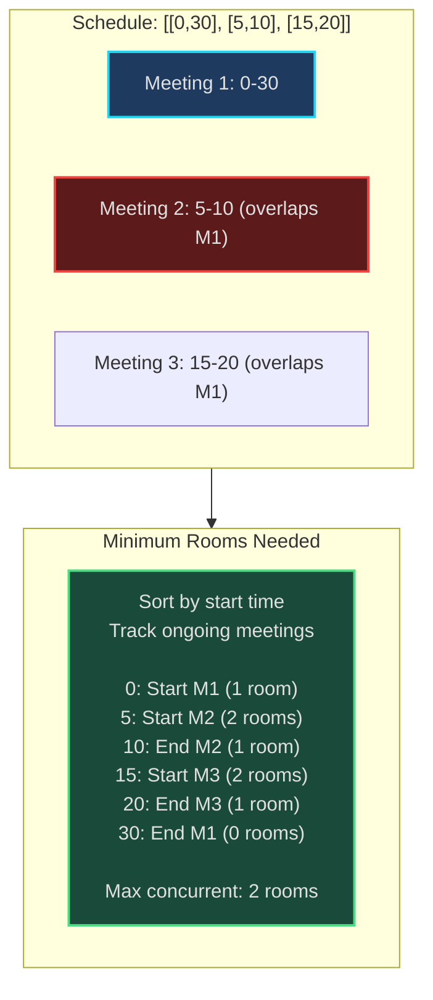
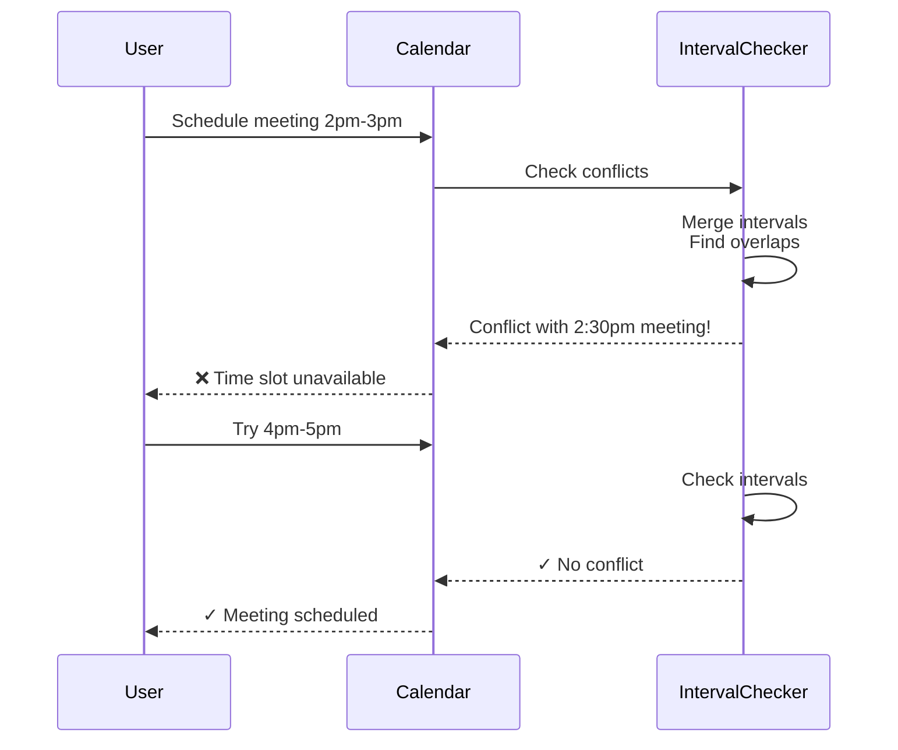
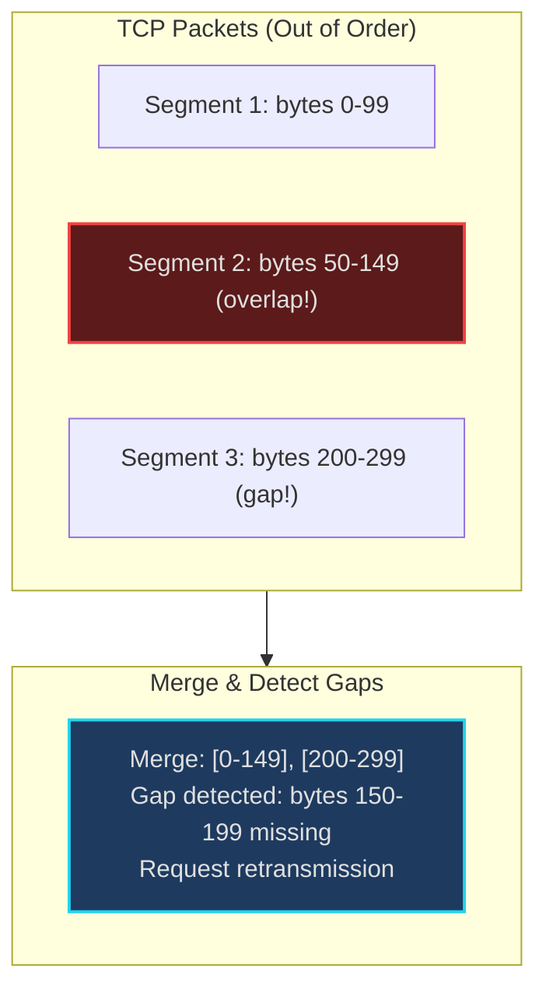
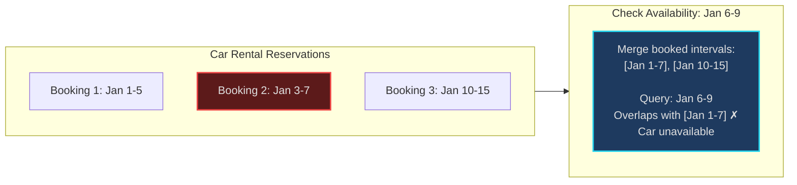

```mermaid
gantt
    title CPU Task Scheduling - Merge Overlapping Tasks
    dateFormat X
    axisFormat %s

    section Tasks
    Task A (0-10)    :a1, 0, 10
    Task B (5-15)    :a2, 5, 15
    Task C (20-30)   :a3, 20, 30

    section Merged Execution Windows
    CPU Busy (0-15)  :b1, 0, 15
    CPU Idle (15-20) :b2, 15, 20
    CPU Busy (20-30) :b3, 20, 30
```

# Merge Intervals - Senior Engineer Thoughts

*The 4-stage mental pipeline: Problem → Pattern → Structure → Behavior → Code*

---

## Stage 1: Problem → Pattern (Recognition)

> "Merge Intervals is my reach when I see **'overlapping ranges'**, **'time scheduling'**, or **'interval conflicts'**. The trigger: do I have start/end pairs that might overlap?"

**Recognition keywords:**
- "**Merge overlapping** intervals"
- "Find **conflicts** in schedule"
- "**Meeting rooms** problem"
- "Insert interval into sorted list"
- "Range coverage / gaps"
- "Calendar scheduling"

**Mental model:**
> "Sort intervals by start time. Scan left to right, merging when current interval overlaps with previous. It's like stacking meeting rooms - if meetings overlap, they need separate rooms."

**Key insight:**
> "Once sorted, I only need to compare current interval with the last interval in my result. No need to check all previous intervals."

---

## Stage 2: Pattern → Structure (What do I need?)

**Structure inventory:**
- **Intervals**: List of [start, end] pairs
- **Sorted intervals**: Sort by start time (critical!)
- **Result list**: Merged intervals
- **Current merge candidate**: The interval we're building/extending

> "The key: sorting unlocks linear scan. Without sorting, I'd need O(n²) to check all pairs for overlap."

---

## Stage 3: Structure → Behavior (How does it move?)

**Merge intervals behavior:**
```
1. Sort intervals by start time
2. Initialize result with first interval
3. For each subsequent interval:
   - If current.start <= last_merged.end:
       Overlap! Extend last_merged.end to max(last.end, current.end)
   - Else:
       No overlap, add current to result
```

**Overlap detection:**
```
Intervals [a_start, a_end] and [b_start, b_end] overlap if:
  a_start <= b_end AND b_start <= a_end

If sorted by start time, just check: b_start <= a_end
```

**Key invariant:**
> "After processing each interval, result list contains all merged intervals for elements processed so far. The last interval in result is the one we might extend next."

---

## Visual Model

### Merging Overlapping Intervals

```mermaid
gantt
    title Merge Intervals: [[1,3], [2,6], [8,10], [15,18]]
    dateFormat X
    axisFormat %s

    section Before
    Interval 1 (1-3)   :a1, 1, 3
    Interval 2 (2-6)   :a2, 2, 6
    Interval 3 (8-10)  :a3, 8, 10
    Interval 4 (15-18) :a4, 15, 18

    section After Merge
    Merged (1-6)       :b1, 1, 6
    Merged (8-10)      :b2, 8, 10
    Merged (15-18)     :b3, 15, 18
```



### Meeting Rooms Problem



---

## Stage 4: Behavior → Code (Expression)

### Verbose Form: Merge Overlapping Intervals

```python
from typing import List

class IntervalMerger:
    def __init__(self, intervals: List[List[int]]):
        self.intervals = intervals
        self.merged: List[List[int]] = []

    def _sort_by_start(self):
        """Sort intervals by start time."""
        self.intervals.sort(key=lambda x: x[0])

    def _is_empty(self) -> bool:
        """Check if no intervals to merge."""
        return len(self.intervals) == 0

    def _initialize_result(self):
        """Add first interval to result."""
        self.merged.append(self.intervals[0])

    def _get_last_merged(self) -> List[int]:
        """Get the last interval in merged list."""
        return self.merged[-1]

    def _overlaps(self, interval: List[int]) -> bool:
        """Check if interval overlaps with last merged interval."""
        last = self._get_last_merged()
        return interval[0] <= last[1]

    def _merge_with_last(self, interval: List[int]):
        """Extend last merged interval."""
        last = self._get_last_merged()
        last[1] = max(last[1], interval[1])

    def _add_new_interval(self, interval: List[int]):
        """Add non-overlapping interval to result."""
        self.merged.append(interval)

    def merge(self) -> List[List[int]]:
        """Merge overlapping intervals."""
        if self._is_empty():
            return []

        self._sort_by_start()
        self._initialize_result()

        for i in range(1, len(self.intervals)):
            current = self.intervals[i]

            if self._overlaps(current):
                self._merge_with_last(current)
            else:
                self._add_new_interval(current)

        return self.merged
```

### Terse Form: Merge Intervals

```python
def merge(intervals: List[List[int]]) -> List[List[int]]:
    if not intervals:
        return []

    intervals.sort(key=lambda x: x[0])
    merged = [intervals[0]]

    for current in intervals[1:]:
        if current[0] <= merged[-1][1]:
            # Overlap: extend last interval
            merged[-1][1] = max(merged[-1][1], current[1])
        else:
            # No overlap: add new interval
            merged.append(current)

    return merged
```

### Verbose Form: Meeting Rooms II (Minimum Rooms)

```python
import heapq

class MeetingRoomAllocator:
    def __init__(self, meetings: List[List[int]]):
        self.meetings = meetings
        self.end_times = []  # Min heap of meeting end times

    def _sort_by_start(self):
        """Sort meetings by start time."""
        self.meetings.sort(key=lambda x: x[0])

    def _get_earliest_ending_room(self) -> int:
        """Get end time of earliest finishing meeting."""
        return self.end_times[0]

    def _is_room_available(self, start_time: int) -> bool:
        """Check if a room has become free."""
        if not self.end_times:
            return False
        return self._get_earliest_ending_room() <= start_time

    def _free_room(self):
        """Remove earliest ending meeting (room becomes free)."""
        heapq.heappop(self.end_times)

    def _allocate_room(self, end_time: int):
        """Allocate a room (track its end time)."""
        heapq.heappush(self.end_times, end_time)

    def min_rooms_needed(self) -> int:
        """Find minimum number of meeting rooms required."""
        if not self.meetings:
            return 0

        self._sort_by_start()

        for start, end in self.meetings:
            if self._is_room_available(start):
                self._free_room()

            self._allocate_room(end)

        return len(self.end_times)
```

### Terse Form: Meeting Rooms II

```python
import heapq

def minMeetingRooms(intervals: List[List[int]]) -> int:
    if not intervals:
        return 0

    intervals.sort(key=lambda x: x[0])
    rooms = []  # Min heap of end times

    for start, end in intervals:
        # If a room is free (earliest meeting ended), reuse it
        if rooms and rooms[0] <= start:
            heapq.heappop(rooms)

        heapq.heappush(rooms, end)

    return len(rooms)  # Number of rooms = max concurrent meetings
```

### Terse Form: Insert Interval

```python
def insert(intervals: List[List[int]], newInterval: List[int]) -> List[List[int]]:
    result = []
    i = 0
    n = len(intervals)

    # Add all intervals before newInterval
    while i < n and intervals[i][1] < newInterval[0]:
        result.append(intervals[i])
        i += 1

    # Merge overlapping intervals
    while i < n and intervals[i][0] <= newInterval[1]:
        newInterval[0] = min(newInterval[0], intervals[i][0])
        newInterval[1] = max(newInterval[1], intervals[i][1])
        i += 1

    result.append(newInterval)

    # Add remaining intervals
    while i < n:
        result.append(intervals[i])
        i += 1

    return result
```

---

## Real World Use Cases

> "Interval merging is everywhere - from calendar apps to CPU scheduling to network packet reassembly."

### 1. **Calendar Apps - Meeting Conflict Detection**

**System Architecture:**


**Why merge intervals?**
> "Google Calendar: when I try to schedule a meeting, it checks for conflicts by merging all existing meetings. If new meeting overlaps with merged intervals, it's a conflict. 'Find a time' feature: find gaps in merged intervals where everyone is free."

**Real-world usage:**
- **Google Calendar**: Conflict detection, find-a-time
- **Outlook**: Room booking, resource scheduling
- **Calendly**: Availability aggregation across users

---

### 2. **CPU Scheduling - Process Time Allocation**

**System Architecture:**


**Why merge intervals?**
> "Operating systems merge overlapping process execution windows to calculate CPU utilization. If processes A (0-10ms) and B (5-15ms) overlap, merged interval is (0-15ms) = CPU busy. Gaps between merged intervals = CPU idle time."

**Real-world usage:**
- **Linux scheduler**: CPU utilization calculation
- **Cloud monitoring**: Instance busy time aggregation
- **Database query planner**: Lock time analysis

---

### 3. **Video Streaming - Buffered Segments**

**System:**
- **Problem**: Video player buffers segments [0-5s], [3-8s], [10-15s]. Which ranges are buffered?
- **Behavior**: Merge overlapping segments → [0-8s], [10-15s]
- **Usage**: Seek to timestamp, check if it's in merged intervals (can play) or gap (need to buffer)

> "YouTube/Netflix buffer management: track buffered video segments as intervals. When user seeks to timestamp T, check if T is in merged buffered intervals. If yes, play instantly. If no (gap), show loading."

---

### 4. **Network Packet Reassembly - TCP Segments**

**System Architecture:**


**Why merge intervals?**
> "TCP receives packets out of order. Each packet has byte range [start, end]. Merge overlapping ranges to find which bytes are received. Gaps in merged intervals = missing packets → request retransmission. This is how TCP ensures reliable delivery."

**Real-world usage:**
- **TCP stack**: Segment reassembly
- **CDN**: Partial content delivery (HTTP Range requests)
- **P2P protocols**: BitTorrent chunk aggregation

---

### 5. **Database - Index Range Scans**

**System:**
- **Problem**: Query `WHERE (age BETWEEN 20 AND 30) OR (age BETWEEN 25 AND 40)`
- **Optimization**: Merge overlapping ranges → `WHERE age BETWEEN 20 AND 40`
- **Benefit**: Single index scan instead of two

> "Database query optimizers merge overlapping index scan ranges. If query has multiple OR conditions on same column with overlapping ranges, optimizer merges them into minimal set of scans. Reduces I/O."

**Real-world usage:**
- **PostgreSQL/MySQL**: Query optimizer range merging
- **Elasticsearch**: Multi-range queries
- **Redis**: ZRANGEBYSCORE optimization

---

### 6. **Resource Booking - Hotel/Car Rental**

**System Architecture:**


**Why merge intervals?**
> "Booking systems (Airbnb, car rentals, conference rooms) store reservations as intervals. To check if resource is available for new booking, merge all existing bookings, check if new interval overlaps. Gaps between merged intervals = available time slots."

---

### Why This Matters for Full-Stack Engineers

> "Interval problems are everywhere scheduling and ranges matter:"

- **Frontend**: Calendar UIs, timeline visualizations, range selectors
- **Backend**: Scheduling APIs, conflict detection, resource allocation
- **Databases**: Query optimization, index range merging
- **Infrastructure**: CPU/memory utilization windows, downtime analysis
- **Monitoring**: Alert de-duplication, log aggregation by time ranges

> "The pattern: whenever I have start/end pairs that might overlap, I sort by start time and merge. Whether it's meetings, packet ranges, or database scans, the algorithm is identical."

---

## Self-Check Questions

1. **Can I identify when intervals overlap?** `start2 <= end1` (if sorted by start).
2. **Do I know why sorting is critical?** Enables linear scan O(n log n + n) instead of O(n²).
3. **Can I handle meeting rooms problem?** Use min heap to track end times.
4. **Can I find gaps in coverage?** Compare consecutive merged intervals.
5. **Can I identify it in production?** Calendars, packet reassembly, query optimization, booking systems.

---

## Common Variations

- **Merge overlapping**: Standard interval merging
- **Insert interval**: Merge new interval into sorted list
- **Meeting rooms I**: Can attend all meetings? (no overlaps)
- **Meeting rooms II**: Minimum rooms needed (max concurrent intervals)
- **Find gaps**: Intervals with no coverage
- **Interval intersection**: Find overlapping regions of two interval lists

**Optimization: Meeting Rooms**
> "Meeting rooms II is clever: min heap tracks ongoing meetings' end times. When new meeting starts, check if earliest meeting ended (reuse room). Heap size = current concurrent meetings = rooms needed."

---

## LeetCode Practice Problems

| # | Problem | Difficulty |
|---|---------|------------|
| 56 | [Merge Intervals](https://leetcode.com/problems/merge-intervals/) | Medium |
| 57 | [Insert Interval](https://leetcode.com/problems/insert-interval/) | Medium |
| 435 | [Non-overlapping Intervals](https://leetcode.com/problems/non-overlapping-intervals/) | Medium |
| 452 | [Minimum Number of Arrows to Burst Balloons](https://leetcode.com/problems/minimum-number-of-arrows-to-burst-balloons/) | Medium |
| 616 | [Add Bold Tag in String](https://leetcode.com/problems/add-bold-tag-in-string/) | Medium |
| 731 | [My Calendar II](https://leetcode.com/problems/my-calendar-ii/) | Medium |
| 763 | [Partition Labels](https://leetcode.com/problems/partition-labels/) | Medium |
| 986 | [Interval List Intersections](https://leetcode.com/problems/interval-list-intersections/) | Medium |
| 1024 | [Video Stitching](https://leetcode.com/problems/video-stitching/) | Medium |
| 1288 | [Remove Covered Intervals](https://leetcode.com/problems/remove-covered-intervals/) | Medium |
| 218 | [The Skyline Problem](https://leetcode.com/problems/the-skyline-problem/) | Hard |
| 715 | [Range Module](https://leetcode.com/problems/range-module/) | Hard |
| 759 | [Employee Free Time](https://leetcode.com/problems/employee-free-time/) | Hard |
| 850 | [Rectangle Area II](https://leetcode.com/problems/rectangle-area-ii/) | Hard |
| 2158 | [Amount of New Area Painted Each Day](https://leetcode.com/problems/amount-of-new-area-painted-each-day/) | Hard |
---
