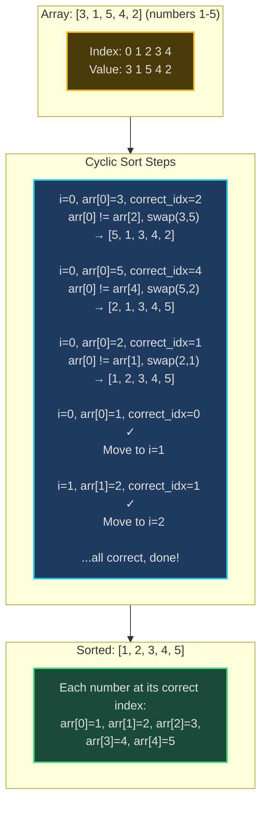
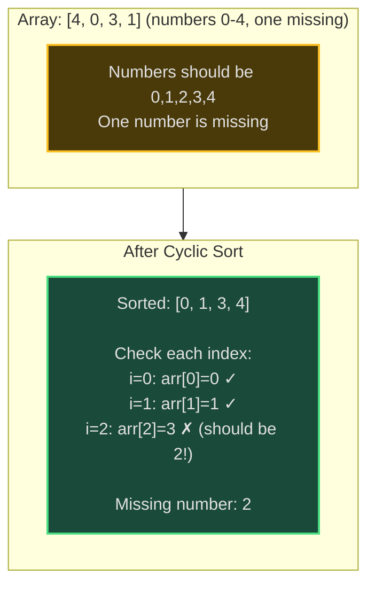
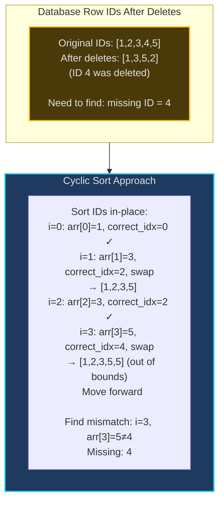
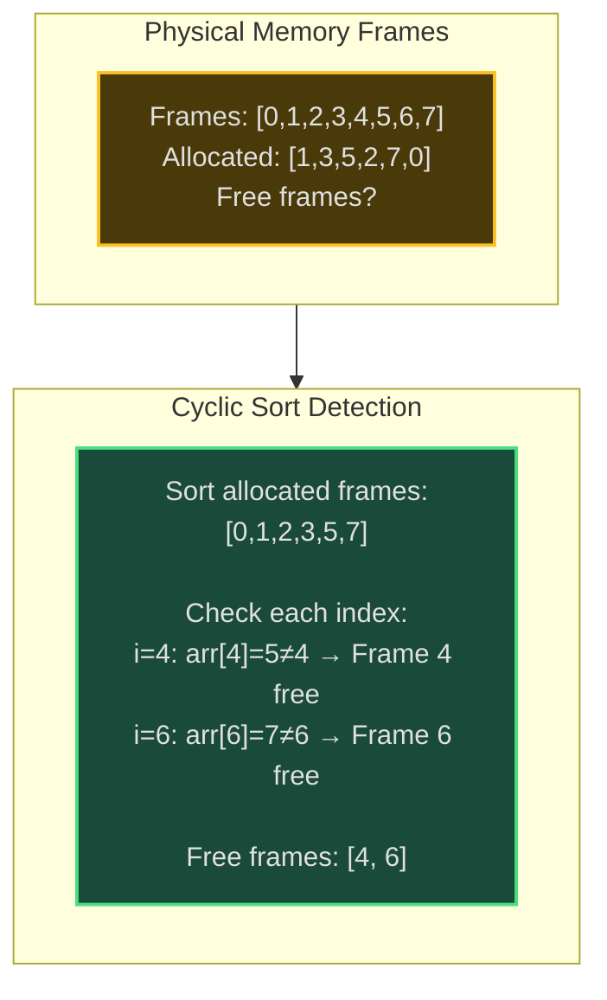

# Cyclic Sort - Senior Engineer Thoughts

*The 4-stage mental pipeline: Problem → Pattern → Structure → Behavior → Code*

---

## Stage 1: Problem → Pattern (Recognition)

> "Cyclic Sort is my reach when I see **'array of numbers 1 to n'** or **'find missing/duplicate number'** in a range. The trigger: are the numbers in the array supposed to be indices?"

**Recognition keywords:**
- "Array containing numbers from **1 to n**" or "**0 to n-1**"
- "**Find missing number**"
- "**Find duplicate number**"
- "Find **all duplicates**"
- "Find **disappeared numbers**"
- "Numbers in range [1, n] or [0, n-1]"
- "Each number should appear exactly once"

**Mental model:**
> "Cyclic sort puts each number at its correct index: number 1 goes to index 0, number 2 to index 1, etc. We swap numbers to their correct positions until current number is already correct, then move forward. It's like sorting mail into mailboxes—each number has a designated slot."

**Key insight:**
> "This only works when numbers are in range [1, n] or [0, n-1] because we can use the number itself as the index. O(n) time, O(1) space. After sorting, any position i where arr[i] != i+1 indicates missing/duplicate."

---

## Stage 2: Pattern → Structure (What do I need?)

**Structure inventory:**
- **Array**: The input array to sort in-place
- **Index pointer**: Current position we're examining
- **Swap operation**: Move number to its correct index
- **Correct index calculation**: For number `x`, correct index is `x-1` (if range [1,n]) or `x` (if range [0,n-1])

> "No extra space needed—we sort in place by repeatedly swapping until each number reaches its home. Unlike comparison sorts (O(n log n)), cyclic sort is O(n) because we can directly compute where each number belongs."

---

## Stage 3: Structure → Behavior (How does it move?)

**Cyclic sort (numbers 1 to n):**
```
i = 0
while i < n:
    correct_index = arr[i] - 1  # number x belongs at index x-1

    if arr[i] != arr[correct_index]:
        # Number not in correct position, swap it there
        swap(arr[i], arr[correct_index])
    else:
        # Number already correct or duplicate, move forward
        i += 1
```

**Finding missing number after cyclic sort:**
```
# After cyclic sort
for i in range(n):
    if arr[i] != i + 1:
        return i + 1  # This number is missing
return n + 1  # All present, n+1 is missing
```

**Key invariant:**
> "After sorting, arr[i] should equal i+1 (for range [1,n]). Any violation indicates missing or duplicate number. Each swap puts at least one number in its correct place, so at most n swaps total."

---

## Visual Model

### Cyclic Sort Process



### Find Missing Number



---

## Stage 4: Behavior → Code (Expression)

### Verbose Form: Cyclic Sort

```python
from typing import List

class CyclicSorter:
    def __init__(self, nums: List[int]):
        self.nums = nums

    def _get_correct_index(self, num: int) -> int:
        """Calculate where number should be placed."""
        return num - 1  # For range [1, n]

    def _is_number_in_correct_position(self, index: int) -> bool:
        """Check if number at index is already correct."""
        correct_idx = self._get_correct_index(self.nums[index])
        return self.nums[index] == self.nums[correct_idx]

    def _swap_to_correct_position(self, index: int):
        """Swap number to its correct position."""
        correct_idx = self._get_correct_index(self.nums[index])
        self.nums[index], self.nums[correct_idx] = \
            self.nums[correct_idx], self.nums[index]

    def _is_valid_number(self, num: int) -> bool:
        """Check if number is in valid range [1, n]."""
        return 1 <= num <= len(self.nums)

    def sort(self) -> List[int]:
        """Sort array using cyclic sort."""
        i = 0
        while i < len(self.nums):
            if self._is_valid_number(self.nums[i]) and \
               not self._is_number_in_correct_position(i):
                self._swap_to_correct_position(i)
            else:
                i += 1
        return self.nums
```

### Terse Form: Cyclic Sort

```python
def cyclicSort(nums: List[int]) -> List[int]:
    i = 0
    while i < len(nums):
        correct_idx = nums[i] - 1
        if nums[i] != nums[correct_idx]:
            nums[i], nums[correct_idx] = nums[correct_idx], nums[i]
        else:
            i += 1
    return nums
```

### Verbose Form: Find Missing Number

```python
class MissingNumberFinder:
    def __init__(self, nums: List[int]):
        self.nums = nums

    def _cyclic_sort(self):
        """Sort array to put numbers in correct positions."""
        i = 0
        while i < len(self.nums):
            correct_idx = self.nums[i]

            # Handle range [0, n] where number == correct index
            if self.nums[i] < len(self.nums) and \
               self.nums[i] != self.nums[correct_idx]:
                self.nums[i], self.nums[correct_idx] = \
                    self.nums[correct_idx], self.nums[i]
            else:
                i += 1

    def _find_first_mismatch(self) -> int:
        """Find first index where number doesn't match."""
        for i in range(len(self.nums)):
            if self.nums[i] != i:
                return i
        return len(self.nums)  # All present, missing is n

    def find_missing(self) -> int:
        """Find the missing number in range [0, n]."""
        self._cyclic_sort()
        return self._find_first_mismatch()
```

### Terse Form: Find Missing Number

```python
def missingNumber(nums: List[int]) -> int:
    i = 0
    n = len(nums)

    # Cyclic sort
    while i < n:
        correct_idx = nums[i]
        if nums[i] < n and nums[i] != nums[correct_idx]:
            nums[i], nums[correct_idx] = nums[correct_idx], nums[i]
        else:
            i += 1

    # Find missing
    for i in range(n):
        if nums[i] != i:
            return i
    return n
```

### Terse Form: Find All Duplicates

```python
def findDuplicates(nums: List[int]) -> List[int]:
    """Find all numbers that appear twice (range [1, n])."""
    i = 0
    while i < len(nums):
        correct_idx = nums[i] - 1
        if nums[i] != nums[correct_idx]:
            nums[i], nums[correct_idx] = nums[correct_idx], nums[i]
        else:
            i += 1

    # After sorting, duplicates won't be at correct index
    duplicates = []
    for i in range(len(nums)):
        if nums[i] != i + 1:
            duplicates.append(nums[i])

    return duplicates
```

### Terse Form: Find Disappeared Numbers

```python
def findDisappearedNumbers(nums: List[int]) -> List[int]:
    """Find all numbers in [1, n] that don't appear."""
    i = 0
    while i < len(nums):
        correct_idx = nums[i] - 1
        if nums[i] != nums[correct_idx]:
            nums[i], nums[correct_idx] = nums[correct_idx], nums[i]
        else:
            i += 1

    # Missing numbers: positions where arr[i] != i+1
    missing = []
    for i in range(len(nums)):
        if nums[i] != i + 1:
            missing.append(i + 1)

    return missing
```

---

## Real World Use Cases

> "Cyclic sort is specialized but powerful—whenever you have a constrained range mapping to indices, it's O(n) time and O(1) space."

### 1. **Database - Compact Row IDs**

**System Architecture:**


**Why cyclic sort?**
> "Database systems use cyclic sort for gap detection in sequential IDs. After bulk deletes, find missing IDs to reclaim or report fragmentation. Cyclic sort finds gaps in O(n) time, O(1) space—no hash set needed."

**Real-world usage:**
- **PostgreSQL**: Sequence gap analysis
- **MySQL**: Auto-increment ID validation
- **Key-value stores**: Shard key distribution validation

---

### 2. **Distributed Systems - Partition Assignment**

**System:**
- **Problem**: Assign partitions 0 to N-1 to servers, detect unassigned partitions
- **Behavior**: Array of assigned partitions, use cyclic sort to find missing ones
- **Tool**: Kafka partition rebalancing, Cassandra token assignment

> "Kafka rebalances partitions across brokers. Partition IDs are 0 to N-1. After rebalance, check if all partitions assigned using cyclic sort. O(n) validation without extra space. Missing partition = unassigned, duplicate = over-assigned."

**Real-world usage:**
- **Kafka**: Partition assignment validation
- **Cassandra**: Token range verification
- **Distributed caches**: Shard assignment (Redis Cluster)

---

### 3. **Memory Management - Page Frame Allocation**

**System Architecture:**


**Why cyclic sort?**
> "Operating systems track allocated memory frames (pages). Frame IDs are 0 to N-1. To find free frames, cyclic sort the allocated list, scan for missing IDs. Linux kernel uses similar techniques for buddy allocator free list validation."

**Real-world usage:**
- **Linux kernel**: Page frame allocation validation
- **Hypervisors**: VM memory page tracking
- **Memory allocators**: Free block validation (jemalloc, tcmalloc)

---

### 4. **Networking - Port Assignment Validation**

**System:**
- **Problem**: Validate that ports 8000-8999 are assigned correctly to services
- **Behavior**: Map ports to indices (port 8000 → index 0), cyclic sort to find gaps
- **Tool**: Container orchestration (Kubernetes, Docker Swarm)

> "Kubernetes assigns ports to services from a range. Validate that no ports are double-assigned or missing using cyclic sort. Port numbers map to indices: port P → index P-START. O(n) validation for port conflicts."

**Real-world usage:**
- **Kubernetes**: Service port allocation
- **Docker**: Container port mapping validation
- **Cloud load balancers**: Port assignment verification

---

### 5. **Game Development - Player ID Management**

**System:**
- **Problem**: Multiplayer game with player IDs 1-100, detect disconnected players
- **Behavior**: Array of active player IDs, cyclic sort finds missing IDs = disconnected
- **Tool**: Game servers, lobby systems

> "Game lobbies assign player IDs 1 to N. When players disconnect, IDs become gaps. Cyclic sort finds missing IDs in O(n) to reassign or display as 'Player 5 disconnected'. No hash set overhead—critical for low-latency game servers."

**Real-world usage:**
- **FPS games**: Player slot management (Call of Duty, Battlefield)
- **MMOs**: Instance player tracking (WoW, FF14)
- **Real-time games**: Lobby state validation

---

### 6. **Data Validation - Sequence Completeness Check**

**System Architecture:**
```mermaid
sequenceDiagram
    participant Producer
    participant Validator as Cyclic Sort Validator
    participant Consumer

    Producer->>Validator: Send packets: [1,3,5,2,4]
    Validator->>Validator: Expected: [1,2,3,4,5]<br/>Cyclic sort received<br/>Check for gaps

    alt All Present
        Validator-->>Consumer: ✓ Complete sequence
    else Gaps Found
        Validator-->>Producer: ❌ Missing packet 3<br/>Request retransmission
    end

    style Validator fill:#1e3a5f,stroke:#22d3ee,stroke-width:2px
```

**Why cyclic sort?**
> "Message queues, packet processors validate sequence numbers. Received packets [1,3,5,2,4], expected [1,2,3,4,5]. Cyclic sort finds missing packet 3 in O(n). Used in TCP reassembly, message queue ordering (RabbitMQ, Kafka)."

**Real-world usage:**
- **TCP**: Out-of-order packet detection
- **Message queues**: Sequence gap detection (RabbitMQ, Kafka)
- **File transfer**: Chunk completeness validation

---

### Why This Matters for Full-Stack Engineers

> "Cyclic sort is my O(n) solution for constrained range problems:"

- **Backend**: ID gap detection, sequence validation, resource allocation
- **Databases**: Row ID fragmentation, partition assignment
- **Systems**: Memory management, port assignment, distributed coordination
- **Performance**: O(n) time, O(1) space when numbers map to indices
- **Data integrity**: Detect duplicates, missing values, assignment errors

> "The key insight: if numbers are in range [1, n] or [0, n-1], I can use the number itself as an index. Cyclic sort is the only O(n) in-place algorithm that leverages this constraint. It's specialized but unbeatable when applicable."

---

## Self-Check Questions

1. **Can I identify when to use it?** Numbers in range [1, n] or [0, n-1], need to find missing/duplicates.
2. **Can I explain the swap logic?** Swap number to its correct index until current position is correct.
3. **Do I know the complexity?** O(n) time (each number swapped at most once), O(1) space.
4. **Can I find missing number?** After sort, scan for first i where arr[i] != i+1.
5. **Can I identify it in production?** Database ID gaps, partition assignment, packet sequence validation.

---

## Common Cyclic Sort Patterns

- **Basic cyclic sort**: Sort array in-place
- **Find missing number**: One missing from [0, n] or [1, n]
- **Find duplicate**: One duplicate, others appear once
- **Find all duplicates**: Multiple numbers appear twice
- **Find all missing**: Multiple missing numbers
- **First K missing positives**: Find smallest K missing positive integers

**When to use cyclic sort vs. other approaches:**
> "Missing number can also be solved with sum formula (expected_sum - actual_sum) or XOR. But cyclic sort generalizes: find ALL missing, find duplicates, etc. If problem is just 'find THE missing number', sum/XOR is simpler."

**Range matters:**
> "For range [1, n]: correct_idx = num - 1. For range [0, n-1]: correct_idx = num. For range [k, k+n]: correct_idx = num - k. The mapping changes but algorithm stays the same."

---

## LeetCode Practice Problems

| # | Problem | Difficulty |
|---|---------|------------|
| 41 | [First Missing Positive](https://leetcode.com/problems/first-missing-positive/) | Medium |
| 268 | [Missing Number](https://leetcode.com/problems/missing-number/) | Medium |
| 287 | [Find the Duplicate Number](https://leetcode.com/problems/find-the-duplicate-number/) | Medium |
| 442 | [Find All Duplicates in an Array](https://leetcode.com/problems/find-all-duplicates-in-an-array/) | Medium |
| 448 | [Find All Numbers Disappeared in an Array](https://leetcode.com/problems/find-all-numbers-disappeared-in-an-array/) | Medium |
| 645 | [Set Mismatch](https://leetcode.com/problems/set-mismatch/) | Medium |
| 1426 | [Counting Elements](https://leetcode.com/problems/counting-elements/) | Medium |
| 2194 | [Cells in a Range on an Excel Sheet](https://leetcode.com/problems/cells-in-a-range-on-an-excel-sheet/) | Medium |
| 41 | [First Missing Positive](https://leetcode.com/problems/first-missing-positive/) | Hard |
| 765 | [Couples Holding Hands](https://leetcode.com/problems/couples-holding-hands/) | Hard |
| 2459 | [Sort Array by Moving Items to Empty Space](https://leetcode.com/problems/sort-array-by-moving-items-to-empty-space/) | Hard |
---
