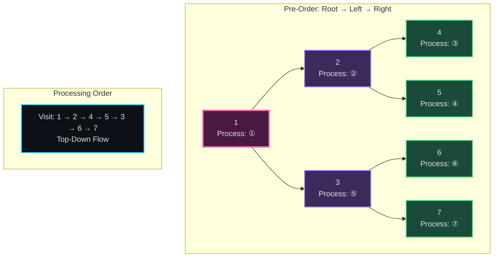
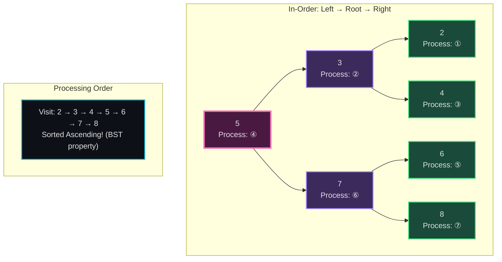
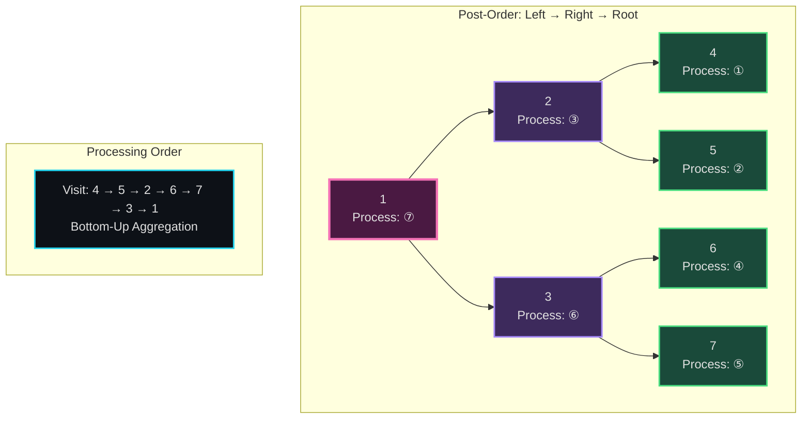
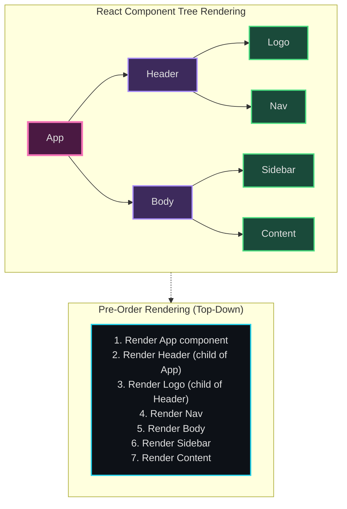
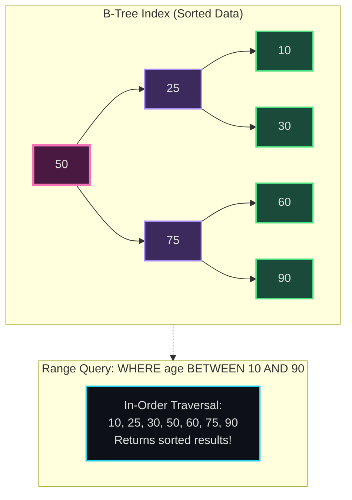
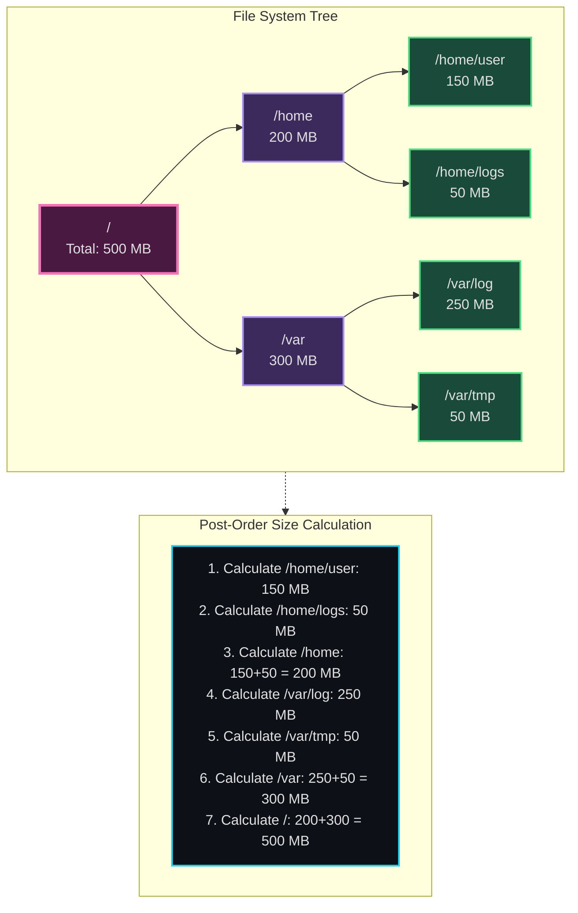
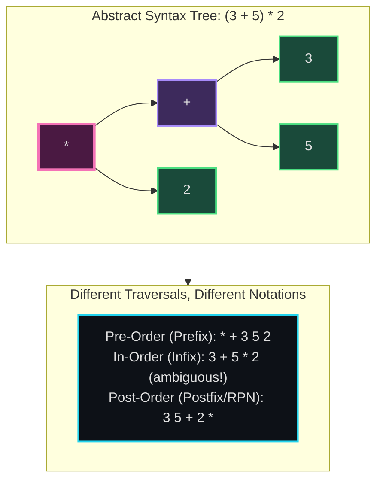

# Tree Traversals (Pre/In/Post-Order) - Senior Engineer Thoughts

*The code is trivial - it's knowing WHEN to use which order that matters*

---

## The Core Insight

> "I can write all three traversals in my sleep - it's just where I place the 'work' relative to the recursive calls. The hard part is pattern recognition: when do I reach for pre-order vs in-order vs post-order? That's what I need to internalize."

---

## Stage 1: Problem → Traversal Order (Recognition Triggers)

### Pre-Order: "Top-Down" / "Parent Before Children"

> "Pre-order triggers: When I need to **process the parent before exploring children**. Think 'top-down flow'."

**Recognition keywords:**
- "Create a copy of the tree" (need parent node first to attach children)
- "Serialize a tree" (write parent, then children)
- "Prefix notation" / "Polish notation"
- "Visit nodes in root → left → right order"
- "Check a property from root downward" (passing info DOWN the tree)

**Mental model:**
> "I'm flowing information from root to leaves. I need the parent's value/state BEFORE I can process the children. Example: 'Add 5 to every node's value starting from root' - I process root, THEN recurse."

**Common use cases:**
- Tree serialization/deserialization
- Creating a copy/clone of tree
- Prefix expression evaluation
- Path sum problems (accumulating from root)
- Tree printing in document order

---

### In-Order: "Sorted Order for BST"

> "In-order trigger: If I see **Binary Search Tree** and need **sorted order**, it's in-order. Period. That's the main use case."

**Recognition keywords:**
- "Binary Search Tree" + any sorting/ordering requirement
- "Find kth smallest/largest in BST"
- "Validate BST" (check if in-order traversal is sorted)
- "Convert BST to sorted array/list"
- "Infix notation" / "expression evaluation"

**Mental model:**
> "In-order on a BST gives me sorted ascending order. Left subtree (smaller values) → root → right subtree (larger values). If the problem mentions BST and sorting, it's in-order."

**Common use cases:**
- BST validation (check if in-order sequence is sorted)
- Kth smallest element in BST
- Convert BST to sorted doubly linked list
- Infix expression evaluation
- BST iterator (next() returns next smallest)

**Critical insight:**
> "In-order is almost exclusively for BSTs. If it's not a BST, I probably don't need in-order. Pre-order and post-order work on any tree, but in-order's superpower is BST sorted traversal."

---

### Post-Order: "Bottom-Up" / "Children Before Parent"

> "Post-order triggers: When I need to **gather information from children before processing the parent**. Think 'bottom-up aggregation'."

**Recognition keywords:**
- "Calculate tree height/depth" (need children's heights first)
- "Delete/free a tree" (delete children before parent)
- "Postfix notation" / "Reverse Polish notation"
- "Aggregate values from subtrees" (sum, count, max, etc.)
- "Tree DP problems" (need subproblem results before current node)

**Mental model:**
> "I can't answer the question about a node until I know the answer for its children. Example: 'What's the height of this tree?' - I need to know the height of left and right subtrees FIRST, then I can compute root's height."

**Common use cases:**
- Calculate tree height/depth
- Count nodes, sum of nodes
- Delete tree (free memory)
- Postfix expression evaluation
- Lowest Common Ancestor (LCA) problems
- Tree diameter (need both subtree diameters)
- Subtree sum/product calculations

---

## Stage 2: Structure (What do I need?)

> "Structure is identical for all three - it's just a binary tree node:"

```python
class TreeNode:
    def __init__(self, val=0, left=None, right=None):
        self.val = val
        self.left = left
        self.right = right
```

> "The traversal doesn't change the structure. The structure is the input. What changes is the BEHAVIOR - when I do the work."

---

## Stage 3: Behavior (When do I do the work?)

> "This is the entire difference between the three. The recursive structure is identical - only the TIMING of the 'work' changes."

### Pre-Order Behavior
```
1. Do work on current node
2. Recurse left
3. Recurse right
```

### In-Order Behavior
```
1. Recurse left
2. Do work on current node
3. Recurse right
```

### Post-Order Behavior
```
1. Recurse left
2. Recurse right
3. Do work on current node
```

> "Can I visualize this? Draw a tree on paper. For pre-order, mark nodes in the order: root first, then all of left subtree, then right. For in-order: all of left, then root, then right. For post-order: left, right, root last."

---

## Stage 4: Code (Expression)

### Pre-Order (Parent First)

**Verbose:**
```python
class PreOrderTraversal:
    def __init__(self):
        self.result = []

    def _process_node(self, node: TreeNode):
        """Do work on current node."""
        self.result.append(node.val)

    def _traverse_left(self, node: TreeNode):
        """Recurse on left subtree."""
        if node.left:
            self.traverse(node.left)

    def _traverse_right(self, node: TreeNode):
        """Recurse on right subtree."""
        if node.right:
            self.traverse(node.right)

    def traverse(self, node: TreeNode):
        if not node:
            return

        self._process_node(node)      # Work BEFORE recursion
        self._traverse_left(node)
        self._traverse_right(node)
```

**Terse:**
```python
def preorder(root: TreeNode) -> List[int]:
    if not root:
        return []

    result = [root.val]  # Process root first
    result += preorder(root.left)
    result += preorder(root.right)
    return result
```

---

### In-Order (Left → Parent → Right)

**Verbose:**
```python
class InOrderTraversal:
    def __init__(self):
        self.result = []

    def traverse(self, node: TreeNode):
        if not node:
            return

        self._traverse_left(node)
        self._process_node(node)      # Work BETWEEN recursions
        self._traverse_right(node)
```

**Terse:**
```python
def inorder(root: TreeNode) -> List[int]:
    if not root:
        return []

    result = inorder(root.left)
    result.append(root.val)  # Process after left, before right
    result += inorder(root.right)
    return result
```

---

### Post-Order (Children First)

**Verbose:**
```python
class PostOrderTraversal:
    def __init__(self):
        self.result = []

    def traverse(self, node: TreeNode):
        if not node:
            return

        self._traverse_left(node)
        self._traverse_right(node)
        self._process_node(node)      # Work AFTER recursion
```

**Terse:**
```python
def postorder(root: TreeNode) -> List[int]:
    if not root:
        return []

    result = postorder(root.left)
    result += postorder(root.right)
    result.append(root.val)  # Process after both children
    return result
```

---

## The Decision Tree (How I Actually Think)

> "When I see a tree problem, here's my mental checklist:"

```
1. Is it a Binary Search Tree?
   YES → Am I doing anything with sorted order?
         YES → In-Order
         NO → Continue to step 2

2. Do I need parent info before processing children?
   (Top-down flow, serialization, copying)
   YES → Pre-Order

3. Do I need children info before processing parent?
   (Bottom-up aggregation, height, sums, deletion)
   YES → Post-Order

4. Still unsure? Default to Pre-Order (most common)
```

---

## Self-Check Questions

> "How do I know I actually understand tree traversals?"

1. **Can I identify the order from code?** If I see `left → work → right`, do I know that's in-order?
2. **Can I pick the right order from the problem?** If the problem says "calculate tree height", do I immediately think post-order?
3. **Can I explain WHY?** Not just "post-order for height" - but WHY? (Need children's heights first)
4. **Can I draw the execution?** On a sample tree, can I trace which nodes get visited in which order?
5. **Can I convert between orders?** If I have pre-order and in-order traversals, can I reconstruct the tree?

---

## Common Mistakes & Insights

> "The mistake I used to make: picking traversal order randomly or always defaulting to the same one."

**Mistake 1: Using in-order for non-BST problems**
> "In-order is almost exclusively for BSTs. If it's not a BST, in-order doesn't give me anything special. Don't use it just because it's 'middle ground'."

**Mistake 2: Using pre-order for aggregation problems**
> "If the problem is 'sum all node values' or 'find max depth', I need children's info first. That's post-order, not pre-order. Pre-order is for top-down, not bottom-up."

**Mistake 3: Forgetting the BST superpower**
> "In-order on BST = sorted order. This unlocks kth smallest, BST validation, range sum queries. If I'm doing BST problems and not thinking about in-order, I'm missing the key insight."

**Key Insight:**
> "The traversal order is not about the code—it's about the FLOW OF INFORMATION. Pre-order = info flows down. Post-order = info flows up. In-order = special case for BST sorted order."

---

## Real Examples

### Pre-Order: Tree Serialization
> "Problem: Serialize a binary tree to a string. Why pre-order? Because I need to write the parent node BEFORE its children. If I write children first (post-order), I can't reconstruct the tree structure."

### In-Order: Kth Smallest in BST
> "Problem: Find kth smallest element in BST. Why in-order? Because in-order traversal of BST gives sorted ascending order. I just traverse in-order and return the kth element."

### Post-Order: Calculate Tree Height
> "Problem: Find height of binary tree. Why post-order? Because `height(node) = 1 + max(height(left), height(right))`. I NEED the heights of children before I can compute parent's height. That's bottom-up = post-order."

---

## Visual Models

### Pre-Order Visualization



### In-Order Visualization (BST Sorted)



### Post-Order Visualization



---

## Real World Use Cases

> "Tree traversals aren't just academic - they're the backbone of how compilers, file systems, and rendering engines work."

### 1. **Pre-Order: DOM Rendering & React Component Trees**

**System Architecture:**


**Why pre-order?**
> "React renders components pre-order: parent component first, then its children. I need to render `<App>` before I can render `<Header>` inside it. The parent's props flow down to children (top-down). This is pre-order traversal of the component tree."

**Real-world usage:**
- **Browser DOM rendering**: HTML elements rendered parent-first (div before its children)
- **React/Vue lifecycle**: Parent components mount before children
- **CSS inheritance**: Parent styles applied before child-specific styles
- **XML/JSON serialization**: Write parent node, then recurse to children

---

### 2. **In-Order: Database Index B-Trees**

**System Architecture:**


**Why in-order?**
> "Database indexes (B-Trees, B+Trees) use in-order traversal to return sorted results. When I run `SELECT * FROM users ORDER BY age`, the database traverses the age index in-order to get sorted rows efficiently. In-order on a BST = sorted output. That's its superpower."

**Real-world usage:**
- **SQL ORDER BY queries**: Database indexes traversed in-order
- **Autocomplete/search suggestions**: Trie/BST traversed in-order for lexicographic results
- **File system directory listings**: Some filesystems store entries in BST, traverse in-order for sorted `ls`
- **Redis sorted sets**: ZRANGE commands use in-order traversal

---

### 3. **Post-Order: Calculating Disk Usage & Garbage Collection**

**System Architecture:**


**Why post-order?**
> "When I run `du -sh /home`, it calculates directory sizes post-order: calculate sizes of all child directories FIRST, then sum them to get parent's size. I can't know `/home`'s size until I know sizes of `/home/user` and `/home/logs`. Bottom-up aggregation = post-order."

**Real-world usage:**
- **File system operations**: `du`, `rm -rf` (delete children before parent), tree size calculations
- **Garbage collection**: Reference counting (free children before parent), memory deallocation
- **Build systems**: Compile dependencies before main target (Make, Bazel)
- **Abstract Syntax Trees (ASTs)**: Evaluate leaf expressions before parent operations (`2 + 3 * 4` → evaluate `3*4` first)

---

### 4. **Compiler/Interpreter Expression Trees**

**System Architecture:**


**Why different traversals?**
> "Compilers use different traversals for different output formats:
> - **Pre-order**: Prefix notation (Lisp: `(* (+ 3 5) 2)`)
> - **In-order**: Infix notation (human-readable but needs parentheses: `(3 + 5) * 2`)
> - **Post-order**: Postfix/RPN (stack-based evaluation: `3 5 + 2 *`, used by PostScript, Forth, some calculators)

When I'm building a calculator app or expression evaluator, post-order is usually easiest for evaluation because I can use a stack: push operands, pop and apply operators."

**Real-world usage:**
- **JavaScript/Python interpreters**: AST evaluation (post-order for expression calculation)
- **SQL query execution**: Query plan trees evaluated post-order
- **GraphQL resolvers**: Resolve child fields before parent aggregation
- **Spreadsheet formulas**: Excel evaluates cell dependencies post-order

---

### 5. **React Component Unmounting / Cleanup**

**System:**
```mermaid
sequenceDiagram
    participant Parent as Parent Component
    participant Child1 as Child Component 1
    participant Child2 as Child Component 2

    Note over Parent,Child2: User navigates away, trigger unmount

    Child1->>Child1: componentWillUnmount()
    Child2->>Child2: componentWillUnmount()
    Parent->>Parent: componentWillUnmount()

    Note over Parent,Child2: Post-order: Children unmount BEFORE parent

    style Child1 fill:#1a4a3a,stroke:#4ade80,stroke-width:2px
    style Child2 fill:#1a4a3a,stroke:#4ade80,stroke-width:2px
    style Parent fill:#4a1942,stroke:#f472b6,stroke-width:2px
```

**Why post-order?**
> "React unmounts components post-order: children cleanup before parent. If parent component cleans up shared state that children depend on, children would break. So React unmounts children first (run their cleanup effects), then parent. Opposite of mounting (which is pre-order)."

---

### Why This Matters for Full-Stack Engineers

> "Every tree structure I work with uses these traversals:"

- **Frontend**: React component trees (pre-order mount, post-order unmount), DOM manipulation
- **Backend**: File system operations, expression evaluation, dependency resolution
- **Databases**: Index traversal for sorted queries, query plan execution
- **Build tools**: Dependency graphs (compile children before parent)
- **Compilers**: AST traversal for code generation

> "The LeetCode 'traverse a binary tree' problems feel abstract, but I'm literally using these patterns every time I work with hierarchical data. React's rendering is pre-order. `du -sh` is post-order. SQL ORDER BY is in-order. Once I connected these to real systems, they stopped feeling like interview trivia."

---

## Summary: The One-Sentence Trigger

> "When I see a tree problem, I ask: Do I need parent info first (pre), sorted BST order (in), or children info first (post)?"

- **Pre-Order**: Parent before children (top-down)
- **In-Order**: BST sorted order (left → root → right)
- **Post-Order**: Children before parent (bottom-up)

> "The code is mechanical. The skill is knowing which one to reach for."

---

## LeetCode Practice Problems

| # | Problem | Difficulty |
|---|---------|------------|
| 94 | [Binary Tree Inorder Traversal](https://leetcode.com/problems/binary-tree-inorder-traversal/) | Medium |
| 98 | [Validate Binary Search Tree](https://leetcode.com/problems/validate-binary-search-tree/) | Medium |
| 102 | [Binary Tree Level Order Traversal](https://leetcode.com/problems/binary-tree-level-order-traversal/) | Medium |
| 103 | [Binary Tree Zigzag Level Order Traversal](https://leetcode.com/problems/binary-tree-zigzag-level-order-traversal/) | Medium |
| 105 | [Construct Binary Tree from Preorder and Inorder](https://leetcode.com/problems/construct-binary-tree-from-preorder-and-inorder/) | Medium |
| 106 | [Construct Binary Tree from Inorder and Postorder](https://leetcode.com/problems/construct-binary-tree-from-inorder-and-postorder/) | Medium |
| 114 | [Flatten Binary Tree to Linked List](https://leetcode.com/problems/flatten-binary-tree-to-linked-list/) | Medium |
| 144 | [Binary Tree Preorder Traversal](https://leetcode.com/problems/binary-tree-preorder-traversal/) | Medium |
| 145 | [Binary Tree Postorder Traversal](https://leetcode.com/problems/binary-tree-postorder-traversal/) | Medium |
| 173 | [Binary Search Tree Iterator](https://leetcode.com/problems/binary-search-tree-iterator/) | Medium |
| 199 | [Binary Tree Right Side View](https://leetcode.com/problems/binary-tree-right-side-view/) | Medium |
| 230 | [Kth Smallest Element in a BST](https://leetcode.com/problems/kth-smallest-element-in-a-bst/) | Medium |
| 124 | [Binary Tree Maximum Path Sum](https://leetcode.com/problems/binary-tree-maximum-path-sum/) | Hard |
| 236 | [Lowest Common Ancestor of a Binary Tree](https://leetcode.com/problems/lowest-common-ancestor-of-a-binary-tree/) | Hard |
| 297 | [Serialize and Deserialize Binary Tree](https://leetcode.com/problems/serialize-and-deserialize-binary-tree/) | Hard |
| 863 | [All Nodes Distance K in Binary Tree](https://leetcode.com/problems/all-nodes-distance-k-in-binary-tree/) | Hard |
| 987 | [Vertical Order Traversal of a Binary Tree](https://leetcode.com/problems/vertical-order-traversal-of-a-binary-tree/) | Hard |
---
