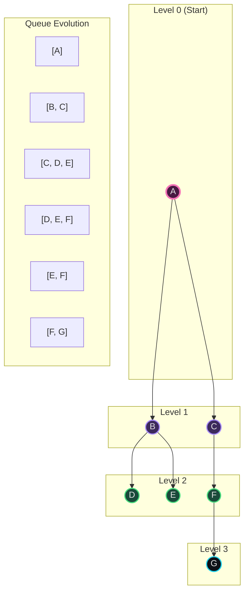
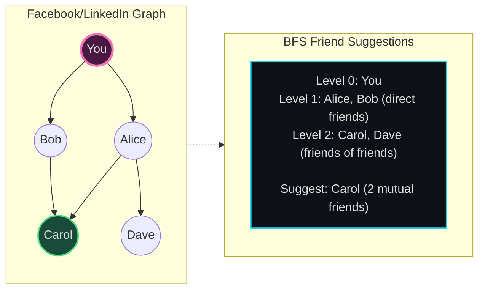
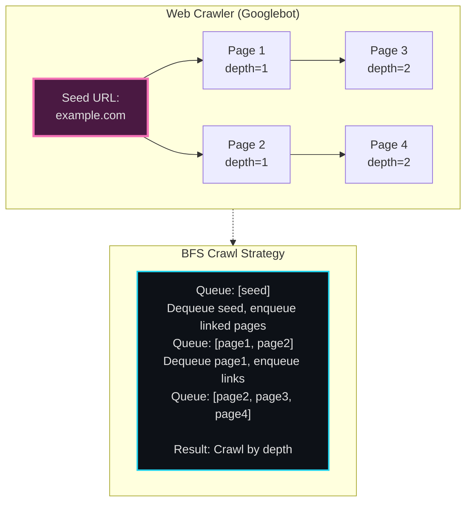

```mermaid
graph TB
    subgraph Internet["Internet Routing"]
        Router1[Your Router] --> Router2[ISP Router]
        Router1 --> Router3[Backup Route]
        Router2 --> Router4[Regional Hub]
        Router3 --> Router4
        Router4 --> Server[Target Server]
    end

    subgraph BFS["BFS Routing Algorithm"]
        A["Start: Your Router<br/>Level 1: ISP, Backup<br/>Level 2: Regional Hub<br/>Level 3: Target Server<br/><br/>Shortest: Your→ISP→Hub→Server (3 hops)"]
    end

    Internet -.-> BFS

    style Router1 fill:#4a1942,stroke:#f472b6,stroke-width:3px,color:#e0e0e0
    style Server fill:#1a4a3a,stroke:#4ade80,stroke-width:3px,color:#e0e0e0
    style A fill:#0d1117,stroke:#22d3ee,stroke-width:2px,color:#e0e0e0
```

```mermaid
graph TB
    subgraph Grid["2D Game Grid"]
        Start["🏁 Start"] --> A[⬜]
        Start --> B[⬜]
        A --> C[⬜]
        B --> C
        C --> Goal["🎯 Goal"]
    end

    subgraph BFS["BFS Pathfinding"]
        D["Level 0: Start<br/>Level 1: Adjacent cells<br/>Level 2: 2 steps away<br/>...<br/>First reach Goal = shortest path"]
    end

    Grid -.-> BFS

    style Start fill:#4a1942,stroke:#f472b6,stroke-width:3px,color:#e0e0e0
    style Goal fill:#1a4a3a,stroke:#4ade80,stroke-width:3px,color:#e0e0e0
    style D fill:#0d1117,stroke:#22d3ee,stroke-width:2px,color:#e0e0e0
```

# BFS (Breadth-First Search) - Senior Engineer Thoughts

*The 4-stage mental pipeline: Problem → Pattern → Structure → Behavior → Code*

---

## Stage 1: Problem → Pattern (Recognition)

> "BFS is my immediate reach when I see **'shortest path'**, **'minimum steps'**, or **'level-by-level'** in an unweighted graph/tree. The key trigger: do I care about ALL nodes at distance K before ANY node at distance K+1?"

**Recognition keywords:**
- "**Shortest path**" in unweighted graph
- "**Minimum number of steps/moves**"
- "**Level-order traversal**" of tree
- "**Nearest/closest**" node/cell
- "All nodes at distance K"
- "Layer-by-layer expansion"

**Mental model:**
> "BFS is like a ripple in water: it expands outward from the source in waves. Level 0 (start), then all level 1 neighbors, then all level 2, etc. First time I reach a node is guaranteed to be the shortest path (for unweighted graphs)."

---

## Stage 2: Pattern → Structure (What do I need?)

> "BFS structure is about maintaining the frontier of exploration:"

**Structure inventory:**
- **Queue**: FIFO data structure (deque in Python, Queue in Java)
- **Visited set**: Track which nodes we've already explored (prevent cycles)
- **Distance/level tracker**: Optional, for tracking depth or path length
- **Parent map**: Optional, for reconstructing the path

> "The queue is essential - it ensures level-order processing. Process all nodes at level K before enqueueing any from level K+1."

---

## Stage 3: Structure → Behavior (How does it move?)

> "BFS behavior is methodical wave expansion:"

**Movement rules:**
1. Start: Add source to queue, mark as visited
2. Loop while queue not empty:
   - Dequeue front node
   - Process it (add to result, check if goal, etc.)
   - Enqueue all unvisited neighbors
   - Mark neighbors as visited
3. Stop: Queue empty (explored all reachable nodes) OR found target

**Key invariant:**
> "At any point, the queue contains only nodes from at most 2 consecutive levels. If I'm processing level K, the queue has remaining level K nodes + newly discovered level K+1 nodes."

---

## Visual Model

### BFS Wave Expansion



### Shortest Path Guarantee

```mermaid
flowchart LR
    subgraph Unweighted["Unweighted Graph"]
        S((Start)) -->|1| A((A))
        S -->|1| B((B))
        A -->|1| C((C))
        B -->|1| C
        C -->|1| Goal((Goal))
    end

    subgraph BFS["BFS Exploration"]
        E["Level 0: Start<br/>Level 1: A, B<br/>Level 2: C (first visit from A)<br/>Level 3: Goal<br/><br/>Shortest path: Start→A→C→Goal (3 steps)"]
    end

    Unweighted -.-> BFS

    style S fill:#4a1942,stroke:#f472b6,stroke-width:3px,color:#e0e0e0
    style Goal fill:#1a4a3a,stroke:#4ade80,stroke-width:3px,color:#e0e0e0
    style E fill:#0d1117,stroke:#22d3ee,stroke-width:2px,color:#e0e0e0
```



---

## Stage 4: Behavior → Code (Expression)

### Verbose Form: BFS on Graph

```python
from collections import deque
from typing import List, Set, Dict, Optional

class BreadthFirstSearch:
    def __init__(self, graph: Dict[str, List[str]]):
        self.graph = graph
        self.queue = deque()
        self.visited: Set[str] = set()
        self.distance: Dict[str, int] = {}
        self.parent: Dict[str, Optional[str]] = {}

    def _initialize(self, start: str):
        """Set up initial state for BFS."""
        self.queue.append(start)
        self.visited.add(start)
        self.distance[start] = 0
        self.parent[start] = None

    def _process_node(self, node: str):
        """Process current node (could be checking if goal, printing, etc.)."""
        print(f"Visiting {node} at distance {self.distance[node]}")

    def _get_unvisited_neighbors(self, node: str) -> List[str]:
        """Get neighbors that haven't been visited."""
        return [n for n in self.graph.get(node, []) if n not in self.visited]

    def _enqueue_neighbor(self, neighbor: str, current: str):
        """Add neighbor to queue and update metadata."""
        self.queue.append(neighbor)
        self.visited.add(neighbor)
        self.distance[neighbor] = self.distance[current] + 1
        self.parent[neighbor] = current

    def search(self, start: str) -> Dict[str, int]:
        """Perform BFS from start node."""
        self._initialize(start)

        while self.queue:
            current = self.queue.popleft()
            self._process_node(current)

            for neighbor in self._get_unvisited_neighbors(current):
                self._enqueue_neighbor(neighbor, current)

        return self.distance

    def reconstruct_path(self, target: str) -> List[str]:
        """Reconstruct shortest path to target."""
        if target not in self.parent:
            return []

        path = []
        current = target
        while current is not None:
            path.append(current)
            current = self.parent[current]
        return path[::-1]
```

### Terse Form

```python
from collections import deque

def bfs(graph: Dict[str, List[str]], start: str) -> Dict[str, int]:
    """BFS returning distances from start to all reachable nodes."""
    queue = deque([start])
    visited = {start}
    distance = {start: 0}

    while queue:
        current = queue.popleft()

        for neighbor in graph.get(current, []):
            if neighbor not in visited:
                queue.append(neighbor)
                visited.add(neighbor)
                distance[neighbor] = distance[current] + 1

    return distance
```

### Terse Form: Shortest Path

```python
def shortest_path_bfs(graph, start, target):
    """Find shortest path from start to target."""
    queue = deque([(start, [start])])  # (node, path_to_node)
    visited = {start}

    while queue:
        node, path = queue.popleft()

        if node == target:
            return path

        for neighbor in graph.get(node, []):
            if neighbor not in visited:
                queue.append((neighbor, path + [neighbor]))
                visited.add(neighbor)

    return None  # No path found
```

---

## Real World Use Cases

> "BFS isn't academic - it's how the internet finds routes, how social networks suggest friends, and how game AI pathfinds."

### 1. **Network Routing - Finding Shortest Paths**

**System Architecture:**


**Why BFS?**
> "Internet routing protocols (OSPF, IS-IS) use BFS-like algorithms to find shortest paths through routers. Each router hop has equal cost (unweighted graph), so BFS guarantees finding the minimum hop count path. When I `traceroute google.com`, I'm seeing the BFS path my packets take."

**Real-world usage:**
- **OSPF (Open Shortest Path First)**: Network protocol using Dijkstra (weighted BFS variant)
- **Traceroute command**: Shows hop-by-hop path (BFS exploration)
- **CDN routing**: Akamai/Cloudflare route requests to nearest edge server (BFS from user location)

---

### 2. **Social Network - Friend Suggestions / Degrees of Separation**

**System Architecture:**


**Why BFS?**
> "LinkedIn's 'People You May Know' runs BFS from your profile: Level 1 = direct connections, Level 2 = friends-of-friends (suggestions), Level 3 = less relevant. BFS guarantees I see closest connections first. Facebook's '6 degrees of separation' uses BFS to compute shortest path between any two users."

**Real-world usage:**
- **Friend/connection suggestions**: 2nd-degree connections prioritized
- **Mutual friends count**: BFS intersection of friend graphs
- **Influence propagation**: How fast does a post spread? (BFS wave of shares)

---

### 3. **Game AI - Pathfinding in Unweighted Grids**

**System Architecture:**


**Why BFS?**
> "Simple grid-based games (Pac-Man, Bomberman) use BFS for AI pathfinding when all moves have equal cost (1 tile = 1 move). BFS finds shortest path guaranteed. For weighted graphs (e.g., terrain types with different costs), I'd use Dijkstra instead. But pure grid? BFS is perfect."

**Real-world usage:**
- **Puzzle games**: Sokoban, sliding puzzles (find minimum moves)
- **Roguelikes**: Dungeon pathfinding when all tiles equal cost
- **Flood fill**: Paint bucket tool in Photoshop/GIMP (BFS from click point)

---

### 4. **Web Crawler - Layer-by-Layer Site Crawling**

**System Architecture:**


**Why BFS?**
> "Google's crawler uses BFS to explore the web graph. Start from seed URLs, explore all pages at depth 1 (direct links from seed), then depth 2, etc. This ensures I don't get lost infinitely deep in one site before checking others. BFS gives breadth-first coverage."

**Real-world usage:**
- **Search engine crawlers**: Googlebot, Bingbot (BFS with priority queue)
- **Site mappers**: Screaming Frog SEO spider
- **Broken link checkers**: Traverse site BFS, check all links

---

### 5. **Dependency Resolution - Package Managers**

**System Architecture:**
```mermaid
graph TB
    subgraph Packages["NPM/Pip Dependency Graph"]
        AppA[my-app] --> LibB[express@4.0]
        AppA --> LibC[lodash@4.17]
        LibB --> LibD[body-parser@1.20]
        LibC --> LibD
    end

    subgraph Install["BFS Installation Order"]
        Order["Level 0: my-app<br/>Level 1: express, lodash<br/>Level 2: body-parser<br/><br/>Install order: dependencies before dependents"]
    end

    Packages -.-> Install

    style AppA fill:#4a1942,stroke:#f472b6,stroke-width:3px,color:#e0e0e0
    style LibD fill:#1a4a3a,stroke:#4ade80,stroke-width:2px,color:#e0e0e0
    style Order fill:#0d1117,stroke:#22d3ee,stroke-width:2px,color:#e0e0e0
```

**Why BFS?**
> "When `npm install` resolves dependencies, it uses BFS to determine install order. My app depends on express and lodash (level 1), which depend on body-parser (level 2). BFS ensures I install dependencies level-by-level: body-parser before express. This guarantees no circular issues and correct order."

**Real-world usage:**
- **npm/yarn/pnpm**: Dependency resolution and flattening
- **pip/poetry**: Python package installation order
- **Docker layer builds**: Base images before derived images

---

### Why This Matters for Full-Stack Engineers

> "BFS shows up whenever I need shortest/minimum in unweighted scenarios:"

- **Frontend**: DOM traversal (querySelector BFS), React component tree debugging
- **Backend**: API rate limiting (BFS through user request graph), caching strategies
- **Databases**: Graph databases (Neo4j shortest path queries use BFS)
- **DevOps**: Dependency graphs for build systems, deployment ordering
- **Networks**: Routing, load balancing, service discovery

> "The pattern: 'What's the nearest X?' or 'minimum steps to reach Y?' → BFS. It's not just graphs - it's any problem where I explore options level-by-level."

---

## Self-Check Questions

1. **Can I explain why BFS finds shortest paths?** Level-order guarantee: first reach = shortest.
2. **Do I know when NOT to use BFS?** Weighted graphs (use Dijkstra), deep trees with specific target (DFS might be faster).
3. **Can I implement BFS without the code?** Draw the queue states, visited set, show level-by-level exploration.
4. **Can I identify BFS in production systems?** Routing, crawling, friend suggestions, dependency resolution.
5. **Can I modify BFS for variants?** Bidirectional BFS, multi-source BFS, BFS with constraints.

---

## Common Variations

- **Standard BFS**: Find shortest path in unweighted graph
- **Multi-source BFS**: Start from multiple nodes simultaneously (e.g., "nearest exit from any position")
- **Bidirectional BFS**: Search from both start and goal, meet in middle (optimize for single-target)
- **BFS with level tracking**: Return nodes at specific depth K
- **0-1 BFS**: Edges have weight 0 or 1 (use deque, add weight-0 edges to front)

> "BFS is the foundation. Once I understand the queue-based level-order exploration, all variants are just modifications of the core pattern."

---

## LeetCode Practice Problems

| # | Problem | Difficulty |
|---|---------|------------|
| 102 | [Binary Tree Level Order Traversal](https://leetcode.com/problems/binary-tree-level-order-traversal/) | Medium |
| 103 | [Binary Tree Zigzag Level Order Traversal](https://leetcode.com/problems/binary-tree-zigzag-level-order-traversal/) | Medium |
| 127 | [Word Ladder](https://leetcode.com/problems/word-ladder/) | Medium |
| 200 | [Number of Islands](https://leetcode.com/problems/number-of-islands/) | Medium |
| 207 | [Course Schedule](https://leetcode.com/problems/course-schedule/) | Medium |
| 210 | [Course Schedule II](https://leetcode.com/problems/course-schedule-ii/) | Medium |
| 317 | [Shortest Distance from All Buildings](https://leetcode.com/problems/shortest-distance-from-all-buildings/) | Medium |
| 433 | [Minimum Genetic Mutation](https://leetcode.com/problems/minimum-genetic-mutation/) | Medium |
| 542 | [01 Matrix](https://leetcode.com/problems/01-matrix/) | Medium |
| 785 | [Is Graph Bipartite?](https://leetcode.com/problems/is-graph-bipartite/) | Medium |
| 994 | [Rotting Oranges](https://leetcode.com/problems/rotting-oranges/) | Medium |
| 1091 | [Shortest Path in Binary Matrix](https://leetcode.com/problems/shortest-path-in-binary-matrix/) | Medium |
| 126 | [Word Ladder II](https://leetcode.com/problems/word-ladder-ii/) | Hard |
| 773 | [Sliding Puzzle](https://leetcode.com/problems/sliding-puzzle/) | Hard |
| 847 | [Shortest Path Visiting All Nodes](https://leetcode.com/problems/shortest-path-visiting-all-nodes/) | Hard |
| 864 | [Shortest Path to Get All Keys](https://leetcode.com/problems/shortest-path-to-get-all-keys/) | Hard |
| 1298 | [Maximum Candies You Can Get from Boxes](https://leetcode.com/problems/maximum-candies-you-can-get-from-boxes/) | Hard |
| 1345 | [Jump Game IV](https://leetcode.com/problems/jump-game-iv/) | Hard |
---
