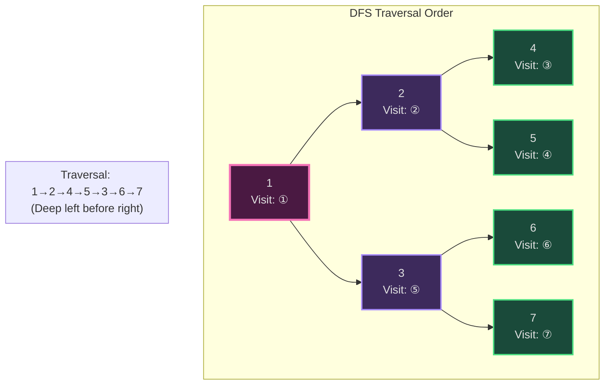
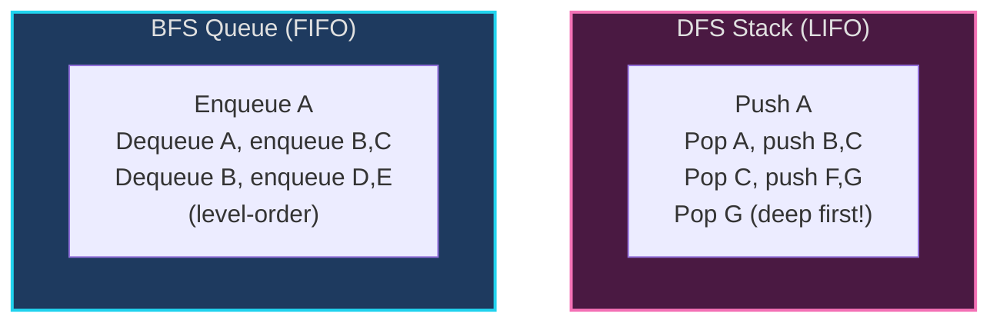
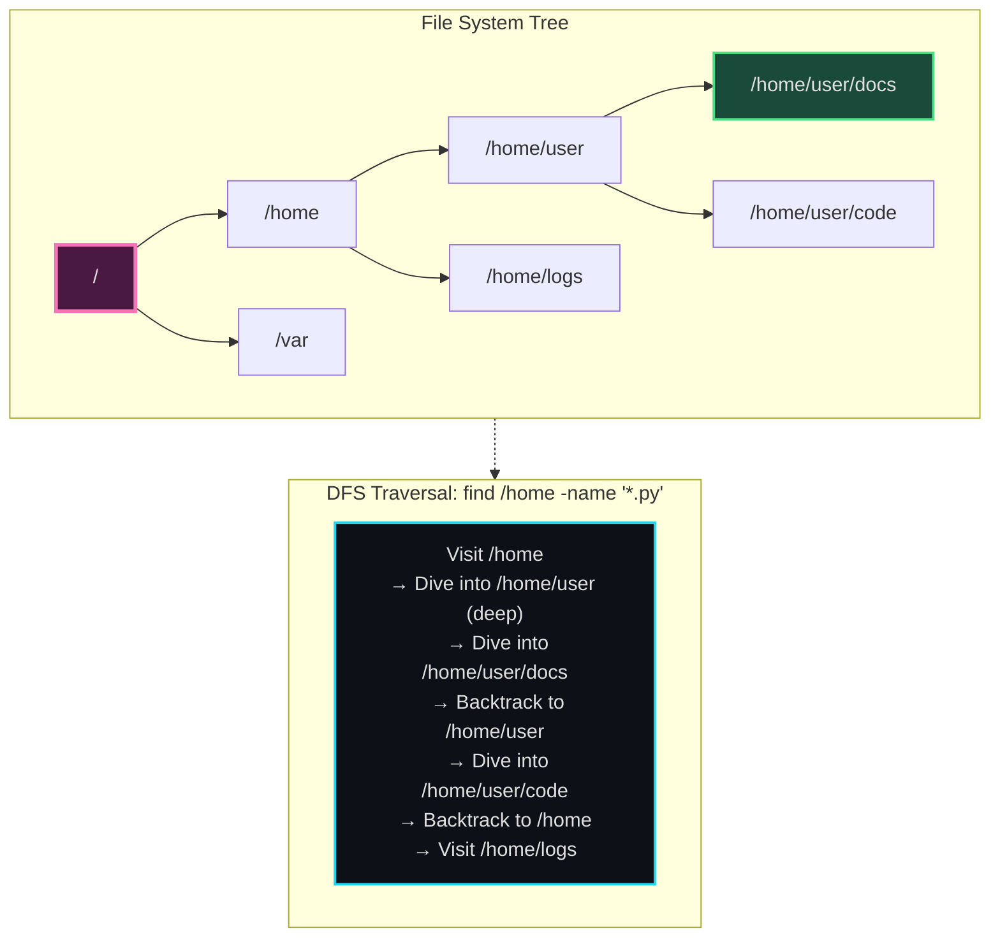
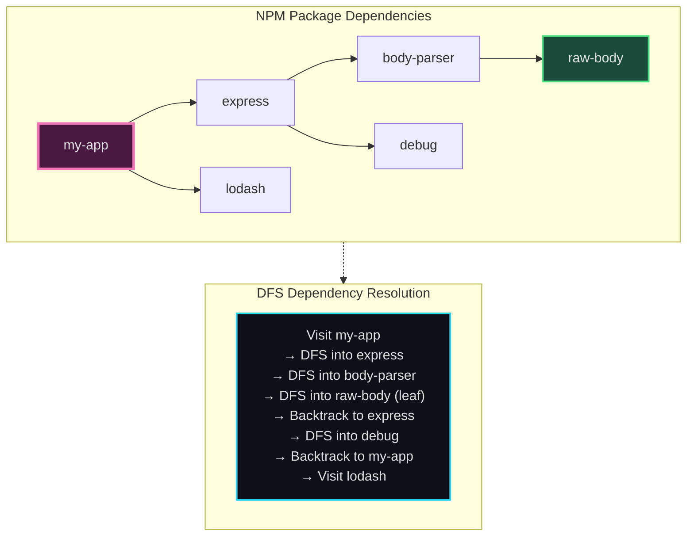
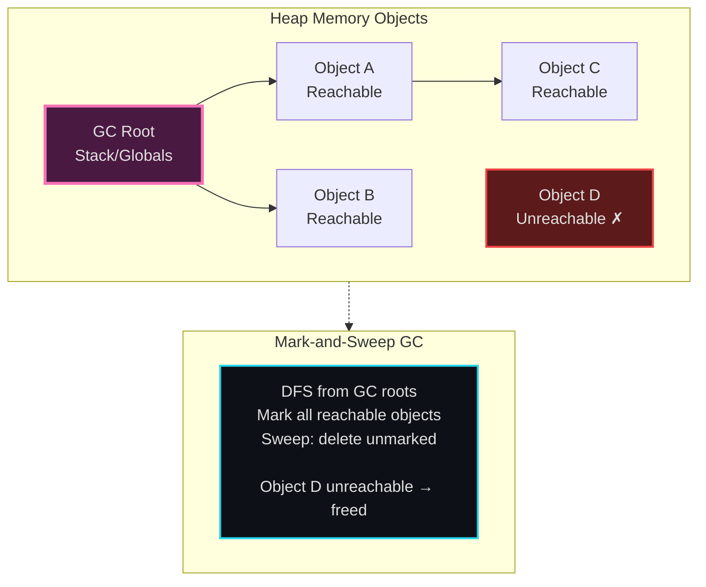
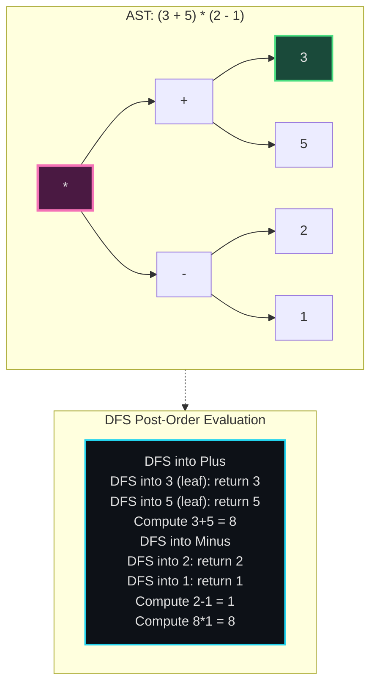
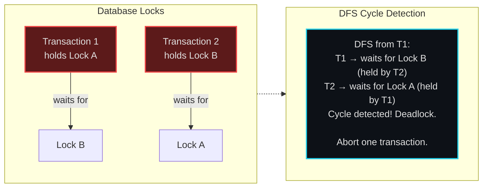

# DFS (Depth-First Search) - Senior Engineer Thoughts

*The 4-stage mental pipeline: Problem → Pattern → Structure → Behavior → Code*

---

## Stage 1: Problem → Pattern (Recognition)

> "DFS is my reach when I need to **explore all paths**, **find any valid solution**, or when the problem has a **tree/graph structure with deep exploration**. The trigger: do I need to go deep before going wide?"

**Recognition keywords:**
- "**Find all paths**" from A to B
- "**Detect cycles**" in directed graph
- "**Connected components**"
- "Topological sort" (DFS-based)
- "**Path exists**" or "check reachability"
- "Explore all possibilities" (backtracking uses DFS)
- "Validate tree structure"

**Mental model:**
> "DFS is like exploring a maze: follow one path all the way to a dead-end before backing up and trying another. BFS explores level-by-level; DFS explores depth-by-depth. Use DFS when I need exhaustive search or when the answer might be deep in the tree."

**DFS vs BFS decision:**
> "BFS: shortest path, level-order, minimum steps. DFS: all paths, existence check, deep exploration, memory-efficient for deep trees."

---

## Stage 2: Pattern → Structure (What do I need?)

**Structure inventory:**
- **Stack**: Implicit (recursion call stack) or explicit (iterative DFS)
- **Visited set**: Track which nodes already explored (prevent infinite loops)
- **Path tracker**: Optional, for recording current path
- **Result collector**: For gathering all paths, components, etc.

> "Recursive DFS is cleaner (uses call stack). Iterative DFS gives more control (explicit stack). Both are DFS - same traversal order."

---

## Stage 3: Structure → Behavior (How does it move?)

**Recursive DFS behavior:**
```
def dfs(node):
    if node is None or node in visited:
        return

    visited.add(node)
    process(node)  # Do work on current node

    for neighbor in get_neighbors(node):
        dfs(neighbor)  # Recurse deeply before visiting siblings
```

**Iterative DFS behavior:**
```
stack = [start]
visited = set()

while stack:
    node = stack.pop()  # LIFO (Last In First Out)

    if node in visited:
        continue

    visited.add(node)
    process(node)

    for neighbor in get_neighbors(node):
        if neighbor not in visited:
            stack.append(neighbor)
```

**Key invariant:**
> "DFS explores one branch completely before backtracking. The stack (implicit or explicit) tracks the current path from root to current node. When I backtrack, I'm popping from the stack."

---

## Visual Model

### DFS Traversal Order



### DFS vs BFS Comparison



---

## Stage 4: Behavior → Code (Expression)

### Verbose Form: Recursive DFS

```python
from typing import List, Set, Dict, Callable

class RecursiveDFS:
    def __init__(self, graph: Dict[str, List[str]]):
        self.graph = graph
        self.visited: Set[str] = set()
        self.path: List[str] = []
        self.all_paths: List[List[str]] = []

    def _is_visited(self, node: str) -> bool:
        """Check if node already visited."""
        return node in self.visited

    def _mark_visited(self, node: str):
        """Mark node as visited."""
        self.visited.add(node)

    def _unmark_visited(self, node: str):
        """Unmark node (for backtracking)."""
        self.visited.remove(node)

    def _add_to_path(self, node: str):
        """Add node to current path."""
        self.path.append(node)

    def _remove_from_path(self):
        """Remove last node from path (backtrack)."""
        self.path.pop()

    def _get_neighbors(self, node: str) -> List[str]:
        """Get unvisited neighbors of node."""
        return self.graph.get(node, [])

    def _process_node(self, node: str):
        """Process current node (e.g., print, check condition)."""
        print(f"Visiting {node}")

    def dfs(self, node: str):
        """Perform DFS from node."""
        if self._is_visited(node):
            return

        self._mark_visited(node)
        self._add_to_path(node)
        self._process_node(node)

        for neighbor in self._get_neighbors(node):
            self.dfs(neighbor)  # Recursive call goes DEEP

        # Backtrack (for path-finding problems)
        self._remove_from_path()

    def find_all_paths(self, start: str, target: str):
        """Find all paths from start to target."""
        if start == target:
            self.all_paths.append(self.path[:])  # Copy current path
            return

        self._mark_visited(start)
        self._add_to_path(start)

        for neighbor in self._get_neighbors(start):
            if not self._is_visited(neighbor):
                self.find_all_paths(neighbor, target)

        # Backtrack: unmark and remove to explore other paths
        self._unmark_visited(start)
        self._remove_from_path()
```

### Terse Form: Recursive DFS

```python
def dfs(graph: Dict[str, List[str]], node: str, visited: Set[str] = None):
    """Simple DFS traversal."""
    if visited is None:
        visited = set()

    if node in visited:
        return

    visited.add(node)
    print(f"Visit {node}")

    for neighbor in graph.get(node, []):
        dfs(graph, neighbor, visited)
```

### Terse Form: Find All Paths (DFS with Backtracking)

```python
def find_all_paths(graph, start, target, path=None, visited=None):
    """Find all paths from start to target using DFS."""
    if path is None:
        path = []
    if visited is None:
        visited = set()

    path.append(start)
    visited.add(start)

    if start == target:
        yield path[:]  # Yield copy of current path

    for neighbor in graph.get(start, []):
        if neighbor not in visited:
            yield from find_all_paths(graph, neighbor, target, path, visited)

    # Backtrack
    path.pop()
    visited.remove(start)
```

### Verbose Form: Iterative DFS

```python
class IterativeDFS:
    def __init__(self, graph: Dict[str, List[str]]):
        self.graph = graph
        self.stack: List[str] = []
        self.visited: Set[str] = set()

    def _push_to_stack(self, node: str):
        """Add node to stack."""
        self.stack.append(node)

    def _pop_from_stack(self) -> str:
        """Remove and return top of stack."""
        return self.stack.pop()

    def _is_stack_empty(self) -> bool:
        """Check if stack is empty."""
        return len(self.stack) == 0

    def dfs(self, start: str):
        """Perform iterative DFS."""
        self._push_to_stack(start)

        while not self._is_stack_empty():
            node = self._pop_from_stack()

            if node in self.visited:
                continue

            self.visited.add(node)
            print(f"Visit {node}")

            # Push neighbors in reverse order for left-to-right traversal
            for neighbor in reversed(self.graph.get(node, [])):
                if neighbor not in self.visited:
                    self._push_to_stack(neighbor)
```

### Terse Form: Iterative DFS

```python
def dfs_iterative(graph: Dict[str, List[str]], start: str):
    """Iterative DFS using explicit stack."""
    stack = [start]
    visited = set()

    while stack:
        node = stack.pop()

        if node in visited:
            continue

        visited.add(node)
        print(f"Visit {node}")

        for neighbor in graph.get(node, []):
            if neighbor not in visited:
                stack.append(neighbor)
```

---

## Real World Use Cases

> "DFS is everywhere deep exploration is needed - from file systems to dependency resolution to compiler optimizations."

### 1. **File System Traversal - `find` command**

**System Architecture:**


**Why DFS?**
> "The `find` command uses DFS: dive deep into each directory before moving to siblings. Why not BFS? Memory. DFS only needs to track the current path (stack = current directory depth). BFS would need to keep ALL files at current level in memory. For deep directory trees, DFS is more memory-efficient."

**Real-world usage:**
```bash
find /var/log -name "*.log" -type f  # DFS through directories
du -sh /home/*                        # DFS to calculate sizes
tree /project                         # DFS directory visualization
```

---

### 2. **Dependency Resolution - Build Systems**

**System Architecture:**


**Why DFS?**
> "npm install uses DFS to resolve dependencies: start with my package, DFS into each dependency, recursively resolve sub-dependencies. DFS ensures I install leaf dependencies (no further deps) before their parents. This is why node_modules has nested structure - it's literally a DFS traversal."

**Real-world usage:**
- **npm/yarn**: Dependency tree resolution
- **Python pip**: Package installation order
- **Makefile**: Build targets (compile dependencies before main)
- **Webpack/Rollup**: Module bundling (resolve imports DFS-style)

---

### 3. **Garbage Collection - Reference Tracing**

**System Architecture:**


**Why DFS?**
> "Garbage collectors (Java, Python, JavaScript) use DFS for mark-and-sweep: start from GC roots (stack, globals), DFS through all object references, mark reachable objects. After DFS completes, any unmarked object is garbage. DFS is memory-efficient - only tracks current path, not all objects at current 'level'."

**Real-world usage:**
- **JVM garbage collection**: Mark-and-sweep, tri-color marking
- **Python reference counting**: Cycle detection via DFS
- **JavaScript V8**: Scavenger and mark-sweep collectors

---

### 4. **Compiler - Abstract Syntax Tree (AST) Evaluation**

**System Architecture:**


**Why DFS?**
> "Compilers use DFS (post-order) to evaluate ASTs: evaluate children before parent. To compute `*`, I need values of its children first. DFS recursively evaluates subtrees, returns results bottom-up. This is why recursive interpreters naturally use DFS."

**Real-world usage:**
- **JavaScript/Python interpreters**: AST evaluation
- **SQL query optimizers**: Query plan tree traversal
- **Template engines**: Jinja2, Handlebars (DFS through template AST)

---

### 5. **Cycle Detection - Deadlock Detection**

**System Architecture:**


**Why DFS?**
> "Databases use DFS to detect deadlocks: build a wait-for graph (T1 waits for T2, etc.), run DFS looking for cycles. If DFS encounters a node already in the current path (stack), there's a cycle = deadlock. Abort one transaction to break the cycle."

**Real-world usage:**
- **PostgreSQL/MySQL**: Deadlock detection in transaction manager
- **Operating systems**: Resource allocation graph cycle detection
- **Distributed systems**: Distributed deadlock detection

---

### 6. **React Component Tree - Deep Updates**

**System:**
- **Problem**: Component state changes deep in tree, need to re-render path from root to changed component
- **Behavior**: DFS from root, follow path to changed component, re-render along the way
- **Tool**: React reconciliation algorithm (fiber architecture)

> "React's reconciliation uses DFS: when state changes deep in component tree, React DFS traverses from root to find the changed component, marks the path dirty, re-renders only affected branch. Why DFS? Because component trees can be deep, and DFS is memory-efficient."

---

### Why This Matters for Full-Stack Engineers

> "DFS is my default for deep exploration and backtracking:"

- **Frontend**: Component tree traversal, form validation with nested fields
- **Backend**: File system operations, dependency resolution, recursive data structures
- **Databases**: Query plan execution, index tree traversal
- **DevOps**: Configuration tree processing, infrastructure-as-code DAG traversal
- **Algorithms**: Backtracking problems (all rely on DFS)

> "The pattern: when I need to explore ALL possibilities, go DEEP before WIDE, or work with recursive structures, I reach for DFS. It's the foundation of backtracking and many graph algorithms."

---

## Self-Check Questions

1. **Can I implement DFS both recursively and iteratively?** Recursive is cleaner, iterative gives more control.
2. **Do I know when to use DFS vs BFS?** DFS: all paths, deep exploration. BFS: shortest path, level-order.
3. **Can I handle cycle detection?** Track nodes in current path (not just visited).
4. **Can I do backtracking?** Unmark/remove when backtracking for path-finding.
5. **Can I identify DFS in production?** File traversal, dependency resolution, GC, compilers.

---

## Common Variations

- **Pre-order DFS**: Process node before children (tree serialization)
- **Post-order DFS**: Process node after children (expression evaluation)
- **DFS with backtracking**: Unmark visited for finding ALL paths
- **Cycle detection**: Track current path separately from visited
- **Topological sort**: DFS with post-order stack

> "DFS is the workhorse of graph algorithms. Master the recursive and iterative forms, understand backtracking, and recognize when deep exploration is what you need."

---

## LeetCode Practice Problems

| # | Problem | Difficulty |
|---|---------|------------|
| 130 | [Surrounded Regions](https://leetcode.com/problems/surrounded-regions/) | Medium |
| 133 | [Clone Graph](https://leetcode.com/problems/clone-graph/) | Medium |
| 200 | [Number of Islands](https://leetcode.com/problems/number-of-islands/) | Medium |
| 417 | [Pacific Atlantic Water Flow](https://leetcode.com/problems/pacific-atlantic-water-flow/) | Medium |
| 529 | [Minesweeper](https://leetcode.com/problems/minesweeper/) | Medium |
| 547 | [Number of Provinces](https://leetcode.com/problems/number-of-provinces/) | Medium |
| 695 | [Max Area of Island](https://leetcode.com/problems/max-area-of-island/) | Medium |
| 785 | [Is Graph Bipartite?](https://leetcode.com/problems/is-graph-bipartite/) | Medium |
| 841 | [Keys and Rooms](https://leetcode.com/problems/keys-and-rooms/) | Medium |
| 1020 | [Number of Enclaves](https://leetcode.com/problems/number-of-enclaves/) | Medium |
| 1162 | [As Far from Land as Possible](https://leetcode.com/problems/as-far-from-land-as-possible/) | Medium |
| 301 | [Remove Invalid Parentheses](https://leetcode.com/problems/remove-invalid-parentheses/) | Hard |
| 329 | [Longest Increasing Path in a Matrix](https://leetcode.com/problems/longest-increasing-path-in-a-matrix/) | Hard |
| 332 | [Reconstruct Itinerary](https://leetcode.com/problems/reconstruct-itinerary/) | Hard |
| 980 | [Unique Paths III](https://leetcode.com/problems/unique-paths-iii/) | Hard |
| 1192 | [Critical Connections in a Network](https://leetcode.com/problems/critical-connections-in-a-network/) | Hard |
| 1719 | [Number Of Ways To Reconstruct A Tree](https://leetcode.com/problems/number-of-ways-to-reconstruct-a-tree/) | Hard |
---
