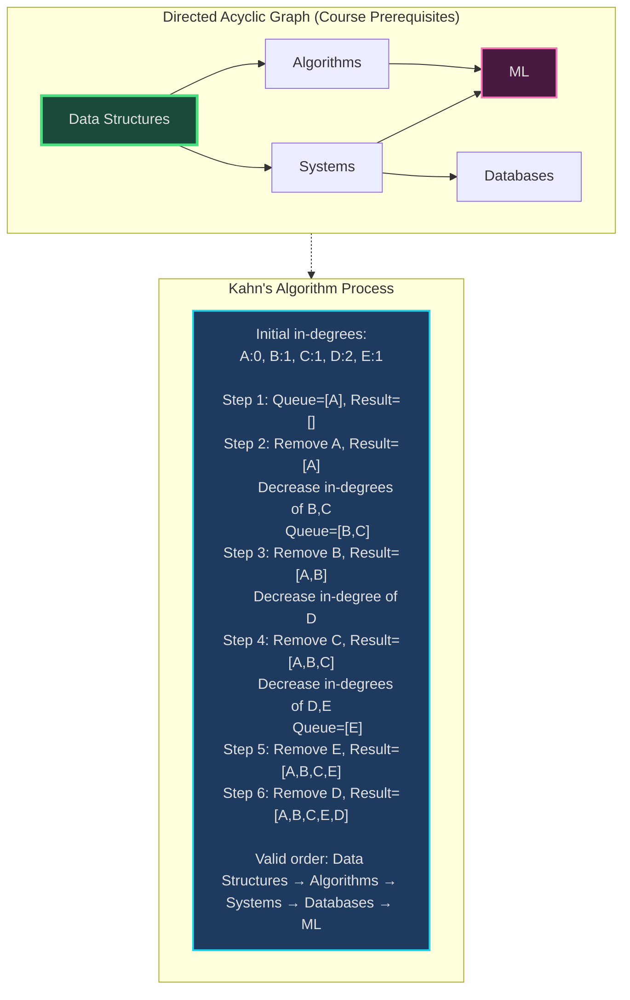
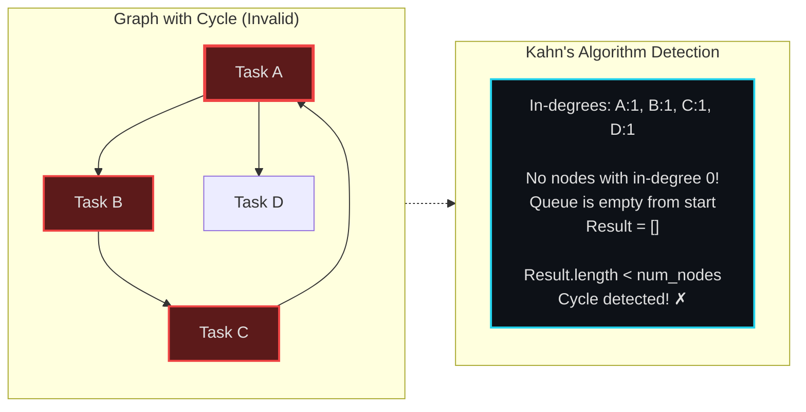
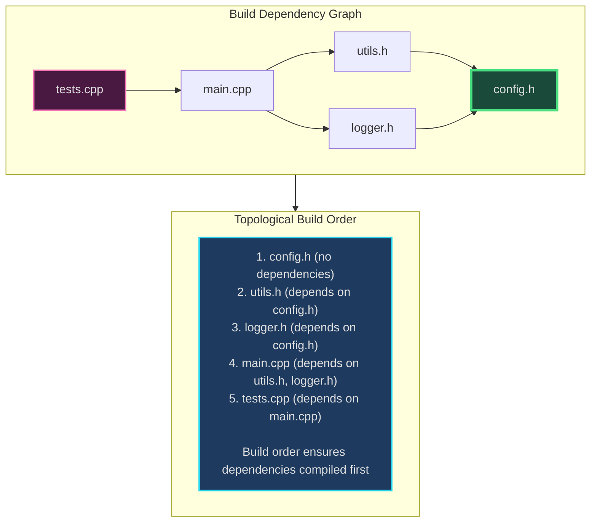
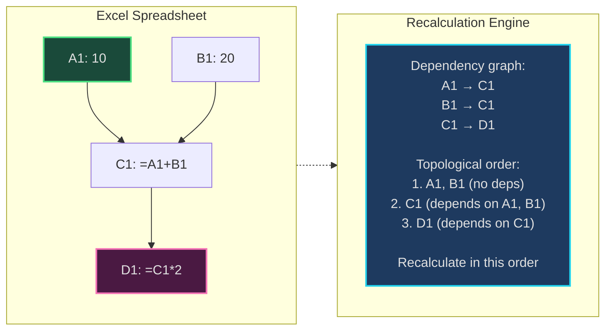
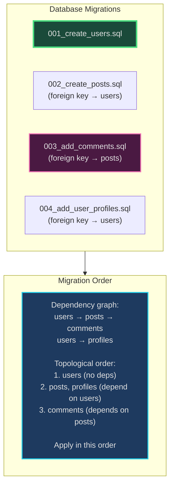

# Topological Sort - Senior Engineer Thoughts

*The 4-stage mental pipeline: Problem → Pattern → Structure → Behavior → Code*

---

## Stage 1: Problem → Pattern (Recognition)

> "Topological Sort is my reach when I see **'dependencies'**, **'task ordering'**, or **'course prerequisites'**. The trigger: do I need to order tasks where some must come before others?"

**Recognition keywords:**
- "**Task scheduling** with dependencies"
- "**Course prerequisites**" (take A before B)
- "**Build order**" for modules/packages
- "**Directed Acyclic Graph (DAG)**"
- "**Dependency resolution**"
- "Detect if ordering is possible"
- "Find valid execution sequence"

**Mental model:**
> "Topological sort creates a linear ordering of a DAG's vertices where for every directed edge (u,v), u comes before v. It's like scheduling tasks where you can't do B until A is done. Two approaches: DFS (reverse postorder) or Kahn's algorithm (BFS with in-degrees)."

**Key insight:**
> "Only DAGs can be topologically sorted. If there's a cycle, no valid ordering exists—that's circular dependency! Topological sort doubles as cycle detection."

---

## Stage 2: Pattern → Structure (What do I need?)

**Structure inventory:**
- **Adjacency list**: Graph representation (dependencies)
- **In-degree array**: Count of incoming edges for each node (Kahn's algorithm)
- **Queue**: For nodes with in-degree 0 (ready to process)
- **Stack / Result list**: For the final topological order
- **Visited set**: For DFS approach to detect cycles and track completion

> "Kahn's algorithm: Track in-degrees, repeatedly remove nodes with in-degree 0. DFS approach: Recursively visit nodes, add to result in postorder (then reverse). Both O(V+E)."

---

## Stage 3: Structure → Behavior (How does it move?)

**Kahn's Algorithm (BFS-based):**
```
1. Calculate in-degree for all nodes
2. Queue all nodes with in-degree 0 (no dependencies)
3. While queue not empty:
   - Remove node from queue
   - Add to result
   - For each neighbor:
     - Decrease its in-degree
     - If in-degree becomes 0, add to queue
4. If result has fewer nodes than graph: cycle detected!
```

**DFS Approach:**
```
1. For each unvisited node:
   - DFS recursively
   - Mark as visiting (detect cycles)
   - After visiting all neighbors, mark as visited
   - Add to stack (postorder)
2. Reverse stack for topological order
```

**Key invariant:**
> "In Kahn's: at each step, nodes in queue have no remaining dependencies. In DFS: when we finish a node, all its dependencies are already in the result."

---

## Visual Model

### Topological Sort - Course Prerequisites



### Cycle Detection



---

## Stage 4: Behavior → Code (Expression)

### Verbose Form: Kahn's Algorithm

```python
from typing import List, Dict
from collections import deque

class TopologicalSorter:
    def __init__(self, num_nodes: int, edges: List[List[int]]):
        self.num_nodes = num_nodes
        self.graph: Dict[int, List[int]] = {i: [] for i in range(num_nodes)}
        self.in_degree = [0] * num_nodes
        self._build_graph(edges)

    def _build_graph(self, edges: List[List[int]]):
        """Build adjacency list and calculate in-degrees."""
        for u, v in edges:
            self.graph[u].append(v)
            self.in_degree[v] += 1

    def _get_nodes_with_no_dependencies(self) -> deque:
        """Get all nodes with in-degree 0."""
        return deque([i for i in range(self.num_nodes) if self.in_degree[i] == 0])

    def _process_node(self, node: int):
        """Decrease in-degree for all neighbors of processed node."""
        for neighbor in self.graph[node]:
            self.in_degree[neighbor] -= 1

    def _is_neighbor_ready(self, neighbor: int) -> bool:
        """Check if neighbor has no remaining dependencies."""
        return self.in_degree[neighbor] == 0

    def _has_cycle(self, result: List[int]) -> bool:
        """Check if result contains all nodes (no cycle)."""
        return len(result) != self.num_nodes

    def sort(self) -> List[int]:
        """Return topological order, or empty list if cycle detected."""
        queue = self._get_nodes_with_no_dependencies()
        result = []

        while queue:
            node = queue.popleft()
            result.append(node)

            self._process_node(node)

            # Add newly ready nodes to queue
            for neighbor in self.graph[node]:
                if self._is_neighbor_ready(neighbor):
                    queue.append(neighbor)

        if self._has_cycle(result):
            return []  # Cycle detected

        return result
```

### Terse Form: Kahn's Algorithm

```python
from collections import deque

def topological_sort(num_nodes: int, edges: List[List[int]]) -> List[int]:
    # Build graph and in-degree array
    graph = {i: [] for i in range(num_nodes)}
    in_degree = [0] * num_nodes

    for u, v in edges:
        graph[u].append(v)
        in_degree[v] += 1

    # Start with nodes that have no dependencies
    queue = deque([i for i in range(num_nodes) if in_degree[i] == 0])
    result = []

    while queue:
        node = queue.popleft()
        result.append(node)

        # Reduce in-degree for neighbors
        for neighbor in graph[node]:
            in_degree[neighbor] -= 1
            if in_degree[neighbor] == 0:
                queue.append(neighbor)

    # If result doesn't contain all nodes, there's a cycle
    return result if len(result) == num_nodes else []
```

### Terse Form: DFS Approach

```python
def topological_sort_dfs(num_nodes: int, edges: List[List[int]]) -> List[int]:
    graph = {i: [] for i in range(num_nodes)}
    for u, v in edges:
        graph[u].append(v)

    visited = [False] * num_nodes
    visiting = [False] * num_nodes
    result = []

    def dfs(node):
        if visiting[node]:  # Cycle detected
            return False
        if visited[node]:
            return True

        visiting[node] = True
        for neighbor in graph[node]:
            if not dfs(neighbor):
                return False

        visiting[node] = False
        visited[node] = True
        result.append(node)  # Postorder
        return True

    for i in range(num_nodes):
        if not visited[i]:
            if not dfs(i):
                return []  # Cycle detected

    return result[::-1]  # Reverse postorder
```

### Usage Example: Course Schedule

```python
def canFinish(numCourses: int, prerequisites: List[List[int]]) -> bool:
    """LeetCode 207: Course Schedule"""
    return len(topological_sort(numCourses, prerequisites)) == numCourses

def findOrder(numCourses: int, prerequisites: List[List[int]]) -> List[int]:
    """LeetCode 210: Course Schedule II"""
    return topological_sort(numCourses, prerequisites)
```

---

## Real World Use Cases

> "Topological sort is everywhere you have dependencies and need ordering—from build systems to package managers to task schedulers."

### 1. **Build Systems - Compilation Order**

**System Architecture:**


**Why topological sort?**
> "Make, CMake, Bazel use topological sort to determine compilation order. If file A includes B.h, B must be compiled first. Build systems construct dependency graph, topologically sort it, compile in that order. Detects circular dependencies (header A includes B, B includes A = compile error)."

**Real-world usage:**
- **Make/CMake**: Dependency resolution for C/C++ builds
- **Bazel/Buck**: Large-scale build orchestration
- **Webpack/Rollup**: JavaScript module bundling order

---

### 2. **Package Managers - Dependency Resolution**

**System Architecture:**
```mermaid
sequenceDiagram
    participant User
    participant npm
    participant TopoSort as Topological Sorter
    participant Installer

    User->>npm: npm install
    npm->>TopoSort: Build dependency graph<br/>(package.json dependencies)
    TopoSort->>TopoSort: Topological sort<br/>Detect circular dependencies
    alt No Cycles
        TopoSort-->>npm: Install order: [A, B, C, D]
        npm->>Installer: Install in topological order
        Installer-->>User: ✓ Installation complete
    else Circular Dependency
        TopoSort-->>npm: Cycle detected: A→B→C→A
        npm-->>User: ❌ Error: Circular dependency
    end

    style TopoSort fill:#1e3a5f,stroke:#22d3ee,stroke-width:2px
```

**Why topological sort?**
> "npm, pip, apt-get use topological sort to install packages in correct order. If package A depends on B, B must be installed first. Package managers build dependency graph from manifest files (package.json, requirements.txt), topologically sort, install in that order. Cycle detection prevents infinite loops."

**Real-world usage:**
- **npm/yarn**: JavaScript package installation
- **pip**: Python package dependencies
- **apt/yum**: Linux package management
- **Maven/Gradle**: Java build tools

---

### 3. **Task Schedulers - Job Ordering**

**System:**
- **Problem**: Distributed tasks with dependencies (task B needs output of task A)
- **Behavior**: Build task dependency DAG, topologically sort, execute in order
- **Tool**: Apache Airflow, Luigi, Celery workflows

> "Apache Airflow schedules data pipelines: extract → transform → load (ETL). Each step depends on previous. Airflow uses topological sort to determine task execution order from DAG definition. If data_validation depends on data_extraction, extraction runs first."

**Real-world usage:**
- **Airflow/Luigi**: Data pipeline orchestration
- **Kubernetes**: Job dependencies with init containers
- **GitHub Actions**: Workflow job dependencies

---

### 4. **Spreadsheets - Formula Recalculation Order**

**System Architecture:**


**Why topological sort?**
> "Excel/Google Sheets use topological sort for formula recalculation. If cell C1 = A1+B1 and D1 = C1*2, changing A1 triggers recalc. Spreadsheet builds dependency graph (cells → cells they reference), topologically sorts, recalculates in order. Detects circular references (A1=B1, B1=A1 = error)."

**Real-world usage:**
- **Excel/Google Sheets**: Formula dependency resolution
- **Observable notebooks**: Reactive cell recalculation
- **Jupyter notebooks**: Cell dependency tracking

---

### 5. **Symbol Resolution - Linkers**

**System:**
- **Problem**: C/C++ linker must resolve symbols across object files
- **Behavior**: Functions reference symbols from other files (dependencies), topologically sort to resolve in correct order
- **Tool**: ld, lld, gold linkers

> "Linkers resolve function calls across object files. If main.o calls foo() from utils.o, utils.o must be linked first. Linker builds symbol dependency graph, topologically sorts, links in order. Detects undefined references and circular dependencies."

---

### 6. **Database Migrations - Schema Changes**

**System Architecture:**


**Why topological sort?**
> "Database migration tools (Alembic, Flyway, Liquibase) use topological sort to apply schema changes. If migration 003 adds foreign key to table created in 002, must apply 002 first. Tool builds migration dependency graph, topologically sorts, applies in order."

**Real-world usage:**
- **Alembic**: SQLAlchemy migrations
- **Flyway**: Java database migrations
- **Rails migrations**: Ruby on Rails schema changes

---

### Why This Matters for Full-Stack Engineers

> "Topological sort is my tool for ordering tasks with dependencies:"

- **Backend**: Task scheduling, job queues with dependencies, data pipeline orchestration
- **Build Systems**: Module bundling, compilation order, asset pipeline
- **DevOps**: Deployment sequencing (database before app), infrastructure provisioning (network before VMs)
- **Databases**: Migration ordering, query optimization (join order)
- **Frontend**: Build tool dependency resolution (Webpack), reactive computation graphs

> "The pattern: if I have tasks where some must happen before others, I build a dependency graph and topologically sort it. The algorithm both finds valid ordering AND detects circular dependencies—two problems solved at once."

---

## Self-Check Questions

1. **Can I explain both algorithms?** Kahn's (BFS with in-degrees), DFS (reverse postorder).
2. **Can I detect cycles?** Kahn's: result.length < num_nodes. DFS: visiting set.
3. **Do I know the complexity?** O(V+E) for both algorithms.
4. **Can I build the graph structure?** Adjacency list + in-degree array (Kahn's).
5. **Can I identify it in production?** Build systems, package managers, task schedulers, spreadsheets.

---

## Common Topological Sort Patterns

- **Kahn's algorithm**: BFS-based, intuitive, easy cycle detection
- **DFS approach**: Recursive, uses stack, postorder traversal
- **Course schedule**: Can all courses be completed?
- **Course schedule II**: Return valid course order
- **Alien dictionary**: Infer character ordering from sorted words
- **Parallel task execution**: Find which tasks can run concurrently (same level in topo sort)

**When to use which approach:**
> "Kahn's is more intuitive for beginners and naturally shows 'levels' (tasks that can run in parallel). DFS is more elegant and integrates well with other graph algorithms. Both O(V+E), both detect cycles. Pick based on preference."

**Cycle detection is built-in:**
> "Unlike other graph problems, topological sort doubles as cycle detection. If you can't topo sort it, there's a cycle. That's why build systems and package managers use it—detect circular dependencies for free."

---

## LeetCode Practice Problems

| # | Problem | Difficulty |
|---|---------|------------|
| 207 | [Course Schedule](https://leetcode.com/problems/course-schedule/) | Medium |
| 210 | [Course Schedule II](https://leetcode.com/problems/course-schedule-ii/) | Medium |
| 310 | [Minimum Height Trees](https://leetcode.com/problems/minimum-height-trees/) | Medium |
| 444 | [Sequence Reconstruction](https://leetcode.com/problems/sequence-reconstruction/) | Medium |
| 802 | [Find Eventual Safe States](https://leetcode.com/problems/find-eventual-safe-states/) | Medium |
| 1136 | [Parallel Courses](https://leetcode.com/problems/parallel-courses/) | Medium |
| 1203 | [Sort Items by Groups Respecting Dependencies](https://leetcode.com/problems/sort-items-by-groups-respecting-dependencies/) | Medium |
| 2050 | [Parallel Courses III](https://leetcode.com/problems/parallel-courses-iii/) | Medium |
| 269 | [Alien Dictionary](https://leetcode.com/problems/alien-dictionary/) | Hard |
| 1591 | [Strange Printer II](https://leetcode.com/problems/strange-printer-ii/) | Hard |
| 1857 | [Largest Color Value in a Directed Graph](https://leetcode.com/problems/largest-color-value-in-a-directed-graph/) | Hard |
| 2127 | [Maximum Employees to Be Invited to a Meeting](https://leetcode.com/problems/maximum-employees-to-be-invited-to-a-meeting/) | Hard |
| 2392 | [Build a Matrix With Conditions](https://leetcode.com/problems/build-a-matrix-with-conditions/) | Hard |
---
