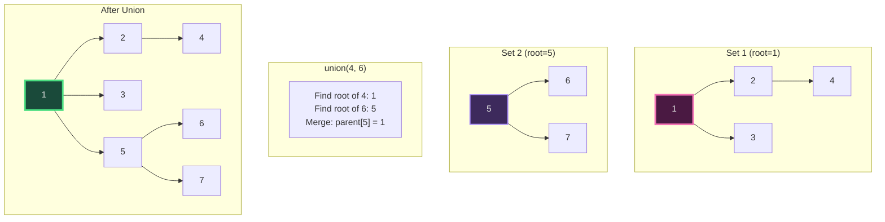
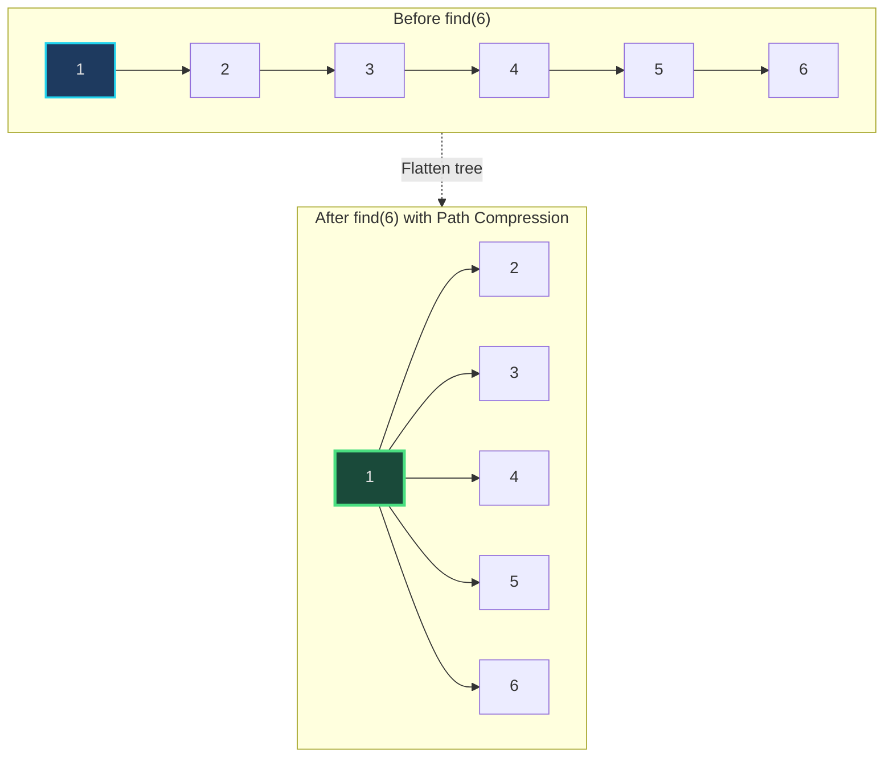
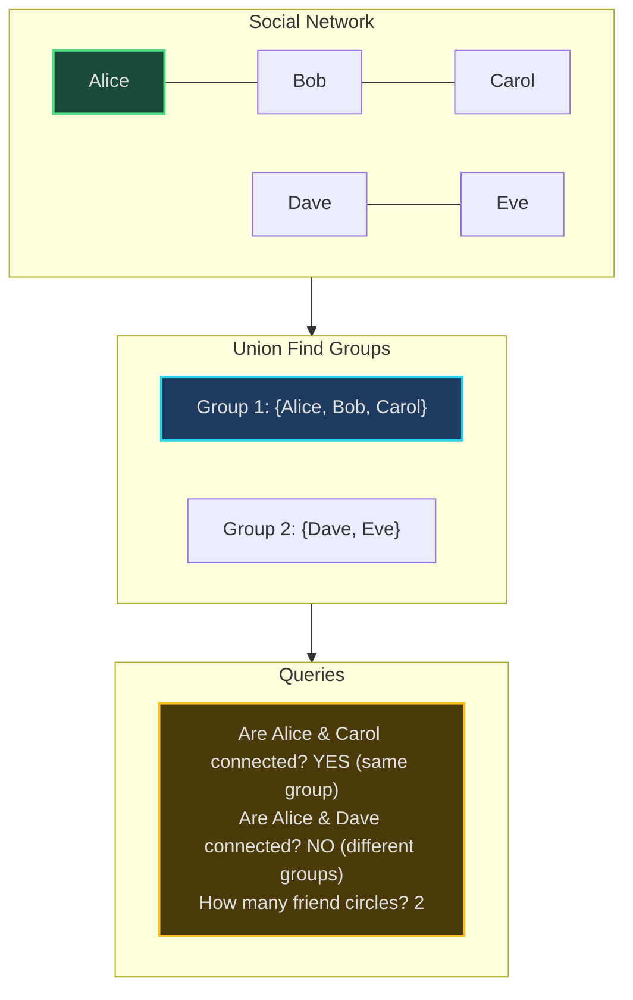
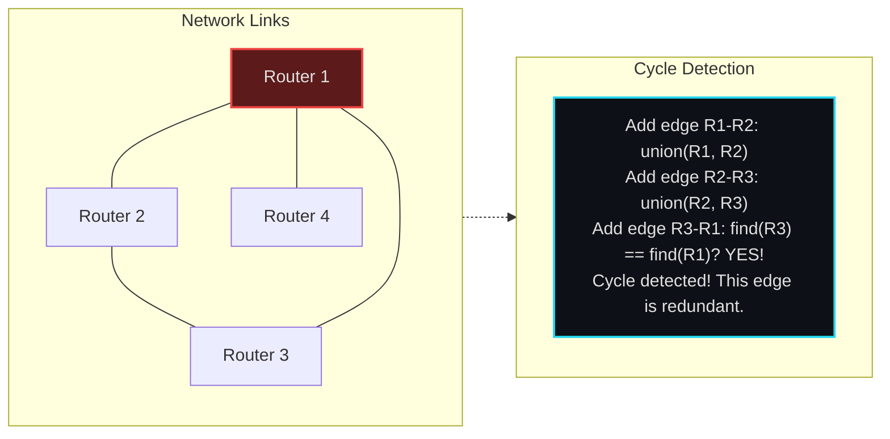
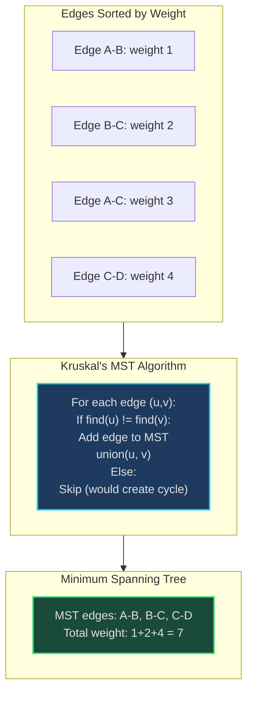

# Union Find (Disjoint Set Union) - Senior Engineer Thoughts

*The 4-stage mental pipeline: Problem → Pattern → Structure → Behavior → Code*

---

## Stage 1: Problem → Pattern (Recognition)

> "Union Find is my reach when I see **'connected components'**, **'are X and Y connected?'**, or **'dynamic connectivity'**. The trigger: do I need to group elements and quickly check if they're in the same group?"

**Recognition keywords:**
- "**Connected components**"
- "**Are X and Y connected?**"
- "**Group** elements"
- "**Disjoint sets**"
- "**Detect cycle** in undirected graph"
- "**Minimum spanning tree**" (Kruskal's algorithm)
- "**Network connectivity**"

**Mental model:**
> "Union Find tracks disjoint sets. Each set has a 'parent' pointer forming a tree. Two operations: find(x) - which set is X in? union(x, y) - merge X's set with Y's set. With path compression and union by rank, both operations are nearly O(1)."

**Key insight:**
> "This is THE data structure for dynamic connectivity. If connectivity is static (doesn't change), DFS/BFS works. If connectivity changes (edges added dynamically), Union Find is the answer."

---

## Stage 2: Pattern → Structure (What do I need?)

**Structure inventory:**
- **Parent array**: `parent[i]` = parent of element i
- **Rank/size array**: For optimization - track tree height or set size
- **Path compression**: During find(), flatten the tree
- **Union by rank/size**: Attach smaller tree to larger

> "Without optimizations: O(n) worst case for find. WITH path compression + union by rank: O(α(n)) ≈ O(1) amortized, where α is inverse Ackermann (grows incredibly slowly)."

---

## Stage 3: Structure → Behavior (How does it move?)

**Find operation (with path compression):**
```
def find(x):
    if parent[x] != x:
        parent[x] = find(parent[x])  # Path compression
    return parent[x]
```
> "During find, make every node on path point directly to root. This flattens the tree for future lookups."

**Union operation (with union by rank):**
```
def union(x, y):
    rootX = find(x)
    rootY = find(y)

    if rootX == rootY:
        return  # Already connected

    # Union by rank: attach smaller tree to larger
    if rank[rootX] < rank[rootY]:
        parent[rootX] = rootY
    elif rank[rootX] > rank[rootY]:
        parent[rootY] = rootX
    else:
        parent[rootY] = rootX
        rank[rootX] += 1
```

**Key invariant:**
> "Each disjoint set forms a tree. The root represents the set. Two elements are connected if they have the same root. Union merges trees by making one root the parent of the other."

---

## Visual Model

### Union Find Forest



### Path Compression



---

## Stage 4: Behavior → Code (Expression)

### Verbose Form: Union Find

```python
class UnionFind:
    def __init__(self, n: int):
        self.parent = list(range(n))  # Each element is its own parent initially
        self.rank = [0] * n           # All trees have rank 0 initially
        self.count = n                # Number of disjoint sets

    def _get_parent(self, x: int) -> int:
        """Get parent of element x."""
        return self.parent[x]

    def _set_parent(self, x: int, parent: int):
        """Set parent of element x."""
        self.parent[x] = parent

    def _is_root(self, x: int) -> bool:
        """Check if x is the root of its tree."""
        return self._get_parent(x) == x

    def _get_rank(self, x: int) -> int:
        """Get rank of element x."""
        return self.rank[x]

    def _increment_rank(self, x: int):
        """Increase rank of element x."""
        self.rank[x] += 1

    def find(self, x: int) -> int:
        """Find root of x with path compression."""
        if not self._is_root(x):
            # Path compression: make x point directly to root
            root = self.find(self._get_parent(x))
            self._set_parent(x, root)
        return self._get_parent(x)

    def union(self, x: int, y: int) -> bool:
        """Union sets containing x and y. Returns True if union performed."""
        rootX = self.find(x)
        rootY = self.find(y)

        if rootX == rootY:
            return False  # Already in same set

        # Union by rank: attach smaller tree to larger
        if self._get_rank(rootX) < self._get_rank(rootY):
            self._set_parent(rootX, rootY)
        elif self._get_rank(rootX) > self._get_rank(rootY):
            self._set_parent(rootY, rootX)
        else:
            # Same rank: attach Y to X, increase X's rank
            self._set_parent(rootY, rootX)
            self._increment_rank(rootX)

        self.count -= 1  # One less disjoint set
        return True

    def connected(self, x: int, y: int) -> bool:
        """Check if x and y are in the same set."""
        return self.find(x) == self.find(y)

    def get_count(self) -> int:
        """Get number of disjoint sets."""
        return self.count
```

### Terse Form: Union Find

```python
class UnionFind:
    def __init__(self, n: int):
        self.parent = list(range(n))
        self.rank = [0] * n

    def find(self, x: int) -> int:
        if self.parent[x] != x:
            self.parent[x] = self.find(self.parent[x])  # Path compression
        return self.parent[x]

    def union(self, x: int, y: int) -> bool:
        rootX, rootY = self.find(x), self.find(y)

        if rootX == rootY:
            return False

        # Union by rank
        if self.rank[rootX] < self.rank[rootY]:
            self.parent[rootX] = rootY
        elif self.rank[rootX] > self.rank[rootY]:
            self.parent[rootY] = rootX
        else:
            self.parent[rootY] = rootX
            self.rank[rootX] += 1

        return True

    def connected(self, x: int, y: int) -> bool:
        return self.find(x) == self.find(y)
```

### Usage Example: Number of Islands

```python
def numIslands(grid: List[List[str]]) -> int:
    if not grid:
        return 0

    rows, cols = len(grid), len(grid[0])
    uf = UnionFind(rows * cols)

    def index(r, c):
        return r * cols + c

    # Union adjacent land cells
    for r in range(rows):
        for c in range(cols):
            if grid[r][c] == '1':
                # Check right neighbor
                if c + 1 < cols and grid[r][c + 1] == '1':
                    uf.union(index(r, c), index(r, c + 1))
                # Check bottom neighbor
                if r + 1 < rows and grid[r + 1][c] == '1':
                    uf.union(index(r, c), index(r + 1, c))

    # Count unique roots for land cells
    return len(set(uf.find(index(r, c)) for r in range(rows) for c in range(cols) if grid[r][c] == '1'))
```

---

## Real World Use Cases

> "Union Find is everywhere connectivity and grouping matter - from social networks to network topology to image processing."

### 1. **Social Networks - Friend Circles**

**System Architecture:**


**Why Union Find?**
> "Facebook friend suggestions: find connected components (friend circles). When Alice befriends Bob, union(Alice, Bob). To suggest friends: find people in Alice's component but not direct friends. Union Find makes 'are they connected?' queries O(α(n)) ≈ O(1)."

**Real-world usage:**
- **Facebook**: Friend circles, group suggestions
- **LinkedIn**: Network connections, degrees of separation
- **Twitter**: Community detection

---

### 2. **Network Topology - Redundant Connections**

**System Architecture:**


**Why Union Find?**
> "Network admins detect redundant connections: process edges one by one. Before adding edge (u,v), check if find(u) == find(v). If yes, they're already connected = adding this edge creates cycle = redundant. Union Find detects this in O(α(n)) per edge."

**Real-world usage:**
- **Network management**: Loop detection, redundant link identification
- **Spanning tree protocol (STP)**: Prevent network loops
- **Cable network design**: Minimize redundant connections

---

### 3. **Image Processing - Connected Components Labeling**

**System:**
- **Problem**: In binary image, find all connected regions (blobs)
- **Behavior**: Scan pixels, union adjacent pixels with same color
- **Result**: Number of connected components = unique roots
- **Tool**: OpenCV, scikit-image

> "Photo editing 'magic wand' tool: click a pixel, select entire connected region. Union Find: union all adjacent pixels with similar color, find() returns component ID. All pixels with same root = same region."

**Real-world usage:**
- **Photo editing**: Magic wand selection, flood fill
- **Medical imaging**: Tumor detection, organ segmentation
- **Satellite imagery**: Land cover classification

---

### 4. **Minimum Spanning Tree - Kruskal's Algorithm**

**System Architecture:**


**Why Union Find?**
> "Kruskal's MST algorithm: sort edges by weight, process cheapest first. For each edge (u,v), if u and v are already connected (find(u) == find(v)), skip (would create cycle). Else, add edge and union(u,v). Union Find efficiently prevents cycles."

**Real-world usage:**
- **Network design**: Minimum cost cable routing
- **Cluster analysis**: Hierarchical clustering
- **Circuit design**: Minimal wire routing

---

### 5. **Distributed Systems - Consistency Groups**

**System:**
- **Problem**: Track which database replicas are in sync
- **Behavior**: When replica A syncs with B, union(A, B). Query: are A and C consistent? → find(A) == find(C)
- **Tool**: Distributed databases, consensus protocols

> "Cassandra, DynamoDB track replica consistency: which nodes have the same data version? Union Find groups replicas by data version. To read with consistency level QUORUM, query replicas in same consistency group."

---

### 6. **Game Development - Region/Territory Ownership**

**System:**
- **Problem**: Strategy game, players own connected territories
- **Behavior**: When player conquers adjacent territory, union them. To check if attacking valid: are territories connected?
- **Tool**: Game engines for RTS, 4X strategy games

> "Civilization-style games: check if player's empire is fragmented. Each territory is a node, borders are edges. Union Find: are capital and remote city still connected? If not, empire split!"

---

### Why This Matters for Full-Stack Engineers

> "Union Find is my tool for dynamic connectivity and grouping:"

- **Backend**: User grouping, access control (group permissions), social network features
- **Databases**: Join optimization, partition pruning
- **Infrastructure**: Network topology analysis, failure domain detection
- **Algorithms**: Graph problems with dynamic edges, cycle detection
- **Testing**: Dependency grouping, test isolation

> "The pattern: if I'm repeatedly asking 'are X and Y connected?' and connections change over time, Union Find is the answer. O(α(n)) ≈ O(1) beats DFS/BFS O(V+E) every time."

---

## Self-Check Questions

1. **Can I explain path compression?** During find, make nodes point directly to root.
2. **Can I explain union by rank?** Attach smaller tree to larger to keep trees flat.
3. **Do I know the complexity?** O(α(n)) ≈ O(1) amortized with both optimizations.
4. **Can I detect cycles?** If find(u) == find(v) before adding edge (u,v), it would create cycle.
5. **Can I identify Union Find in production?** Social networks, network topology, MST, image processing.

---

## Common Union Find Patterns

- **Connected components**: Count unique roots
- **Cycle detection (undirected)**: Before adding edge, check if already connected
- **Minimum spanning tree**: Kruskal's algorithm
- **Accounts merge**: Union accounts with common email, group by root
- **Redundant connection**: Find edge that creates cycle

**Optimizations are crucial:**
> "Without path compression + union by rank: O(n) worst case. WITH both: O(α(n)) where α is inverse Ackermann. For all practical n, α(n) ≤ 5. That's basically constant time!"

**When NOT to use Union Find:**
> "If connectivity is static (doesn't change), BFS/DFS is simpler. If you need actual paths (not just 'connected?'), use BFS/DFS. Union Find tells you IF connected, not HOW."

---

## LeetCode Practice Problems

| # | Problem | Difficulty |
|---|---------|------------|
| 200 | [Number of Islands](https://leetcode.com/problems/number-of-islands/) | Medium |
| 547 | [Number of Provinces](https://leetcode.com/problems/number-of-provinces/) | Medium |
| 684 | [Redundant Connection](https://leetcode.com/problems/redundant-connection/) | Medium |
| 685 | [Redundant Connection II](https://leetcode.com/problems/redundant-connection-ii/) | Medium |
| 721 | [Accounts Merge](https://leetcode.com/problems/accounts-merge/) | Medium |
| 990 | [Satisfiability of Equality Equations](https://leetcode.com/problems/satisfiability-of-equality-equations/) | Medium |
| 1135 | [Connecting Cities With Minimum Cost](https://leetcode.com/problems/connecting-cities-with-minimum-cost/) | Medium |
| 1319 | [Number of Operations to Make Network Connected](https://leetcode.com/problems/number-of-operations-to-make-network-connected/) | Medium |
| 1584 | [Min Cost to Connect All Points](https://leetcode.com/problems/min-cost-to-connect-all-points/) | Medium |
| 1971 | [Find if Path Exists in Graph](https://leetcode.com/problems/find-if-path-exists-in-graph/) | Medium |
| 128 | [Longest Consecutive Sequence](https://leetcode.com/problems/longest-consecutive-sequence/) | Hard |
| 305 | [Number of Islands II](https://leetcode.com/problems/number-of-islands-ii/) | Hard |
| 765 | [Couples Holding Hands](https://leetcode.com/problems/couples-holding-hands/) | Hard |
| 839 | [Similar String Groups](https://leetcode.com/problems/similar-string-groups/) | Hard |
| 952 | [Largest Component Size by Common Factor](https://leetcode.com/problems/largest-component-size-by-common-factor/) | Hard |
| 1632 | [Rank Transform of a Matrix](https://leetcode.com/problems/rank-transform-of-a-matrix/) | Hard |
---
