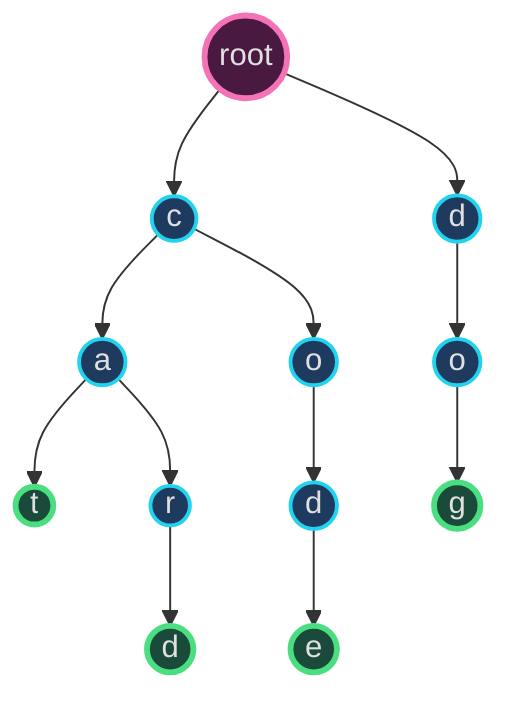
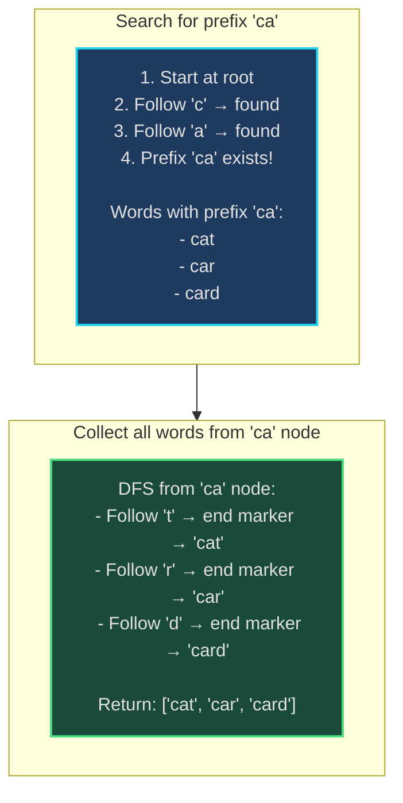
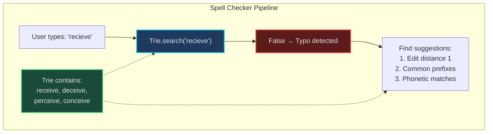
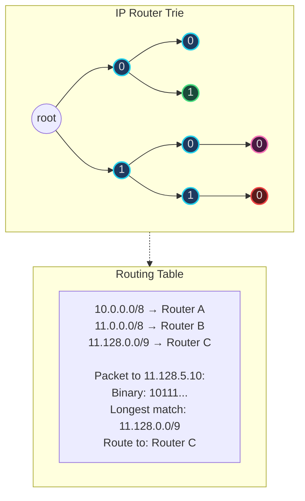
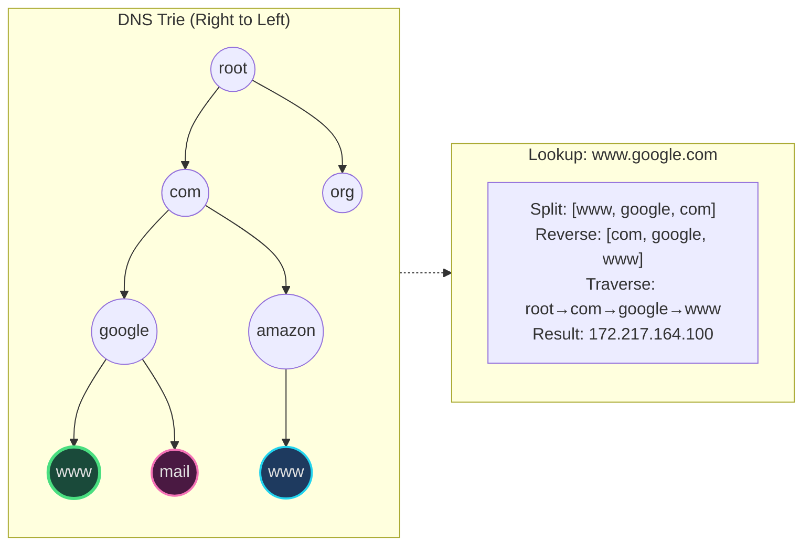

# Trie (Prefix Tree) - Senior Engineer Thoughts

*The 4-stage mental pipeline: Problem → Pattern → Structure → Behavior → Code*

---

## Stage 1: Problem → Pattern (Recognition)

> "Trie is my reach when I see **'prefix matching'**, **'autocomplete'**, or **'word search'**. The trigger: do I need fast prefix-based operations on strings?"

**Recognition keywords:**
- "**Autocomplete** / type-ahead suggestions"
- "**Prefix search** / starts with"
- "**Word dictionary**" with add/search
- "**Spell checker**"
- "**IP routing** (longest prefix match)"
- "**Phone directory**" lookups
- "Insert/search words with shared prefixes"

**Mental model:**
> "Trie is a tree where each node represents a character. Edges from root to leaf spell out words. Common prefixes share the same path. It's like a multi-way tree optimized for string operations—searching for 'cat' and 'car' shares the path for 'ca'."

**Key insight:**
> "Trie trades space for time. Insert/search/prefix are all O(m) where m = word length, regardless of dictionary size. Hash table is O(m) average but can't do prefix operations. Trie excels when many words share prefixes."

---

## Stage 2: Pattern → Structure (What do I need?)

**Structure inventory:**
- **TrieNode**: Each node has:
  - Children map (character → TrieNode), usually 26 letters for lowercase English
  - Boolean flag: is this node the end of a word?
- **Root node**: Empty node, starting point for all words
- **Recursive structure**: Each child is itself a Trie

> "The structure IS the algorithm. Each character in a word = one level deeper in the tree. Shared prefixes = shared nodes. End-of-word marker distinguishes 'car' from 'care'."

---

## Stage 3: Structure → Behavior (How does it move?)

**Insert operation:**
```
1. Start at root
2. For each character in word:
   - If character exists in current node's children: move to that child
   - Else: create new child node, move to it
3. Mark last node as end-of-word
```

**Search operation:**
```
1. Start at root
2. For each character in word:
   - If character doesn't exist in children: return False
   - Move to child node
3. Return True if final node is marked as end-of-word
```

**Prefix search (starts with):**
```
1. Traverse tree following characters in prefix
2. If any character missing: return False
3. If complete prefix found: return True (words exist with this prefix)
```

**Key invariant:**
> "Path from root to any node spells a prefix. If node is marked end-of-word, that prefix is a complete word in the dictionary. All words sharing a prefix share the same nodes up to the divergence point."

---

## Visual Model

### Trie Structure - Word Dictionary



*Words stored: "cat", "car", "card", "code", "dog"*
*Nodes marked with green border are end-of-word*

### Autocomplete - Prefix Search



---

## Stage 4: Behavior → Code (Expression)

### Verbose Form: Trie

```python
from typing import Dict, List, Optional

class TrieNode:
    def __init__(self):
        self.children: Dict[str, 'TrieNode'] = {}
        self.is_end_of_word: bool = False

    def has_child(self, char: str) -> bool:
        """Check if character exists as child."""
        return char in self.children

    def get_child(self, char: str) -> Optional['TrieNode']:
        """Get child node for character."""
        return self.children.get(char)

    def add_child(self, char: str) -> 'TrieNode':
        """Create and return new child node."""
        if not self.has_child(char):
            self.children[char] = TrieNode()
        return self.children[char]

    def mark_as_word_end(self):
        """Mark this node as end of a word."""
        self.is_end_of_word = True

    def is_word_end(self) -> bool:
        """Check if this node marks end of word."""
        return self.is_end_of_word


class Trie:
    def __init__(self):
        self.root = TrieNode()

    def _traverse_to_node(self, word: str, create_missing: bool = False) -> Optional[TrieNode]:
        """Traverse trie following characters in word."""
        node = self.root

        for char in word:
            if not node.has_child(char):
                if create_missing:
                    node = node.add_child(char)
                else:
                    return None
            else:
                node = node.get_child(char)

        return node

    def insert(self, word: str) -> None:
        """Insert word into trie."""
        node = self._traverse_to_node(word, create_missing=True)
        node.mark_as_word_end()

    def search(self, word: str) -> bool:
        """Search for exact word in trie."""
        node = self._traverse_to_node(word, create_missing=False)
        return node is not None and node.is_word_end()

    def starts_with(self, prefix: str) -> bool:
        """Check if any word starts with prefix."""
        node = self._traverse_to_node(prefix, create_missing=False)
        return node is not None

    def get_all_words_with_prefix(self, prefix: str) -> List[str]:
        """Return all words starting with prefix."""
        node = self._traverse_to_node(prefix, create_missing=False)
        if node is None:
            return []

        results = []
        self._collect_words(node, prefix, results)
        return results

    def _collect_words(self, node: TrieNode, current_word: str, results: List[str]):
        """DFS to collect all words from given node."""
        if node.is_word_end():
            results.append(current_word)

        for char, child_node in node.children.items():
            self._collect_words(child_node, current_word + char, results)
```

### Terse Form: Trie

```python
class TrieNode:
    def __init__(self):
        self.children = {}
        self.is_word = False

class Trie:
    def __init__(self):
        self.root = TrieNode()

    def insert(self, word: str) -> None:
        node = self.root
        for char in word:
            if char not in node.children:
                node.children[char] = TrieNode()
            node = node.children[char]
        node.is_word = True

    def search(self, word: str) -> bool:
        node = self.root
        for char in word:
            if char not in node.children:
                return False
            node = node.children[char]
        return node.is_word

    def startsWith(self, prefix: str) -> bool:
        node = self.root
        for char in prefix:
            if char not in node.children:
                return False
            node = node.children[char]
        return True
```

### Terse Form: Autocomplete

```python
def autocomplete(self, prefix: str) -> List[str]:
    """Get all words with given prefix."""
    node = self.root
    for char in prefix:
        if char not in node.children:
            return []
        node = node.children[char]

    # DFS to collect all words from this node
    results = []

    def dfs(node, path):
        if node.is_word:
            results.append(path)
        for char, child in node.children.items():
            dfs(child, path + char)

    dfs(node, prefix)
    return results
```

---

## Real World Use Cases

> "Tries are everywhere you need fast prefix operations—from search engines to network routers to autocomplete systems."

### 1. **Autocomplete / Type-Ahead Suggestions**

**System Architecture:**
```mermaid
sequenceDiagram
    participant User
    participant Frontend
    participant TrieAPI as Trie API
    participant Trie as Trie Data Structure

    User->>Frontend: Types "pyth"
    Frontend->>TrieAPI: GET /autocomplete?prefix=pyth
    TrieAPI->>Trie: startsWith("pyth")
    Trie-->>TrieAPI: True (prefix exists)
    TrieAPI->>Trie: getWordsWithPrefix("pyth")
    Trie-->>TrieAPI: ["python", "pythagoras", "pythagorean"]
    TrieAPI-->>Frontend: Top 10 suggestions
    Frontend-->>User: Dropdown with suggestions

    style Trie fill:#1e3a5f,stroke:#22d3ee,stroke-width:2px
    style Frontend fill:#1a4a3a,stroke:#4ade80,stroke-width:2px
```

**Why trie?**
> "Google search, IDE autocomplete (VS Code IntelliSense), mobile keyboards all use tries. As user types each character, traverse trie one level deeper, collect all words from that node. O(k) lookup where k = prefix length, independent of dictionary size. Hash table can't do 'words starting with X' efficiently."

**Real-world usage:**
- **Google Search**: Query autocomplete
- **VS Code**: IntelliSense code completion
- **Mobile keyboards**: SwiftKey, Gboard predictive text
- **E-commerce**: Product search suggestions (Amazon, eBay)

---

### 2. **Spell Checkers - Word Validation**

**System Architecture:**


**Why trie?**
> "Microsoft Word, Grammarly, Google Docs use tries for spell checking. Check if word exists: trie.search(word). For suggestions: generate candidates (delete char, swap chars, insert char), check if each candidate exists in trie. Trie makes validation O(m) per candidate."

**Real-world usage:**
- **Word/Google Docs**: Real-time spell checking
- **Grammarly**: Advanced spell and grammar checking
- **Browser spell checkers**: Chrome, Firefox built-in
- **Hunspell**: Open-source spell checker library

---

### 3. **IP Routing - Longest Prefix Match**

**System Architecture:**


**Why trie?**
> "Network routers use tries (called IP lookup tries or radix trees) for longest prefix match. IP address is string of bits. Trie nodes represent bits (0/1), routes stored at nodes. When packet arrives, traverse trie following IP bits, find longest matching prefix = correct route. Routers handle millions of packets/sec—trie makes this O(32) for IPv4."

**Real-world usage:**
- **Cisco/Juniper routers**: IP forwarding tables
- **Software routers**: Linux kernel routing, DPDK
- **CDN edge servers**: Route requests to nearest origin
- **Firewalls**: IP prefix-based filtering

---

### 4. **File Systems - Path Lookup**

**System:**
- **Problem**: Given path `/home/user/documents/file.txt`, quickly check if it exists
- **Structure**: Trie where each node is directory/file name
- **Behavior**: Split path by `/`, traverse trie, check if file node exists
- **Tool**: Some file systems use trie-like structures for fast path resolution

> "File system path lookup is trie traversal: '/home/user/docs' = root → 'home' → 'user' → 'docs'. Shared prefixes (multiple files in /home/user) share nodes. Faster than scanning directory entries at each level."

**Real-world usage:**
- **ZFS**: Prefix compression for directory entries
- **Git**: Object path lookups in packfiles
- **Virtual file systems**: In-memory path indexing

---

### 5. **DNS Resolution - Domain Lookup**

**System Architecture:**


**Why trie?**
> "DNS servers use tries (stored right-to-left) to resolve domain names. 'www.google.com' becomes trie path: com → google → www. Shared suffixes (.com, .org) share nodes. Fast lookup: O(k) where k = domain label count."

**Real-world usage:**
- **BIND**: Most common DNS server software
- **Unbound**: Validating DNS resolver
- **Route 53**: AWS DNS service
- **Browser DNS cache**: Chrome, Firefox local DNS tries

---

### 6. **Text Editors - Word Navigation**

**System:**
- **Problem**: Ctrl+F find word, highlight all occurrences, jump to next
- **Behavior**: Build trie of all words in document, search for query word
- **Performance**: O(m) search where m = word length, regardless of document size
- **Tool**: Vim, Emacs, VS Code text search

> "Text editors build tries for 'find all' operations. Instead of scanning entire document O(n*m), build trie of all words once O(n*m), then each search is O(m). Especially useful for large files with repeated searches."

---

### Why This Matters for Full-Stack Engineers

> "Tries are my tool for fast prefix-based operations:"

- **Frontend**: Autocomplete inputs, search bars, tag suggestions, command palettes
- **Backend**: API endpoint routing (prefix matching), search APIs, validation
- **Databases**: Index prefix queries, full-text search (inverted index with tries)
- **DevOps**: Log aggregation (tag prefix search), config management
- **Networking**: IP routing, DNS resolution, URL routing

> "The pattern: whenever I need 'all strings starting with X' or 'does this exact string exist' on a large dictionary with shared prefixes, I use a trie. Hash table gives O(m) for exact match but can't do prefix queries. Trie does both."

---

## Self-Check Questions

1. **Can I explain the structure?** Tree where each node is character, paths spell words.
2. **Can I do insert and search?** Traverse character by character, create nodes if missing, mark end-of-word.
3. **Do I know the complexity?** O(m) for all operations where m = word length.
4. **Can I do prefix search?** Traverse prefix, then DFS to collect all words from that node.
5. **Can I identify it in production?** Autocomplete, spell checkers, IP routing, DNS.

---

## Common Trie Patterns

- **Basic trie**: Insert, search, startsWith
- **Autocomplete**: Get all words with prefix (DFS from prefix node)
- **Word search II**: Find all dictionary words in 2D board (backtracking + trie)
- **Replace words**: Replace words with shortest root (trie of roots)
- **Longest word in dictionary**: Find longest word built one character at a time
- **Design search autocomplete system**: Top K suggestions with frequency

**Space optimization:**
> "Standard trie uses 26 children per node (lowercase English) = 26 pointers. For sparse tries, use hash map instead of array. Compressed trie (radix tree) merges single-child chains to save space."

**When NOT to use trie:**
> "If no shared prefixes (random strings), hash table is simpler and equally fast. If only exact matching needed (no prefix queries), hash table. Trie shines when many words share prefixes AND you need prefix operations."

---

## LeetCode Practice Problems

| # | Problem | Difficulty |
|---|---------|------------|
| 208 | [Implement Trie (Prefix Tree)](https://leetcode.com/problems/implement-trie-prefix-tree/) | Medium |
| 211 | [Design Add and Search Words Data Structure](https://leetcode.com/problems/design-add-and-search-words-data-structure/) | Medium |
| 421 | [Maximum XOR of Two Numbers in an Array](https://leetcode.com/problems/maximum-xor-of-two-numbers-in-an-array/) | Medium |
| 648 | [Replace Words](https://leetcode.com/problems/replace-words/) | Medium |
| 677 | [Map Sum Pairs](https://leetcode.com/problems/map-sum-pairs/) | Medium |
| 720 | [Longest Word in Dictionary](https://leetcode.com/problems/longest-word-in-dictionary/) | Medium |
| 820 | [Short Encoding of Words](https://leetcode.com/problems/short-encoding-of-words/) | Medium |
| 1032 | [Stream of Characters](https://leetcode.com/problems/stream-of-characters/) | Medium |
| 1268 | [Search Suggestions System](https://leetcode.com/problems/search-suggestions-system/) | Medium |
| 212 | [Word Search II](https://leetcode.com/problems/word-search-ii/) | Hard |
| 336 | [Palindrome Pairs](https://leetcode.com/problems/palindrome-pairs/) | Hard |
| 425 | [Word Squares](https://leetcode.com/problems/word-squares/) | Hard |
| 472 | [Concatenated Words](https://leetcode.com/problems/concatenated-words/) | Hard |
| 588 | [Design In-Memory File System](https://leetcode.com/problems/design-in-memory-file-system/) | Hard |
| 1938 | [Maximum Genetic Difference Query](https://leetcode.com/problems/maximum-genetic-difference-query/) | Hard |
---
