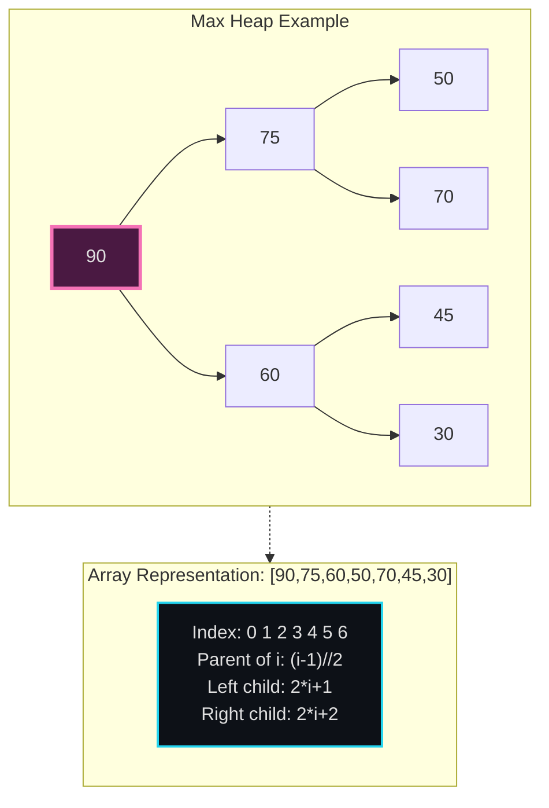
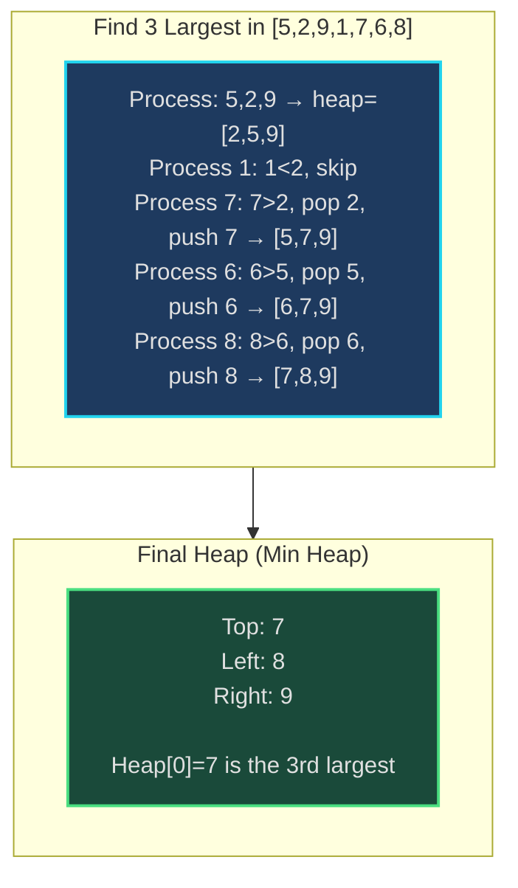
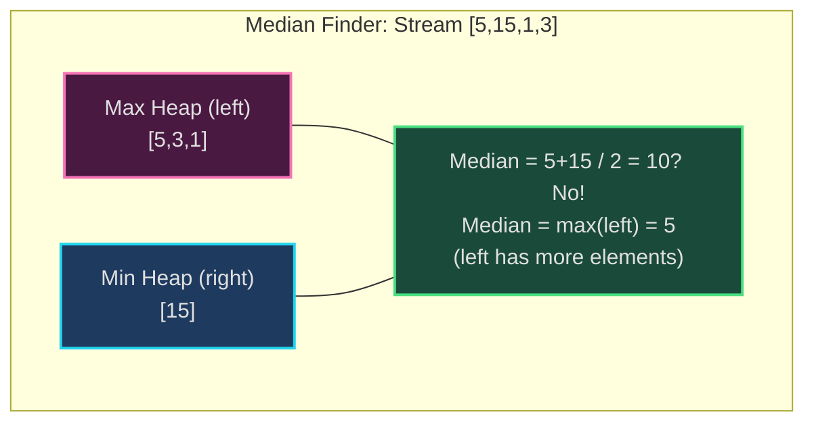
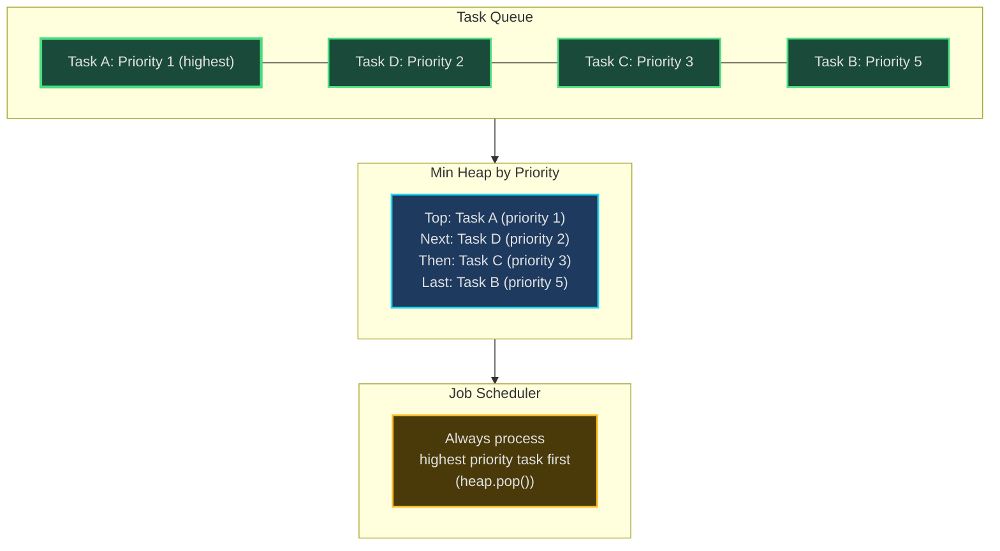
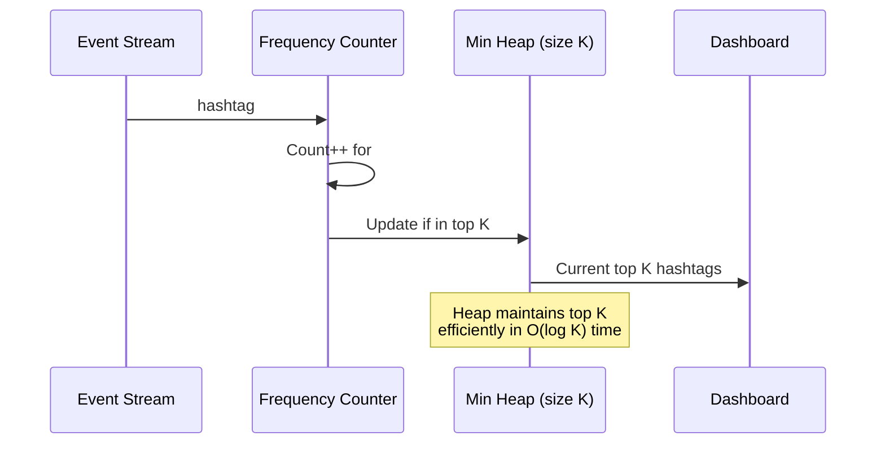
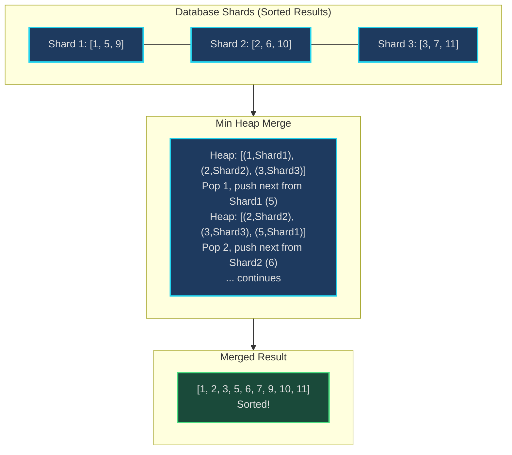

# Top K / Heap - Senior Engineer Thoughts

*The 4-stage mental pipeline: Problem → Pattern → Structure → Behavior → Code*

---

## Stage 1: Problem → Pattern (Recognition)

> "Top K / Heap is my immediate reach when I see **'K largest/smallest'**, **'median'**, or **'priority'**. The trigger: do I need to maintain a ranked subset or process elements by priority?"

**Recognition keywords:**
- "**K largest/smallest** elements"
- "**K most frequent**"
- "**Kth largest/smallest**"
- "**Median** of stream"
- "**Priority queue**" / "process tasks by priority"
- "**Merge K sorted** lists/arrays"
- "**Sliding window maximum**"

**Mental model:**
> "Heap is a tree-based data structure where parent is always larger (max heap) or smaller (min heap) than children. It gives me O(log n) insert/delete and O(1) peek at min/max. For 'top K', I use a size-K heap as a filter."

**Key insight:**
> "For K largest: use min heap of size K. For K smallest: use max heap of size K. Counter-intuitive but correct - the heap tracks the boundary, not the entire top/bottom."

---

## Stage 2: Pattern → Structure (What do I need?)

**Structure inventory:**
- **Heap**: Binary tree (usually array-based) with heap property
- **Size constraint**: For top K problems, maintain heap of size K
- **Comparison function**: Min heap (smallest at top) vs max heap (largest at top)

> "Python: `heapq` is min heap. For max heap, negate values or use custom comparator."

**Heap operations:**
- **heappush(heap, item)**: O(log n)
- **heappop(heap)**: O(log n) - remove and return smallest
- **heap[0]**: O(1) - peek at smallest
- **heapify(array)**: O(n) - convert array to heap

---

## Stage 3: Structure → Behavior (How does it move?)

**Top K largest behavior:**
```
Use min heap of size K:
1. Add first K elements to heap
2. For each remaining element:
   - If element > heap[0] (smallest in heap):
       Remove heap[0]
       Add element
   - Else: skip

Result: heap contains K largest elements
Why min heap? We want to quickly remove the smallest of the top K
```

**Median of stream behavior:**
```
Use two heaps:
- Max heap (left half): stores smaller half of numbers
- Min heap (right half): stores larger half of numbers

Invariant: len(left) == len(right) or len(left) == len(right) + 1

Median:
- If even count: (left.top + right.top) / 2
- If odd: left.top

When adding number:
- If num <= left.top: add to left
- Else: add to right
- Rebalance if needed
```

**Key invariant:**
> "Heap property: parent >= children (max heap) or parent <= children (min heap). This maintains itself through heapify operations during insert/delete."

---

## Visual Model

### Heap Structure



### Top K Largest with Min Heap



### Median of Stream (Two Heaps)



---

## Stage 4: Behavior → Code (Expression)

### Verbose Form: Top K Largest

```python
import heapq
from typing import List

class TopKFinder:
    def __init__(self, k: int):
        self.k = k
        self.min_heap: List[int] = []

    def _heap_size(self) -> int:
        """Get current heap size."""
        return len(self.min_heap)

    def _heap_is_full(self) -> bool:
        """Check if heap has K elements."""
        return self._heap_size() == self.k

    def _get_smallest_in_heap(self) -> int:
        """Peek at smallest element (top of min heap)."""
        return self.min_heap[0]

    def _should_replace(self, num: int) -> bool:
        """Check if number should replace smallest in heap."""
        return num > self._get_smallest_in_heap()

    def _remove_smallest(self):
        """Remove smallest element from heap."""
        heapq.heappop(self.min_heap)

    def _add_to_heap(self, num: int):
        """Add number to heap."""
        heapq.heappush(self.min_heap, num)

    def _process_number(self, num: int):
        """Process a single number for top K."""
        if not self._heap_is_full():
            self._add_to_heap(num)
        elif self._should_replace(num):
            self._remove_smallest()
            self._add_to_heap(num)

    def find_top_k(self, nums: List[int]) -> List[int]:
        """Find K largest elements."""
        for num in nums:
            self._process_number(num)

        return sorted(self.min_heap, reverse=True)
```

### Terse Form: Top K Largest

```python
import heapq

def topKLargest(nums: List[int], k: int) -> List[int]:
    min_heap = []

    for num in nums:
        if len(min_heap) < k:
            heapq.heappush(min_heap, num)
        elif num > min_heap[0]:
            heapq.heapreplace(min_heap, num)  # Pop and push in one op

    return sorted(min_heap, reverse=True)
```

### Verbose Form: Median Finder

```python
import heapq

class MedianFinder:
    def __init__(self):
        self.left = []  # Max heap (negate values)
        self.right = []  # Min heap

    def _left_size(self) -> int:
        return len(self.left)

    def _right_size(self) -> int:
        return len(self.right)

    def _left_top(self) -> int:
        """Get max of left heap (negate to get real value)."""
        return -self.left[0]

    def _right_top(self) -> int:
        """Get min of right heap."""
        return self.right[0]

    def _add_to_left(self, num: int):
        """Add to max heap (negate for min heap simulation)."""
        heapq.heappush(self.left, -num)

    def _add_to_right(self, num: int):
        """Add to min heap."""
        heapq.heappush(self.right, num)

    def _move_left_to_right(self):
        """Move largest from left to right."""
        val = -heapq.heappop(self.left)
        self._add_to_right(val)

    def _move_right_to_left(self):
        """Move smallest from right to left."""
        val = heapq.heappop(self.right)
        self._add_to_left(val)

    def _rebalance(self):
        """Ensure left has at most 1 more element than right."""
        if self._left_size() > self._right_size() + 1:
            self._move_left_to_right()
        elif self._right_size() > self._left_size():
            self._move_right_to_left()

    def addNum(self, num: int):
        """Add number to data structure."""
        if not self.left or num <= self._left_top():
            self._add_to_left(num)
        else:
            self._add_to_right(num)

        self._rebalance()

    def findMedian(self) -> float:
        """Find median of all numbers."""
        if self._left_size() > self._right_size():
            return self._left_top()
        return (self._left_top() + self._right_top()) / 2.0
```

### Terse Form: Median Finder

```python
import heapq

class MedianFinder:
    def __init__(self):
        self.left = []  # Max heap
        self.right = []  # Min heap

    def addNum(self, num: int):
        if not self.left or num <= -self.left[0]:
            heapq.heappush(self.left, -num)
        else:
            heapq.heappush(self.right, num)

        # Rebalance
        if len(self.left) > len(self.right) + 1:
            heapq.heappush(self.right, -heapq.heappop(self.left))
        elif len(self.right) > len(self.left):
            heapq.heappush(self.left, -heapq.heappop(self.right))

    def findMedian(self) -> float:
        if len(self.left) > len(self.right):
            return -self.left[0]
        return (-self.left[0] + self.right[0]) / 2.0
```

---

## Real World Use Cases

> "Heaps are fundamental to task scheduling, real-time analytics, and any system with priority-based processing."

### 1. **Task Schedulers - Priority Queues**

**System Architecture:**


**Why heap?**
> "Celery, RabbitMQ, Kubernetes scheduler - all use heaps for priority queues. When task arrives, push to heap with priority. Worker pulls highest priority task (heap.pop()). O(log n) instead of O(n) linear scan."

**Real-world usage:**
- **Celery**: Task queue with priority
- **Kubernetes**: Pod scheduling by priority class
- **OS schedulers**: Linux CFS, process priority queues
- **Message brokers**: RabbitMQ priority queues

---

### 2. **Real-Time Analytics - Top K Trending**

**System Architecture:**


**Why heap?**
> "Twitter trending: count hashtag frequencies, maintain heap of top K. When hashtag count updates, check if it's in top K (compare with heap[0]). If yes, update heap. Dashboard queries heap for current top K. O(log K) per update instead of sorting all hashtags."

**Real-world usage:**
- **Twitter/X**: Trending topics
- **YouTube**: Trending videos
- **E-commerce**: Top selling products
- **Analytics**: Most visited pages

---

### 3. **Load Balancing - Least Loaded Server**

**System:**
- **Problem**: Route request to least loaded server
- **Structure**: Min heap of servers ordered by current load
- **Behavior**: Pop server with min load, handle request, update load, push back to heap
- **Tool**: Nginx, HAProxy, AWS ALB

> "Load balancers use min heap to track server loads. To route request: pop server with least load, assign request, increment load, push back. O(log n) to find least loaded instead of O(n) scan."

---

### 4. **Database - Merge K Sorted Results**

**System Architecture:**


**Why heap?**
> "Distributed databases (Cassandra, MongoDB) query multiple shards, each returns sorted results. To merge K sorted lists: min heap with one element from each list. Pop min, add to result, push next element from that list. O(N log K) where N = total elements, K = number of lists."

**Real-world usage:**
- **Cassandra**: Multi-shard query merging
- **Elasticsearch**: Distributed search result merging
- **Map Reduce**: Merge sorted partitions in reduce phase

---

### 5. **Event-Driven Systems - Timer Scheduling**

**System:**
- **Problem**: Schedule events to fire at specific times
- **Structure**: Min heap ordered by event time
- **Behavior**: Peek at heap top (next event). If time passed, pop and fire event. Add new events with push.
- **Tool**: JavaScript event loop, Redis sorted sets

> "JavaScript's event loop uses a min heap for timers (`setTimeout`). Events ordered by fire time. Event loop checks heap top: if time <= now, pop and execute. O(log n) to add/remove timers."

**Real-world usage:**
- **Node.js**: Event loop timer queue
- **Redis**: EXPIRE command (sorted set = heap-like)
- **Java Timer**: Scheduled executor service

---

### 6. **Network - Packet Prioritization (QoS)**

**System:**
- **Problem**: Network packets have different priorities (voice > video > data)
- **Structure**: Max heap by packet priority
- **Behavior**: Always send highest priority packet next
- **Tool**: Router QoS, traffic shaping

> "Routers use heaps for Quality of Service: VoIP packets (high priority) sent before bulk file transfer (low priority). Incoming packets pushed to heap by priority. Outgoing: pop highest priority. Ensures real-time traffic gets priority."

---

### Why This Matters for Full-Stack Engineers

> "Heaps are my tool for anything involving 'best', 'priority', or 'top K':"

- **Frontend**: Autocomplete (top K matching results), infinite scroll with priority content
- **Backend**: Task queues, rate limiting (token bucket), caching (LRU with heap)
- **Databases**: Query result merging, index range merging
- **DevOps**: Alert prioritization, incident severity queues
- **Monitoring**: Top K error rates, slowest endpoints

> "The pattern: if I need to repeatedly find min/max, or maintain top/bottom K elements, heap is the answer. O(log n) beats linear scan every time."

---

## Self-Check Questions

1. **Do I know when to use min vs max heap for top K?** Top K largest = min heap, top K smallest = max heap.
2. **Can I explain the heap property?** Parent >= children (max) or parent <= children (min).
3. **Can I implement median finder?** Two heaps with rebalancing.
4. **Do I understand heap operations complexity?** Insert/delete O(log n), peek O(1).
5. **Can I identify heaps in production?** Task queues, trending systems, load balancers, merge K sorted.

---

## Common Heap Patterns

- **Top K largest/smallest**: Size-K heap
- **Kth largest**: Min heap, return heap[0] after processing
- **Median of stream**: Two heaps (max + min)
- **Merge K sorted**: Min heap with K elements
- **Sliding window maximum**: Deque or max heap with lazy deletion

**Why heaps for top K?**
> "Sorting is O(n log n). Heap is O(n log K) where K << n. If I need top 10 from 1 million elements, heap with K=10 is massively faster than sorting all 1 million."

---

## LeetCode Practice Problems

| # | Problem | Difficulty |
|---|---------|------------|
| 215 | [Kth Largest Element in an Array](https://leetcode.com/problems/kth-largest-element-in-an-array/) | Medium |
| 347 | [Top K Frequent Elements](https://leetcode.com/problems/top-k-frequent-elements/) | Medium |
| 373 | [Find K Pairs with Smallest Sums](https://leetcode.com/problems/find-k-pairs-with-smallest-sums/) | Medium |
| 692 | [Top K Frequent Words](https://leetcode.com/problems/top-k-frequent-words/) | Medium |
| 703 | [Kth Largest Element in a Stream](https://leetcode.com/problems/kth-largest-element-in-a-stream/) | Medium |
| 767 | [Reorganize String](https://leetcode.com/problems/reorganize-string/) | Medium |
| 973 | [K Closest Points to Origin](https://leetcode.com/problems/k-closest-points-to-origin/) | Medium |
| 1046 | [Last Stone Weight](https://leetcode.com/problems/last-stone-weight/) | Medium |
| 1636 | [Sort Array by Increasing Frequency](https://leetcode.com/problems/sort-array-by-increasing-frequency/) | Medium |
| 23 | [Merge k Sorted Lists](https://leetcode.com/problems/merge-k-sorted-lists/) | Hard |
| 218 | [The Skyline Problem](https://leetcode.com/problems/the-skyline-problem/) | Hard |
| 295 | [Find Median from Data Stream](https://leetcode.com/problems/find-median-from-data-stream/) | Hard |
| 355 | [Design Twitter](https://leetcode.com/problems/design-twitter/) | Hard |
| 502 | [IPO](https://leetcode.com/problems/ipo/) | Hard |
| 632 | [Smallest Range Covering Elements from K Lists](https://leetcode.com/problems/smallest-range-covering-elements-from-k-lists/) | Hard |
---
