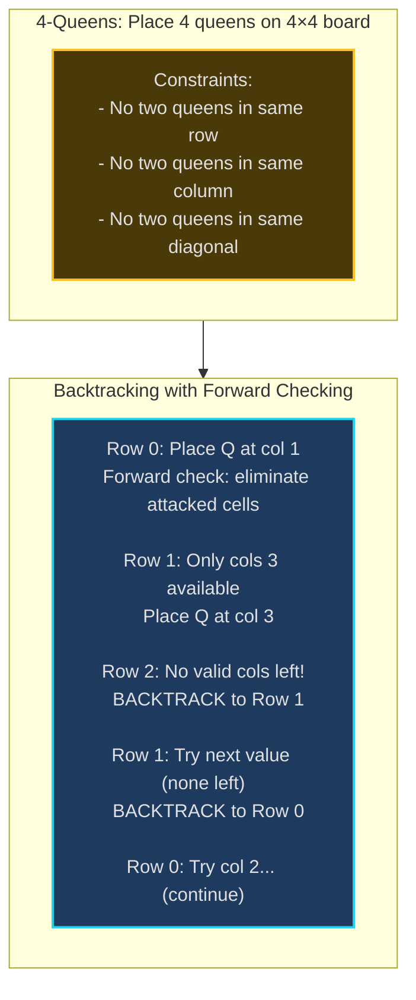
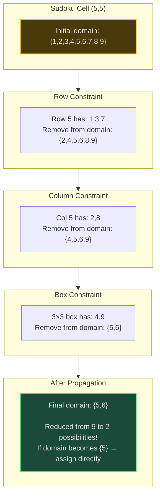
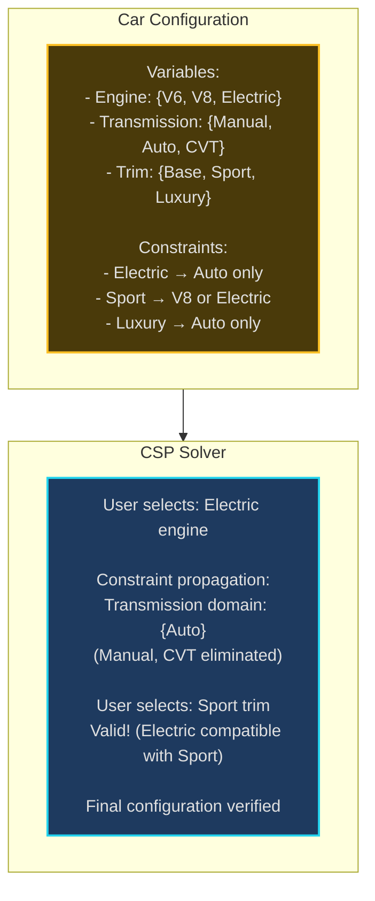
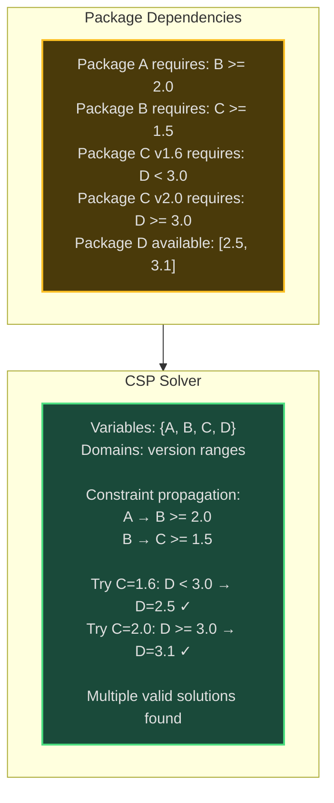

# Constraint Satisfaction Problems (CSP) - Senior Engineer Thoughts

*The 4-stage mental pipeline: Problem → Pattern → Structure → Behavior → Code*

---

## Stage 1: Problem → Pattern (Recognition)

> "CSP is my reach when I see **'assign values'** to variables with **'constraints'** and need **'any valid solution'** (or all). The trigger: do I have variables, domains, and rules they must satisfy?"

**Recognition keywords:**
- "**Sudoku**" / puzzle solving
- "**N-Queens** problem"
- "**Graph coloring**"
- "**Map coloring**"
- "**Schedule** satisfying constraints"
- "**Assign values** without conflicts"
- "**Constraint propagation**"
- "Variables with **domains** and **constraints**"

**Mental model:**
> "CSP = variables + domains + constraints. Goal: assign value from domain to each variable such that all constraints satisfied. Use backtracking + constraint propagation (forward checking, arc consistency) to prune search space. It's like filling a form where later fields depend on earlier ones."

**Key insight:**
> "Smart constraint propagation reduces search space exponentially. Forward checking eliminates inconsistent values early. Arc consistency (AC-3) further reduces domains before search. Most Constrained Variable (MRV) heuristic chooses variable with fewest legal values—fail fast."

---

## Stage 2: Pattern → Structure (What do I need?)

**Structure inventory:**
- **Variables**: Things to assign (e.g., Sudoku cells, queen positions)
- **Domains**: Possible values for each variable (e.g., {1-9} for Sudoku)
- **Constraints**: Rules variables must satisfy (binary, unary, global)
- **Assignment**: Partial/complete mapping of variables to values
- **Constraint propagation**: Reduce domains by eliminating inconsistent values

> "CSP framework: pick unassigned variable, try each domain value, check constraints, recurse. Optimization: MRV (Minimum Remaining Values) picks most constrained variable first. Forward checking removes values that would violate constraints."

---

## Stage 3: Structure → Behavior (How does it move?)

**CSP Backtracking with Forward Checking:**
```
function CSP_SOLVE(assignment):
    if all variables assigned:
        return assignment  # Solution found!

    var = SELECT_UNASSIGNED_VARIABLE(MRV heuristic)

    for value in DOMAIN[var]:
        if IS_CONSISTENT(var, value, assignment):
            assignment[var] = value

            # Forward checking: reduce domains
            saved_domains = FORWARD_CHECK(var, value)

            result = CSP_SOLVE(assignment)
            if result != FAILURE:
                return result

            # Backtrack: restore domains
            RESTORE_DOMAINS(saved_domains)
            remove assignment[var]

    return FAILURE
```

**Constraint propagation (AC-3):**
```
Arc Consistency:
  For each constraint between variables X and Y:
    Remove values from domain(X) that have no valid value in domain(Y)
    Repeat until no more reductions possible

This pre-processing drastically reduces search space
```

**Key invariant:**
> "At each step, assignment satisfies all constraints for assigned variables. Domain[v] contains only values consistent with current assignment (maintained by forward checking). This prunes search tree early."

---

## Visual Model

### N-Queens with Constraint Propagation



### Sudoku Constraint Propagation



---

## Stage 4: Behavior → Code (Expression)

### Verbose Form: N-Queens CSP

```python
from typing import List, Set

class NQueensCSP:
    def __init__(self, n: int):
        self.n = n
        self.board: List[int] = [-1] * n  # board[row] = col
        self.solutions: List[List[int]] = []

    def _is_attacked_column(self, col: int) -> bool:
        """Check if column is already occupied."""
        return col in self.board[:len([x for x in self.board if x != -1])]

    def _is_attacked_diagonal(self, row: int, col: int) -> bool:
        """Check if diagonals are attacked."""
        for r in range(row):
            c = self.board[r]
            if c == -1:
                continue
            # Same diagonal if abs(row diff) == abs(col diff)
            if abs(row - r) == abs(col - c):
                return True
        return False

    def _is_safe(self, row: int, col: int) -> bool:
        """Check if placing queen at (row, col) is safe."""
        if self._is_attacked_column(col):
            return False
        if self._is_attacked_diagonal(row, col):
            return False
        return True

    def _get_available_columns(self, row: int) -> Set[int]:
        """Get columns not under attack (forward checking)."""
        available = set()
        for col in range(self.n):
            if self._is_safe(row, col):
                available.add(col)
        return available

    def _place_queen(self, row: int, col: int):
        """Place queen on board."""
        self.board[row] = col

    def _remove_queen(self, row: int):
        """Remove queen from board."""
        self.board[row] = -1

    def _save_solution(self):
        """Save current board configuration."""
        self.solutions.append(self.board.copy())

    def _solve_recursive(self, row: int) -> bool:
        """CSP backtracking solver."""
        if row == self.n:
            # All queens placed successfully
            self._save_solution()
            return True  # Change to False to find all solutions

        available_cols = self._get_available_columns(row)

        for col in available_cols:
            self._place_queen(row, col)

            if self._solve_recursive(row + 1):
                return True  # Found solution

            self._remove_queen(row)

        return False  # No solution from this state

    def solve(self) -> List[List[int]]:
        """Solve N-Queens CSP."""
        self._solve_recursive(0)
        return self.solutions
```

### Terse Form: N-Queens

```python
def solveNQueens(n: int) -> List[List[str]]:
    """N-Queens CSP with backtracking."""
    def is_safe(board, row, col):
        # Check column
        for r in range(row):
            if board[r] == col:
                return False
            # Check diagonals
            if abs(row - r) == abs(col - board[r]):
                return False
        return True

    def backtrack(row, board):
        if row == n:
            result.append(['.' * c + 'Q' + '.' * (n - c - 1) for c in board])
            return

        for col in range(n):
            if is_safe(board, row, col):
                board[row] = col
                backtrack(row + 1, board)
                board[row] = -1

    result = []
    backtrack(0, [-1] * n)
    return result
```

### Verbose Form: Sudoku CSP

```python
class SudokuCSP:
    def __init__(self, board: List[List[str]]):
        self.board = board
        self.size = 9

    def _get_row_values(self, row: int) -> Set[str]:
        """Get values already in row."""
        return {self.board[row][c] for c in range(self.size) if self.board[row][c] != '.'}

    def _get_col_values(self, col: int) -> Set[str]:
        """Get values already in column."""
        return {self.board[r][col] for r in range(self.size) if self.board[r][col] != '.'}

    def _get_box_values(self, row: int, col: int) -> Set[str]:
        """Get values already in 3x3 box."""
        box_row, box_col = 3 * (row // 3), 3 * (col // 3)
        values = set()
        for r in range(box_row, box_row + 3):
            for c in range(box_col, box_col + 3):
                if self.board[r][c] != '.':
                    values.add(self.board[r][c])
        return values

    def _get_domain(self, row: int, col: int) -> Set[str]:
        """Get possible values for cell (constraint propagation)."""
        if self.board[row][col] != '.':
            return set()

        all_digits = set('123456789')
        used = self._get_row_values(row) | \
               self._get_col_values(col) | \
               self._get_box_values(row, col)

        return all_digits - used

    def _find_most_constrained_cell(self) -> tuple:
        """MRV heuristic: find cell with minimum remaining values."""
        min_domain_size = 10
        best_cell = None

        for r in range(self.size):
            for c in range(self.size):
                if self.board[r][c] == '.':
                    domain = self._get_domain(r, c)
                    if len(domain) < min_domain_size:
                        min_domain_size = len(domain)
                        best_cell = (r, c, domain)

        return best_cell

    def _solve_recursive(self) -> bool:
        """CSP backtracking with MRV heuristic."""
        cell_info = self._find_most_constrained_cell()

        if cell_info is None:
            return True  # All cells filled

        row, col, domain = cell_info

        if not domain:
            return False  # No valid values (dead end)

        for value in domain:
            self.board[row][col] = value

            if self._solve_recursive():
                return True

            self.board[row][col] = '.'  # Backtrack

        return False

    def solve(self):
        """Solve Sudoku puzzle."""
        self._solve_recursive()
```

### Terse Form: Sudoku

```python
def solveSudoku(board: List[List[str]]) -> None:
    """Sudoku CSP solver."""
    def is_valid(board, row, col, num):
        # Check row, column, box
        for i in range(9):
            if board[row][i] == num or board[i][col] == num:
                return False
        box_row, box_col = 3 * (row // 3), 3 * (col // 3)
        for r in range(box_row, box_row + 3):
            for c in range(box_col, box_col + 3):
                if board[r][c] == num:
                    return False
        return True

    def backtrack():
        for r in range(9):
            for c in range(9):
                if board[r][c] == '.':
                    for num in '123456789':
                        if is_valid(board, r, c, num):
                            board[r][c] = num
                            if backtrack():
                                return True
                            board[r][c] = '.'
                    return False
        return True

    backtrack()
```

---

## Real World Use Cases

> "CSP powers puzzle solvers, scheduling systems, configuration tools—anywhere assignments must satisfy complex rules."

### 1. **Scheduling - University Course Timetabling**

**Why CSP?**
> "Universities use CSP for course scheduling. Variables = courses, domains = time slots + rooms, constraints = no professor in two places, no student time conflicts, room capacity. Commercial tools (Unitime) use CSP + constraint propagation to generate conflict-free schedules for thousands of courses."

**Real-world usage:**
- **Universities**: Course timetabling (Unitime, Syllabus Plus)
- **Hospitals**: Staff shift scheduling (considering certifications, availability)
- **Airlines**: Crew scheduling (pilot qualifications, rest requirements)
- **Sports leagues**: Fixture scheduling (venue availability, fairness)

---

### 2. **Configuration - Product Customization**

**System Architecture:**


**Why CSP?**
> "Car manufacturers (Tesla, BMW) use CSP for online configurators. As user selects options, CSP eliminates incompatible choices real-time. Constraints encode manufacturing limitations, package dependencies. Ensures only valid configurations reach factory."

**Real-world usage:**
- **Automotive**: Car configurators (Tesla, BMW, Mercedes)
- **Dell/HP**: PC custom builds (motherboard + CPU + RAM compatibility)
- **Telecommunications**: Network equipment configuration
- **Enterprise software**: SAP configuration (modules, integrations)

---

### 3. **Resource Allocation - Cloud VM Placement**

**System:**
- **Variables**: VMs to place
- **Domains**: Physical hosts
- **Constraints**: CPU/memory limits, affinity/anti-affinity rules, fault domains
- **Goal**: Valid placement satisfying all constraints

> "Kubernetes uses CSP for pod placement. Variables = pods, domains = nodes, constraints = resource requests, node selectors, taints/tolerations, pod affinity. Scheduler finds valid placement or reports constraint violations."

**Real-world usage:**
- **Kubernetes**: Pod scheduling (kube-scheduler)
- **VMware**: VM placement across hosts (DRS)
- **AWS EC2**: Instance placement groups
- **Data centers**: Server consolidation

---

### 4. **Network Design - Frequency Assignment**

**System:**
- **Problem**: Assign frequencies to cell towers avoiding interference
- **Variables**: Cell towers
- **Domains**: Available frequencies
- **Constraints**: Nearby towers must have different frequencies (graph coloring)

> "Telecom companies use CSP for frequency allocation. Variables = towers, domains = frequency bands, constraints = interference rules (distance-based). CSP finds assignment minimizing interference. Critical for 5G network deployment."

**Real-world usage:**
- **Telecommunications**: Cell tower frequency assignment (AT&T, Verizon)
- **WiFi**: Channel allocation (avoid interference)
- **Radio**: Broadcast frequency allocation (FCC)
- **Satellite**: Orbital slot assignment

---

### 5. **Software Engineering - Dependency Resolution**

**System Architecture:**


**Why CSP?**
> "npm, pip, cargo use CSP for dependency resolution. Variables = packages, domains = version ranges, constraints = version requirements. CSP finds compatible version set or reports conflict. Constraint propagation (pub grind solver) makes this fast even for huge dependency graphs."

**Real-world usage:**
- **Package managers**: npm, pip, cargo, maven
- **Container orchestration**: Docker layer optimization
- **Build systems**: Bazel dependency resolution
- **Linux distributions**: APT, YUM package dependencies

---

### 6. **Game Development - Procedural Generation**

**System:**
- **Problem**: Generate game levels satisfying design rules
- **Variables**: Tile placements, enemy spawns, item locations
- **Constraints**: Accessibility (player can reach all areas), difficulty progression, aesthetic rules
- **Application**: Roguelike games, No Man's Sky terrain

> "Roguelikes (Hades, Dead Cells) use CSP for level generation. Variables = rooms/tiles, domains = room types, constraints = connectivity (player can reach exit), difficulty curve. CSP ensures generated levels are always playable."

**Real-world usage:**
- **Roguelikes**: Procedural dungeon generation (Hades, Binding of Isaac)
- **No Man's Sky**: Planet terrain generation with constraints
- **Minecraft**: World generation (biome placement rules)
- **Puzzle games**: Level generation (Flow, Sudoku apps)

---

### Why This Matters for Full-Stack Engineers

> "CSP is my tool for assignment problems with complex rules:"

- **Frontend**: Form validation with interdependent fields, UI configurators
- **Backend**: Scheduling APIs, resource allocation, configuration validation
- **DevOps**: Deployment planning (pod placement, server allocation)
- **Databases**: Query optimization (join order satisfying constraints)
- **Testing**: Test case generation satisfying coverage constraints

> "The pattern: if I have variables to assign values to, and complex rules they must satisfy, I model as CSP. Use constraint propagation to reduce search space, backtracking to find valid assignment."

---

## Self-Check Questions

1. **Can I identify variables, domains, constraints?** Variables = things to assign, domains = possible values, constraints = rules.
2. **Can I implement forward checking?** After assignment, remove inconsistent values from unassigned variables' domains.
3. **Do I know MRV heuristic?** Choose variable with minimum remaining values (most constrained) to fail fast.
4. **Can I explain arc consistency?** For each pair, remove values with no valid partner. Repeat until no more reductions.
5. **Can I identify it in production?** Sudoku solvers, course scheduling, car configurators, package managers.

---

## Common CSP Patterns

- **N-Queens**: Place N queens on N×N board, no attacks (rows/cols/diagonals)
- **Sudoku**: Fill 9×9 grid, constraints per row/col/box
- **Graph coloring**: Assign colors to nodes, adjacent nodes different colors
- **Map coloring**: Color regions, adjacent regions different colors (4-color theorem)
- **Cryptarithmetic**: Assign digits to letters in arithmetic puzzle
- **Job shop scheduling**: Assign jobs to time slots satisfying precedence

**Optimization techniques:**
```
Heuristics:
  - MRV (Minimum Remaining Values): Choose most constrained variable
  - Degree heuristic: Choose variable involved in most constraints
  - Least Constraining Value: Try values that rule out fewest others

Inference:
  - Forward checking: Eliminate inconsistent values after assignment
  - AC-3 (Arc Consistency): Propagate constraints before search
  - Maintaining Arc Consistency (MAC): Combine AC-3 with backtracking
```

---

## LeetCode Practice Problems

| # | Problem | Difficulty |
|---|---------|------------|
| 36 | [Valid Sudoku](https://leetcode.com/problems/valid-sudoku/) | Medium |
| 79 | [Word Search](https://leetcode.com/problems/word-search/) | Medium |
| 980 | [Unique Paths III](https://leetcode.com/problems/unique-paths-iii/) | Medium |
| 1239 | [Maximum Length of a Concatenated String with Unique Characters](https://leetcode.com/problems/maximum-length-of-a-concatenated-string-with-unique-characters/) | Medium |
| 1593 | [Split a String Into the Max Number of Unique Substrings](https://leetcode.com/problems/split-a-string-into-the-max-number-of-unique-substrings/) | Medium |
| 37 | [Sudoku Solver](https://leetcode.com/problems/sudoku-solver/) | Hard |
| 51 | [N-Queens](https://leetcode.com/problems/n-queens/) | Hard |
| 996 | [Number of Squareful Arrays](https://leetcode.com/problems/number-of-squareful-arrays/) | Hard |
| 1307 | [Verbal Arithmetic Puzzle](https://leetcode.com/problems/verbal-arithmetic-puzzle/) | Hard |
| 1659 | [Maximize Grid Happiness](https://leetcode.com/problems/maximize-grid-happiness/) | Hard |
---
