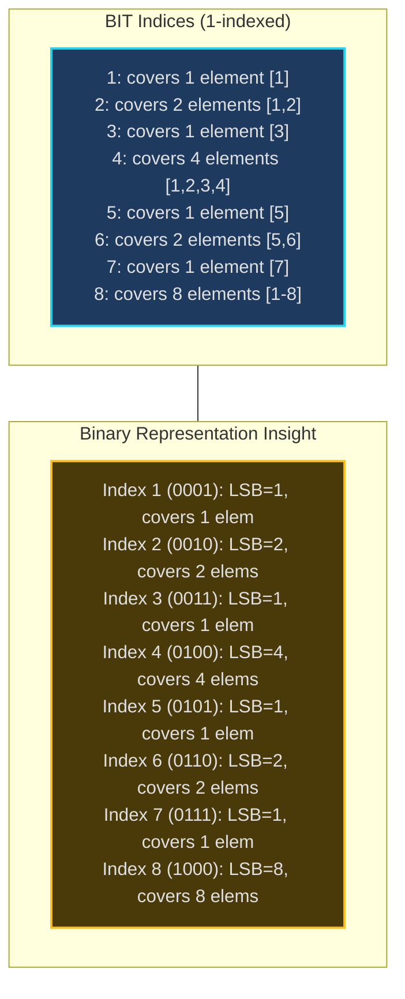
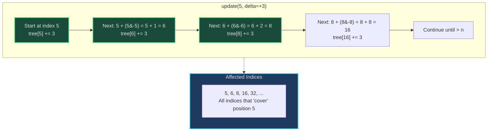
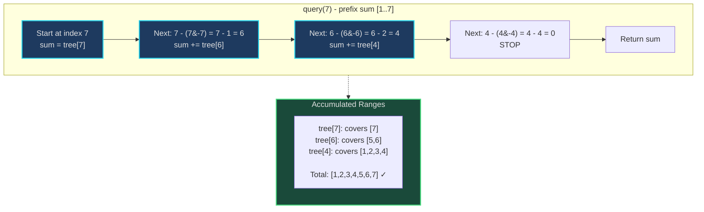
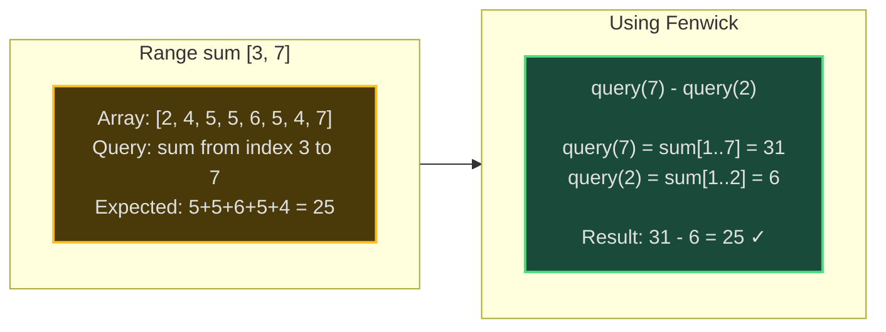
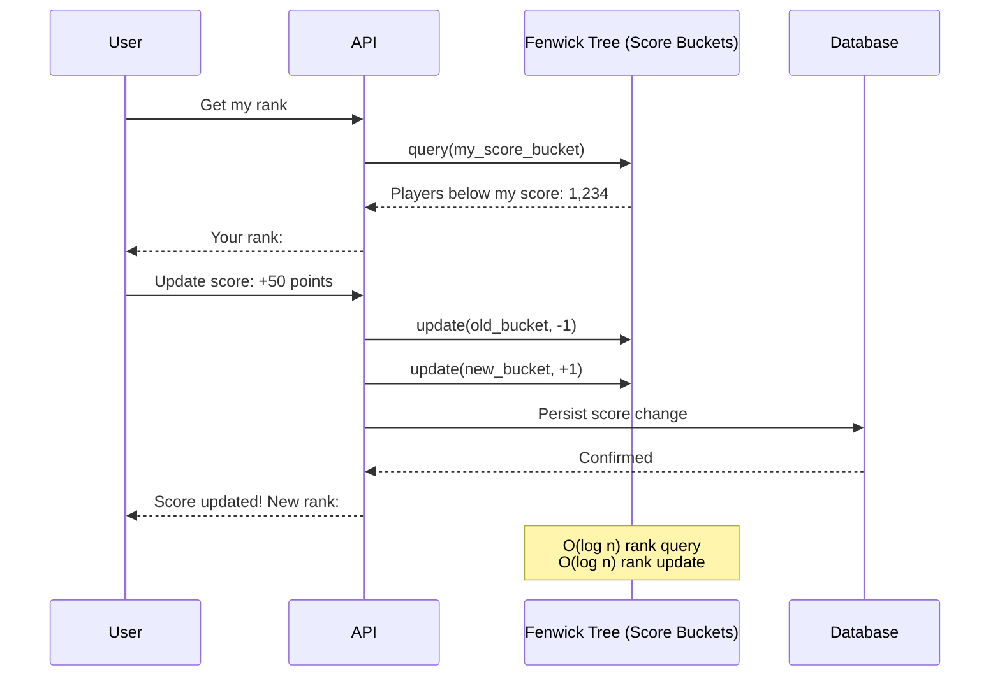
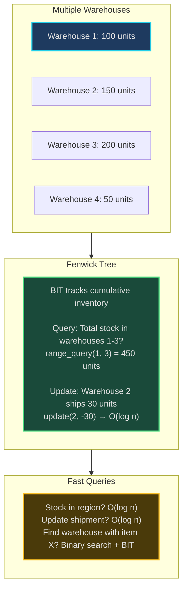
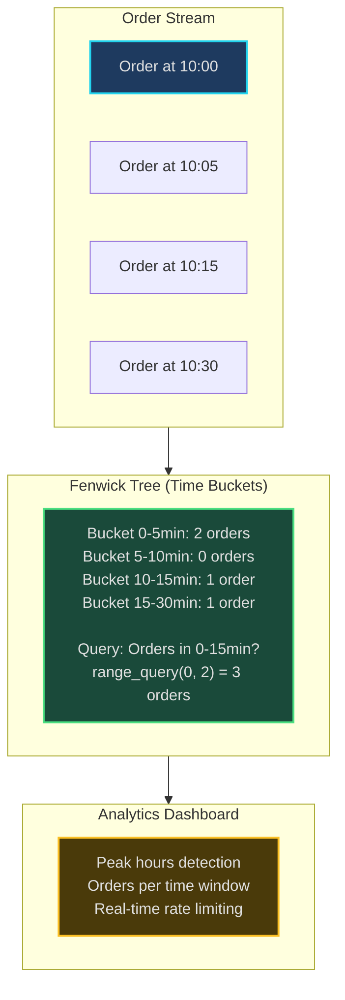
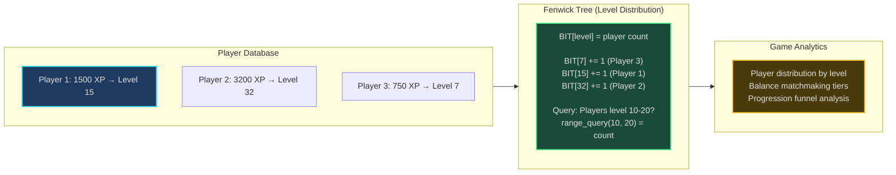

# Fenwick Tree (Binary Indexed Tree) - Senior Engineer Thoughts

*The 4-stage mental pipeline: Problem → Pattern → Structure → Behavior → Code*

---

## Stage 1: Problem → Pattern (Recognition)

> "Fenwick Tree is my reach when I see **'prefix sum with updates'**, **'range sum with modifications'**, or **'cumulative frequency queries'**. The trigger: do I need both fast queries AND fast updates on cumulative data?"

**Recognition keywords:**
- "**Range sum query with point updates**"
- "**Prefix sum** but array changes"
- "**Cumulative frequency**" with modifications
- "**Dynamic prefix sums**"
- "**Inversion count**" with insertions
- "**Order statistics**" with updates
- "**2D range sum** with point updates"

**Mental model:**
> "Fenwick Tree (BIT) is a tree encoded in an array that maintains prefix sums with O(log n) updates and queries. It uses binary representation of indices to skip sections of the array. Think of it as a 'smart' prefix sum that doesn't need to rebuild everything when one element changes."

**Key insight:**
> "The bit manipulation trick: `i & -i` gives the lowest set bit. This tells us how many elements this index 'covers' in the tree. Fenwick exploits binary structure to update and query logarithmically."

**Fenwick vs Segment Tree:**
> "Use Fenwick when you need prefix sums/cumulative queries with updates. Use Segment Tree when you need arbitrary range queries (not just prefix) or non-reversible operations like min/max. Fenwick is simpler, uses less space (n vs 4n), and has better constants."

---

## Stage 2: Pattern → Structure (What do I need?)

**Structure inventory:**
- **BIT array**: Size n+1 (1-indexed makes math easier)
- **Original array**: Optional, if you need to query individual elements
- **Index manipulation**: Two operations:
  - **Parent/next**: `i + (i & -i)` - climb tree during update
  - **Remove LSB**: `i - (i & -i)` - descend tree during query

**Binary insight:**
> "Index i in BIT stores sum of `(i & -i)` elements ending at i. Example: BIT[12] (binary 1100) stores sum of 4 elements (indices 9-12). The lowest set bit tells you the range size."

**Space-time tradeoff:**
- **Space**: O(n) - just one array
- **Update**: O(log n) - flip at most log n bits
- **Query**: O(log n) - sum at most log n ranges
- **Build**: O(n log n) or O(n) with optimization

**Comparison with alternatives:**

| Operation | Prefix Sum Array | Fenwick Tree | Segment Tree |
|-----------|------------------|--------------|--------------|
| Build | O(n) | O(n log n) | O(n) |
| Point Update | O(n) | O(log n) | O(log n) |
| Prefix Query | O(1) | O(log n) | O(log n) |
| Range Query | O(1) | O(log n) | O(log n) |
| Space | O(n) | O(n) | O(4n) |
| Code Complexity | Simple | Medium | Complex |

> "If no updates: use prefix sum array. If updates AND range queries: Fenwick for prefix-based, Segment Tree for arbitrary ranges."

---

## Stage 3: Structure → Behavior (How does it move?)

**Update operation (add delta to index i):**
```
def update(i, delta):
    while i <= n:
        tree[i] += delta
        i += (i & -i)  # Move to next index that covers this one
```

> "Update climbs the tree. Starting at index i, add delta, then jump to the next index that includes i in its range. The jump is `i + (i & -i)`. This touches O(log n) nodes."

**Query operation (prefix sum [1..i]):**
```
def query(i):
    sum = 0
    while i > 0:
        sum += tree[i]
        i -= (i & -i)  # Remove lowest set bit
    return sum
```

> "Query descends the tree. Starting at index i, accumulate value, then jump to the previous range that doesn't overlap. The jump is `i - (i & -i)`. This touches O(log n) nodes."

**Range query [L, R]:**
```
def range_query(L, R):
    return query(R) - query(L - 1)
```

> "Range sum uses prefix sum property: sum[L..R] = sum[1..R] - sum[1..L-1]. This is why Fenwick excels at prefix-based queries."

**The bit manipulation magic:**
```
i & -i isolates the lowest set bit

Examples:
12 = 1100 (binary)
-12 = ...11110100 (two's complement)
12 & -12 = 0100 = 4

So BIT[12] covers 4 elements

6 = 0110
-6 = ...11111010
6 & -6 = 0010 = 2

So BIT[6] covers 2 elements
```

**Visual: Update path for index 5:**
```
Start: 5 (binary 0101)
5 + (5 & -5) = 5 + 1 = 6 (binary 0110)
6 + (6 & -6) = 6 + 2 = 8 (binary 1000)
8 + (8 & -8) = 8 + 8 = 16 (binary 10000)
...
```

**Visual: Query path for index 7:**
```
Start: 7 (binary 0111)
7 - (7 & -7) = 7 - 1 = 6 (binary 0110)
6 - (6 & -6) = 6 - 2 = 4 (binary 0100)
4 - (4 & -4) = 4 - 4 = 0 (stop)

Sum = tree[7] + tree[6] + tree[4]
```

**Key invariant:**
> "Each index i in BIT stores the sum of a range of size (i & -i), ending at position i. Update propagates upward to all indices that include i. Query accumulates downward along non-overlapping ranges."

---

## Visual Model

### Fenwick Tree Structure



### Update Operation Visual



### Query Operation Visual



### Range Query Example



---

## Stage 4: Behavior → Code (Expression)

### Verbose Form: 1-Indexed Fenwick Tree

```python
from typing import List

class FenwickTree:
    def __init__(self, n: int):
        """Initialize Fenwick Tree with n elements (1-indexed)."""
        self.n = n
        self.tree: List[int] = [0] * (n + 1)  # 1-indexed

    def _get_lowest_set_bit(self, i: int) -> int:
        """Get the lowest set bit of i (i & -i)."""
        return i & -i

    def _get_next_update_index(self, i: int) -> int:
        """Get next index to update in the tree."""
        return i + self._get_lowest_set_bit(i)

    def _get_next_query_index(self, i: int) -> int:
        """Get next index to query in the tree."""
        return i - self._get_lowest_set_bit(i)

    def _is_valid_index(self, i: int) -> bool:
        """Check if index is within bounds."""
        return 1 <= i <= self.n

    def _propagate_update(self, i: int, delta: int):
        """Propagate update upward through the tree."""
        while i <= self.n:
            self.tree[i] += delta
            i = self._get_next_update_index(i)

    def update(self, i: int, delta: int):
        """Add delta to element at index i (1-indexed)."""
        if not self._is_valid_index(i):
            raise IndexError(f"Index {i} out of bounds [1, {self.n}]")
        self._propagate_update(i, delta)

    def _accumulate_prefix_sum(self, i: int) -> int:
        """Accumulate prefix sum from index 1 to i."""
        total = 0
        while i > 0:
            total += self.tree[i]
            i = self._get_next_query_index(i)
        return total

    def query(self, i: int) -> int:
        """Get prefix sum from index 1 to i (1-indexed)."""
        if not self._is_valid_index(i):
            raise IndexError(f"Index {i} out of bounds [1, {self.n}]")
        return self._accumulate_prefix_sum(i)

    def _get_range_prefix_before(self, left: int) -> int:
        """Get prefix sum before the range starts."""
        if left == 1:
            return 0
        return self.query(left - 1)

    def range_query(self, left: int, right: int) -> int:
        """Get sum of elements from index left to right (1-indexed)."""
        if not (self._is_valid_index(left) and self._is_valid_index(right)):
            raise IndexError("Range indices out of bounds")
        if left > right:
            raise ValueError("Left index must be <= right index")

        return self.query(right) - self._get_range_prefix_before(left)

    def build_from_array(self, arr: List[int]):
        """Build BIT from array (1-indexed construction)."""
        if len(arr) != self.n:
            raise ValueError(f"Array length {len(arr)} != BIT size {self.n}")

        for i in range(self.n):
            self.update(i + 1, arr[i])
```

### Terse Form: 1-Indexed Fenwick Tree

```python
class FenwickTree:
    def __init__(self, n: int):
        self.n = n
        self.tree = [0] * (n + 1)

    def update(self, i: int, delta: int):
        """Add delta to index i (1-indexed)."""
        while i <= self.n:
            self.tree[i] += delta
            i += i & -i

    def query(self, i: int) -> int:
        """Prefix sum [1..i]."""
        total = 0
        while i > 0:
            total += self.tree[i]
            i -= i & -i
        return total

    def range_query(self, left: int, right: int) -> int:
        """Sum [left..right]."""
        return self.query(right) - self.query(left - 1)
```

### Terse Form: 0-Indexed Fenwick Tree

```python
class FenwickTree:
    def __init__(self, n: int):
        self.n = n
        self.tree = [0] * (n + 1)

    def update(self, i: int, delta: int):
        """Add delta to 0-indexed position i."""
        i += 1  # Convert to 1-indexed
        while i <= self.n:
            self.tree[i] += delta
            i += i & -i

    def query(self, i: int) -> int:
        """Prefix sum [0..i] (0-indexed)."""
        i += 1  # Convert to 1-indexed
        total = 0
        while i > 0:
            total += self.tree[i]
            i -= i & -i
        return total

    def range_query(self, left: int, right: int) -> int:
        """Sum [left..right] (0-indexed)."""
        if left == 0:
            return self.query(right)
        return self.query(right) - self.query(left - 1)
```

### Advanced: 2D Fenwick Tree

```python
class FenwickTree2D:
    def __init__(self, rows: int, cols: int):
        self.rows = rows
        self.cols = cols
        self.tree = [[0] * (cols + 1) for _ in range(rows + 1)]

    def update(self, row: int, col: int, delta: int):
        """Update 2D BIT (1-indexed)."""
        i = row
        while i <= self.rows:
            j = col
            while j <= self.cols:
                self.tree[i][j] += delta
                j += j & -j
            i += i & -i

    def query(self, row: int, col: int) -> int:
        """Query 2D prefix sum [1..row][1..col]."""
        total = 0
        i = row
        while i > 0:
            j = col
            while j > 0:
                total += self.tree[i][j]
                j -= j & -j
            i -= i & -i
        return total

    def range_query(self, r1: int, c1: int, r2: int, c2: int) -> int:
        """Query rectangle sum (1-indexed, inclusive)."""
        return (
            self.query(r2, c2)
            - self.query(r1 - 1, c2)
            - self.query(r2, c1 - 1)
            + self.query(r1 - 1, c1 - 1)
        )
```

### Usage Example: Range Sum with Updates

```python
# Initialize BIT for array [3, 2, -1, 6, 5, 4, -3, 3]
n = 8
bit = FenwickTree(n)
arr = [3, 2, -1, 6, 5, 4, -3, 3]

# Build from array
for i in range(n):
    bit.update(i + 1, arr[i])  # 1-indexed

# Query prefix sum [1..5]
print(bit.query(5))  # 3+2+(-1)+6+5 = 15

# Query range sum [3..6]
print(bit.range_query(3, 6))  # (-1)+6+5+4 = 14

# Update: add 7 to index 4 (1-indexed)
bit.update(4, 7)  # arr[3] = 6 + 7 = 13

# Query again
print(bit.range_query(3, 6))  # (-1)+13+5+4 = 21
```

---

## Real World Use Cases

> "Fenwick Trees power dynamic ranking systems, real-time analytics, and any system needing fast updates on cumulative data."

### 1. **Leaderboard Systems - Dynamic Rank Queries**

**System Architecture:**


**Why Fenwick Tree?**
> "Game leaderboards (Clash of Clans, competitive games) need 'what's my rank?' queries. Discretize scores into buckets. BIT[i] = count of players in bucket i. Rank = query(my_bucket) = players below me. When player scores: update(old_bucket, -1), update(new_bucket, +1). O(log n) instead of O(n) linear scan or full re-sort."

**Real-world usage:**
- **Clash of Clans**: Trophy-based ranking
- **Chess.com/Lichess**: Elo rating leaderboards
- **Competitive programming**: CodeForces, TopCoder rankings
- **MMO games**: PvP ladders

---

### 2. **Inventory Management - Stock Level Queries**

**System Architecture:**


**Why Fenwick Tree?**
> "Supply chain systems (Amazon fulfillment, Shopify inventory) track stock across warehouses. BIT[i] = inventory at warehouse i. Query: total stock in region (warehouses 5-20) = range_query(5, 20). Update: shipment from warehouse 10 = update(10, -quantity). O(log n) for both."

**Real-world usage:**
- **Amazon**: Multi-warehouse inventory aggregation
- **Shopify**: Variant stock tracking across locations
- **Walmart**: Regional stock queries
- **Alibaba**: Cross-warehouse availability checks

---

### 3. **Network Analytics - Bandwidth Monitoring**

**System:**
- **Problem**: Track cumulative bandwidth usage across time intervals with live updates
- **Structure**: BIT where index = time bucket, value = bandwidth used
- **Behavior**:
  - Query: "Bandwidth in last hour" = range_query(now-60, now)
  - Update: New packet → update(current_minute, packet_size)
- **Tool**: Network monitoring (Datadog, Prometheus, Grafana)

> "Network monitoring tools track bandwidth over sliding windows. BIT stores per-minute bandwidth. Dashboard query 'last hour usage': range_query for 60-minute window. As new packets arrive: update current minute. O(log n) updates don't block queries."

**Real-world usage:**
- **Datadog**: Network monitoring dashboards
- **Prometheus + Grafana**: Time-series metrics
- **AWS CloudWatch**: Bandwidth metrics
- **New Relic**: Application performance monitoring

---

### 4. **E-commerce - Order Frequency Analysis**

**System Architecture:**


**Why Fenwick Tree?**
> "E-commerce analytics: 'How many orders in last 15 minutes?' Bucket orders by time. BIT[i] = order count in bucket i. Query any time window: range_query. New order: update(current_bucket, 1). Used for surge detection, dynamic pricing, capacity planning."

**Real-world usage:**
- **Shopify**: Real-time order analytics
- **Stripe**: Payment volume monitoring
- **DoorDash**: Order density heatmaps
- **Uber Eats**: Demand forecasting

---

### 5. **Finance - Portfolio Position Tracking**

**System:**
- **Problem**: Track cumulative position sizes across price levels (limit orders)
- **Structure**: BIT where index = price level, value = share quantity
- **Behavior**:
  - Query: "Total shares bid above price X" = range_query(X, MAX)
  - Update: New limit order = update(price_level, quantity)
- **Tool**: Trading platforms, order book management

> "Trading systems (Interactive Brokers, Robinhood) maintain order books. BIT tracks limit orders by price level. Query 'total liquidity in range $100-$110' = range_query. Order placed/canceled: update. HFT systems need microsecond updates - Fenwick's O(log n) is critical."

**Real-world usage:**
- **Interactive Brokers**: Order book aggregation
- **Coinbase Pro**: Cryptocurrency order depth
- **Bloomberg Terminal**: Liquidity analysis
- **Binance**: Futures order book

---

### 6. **Gaming - Experience Points & Level Distribution**

**System Architecture:**


**Why Fenwick Tree?**
> "MMOs track player level distribution for matchmaking and analytics. BIT[level] = player count. When player levels up: update(old_level, -1), update(new_level, +1). Query for balanced PvP: 'How many players level 40-50?' = range_query(40, 50). O(log n) keeps matchmaking fast."

---

### Why This Matters for Full-Stack Engineers

> "Fenwick Trees are my dynamic cumulative data structure:"

- **Backend**: Real-time ranking, analytics APIs, rate limiting buckets
- **Databases**: Index-based aggregations, materialized view maintenance
- **Analytics**: Time-series queries, histogram updates, percentile tracking
- **Gaming**: Leaderboards, ELO ratings, matchmaking tiers
- **Finance**: Order books, portfolio aggregations, risk metrics
- **Monitoring**: Metric rollups, alert thresholds, SLA tracking

> "The pattern: if I have prefix-sum-style queries but data changes frequently, Fenwick beats static prefix sum arrays. O(log n) updates instead of O(n) rebuild."

---

## Self-Check Questions

1. **Can I explain the bit manipulation?** i & -i gives lowest set bit, determining range size.
2. **Can I trace an update?** Climb tree via i += (i & -i).
3. **Can I trace a query?** Descend tree via i -= (i & -i).
4. **Do I know when to use Fenwick vs Segment Tree?** Fenwick for prefix/cumulative, Segment for arbitrary ranges.
5. **Can I identify Fenwick in production?** Leaderboards, analytics, inventory, order books.

---

## Common Fenwick Tree Patterns

- **Dynamic range sum**: Classic use case - range_query(L, R) with updates
- **Inversion count**: Count pairs (i,j) where i<j but arr[i]>arr[j]
- **2D range sum**: 2D BIT for matrix queries with point updates
- **Order statistics**: Kth smallest with updates (binary search + BIT)
- **Multiple BITs**: Maintain multiple properties (sum, max via BIT tricks)

**1D vs 2D BIT:**
> "2D Fenwick for 2D range sum queries with point updates. Each dimension adds O(log n), so 2D operations are O(log² n). Still better than O(n²) naive approach."

**When NOT to use Fenwick:**
> "If no updates: use prefix sum array (O(1) query). If need arbitrary range min/max (not sum): use Segment Tree. Fenwick is for reversible cumulative operations (sum, XOR) with updates."

**Range update, point query:**
> "Reverse problem: range updates but query single elements. Use difference array + Fenwick: update(L, delta), update(R+1, -delta). Query single element = prefix sum at that index. O(log n) range update!"

---

## Advanced Techniques

### Binary Search on Fenwick Tree

```python
def find_kth_element(bit: FenwickTree, k: int) -> int:
    """
    Find index with k-th smallest cumulative sum.
    Requires BIT to store non-negative values.
    """
    n = bit.n
    pos = 0
    bit_mask = 1 << (n.bit_length() - 1)  # Highest power of 2 <= n

    while bit_mask > 0:
        if pos + bit_mask <= n and bit.tree[pos + bit_mask] < k:
            k -= bit.tree[pos + bit_mask]
            pos += bit_mask
        bit_mask >>= 1

    return pos + 1  # 1-indexed
```

### Range Update, Point Query

```python
class RangeUpdateBIT:
    """Fenwick Tree optimized for range updates, point queries."""

    def __init__(self, n: int):
        self.bit = FenwickTree(n)

    def range_update(self, left: int, right: int, delta: int):
        """Add delta to range [left, right]. O(log n)"""
        self.bit.update(left, delta)
        if right + 1 <= self.bit.n:
            self.bit.update(right + 1, -delta)

    def point_query(self, i: int) -> int:
        """Get value at index i. O(log n)"""
        return self.bit.query(i)
```

---

## LeetCode Practice Problems

| # | Problem | Difficulty |
|---|---------|------------|
| 307 | [Range Sum Query - Mutable](https://leetcode.com/problems/range-sum-query-mutable/) | Medium |
| 315 | [Count of Smaller Numbers After Self](https://leetcode.com/problems/count-of-smaller-numbers-after-self/) | Medium |
| 327 | [Count of Range Sum](https://leetcode.com/problems/count-of-range-sum/) | Medium |
| 406 | [Queue Reconstruction by Height](https://leetcode.com/problems/queue-reconstruction-by-height/) | Medium |
| 493 | [Reverse Pairs](https://leetcode.com/problems/reverse-pairs/) | Medium |
| 673 | [Number of Longest Increasing Subsequence](https://leetcode.com/problems/number-of-longest-increasing-subsequence/) | Medium |
| 1409 | [Queries on a Permutation With Key](https://leetcode.com/problems/queries-on-a-permutation-with-key/) | Medium |
| 1649 | [Create Sorted Array through Instructions](https://leetcode.com/problems/create-sorted-array-through-instructions/) | Medium |
| 2179 | [Count Good Triplets in an Array](https://leetcode.com/problems/count-good-triplets-in-an-array/) | Medium |
| 2250 | [Count Number of Rectangles Containing Each Point](https://leetcode.com/problems/count-number-of-rectangles-containing-each-point/) | Medium |
| 2659 | [Make Array Empty](https://leetcode.com/problems/make-array-empty/) | Medium |
| 308 | [Range Sum Query 2D - Mutable](https://leetcode.com/problems/range-sum-query-2d-mutable/) | Hard |
| 315 | [Count of Smaller Numbers After Self](https://leetcode.com/problems/count-of-smaller-numbers-after-self/) | Hard |
| 327 | [Count of Range Sum](https://leetcode.com/problems/count-of-range-sum/) | Hard |
| 493 | [Reverse Pairs](https://leetcode.com/problems/reverse-pairs/) | Hard |
| 699 | [Falling Squares](https://leetcode.com/problems/falling-squares/) | Hard |
| 1505 | [Minimum Possible Integer After at Most K Adjacent Swaps On Digits](https://leetcode.com/problems/minimum-possible-integer-after-at-most-k-adjacent-swaps-on-digits/) | Hard |
| 1714 | [Sum Of Special Evenly-Spaced Elements In Array](https://leetcode.com/problems/sum-of-special-evenly-spaced-elements-in-array/) | Hard |
| 2424 | [Longest Uploaded Prefix](https://leetcode.com/problems/longest-uploaded-prefix/) | Hard |

---
