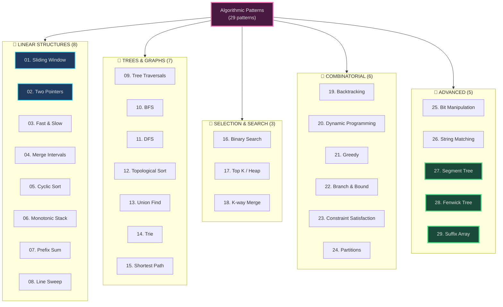
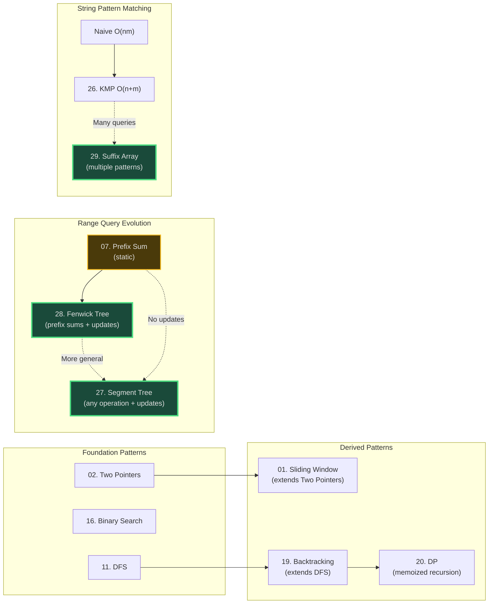

# Pattern Library - Master Algorithmic Thinking Through Internal Monologue

*Reverse-engineering expertise: Learning by observing how senior engineers think through patterns*

---

## The 4-Stage Mental Pipeline

Every pattern follows the same cognitive progression:

1. **Problem → Pattern** (Recognition): What triggers map problem keywords to this pattern?
2. **Pattern → Structure** (What do I need?): What data structures, pointers, state variables?
3. **Structure → Behavior** (How does it move?): What are the movement rules, invariants, termination conditions?
4. **Behavior → Code** (Expression): Verbose form first (proof of understanding), then terse form (interview ready)

---

## 📚 Pattern Files (29 Total)

**NEW**: Each pattern now includes a **code-to-visual mapping** companion file following the [CODE_MAPPING_GUIDE](../../../world/forge-prep/docs/forge/visual-interpretations/CODE_MAPPING_GUIDE.md) methodology for sticky learning.

### 📏 LINEAR STRUCTURES (8 patterns)

| # | Pattern | Description | Files | Status |
|---|---------|-------------|-------|--------|
| 01 | [Sliding Window](./01-sliding-window/) | Contiguous subsequence optimization | [Pattern](./01-sliding-window/01-sliding-window.md) · [Code Map](./01-sliding-window/01-sliding-window-code-map.md) | ✅ COMPLETE |
| 02 | [Two Pointers](./02-two-pointers/) | Sorted input, pairs/triplets | [Pattern](./02-two-pointers/02-two-pointers.md) · [Code Map](./02-two-pointers/02-two-pointers-code-map.md) | ✅ COMPLETE |
| 03 | [Fast & Slow Pointers](./03-fast-slow-pointers/) | Cycle detection | [Pattern](./03-fast-slow-pointers/03-fast-slow-pointers.md) · [Code Map](./03-fast-slow-pointers/03-fast-slow-pointers-code-map.md) | ✅ COMPLETE |
| 04 | [Merge Intervals](./04-merge-intervals/) | Overlapping ranges | [Pattern](./04-merge-intervals/04-merge-intervals.md) · [Code Map](./04-merge-intervals/04-merge-intervals-code-map.md) | ✅ COMPLETE |
| 05 | [Cyclic Sort](./05-cyclic-sort/) | [1..n] in-place sorting | [Pattern](./05-cyclic-sort/05-cyclic-sort.md) · [Code Map](./05-cyclic-sort/05-cyclic-sort-code-map.md) | ✅ COMPLETE |
| 06 | [Monotonic Stack](./06-monotonic-stack/) | Next greater/smaller | [Pattern](./06-monotonic-stack/06-monotonic-stack.md) · [Code Map](./06-monotonic-stack/06-monotonic-stack-code-map.md) | ✅ COMPLETE |
| 07 | [Prefix Sum](./07-prefix-sum/) | Static range queries | [Pattern](./07-prefix-sum/07-prefix-sum.md) · [Code Map](./07-prefix-sum/07-prefix-sum-code-map.md) | ✅ COMPLETE |
| 08 | [Line Sweep](./08-line-sweep/) | Event-based intervals | [Pattern](./08-line-sweep/08-line-sweep.md) · [Code Map](./08-line-sweep/08-line-sweep-code-map.md) | ✅ COMPLETE |

### 🌳 TREES & GRAPHS (7 patterns)

| # | Pattern | Description | Files | Status |
|---|---------|-------------|-------|--------|
| 09 | [Tree Traversals](./09-tree-traversals/) | Pre/In/Post-Order DFS | [Pattern](./09-tree-traversals/09-tree-traversals.md) · [Code Map](./09-tree-traversals/09-tree-traversals-code-map.md) | ✅ COMPLETE |
| 10 | [BFS](./10-bfs/) | Level-order, shortest path | [Pattern](./10-bfs/10-bfs.md) · [Code Map](./10-bfs/10-bfs-code-map.md) | ✅ COMPLETE |
| 11 | [DFS](./11-dfs/) | Exhaustive search | [Pattern](./11-dfs/11-dfs.md) · [Code Map](./11-dfs/11-dfs-code-map.md) | ✅ COMPLETE |
| 12 | [Topological Sort](./12-topological-sort/) | DAG ordering | [Pattern](./12-topological-sort/12-topological-sort.md) · [Code Map](./12-topological-sort/12-topological-sort-code-map.md) | ✅ COMPLETE |
| 13 | [Union Find](./13-union-find/) | Connected components | [Pattern](./13-union-find/13-union-find.md) · [Code Map](./13-union-find/13-union-find-code-map.md) | ✅ COMPLETE |
| 14 | [Trie](./14-trie/) | Prefix matching | [Pattern](./14-trie/14-trie.md) · [Code Map](./14-trie/14-trie-code-map.md) | ✅ COMPLETE |
| 15 | [Shortest Path](./15-shortest-path/) | Dijkstra, Bellman-Ford | [Pattern](./15-shortest-path/15-shortest-path.md) · [Code Map](./15-shortest-path/15-shortest-path-code-map.md) | ✅ COMPLETE |

### 🎯 SELECTION & SEARCH (3 patterns)

| # | Pattern | Description | Files | Status |
|---|---------|-------------|-------|--------|
| 16 | [Binary Search](./16-binary-search/) | Sorted data O(log n) | [Pattern](./16-binary-search/16-binary-search.md) · [Code Map](./16-binary-search/16-binary-search-code-map.md) | ✅ COMPLETE |
| 17 | [Top K / Heap](./17-top-k-heap/) | Priority, streaming | [Pattern](./17-top-k-heap/17-top-k-heap.md) · [Code Map](./17-top-k-heap/17-top-k-heap-code-map.md) | ✅ COMPLETE |
| 18 | [K-way Merge](./18-k-way-merge/) | Sorted lists merge | [Pattern](./18-k-way-merge/18-k-way-merge.md) · [Code Map](./18-k-way-merge/18-k-way-merge-code-map.md) | ✅ COMPLETE |

### 🔀 COMBINATORIAL & OPTIMIZATION (6 patterns)

| # | Pattern | Description | Files | Status |
|---|---------|-------------|-------|--------|
| 19 | [Backtracking](./19-backtracking/) | Exhaustive + pruning | [Pattern](./19-backtracking/19-backtracking.md) · [Code Map](./19-backtracking/19-backtracking-code-map.md) | ✅ COMPLETE |
| 20 | [Dynamic Programming](./20-dynamic-programming/) | Overlapping subproblems | [Pattern](./20-dynamic-programming/20-dynamic-programming.md) · [Code Map](./20-dynamic-programming/20-dynamic-programming-code-map.md) | ✅ COMPLETE |
| 21 | [Greedy](./21-greedy/) | Local → global optimal | [Pattern](./21-greedy/21-greedy.md) · [Code Map](./21-greedy/21-greedy-code-map.md) | ✅ COMPLETE |
| 22 | [Branch & Bound](./22-branch-and-bound/) | Optimization + pruning | [Pattern](./22-branch-and-bound/22-branch-and-bound.md) · [Code Map](./22-branch-and-bound/22-branch-and-bound-code-map.md) | ✅ COMPLETE |
| 23 | [Constraint Satisfaction](./23-constraint-satisfaction/) | Variables + domains | [Pattern](./23-constraint-satisfaction/23-constraint-satisfaction.md) · [Code Map](./23-constraint-satisfaction/23-constraint-satisfaction-code-map.md) | ✅ COMPLETE |
| 24 | [Partitions](./24-partitions/) | Equal sum splits | [Pattern](./24-partitions/24-partitions.md) · [Code Map](./24-partitions/24-partitions-code-map.md) | ✅ COMPLETE |

### 🔧 ADVANCED TECHNIQUES (2 patterns)

| # | Pattern | Description | Files | Status |
|---|---------|-------------|-------|--------|
| 25 | [Bit Manipulation](./25-bit-manipulation/) | Bitwise operations | [Pattern](./25-bit-manipulation/25-bit-manipulation.md) · [Code Map](./25-bit-manipulation/25-bit-manipulation-code-map.md) | ✅ COMPLETE |
| 26 | [String Matching](./26-string-matching/) | KMP, Rabin-Karp | [Pattern](./26-string-matching/26-string-matching.md) · [Code Map](./26-string-matching/26-string-matching-code-map.md) | ✅ COMPLETE |

### 📊 ADVANCED DATA STRUCTURES (3 patterns)

| # | Pattern | Description | Files | Status |
|---|---------|-------------|-------|--------|
| 27 | [Segment Tree](./27-segment-tree/) | Range queries + updates | [Pattern](./27-segment-tree/27-segment-tree.md) · [Code Map](./27-segment-tree/27-segment-tree-code-map.md) | ✅ COMPLETE |
| 28 | [Fenwick Tree](./28-fenwick-tree/) | Prefix sums + updates | [Pattern](./28-fenwick-tree/28-fenwick-tree.md) · [Code Map](./28-fenwick-tree/28-fenwick-tree-code-map.md) | ✅ COMPLETE |
| 29 | [Suffix Array](./29-suffix-array/) | Substring matching | [Pattern](./29-suffix-array/29-suffix-array.md) · [Code Map](./29-suffix-array/29-suffix-array-code-map.md) | ✅ COMPLETE |

---

## 🎓 How to Use This Library

### For Learning a New Pattern
1. **Read the pattern file** (01-29) to activate the mental model
2. **Study the code-map file** - connect visual metaphors to actual code (sticky learning!)
3. **Focus on Internal Monologue section** - how to think through problems
4. **Study Thought Narratives** - solving problems as if first time
5. **Practice LeetCode problems** from the pattern file (organized by difficulty)

### For Deep Understanding (Code-to-Visual Mapping)
1. **Start with the visual** - Read pattern file's mermaid diagrams
2. **Read the code** - Study implementation examples in pattern file
3. **Use the code-map** - See exact line-by-line visual-to-code correspondence
4. **Test yourself** - Can you explain code using visual metaphor?
5. **Trace an example** - Step through execution with both visual and code side-by-side

### For Interview Prep
1. **Review Self-Check questions** at top of each pattern
2. **Study Interview Communication Template** - what to say in interviews
3. **Practice Decision Trees** - 5-second pattern recognition
4. **Solve Medium → Hard problems** from LeetCode tables

### For Review
1. **Check Self-Check questions only** - if all checked, skip to next pattern
2. **If any unchecked** - re-read relevant sections
3. **Test yourself**: Can you explain structure + behavior in plain language?

### When Stuck on a Problem
1. **Read pattern keywords** in problem description
2. **Use Decision Trees** to identify the right pattern
3. **Open that pattern file** and read Thought Narratives
4. **Apply the 4-Stage Pipeline** to think through the solution

---

## 🧠 Philosophy

> "Code is just the expression of structure and behavior. If I can't articulate the structure (what exists) and behavior (how it moves) in plain language, I don't understand the pattern—I'm just copying syntax."

**The goal**: **Internalize the thinking process**, not just code templates.

**What makes this different**:
- ❌ Not just code templates
- ❌ Not just problem lists
- ✅ **Thought narratives** - how senior engineers think
- ✅ **Internal monologue** - the self-talk during problem-solving
- ✅ **Pattern recognition** - 5-second trigger mapping
- ✅ **Interview communication** - what to say out loud

---

## 🗺️ Pattern Concept Tree

A visual mental model of how patterns relate:



---

## 🔍 Decision Tree: Which Pattern to Use?

**Use this for 5-second pattern recognition:**

```mermaid
flowchart TD
    Start{Problem Type?}

    Start -->|Array/String| Array
    Start -->|Tree/Graph| Graph
    Start -->|Optimization| Opt
    Start -->|Range Queries| Range

    Array{Array Pattern?}
    Array -->|Contiguous subarray| SW["01. Sliding Window"]
    Array -->|Two elements, sorted| TP["02. Two Pointers"]
    Array -->|Overlapping intervals| MI["04. Merge Intervals"]
    Array -->|Numbers [1..n]| CS["05. Cyclic Sort"]
    Array -->|Next greater/smaller| MS["06. Monotonic Stack"]
    Array -->|Cumulative sums| PS["07. Prefix Sum"]

    Graph{Graph Pattern?}
    Graph -->|Level-by-level| BFS["10. BFS"]
    Graph -->|All paths| DFS["11. DFS"]
    Graph -->|DAG dependencies| Topo["12. Topological Sort"]
    Graph -->|Connected components| UF["13. Union Find"]
    Graph -->|Shortest path| SP["15. Dijkstra/Bellman-Ford"]
    Graph -->|Prefix strings| Trie["14. Trie"]

    Opt{Optimization Type?}
    Opt -->|Generate all| Back["19. Backtracking"]
    Opt -->|Overlapping subproblems| DP["20. Dynamic Programming"]
    Opt -->|Local → Global optimal| Greedy["21. Greedy"]
    Opt -->|Discrete optimization| BB["22. Branch & Bound"]
    Opt -->|Variables + Constraints| CSP["23. Constraint Satisfaction"]
    Opt -->|Equal sum groups| Part["24. Partitions"]

    Range{Update Pattern?}
    Range -->|Static array| PS["07. Prefix Sum"]
    Range -->|Point updates + range sum| Fenwick["28. Fenwick Tree"]
    Range -->|Range updates + any op| SegTree["27. Segment Tree"]
    Range -->|Pattern matching| Suffix["29. Suffix Array"]

    style Start fill:#4a1942,stroke:#f472b6,stroke-width:3px,color:#e0e0e0
    style SW fill:#1a4a3a,stroke:#4ade80,stroke-width:2px,color:#e0e0e0
    style SegTree fill:#1a4a3a,stroke:#4ade80,stroke-width:3px,color:#e0e0e0
    style Fenwick fill:#1a4a3a,stroke:#4ade80,stroke-width:3px,color:#e0e0e0
    style Suffix fill:#1a4a3a,stroke:#4ade80,stroke-width:3px,color:#e0e0e0
```

---

## 🔗 Pattern Relationships

**How patterns build on each other:**



---

## 📊 Decision Matrices

### Range Query Structures: When to Use What

| Feature | Prefix Sum | Fenwick Tree | Segment Tree |
|---------|------------|--------------|--------------|
| Point Update | ❌ O(n) | ✅ O(log n) | ✅ O(log n) |
| Range Update | ❌ | ❌ | ✅ O(log n) w/ lazy |
| Range Sum Query | ✅ O(1) | ✅ O(log n) | ✅ O(log n) |
| Range Min/Max Query | ❌ | ❌ | ✅ O(log n) |
| Arbitrary Associative Op | ❌ | ❌ | ✅ O(log n) |
| Space Complexity | O(n) | O(n) | O(4n) |
| Code Complexity | Simple | Medium | Complex |
| **Use When** | Read-only | Prefix sums + updates | Any range op + updates |
| **Pattern #** | [07](./07-prefix-sum.md) | [28](./28-fenwick-tree.md) | [27](./27-segment-tree.md) |

### String Pattern Structures: When to Use What

| Feature | Trie | Suffix Array | KMP |
|---------|------|--------------|-----|
| Multiple Patterns | ✅ Prefixes | ✅ Substrings | ❌ Single |
| Build Time | O(total chars) | O(n log n) | O(m) |
| Query Time | O(m) | O(m log n) | O(n) |
| Space | O(alphabet × nodes) | O(n) | O(m) |
| **Use When** | Autocomplete, prefix match | Many substring queries | One-time search |
| **Pattern #** | [14](./14-trie.md) | [29](./29-suffix-array.md) | [26](./26-string-matching.md) |

---

## 🚀 Quick Reference

**Pattern by Number**: [01](./01-sliding-window/) · [02](./02-two-pointers/) · [03](./03-fast-slow-pointers/) · [04](./04-merge-intervals/) · [05](./05-cyclic-sort/) · [06](./06-monotonic-stack/) · [07](./07-prefix-sum/) · [08](./08-line-sweep/) · [09](./09-tree-traversals/) · [10](./10-bfs/) · [11](./11-dfs/) · [12](./12-topological-sort/) · [13](./13-union-find/) · [14](./14-trie/) · [15](./15-shortest-path/) · [16](./16-binary-search/) · [17](./17-top-k-heap/) · [18](./18-k-way-merge/) · [19](./19-backtracking/) · [20](./20-dynamic-programming/) · [21](./21-greedy/) · [22](./22-branch-and-bound/) · [23](./23-constraint-satisfaction/) · [24](./24-partitions/) · [25](./25-bit-manipulation/) · [26](./26-string-matching/) · [27](./27-segment-tree/) · [28](./28-fenwick-tree/) · [29](./29-suffix-array/)

**By Category**:
- 📏 **Linear**: [01-08](./01-sliding-window/)
- 🌳 **Trees & Graphs**: [09-15](./09-tree-traversals/)
- 🎯 **Search**: [16-18](./16-binary-search/)
- 🔀 **Combinatorial**: [19-24](./19-backtracking/)
- 🔧 **Advanced**: [25-29](./25-bit-manipulation/)

---

## 🧭 Navigation

**↑ Back**: [Library 2025](../../README.md)

**→ Related**:
- [Learning Methodology](../overview/learning-methodology.html) - How to study
- [Visual Shapes](../shapes/) - Core algorithm shapes
- [Applications](../../applications/) - Multi-pattern projects

**⚡ Start Learning**: [01. Sliding Window](./01-sliding-window/) ([Pattern](./01-sliding-window/01-sliding-window.md) · [Code Map](./01-sliding-window/01-sliding-window-code-map.md))
